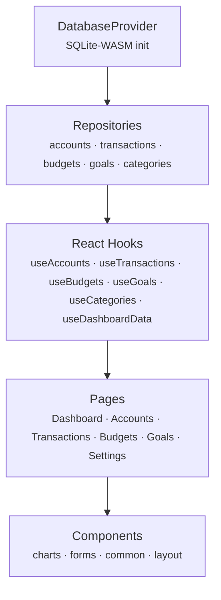

# @finance/web

Progressive Web App (PWA) for the Finance multi-platform financial tracking application.
Built with React, TypeScript, and Vite — consuming shared KMP business logic and
persisting all data locally in SQLite-WASM.

## Table of Contents

- [Architecture Overview](#architecture-overview)
- [Directory Structure](#directory-structure)
- [Data Layer](#data-layer)
- [Hooks](#hooks)
- [Pages](#pages)
- [Components](#components)
- [Development](#development)
- [KMP Integration](#kmp-integration)
- [Design Tokens](#design-tokens)
- [Accessibility](#accessibility)
- [Security](#security)

## Architecture Overview

The web app uses a local-first architecture. All financial data lives in an
in-browser SQLite database (via SQLite-WASM). Data flows through four layers:

```
DatabaseProvider (SQLite-WASM init + React context)
    │
    ▼
Repositories (typed CRUD operations per entity)
    │
    ▼
React Hooks (state management + loading/error handling)
    │
    ▼
Page Components (UI rendering + user interaction)
```



**Key design decisions:**

- **Local-first** — SQLite-WASM stores all data in OPFS (Origin Private File
  System) with an IndexedDB fallback; the app works fully offline.
- **Soft deletes** — every entity uses a `deleted_at` timestamp instead of hard
  deletes, enabling future sync conflict resolution.
- **Cents-based amounts** — monetary values are stored as integers (cents) to
  avoid floating-point errors.
- **Sync metadata** — each row carries `sync_version` and `is_synced` columns
  in preparation for server sync.

## Directory Structure

```
apps/web/
├── index.html                     # HTML entry point
├── package.json                   # Dependencies & scripts
├── tsconfig.json                  # Strict TypeScript config
├── vite.config.ts                 # Vite bundler configuration
├── vitest.config.ts               # Vitest test runner config
├── vite-env.d.ts                  # Vite client type declarations
├── public/                        # Static assets (copied to dist/)
└── src/
    ├── main.tsx                   # React root with BrowserRouter
    ├── App.tsx                    # Root component with AppLayout shell
    ├── routes.tsx                 # Route definitions (lazy-loaded pages)
    ├── test-setup.ts              # Vitest global test setup
    │
    ├── db/                        # ← Data access layer
    │   ├── DatabaseProvider.tsx   # React context: inits SQLite + provides db
    │   ├── sqlite-wasm.ts         # WASM init, migrations, query helpers
    │   ├── seed.ts                # Development seed data (demo accounts, txns)
    │   ├── wa-sqlite.d.ts         # Type declarations for wa-sqlite
    │   └── repositories/          # Entity-specific CRUD modules
    │       ├── accounts.ts        # Account CRUD + getByType
    │       ├── transactions.ts    # Transaction CRUD + filtering + date ranges
    │       ├── budgets.ts         # Budget CRUD + spending calculations
    │       ├── goals.ts           # Goal CRUD + active/completed queries
    │       ├── categories.ts      # Category CRUD + parent/child queries
    │       ├── helpers.ts         # Row mapping, type coercion, tag serialization
    │       └── index.ts           # Barrel export
    │
    ├── hooks/                     # ← React state management
    │   ├── useAccounts.ts         # Account list + CRUD operations
    │   ├── useTransactions.ts     # Transaction list + rich filtering + CRUD
    │   ├── useBudgets.ts          # Budget list with spending totals + CRUD
    │   ├── useGoals.ts            # Goal list + CRUD operations
    │   ├── useCategories.ts       # Category list + CRUD operations
    │   ├── useDashboardData.ts    # Aggregated financial summary
    │   ├── useOfflineStatus.ts    # Network connectivity detection
    │   └── index.ts               # Barrel export
    │
    ├── pages/                     # ← Route-level components (code-split)
    │   ├── DashboardPage.tsx      # Financial overview + recent transactions
    │   ├── AccountsPage.tsx       # Account list grouped by type + detail view
    │   ├── TransactionsPage.tsx   # Filterable transaction list by date
    │   ├── BudgetsPage.tsx        # Budget cards with progress rings
    │   ├── GoalsPage.tsx          # Savings goal cards with progress bars
    │   ├── SettingsPage.tsx       # Preferences, security, data management
    │   ├── *Page.test.tsx         # Co-located page tests
    │   └── index.ts               # Barrel export
    │
    ├── components/                # ← Reusable UI components
    │   ├── charts/                # Recharts-based financial visualizations
    │   ├── common/                # Shared primitives (spinner, errors, etc.)
    │   ├── forms/                 # CRUD forms for data entry
    │   ├── layout/                # App shell, navigation, focus management
    │   ├── stories/               # Storybook stories
    │   └── OfflineBanner.tsx      # Network status notification
    │
    ├── auth/                      # Authentication layer
    │   ├── auth-context.tsx       # Auth React context + provider
    │   ├── token-storage.ts       # JWT token persistence
    │   └── webauthn.ts            # WebAuthn / passkey helpers
    │
    ├── kmp/                       # KMP integration layer
    │   ├── bridge.ts              # TypeScript interfaces mirroring KMP models
    │   └── README.md              # KMP connection guide
    │
    ├── accessibility/             # Accessibility utilities
    ├── styles/                    # Global CSS and theme styles
    ├── sw/                        # Service worker (offline + background sync)
    └── theme/                     # Design token consumption
        ├── tokens.css             # CSS custom property imports
        └── theme.ts               # TypeScript theme object
```

## Data Layer

### DatabaseProvider (`db/DatabaseProvider.tsx`)

A React context provider that initializes the SQLite-WASM database on mount
and makes it available to the entire component tree via the `useDatabase()` hook.

**Responsibilities:**

- Calls `initDatabase()` to create or open the SQLite database
- Seeds development data on first run (when the `account` table is empty)
- Renders a `LoadingSpinner` while initialization is in progress
- Renders an `ErrorBanner` with a retry button if initialization fails
- Cleans up the database connection on unmount

```tsx
// main.tsx — DatabaseProvider wraps the app
<DatabaseProvider>
  <BrowserRouter>
    <App />
  </BrowserRouter>
</DatabaseProvider>
```

### SQLite-WASM (`db/sqlite-wasm.ts`)

Handles low-level database initialization, storage backend detection, schema
migrations, and exposes typed query helpers.

**Storage backends (auto-detected):**

| Backend   | When Used                                     | Persistence            |
| --------- | --------------------------------------------- | ---------------------- |
| OPFS      | Modern browsers with `createSyncAccessHandle` | Origin Private FS      |
| IndexedDB | Fallback (Firefox < 124, Safari < 17.4, etc.) | IndexedDB object store |

**Migration system:**

Migrations are defined as an ordered array of `Migration` objects. Each has a
`version` number, a `label`, and an array of SQL `up` statements. The runner:

1. Creates a `_migrations` tracking table if it does not exist
2. Reads the current max version
3. Runs each pending migration inside a transaction
4. Records the applied version on success; rolls back on failure

The initial migration (v1) creates all eight tables: `user`, `household`,
`household_member`, `account`, `category`, `transaction`, `budget`, and `goal`.

**Query helpers:**

| Function                        | Purpose                                           |
| ------------------------------- | ------------------------------------------------- |
| `query<T>(db, sql, params?)`    | Execute a SELECT and return typed rows            |
| `queryOne<T>(db, sql, params?)` | Execute a SELECT and return the first row or null |
| `execute(db, sql, params?)`     | Execute a write statement (INSERT/UPDATE/DELETE)  |

### Repositories (`db/repositories/`)

Each repository module provides typed CRUD operations for a single entity.
All repositories follow the same pattern:

- **Column mapping** — a `map*` function converts raw `Row` objects to typed
  interfaces (e.g., `mapAccount`, `mapTransaction`)
- **Soft deletes** — `delete*` functions set `deleted_at` rather than removing rows
- **Sync metadata** — writes set `is_synced = 0` and `sync_version = 1` to
  flag records for future sync
- **UUID primary keys** — `crypto.randomUUID()` generates IDs on the client

| Repository        | Key Functions                                                                                                                                                                                                             |
| ----------------- | ------------------------------------------------------------------------------------------------------------------------------------------------------------------------------------------------------------------------- |
| `accounts.ts`     | `getAllAccounts`, `getAccountById`, `createAccount`, `updateAccount`, `deleteAccount`, `getAccountsByType`                                                                                                                |
| `transactions.ts` | `getAllTransactions`, `getTransactionById`, `createTransaction`, `updateTransaction`, `deleteTransaction`, `getTransactionsByAccount`, `getTransactionsByCategory`, `getTransactionsByDateRange`, `getRecentTransactions` |
| `budgets.ts`      | `getAllBudgets`, `getBudgetById`, `createBudget`, `updateBudget`, `deleteBudget`, `getBudgetsByPeriod`, `getBudgetWithSpending`                                                                                           |
| `goals.ts`        | `getAllGoals`, `getGoalById`, `createGoal`, `updateGoal`, `deleteGoal`, `getActiveGoals`, `getCompletedGoals`                                                                                                             |
| `categories.ts`   | `getAllCategories`, `getCategoryById`, `createCategory`, `updateCategory`, `deleteCategory`, `getCategoriesByParent`, `getRootCategories`                                                                                 |
| `helpers.ts`      | `requireString`, `requireNumber`, `optionalString`, `toBoolean`, `mapCurrency`, `mapCents`, `mapSyncMetadata`, `serializeTags`, `parseTags`, `createLikePattern`                                                          |

### Seed Data (`db/seed.ts`)

Populates the database with realistic demo data when the `account` table is
empty. Runs inside a single transaction for atomicity.

**Seed data includes:**

- 1 demo user + 1 household
- 5 categories (Food, Transport, Housing, Entertainment, Income)
- 4 accounts (Checking, Savings, Credit Card, Cash)
- 20 transactions spanning the past month (income, expenses, transfers)
- 3 monthly budgets (Food, Transport, Entertainment)
- 2 savings goals (Emergency Fund, Vacation)

## Hooks

All entity hooks follow a consistent pattern: they call `useDatabase()` to
access the SQLite instance, load data on mount via a `refreshToken` effect,
and expose CRUD mutation functions that automatically re-fetch after changes.
Errors are captured in state (never thrown), so components can render
loading/error/empty states gracefully.

| Hook                        | Returns                  | Description                                                                                                                                                                                                              |
| --------------------------- | ------------------------ | ------------------------------------------------------------------------------------------------------------------------------------------------------------------------------------------------------------------------ |
| `useAccounts()`             | `UseAccountsResult`      | All non-deleted accounts with `createAccount`, `updateAccount`, `deleteAccount`, and `refresh`.                                                                                                                          |
| `useTransactions(filters?)` | `UseTransactionsResult`  | Filtered transaction list with support for `searchTerm`, `type`, `accountId`, `categoryId`, `startDate`, `endDate`, and `limit`. Includes CRUD mutations. Pass a memoized filter object to avoid unnecessary re-fetches. |
| `useBudgets()`              | `UseBudgetsResult`       | All budgets enriched with `spentAmount` and `remainingAmount` calculated from matching transactions. Includes CRUD mutations.                                                                                            |
| `useGoals()`                | `UseGoalsResult`         | All non-deleted goals ordered by target date. Includes CRUD mutations.                                                                                                                                                   |
| `useCategories()`           | `UseCategoriesResult`    | All non-deleted categories (root and child). Includes CRUD mutations.                                                                                                                                                    |
| `useDashboardData()`        | `UseDashboardDataResult` | Aggregated read-only snapshot: net worth, monthly income/spending, budget progress, recent transactions, and account totals by type.                                                                                     |
| `useOfflineStatus()`        | `OfflineStatus`          | Network connectivity via `navigator.onLine` + `online`/`offline` events. Triggers Background Sync on reconnect.                                                                                                          |

**Common return shape** (entity hooks):

```ts
{
  items: Entity[];       // e.g., accounts, transactions, budgets
  loading: boolean;      // true during initial load or refresh
  error: string | null;  // human-readable error message
  refresh: () => void;   // trigger a re-fetch
  create*: (input) => Entity | null;
  update*: (id, updates) => Entity | null;
  delete*: (id) => boolean;
}
```

## Pages

Each page is lazy-loaded via `React.lazy()` in `routes.tsx` for code splitting.

| Page               | Route           | Hooks Used                                        | Description                                                                                                        |
| ------------------ | --------------- | ------------------------------------------------- | ------------------------------------------------------------------------------------------------------------------ |
| `DashboardPage`    | `/dashboard`    | `useDashboardData`, `useCategories`               | Financial overview with net worth, monthly spending, budget health progress bar, and recent transactions list.     |
| `AccountsPage`     | `/accounts`     | `useAccounts`                                     | Accounts grouped by type (Checking, Savings, etc.) with net worth total. Selecting an account shows a detail view. |
| `TransactionsPage` | `/transactions` | `useTransactions`, `useCategories`, `useAccounts` | Searchable, filterable transaction list grouped by date. Category filter chips for quick filtering.                |
| `BudgetsPage`      | `/budgets`      | `useBudgets`, `useCategories`                     | Budget cards with SVG progress rings showing spent vs. budgeted amounts. Summary section with totals.              |
| `GoalsPage`        | `/goals`        | `useGoals`                                        | Savings goal cards with progress bars, days remaining, and saved/target amounts.                                   |
| `SettingsPage`     | `/settings`     | `useOfflineStatus`, `useAuth`                     | Theme, currency, and notification preferences. Security settings (sign out, passkeys). Sync status indicator.      |

## Components

### Charts (`components/charts/`)

Recharts-based financial visualization components:

| Component          | Purpose                                                   |
| ------------------ | --------------------------------------------------------- |
| `SpendingBarChart` | Bar chart showing spending by category or time period     |
| `TrendLineChart`   | Line chart for income/expense trends over time            |
| `BudgetDonutChart` | Donut chart for budget allocation and usage               |
| `CategoryPieChart` | Pie chart for spending distribution by category           |
| `chart-palette.ts` | Shared color constants and currency formatting for charts |

### Common (`components/common/`)

Shared UI primitives used across all pages:

| Component         | Purpose                                                                    |
| ----------------- | -------------------------------------------------------------------------- |
| `LoadingSpinner`  | Accessible spinner with `role="status"` and configurable label             |
| `ErrorBanner`     | Error message display with an optional retry button                        |
| `EmptyState`      | Placeholder for pages/sections with no data                                |
| `CurrencyDisplay` | Formats cent-based amounts for display with optional colorization and sign |

### Forms (`components/forms/`)

CRUD forms for data entry:

| Component         | Purpose                                                               |
| ----------------- | --------------------------------------------------------------------- |
| `AccountForm`     | Create or edit an account (name, type, currency, balance)             |
| `TransactionForm` | Create or edit a transaction (amount, date, payee, category, account) |

### Layout (`components/layout/`)

App shell and navigation:

| Component           | Purpose                                                     |
| ------------------- | ----------------------------------------------------------- |
| `AppLayout`         | Responsive shell — sidebar on desktop, bottom nav on mobile |
| `SidebarNavigation` | Desktop sidebar with navigation links                       |
| `BottomNavigation`  | Mobile bottom tab bar                                       |
| `FocusManager`      | Manages focus on route transitions for accessibility        |
| `SkipToContent`     | Skip-to-content link for keyboard users                     |

## Development

### Prerequisites

- **Node.js** >= 22.0.0
- **npm** >= 10.x (ships with Node 22)
- Design tokens built (`npm run build:tokens` from repo root)

### Getting Started

From the **repository root** (npm workspaces):

```bash
# 1. Install dependencies
npm install

# 2. Build design tokens (if not already built)
npm run build:tokens

# 3. Start the dev server
npm run dev -w apps/web
```

The app starts at [http://localhost:5173](http://localhost:5173).

On first load, the `DatabaseProvider` initializes SQLite-WASM and seeds the
database with demo data automatically.

### Available Scripts

| Script               | Description                              |
| -------------------- | ---------------------------------------- |
| `npm run dev`        | Start Vite dev server with HMR           |
| `npm run build`      | Type-check + production build to `dist/` |
| `npm run preview`    | Serve the production build locally       |
| `npm run type-check` | Run TypeScript compiler (no emit)        |
| `npm run lint`       | Lint source files with ESLint            |
| `npm run test`       | Run tests with Vitest                    |
| `npm run test:watch` | Run tests in watch mode                  |
| `npm run storybook`  | Launch Storybook component explorer      |
| `npm run clean`      | Remove `dist/` output directory          |

### Building for Production

```bash
npm run build -w apps/web
```

Output is written to `apps/web/dist/`. Serve with any static file server.

See also: [Workflow Cheatsheet](../../docs/guides/workflow-cheatsheet.md)

## KMP Integration

The `src/kmp/bridge.ts` file defines TypeScript interfaces that mirror the
Kotlin Multiplatform (KMP) shared models (`packages/models/`). Key types
consumed by the data layer include `Account`, `Transaction`, `Budget`,
`Goal`, `Category`, `Currency`, `Cents`, and `SyncMetadata`.

See [`src/kmp/README.md`](src/kmp/README.md) for instructions on connecting to
the compiled KMP JS/WASM module.

## Design Tokens

Theme values (colors, spacing, typography, shadows) come from the shared
design token package (`packages/design-tokens/`):

- **CSS custom properties** — imported via `src/theme/tokens.css`
- **TypeScript constants** — exported from `src/theme/theme.ts`

The app respects `prefers-color-scheme`, `prefers-reduced-motion`, and
`prefers-contrast` media queries automatically.

## Accessibility

- Semantic HTML is used as the primary accessibility mechanism
- ARIA attributes are added only when native semantics are insufficient
- All interactive elements are keyboard-accessible
- Focus is managed with visible `:focus-visible` outlines and `FocusManager`
- Skip-to-content link is provided for keyboard users
- Route loading states use `aria-live` regions
- Database loading and error states are communicated via `role="status"`

## Security

- **CSP headers** are configured in `vite.config.ts` (no inline scripts, no `eval`)
- Security headers: `X-Content-Type-Options`, `X-Frame-Options`, `Referrer-Policy`
- Financial data at rest will be encrypted via the Web Crypto API (SubtleCrypto)
- Authentication via WebAuthn/passkeys (see `src/auth/`)
