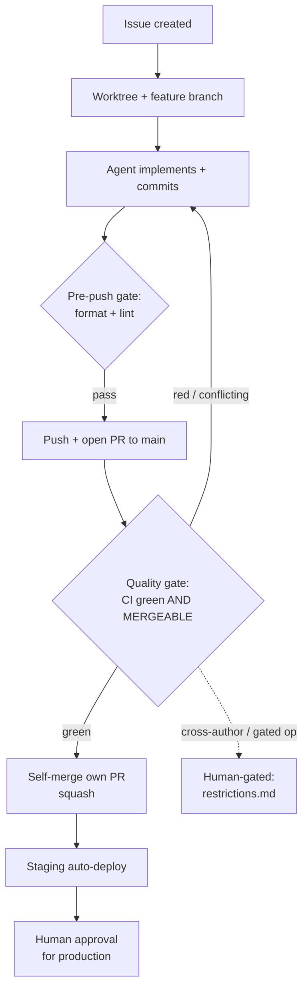

# AI Governance — Finance

This document provides a lightweight governance crosswalk for the Finance project's use of AI, appropriate to a **personal-finance application**. It maps recognized AI-governance frameworks to the **concrete controls that exist in this repository**, and is explicit about gaps.

It complements — and does not replace — the [Responsible AI Framework](responsible-ai.md) (principles and commitments), [Restrictions](restrictions.md) (the human-gating taxonomy), and the [AI Code Policy](ai-code-policy.md) (ownership and copyright).

> **Scope note.** Today, AI is used in Finance's **development process** (GitHub Copilot agents authoring code), **not** as a **product feature**. The product's financial calculations are deterministic — see [Responsible AI § AI in the Product](responsible-ai.md#ai-in-the-product). This document therefore governs the _development-time_ AI practice and pre-positions controls for any future product AI.

## Table of Contents

- [How to Read This](#how-to-read-this)
- [NIST AI RMF Crosswalk](#nist-ai-rmf-crosswalk)
  - [Govern](#govern)
  - [Map](#map)
  - [Measure](#measure)
  - [Manage](#manage)
- [EU AI Act Note](#eu-ai-act-note)
- [Control Inventory (at a glance)](#control-inventory-at-a-glance)
- [Needs Human Action](#needs-human-action)

## How to Read This

Each control is graded:

- **✅ In place** — a real, identifiable artifact or mechanism exists in this repo.
- **🟡 Partial** — exists but advisory, incomplete, or not yet enforced.
- **🔴 Gap** — not yet implemented; tracked in [Needs Human Action](#needs-human-action) where a human/legal decision is required.

This grading is deliberately honest. The strength of an AI-first practice that allows agents to self-merge depends on the controls actually being real — overstating them is itself a risk.

## NIST AI RMF Crosswalk

The [NIST AI Risk Management Framework](https://www.nist.gov/itl/ai-risk-management-framework) organizes AI risk management into four functions: **Govern, Map, Measure, Manage**. Below, each is mapped to this repo.

### Govern

_Cultivate a culture of risk management; define policies, roles, and accountability._

| Control                                             | Status      | Where                                                                |
| --------------------------------------------------- | ----------- | -------------------------------------------------------------------- |
| Documented AI agent policy for all tools            | ✅ In place | [`AGENTS.md`](../../AGENTS.md)                                       |
| Human-gating taxonomy (8 risk categories)           | ✅ In place | [`restrictions.md`](restrictions.md)                                 |
| Responsible-AI principles & commitments             | ✅ In place | [`responsible-ai.md`](responsible-ai.md)                             |
| Code ownership & accountability (human owns commit) | ✅ In place | [`ai-code-policy.md`](ai-code-policy.md)                             |
| Decision log for practice evolution                 | ✅ In place | [`CHANGELOG.md`](CHANGELOG.md)                                       |
| Code ownership routing                              | 🟡 Partial  | `CODEOWNERS` — currently a single human (bus-factor 1)               |
| Separation of duties on security-sensitive paths    | 🔴 Gap      | No path-based required reviewer for `services/api/`, migrations, RLS |

### Map

_Establish context; categorize the AI system and its risks._

| Control                                                    | Status      | Where                                                                                                                  |
| ---------------------------------------------------------- | ----------- | ---------------------------------------------------------------------------------------------------------------------- |
| AI-use context documented (dev-time vs product)            | ✅ In place | [`responsible-ai.md`](responsible-ai.md#ai-in-the-product)                                                             |
| Agent inventory with scoped roles & file ownership         | ✅ In place | [`.github/agents/`](../../.github/agents/), [ownership table](../../AGENTS.md#fleet-coordination-rules)                |
| MCP / external-tool inventory                              | 🟡 Partial  | [`mcp.md`](mcp.md) — under remediation (see audit P0 risks 1–3)                                                        |
| Risk classification for any future product AI features     | 🔴 Gap      | See [EU AI Act Note](#eu-ai-act-note) — requires legal input                                                           |
| Data-flow map confirming financial data never leaves to AI | ✅ In place | [`responsible-ai.md` commitments](responsible-ai.md#commitments), [privacy audit](../architecture/privacy-audit-v1.md) |

### Measure

_Analyze, assess, benchmark, and monitor AI risk._

| Control                                         | Status      | Where                                                                                                                                             |
| ----------------------------------------------- | ----------- | ------------------------------------------------------------------------------------------------------------------------------------------------- |
| Required CI quality gate before merge           | 🟡 Partial  | Branch protection + required checks; **not all** security scans are blocking yet (see [branch-protection.md](../../.github/branch-protection.md)) |
| Workflow metric catalog                         | 🟡 Partial  | [`workflow-metrics.md`](workflow-metrics.md) — values are placeholders; not yet collected                                                         |
| Agent-output eval harness (golden-task scoring) | 🔴 Gap      | Not implemented; a change to an agent prompt/skill has no measurable quality signal                                                               |
| Static analysis / security scanning             | 🟡 Partial  | CodeQL (JS/TS blocking; JVM advisory), secret detection, dependency review — several `continue-on-error`                                          |
| Audit trail of AI contributions                 | ✅ In place | `Co-authored-by: Copilot` trailer + issue/PR history                                                                                              |

### Manage

_Allocate resources to treat risks; respond, recover, communicate._

| Control                                             | Status      | Where                                                                                                                          |
| --------------------------------------------------- | ----------- | ------------------------------------------------------------------------------------------------------------------------------ |
| Branch protection prevents direct writes to `main`  | ✅ In place | [`branch-protection.md`](../../.github/branch-protection.md) (requires human setup)                                            |
| Scoped self-merge (own PRs only) + quality gate     | ✅ In place | [`restrictions.md` § 2](restrictions.md), [Control Environment](responsible-ai.md#the-control-environment)                     |
| CI self-healing loop with escalation                | ✅ In place | [`fleet-operations.md`](fleet-operations.md#ci-monitoring-and-self-healing)                                                    |
| Human revert authority over any merged change       | ✅ In place | Standard git + maintainer access                                                                                               |
| Gated high-risk ops (secrets, schema, releases, $)  | ✅ In place | [`restrictions.md`](restrictions.md) categories 3–8                                                                            |
| Incident-response runbook for **agent misbehavior** | ✅ In place | [`incident-response.md`](incident-response.md) — prompt-injection / secret-exposure / runaway-merge / destructive-op playbooks |
| Production deploys require human approval           | ✅ In place | [`deployment-pipeline.md`](../deployment-pipeline.md) `production` environment                                                 |

## EU AI Act Note

The [EU AI Act](https://artificialintelligenceact.eu/) applies a **risk-based** classification. A plain-language, non-legal reading for this project:

- **Development-time coding assistants** (GitHub Copilot agents writing this app's code) are general-purpose AI tools used internally. They are **not** the regulated "AI system" placed on the market by Finance, and do not by themselves make Finance a provider of a high-risk AI system.
- **The Finance product has no AI features today.** All financial calculations are deterministic. There is currently **no** AI-driven decision affecting users.
- **Credit/creditworthiness scoring is Annex III "high-risk."** Finance **does not** perform credit scoring or creditworthiness evaluation, and introducing it would trigger high-risk obligations (risk management, data governance, transparency, human oversight, logging, conformity assessment).
- **If limited-risk product AI is added later** (e.g., transaction categorization or spending insights), **transparency obligations** likely apply: users must be told they are interacting with AI, outputs must be explainable and overridable, and financial data must not be sent to third-party AI services. These requirements are already pre-committed in [Responsible AI § Future Considerations](responsible-ai.md#future-considerations).

> The classification above is an engineering-level orientation, **not legal advice.** A definitive EU AI Act (and U.S. state-law) classification requires counsel — see [Needs Human Action](#needs-human-action).

## Control Inventory (at a glance)

Every box above maps to a control in the [NIST crosswalk](#nist-ai-rmf-crosswalk). The dashed path is the human-gated escape hatch defined in [`restrictions.md`](restrictions.md).

## Needs Human Action

The following require a human (and, where noted, legal counsel) — agents must not decide these:

1. **Legal AI classification.** Obtain counsel's determination of EU AI Act risk tier (and applicable U.S. state AI laws) for both the development practice and any planned product AI feature. _Owner: human + legal._
2. **Separation of duties.** Expand `CODEOWNERS` beyond a single maintainer and add path-based required reviewers for `services/api/`, database migrations, and RLS policies. _Owner: repo admin._
3. **Harden the quality gate (enable in GitHub).** The always-on **Required Checks Gatekeeper** job and blocking security scans now exist in CI (#2860/#2877); a repo admin must mark the gatekeeper **required** in branch protection and enable "Include administrators" so "CI green" cannot be bypassed. _Owner: repo admin._ See [`branch-protection.md`](../../.github/branch-protection.md).
4. **Finish measurement.** The workflow-metrics collector and the golden-task eval harness are scaffolded (#2865/#2862/#2866); wire the eval `resolveCandidate()` runner and stand up the metrics dashboard. _Owner: ai-ops/data-engineer._
5. **Operationalize the incident-response runbook** — the runbook is authored at [`incident-response.md`](incident-response.md); run a quarterly tabletop drill and keep the incident log current. _Owner: security + ai-ops._
6. **MCP supply-chain risks — resolved (verify).** Fabricated packages were replaced with pinned official ones and `service_role` was removed (#2856/#2857/#2858, shipped). Re-verify pins on each bump. Tracked in [`mcp.md`](mcp.md). _Owner: ai-ops/security._

---

_Last reviewed: 2026-06. Derived from the [AI-Practice Audit (2026-06)](audits/ai-practice-audit-2026-06.md). Update this crosswalk whenever a control's status changes._
