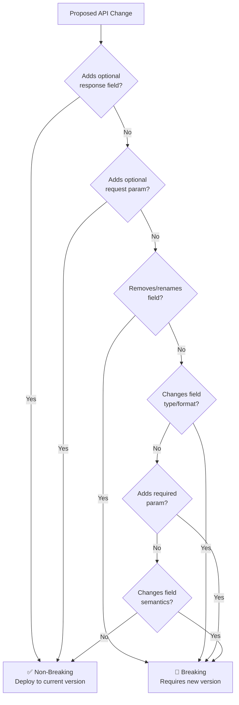
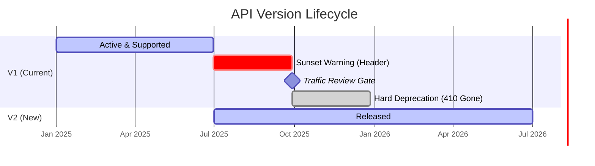
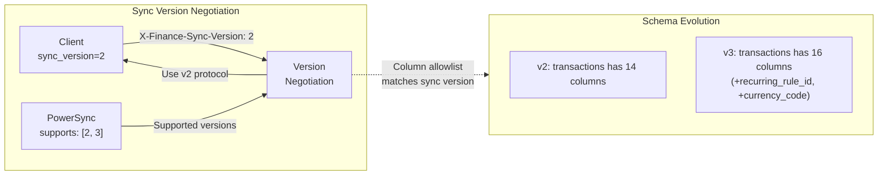
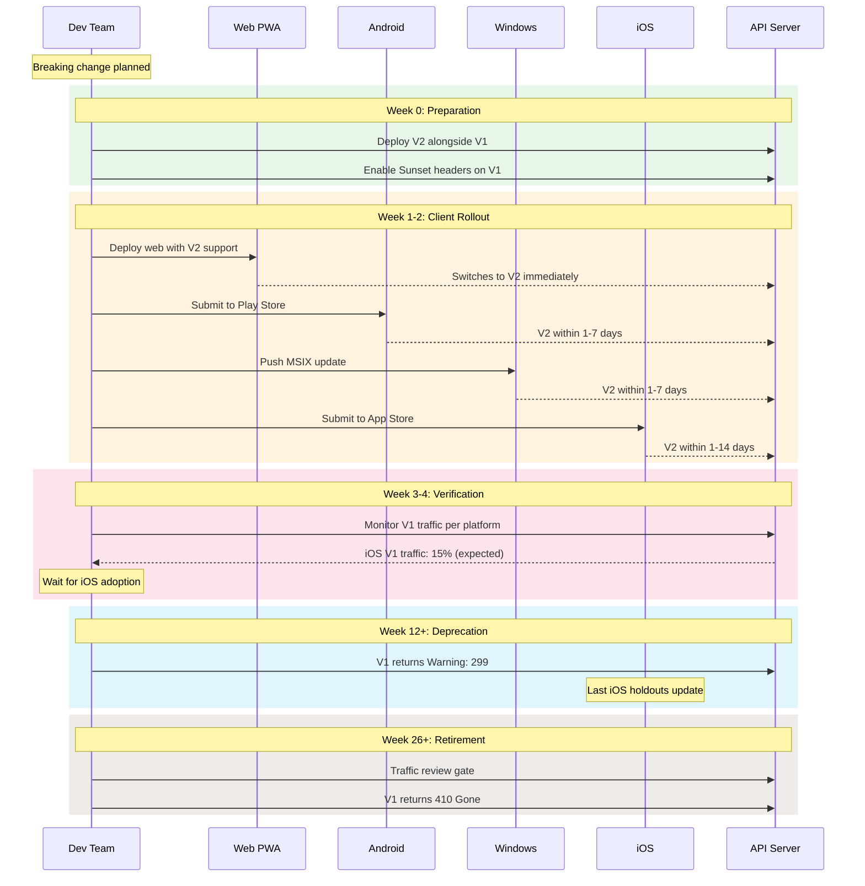

# ADR-0017: API Versioning Strategy — Semantic Versioning, Deprecation Policy, Migration Windows

**Status:** Proposed
**Date:** 2025-07-28
**Author:** System Architect (AI agent)
**Reviewers:** Pending human review
**Sprint:** W2-S6
**Supersedes:** [ADR-0012](./0012-api-versioning-strategy.md)

## Context

Finance serves **four independently-updated clients** (iOS, Android, Web, Windows) with dramatically different update latencies. At any given moment, 2–4 client versions are active simultaneously. ADR-0012 established URL-prefix versioning and a basic deprecation timeline. This ADR supersedes 0012 with a comprehensive versioning strategy covering:

1. **Semantic versioning** for the API contract itself (not just URL prefixes)
2. **Formal deprecation policy** with machine-readable signals
3. **Migration windows** coordinated across app store release cycles
4. **Sync protocol versioning** tightly coupled with PowerSync schema evolution
5. **Client compatibility matrix** enforcement in CI

### Update Latency Reality

| Platform | Update Mechanism | Typical Latency | Forced Update Possible? |
| -------- | ---------------- | --------------- | ----------------------- |
| Web PWA  | Service worker   | Minutes         | Yes (cache bust)        |
| Android  | Play Store       | 1–7 days        | Yes (in-app update API) |
| Windows  | MSIX auto-update | 1–7 days        | Yes (sideload refresh)  |
| iOS      | App Store        | 1–14 days       | No (review delay)       |

**Worst case:** An iOS user on vacation ignores updates for 30+ days. The API must remain functional for that user.

### API Surface Inventory

Finance's API surface consists of three distinct layers:

| Layer                      | Endpoint Count | Change Frequency | Versioning Need   |
| -------------------------- | -------------- | ---------------- | ----------------- |
| Edge Functions             | 6–10           | Monthly          | URL versioning    |
| Sync Protocol (PowerSync)  | 1 WebSocket    | Quarterly        | Header versioning |
| Sync Rules (column schema) | 8 tables       | Quarterly        | Additive-only     |

### Forces

- iOS App Store review adds 1–14 days of uncontrollable latency
- PowerSync sync rules changes are effectively schema migrations across all clients
- Breaking changes in financial data formats (e.g., multi-currency) have correctness implications
- The self-hosted VPS ($10–20/mo, ADR-0007) cannot run unlimited concurrent API versions

## Decision

Adopt a **three-layer versioning strategy** with semantic versioning, machine-readable deprecation signals, and coordinated migration windows.

### 1. Semantic API Version Contract

The API follows **CalVer-inspired semantic versioning** for the contract itself:

```
API Contract Version: YYYY.MINOR.PATCH
Example: 2025.1.0 → 2025.2.0 (breaking) → 2025.2.1 (patch)
```

- **YYYY:** Year of the breaking change — prevents version inflation and communicates age
- **MINOR:** Incremented for breaking changes within a year
- **PATCH:** Non-breaking additions, bug fixes

The contract version is distinct from client app versions and Edge Function deployment versions.

### 2. URL Versioning for Edge Functions

```
POST /functions/v1/banking/link-token      ← API contract 2025.1.x
POST /functions/v2/banking/link-token      ← API contract 2025.2.x (breaking)
GET  /functions/v1/rates/latest            ← unchanged, stays v1

# Version in URL = major breaking version, NOT contract version
```

**Maximum concurrent versions:** 2 (current + previous). The VPS cannot sustain more.

### 3. Breaking Change Classification



| Change Type                          | Breaking? | Action          | Example                                     |
| ------------------------------------ | --------- | --------------- | ------------------------------------------- |
| Add optional response field          | No        | Current version | Add `recurringRuleId` to transaction        |
| Add optional request param w/default | No        | Current version | Add `?currency=USD` defaulting to user pref |
| Remove/rename response field         | **Yes**   | New version     | Rename `amount_cents` → `amount`            |
| Change field type                    | **Yes**   | New version     | `amount: string` → `amount: number`         |
| Add required request param           | **Yes**   | New version     | Require `household_id` header               |
| Change field semantics               | **Yes**   | New version     | `amount` changes from cents to decimal      |
| Add new endpoint                     | No        | Current version | New `/v1/insights/spending`                 |
| Change error response format         | **Yes**   | New version     | Restructure error envelope                  |

### 4. Deprecation Policy with Machine-Readable Signals



#### Timeline

| Phase                   | Timing           | Signal                                                                       | Client Behavior                               |
| ----------------------- | ---------------- | ---------------------------------------------------------------------------- | --------------------------------------------- |
| **Active**              | T+0              | Normal responses                                                             | Normal operation                              |
| **Sunset announced**    | T+0 (v2 release) | `Sunset: <date>` header ([RFC 8594](https://www.rfc-editor.org/rfc/rfc8594)) | Log warning; no user impact                   |
| **Deprecation warning** | T+90d            | `Deprecation: <date>` header + `Warning: 299`                                | Show in-app banner: "Update available"        |
| **Traffic review**      | T+180d           | Internal check                                                               | If V1 traffic ≥ 5%: extend 90d. < 5%: proceed |
| **Hard cutoff**         | T+180–270d       | `410 Gone` response                                                          | Force-update screen; block until update       |

#### Response Headers Example

```http
HTTP/1.1 200 OK
X-Finance-API-Version: 2025.1.0
Sunset: Sat, 01 Jan 2026 00:00:00 GMT
Deprecation: Mon, 01 Oct 2025 00:00:00 GMT
Warning: 299 - "API v1 is deprecated. Upgrade to v2. See https://docs.finance.app/migration/v2"
Link: <https://docs.finance.app/api/v2>; rel="successor-version"
```

### 5. Client Compatibility Headers

Every client request includes version metadata:

```http
X-Finance-Client-Version: 2.3.1
X-Finance-Platform: ios | android | web | windows
X-Finance-API-Contract: 2025.1.0
X-Finance-Sync-Version: 3
X-Finance-Build: 1847
```

The server uses these headers for:

- **Analytics:** Track version distribution across platforms
- **Compatibility gate:** Reject requests from unsupported versions with a helpful error
- **Feature flags:** Enable features per client version (progressive rollout)

### 6. Sync Protocol Versioning

PowerSync sync rules changes are the most impactful type of API change because they affect the local schema on every client device.



**Sync version rules:**

1. New columns added with `NULL` defaults — old clients ignore them
2. Column removals are never synced — old columns remain in sync rules for the deprecation window
3. Sync version is incremented only when the column schema changes
4. Client KMP data classes use nullable properties with defaults for new fields

```kotlin
// packages/core — backward-compatible data class
data class Transaction(
    val id: String,
    val amountCents: Long,
    val currencyCode: String = "USD",          // Added in sync v2
    val recurringRuleId: String? = null,        // Added in sync v3
    val linkedTransactionId: String? = null,    // Added in sync v3
)
```

### 7. Migration Windows



**Migration window minimum durations:**

| Change Type                   | Minimum Window | Rationale                   |
| ----------------------------- | -------------- | --------------------------- |
| Edge Function breaking change | 180 days       | iOS worst-case + buffer     |
| Sync column addition          | 0 days         | Additive, null defaults     |
| Sync column removal           | 270 days       | Must wait for all clients   |
| Error format change           | 180 days       | Affects error handling      |
| Auth flow change              | 360 days       | Highest risk; affects login |

### 8. CI Enforcement

```yaml
# .github/workflows/api-compat.yml
api-compatibility-check:
  runs-on: ubuntu-latest
  steps:
    - name: Snapshot current API contract
      run: node tools/api-snapshot.js --version ${{ env.API_VERSION }}

    - name: Compare with previous version
      run: node tools/api-compat-check.js --current ${{ env.API_VERSION }} --previous ${{ env.PREV_VERSION }}
      # Fails if breaking changes detected without version bump

    - name: Verify deprecation headers
      run: node tools/check-deprecation-headers.js --endpoint-manifest endpoints.json
      # Ensures all deprecated endpoints have proper Sunset/Deprecation headers

    - name: Client compatibility matrix
      run: node tools/client-compat-matrix.js
      # Verifies each client version maps to a supported API version
```

## Alternatives Considered

### Alternative 1: GraphQL with Per-Field Deprecation

- **Pros:** Granular deprecation; clients request only needed fields; no URL versioning
- **Cons:** Overkill for 6–10 endpoints; not aligned with PowerSync sync model; adds server complexity; N+1 query risk; no CDN caching advantage

### Alternative 2: Content Negotiation (Accept Header Versioning)

- **Pros:** Cleaner URLs; RESTful purists prefer it
- **Cons:** Harder CDN/LB routing; Supabase Edge Functions don't natively route on Accept; poor developer ergonomics; harder to test

### Alternative 3: Stripe-Style Date-Based Versioning

- **Pros:** Battle-tested at scale; pinned per-client; gradual migration
- **Cons:** Requires API gateway middleware not available on self-hosted VPS; overkill for current scale; complex implementation for solo/small team

### Alternative 4: No Formal Versioning (Breaking Changes Avoided)

- **Pros:** Simplest; no versioning infrastructure
- **Cons:** Eventually impossible — multi-currency (ADR-0010) requires schema changes; accumulates technical debt in additive-only approach

## Consequences

### Positive

- **Multi-platform safety** — 180-day minimum covers all app store latencies with margin
- **Machine-readable signals** — RFC 8594 Sunset headers enable automated client responses
- **Traffic-gated retirement** — No version retired without data confirming low usage
- **CDN-friendly** — URL-prefix versioning works with Cloudflare caching (ADR-0011)
- **CI-enforced** — Breaking changes cannot merge without version bump

### Negative

- **Code duplication** — Must maintain 2 concurrent Edge Function versions during migration
- **Testing matrix** — 2 versions × 4 platforms = 8 test configurations minimum
- **Sync versioning complexity** — Column allowlist management adds ops burden
- **Migration coordination** — Requires cross-platform release planning

### Risks

| Risk                                         | Likelihood | Impact   | Mitigation                                                                     |
| -------------------------------------------- | ---------- | -------- | ------------------------------------------------------------------------------ |
| Users refuse to update past hard cutoff      | Medium     | Medium   | In-app banners at T+90d; force-update screen at T+180d; 410 after T+270d       |
| Sync version mismatch causes data loss       | Low        | Critical | Null defaults for all new fields; integration tests per sync version; rollback |
| Two concurrent versions exceed VPS resources | Low        | Medium   | Edge Functions are stateless; shared database; monitor memory                  |
| iOS review delay extends past migration      | Medium     | Low      | 180-day minimum provides 10x safety margin over typical review time            |

## Implementation Notes

### KMP API Configuration

```kotlin
// packages/core/src/commonMain/kotlin/com/finance/core/api/ApiConfig.kt
object ApiConfig {
    const val API_CONTRACT_VERSION = "2025.1.0"
    const val CURRENT_URL_VERSION = 1
    const val CURRENT_SYNC_VERSION = 2

    fun endpointUrl(path: String, v: Int = CURRENT_URL_VERSION): String =
        "${baseUrl}/functions/v${v}/${path}"

    fun requestHeaders(platform: Platform, appVersion: String): Map<String, String> = mapOf(
        "X-Finance-Client-Version" to appVersion,
        "X-Finance-Platform" to platform.identifier,
        "X-Finance-API-Contract" to API_CONTRACT_VERSION,
        "X-Finance-Sync-Version" to CURRENT_SYNC_VERSION.toString(),
    )
}
```

### Deprecation Response Handler

```kotlin
// packages/core/src/commonMain/kotlin/com/finance/core/api/DeprecationHandler.kt
class DeprecationHandler(
    private val notificationService: NotificationService,
    private val analytics: MetricsCollector,
) {
    fun handleResponse(headers: Headers) {
        headers["Sunset"]?.let { sunsetDate ->
            analytics.track("api_sunset_detected", mapOf("date" to sunsetDate))
        }
        headers["Deprecation"]?.let { deprecationDate ->
            analytics.track("api_deprecation_detected", mapOf("date" to deprecationDate))
            notificationService.showUpdateBanner(deprecationDate)
        }
        headers["Warning"]?.let { warning ->
            if (warning.startsWith("299")) {
                notificationService.showUpdateRequired()
            }
        }
    }
}
```

## References

- [ADR-0002: Backend & Sync Architecture](./0002-backend-sync-architecture.md)
- [ADR-0010: V2 Architecture Vision](./0010-v2-architecture-vision.md)
- [ADR-0011: Scaling Architecture](./0011-scaling-architecture.md)
- [ADR-0012: API Versioning Strategy (superseded)](./0012-api-versioning-strategy.md)
- [RFC 8594 — Sunset Header](https://www.rfc-editor.org/rfc/rfc8594)
- [RFC 8288 — Web Linking (successor-version)](https://www.rfc-editor.org/rfc/rfc8288)
- [RFC 7234 §5.5 — Warning Header](https://www.rfc-editor.org/rfc/rfc7234#section-5.5)
- [Stripe API Versioning](https://stripe.com/docs/api/versioning)
- [PowerSync Sync Rules](../../services/api/powersync/sync-rules.yaml)
