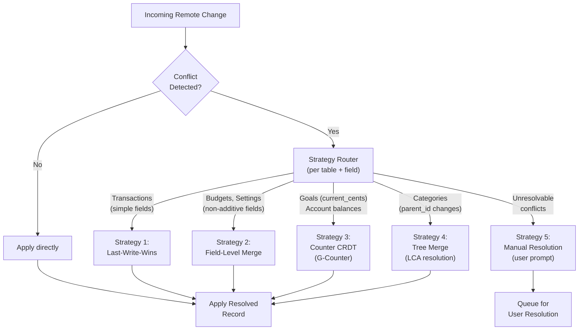
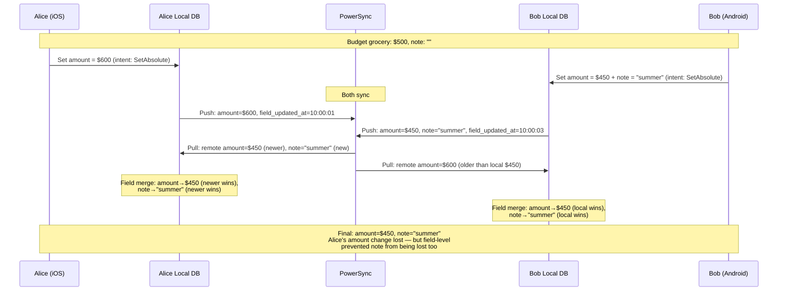
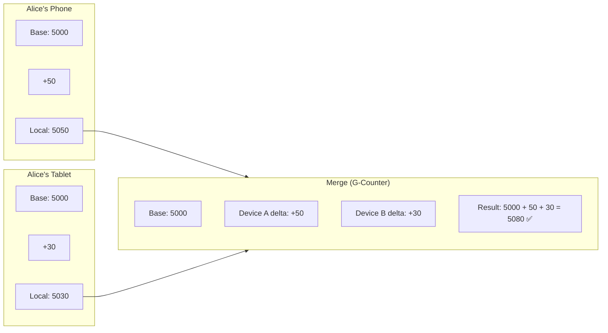
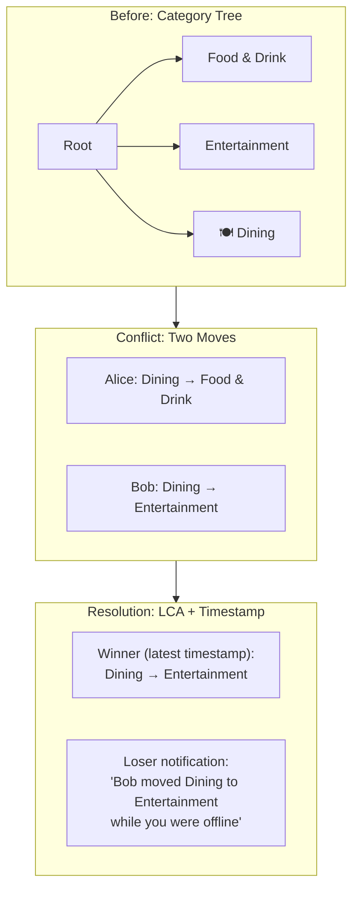
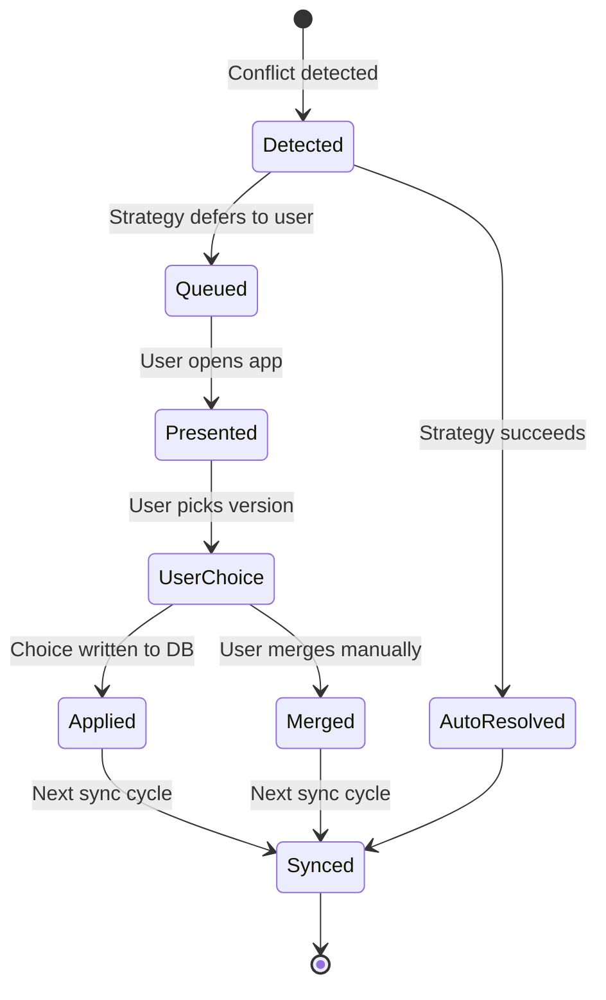
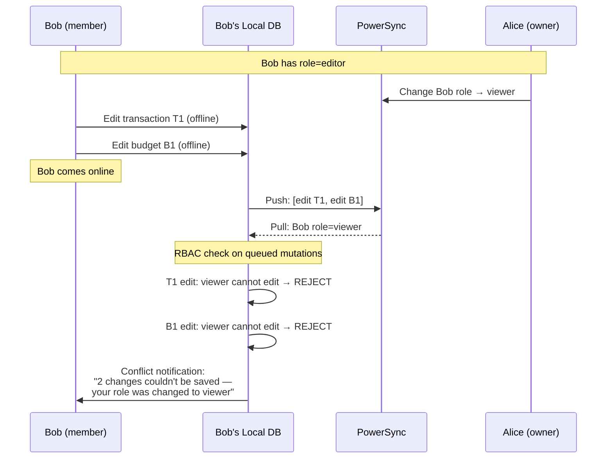

# ADR-0018: Offline-First Conflict Resolution — Beyond Last-Write-Wins

**Status:** Proposed
**Date:** 2025-07-28
**Author:** System Architect (AI agent)
**Reviewers:** Pending human review
**Sprint:** W2-S7

## Context

Finance's sync architecture (ADR-0002) uses PowerSync for delta sync with configurable conflict resolution per table. The current `sync-architecture.md` documents four strategies (LWW, field-level merge, server-wins, client-wins) with per-table assignments. However, several real-world scenarios expose limitations of these strategies:

### Problem Scenarios

**1. Concurrent Budget Edits (Household)**
Two household members edit the same monthly grocery budget simultaneously:

- Alice (iOS): Changes amount from $500 → $600
- Bob (Android): Changes amount from $500 → $450 and adds a note "adjusted for summer"

With simple LWW, one edit is silently lost. With field-level merge, amount resolves to one value but the note survives — but which amount is "correct"?

**2. Goal Progress from Multiple Devices**
A user contributes to a savings goal from two devices:

- Phone: Adds $50 contribution at 10:00 AM → `current_cents` = 5050
- Tablet: Adds $30 contribution at 10:01 AM → `current_cents` = 5030

Both devices started from `current_cents` = 5000. LWW picks 5030 (latest timestamp), losing the $50 contribution. The correct answer is 5080.

**3. Household Member Role Changes**
An owner demotes a member to viewer while that member is offline editing transactions. When the member comes back online, their queued mutations should be rejected based on the new role — but the mutations were valid when created.

**4. Concurrent Category Reorganization**
Two members reorganize categories simultaneously:

- Alice moves "Dining" under "Food & Drink"
- Bob moves "Dining" under "Entertainment"

This creates a tree conflict that field-level merge cannot resolve.

### Current Strategy Limitations

| Scenario                        | Current Strategy  | Problem                                                  |
| ------------------------------- | ----------------- | -------------------------------------------------------- |
| Budget concurrent edits         | Field-level merge | Amount is a single field — merge picks one, loses intent |
| Goal contributions              | Field-level merge | Additive values treated as overwrite                     |
| Role change + offline mutations | No handling       | Invalid mutations applied after role revocation          |
| Category tree conflicts         | Server wins       | Silently discards one reorganization                     |

### Constraints

- PowerSync provides LWW at the sync layer — custom resolution happens in KMP code **after** pull
- Resolution must be deterministic across all 4 platforms (same inputs → same output)
- Resolution must work offline (cannot consult server for "correct" answer)
- Financial data correctness is paramount — silent data loss is worse than a conflict UI

## Decision

Implement a **tiered conflict resolution architecture** with five strategies, applied per-table with field-level granularity, including CRDT-inspired patterns for specific data types.

### Resolution Architecture



### Strategy 1: Last-Write-Wins (Existing — Refined)

**Applied to:** Transaction simple fields (payee, note, date), user profile fields.

LWW uses `updated_at` timestamps. In case of timestamp tie (same millisecond), use **device_id lexicographic ordering** as a deterministic tiebreaker.

```kotlin
class LastWriteWinsResolver : ConflictResolver {
    override fun resolve(local: SyncRecord, remote: SyncRecord): ResolvedRecord {
        val localTs = local.updatedAt
        val remoteTs = remote.updatedAt
        return when {
            remoteTs > localTs -> ResolvedRecord(remote, resolution = REMOTE_WINS)
            localTs > remoteTs -> ResolvedRecord(local, resolution = LOCAL_WINS)
            // Tiebreaker: deterministic device ID comparison
            else -> {
                val winner = if (remote.deviceId > local.deviceId) remote else local
                ResolvedRecord(winner, resolution = TIEBREAK)
            }
        }
    }
}
```

### Strategy 2: Field-Level Merge (Existing — Enhanced with Intent Tracking)

**Applied to:** Budgets (amount, period, note, rollover), household settings, recurring templates.

Each field resolves independently using its own `field_updated_at` timestamp. This prevents a change to `budget.note` from overwriting a concurrent change to `budget.amount_cents`.

**Enhancement: Operation Intent Tracking**

For budget amounts, track the **operation intent** rather than just the final value:

```kotlin
// Mutation queue stores intent, not just value
data class BudgetMutation(
    val budgetId: String,
    val field: String,
    val intent: MutationIntent,
    val timestamp: Instant,
)

sealed class MutationIntent {
    data class SetAbsolute(val value: Long) : MutationIntent()     // "Set to $600"
    data class AdjustRelative(val delta: Long) : MutationIntent()  // "Increase by $100"
}
```



### Strategy 3: Counter CRDT (G-Counter) for Additive Values

**Applied to:** `goals.current_cents`, contribution tracking, streak counts.

For values that represent **accumulations** (savings contributions, spending totals), use a Grow-only Counter (G-Counter) inspired by CRDT theory. Each device maintains its own counter; the merged value is the sum across all devices.



**Implementation:**

```kotlin
// Per-device delta tracking for counter fields
data class CounterDelta(
    val recordId: String,
    val field: String,
    val deviceId: String,
    val delta: Long,           // +50, +30, -20
    val baseValue: Long,       // Value when delta was computed
    val timestamp: Instant,
)

class GCounterResolver : ConflictResolver {
    override fun resolve(local: SyncRecord, remote: SyncRecord): ResolvedRecord {
        val counterFields = tableConfig.counterFields(local.table)
        val merged = local.fields.toMutableMap()

        for (field in counterFields) {
            val localDelta = local.getCounterDelta(field)
            val remoteDelta = remote.getCounterDelta(field)

            // Sum deltas from the shared base value
            val baseValue = minOf(localDelta.baseValue, remoteDelta.baseValue)
            merged[field] = baseValue + localDelta.delta + remoteDelta.delta
        }

        // Non-counter fields use field-level merge
        for (field in local.fields.keys - counterFields) {
            merged[field] = fieldLevelMerge(local, remote, field)
        }

        return ResolvedRecord(merged, resolution = COUNTER_MERGE)
    }
}
```

**Database schema addition for delta tracking:**

```sql
-- Tracks per-device deltas for counter CRDT fields
CREATE TABLE sync_counter_deltas (
    id UUID PRIMARY KEY DEFAULT gen_random_uuid(),
    record_id UUID NOT NULL,
    table_name TEXT NOT NULL,
    field_name TEXT NOT NULL,
    device_id TEXT NOT NULL,
    base_value BIGINT NOT NULL,
    delta BIGINT NOT NULL,
    created_at TIMESTAMPTZ NOT NULL DEFAULT now(),
    UNIQUE (record_id, table_name, field_name, device_id)
);
```

### Strategy 4: Tree Merge for Hierarchical Data

**Applied to:** Categories (parent_id changes), subcategory ordering.

Category reorganization creates **tree conflicts** when two users move the same node to different parents. The resolution uses **Lowest Common Ancestor (LCA)** to detect cycles and applies a deterministic winner.



**Resolution rules:**

1. **Cycle detection:** If move A would create a cycle, move B wins automatically
2. **No cycle:** Latest `updated_at` wins (LWW for tree position)
3. **Notification:** Losing device receives a conflict notification showing what changed
4. **Audit log:** Both attempted moves are recorded for household transparency

```kotlin
class TreeMergeResolver : ConflictResolver {
    override fun resolve(local: SyncRecord, remote: SyncRecord): ResolvedRecord {
        val localParent = local.getString("parent_id")
        val remoteParent = remote.getString("parent_id")

        if (localParent == remoteParent) {
            // No tree conflict — delegate to field-level merge for other fields
            return fieldLevelMerge(local, remote)
        }

        // Check for cycles
        val localCreatesCycle = wouldCreateCycle(local.id, localParent)
        val remoteCreatesCycle = wouldCreateCycle(local.id, remoteParent)

        return when {
            localCreatesCycle && !remoteCreatesCycle ->
                ResolvedRecord(remote, resolution = CYCLE_PREVENTION)
            !localCreatesCycle && remoteCreatesCycle ->
                ResolvedRecord(local, resolution = CYCLE_PREVENTION)
            // Neither creates cycle: LWW on parent_id
            else -> {
                val winner = if (remote.updatedAt >= local.updatedAt) remote else local
                ResolvedRecord(winner, resolution = TREE_LWW).also {
                    enqueueConflictNotification(local, remote, winner)
                }
            }
        }
    }
}
```

### Strategy 5: Manual Resolution Queue

**Applied to:** Unresolvable conflicts, high-stakes financial discrepancies.

When automated resolution isn't safe (e.g., two different transaction amounts for the same record, or a conflict involving a role change), the conflict is queued for user resolution.



```kotlin
data class ConflictRecord(
    val id: String,
    val table: String,
    val recordId: String,
    val localVersion: SyncRecord,
    val remoteVersion: SyncRecord,
    val conflictType: ConflictType,
    val detectedAt: Instant,
    val resolvedAt: Instant? = null,
    val resolution: ManualResolution? = null,
)

enum class ConflictType {
    AMOUNT_MISMATCH,     // Two different amounts for same transaction
    ROLE_VIOLATION,      // Mutation created before role was revoked
    CONCURRENT_DELETE,   // One device deleted, another edited
    UNRESOLVABLE,        // Catch-all for unexpected conflicts
}
```

### Strategy Assignment Matrix (Updated)

| Table                 | Field(s)                        | Strategy          | Rationale                           |
| --------------------- | ------------------------------- | ----------------- | ----------------------------------- |
| `transactions`        | payee, note, date, type         | LWW               | Simple overwrites; latest edit wins |
| `transactions`        | amount_cents, category_id       | LWW per field     | Independent field timestamps        |
| `budgets`             | amount_cents, period, note      | Field-level merge | Each field resolves independently   |
| `budgets`             | is_rollover                     | LWW               | Boolean toggle, latest wins         |
| `goals`               | name, target_cents, target_date | Field-level merge | Independent fields                  |
| `goals`               | current_cents                   | **Counter CRDT**  | Additive contributions must sum     |
| `categories`          | name, icon, color               | Field-level merge | Independent fields                  |
| `categories`          | parent_id, sort_order           | **Tree merge**    | Hierarchy consistency               |
| `accounts`            | name, icon, color, is_active    | Field-level merge | Independent fields                  |
| `accounts`            | balance_cents                   | **Counter CRDT**  | Balance adjustments must sum        |
| `household_members`   | role                            | **Server wins**   | Security-critical; owner authority  |
| `recurring_templates` | all fields                      | Field-level merge | Each field independent              |
| All tables            | deleted_at                      | **Tombstone**     | Delete always wins                  |

### RBAC-Aware Conflict Resolution

When a household member's role changes while they have offline mutations queued:



**Implementation:**

```kotlin
class RBACConflictFilter(
    private val permissionChecker: PermissionChecker,
) {
    /**
     * Filters mutations that are no longer authorized after a role change.
     * Called after pull (which may contain role changes) and before push.
     */
    fun filterMutations(
        mutations: List<SyncMutation>,
        currentRole: HouseholdRole,
    ): FilterResult {
        val allowed = mutableListOf<SyncMutation>()
        val rejected = mutableListOf<RejectedMutation>()

        for (mutation in mutations) {
            if (permissionChecker.canPerform(currentRole, mutation.operation, mutation.table)) {
                allowed.add(mutation)
            } else {
                rejected.add(RejectedMutation(mutation, reason = "Role changed to $currentRole"))
            }
        }

        return FilterResult(allowed, rejected)
    }
}
```

### Conflict Notification System

All non-trivial conflict resolutions generate a user-visible notification:

| Resolution Type      | Notification                         | User Action Needed?  |
| -------------------- | ------------------------------------ | -------------------- |
| LWW (auto)           | None (silent)                        | No                   |
| Field merge (auto)   | None (silent)                        | No                   |
| Counter merge (auto) | None (silent)                        | No                   |
| Tree merge (auto)    | "Category [X] was moved by [member]" | No (informational)   |
| RBAC rejection       | "[N] changes couldn't be saved"      | Yes (acknowledge)    |
| Manual resolution    | "Conflict in [table]: review needed" | Yes (choose version) |

## Alternatives Considered

### Alternative 1: Full CRDT Library (Automerge / Yjs)

- **Pros:** Proven conflict-free resolution; rich merge semantics; no manual strategy code
- **Cons:** Massive dependency (~500KB+ WASM); not compatible with PowerSync's sync model; replaces rather than extends existing architecture; overkill for structured financial data with known schemas

### Alternative 2: Operational Transform (OT)

- **Pros:** Well-understood for collaborative editing; Google Docs proven at scale
- **Cons:** Requires centralized transform server (breaks offline-first); complex to implement correctly; designed for text/documents, not structured records; server becomes bottleneck

### Alternative 3: Server-Side Resolution Only

- **Pros:** Single source of truth; simpler client code; no client-side merge logic
- **Cons:** Breaks offline-first — conflicts can't resolve until online; adds server load; reduces user agency; financial decisions should be user-controlled

### Alternative 4: Always Prompt User (No Auto-Resolution)

- **Pros:** User always decides; no silent data loss; maximum transparency
- **Cons:** Terrible UX for common cases (simple LWW scenarios); conflict fatigue; users dismiss prompts without reading; blocks sync until resolved

## Consequences

### Positive

- **Zero silent data loss** for additive values (goals, balances) — counter CRDT sums correctly
- **Hierarchy safety** for categories — cycle detection prevents tree corruption
- **RBAC enforcement** extends to offline mutations — no privilege escalation via offline queue
- **User agency preserved** — manual resolution queue for ambiguous conflicts
- **Deterministic** — same inputs produce same outputs across all 4 platforms (Kotlin `commonMain`)

### Negative

- **Increased complexity** — five strategies vs. the current two
- **Counter delta tracking** requires schema addition (`sync_counter_deltas` table)
- **Manual resolution UI** needed on all 4 platforms — design + implementation cost
- **Testing matrix** grows — must verify each strategy × each conflict scenario × each platform

### Risks

| Risk                                              | Likelihood | Impact | Mitigation                                                                    |
| ------------------------------------------------- | ---------- | ------ | ----------------------------------------------------------------------------- |
| Counter CRDT drift over time                      | Low        | Medium | Periodic full-sync reconciliation; base value reset on confirmed server state |
| Tree merge creates unexpected hierarchy           | Low        | Low    | Notification + undo capability; audit log                                     |
| Manual resolution queue grows unbounded           | Low        | Medium | Auto-resolve after 30 days (latest wins); notification reminders              |
| Clock skew between devices affects LWW            | Medium     | Low    | Use server-assigned timestamps for tiebreaking; NTP sync check                |
| RBAC filter rejects legitimate pre-demotion edits | Medium     | Medium | Grace period: mutations within 5 minutes of role change are auto-approved     |

## Implementation Notes

### Phase Rollout

| Phase          | Strategies                                         | Timeline     |
| -------------- | -------------------------------------------------- | ------------ |
| Phase 1 (V1)   | LWW, Field Merge, Server Wins, Tombstone           | Current      |
| Phase 2 (V1.5) | + Counter CRDT for goals.current_cents             | Next quarter |
| Phase 3 (V2)   | + Tree Merge, Manual Resolution Queue, RBAC Filter | V2 release   |

### Testing Strategy

Each conflict scenario has a corresponding integration test:

```kotlin
// packages/sync/src/commonTest/kotlin/com/finance/sync/conflict/
class GCounterResolverTest {
    @Test
    fun `concurrent goal contributions sum correctly`() {
        val base = goalRecord(currentCents = 5000)
        val localEdit = base.withDelta(field = "current_cents", delta = +50, deviceId = "device-a")
        val remoteEdit = base.withDelta(field = "current_cents", delta = +30, deviceId = "device-b")

        val resolved = resolver.resolve(localEdit, remoteEdit)

        assertEquals(5080, resolved.getLong("current_cents"))
        assertEquals(Resolution.COUNTER_MERGE, resolved.resolution)
    }
}
```

## References

- [ADR-0002: Backend & Sync Architecture](./0002-backend-sync-architecture.md)
- [ADR-0004: Auth & Security Architecture](./0004-auth-security-architecture.md)
- [ADR-0013: Multi-Tenancy Architecture](./0013-multi-tenancy-architecture.md)
- [Sync Architecture Deep Dive](./sync-architecture.md)
- [PowerSync Sync Rules](../../services/api/powersync/sync-rules.yaml)
- Shapiro et al., "Conflict-free Replicated Data Types" (INRIA 2011)
- Kleppmann, "Designing Data-Intensive Applications" Ch. 5
- [Automerge CRDT Library](https://automerge.org/) (evaluated, not adopted)
