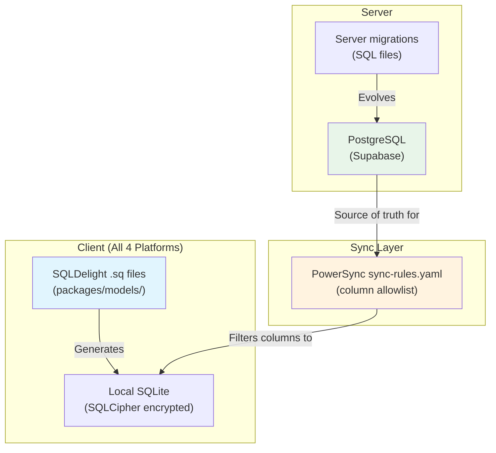
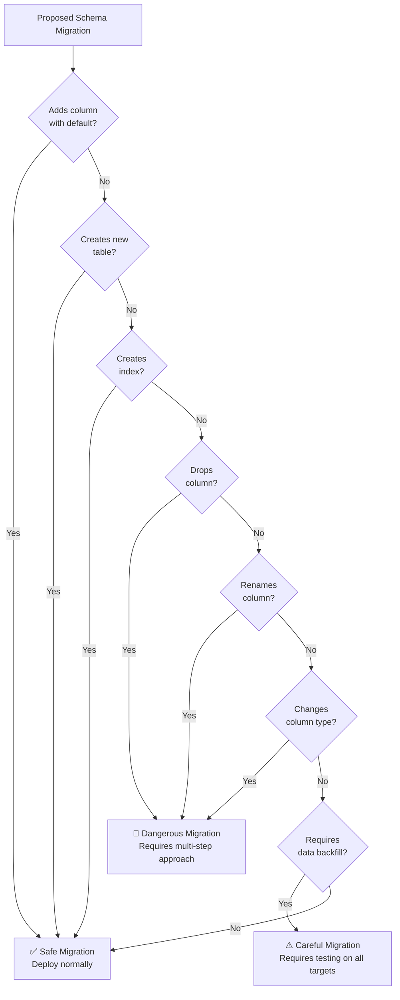
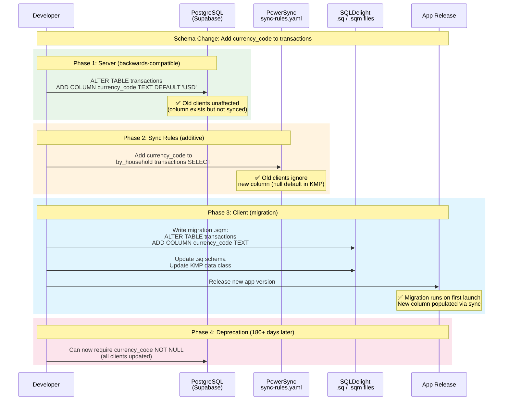
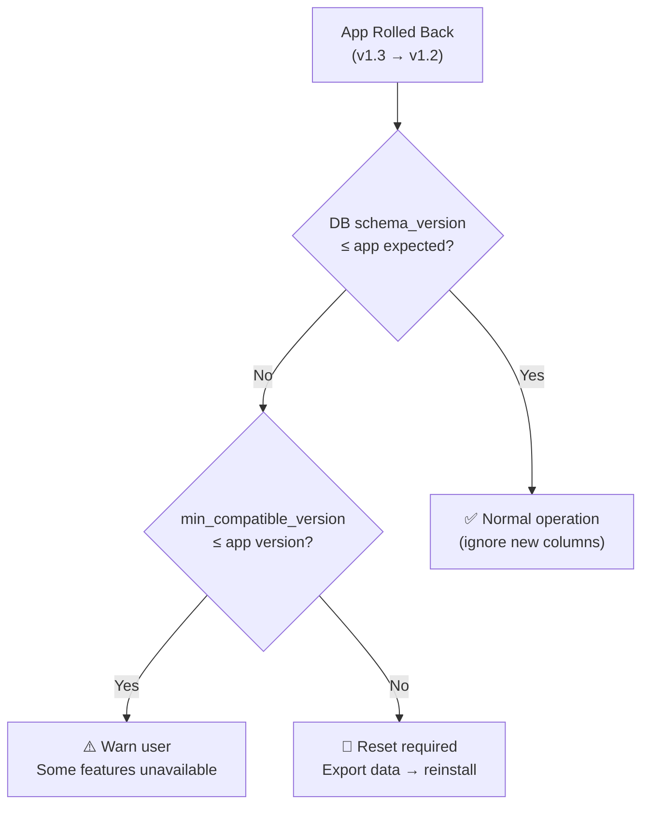
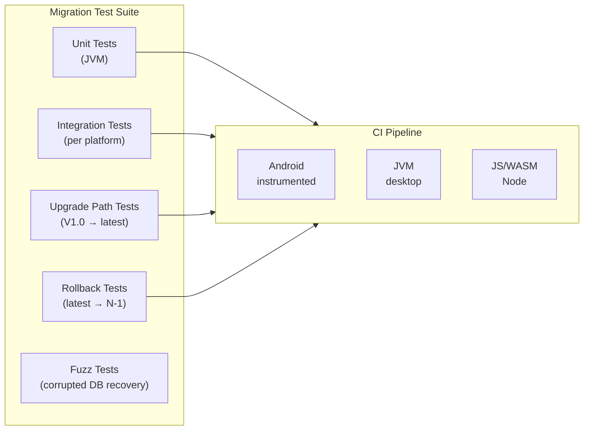

# ADR-0019: Migration & Schema Evolution Strategy

**Status:** Proposed
**Date:** 2025-07-28
**Author:** System Architect (AI agent)
**Reviewers:** Pending human review
**Sprint:** W2-S10

## Context

Finance uses **SQLDelight** (ADR-0003) for the local database, generating type-safe Kotlin code from `.sq` schema files shared across all KMP targets. The schema must evolve as features are added (multi-currency, bank connections, AI metadata) while maintaining:

1. **Backwards compatibility** — Users on older app versions must not lose data
2. **Data integrity** — Migrations must be atomic; partial migration = data corruption
3. **Cross-platform consistency** — The same migration must produce identical results on iOS (Native), Android (JVM), Web (JS/WASM), and Windows (JVM)
4. **Sync compatibility** — Local schema changes must coordinate with PowerSync sync rules (ADR-0017) and server-side PostgreSQL schema
5. **Rollback safety** — If a new app version is rolled back (App Store rejection, critical bug), the local database must still be usable

### Schema Layers

Finance has **three synchronized schemas** that must evolve together:



### Constraints

- SQLDelight uses numbered migration files (`.sqm`) that run sequentially
- SQLite does not support `ALTER TABLE DROP COLUMN` (before 3.35.0) — some KMP targets use older SQLite
- PowerSync sync rules are additive-only in practice (removing a column breaks old clients)
- All four platforms may be at different app versions simultaneously
- The encrypted SQLCipher database cannot be opened with wrong-version schema
- V2 features (ADR-0010) require significant schema additions: `bank_connections`, `bank_transactions`, `exchange_rates`, model metadata

### Current Schema Complexity

| Table                             | Columns | Sync Scope     | Change Frequency                    |
| --------------------------------- | ------- | -------------- | ----------------------------------- |
| `transactions`                    | 18      | `by_household` | High (V2 adds 2+ columns)           |
| `accounts`                        | 13      | `by_household` | Medium                              |
| `budgets`                         | 11      | `by_household` | Low                                 |
| `goals`                           | 13      | `by_household` | Medium (counter CRDT adds metadata) |
| `categories`                      | 10      | `by_household` | Low                                 |
| `recurring_transaction_templates` | 17      | `by_household` | Low                                 |
| `household_members`               | 8       | `by_household` | Low                                 |
| `household_invitations`           | 10      | `by_household` | Low                                 |
| `users`                           | 7       | `user_profile` | Low                                 |
| `passkey_credentials`             | 9       | `user_profile` | Low                                 |

## Decision

Adopt a **coordinated three-layer migration strategy** with forward-compatible local schema, versioned sync rules, and safe rollback.

### 1. SQLDelight Migration Architecture

#### Migration File Convention

```
packages/models/src/commonMain/sqldelight/
├── com/finance/models/
│   ├── Finance.sq                    ← Current schema (latest)
│   └── migrations/
│       ├── 1.sqm                     ← V1.0 → V1.1
│       ├── 2.sqm                     ← V1.1 → V1.2
│       ├── 3.sqm                     ← V1.2 → V1.3 (multi-currency)
│       └── 4.sqm                     ← V1.3 → V2.0 (bank connections)
```

Each `.sqm` file contains forward-only SQL statements. SQLDelight runs all migrations sequentially from the user's current version to the latest.

#### Migration Template

```sql
-- migrations/3.sqm
-- V1.2 → V1.3: Multi-currency support
-- Date: 2025-XX-XX
-- Related: ADR-0010 (V2 Architecture Vision)

-- Step 1: Add currency_code to accounts (default USD for existing)
ALTER TABLE accounts ADD COLUMN currency_code TEXT NOT NULL DEFAULT 'USD';

-- Step 2: Add exchange_rates table
CREATE TABLE IF NOT EXISTS exchange_rates (
    id TEXT NOT NULL PRIMARY KEY,
    base_currency TEXT NOT NULL,
    target_currency TEXT NOT NULL,
    rate TEXT NOT NULL,           -- Stored as string to avoid float precision
    effective_date TEXT NOT NULL,
    source TEXT NOT NULL DEFAULT 'ecb',
    created_at TEXT NOT NULL,
    UNIQUE (base_currency, target_currency, effective_date, source)
);

-- Step 3: Add index for rate lookups
CREATE INDEX IF NOT EXISTS idx_exchange_rates_lookup
    ON exchange_rates(base_currency, target_currency, effective_date);

-- Step 4: Add currency_code to transactions (default from account)
ALTER TABLE transactions ADD COLUMN currency_code TEXT;

-- Step 5: Backfill transaction currency from account
UPDATE transactions SET currency_code = (
    SELECT accounts.currency_code FROM accounts WHERE accounts.id = transactions.account_id
) WHERE currency_code IS NULL;
```

### 2. Migration Safety Rules



#### Safe Operations (Direct Migration)

| Operation               | SQLite Support  | Example                                       |
| ----------------------- | --------------- | --------------------------------------------- |
| Add column with default | ✅ All versions | `ALTER TABLE t ADD COLUMN c TEXT DEFAULT 'x'` |
| Add nullable column     | ✅ All versions | `ALTER TABLE t ADD COLUMN c TEXT`             |
| Create table            | ✅ All versions | `CREATE TABLE IF NOT EXISTS...`               |
| Create index            | ✅ All versions | `CREATE INDEX IF NOT EXISTS...`               |
| Add data                | ✅ All versions | `INSERT INTO...`                              |

#### Dangerous Operations (Multi-Step Required)

These operations are **not safely supported** in SQLite across all KMP targets:

| Operation                  | Why Dangerous                                   | Safe Alternative                    |
| -------------------------- | ----------------------------------------------- | ----------------------------------- |
| Drop column                | SQLite < 3.35.0 doesn't support it              | Create new table, copy data, rename |
| Rename column              | SQLite < 3.25.0 doesn't support `RENAME COLUMN` | Create new table, copy data, rename |
| Change column type         | SQLite doesn't support `ALTER COLUMN`           | Create new table, copy data, rename |
| Change NOT NULL constraint | Cannot add after creation                       | Create new table with constraint    |

**Multi-step migration pattern for dangerous operations:**

```sql
-- Example: Rename 'amount_cents' to 'amount' and change to TEXT (decimal)
-- This is a 4-step atomic migration

-- Step 1: Create new table with desired schema
CREATE TABLE transactions_new (
    id TEXT NOT NULL PRIMARY KEY,
    amount TEXT NOT NULL,           -- Changed from amount_cents INTEGER
    currency_code TEXT NOT NULL,
    -- ... all other columns
    created_at TEXT NOT NULL,
    updated_at TEXT NOT NULL,
    deleted_at TEXT
);

-- Step 2: Copy data with transformation
INSERT INTO transactions_new (id, amount, currency_code, ...)
SELECT id, CAST(amount_cents AS TEXT), currency_code, ...
FROM transactions;

-- Step 3: Drop old table
DROP TABLE transactions;

-- Step 4: Rename new table
ALTER TABLE transactions_new RENAME TO transactions;

-- Step 5: Recreate indexes
CREATE INDEX idx_transactions_household ON transactions(household_id);
CREATE INDEX idx_transactions_date ON transactions(date);
```

### 3. Three-Layer Coordination Protocol

When a schema change is needed, all three layers must be updated in a coordinated sequence:



**Critical ordering:** Server → Sync → Client. Never the reverse.

### 4. Rollback Safety

#### Forward-Compatible Schema Design

All new columns must be **optional** (nullable or with defaults) so that:

- An older app version can read a database written by a newer version
- Rolling back to a previous app version doesn't crash on unknown columns

```kotlin
// KMP data class — new fields always nullable with defaults
data class Transaction(
    val id: String,
    val householdId: String,
    val accountId: String,
    val amountCents: Long,
    val currencyCode: String = "USD",           // V1.3 addition — defaults for V1.2 clients
    val recurringRuleId: String? = null,         // V2.0 addition
    val bankTransactionId: String? = null,       // V2.0 addition
)
```

#### Schema Version Tracking

```sql
-- Local metadata table (not synced)
CREATE TABLE IF NOT EXISTS _schema_meta (
    key TEXT NOT NULL PRIMARY KEY,
    value TEXT NOT NULL
);

-- Populated during migration
INSERT OR REPLACE INTO _schema_meta (key, value)
VALUES ('schema_version', '4');
INSERT OR REPLACE INTO _schema_meta (key, value)
VALUES ('migration_timestamp', '2025-07-28T10:00:00Z');
INSERT OR REPLACE INTO _schema_meta (key, value)
VALUES ('min_compatible_version', '2');  -- Oldest app version that can read this DB
```

#### Rollback Matrix



### 5. Migration Testing Strategy



**Test categories:**

| Test Type               | What It Verifies                        | Runs In       |
| ----------------------- | --------------------------------------- | ------------- |
| **Fresh install**       | Latest schema creates correctly         | All targets   |
| **Sequential upgrade**  | V1.0→V1.1→V1.2→...→latest               | JVM (fast)    |
| **Skip upgrade**        | V1.0 → latest (skipping intermediates)  | JVM + Android |
| **Rollback**            | Latest → N-1 reads without crash        | JVM           |
| **Data integrity**      | Aggregations match pre/post migration   | All targets   |
| **Encrypted migration** | SQLCipher DB migrates correctly         | All targets   |
| **Large dataset**       | 10K+ records migrate within time budget | JVM           |
| **Concurrent sync**     | Migration + sync don't conflict         | Android + iOS |

```kotlin
// packages/models/src/commonTest/kotlin/com/finance/models/migration/
class MigrationTest {
    @Test
    fun `upgrade from v1 to v4 preserves all transaction data`() {
        // Create V1 database with test data
        val v1Db = createDatabaseAtVersion(1)
        v1Db.insert(testTransactions(count = 100))
        val checksumBefore = v1Db.queryChecksum("transactions")

        // Run all migrations
        val latestDb = migrateTo(v1Db, latestVersion = 4)

        // Verify data integrity
        val checksumAfter = latestDb.queryChecksum("transactions")
        assertEquals(checksumBefore, checksumAfter)

        // Verify new columns have defaults
        val tx = latestDb.query("SELECT currency_code FROM transactions LIMIT 1")
        assertEquals("USD", tx.currencyCode)
    }

    @Test
    fun `rollback to v3 after v4 migration reads without crash`() {
        val v4Db = createDatabaseAtVersion(4)
        v4Db.insert(testTransactions(count = 50))

        // Open with V3 schema (simulates app rollback)
        val v3Reader = openDatabaseWithSchema(v4Db.path, schemaVersion = 3)

        // Should read existing columns, ignore new ones
        val transactions = v3Reader.queryAll("transactions")
        assertEquals(50, transactions.size)
    }
}
```

### 6. Migration Monitoring

| Metric                      | Alert Threshold     | Source                    |
| --------------------------- | ------------------- | ------------------------- |
| Migration duration P95      | > 5 seconds         | Client telemetry (Sentry) |
| Migration failure rate      | > 0.1%              | Sentry crash reports      |
| Schema version distribution | > 3 versions active | Analytics dashboard       |
| Rollback events             | Any occurrence      | App version tracking      |

## Alternatives Considered

### Alternative 1: Room (Android) + Core Data (iOS) + Custom (Web/Windows)

- **Pros:** Platform-native migration tools; familiar to platform developers
- **Cons:** Four separate schema definitions; no shared migration logic; sync integration per-platform; massive duplication

### Alternative 2: Realm (Cross-Platform)

- **Pros:** Object-level sync built in; automatic schema migration for additive changes
- **Cons:** Not SQL-based (loses aggregation power); vendor lock-in (MongoDB); not compatible with PowerSync; no KMP target

### Alternative 3: Manual SQL Migration Scripts (No SQLDelight)

- **Pros:** Full control; no codegen dependency
- **Cons:** No type safety; SQL injection risk; no compile-time query verification; manual cross-platform testing

### Alternative 4: Append-Only Schema (Never Migrate)

- **Pros:** No migration complexity; all changes are new tables
- **Cons:** Query complexity explodes; JOINs across version tables; storage bloat; eventually unworkable

## Consequences

### Positive

- **Type-safe migrations** — SQLDelight validates migration SQL at compile time
- **Cross-platform consistency** — Single migration definition runs identically on all four platforms
- **Rollback safety** — Forward-compatible schema design prevents data loss on app rollback
- **Coordinated evolution** — Three-layer protocol ensures server, sync, and client stay in sync
- **Testable** — Migration test suite catches regressions before release

### Negative

- **Migration ordering is critical** — Server must deploy before client; misordering causes sync errors
- **SQLite limitations** — Dangerous operations require verbose multi-step migrations
- **Testing overhead** — Every migration needs tests across multiple upgrade paths
- **Sync rule coordination** — Column additions to sync-rules.yaml must be timed with client releases

### Risks

| Risk                                       | Likelihood | Impact   | Mitigation                                                        |
| ------------------------------------------ | ---------- | -------- | ----------------------------------------------------------------- |
| Migration fails on specific device/OS      | Low        | High     | Test on reference devices; SQLite version matrix                  |
| SQLCipher version mismatch after migration | Low        | Critical | Pin SQLCipher version in KMP dependency; integration test         |
| Backfill query times out on large datasets | Medium     | Medium   | Batch backfills (1000 rows per transaction); progress indicator   |
| Server/client schema drift                 | Medium     | High     | CI check: sync-rules.yaml columns ⊆ server schema ⊆ client schema |
| Concurrent migration + sync race condition | Low        | High     | Lock sync during migration; resume after completion               |

## Implementation Notes

### Sync Lock During Migration

```kotlin
// packages/sync/src/commonMain/kotlin/com/finance/sync/SyncEngine.kt
class DefaultSyncEngine {
    suspend fun onDatabaseMigration(fromVersion: Int, toVersion: Int) {
        // Pause sync during migration to prevent race conditions
        syncLock.lock()
        try {
            logger.info("Database migrating v$fromVersion → v$toVersion, sync paused")
            // Migration runs here (SQLDelight handles it)
        } finally {
            syncLock.unlock()
            logger.info("Migration complete, sync resumed")
            // Trigger immediate sync to pull any new columns
            syncNow()
        }
    }
}
```

### CI Schema Drift Check

```yaml
# .github/workflows/schema-check.yml
schema-drift-check:
  runs-on: ubuntu-latest
  steps:
    - name: Extract server schema columns
      run: node tools/extract-pg-schema.js > server-columns.json

    - name: Extract sync-rules columns
      run: node tools/extract-sync-rules.js > sync-columns.json

    - name: Extract SQLDelight schema columns
      run: node tools/extract-sqldelight-schema.js > client-columns.json

    - name: Verify column alignment
      run: node tools/check-schema-drift.js
      # Ensures: sync-rules columns ⊆ server columns
      # Ensures: client columns ⊇ sync-rules columns
```

## References

- [ADR-0002: Backend & Sync Architecture](./0002-backend-sync-architecture.md)
- [ADR-0003: Local Storage Strategy](./0003-local-storage-strategy.md)
- [ADR-0010: V2 Architecture Vision](./0010-v2-architecture-vision.md)
- [ADR-0017: API Versioning Strategy](./0017-api-versioning-strategy.md)
- [PowerSync Sync Rules](../../services/api/powersync/sync-rules.yaml)
- [SQLDelight Migration Docs](https://cashapp.github.io/sqldelight/2.0.0/android_sqlite/migrations/)
- [SQLite ALTER TABLE](https://www.sqlite.org/lang_altertable.html)
