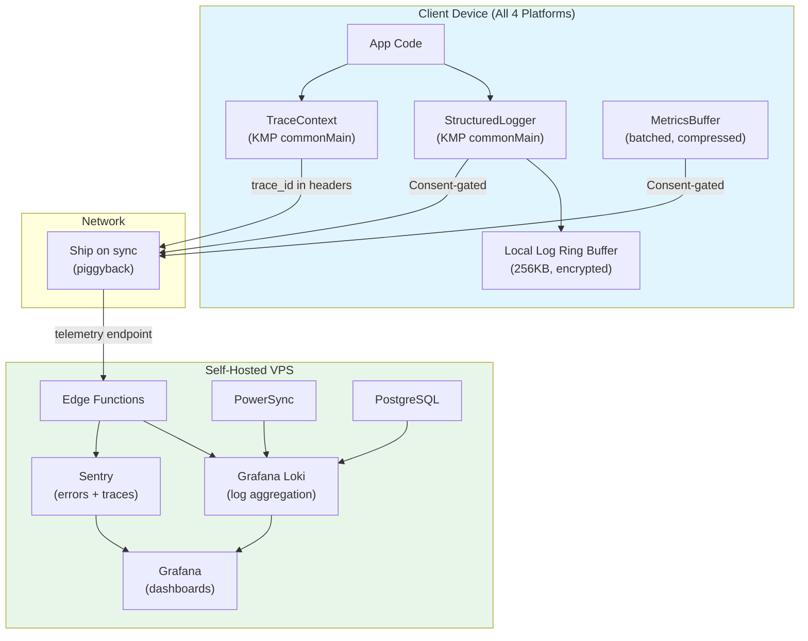
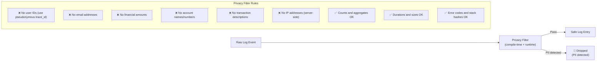
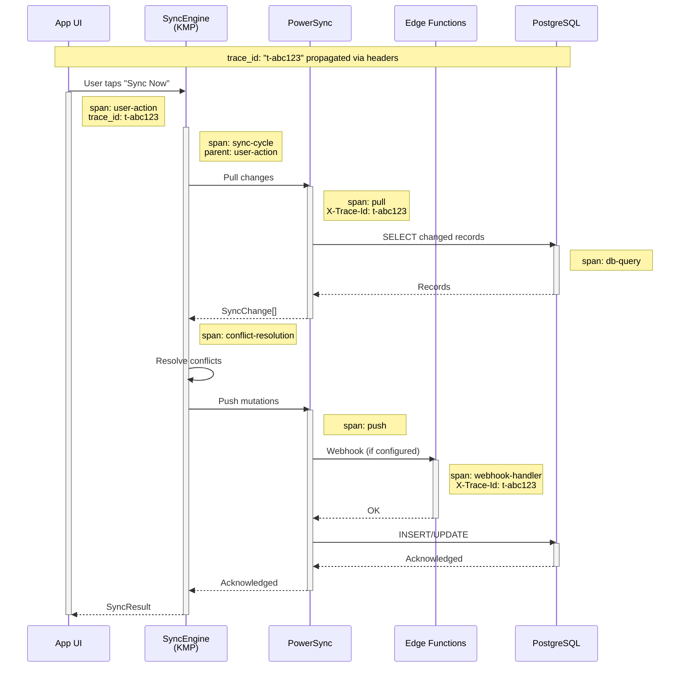
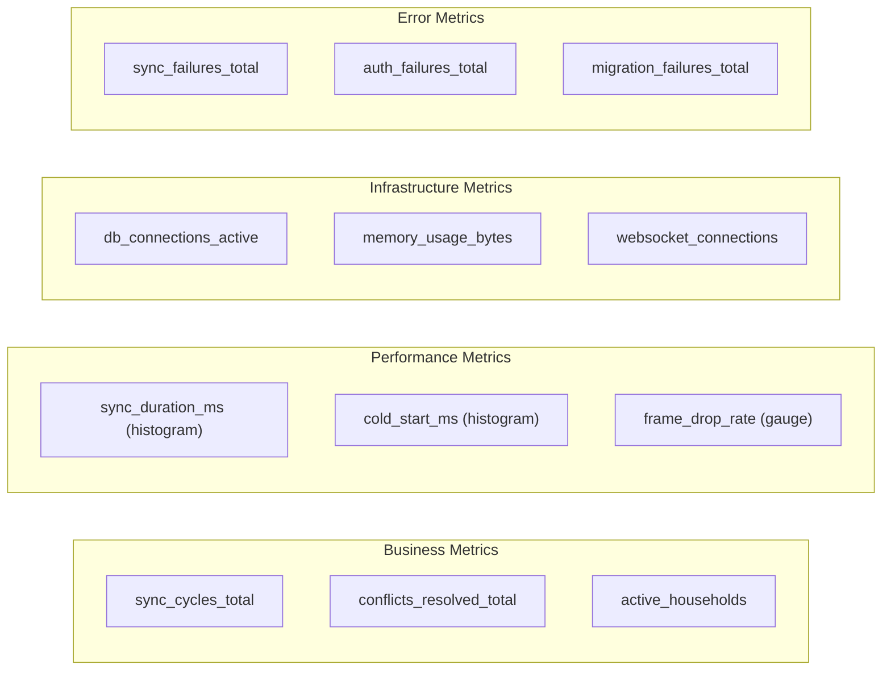
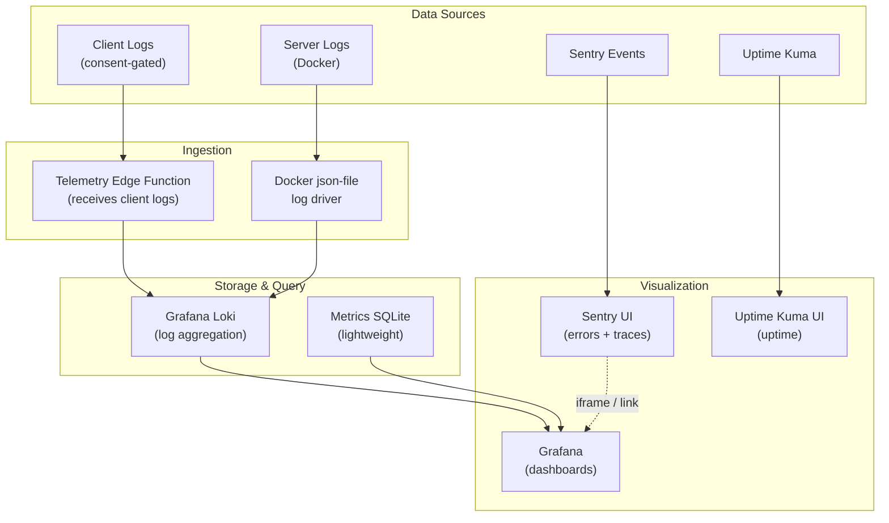
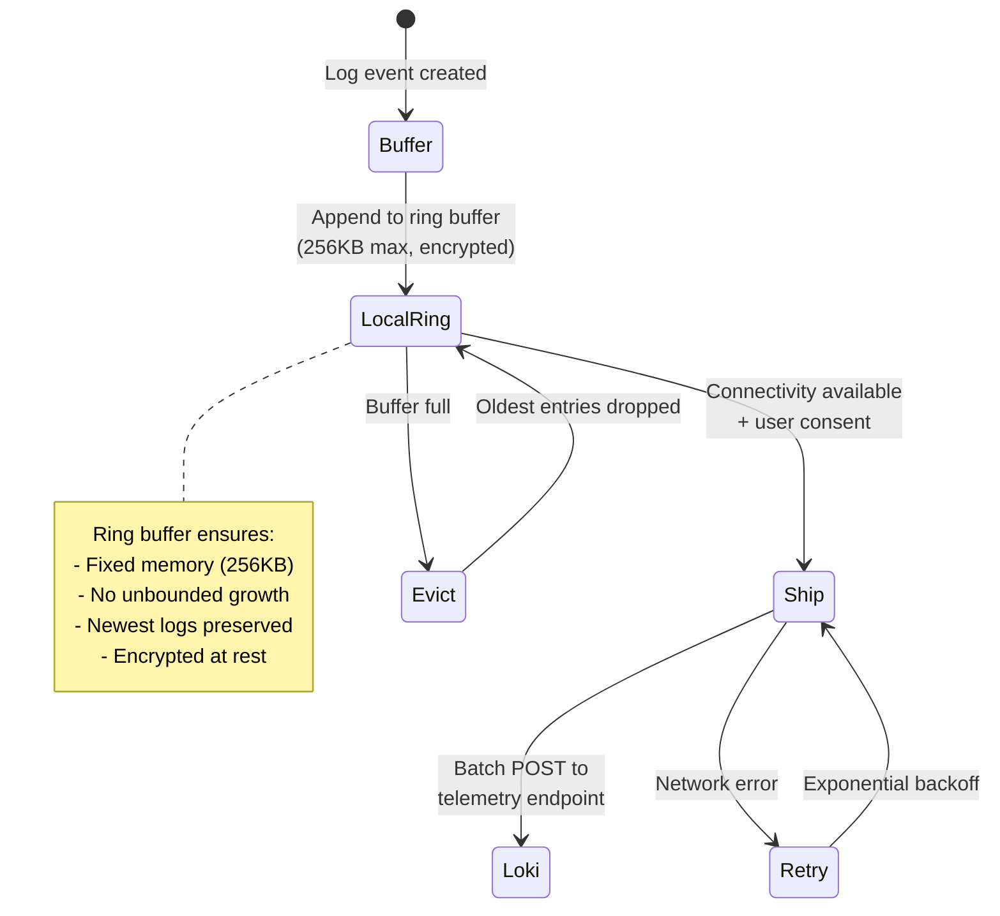

# ADR-0020: Monitoring & Observability Architecture

**Status:** Proposed
**Date:** 2025-07-28
**Author:** System Architect (AI agent)
**Reviewers:** Pending human review
**Sprint:** W2-S11
**Extends:** [Monitoring Architecture](./monitoring.md) · [Monitoring Infrastructure](./monitoring-infrastructure.md) · [Alerting Rules](./alerting-rules.md)

## Context

Finance has existing monitoring docs covering client-side error tracking (Sentry), infrastructure uptime (Uptime Kuma), and alerting rules. However, the observability stack lacks:

1. **Structured logging format** — No standardized log schema across client, sync, and backend
2. **Distributed tracing** — No way to follow a request from client → sync → backend → database and back
3. **Correlation** — No mechanism to link a client error to the server-side sync operation that caused it
4. **Observability budget** — Self-hosted VPS ($10–20/mo, ADR-0007) constrains tooling choices
5. **Privacy-safe telemetry** — All observability data must be PII-free by construction, not by filtering

### Current Observability Gaps

| Capability             | Current State                 | Gap                                 |
| ---------------------- | ----------------------------- | ----------------------------------- |
| Error tracking         | ✅ Sentry (client + server)   | Sufficient                          |
| Uptime monitoring      | ✅ Uptime Kuma                | Sufficient                          |
| Structured logging     | ❌ Ad-hoc console.log         | No schema, no correlation           |
| Distributed tracing    | ❌ None                       | Cannot trace sync lifecycle         |
| Performance monitoring | ⚠️ Sentry Performance (basic) | No custom traces for sync           |
| Log aggregation        | ⚠️ Docker json-file + jq      | No search, no retention policy      |
| Dashboard              | ⚠️ Uptime Kuma only           | No business metrics dashboard       |
| Alerting               | ✅ Defined rules              | Need implementation for new metrics |

### Observability Requirements

| Requirement                          | Priority | Rationale                                   |
| ------------------------------------ | -------- | ------------------------------------------- |
| Trace sync lifecycle end-to-end      | P0       | Sync failures are the #1 support issue      |
| Structured logs with correlation IDs | P0       | Debug production issues without PII         |
| Privacy-safe by design               | P0       | Financial app — no exceptions               |
| Sub-$30/mo total cost                | P1       | Self-hosted budget constraint               |
| Works offline (client-side)          | P1       | Edge-first principle applies to logging too |
| Dashboard for key metrics            | P2       | Operational visibility                      |

## Decision

Implement a **three-pillar observability architecture** (logs, traces, metrics) with a unified correlation model, privacy-safe structured logging, and self-hosted tooling within budget.

### Architecture Overview



### 1. Structured Logging Format

All components (client KMP, Edge Functions, PowerSync config, PostgreSQL) emit logs in a **unified JSON schema**.

#### Log Schema

```json
{
  "timestamp": "2025-07-28T10:15:30.123Z",
  "level": "info",
  "service": "sync-engine",
  "platform": "android",
  "app_version": "2.1.0",
  "trace_id": "abc123def456",
  "span_id": "span-789",
  "parent_span_id": "span-456",
  "correlation_id": "corr-user-action-001",
  "event": "sync.pull.complete",
  "data": {
    "records_pulled": 47,
    "duration_ms": 342,
    "conflicts_resolved": 2,
    "sync_version": 3
  },
  "error": null
}
```

#### Schema Field Definitions

| Field            | Type     | Required    | Description                                                                 |
| ---------------- | -------- | ----------- | --------------------------------------------------------------------------- |
| `timestamp`      | ISO 8601 | Yes         | When the event occurred (UTC)                                               |
| `level`          | enum     | Yes         | `debug`, `info`, `warn`, `error`, `fatal`                                   |
| `service`        | string   | Yes         | Component: `app`, `sync-engine`, `edge-function`, `powersync`, `postgresql` |
| `platform`       | string   | Yes         | `ios`, `android`, `web`, `windows`, `server`                                |
| `app_version`    | semver   | Yes         | Client app version or server deployment version                             |
| `trace_id`       | string   | Conditional | Distributed trace ID (required for sync operations)                         |
| `span_id`        | string   | Conditional | Current span within the trace                                               |
| `parent_span_id` | string   | No          | Parent span (for nesting)                                                   |
| `correlation_id` | string   | No          | Links related events across components                                      |
| `event`          | string   | Yes         | Dot-separated event name (e.g., `sync.push.failed`)                         |
| `data`           | object   | No          | Structured event-specific payload (NEVER contains PII)                      |
| `error`          | object   | No          | Error details: `{code, message, stack_hash}`                                |

#### Privacy Guarantees in Logging



**KMP compile-time enforcement:**

```kotlin
// packages/core/src/commonMain/kotlin/com/finance/core/logging/StructuredLogger.kt
interface StructuredLogger {
    fun log(level: LogLevel, event: String, data: LogData? = null)
    fun withContext(vararg pairs: Pair<String, SafeLogValue>): StructuredLogger

    // Only accepts SafeLogValue — not arbitrary strings
    // This prevents accidental PII logging at the type level
}

// Type-safe log values — PII cannot be represented
sealed class SafeLogValue {
    data class Count(val value: Int) : SafeLogValue()
    data class Duration(val millis: Long) : SafeLogValue()
    data class Size(val bytes: Long) : SafeLogValue()
    data class Code(val value: String) : SafeLogValue()    // Error codes, status codes
    data class Flag(val value: Boolean) : SafeLogValue()
    data class Identifier(val hash: String) : SafeLogValue() // SHA-256 of real ID
    // No free-form String value — prevents PII leakage
}
```

### 2. Distributed Tracing

#### Trace Propagation Model

A sync lifecycle trace flows across four components:



#### Trace Context Implementation

```kotlin
// packages/core/src/commonMain/kotlin/com/finance/core/tracing/TraceContext.kt
data class TraceContext(
    val traceId: String,          // Unique per end-to-end operation
    val spanId: String,           // Unique per component span
    val parentSpanId: String?,    // Links to parent span
    val startTime: Instant,
    val attributes: Map<String, SafeLogValue> = emptyMap(),
) {
    fun createChildSpan(name: String): TraceContext = copy(
        spanId = generateSpanId(),
        parentSpanId = this.spanId,
        startTime = Clock.System.now(),
    )

    fun toHeaders(): Map<String, String> = mapOf(
        "X-Trace-Id" to traceId,
        "X-Span-Id" to spanId,
        "X-Parent-Span-Id" to (parentSpanId ?: ""),
    )

    companion object {
        fun create(): TraceContext = TraceContext(
            traceId = "t-${generateId()}",
            spanId = "s-${generateId()}",
            parentSpanId = null,
            startTime = Clock.System.now(),
        )
    }
}
```

#### Trace Header Propagation

```http
-- Client → PowerSync
X-Trace-Id: t-abc123def456
X-Span-Id: s-sync-pull-789
X-Parent-Span-Id: s-sync-cycle-456

-- PowerSync → Edge Function (webhook)
X-Trace-Id: t-abc123def456
X-Span-Id: s-webhook-012
X-Parent-Span-Id: s-push-345
```

#### What Gets Traced

| Operation           | Spans Created                                          | Key Metrics                               |
| ------------------- | ------------------------------------------------------ | ----------------------------------------- |
| Sync cycle          | `sync-cycle` → `pull` → `conflict-resolution` → `push` | Total duration, records in/out            |
| Pull                | `pull` → `fetch-changes` → `decrypt` → `apply`         | Fetch latency, record count, decrypt time |
| Push                | `push` → `encrypt` → `send-batch` → `ack`              | Batch size, send latency, retry count     |
| Conflict resolution | `resolve` per conflict                                 | Strategy used, outcome                    |
| Auth token refresh  | `auth-refresh`                                         | Token age, refresh duration               |
| Migration           | `db-migration`                                         | From/to version, duration, rows affected  |

### 3. Metrics Collection

#### Metric Categories



#### Key Metrics Definitions

| Metric                          | Type      | Labels                           | Source | Alert Threshold     |
| ------------------------------- | --------- | -------------------------------- | ------ | ------------------- |
| `finance_sync_duration_ms`      | Histogram | platform, sync_type (full/delta) | Client | P95 > 5s → P1       |
| `finance_sync_failures_total`   | Counter   | platform, error_code             | Client | > 5% rate → P1      |
| `finance_conflicts_total`       | Counter   | table, strategy, outcome         | Client | > 10/hr → P2        |
| `finance_cold_start_ms`         | Histogram | platform                         | Client | P95 > budget → P2   |
| `finance_memory_bytes`          | Gauge     | platform                         | Client | > budget → P2       |
| `finance_auth_refresh_ms`       | Histogram | platform                         | Client | P95 > 2s → P2       |
| `finance_migration_duration_ms` | Histogram | from_version, to_version         | Client | P95 > 5s → P2       |
| `finance_db_connections`        | Gauge     | —                                | Server | > 80% pool → P1     |
| `finance_websocket_connections` | Gauge     | —                                | Server | > 80% capacity → P1 |
| `finance_api_latency_ms`        | Histogram | endpoint, status                 | Server | P95 > 500ms → P2    |
| `finance_sync_lag_seconds`      | Gauge     | —                                | Server | > 10s → P1          |

### 4. Observability Infrastructure Stack

Given the $10–20/mo budget (ADR-0007), the stack uses lightweight self-hosted tools:



#### Stack Components

| Component                   | Purpose                      | Resource Cost         | Monthly Cost         |
| --------------------------- | ---------------------------- | --------------------- | -------------------- |
| **Grafana Loki**            | Log aggregation + query      | ~200MB RAM            | $0 (self-hosted)     |
| **Grafana**                 | Dashboards + alerting        | ~150MB RAM            | $0 (self-hosted)     |
| **Sentry**                  | Error tracking + performance | External SaaS         | $0–26/mo (free tier) |
| **Uptime Kuma**             | Uptime monitoring            | ~100MB RAM            | $0 (self-hosted)     |
| **Telemetry Edge Function** | Client log receiver          | Shared with API       | $0 (existing infra)  |
| **Total**                   |                              | ~450MB additional RAM | **$0–26/mo**         |

#### Docker Compose Addition

```yaml
# Added to docker-compose.yml
loki:
  image: grafana/loki:2.9.0
  restart: unless-stopped
  command: -config.file=/etc/loki/loki-config.yaml
  volumes:
    - loki-data:/loki
    - ./config/loki-config.yaml:/etc/loki/loki-config.yaml:ro
  networks:
    - finance-internal
  deploy:
    resources:
      limits:
        memory: 256M

grafana:
  image: grafana/grafana:10.0.0
  restart: unless-stopped
  ports:
    - '3002:3000' # SSH tunnel only
  environment:
    - GF_SECURITY_ADMIN_PASSWORD__FILE=/run/secrets/grafana_admin_pw
    - GF_USERS_ALLOW_SIGN_UP=false
    - GF_AUTH_ANONYMOUS_ENABLED=false
  volumes:
    - grafana-data:/var/lib/grafana
    - ./config/grafana-dashboards:/etc/grafana/provisioning/dashboards:ro
    - ./config/grafana-datasources:/etc/grafana/provisioning/datasources:ro
  networks:
    - finance-internal
  deploy:
    resources:
      limits:
        memory: 256M
```

### 5. Client-Side Offline Logging

Logs must work offline (edge-first principle). Client logs are buffered locally and shipped when connectivity is available.



```kotlin
// packages/core/src/commonMain/kotlin/com/finance/core/logging/LogBuffer.kt
class LogRingBuffer(
    private val maxSizeBytes: Int = 256 * 1024, // 256KB
    private val encryptionKey: ByteArray,
) {
    private val entries = ArrayDeque<EncryptedLogEntry>()

    fun append(entry: LogEntry) {
        val encrypted = encrypt(entry.toJson(), encryptionKey)
        while (currentSizeBytes + encrypted.size > maxSizeBytes) {
            entries.removeFirst() // Evict oldest
        }
        entries.addLast(encrypted)
    }

    fun drain(): List<LogEntry> {
        val batch = entries.toList()
        entries.clear()
        return batch.map { decrypt(it, encryptionKey).toLogEntry() }
    }
}
```

### 6. Dashboard Specifications

#### 6.1 Operational Dashboard

```
┌──────────────────────────────────────────────────────────────────────────┐
│                     Finance Operations Dashboard                          │
├──────────────────┬──────────────────┬──────────────────┬─────────────────┤
│ Sync Health      │ Error Rate (24h) │ Active Users     │ Uptime          │
│ 🟢 Healthy       │ 🟢 0.3%          │ 247              │ 🟢 99.97%       │
│ Lag: 1.2s        │ (target: <1%)    │ (4 platforms)    │ (30d)           │
├──────────────────┴──────────────────┴──────────────────┴─────────────────┤
│ Sync Duration (P50/P95) — 7 Day Trend                                    │
│  P50: ▁▁▁▂▂▁▁ 340ms                                                     │
│  P95: ▂▂▃▃▄▃▂ 1.2s                                                      │
├──────────────────────────────────────────────────────────────────────────┤
│ Conflicts by Strategy (24h)         │ Platform Distribution              │
│ LWW:          12  ████████          │ iOS:     38% ████████████          │
│ Field Merge:   5  ████              │ Android: 42% █████████████         │
│ Counter CRDT:  2  ██                │ Web:     15% █████                 │
│ Manual Queue:  0                    │ Windows:  5% ██                    │
├──────────────────────────────────────────────────────────────────────────┤
│ Recent Errors (grouped by event)                                         │
│ sync.push.failed (auth_expired)     — 3 occurrences — last: 10m ago    │
│ migration.failed (v3_timeout)       — 1 occurrence  — last: 2h ago     │
└──────────────────────────────────────────────────────────────────────────┘
```

#### 6.2 Sync Deep-Dive Dashboard

```
┌──────────────────────────────────────────────────────────────────────────┐
│                     Sync Deep-Dive Dashboard                              │
├──────────────────────────────────────────────────────────────────────────┤
│ Sync Cycle Breakdown (avg)                                               │
│ ├── Auth check:        45ms  ██                                          │
│ ├── Pull (fetch):     280ms  ███████████                                 │
│ ├── Pull (decrypt):    35ms  █                                           │
│ ├── Conflict resolve:  20ms  █                                           │
│ ├── DB writes:        120ms  █████                                       │
│ ├── Push (encrypt):    25ms  █                                           │
│ └── Push (send):      150ms  ██████                                      │
│     Total:            675ms                                              │
├──────────────────────────────────────────────────────────────────────────┤
│ Trace Waterfall (sample trace: t-abc123)                                 │
│ ┌─ sync-cycle ──────────────────────────────────────── 675ms ──────────┐│
│ │  ┌─ pull ─────────────────────────── 335ms ─────┐                    ││
│ │  │  ┌─ fetch ──────── 280ms ──┐                  │                   ││
│ │  │  └─────────────────────────┘                  │                   ││
│ │  │  ┌─ decrypt ─ 35ms ─┐                        │                   ││
│ │  │  └──────────────────┘                         │                   ││
│ │  └───────────────────────────────────────────────┘                   ││
│ │  ┌─ resolve ─ 20ms ─┐                                               ││
│ │  └───────────────────┘                                               ││
│ │  ┌─ apply ────── 120ms ─────┐                                       ││
│ │  └──────────────────────────┘                                        ││
│ │  ┌─ push ─────────────── 175ms ──────┐                              ││
│ │  │  ┌─ encrypt ─ 25ms ─┐             │                              ││
│ │  │  └──────────────────┘             │                              ││
│ │  │  ┌─ send ──── 150ms ─────┐        │                              ││
│ │  │  └───────────────────────┘        │                              ││
│ │  └───────────────────────────────────┘                              ││
│ └─────────────────────────────────────────────────────────────────────┘│
└──────────────────────────────────────────────────────────────────────────┘
```

### 7. Alerting Integration

New alerts for observability metrics, extending the existing [Alerting Rules](./alerting-rules.md):

| Alert            | Priority | Condition                                  | Source      | Response                                   |
| ---------------- | -------- | ------------------------------------------ | ----------- | ------------------------------------------ |
| Sync lag spike   | P1       | `sync_lag_seconds` > 10s for 5min          | Grafana     | Check PowerSync; verify DB load            |
| Client log flood | P2       | > 1000 log events/min from single platform | Loki        | Investigate error loop; rate limit         |
| Trace gap        | P2       | < 50% of sync cycles have traces           | Grafana     | Check telemetry endpoint health            |
| Conflict spike   | P2       | > 50 conflicts/hour                        | Grafana     | Investigate data pattern; check sync rules |
| Loki disk usage  | P3       | > 80% of allocated volume                  | Grafana     | Increase retention policy pruning          |
| Grafana down     | P1       | Uptime Kuma health check fails             | Uptime Kuma | Restart container; check resources         |

### 8. Log Retention Policy

| Log Source              | Retention                   | Rationale                                  |
| ----------------------- | --------------------------- | ------------------------------------------ |
| Client telemetry (Loki) | 30 days                     | Short-term debugging; privacy minimization |
| Server logs (Loki)      | 90 days                     | Incident investigation window              |
| Sentry errors           | 90 days (free tier default) | Error tracking                             |
| Uptime history          | 365 days                    | SLA reporting                              |
| Grafana dashboards      | Indefinite (config-as-code) | Version controlled                         |
| Trace data              | 14 days                     | High volume; investigate promptly          |

## Alternatives Considered

### Alternative 1: Full OpenTelemetry Stack (Jaeger + Prometheus + Grafana)

- **Pros:** Industry standard; rich ecosystem; auto-instrumentation for many frameworks
- **Cons:** Prometheus + Jaeger require 1–2GB additional RAM; overkill for current scale; complex Kubernetes-oriented setup
- **Verdict:** Revisit at Tier 3 scaling (ADR-0011, 10K+ users)

### Alternative 2: Managed Observability (Datadog / New Relic)

- **Pros:** Zero ops; rich dashboards; AI-powered anomaly detection; auto-instrumentation
- **Cons:** $50–200+/mo minimum — exceeds entire infrastructure budget; vendor lock-in; data residency concerns for financial data
- **Verdict:** Not viable within budget constraints

### Alternative 3: Sentry-Only (Expand Sentry Usage)

- **Pros:** Already integrated; performance monitoring built in; single vendor
- **Cons:** Sentry free tier limited to 5K events/mo; not designed for log aggregation; no custom dashboards; trace depth limited
- **Verdict:** Sentry remains for errors + basic traces; Loki/Grafana handle logs + custom dashboards

### Alternative 4: No Observability (Console Logs + Manual Investigation)

- **Pros:** Zero cost; zero complexity
- **Cons:** Cannot diagnose production issues; no trending; no alerting on sync health; unacceptable for financial application
- **Verdict:** Rejected — financial apps require operational visibility

## Consequences

### Positive

- **End-to-end visibility** — Can trace a sync failure from user action to database query
- **Privacy-safe by construction** — `SafeLogValue` type system prevents PII at compile time
- **Budget-friendly** — Entire stack adds ~$0–26/mo and ~450MB RAM
- **Offline-capable** — Client-side ring buffer works without connectivity
- **Actionable dashboards** — Sync deep-dive dashboard enables rapid incident diagnosis
- **Correlation IDs** — Link client errors to server-side operations for support tickets

### Negative

- **Operational complexity** — Loki + Grafana are two more services to maintain
- **Client-side overhead** — Logging + tracing adds ~2–5ms per sync cycle
- **Consent dependency** — Client telemetry requires opt-in; may have low opt-in rate
- **Dashboard maintenance** — Grafana dashboards need updates as metrics evolve

### Risks

| Risk                                    | Likelihood | Impact | Mitigation                                                      |
| --------------------------------------- | ---------- | ------ | --------------------------------------------------------------- |
| Loki OOM on VPS                         | Low        | Medium | Memory limits in Docker; retention policy; alert on usage       |
| Low telemetry opt-in rate               | Medium     | Low    | Make opt-in prominent in onboarding; explain privacy guarantees |
| Log volume exceeds storage              | Medium     | Low    | Retention policy; ring buffer on client; rate limiting          |
| Grafana becomes single point of failure | Low        | Low    | Dashboards are config-as-code; can redeploy from Git            |
| Trace overhead impacts performance      | Low        | Low    | Sampling (1 in 10 traces in production); budget check           |

## Implementation Notes

### Phase Rollout

| Phase   | Components                             | Timeline |
| ------- | -------------------------------------- | -------- |
| Phase 1 | Structured logging format + KMP logger | V1.0     |
| Phase 2 | Loki + Grafana deployment              | V1.0     |
| Phase 3 | Distributed tracing (sync lifecycle)   | V1.1     |
| Phase 4 | Client telemetry shipping + dashboards | V1.1     |
| Phase 5 | Custom alerts in Grafana               | V1.2     |

### Loki Configuration

```yaml
# config/loki-config.yaml
auth_enabled: false

server:
  http_listen_port: 3100

ingester:
  lifecycler:
    ring:
      kvstore:
        store: inmemory
      replication_factor: 1

schema_config:
  configs:
    - from: 2025-01-01
      store: boltdb-shipper
      object_store: filesystem
      schema: v11
      index:
        prefix: index_
        period: 24h

storage_config:
  boltdb_shipper:
    active_index_directory: /loki/index
    cache_location: /loki/boltdb-cache
  filesystem:
    directory: /loki/chunks

limits_config:
  retention_period: 720h # 30 days for client logs
  max_streams_per_user: 1000
  max_entries_limit_per_query: 5000

compactor:
  working_directory: /loki/compactor
  retention_enabled: true
```

## References

- [Monitoring Architecture](./monitoring.md) — existing Sentry + sync health monitoring
- [Monitoring Infrastructure](./monitoring-infrastructure.md) — Uptime Kuma + Docker log setup
- [Alerting Rules](./alerting-rules.md) — existing P0–P3 alert definitions
- [Performance Baselines](./performance-baselines.md) — metric targets
- [Performance Budget Architecture](./performance-budget-architecture.md) — budget enforcement
- [ADR-0002: Backend & Sync Architecture](./0002-backend-sync-architecture.md)
- [ADR-0004: Auth & Security Architecture](./0004-auth-security-architecture.md)
- [ADR-0007: Hosting Strategy](./0007-hosting-strategy.md)
- [ADR-0011: Scaling Architecture](./0011-scaling-architecture.md)
- [Grafana Loki Documentation](https://grafana.com/docs/loki/latest/)
- [Grafana Documentation](https://grafana.com/docs/grafana/latest/)
- [OpenTelemetry Specification](https://opentelemetry.io/docs/specs/) (reference, not adopted)
