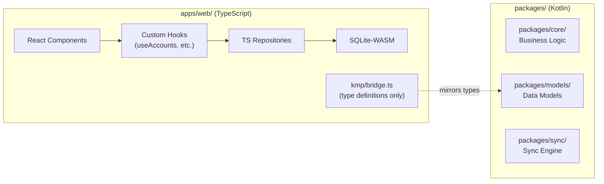

# ADR-0021: Web KMP Data Layer Integration Path

## Status

Proposed

## Date

2026-05-15

## Context

The web app (`apps/web/`) currently maintains a complete TypeScript data layer — repositories, hooks, and SQLite-WASM storage — that duplicates business logic already implemented in the KMP shared packages (`packages/core/`, `packages/models/`, `packages/sync/`). In parallel, a KMP-to-JS bridge has been prototyped in `apps/web/src/kmp/bridge.ts`, which defines TypeScript interfaces mirroring the KMP model types (`Account`, `Transaction`, `Budget`, `Goal`, etc.) and value types (`Cents`, `Currency`, `SyncId`).

This creates a "dual-path" situation documented in `copilot-instructions.md`:

> **KMP Web integration**: Dual-path — TypeScript repositories remain for beta while KMP JS bindings are validated in parallel via `apps/web/src/kmp/`

### Forces at Play

1. **Business logic duplication** — Financial calculations (budget rollover, goal tracking, categorization) exist in both TypeScript repositories and KMP `packages/core/`. Divergence between these implementations risks inconsistent behavior across platforms.
2. **Build complexity** — Kotlin/JS compilation adds Gradle to the web build pipeline, increasing CI time and developer onboarding friction. The current web stack (Vite + TypeScript) is fast and well-understood.
3. **Bundle size** — Kotlin/JS output historically produces large bundles. For a PWA that must load quickly on mobile browsers, this is a material concern.
4. **Type safety across the boundary** — The `bridge.ts` file manually mirrors KMP types. Any KMP model change requires a corresponding bridge update — a fragile synchronization point.
5. **Developer experience** — Web engineers work in TypeScript; requiring Kotlin knowledge narrows the contributor pool.
6. **Alpha timeline** — Alpha launch needs a stable, working web app. Migrating data layers mid-alpha risks destabilizing the app.

### Current Architecture

## Decision

**Adopt a phased hybrid integration strategy: TypeScript remains authoritative for alpha; KMP/JS is validated in parallel and adopted incrementally post-alpha, starting with the sync engine.**

### Phase 1: Alpha (Current → Alpha Launch)

- The TypeScript data layer (`repositories/`, `hooks/`) remains the production path for the web app.
- `apps/web/src/kmp/bridge.ts` continues to serve as the **type contract** — it is the single source of truth for the shape of data flowing between KMP and the web.
- Business logic that must be consistent across platforms (e.g., `Cents` arithmetic, budget period calculations) is extracted into pure TypeScript utility functions that mirror KMP implementations, validated by shared test vectors.
- No Kotlin/JS compilation is required in the web build pipeline during alpha.

### Phase 2: Post-Alpha — Sync Engine Migration

- Replace the web's custom sync logic with the KMP sync engine (`packages/sync/`) compiled to JS.
- The sync engine is the highest-value migration target because sync correctness is critical and hardest to keep consistent across two implementations.
- The `ConflictResolver` hierarchy and `ConflictStrategy` per-table mapping (see ADR-0022) must behave identically on all platforms.
- Bundle impact is measured before committing: target <100KB gzipped for the sync module.

### Phase 3: Post-Alpha — Core Logic Migration

- Migrate financial calculations from TypeScript to KMP/JS (`packages/core/`): budget rollover, goal progress, categorization rules, multi-currency conversion.
- TypeScript repositories thin down to a data-access adapter calling into KMP-provided logic.
- React hooks remain TypeScript — they are the idiomatic React integration layer.

### Phase 4: Long-Term — Generated Bridge

- Replace the manually-maintained `bridge.ts` with auto-generated TypeScript declarations from KMP model metadata (via a Gradle plugin or build script).
- This eliminates the manual synchronization burden and ensures type safety at the boundary.

## Alternatives Considered

### Full KMP/JS Migration Now

Replace all TypeScript repositories and business logic with KMP/JS before alpha.

**Rejected because:**

- High risk to alpha timeline — migration would touch every data path in the web app.
- Kotlin/JS build adds ~45–90s to CI and requires Gradle in the web pipeline.
- Bundle size impact is unvalidated — could regress PWA load time.
- Web engineers lose the ability to debug and iterate in familiar TypeScript tooling.

### TypeScript-Only with API Contract Alignment

Keep the web entirely in TypeScript; align behavior through shared OpenAPI/JSON Schema contracts and integration tests, never use KMP on the web.

**Rejected because:**

- Permanent business logic duplication across TypeScript and Kotlin — every formula, validation rule, and edge case must be implemented and maintained twice.
- Financial calculation consistency becomes a testing problem rather than a structural guarantee.
- Contradicts the project's KMP-first architecture decision (ADR-0001).

### Immediate Thin Bridge (WASM)

Compile KMP to WebAssembly instead of JS for better performance and smaller output.

**Rejected because:**

- Kotlin/WASM is experimental (as of 2026) and not production-ready.
- WASM interop with JS is more complex than Kotlin/JS interop.
- Revisit when Kotlin/WASM reaches stable status.

## Consequences

### Positive

- Alpha timeline is protected — no risky migration during the critical launch window.
- Web developers continue working in TypeScript with familiar tooling.
- The phased approach validates bundle size and performance before each migration step.
- `bridge.ts` establishes a clear contract that makes future migration mechanical rather than exploratory.
- Sync engine migration (Phase 2) delivers the highest correctness value first.

### Negative

- Business logic duplication persists through alpha — TypeScript and KMP implementations may diverge.
- Shared test vectors must be maintained to catch divergence (manual effort).
- The bridge file (`bridge.ts`) requires manual updates when KMP models change until Phase 4.
- Web app cannot benefit from KMP bug fixes until the corresponding module is migrated.

## Implementation Notes

- **Shared test vectors**: Create `packages/core/src/commonTest/resources/test-vectors/` with JSON files containing input/output pairs for financial calculations. Web tests load the same JSON files to verify TypeScript implementations match.
- **Bundle budget**: Add a CI check that measures Kotlin/JS output size for each KMP package compiled to JS. Block Phase 2/3 migrations if output exceeds the budget defined in `performance.budget.json`.
- **Feature flag**: Gate KMP/JS sync engine behind a `kmp_web_sync` feature flag so it can be enabled per-user for validation before full rollout.
- **Bridge generation**: Evaluate `dukat` (Kotlin/JS TypeScript declaration generator) and custom Gradle tasks for Phase 4 bridge generation.
