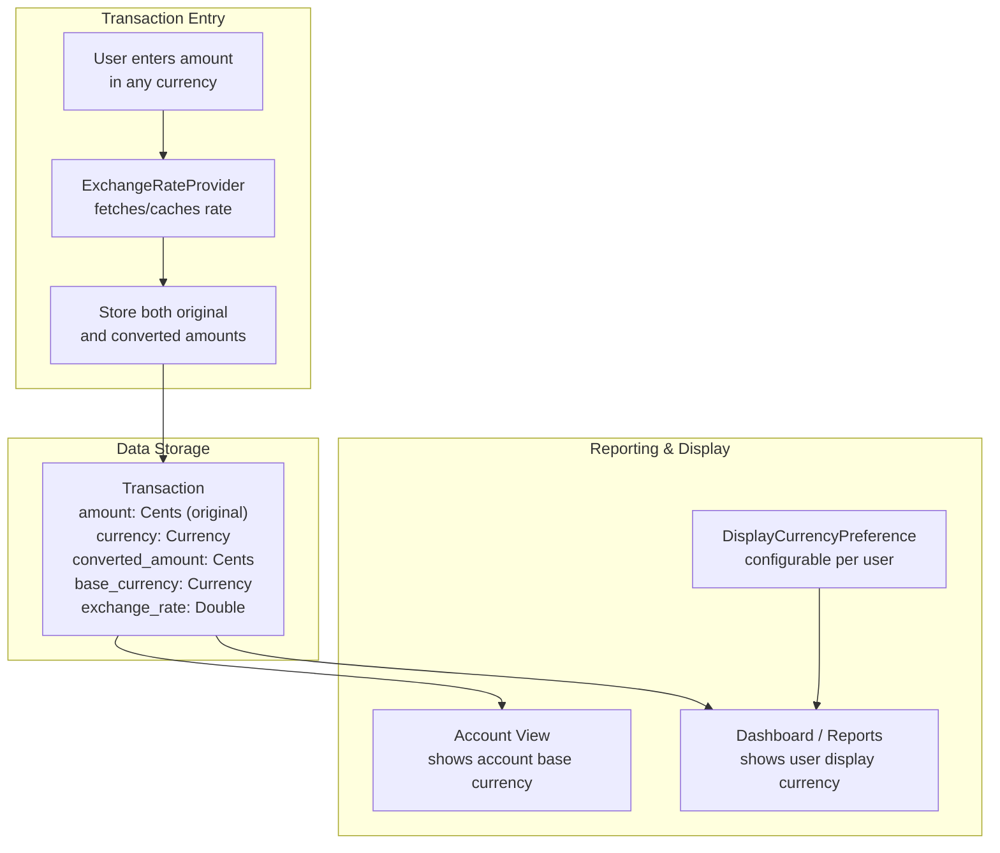

# ADR-0025: Multi-Currency Architecture Direction

## Status

Proposed

## Date

2026-05-15

## Context

Finance targets users who deal with multiple currencies — travelers, expatriates, international freelancers, and households spanning currency zones. The existing codebase already contains substantial multi-currency infrastructure:

### Existing Implementation

- **`packages/core/src/commonMain/kotlin/com/finance/core/currency/`** — `ExchangeRate` model (with inverse calculation), `ExchangeRateProvider` interface, `CurrencyConverter`, and `CurrencyFormatter`.
- **`packages/core/src/commonMain/kotlin/com/finance/core/multicurrency/`** — `MultiCurrencyEngine`, `MultiCurrencyService`, `MultiCurrencyModels` (including `AccountCurrencyConfig`, `TransactionCurrencyInfo`, `DisplayCurrencyPreference`, `ConversionAtEntryResult`, `MultiCurrencyReportResult`), `CurrencyCatalog`, and `LocaleCurrencyFormatter`.
- **`packages/models/`** — `Account` and `Transaction` models already include `currency: Currency` fields. `Budget` and `Goal` also have `currency` fields.
- **`apps/web/src/kmp/bridge.ts`** — TypeScript `Currency` interface and `Currencies` constants (USD, EUR, GBP, JPY, CAD) mirror the KMP types.
- **Server** — `20260328000004_exchange_rates.sql` and `20260330000002_exchange_rates_enhancements.sql` migrations exist for exchange rate storage.
- **`User` model** — has a `defaultCurrency` field.

### Key Design Questions

1. **Storage**: Should transactions store only their original currency amount, or also a converted "base" amount? The existing `TransactionCurrencyInfo` model stores both.
2. **Exchange rates**: How are rates obtained, cached, and used offline? The `ExchangeRateProvider` interface exists but the caching/offline strategy is undefined.
3. **Reporting**: When aggregating across currencies for dashboards and reports, which rate is used — entry-time rate or current rate? Both have valid use cases.
4. **Sync**: Exchange rates must sync across devices but update frequently — how does this interact with PowerSync's sync model?
5. **Precision**: Exchange rates are floating-point (`Double`) but monetary values are integer cents (`Long`). Conversion introduces rounding — where and how is this managed?

### Alpha Scope Constraint

Full multi-currency with real-time rates, historical rate charts, and per-transaction rate editing is a large feature surface. Alpha needs a working, correct foundation — not every feature.

## Decision

**Native multi-currency storage with entry-time rate capture, configurable reporting currency, and offline-capable cached exchange rates. Alpha supports display and storage; advanced reporting and historical rate analysis are post-alpha.**

### Core Architecture



### Storage Model

Every monetary record stores its **original currency and amount**. When the transaction currency differs from the account's base currency, the **converted amount and rate at entry time** are also stored:

```kotlin
// Already modeled in TransactionCurrencyInfo:
data class TransactionCurrencyInfo(
    val originalAmount: Cents,        // What the user entered
    val originalCurrency: Currency,   // Currency of entry
    val convertedAmount: Cents,       // Converted to account base currency
    val baseCurrency: Currency,       // Account's base currency
    val exchangeRate: Double,         // Rate used at entry time
    val rateTimestamp: Instant,       // When the rate was captured
)
```

**Design rule: The original amount and currency are immutable and authoritative.** The converted amount is a derived, cached value that can be recalculated if rates are corrected.

### Exchange Rate Strategy

**a. Rate source**: A single `ExchangeRateProvider` implementation fetches rates from an external API (e.g., exchangerate.host, Open Exchange Rates). The provider is injected via DI and can be swapped for testing.

**b. Caching**: Rates are cached locally in an `exchange_rates` SQLite table (via SQLDelight) with a TTL of **4 hours** for active use and **24 hours** for offline fallback. The cache key is the currency pair + date.

**c. Offline behavior**: When offline, the most recent cached rate is used. The `ConversionAtEntryResult.isOfflineRate` flag is set to `true`, and transactions entered with offline rates are flagged for optional review when connectivity returns.

**d. Rate precision**: Exchange rates are stored as `Double` (IEEE 754 64-bit). Conversion to `Cents` rounds using banker's rounding (`RoundingMode.HALF_EVEN` equivalent) to minimize systematic bias. The conversion formula:

```
convertedCents = round(originalCents * exchangeRate)
```

For currencies with different decimal places (e.g., JPY with 0 vs. USD with 2), the conversion accounts for the decimal place difference:

```
convertedSmallestUnit = round(
    originalSmallestUnit * exchangeRate * 10^(targetDecimals - sourceDecimals)
)
```

### Reporting Currency

- Each user has a `DisplayCurrencyPreference` (already modeled) that sets their **reporting currency** — used for dashboard totals, budget summaries, and cross-account aggregations.
- **Account views** always display in the account's base currency — no conversion.
- **Aggregated views** (dashboard, net worth, spending reports) convert all amounts to the reporting currency using the **entry-time rate** by default.
- Post-alpha: add a "current rate" toggle for aggregated views so users can see current-value equivalents.

### Alpha Scope

**Included in alpha:**

- Per-account base currency setting.
- Transaction entry in any currency with automatic conversion to account base currency.
- Offline rate caching with stale-rate indicator.
- Reporting currency preference (user setting).
- Dashboard totals in reporting currency.
- `Currencies` catalog with ISO 4217 codes and decimal places.

**Deferred to post-alpha:**

- Historical exchange rate charts and trends.
- Per-transaction rate override/editing by the user.
- Multi-currency budget tracking (budgets remain in a single currency for alpha).
- Currency gain/loss reporting.
- Automatic rate refresh push notifications.
- Support for cryptocurrencies (non-ISO-4217 codes).

### Sync Considerations

- Exchange rates sync via PowerSync like any other table, but with a **shorter sync interval** for the `exchange_rates` table (configurable in sync rules).
- Rate conflicts use **server-wins** strategy — the server's rate is authoritative since it comes from the external API.
- `TransactionCurrencyInfo` is embedded in the transaction record and syncs with it — no separate sync for conversion metadata.

## Alternatives Considered

### Single Base Currency with Display-Only Conversion

Store all amounts in a single base currency (e.g., USD). Show converted amounts in the UI but never store the original foreign currency amount.

**Rejected because:**

- Loses the original transaction amount — the user cannot see what they actually paid in the local currency.
- Historical accuracy degrades: if the base currency rate changes, all historical amounts would need recalculation, but the original amount is lost.
- Users in non-USD countries would see all their transactions converted away from their local currency — poor UX.
- Contradicts the existing model where `Account` and `Transaction` already have `currency` fields.

### Full Real-Time Multi-Currency with Live Rate Streaming

Maintain a WebSocket connection for live exchange rate updates and recalculate all displayed amounts in real-time.

**Rejected because:**

- Contradicts edge-first architecture — requires constant network connectivity for a display feature.
- Battery and data consumption impact on mobile devices.
- Exchange rate volatility at the per-second level is irrelevant for personal finance (daily or 4-hour granularity is sufficient).
- Significantly increases backend complexity and cost (rate streaming service).

### Store Only Original Currency, Convert on Display

Store only the original amount and currency; compute conversions on-the-fly whenever displaying aggregated views.

**Rejected because:**

- Aggregation queries become expensive — every sum requires a rate lookup and conversion per row.
- Offline aggregation requires all rates for all currencies in all time periods to be cached locally.
- The entry-time rate (what was the actual cost at the time?) is lost unless stored separately anyway.
- The existing `TransactionCurrencyInfo` model already stores both — this alternative would discard existing infrastructure.

## Consequences

### Positive

- Users always see their original transaction amounts in the original currency — no data loss.
- Entry-time rate capture preserves historical accuracy for financial reporting.
- Offline operation works with cached rates and clear staleness indicators.
- The existing multi-currency infrastructure (`MultiCurrencyEngine`, `TransactionCurrencyInfo`, `DisplayCurrencyPreference`) is validated and adopted — no wasted work.
- Reporting currency is configurable per user — supports households where members prefer different currencies.

### Negative

- Dual storage (original + converted) increases per-transaction storage by ~24 bytes (an additional `Long` + `Double` + `Currency` code).
- Exchange rate caching requires periodic background refresh — adds background task complexity on all platforms.
- Rounding errors from `Double` exchange rates are unavoidable — must be documented and bounded (maximum 1 cent per conversion for common currency pairs).
- Alpha scope limitation means budgets are single-currency — users with multi-currency spending must mentally convert budget limits.

## Implementation Notes

- **Rate provider implementation**: Create a concrete `HttpExchangeRateProvider` in `packages/core/` that fetches from a configurable API endpoint. Use Ktor for HTTP. Inject via Koin (Android/Windows) or protocol-based DI (iOS).
- **SQLDelight rate cache**: Add an `exchange_rates` table to the SQLDelight schema: `id TEXT PRIMARY KEY, from_currency TEXT, to_currency TEXT, rate REAL, fetched_at TEXT, expires_at TEXT`.
- **Conversion rounding**: Implement `CurrencyConverter.convert(amount: Cents, rate: ExchangeRate): Cents` using banker's rounding. Add exhaustive test cases for JPY↔USD (0 vs 2 decimal places), sub-cent amounts, and very small/large rates.
- **Stale rate UX**: On all platforms, display a subtle indicator (e.g., clock icon or "rate from 6h ago" tooltip) when a cached rate older than 4 hours is used for display. On transaction entry with an offline rate, show a non-blocking banner.
- **Feature flag**: Gate multi-currency entry behind `multi_currency_entry` feature flag. Alpha can enable it for specific users/testers before broad rollout.
- **Performance**: Pre-compute and cache aggregated reporting-currency totals per account per day. Invalidate when a transaction is added/modified or when the reporting currency preference changes. Avoid recomputing across all transactions on every dashboard render.
