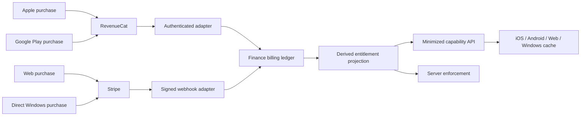

# ADR-0027: Server-Authoritative Subscription Entitlements

**Status:** Accepted
**Date:** 2026-09-06
**Author:** GitHub Copilot, on behalf of the Finance product owner
**Reviewers:** Finance product owner

## Context

Finance has four platform clients and three purchase ecosystems, but its current
subscription implementations make authorization decisions locally. iOS reads
StoreKit state, Android has a Free-only stub, Windows has a local two-tier
engine, and Web persists a local feature-gate tier. The legacy
`family_plan_subscriptions` table is also client-writable and contains
client-supplied price data. None of these surfaces is trusted financial evidence.

This creates inconsistent access decisions and leaves server-side costs, most
urgently recurring bank-aggregator Items, without a trustworthy tier gate. The
system needs one authority while retaining an edge-first experience for
non-sensitive UI decisions.

The commercial allocation governed by this decision is versioned separately in
the [subscription entitlement catalog](../business/pricing/subscription-entitlement-catalog.md).

## Decision

Finance will own a normalized billing ledger and derived entitlement projection
in PostgreSQL. That projection is the **only runtime authorization authority**.

- Apple and Google purchase evidence enters through RevenueCat.
- Web and direct-distributed Windows purchase evidence enters through Stripe.
- Microsoft Store billing is deferred behind a future provider adapter.
- Provider events are authenticated, normalized, ordered, and applied
  idempotently before they affect the projection.
- Clients receive a minimized capability snapshot. They may cache it only until
  its server-issued expiry for offline UI behavior.
- Every server action that incurs cost or exposes paid behavior checks the
  authoritative projection. It never trusts a client tier, local receipt, SDK
  state, JWT claim, cached snapshot, product identifier, or price.

### Trust boundaries

Trusted evidence is limited to authenticated provider events and explicit
provider reconciliation performed by server credentials. Provider financial
state is evidence; it is not the authorization read path. Finance normalizes
that evidence and derives current capabilities.

The following are never authorization sources:

- StoreKit, Google Play Billing, RevenueCat, or Stripe client SDK state
- client-submitted receipts, prices, tiers, customer identifiers, or household
  identifiers
- JWT entitlement claims
- PowerSync rows
- local caches and feature-flag evaluation
- the legacy `family_plan_subscriptions` table

Feature flags may control rollout and presentation, but cannot grant an
entitlement.

### Identity and scope

A stable Finance billing account identifies the purchaser without using email
as a provider identity key.

- Plus and Premium follow the purchaser.
- Premium can explicitly sponsor one eligible household.
- Premium bank add-ons apply only to that billing account's sponsored
  household.
- Multiple Premium sponsors do not stack base allowances or add-ons. A
  capability uses the highest applicable allowance from one sponsor.
- Family is bound to one household for the lifetime of the verified purchase.
  Changing its billing owner or moving it to another household requires
  cancellation and a new verified purchase.
- Household membership changes immediately refresh affected projections.

### Lifecycle and ordering

The normalized lifecycle supports `trialing`, `active`,
`cancelled_paid_through`, `past_due_grace`, `paused_paid_through`, `expired`,
`refunded`, and `chargeback`.

- Trial, paid-through, and grace access ends at provider-authenticated
  timestamps.
- Cancellation does not revoke an already paid period.
- Refunds and chargebacks revoke at the trusted effective time and cannot be
  undone by an older event.
- Expiry may return to active only through an explicitly normalized,
  strictly newer provider renewal or reactivation event.
- Duplicate events are no-ops. Provider ordering plus deterministic
  equal-time precedence prevents stale events from resurrecting access.
- Reconciliation repairs missed webhooks through the same idempotent ledger
  path.

### Privacy and data flow

Raw provider payloads, receipts, payment instruments, provider customer IDs,
provider subscription IDs, and credentials remain server-only. The ledger
stores only normalized evidence required for authorization, reconciliation,
audit, and legally required financial records. Logs, analytics, crash reports,
exports, PowerSync, and public APIs exclude provider identifiers and financial
payloads.

All billing, event, grant, and projection tables use RLS and deny direct
authenticated access. Provider adapters write with service authority. Clients
read only a minimized API that contains capability values, scope, projection
version, server time, and expiry.

### Downgrades and recurring provider cost

A reduction in bank allowance asks the household to select connections to
retain. If no valid selection is made, Finance keeps the oldest connections by
`created_at`, with `id` as the deterministic tie-breaker.

Connections selected for removal are disabled immediately and placed in a
server-only durable revocation workflow. Finance retains only the encrypted
credential needed to retry provider revocation. It purges that credential and
soft-deletes the connection only after the provider confirms revocation or
reports that the Item is already invalid. Financial history and export remain
available.

## Alternatives Considered

### Client or store SDK as authority

- **Rejected:** works offline but is inconsistent across platforms, is easy to
  forge, and cannot protect server-side costs.

### RevenueCat as the universal authority

- **Rejected:** it does not cover the approved direct Stripe path and would
  make runtime authorization depend on a third party rather than Finance's
  tenant and household model.

### Sync the entitlement ledger through PowerSync

- **Rejected:** exposes unnecessary billing metadata and creates a writable or
  stale authorization surface. A minimized expiring snapshot provides offline
  UX without making local state authoritative.

### Direct Apple and Google integrations

- **Rejected for the initial implementation:** duplicated receipt,
  notification, transfer, and reconciliation logic adds risk without changing
  Finance's authority model.

## Consequences

### Positive

- Every platform and server action resolves the same capability state.
- Provider replay, stale events, refunds, and missed webhooks have explicit
  deterministic handling.
- Provider identifiers and raw financial evidence stay outside client sync.
- Offline clients retain bounded UI continuity without authorizing server
  actions.
- Bank-aggregator cost limits become enforceable from trusted evidence.

### Negative

- Finance must operate two provider adapters plus reconciliation.
- Purchase confirmation can be temporarily pending while provider evidence is
  applied.
- Downgrades require durable background work rather than a single database
  update.

### Risks

- **Provider outage or missed webhook:** reconcile through provider APIs and
  apply through the same idempotent ledger.
- **Projection bug:** retain normalized events, version projections, and make
  rebuilds deterministic.
- **Offline clock manipulation:** use server time and a server-issued expiry;
  stale caches fail closed for paid operations.
- **Revocation outage:** persist encrypted retry material, disable sync
  immediately, and alert when automated retries are exhausted.

## Implementation Notes

Delivery is staged under [#4386](https://github.com/jrmoulckers/finance/issues/4386):

1. normalized ledger, grants, projections, RLS, and tests;
2. RevenueCat and Stripe adapters with reconciliation;
3. minimized API and four-platform client consumption;
4. tier-aware bank enforcement with pre-exchange slot reservations;
5. downgrade and durable provider revocation;
6. independent security, privacy, and reliability signoff.

The legacy `family_plan_subscriptions` schema may remain temporarily for client
compatibility, but authenticated mutation and PowerSync delivery must be
removed before the new projection authorizes access.

Rollback disables provider adapters and paid enforcement before reverting
schema. Normalized provider evidence must not be destructively removed from an
environment that has processed real events.

## Human-Gated Operations

The implementation may prepare configuration and runbooks, but a human must
approve or perform:

- RevenueCat processor, privacy, DPA, and economic review;
- production provider secrets and product/price creation;
- production webhook registration;
- store product configuration;
- production migrations and deployment.

## References

- [Subscription entitlement catalog](../business/pricing/subscription-entitlement-catalog.md)
- [ADR-0015: Premium/Freemium Architecture](./0015-premium-architecture.md) (superseded)
- [Aggregator cost strategy](../business/revenue/aggregator-cost-strategy.md)
- [Parent issue #4386](https://github.com/jrmoulckers/finance/issues/4386)
- [Ratification issue #4399](https://github.com/jrmoulckers/finance/issues/4399)
