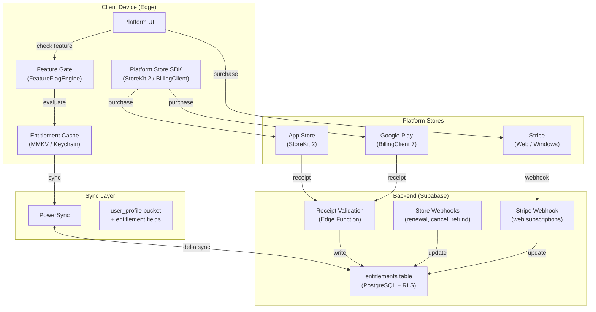
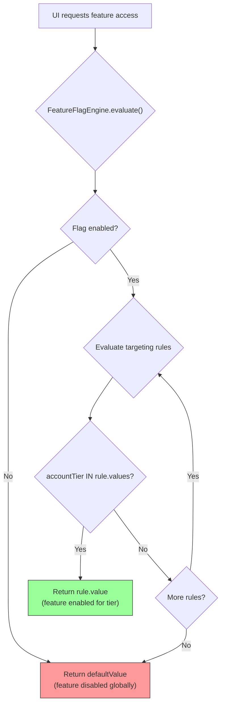
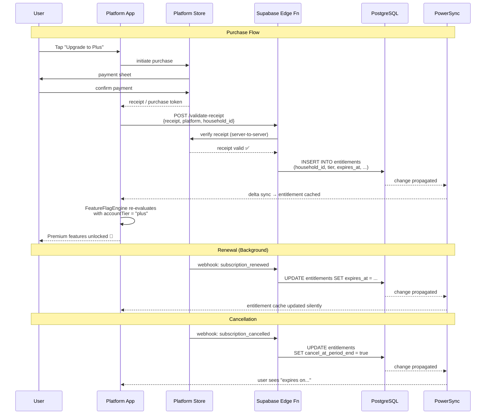
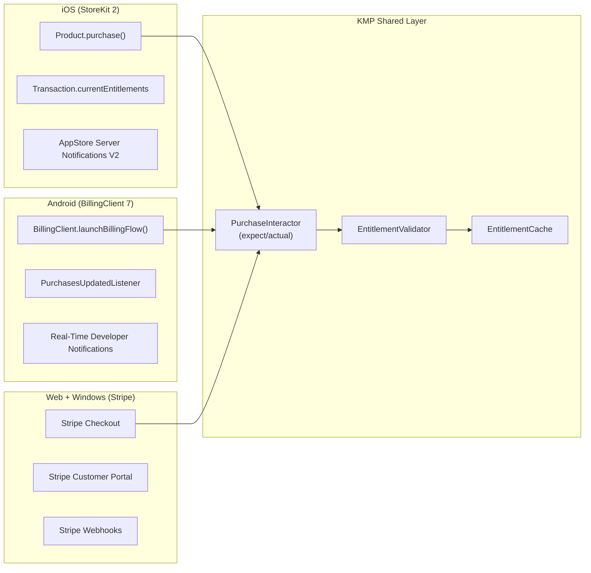
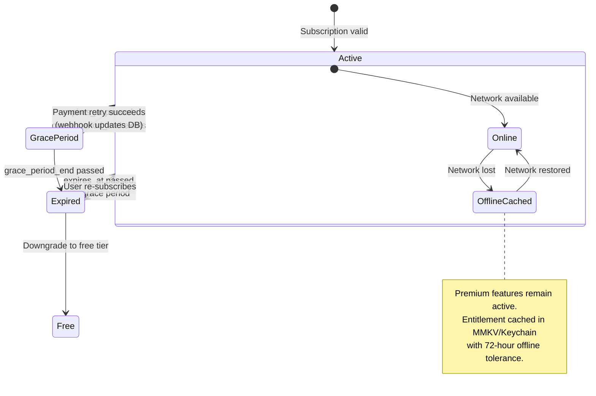
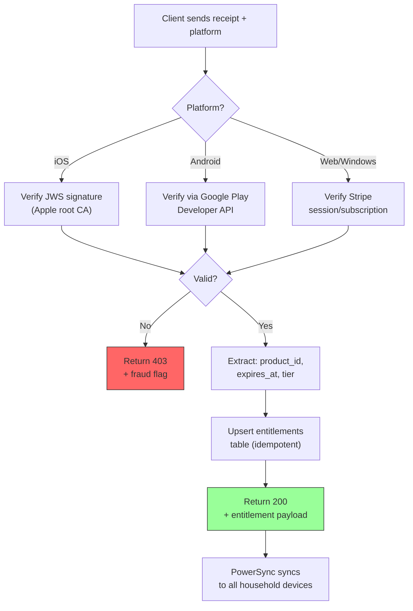
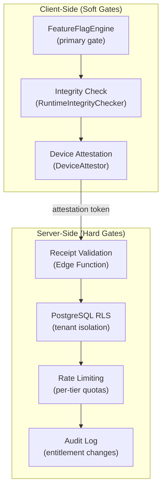

# ADR-0015: Premium/Freemium Architecture

**Status:** Proposed
**Date:** 2025-04-21
**Author:** System Architect (AI agent)
**Reviewers:** Pending human review

## Context

Finance is transitioning from a single-tier application to a freemium model with premium subscription tiers (per ADR-0009 §2.6 — BSL 1.1 with monetization). The architecture must support:

1. **Feature gating** — Certain features are locked behind premium tiers. The gating logic must be evaluated **on-device** (edge-first) to work offline and avoid server round-trips for every UI interaction.
2. **Multi-platform subscriptions** — Users purchase subscriptions through platform stores (App Store, Google Play) or web (Stripe). Each platform has its own receipt format, validation API, and billing lifecycle.
3. **Household sharing** — A premium subscription purchased by one household member must extend to all members (per ADR-0004 RBAC). The "Owner" manages billing; all members receive entitlements.
4. **Offline entitlements** — Users must retain premium access when offline. Grace periods prevent immediate downgrade during connectivity gaps.
5. **Existing infrastructure** — The codebase already has `FeatureFlagEngine`, `EvaluationContext`, `FeatureFlags` registry, and `SubscriptionDetector` in `packages/core/`. The sync layer uses PowerSync with `by_household` and `user_profile` buckets.

### Forces

- **Edge-first principle:** Entitlement checks must not require network calls. A user on an airplane must still see their premium features.
- **Privacy principle:** Subscription status is sensitive data. Minimal information should be synced; purchase receipts should never leave the device except for server-side validation.
- **Revenue integrity:** The system must resist trivial bypass (e.g., local-only flag manipulation) while accepting that a determined attacker with device access can always bypass client-side checks.
- **Platform store rules:** Apple and Google require in-app purchases for digital goods/services consumed within native apps. Web can use direct payment processors.

## Decision

Adopt a **hybrid entitlement architecture** where subscription state is managed server-side (source of truth) but cached and evaluated client-side (edge-first).

### 1. Tier Definitions

```
┌─────────────────────────────────────────────────────────────┐
│                     Finance Tiers                            │
├──────────────┬──────────────────┬───────────────────────────┤
│   Free       │   Plus           │   Pro                     │
│   $0/forever │   $4.99/mo       │   $9.99/mo                │
│              │   $39.99/yr      │   $79.99/yr               │
├──────────────┼──────────────────┼───────────────────────────┤
│ 2 accounts   │ Unlimited accts  │ Everything in Plus        │
│ 1 household  │ 5 household mbrs │ Unlimited household mbrs  │
│ Basic budget │ Advanced budgets │ AI categorization (ML)    │
│ Manual entry │ CSV import       │ Bank connections (Plaid)  │
│ Basic charts │ Trend analytics  │ Predictive budgeting      │
│ 30-day hist. │ Full history     │ Receipt OCR               │
│              │ Budget rollover  │ Custom reports & export   │
│              │ Recurring detect │ Priority support          │
│              │ Multi-currency   │ API access                │
│              │ Goal tracking    │                           │
└──────────────┴──────────────────┴───────────────────────────┘
```

### 2. Entitlement Architecture



### 3. Feature Gating — KMP Shared Logic

Feature gating leverages the existing `FeatureFlagEngine` with a new `accountTier` attribute in `EvaluationContext`:



**Integration with existing code:**

The `EvaluationContext.Builder` already supports `accountTier(tier: String)`. Feature flags in the `FeatureFlags` registry already include `PREMIUM_FEATURES` and `FREE_TIER_MAX_ACCOUNTS`. The architecture extends this by:

1. Adding new flag keys for each gated feature (e.g., `premium.csv-import.enabled`, `premium.bank-connections.enabled`).
2. Adding targeting rules that match on `accountTier` IN `["plus", "pro"]`.
3. Syncing tier status via PowerSync so flags evaluate correctly offline.

### 4. Subscription Lifecycle



### 5. Entitlement Data Model

```sql
-- Entitlements table (synced via PowerSync user_profile bucket)
CREATE TABLE entitlements (
    id              UUID PRIMARY KEY DEFAULT gen_random_uuid(),
    household_id    UUID NOT NULL REFERENCES households(id),
    user_id         UUID NOT NULL REFERENCES users(id),    -- purchaser
    tier            TEXT NOT NULL DEFAULT 'free',           -- 'free', 'plus', 'pro'
    platform        TEXT NOT NULL,                          -- 'ios', 'android', 'web', 'windows'
    store_product_id TEXT,                                  -- platform-specific product ID
    store_tx_id     TEXT,                                   -- platform transaction ID (encrypted)
    expires_at      TIMESTAMPTZ,                            -- NULL for lifetime/free
    cancel_at_period_end BOOLEAN DEFAULT FALSE,
    grace_period_end TIMESTAMPTZ,                           -- billing retry grace period
    created_at      TIMESTAMPTZ NOT NULL DEFAULT now(),
    updated_at      TIMESTAMPTZ NOT NULL DEFAULT now(),
    deleted_at      TIMESTAMPTZ                             -- soft delete
);

-- RLS: only household members can see their entitlement
ALTER TABLE entitlements ENABLE ROW LEVEL SECURITY;
CREATE POLICY entitlements_household ON entitlements
    USING (household_id IN (
        SELECT household_id FROM household_members
        WHERE user_id = current_setting('app.current_user_id')::uuid
        AND deleted_at IS NULL
    ));

-- Index for common queries
CREATE INDEX idx_entitlements_household ON entitlements(household_id) WHERE deleted_at IS NULL;
CREATE INDEX idx_entitlements_expires ON entitlements(expires_at) WHERE deleted_at IS NULL;
```

### 6. Platform Store Integration



**Platform-specific purchase flow (expect/actual pattern):**

| Platform | Store SDK       | Receipt Format          | Server Validation API        |
| -------- | --------------- | ----------------------- | ---------------------------- |
| iOS      | StoreKit 2      | JWS (signed JSON)       | App Store Server API v2      |
| Android  | BillingClient 7 | Purchase token (string) | Google Play Developer API v3 |
| Web      | Stripe Checkout | Stripe Session ID       | Stripe API (direct)          |
| Windows  | Stripe Checkout | Stripe Session ID       | Stripe API (direct)          |

### 7. Offline Entitlement Strategy



**Offline rules:**

1. **Cache duration:** Entitlement cached locally with 72-hour offline tolerance. After 72 hours without sync, degrade gracefully (show "sync required" banner, not immediate lockout).
2. **Grace period:** Platform stores provide billing retry periods (Apple: 6–60 days configurable; Google: 7–30 days). During grace period, premium access continues.
3. **Clock manipulation defense:** Compare `expires_at` against both device clock and last-synced server timestamp. If device clock is > 24 hours ahead of last server timestamp, flag as suspicious and require re-sync.
4. **Downgrade behavior:** When reverting to free tier, data is **never deleted**. Users can still view all historical data but cannot create beyond free-tier limits (e.g., max 2 accounts).

### 8. Receipt Validation (Server-Side Edge Function)



**Security considerations:**

- Receipts are validated **server-side only**. The client never determines its own tier.
- The Edge Function uses service-role credentials to write to `entitlements`, bypassing RLS (the function IS the trust boundary).
- All receipt validation is idempotent — replaying the same receipt produces the same result.
- Store transaction IDs are stored encrypted (server-side field encryption via pgcrypto).

### 9. Sync Integration — New PowerSync Bucket

Add `entitlements` to the existing `user_profile` bucket so entitlement data syncs per-user:

```yaml
# Addition to powersync/sync-rules.yaml
user_profile:
  # ... existing data queries ...
  data:
    # Entitlement for the authenticated user's households
    - >
      SELECT id, household_id, user_id, tier, platform,
             expires_at, cancel_at_period_end, grace_period_end,
             created_at, updated_at, deleted_at
      FROM entitlements
      WHERE user_id = bucket.user_id AND deleted_at IS NULL
```

**Note:** `store_product_id` and `store_tx_id` are deliberately excluded from sync — they are server-only fields.

### 10. Feature Flag Configuration for Tiers

```kotlin
// Example: Budget rollover flag with tier targeting
FeatureFlag(
    key = FeatureFlags.BUDGET_ROLLOVER,
    description = "Enable budget rollover for Plus and Pro tiers",
    enabled = true,
    defaultValue = FeatureFlagValue.BooleanValue(false), // Free tier default
    rules = listOf(
        TargetingRule(
            name = "Plus and Pro users",
            conditions = listOf(
                RuleCondition(
                    attribute = "accountTier",
                    operator = ConditionOperator.IN,
                    values = listOf("plus", "pro"),
                ),
            ),
            value = FeatureFlagValue.BooleanValue(true),
        ),
    ),
    updatedAt = Clock.System.now(),
)
```

### 11. Anti-Abuse & Revenue Protection



**Defense layers:**

| Layer  | Mechanism                    | What it prevents                    |
| ------ | ---------------------------- | ----------------------------------- |
| Client | FeatureFlagEngine evaluation | Casual bypass (user sees wrong UI)  |
| Client | RuntimeIntegrityChecker      | Debugger attachment, root/jailbreak |
| Client | DeviceAttestor               | Emulated/modified environments      |
| Server | Receipt validation           | Forged purchases                    |
| Server | RLS policies                 | Cross-household data access         |
| Server | Per-tier rate limits         | Free-tier API abuse                 |
| Server | Audit logging                | Anomalous entitlement changes       |

**Philosophy:** Client-side gates are UX boundaries, not security boundaries. The server is the enforcement point. A user who bypasses client gates but has no valid server entitlement will fail on sync/API operations that require premium tier.

## Alternatives Considered

### Alternative 1: Server-Side Feature Gating Only

- **Pros:** Single source of truth; impossible to bypass client-side; simpler entitlement logic.
- **Cons:** Violates edge-first principle; every feature check requires network; breaks offline experience; adds latency to every UI interaction.

### Alternative 2: Client-Side Only (No Server Validation)

- **Pros:** Fully offline; simplest implementation; no server cost for entitlements.
- **Cons:** Trivially bypassable; no receipt validation; can't enforce household sharing; revenue leakage.

### Alternative 3: Third-Party Entitlement Service (RevenueCat)

- **Pros:** Handles all receipt validation, cross-platform entitlements, analytics; proven at scale.
- **Cons:** Additional dependency ($0–$1,200/mo based on revenue); data leaves your infrastructure; vendor lock-in; conflicts with privacy-first principle (sends purchase data to third party).

### Alternative 4: Direct Store Billing Only (No Stripe for Web)

- **Pros:** Simpler architecture; fewer payment integrations.
- **Cons:** No web monetization; Windows has no native store for this app type; loses 30%+ revenue from web-direct pricing (avoids store commission).

## Consequences

### Positive

- **Edge-first preserved:** Feature checks are instant and offline-capable via local entitlement cache + FeatureFlagEngine.
- **Revenue protected:** Server-side receipt validation prevents forged entitlements; household-scoped entitlements prevent sharing outside the household.
- **Platform-native billing:** Users purchase through their platform's native payment flow (App Store, Play Store, Stripe) — no friction, no foreign payment UIs.
- **Existing code leveraged:** FeatureFlagEngine, EvaluationContext, and FeatureFlags registry require minimal changes — just new flag definitions and tier-aware targeting rules.
- **Graceful degradation:** Offline tolerance, grace periods, and soft downgrades prevent abrupt feature loss.

### Negative

- **Three payment platforms:** Maintaining StoreKit 2, BillingClient 7, and Stripe increases integration surface area.
- **Receipt validation complexity:** Each platform has different receipt formats, validation APIs, and webhook schemas.
- **Store commission:** Apple (15–30%) and Google (15–30%) take a cut of in-app purchases. Web/Stripe is 2.9% + $0.30.
- **Entitlement sync latency:** After purchase, entitlement propagation depends on sync cycle (up to 30 seconds with default `syncIntervalMs`). Mitigated by triggering immediate sync after purchase.

### Risks

| Risk                                    | Likelihood | Impact | Mitigation                                                                              |
| --------------------------------------- | ---------- | ------ | --------------------------------------------------------------------------------------- |
| Store review rejection (IAP rules)      | Medium     | High   | Follow Apple/Google IAP guidelines exactly; no external purchase links in native apps   |
| Receipt validation bypass               | Low        | Medium | Server-side validation is the enforcement point; client gates are UX only               |
| Clock manipulation for offline          | Low        | Low    | Compare device clock against last server timestamp; require re-sync after 72 hours      |
| Household member leaves with active sub | Low        | Medium | Entitlement follows household; if purchaser leaves, subscription stays with household   |
| Cross-platform purchase restoration     | Medium     | Medium | Store each platform's original transaction ID; support "Restore Purchases" per platform |

## Implementation Notes

### New Files Required

| File                      | Package                             | Purpose                                            |
| ------------------------- | ----------------------------------- | -------------------------------------------------- |
| `PurchaseInteractor.kt`   | `core/subscription/`                | expect/actual for platform store integration       |
| `EntitlementCache.kt`     | `core/subscription/`                | MMKV/Keychain-backed local entitlement cache       |
| `EntitlementValidator.kt` | `core/subscription/`                | Validate and resolve entitlement from cache + sync |
| `TierLimits.kt`           | `core/subscription/`                | Centralized tier limit constants                   |
| `validate-receipt/`       | `services/api/supabase/functions/`  | Edge Function for server-side receipt validation   |
| `entitlements` migration  | `services/api/supabase/migrations/` | Database schema for entitlements table             |

### Feature Flag Additions to `FeatureFlags.kt`

```kotlin
// ── Premium feature gates ────────────────────────────────────
val PREMIUM_CSV_IMPORT = FeatureFlagKey("premium.csv-import.enabled")
val PREMIUM_BANK_CONNECTIONS = FeatureFlagKey("premium.bank-connections.enabled")
val PREMIUM_AI_CATEGORIZATION = FeatureFlagKey("premium.ai-categorization.enabled")
val PREMIUM_PREDICTIVE_BUDGET = FeatureFlagKey("premium.predictive-budget.enabled")
val PREMIUM_RECEIPT_OCR = FeatureFlagKey("premium.receipt-ocr.enabled")
val PREMIUM_CUSTOM_REPORTS = FeatureFlagKey("premium.custom-reports.enabled")
val PREMIUM_API_ACCESS = FeatureFlagKey("premium.api-access.enabled")
val PREMIUM_MULTI_CURRENCY = FeatureFlagKey("premium.multi-currency.enabled")
```

### Sync Config: Immediate Sync After Purchase

```kotlin
// After successful purchase validation, trigger immediate sync
suspend fun onPurchaseValidated(engine: DefaultSyncEngine) {
    engine.syncNow() // Force immediate sync to propagate entitlement
}
```

## References

- [ADR-0009: Legal & Monetization Analysis](../0009-legal-monetization-analysis.md)
- [ADR-0010: V2 Architecture Vision](../0010-v2-architecture-vision.md)
- [ADR-0004: Auth & Security Architecture](../0004-auth-security-architecture.md)
- [ADR-0002: Backend & Sync Architecture](../0002-backend-sync-architecture.md)
- [Apple StoreKit 2 Documentation](https://developer.apple.com/storekit/)
- [Google Play Billing Library](https://developer.android.com/google/play/billing)
- [Stripe Subscriptions](https://stripe.com/docs/billing/subscriptions)
- [RevenueCat Architecture](https://www.revenuecat.com/docs) (evaluated, not adopted)
- `packages/core/src/commonMain/kotlin/com/finance/core/featureflags/`
- `packages/core/src/commonMain/kotlin/com/finance/core/subscription/`
- `services/api/powersync/sync-rules.yaml`
