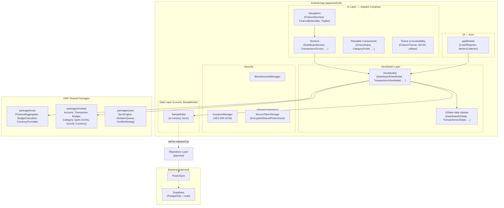

# Android Architecture — Finance

> **Status:** ~65–70% complete — UI shell and navigation are functional; data layer and backend integration remain  
> **Last Updated:** 2025-07-17  
> **Target Version:** 0.1.0  

---

## Table of Contents

- [1. Overview](#1-overview)
- [2. Architecture Diagram](#2-architecture-diagram)
- [3. Screen Inventory](#3-screen-inventory)
- [4. Navigation Architecture](#4-navigation-architecture)
- [5. State Management](#5-state-management)
- [6. Dependency Injection](#6-dependency-injection)
- [7. Security Layer](#7-security-layer)
- [8. Accessibility](#8-accessibility)
- [9. Theme & Design System](#9-theme--design-system)
- [10. Data Layer](#10-data-layer)
- [11. Remaining Work](#11-remaining-work)

---

## 1. Overview

The Finance Android app is a **single-activity, Jetpack Compose** application that follows an **edge-first** design — most computation happens on-device, with sync to a backend for backup and multi-device support. The app shares business logic with other platforms via **Kotlin Multiplatform (KMP)** packages.

### Key architectural choices

| Concern | Choice | Reference |
|---|---|---|
| UI framework | Jetpack Compose + Material 3 | [ADR-0001](0001-cross-platform-framework.md) |
| Shared logic | KMP (`packages/core`, `packages/models`, `packages/sync`) | [ADR-0001](0001-cross-platform-framework.md) |
| Local database | SQLDelight + SQLCipher (planned) | [ADR-0003](0003-local-storage-strategy.md) |
| Sync engine | PowerSync → Supabase PostgreSQL (planned) | [ADR-0002](0002-backend-sync-architecture.md) |
| Auth | Passkeys + OAuth 2.0/PKCE (planned) | [ADR-0004](0004-auth-security-architecture.md) |
| Design tokens | DTCG JSON → Style Dictionary → Compose theme | [ADR-0005](0005-design-system-approach.md) |
| DI | Koin | `build.gradle.kts` — `koin-android`, `koin-compose-viewmodel` |
| Logging | Timber | [`TimberCrashReporter.kt`](../../apps/android/src/main/kotlin/com/finance/android/logging/TimberCrashReporter.kt) |

### Project coordinates

| Property | Value |
|---|---|
| `applicationId` | `com.finance.android` |
| `namespace` | `com.finance.android` |
| `minSdk` | Defined in version catalog (`libs.versions.android.minSdk`) |
| `targetSdk` / `compileSdk` | Defined in version catalog (`libs.versions.android.targetSdk` / `compileSdk`) |
| `versionName` | `0.1.0` |
| JDK target | 21 |

Source root: [`apps/android/`](../../apps/android/)

---

## 2. Architecture Diagram



### Layer responsibilities

| Layer | Responsibility | Current status |
|---|---|---|
| **UI** | Compose screens, components, navigation, theme | ✅ Implemented |
| **ViewModel** | Expose `StateFlow<UiState>`, handle user actions | ✅ Implemented (backed by SampleData) |
| **Repository** | Abstract data sources behind a clean interface | 🔲 Not yet implemented |
| **Data source** | SQLDelight local DB, PowerSync sync | 🔲 Not yet implemented |
| **KMP shared** | Business logic (aggregation, budgets, currency) | ✅ Consumed by ViewModels |
| **Security** | Biometric, Keystore, encrypted token storage | ✅ Implemented (not yet wired to auth) |

---

## 3. Screen Inventory

All screens live under [`apps/android/src/main/kotlin/com/finance/android/ui/screens/`](../../apps/android/src/main/kotlin/com/finance/android/ui/screens/).

| Screen | File | ViewModel | Status | Notes |
|---|---|---|---|---|
| **Dashboard** | `DashboardScreen.kt` | `DashboardViewModel` | ✅ Functional | Net worth, spending, budget summaries, recent transactions; pull-to-refresh |
| **Accounts** | `AccountsScreen.kt` | `AccountsViewModel` | ✅ Functional | Grouped by type, account detail selection |
| **Transactions** | `TransactionsScreen.kt` | `TransactionsViewModel` | ✅ Functional | Date-grouped list, search, type filter, pagination |
| **Transaction Create** | `TransactionCreateScreen.kt` | `TransactionCreateViewModel` | ✅ Functional | 3-step wizard (Amount → Category → Confirm), validation, payee autocomplete |
| **Budgets** | `BudgetsScreen.kt` | — | ⏳ Placeholder | Stub screen — "Track your spending" |
| **Goals** | `GoalsScreen.kt` | — | ⏳ Placeholder | Stub screen — "Your savings goals" |
| **Settings** | `SettingsScreen.kt` | `SettingsViewModel` | ✅ Functional | Currency, notifications, biometric, accessibility toggles, export, account deletion |
| **Onboarding** | `OnboardingScreen.kt` | `OnboardingViewModel` | ✅ Functional | 5-step flow: Welcome → Currency → Account → Budget → Done |

### Additional UI surfaces

| Surface | Files | Status |
|---|---|---|
| Sync Status screen | [`ui/sync/SyncStatusScreen.kt`](../../apps/android/src/main/kotlin/com/finance/android/ui/sync/SyncStatusScreen.kt), [`SyncStatusViewModel.kt`](../../apps/android/src/main/kotlin/com/finance/android/ui/sync/SyncStatusViewModel.kt) | ✅ Implemented (wired to KMP SyncEngine) |
| Sync Status icon | [`ui/sync/SyncStatusIcon.kt`](../../apps/android/src/main/kotlin/com/finance/android/ui/sync/SyncStatusIcon.kt) | ✅ Implemented |
| Offline banner | [`ui/sync/OfflineBanner.kt`](../../apps/android/src/main/kotlin/com/finance/android/ui/sync/OfflineBanner.kt) | ✅ Implemented |

---

## 4. Navigation Architecture

Navigation is handled entirely within Compose using `navigation-compose`. The single `MainActivity` hosts the `FinanceApp` root composable.

### Route hierarchy

Routes are modelled as a **sealed class** in [`FinanceNavHost.kt`](../../apps/android/src/main/kotlin/com/finance/android/ui/navigation/FinanceNavHost.kt) for compiler-verified exhaustiveness:

```
sealed class Route(val route: String)
├── Dashboard        → "dashboard"               (start destination)
├── Accounts         → "accounts"
├── Transactions     → "transactions"
├── Budgets          → "budgets"
├── Goals            → "goals"
├── Settings         → "settings"
├── AccountDetail    → "accounts/{id}"
└── TransactionCreate → "transactions/create?accountId={accountId}"
```

### Bottom navigation bar

Five top-level destinations defined in the [`TopLevelDestination`](../../apps/android/src/main/kotlin/com/finance/android/ui/navigation/FinanceBottomBar.kt) enum:

| Tab | Route | Icon | Label |
|---|---|---|---|
| 1 | `dashboard` | `Home` | Dashboard |
| 2 | `accounts` | `AccountBalance` | Accounts |
| 3 | `transactions` | `SwapHoriz` | Transactions |
| 4 | `budgets` | `PieChart` | Budgets |
| 5 | `goals` | `Flag` | Goals |

The bottom bar is only visible on top-level destinations. Navigation uses `popUpTo(startDestination)` with `saveState = true` and `restoreState = true` to maintain per-tab back stacks without stack buildup.

### Top bar

[`FinanceTopBar`](../../apps/android/src/main/kotlin/com/finance/android/ui/navigation/TopBarConfig.kt) adapts per route:

- **Top-level screens:** Title + Settings gear + Search icon (Dashboard only)
- **Detail screens:** Title + Back arrow (no bottom bar)

### Floating Action Button

A global `FloatingActionButton` ("+") is shown on the Dashboard and Transactions screens. It navigates to `TransactionCreate` with `launchSingleTop = true`.

### Deep linking

The [`AndroidManifest.xml`](../../apps/android/src/main/AndroidManifest.xml) registers three App Links under `finance.app`:

| Path prefix | Purpose |
|---|---|
| `/auth/callback` | OAuth redirect |
| `/invite` | Household invitation |
| `/transaction` | Transaction deep link |

### Onboarding flow

[`OnboardingNavigation`](../../apps/android/src/main/kotlin/com/finance/android/ui/onboarding/OnboardingNavigation.kt) acts as the true root composable. It maintains its own `NavHost` with two destinations (`onboarding` and `main`), checking `OnboardingViewModel.isOnboardingComplete()` via SharedPreferences to decide the start destination. After completion, the onboarding back-stack entry is removed so the user cannot navigate back to it.

---

## 5. State Management

### Pattern

Every screen follows a **unidirectional data flow** (UDF) pattern:

```
User action → ViewModel function → update MutableStateFlow → Screen recomposes
```

### UiState data classes

Each ViewModel exposes a single `StateFlow<*UiState>` that the Compose screen collects via `collectAsStateWithLifecycle()` or `collectAsState()`:

| ViewModel | UiState class | Key fields |
|---|---|---|
| `DashboardViewModel` | `DashboardUiState` | `isLoading`, `netWorthFormatted`, `todaySpendingFormatted`, `monthlySpendingFormatted`, `budgetStatuses: List<BudgetStatusUi>`, `recentTransactions` |
| `TransactionsViewModel` | `TransactionsUiState` | `dateGroups: List<TransactionDateGroup>`, `filter: TransactionFilter`, `isSearchActive`, `hasMore`, `totalCount` |
| `AccountsViewModel` | `AccountsUiState` | `groups: List<AccountGroup>`, `selectedAccount`, `selectedAccountTransactions` |
| `TransactionCreateViewModel` | `TransactionCreateUiState` | `currentStep: CreateStep`, `transactionType`, `amountCents`, `payee`, `selectedCategoryId`, `selectedAccountId`, `errors`, `isSaving` |
| `SettingsViewModel` | `SettingsUiState` | `defaultCurrency`, `biometricEnabled`, `highContrastEnabled`, `showExportDialog`, `showDeleteDialog`, `isExporting` |
| `OnboardingViewModel` | `OnboardingUiState` | `currentStep`, `selectedCurrency`, `accountName`, `accountType`, `isSaving`, `isComplete` |
| `SyncStatusViewModel` | `SyncStatusUiState` | `syncIconState`, `lastSyncRelative`, `pendingChangeCount`, `pendingChanges`, `conflicts`, `isSyncingNow` |

### Flow usage

- **State:** `MutableStateFlow` + `asStateFlow()` for UI state
- **Events:** `MutableSharedFlow` for one-shot events (e.g., `SettingsEvent.ShowToast`, `SettingsEvent.ExportReady`)
- **Combine:** `SyncStatusViewModel` uses `combine()` over five flows with `stateIn(WhileSubscribed(5_000))`
- **Coroutines:** All async work runs in `viewModelScope` with simulated delays (will be replaced with real I/O)

---

## 6. Dependency Injection

Koin is initialized in [`FinanceApplication.onCreate()`](../../apps/android/src/main/kotlin/com/finance/android/FinanceApplication.kt):

```kotlin
startKoin {
    androidLogger(if (BuildConfig.DEBUG) Level.DEBUG else Level.NONE)
    androidContext(this@FinanceApplication)
    modules(appModule)
}
```

### Registered dependencies ([`AppModule.kt`](../../apps/android/src/main/kotlin/com/finance/android/di/AppModule.kt))

| Type | Implementation | Scope | Notes |
|---|---|---|---|
| `CrashReporter` | `TimberCrashReporter` | `single` | Consent defaults to `false`; no external reporting |
| `MetricsCollector` | KMP shared class | `single` | Consent defaults to `false` |

### Not yet registered (planned)

The following will be added to the Koin module as the data layer is built:

- `TransactionRepository`, `AccountRepository`, `BudgetRepository`, `GoalRepository`
- SQLDelight `Database` instance
- PowerSync `SyncEngine` instance
- `SecureTokenStorage`
- `BiometricAuthManager`

### ViewModel resolution

Most ViewModels are currently instantiated by Compose's `viewModel()` default factory. `SettingsViewModel` uses a custom `ViewModelProvider.Factory` via `provideFactory(context)` because it requires `SharedPreferences` and a `BiometricAvailabilityChecker`. Once repositories are registered in Koin, ViewModels will migrate to `koinViewModel()`.

---

## 7. Security Layer

Source: [`apps/android/src/main/kotlin/com/finance/android/security/`](../../apps/android/src/main/kotlin/com/finance/android/security/)

### BiometricAuthManager

[`BiometricAuthManager.kt`](../../apps/android/src/main/kotlin/com/finance/android/security/BiometricAuthManager.kt)

- Uses AndroidX `BiometricPrompt` API
- Prefers **BIOMETRIC_STRONG** (Class 3 — fingerprint / face)
- Falls back to **DEVICE_CREDENTIAL** (PIN / pattern / password) when strong biometrics are not enrolled
- Exposed to Settings via `BiometricAvailabilityChecker` interface (testable)

### KeystoreManager

[`KeystoreManager.kt`](../../apps/android/src/main/kotlin/com/finance/android/security/KeystoreManager.kt)

- Manages an **AES-256-GCM** master key in the Android Keystore
- **StrongBox** preferred; falls back to TEE-backed storage
- Key alias: `finance_master_key`
- `encrypt(data)` returns `IV + ciphertext`; `decrypt(data)` reverses it
- No user-authentication requirement on the key (biometric gating is layered above)

### SecureTokenStorage

[`SecureTokenStorage.kt`](../../apps/android/src/main/kotlin/com/finance/android/security/SecureTokenStorage.kt)

- Backed by AndroidX `EncryptedSharedPreferences`
- AES-256-SIV key encryption + AES-256-GCM value encryption
- Stores access token, refresh token, and token expiry
- `hasValidToken()` checks token presence and expiry
- `clearTokens()` for logout

### Current status

All three security classes are **implemented and tested in isolation** but are **not yet wired to the auth flow** — no login screen exists yet. The Settings screen offers a biometric toggle that checks availability via `BiometricAvailabilityChecker`.

---

## 8. Accessibility

Source: [`apps/android/src/main/kotlin/com/finance/android/ui/accessibility/`](../../apps/android/src/main/kotlin/com/finance/android/ui/accessibility/)

### WCAG 2.2 Level AA compliance approach

| WCAG Criterion | Implementation | File |
|---|---|---|
| **2.5.8** Target Size (Minimum) | `Modifier.minTouchTarget(48.dp)` — enforces 48×48 dp | `WcagCompliance.kt` |
| **2.4.7** Focus Visible | `Modifier.focusableWithHighlight()` — 2 dp blue border on focus | `WcagCompliance.kt` |
| **1.4.3** Contrast (Minimum) | `contrastRatio()`, `meetsContrastAA()` utility functions | `WcagCompliance.kt` |
| **1.4.4** Resize Text | All typography uses `sp` units (system font scaling) | `FinanceTheme.kt` |

### Semantic annotations

[`AccessibilityExtensions.kt`](../../apps/android/src/main/kotlin/com/finance/android/ui/accessibility/AccessibilityExtensions.kt) provides reusable modifiers:

| Modifier | Purpose |
|---|---|
| `financeSemantic(label, hint)` | Sets `contentDescription` + optional `stateDescription` |
| `headingLevel(level)` | Marks element as heading for TalkBack navigation |
| `liveRegion()` | Polite live region for dynamic content (balance updates, sync) |
| `traversalOrder(index)` | Overrides reading order when spatial layout is misleading |

### Content descriptions

[`AccessibilityConstants.kt`](../../apps/android/src/main/kotlin/com/finance/android/ui/accessibility/AccessibilityConstants.kt) centralises all TalkBack strings:

- Navigation labels (`HOME_SCREEN`, `BOTTOM_NAV`, `BACK_BUTTON`, etc.)
- Announcement templates: `balanceAnnouncement()`, `budgetUsageAnnouncement()`, `goalProgressAnnouncement()`, `transactionAnnouncement()`

### High-contrast theme

[`HighContrastTheme.kt`](../../apps/android/src/main/kotlin/com/finance/android/ui/accessibility/HighContrastTheme.kt) provides a separate Material 3 color scheme meeting **WCAG AAA** (7:1 contrast ratio) in both light and dark variants. Toggled from Settings → Accessibility → High Contrast.

### Screen-level patterns

Every screen and interactive element in the codebase uses `Modifier.semantics { contentDescription = "…" }`. The bottom bar items carry `a11yDescription` strings. The FAB has a content description of "Create new transaction".

---

## 9. Theme & Design System

Source: [`apps/android/src/main/kotlin/com/finance/android/ui/theme/`](../../apps/android/src/main/kotlin/com/finance/android/ui/theme/)

### Material 3 + Dynamic Color

[`FinanceTheme.kt`](../../apps/android/src/main/kotlin/com/finance/android/ui/theme/FinanceTheme.kt) wraps `MaterialTheme` and provides:

| Feature | Behavior |
|---|---|
| **Dynamic color (Material You)** | On Android 12+ (API 31+), colors are derived from the user's wallpaper |
| **Static fallback** | Pre-API 31 devices use hand-tuned light/dark schemes from design tokens |
| **Dark mode** | Follows system setting (`isSystemInDarkTheme()`) |
| **Custom spacing** | `FinanceTheme.spacing` exposes a 12-step scale via `CompositionLocal` |

### Color palette

[`Color.kt`](../../apps/android/src/main/kotlin/com/finance/android/ui/theme/Color.kt) defines primitive color tokens mapped from `packages/design-tokens/tokens/primitive/colors.json`:

- **Blue** (primary) — 50–900 scale
- **Teal** (secondary) — 50–900 scale
- **Green, Amber, Red** — semantic status colors
- **Neutral** — 0–950 gray scale
- **Chart palette** — 6 IBM CVD-safe (color-vision-deficiency safe) colors for data visualization

### Typography

A 7-level Material 3 type scale mapped from `packages/design-tokens/tokens/semantic/typography.json`:

| Token | M3 role | Size / Weight |
|---|---|---|
| display | `displayLarge` | 48 sp / Bold |
| headline | `headlineLarge` | 30 sp / SemiBold |
| title | `titleLarge` | 20 sp / SemiBold |
| body | `bodyLarge` | 16 sp / Normal |
| body (secondary) | `bodyMedium` | 14 sp / Normal |
| label | `labelLarge` | 14 sp / Medium |
| caption | `labelSmall` | 12 sp / Normal |

### Spacing scale

[`Spacing.kt`](../../apps/android/src/main/kotlin/com/finance/android/ui/theme/Spacing.kt) — an `@Immutable` data class exposed via `staticCompositionLocalOf`:

| Name | dp | Token |
|---|---|---|
| `none` | 0 | — |
| `xs` | 4 | spacing.1 |
| `sm` | 8 | spacing.2 |
| `md` | 12 | spacing.3 |
| `lg` | 16 | spacing.4 |
| `xl` | 20 | spacing.5 |
| `xxl` | 24 | spacing.6 |
| `xxxl` | 32 | spacing.8 |
| `huge` | 40 | spacing.10 |
| `massive` | 48 | spacing.12 |
| `colossal` | 64 | spacing.16 |
| `epic` | 80 | spacing.20 |

### Haptic feedback

[`HapticFeedbackManager`](../../apps/android/src/main/kotlin/com/finance/android/ui/feedback/HapticFeedbackManager.kt) maps [`FinancialEvent`](../../apps/android/src/main/kotlin/com/finance/android/ui/feedback/FinancialEvent.kt) types to vibration patterns:

| Event | Pattern |
|---|---|
| `TransactionSaved` | Single confirm tick |
| `BudgetThreshold` | Two short ticks (warning) |
| `GoalMilestone` | Heavy click + confirm |
| `SyncComplete` | Light tick |
| `Error` | Three sharp pulses (reject) |

---

## 10. Data Layer

### Current state — SampleData

All ViewModels currently load data from [`SampleData.kt`](../../apps/android/src/main/kotlin/com/finance/android/ui/data/SampleData.kt), a singleton `object` that provides:

- **13 categories** (10 expense, 3 income)
- **8 accounts** (checking, savings ×2, credit ×2, investment ×2, cash)
- **6 monthly budgets** (groceries, dining, transport, entertainment, shopping, subscriptions)
- **35 transactions** spanning ~3 weeks, with realistic payees and amounts
- Helper maps: `categoryMap`, `accountMap`, `payeeHistory`

All amounts use the KMP `Cents` value class (integer cents, no floating-point). Model types (`Account`, `Transaction`, `Budget`, `Category`) come from `packages/models`.

### KMP business logic consumed today

ViewModels already use shared KMP classes from `packages/core`:

| Class | Used by | Purpose |
|---|---|---|
| `FinancialAggregator.netWorth()` | `DashboardViewModel` | Sum account balances |
| `FinancialAggregator.totalSpending()` | `DashboardViewModel` | Daily / monthly spend totals |
| `BudgetCalculator.calculateStatus()` | `DashboardViewModel` | Per-category budget health |
| `CurrencyFormatter.format()` | `DashboardViewModel`, `AccountsViewModel`, `TransactionCreateViewModel` | Locale-aware currency formatting |
| `SyncEngine`, `MutationQueue`, `ConflictStrategy` | `SyncStatusViewModel` | Sync state observation and conflict resolution |

### Planned state — Repository pattern

```
ViewModel → Repository (interface) → SQLDelight DAO → SQLite/SQLCipher
                                   → PowerSync SyncEngine → Supabase
```

Each repository will expose `Flow<List<T>>` for reactive UI updates. The `SampleData` object will be removed once repositories are wired.

---

## 11. Remaining Work

This section tracks what is **not yet implemented** in the Android app. Items are grouped by category with relevant issue numbers where available.

### Data layer & persistence

| Item | Description | Priority |
|---|---|---|
| Repository interfaces | Define `TransactionRepository`, `AccountRepository`, `BudgetRepository`, `GoalRepository`, `CategoryRepository` | 🔴 High |
| SQLDelight wiring | Connect KMP SQLDelight schemas from `packages/models` to Android-specific `SqlDriver` | 🔴 High |
| SQLCipher encryption | Enable AES-256 encryption on the local SQLite database | 🔴 High |
| Replace SampleData | Swap all ViewModel data loading from `SampleData` to repositories | 🔴 High |
| Reactive queries | Expose repository data as `Flow<List<T>>` for live UI updates | 🔴 High |

### Sync & backend integration

| Item | Description | Priority |
|---|---|---|
| PowerSync integration | Wire `packages/sync` `SyncEngine` to a live PowerSync instance | 🟡 Medium |
| Supabase connectivity | Configure Supabase project URL and anon key for backend operations | 🟡 Medium |
| Offline queue | Ensure `MutationQueue` persists mutations across app restarts | 🟡 Medium |
| Conflict resolution UI | Wire `SyncStatusScreen` conflict actions to actual data resolution | 🟡 Medium |

### Authentication

| Item | Description | Priority |
|---|---|---|
| Login screen | Create login/registration screen with passkey and OAuth 2.0/PKCE support | 🔴 High |
| Passkeys (FIDO2) | Integrate Android Credential Manager API for passkey registration/authentication | 🔴 High |
| OAuth 2.0/PKCE flow | Social sign-in (Google, Apple) with `code_verifier`/`code_challenge` | 🟡 Medium |
| Token lifecycle | Wire `SecureTokenStorage` to auth flow — auto-refresh, logout | 🟡 Medium |
| Biometric gating | Gate app access behind `BiometricAuthManager` when enabled in Settings | 🟡 Medium |

### Screens — incomplete

| Screen | What's missing | Priority |
|---|---|---|
| **Budgets** | Full envelope budget UI — category list, progress bars, allocation editing | 🔴 High |
| **Goals** | Goal list with progress bars, add/edit goal, milestone celebrations | 🔴 High |
| **Reports** | All four report screens (Spending by Category, Trends, Income vs Expenses, Net Worth) | 🟡 Medium |
| **Account Detail** | Currently re-renders `AccountsScreen`; needs dedicated detail view with transaction list | 🟡 Medium |
| **Category Management** | Add/edit/delete categories, drag-to-reorder | 🟡 Medium |
| **Transaction Detail** | View/edit/delete a single transaction, split transactions | 🟡 Medium |

### Notifications & background work

| Item | Description | Priority |
|---|---|---|
| Push notifications | WorkManager-based scheduled notifications (permission is declared in manifest) | 🟡 Medium |
| Bill reminders | Scheduled alerts for upcoming bills (Settings toggle exists but is non-functional) | 🟡 Medium |
| Background sync | Periodic sync via WorkManager when app is backgrounded | 🟢 Low |

### Data export

| Item | Description | Priority |
|---|---|---|
| Real export | Replace `buildMockExportContent()` in `SettingsViewModel` with actual database query via KMP `DataExportService` | 🟡 Medium |
| Share intent | Send exported file via Android `Intent.ACTION_SEND` or save to Downloads | 🟡 Medium |

### Testing

| Item | Description | Issue |
|---|---|---|
| Unit tests | ViewModel and repository tests | — |
| UI tests | Compose UI tests with `ComposeTestRule` | — |
| E2E tests — Budgets | End-to-end budget flow | [#281](https://github.com/finance/finance/issues/281) |
| E2E tests — Goals | End-to-end goal flow | [#282](https://github.com/finance/finance/issues/282) |
| E2E tests — Reports | End-to-end reports flow | [#283](https://github.com/finance/finance/issues/283) |

### Platform features (deferred)

| Item | Description | Issue | Priority |
|---|---|---|---|
| Android widgets | Home-screen widget for balance / quick entry | [#381](https://github.com/finance/finance/issues/381) | 🟢 Low |
| Wear OS companion | Glance-based watch app for quick transaction entry | Deferred post-launch | 🟢 Low |
| Predictive back gesture | Migrate to Android 14+ predictive back API | — | 🟢 Low |

---

## Appendix: Reusable Components

Source: [`apps/android/src/main/kotlin/com/finance/android/ui/components/`](../../apps/android/src/main/kotlin/com/finance/android/ui/components/)

| Component | File | Purpose |
|---|---|---|
| `AmountInput` | `AmountInput.kt` | Currency-formatted numeric input |
| `CategoryPicker` | `CategoryPicker.kt` | Grid/list category selector with icons |
| `AccountSelector` | `AccountSelector.kt` | Dropdown account picker |
| `CircularProgressRing` | `CircularProgressRing.kt` | Budget/goal progress indicator |
| `CurrencyText` | `CurrencyText.kt` | Formatted currency display |
| `FinanceDatePicker` | `FinanceDatePicker.kt` | Material 3 date picker wrapper |
| `FinanceSearchBar` | `search/FinanceSearchBar.kt` | Search input with filter chips |
| `FilterChipRow` | `search/FilterChipRow.kt` | Horizontal scrolling filter chips |
| `EmptyState` | `states/EmptyState.kt` | "No data" placeholder |
| `ErrorState` | `states/ErrorState.kt` | Error with retry action |
| `LoadingIndicator` | `states/LoadingIndicator.kt` | Full-screen loading spinner |
| `SkeletonLoader` | `states/SkeletonLoader.kt` | Shimmer skeleton placeholder |

---

## Related Documentation

- [Android Development Setup](../guides/android-setup.md) — environment setup, building, debugging
- [Workflow Cheatsheet](../guides/workflow-cheatsheet.md) — common development workflows
- [Information Architecture](../design/information-architecture.md) — screen inventory and navigation model (all platforms)
- [Roadmap](roadmap.md) — full project roadmap and phase status
- [ADR-0001: Cross-Platform Framework](0001-cross-platform-framework.md) — why KMP
- [ADR-0002: Backend Sync Architecture](0002-backend-sync-architecture.md) — PowerSync + Supabase
- [ADR-0003: Local Storage Strategy](0003-local-storage-strategy.md) — SQLDelight + SQLCipher
- [ADR-0004: Auth & Security](0004-auth-security-architecture.md) — passkeys, OAuth, encryption
- [ADR-0005: Design System Approach](0005-design-system-approach.md) — design tokens, theme architecture
