# Data Flow Architecture — Finance Monorepo

_Last updated: 2025-04-21_

This document provides comprehensive Mermaid diagrams of the Finance application's data flow architecture, from user actions through local storage, sync engine, and multi-device propagation. It serves as the canonical reference for understanding how data moves through the system.

> **Rendering:** GitHub, VS Code (with Mermaid extension), and most Markdown viewers render these diagrams automatically. Use the [Mermaid Live Editor](https://mermaid.live/) if your viewer doesn't render Mermaid.

---

## Table of Contents

- [1. End-to-End Data Flow Overview](#1-end-to-end-data-flow-overview)
- [2. Local Write Path](#2-local-write-path)
- [3. Sync Engine State Machine](#3-sync-engine-state-machine)
- [4. Delta Sync Pull Cycle](#4-delta-sync-pull-cycle)
- [5. Mutation Queue & Push Cycle](#5-mutation-queue--push-cycle)
- [6. Conflict Resolution Flow](#6-conflict-resolution-flow)
- [7. PowerSync Bucket Architecture](#7-powersync-bucket-architecture)
- [8. Credential Refresh During Sync](#8-credential-refresh-during-sync)
- [9. Error Recovery & Exponential Backoff](#9-error-recovery--exponential-backoff)
- [10. Multi-Device Propagation](#10-multi-device-propagation)
- [11. Offline Queue Lifecycle](#11-offline-queue-lifecycle)
- [12. Encryption Layers in Data Flow](#12-encryption-layers-in-data-flow)
- [13. Complete Sync Cycle Timing](#13-complete-sync-cycle-timing)

---

## 1. End-to-End Data Flow Overview

The complete path from user action to multi-device propagation. The key principle: **the local database is the source of truth for the client**. The server is the coordination layer for multi-device sync.

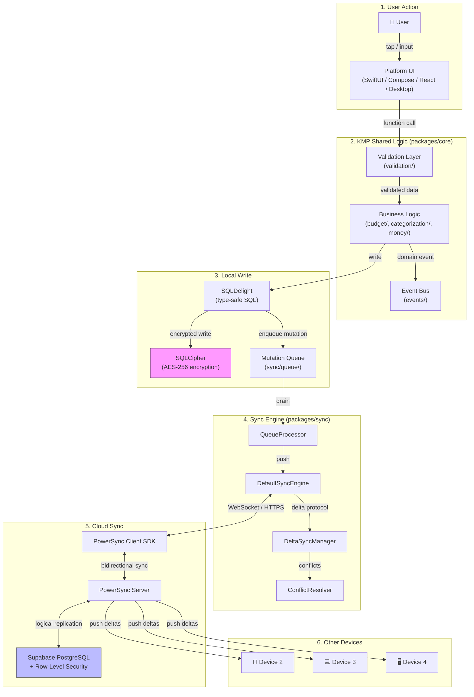
```mermaid
graph TB
    subgraph UserAction["1. User Action"]
        U["👤 User"]
        PA["Platform UI<br/>(SwiftUI / Compose / React / Desktop)"]
    end

    subgraph KMPLogic["2. KMP Shared Logic (packages/core)"]
        VL["Validation Layer<br/>(validation/)"]
        BL["Business Logic<br/>(budget/, categorization/, money/)"]
        EV["Event Bus<br/>(events/)"]
    end

    subgraph LocalWrite["3. Local Write"]
        SD["SQLDelight<br/>(type-safe SQL)"]
        SC["SQLCipher<br/>(AES-256 encryption)"]
        MQ["Mutation Queue<br/>(sync/queue/)"]
    end

    subgraph SyncEngine["4. Sync Engine (packages/sync)"]
        SE["DefaultSyncEngine"]
        DSM["DeltaSyncManager"]
        CR["ConflictResolver"]
        QP["QueueProcessor"]
    end

    subgraph CloudSync["5. Cloud Sync"]
        PSC["PowerSync Client SDK"]
        PSS["PowerSync Server"]
        SB["Supabase PostgreSQL<br/>+ Row-Level Security"]
    end

    subgraph OtherDevices["6. Other Devices"]
        D2["📱 Device 2"]
        D3["💻 Device 3"]
        D4["🖥️ Device 4"]
    end

    U -->|"tap / input"| PA
    PA -->|"function call"| VL
    VL -->|"validated data"| BL
    BL -->|"domain event"| EV
    BL -->|"write"| SD

    SD -->|"encrypted write"| SC
    SD -->|"enqueue mutation"| MQ

    MQ -->|"drain"| QP
    QP -->|"push"| SE
    SE -->|"delta protocol"| DSM
    DSM -->|"conflicts"| CR

    SE <-->|"WebSocket / HTTPS"| PSC
    PSC <-->|"bidirectional sync"| PSS
    PSS <-->|"logical replication"| SB

    PSS -->|"push deltas"| D2
    PSS -->|"push deltas"| D3
    PSS -->|"push deltas"| D4

    style SC fill:#f9f,stroke:#333
    style SB fill:#bbf,stroke:#333
```

---

## 2. Local Write Path

Every write operation follows this exact path. The UI update is **synchronous** — the user sees the result before any sync occurs.

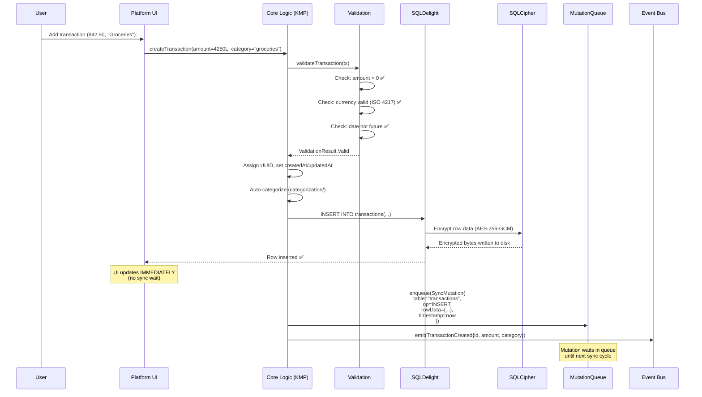
```mermaid
sequenceDiagram
    participant User
    participant UI as Platform UI
    participant Core as Core Logic (KMP)
    participant Val as Validation
    participant DB as SQLDelight
    participant Cipher as SQLCipher
    participant Queue as MutationQueue
    participant Events as Event Bus

    User->>UI: Add transaction ($42.50, "Groceries")
    UI->>Core: createTransaction(amount=4250L, category="groceries")

    Core->>Val: validateTransaction(tx)
    Val->>Val: Check: amount > 0 ✅
    Val->>Val: Check: currency valid (ISO 4217) ✅
    Val->>Val: Check: date not future ✅
    Val-->>Core: ValidationResult.Valid

    Core->>Core: Assign UUID, set createdAt/updatedAt
    Core->>Core: Auto-categorize (categorization/)

    Core->>DB: INSERT INTO transactions(...)
    DB->>Cipher: Encrypt row data (AES-256-GCM)
    Cipher-->>DB: Encrypted bytes written to disk
    DB-->>UI: Row inserted ✅

    Note over UI: UI updates IMMEDIATELY<br/>(no sync wait)

    Core->>Queue: enqueue(SyncMutation{<br/>  table="transactions",<br/>  op=INSERT,<br/>  rowData={...},<br/>  timestamp=now<br/>})

    Core->>Events: emit(TransactionCreated{id, amount, category})

    Note over Queue: Mutation waits in queue<br/>until next sync cycle
```

**Key properties of the local write path:**

| Property     | Guarantee                                   |
| ------------ | ------------------------------------------- |
| Latency      | < 10ms (local SQLite write)                 |
| Availability | 100% (no network dependency)                |
| Durability   | WAL mode with `PRAGMA synchronous=NORMAL`   |
| Encryption   | Every byte on disk encrypted via SQLCipher  |
| Idempotency  | UUID primary keys prevent duplicate inserts |

---

## 3. Sync Engine State Machine

The `DefaultSyncEngine` follows a well-defined state machine. States are exposed via `StateFlow<SyncStatus>` for reactive UI binding.

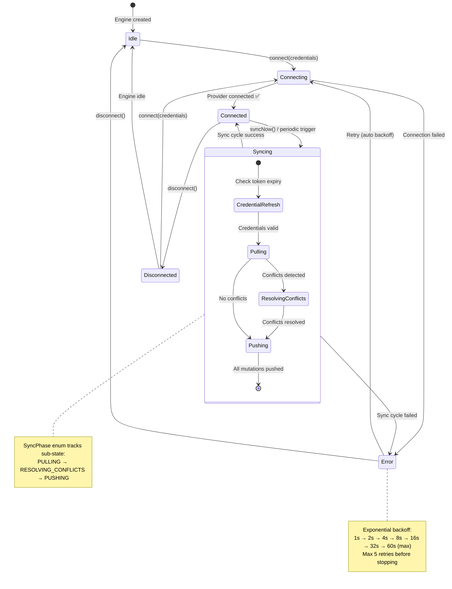
```mermaid
stateDiagram-v2
    [*] --> Idle: Engine created

    Idle --> Connecting: connect(credentials)
    Connecting --> Connected: Provider connected ✅
    Connecting --> Error: Connection failed

    Connected --> Syncing: syncNow() / periodic trigger
    Syncing --> Connected: Sync cycle success
    Syncing --> Error: Sync cycle failed

    Error --> Connecting: Retry (auto backoff)
    Error --> Idle: disconnect()

    Connected --> Disconnected: disconnect()
    Disconnected --> Connecting: connect(credentials)
    Disconnected --> Idle: Engine idle

    state Syncing {
        [*] --> CredentialRefresh: Check token expiry
        CredentialRefresh --> Pulling: Credentials valid
        Pulling --> ResolvingConflicts: Conflicts detected
        Pulling --> Pushing: No conflicts
        ResolvingConflicts --> Pushing: Conflicts resolved
        Pushing --> [*]: All mutations pushed
    }

    note right of Syncing
        SyncPhase enum tracks sub-state:
        PULLING → RESOLVING_CONFLICTS → PUSHING
    end note

    note right of Error
        Exponential backoff:
        1s → 2s → 4s → 8s → 16s → 32s → 60s (max)
        Max 5 retries before stopping
    end note
```

**State → UI mapping:**

| SyncStatus           | UI Indicator         | User Action Allowed     |
| -------------------- | -------------------- | ----------------------- |
| `Idle`               | No indicator         | Full read/write         |
| `Connecting`         | Spinning indicator   | Full read/write (local) |
| `Syncing(PULLING)`   | ↓ Pull indicator     | Full read/write         |
| `Syncing(RESOLVING)` | ⚡ Merge indicator   | Full read/write         |
| `Syncing(PUSHING)`   | ↑ Push indicator     | Full read/write         |
| `Connected`          | ✅ Green dot         | Full read/write         |
| `Error`              | ⚠️ Yellow/red banner | Full read/write (local) |
| `Disconnected`       | ❌ Offline indicator | Full read/write (local) |

---

## 4. Delta Sync Pull Cycle

The `DeltaSyncManager` implements incremental sync — only changes since the last known sequence number are pulled. This minimizes bandwidth and processing.

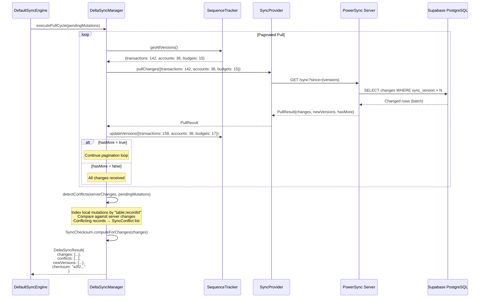
```mermaid
sequenceDiagram
    participant Engine as DefaultSyncEngine
    participant DSM as DeltaSyncManager
    participant ST as SequenceTracker
    participant Provider as SyncProvider
    participant PS as PowerSync Server
    participant DB as Supabase PostgreSQL

    Engine->>DSM: executePullCycle(pendingMutations)

    loop Paginated Pull
        DSM->>ST: getAllVersions()
        ST-->>DSM: {transactions: 142, accounts: 38, budgets: 15}

        DSM->>Provider: pullChanges({transactions: 142, accounts: 38, budgets: 15})
        Provider->>PS: GET /sync?since={versions}
        PS->>DB: SELECT changes WHERE sync_version > N
        DB-->>PS: Changed rows (batch)
        PS-->>Provider: PullResult{changes, newVersions, hasMore}
        Provider-->>DSM: PullResult

        DSM->>ST: updateVersions({transactions: 158, accounts: 38, budgets: 17})

        alt hasMore = true
            Note over DSM: Continue pagination loop
        else hasMore = false
            Note over DSM: All changes received
        end
    end

    DSM->>DSM: detectConflicts(serverChanges, pendingMutations)

    Note over DSM: Index local mutations by "table:recordId"<br/>Compare against server changes<br/>Conflicting records → SyncConflict list

    DSM->>DSM: SyncChecksum.computeForChanges(changes)

    DSM-->>Engine: DeltaSyncResult{<br/>  changes: [...],<br/>  conflicts: [...],<br/>  newVersions: {...},<br/>  checksum: "a3f2..."<br/>}
```

**Sequence tracking detail:**

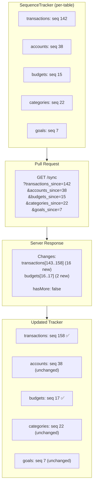
```mermaid
graph TD
    subgraph SequenceTracker["SequenceTracker (per-table)"]
        T1["transactions: seq 142"]
        T2["accounts: seq 38"]
        T3["budgets: seq 15"]
        T4["categories: seq 22"]
        T5["goals: seq 7"]
    end

    subgraph PullRequest["Pull Request"]
        PR["GET /sync<br/>?transactions_since=142<br/>&accounts_since=38<br/>&budgets_since=15<br/>&categories_since=22<br/>&goals_since=7"]
    end

    subgraph ServerResponse["Server Response"]
        SR["Changes:<br/>transactions[143..158] (16 new)<br/>budgets[16..17] (2 new)<br/><br/>hasMore: false"]
    end

    SequenceTracker --> PullRequest
    PullRequest --> ServerResponse

    subgraph Updated["Updated Tracker"]
        U1["transactions: seq 158 ✅"]
        U2["accounts: seq 38 (unchanged)"]
        U3["budgets: seq 17 ✅"]
        U4["categories: seq 22 (unchanged)"]
        U5["goals: seq 7 (unchanged)"]
    end

    ServerResponse --> Updated
```

**Change validation (sequence continuity + checksums):**

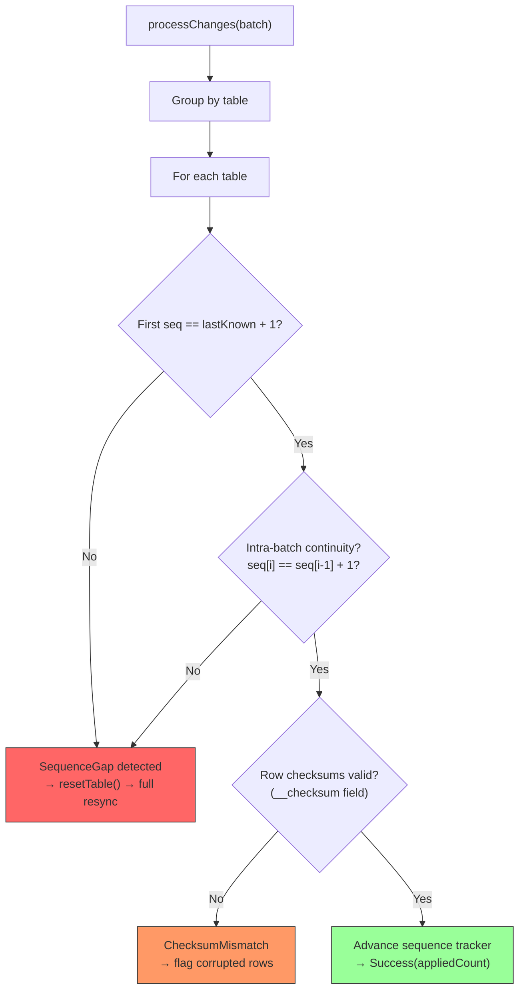
```mermaid
flowchart TD
    A["processChanges(batch)"] --> B["Group by table"]
    B --> C["For each table"]
    C --> D{"First seq == lastKnown + 1?"}
    D -->|No| E["SequenceGap detected<br/>→ resetTable() → full resync"]
    D -->|Yes| F{"Intra-batch continuity?<br/>seq[i] == seq[i-1] + 1?"}
    F -->|No| E
    F -->|Yes| G{"Row checksums valid?<br/>(__checksum field)"}
    G -->|No| H["ChecksumMismatch<br/>→ flag corrupted rows"]
    G -->|Yes| I["Advance sequence tracker<br/>→ Success(appliedCount)"]

    style E fill:#f66,stroke:#333
    style H fill:#f96,stroke:#333
    style I fill:#9f9,stroke:#333
```

---

## 5. Mutation Queue & Push Cycle

Local changes are enqueued as `SyncMutation` objects. The `QueueProcessor` drains the queue in batches with retry logic.

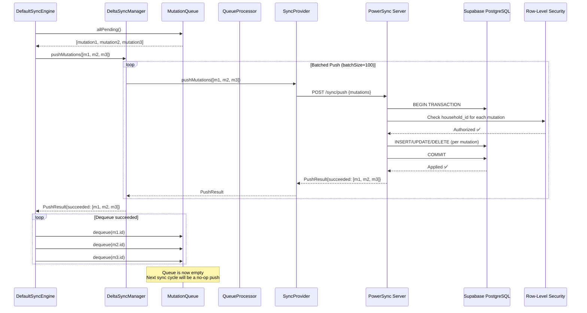
```mermaid
sequenceDiagram
    participant Engine as DefaultSyncEngine
    participant DSM as DeltaSyncManager
    participant Queue as MutationQueue
    participant QP as QueueProcessor
    participant Provider as SyncProvider
    participant PS as PowerSync Server
    participant DB as Supabase PostgreSQL
    participant RLS as Row-Level Security

    Engine->>Queue: allPending()
    Queue-->>Engine: [mutation1, mutation2, mutation3]

    Engine->>DSM: pushMutations([m1, m2, m3])

    loop Batched Push (batchSize=100)
        DSM->>Provider: pushMutations([m1, m2, m3])
        Provider->>PS: POST /sync/push {mutations}
        PS->>DB: BEGIN TRANSACTION
        PS->>RLS: Check household_id for each mutation
        RLS-->>PS: Authorized ✅

        PS->>DB: INSERT/UPDATE/DELETE (per mutation)
        PS->>DB: COMMIT

        DB-->>PS: Applied ✅
        PS-->>Provider: PushResult{succeeded: [m1, m2, m3]}
        Provider-->>DSM: PushResult
    end

    DSM-->>Engine: PushResult{succeeded: [m1, m2, m3]}

    loop Dequeue succeeded
        Engine->>Queue: dequeue(m1.id)
        Engine->>Queue: dequeue(m2.id)
        Engine->>Queue: dequeue(m3.id)
    end

    Note over Queue: Queue is now empty<br/>Next sync cycle will be a no-op push
```

**Queue processor batch lifecycle:**

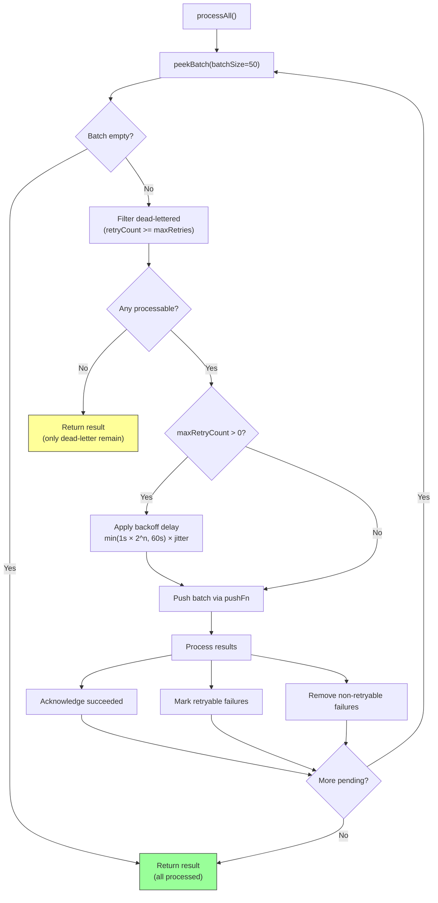
```mermaid
flowchart TD
    A["processAll()"] --> B["peekBatch(batchSize=50)"]
    B --> C{"Batch empty?"}
    C -->|Yes| D["Return result<br/>(all processed)"]
    C -->|No| E["Filter dead-lettered<br/>(retryCount >= maxRetries)"]
    E --> F{"Any processable?"}
    F -->|No| G["Return result<br/>(only dead-letter remain)"]
    F -->|Yes| H{"maxRetryCount > 0?"}
    H -->|Yes| I["Apply backoff delay<br/>min(1s × 2^n, 60s) × jitter"]
    H -->|No| J["Push batch via pushFn"]
    I --> J

    J --> K["Process results"]
    K --> L["Acknowledge succeeded"]
    K --> M["Mark retryable failures"]
    K --> N["Remove non-retryable failures"]

    L --> O{"More pending?"}
    M --> O
    N --> O
    O -->|Yes| B
    O -->|No| D

    style D fill:#9f9,stroke:#333
    style G fill:#ff9,stroke:#333
```

---

## 6. Conflict Resolution Flow

Conflicts occur when the same record is modified both locally (pending mutation) and remotely (server change) between sync cycles.

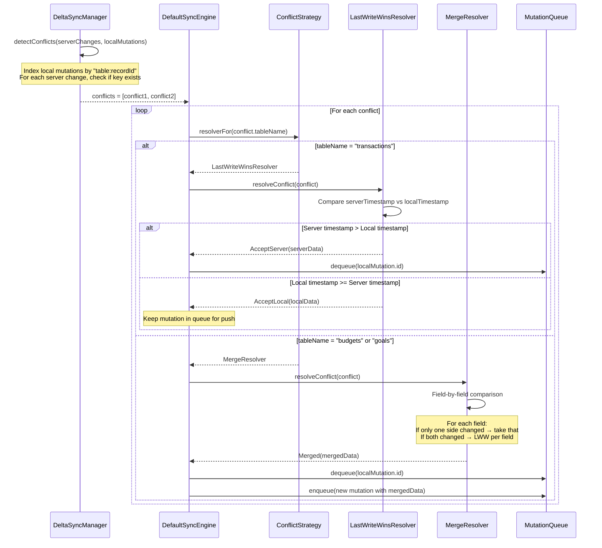
```mermaid
sequenceDiagram
    participant DSM as DeltaSyncManager
    participant Engine as DefaultSyncEngine
    participant CS as ConflictStrategy
    participant LWW as LastWriteWinsResolver
    participant Merge as MergeResolver
    participant Queue as MutationQueue

    DSM->>DSM: detectConflicts(serverChanges, localMutations)
    Note over DSM: Index local mutations by "table:recordId"<br/>For each server change, check if key exists

    DSM-->>Engine: conflicts = [conflict1, conflict2]

    loop For each conflict
        Engine->>CS: resolverFor(conflict.tableName)

        alt tableName = "transactions"
            CS-->>Engine: LastWriteWinsResolver
            Engine->>LWW: resolveConflict(conflict)
            LWW->>LWW: Compare serverTimestamp vs localTimestamp
            alt Server timestamp > Local timestamp
                LWW-->>Engine: AcceptServer(serverData)
                Engine->>Queue: dequeue(localMutation.id)
            else Local timestamp >= Server timestamp
                LWW-->>Engine: AcceptLocal(localData)
                Note over Engine: Keep mutation in queue for push
            end

        else tableName = "budgets" or "goals"
            CS-->>Engine: MergeResolver
            Engine->>Merge: resolveConflict(conflict)
            Merge->>Merge: Field-by-field comparison
            Note over Merge: For each field:<br/>If only one side changed → take that<br/>If both changed → LWW per field
            Merge-->>Engine: Merged(mergedData)
            Engine->>Queue: dequeue(localMutation.id)
            Engine->>Queue: enqueue(new mutation with mergedData)
        end
    end
```

**Conflict resolution strategy per table:**

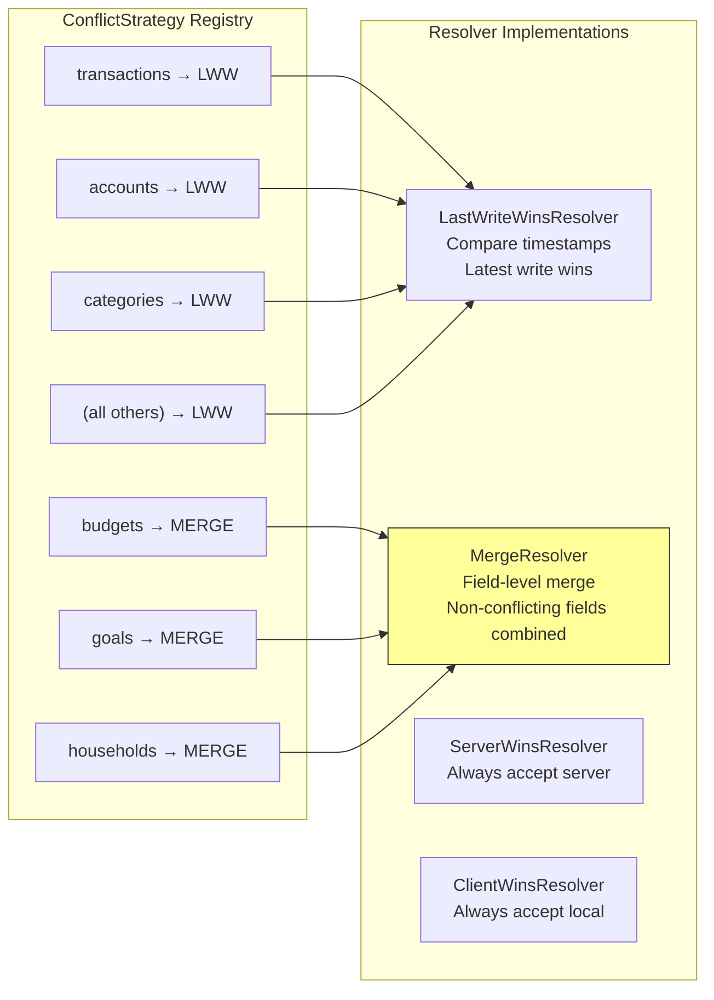
```mermaid
graph LR
    subgraph Strategies["ConflictStrategy Registry"]
        direction TB
        T1["transactions → LWW"]
        T2["accounts → LWW"]
        T3["categories → LWW"]
        T4["budgets → MERGE"]
        T5["goals → MERGE"]
        T6["households → MERGE"]
        T7["(all others) → LWW"]
    end

    subgraph Resolvers["Resolver Implementations"]
        LWW["LastWriteWinsResolver<br/>Compare timestamps<br/>Latest write wins"]
        MRG["MergeResolver<br/>Field-level merge<br/>Non-conflicting fields combined"]
        SW["ServerWinsResolver<br/>Always accept server"]
        CW["ClientWinsResolver<br/>Always accept local"]
    end

    T1 --> LWW
    T2 --> LWW
    T3 --> LWW
    T4 --> MRG
    T5 --> MRG
    T6 --> MRG
    T7 --> LWW

    style MRG fill:#ff9,stroke:#333
```

**Soft delete handling:**

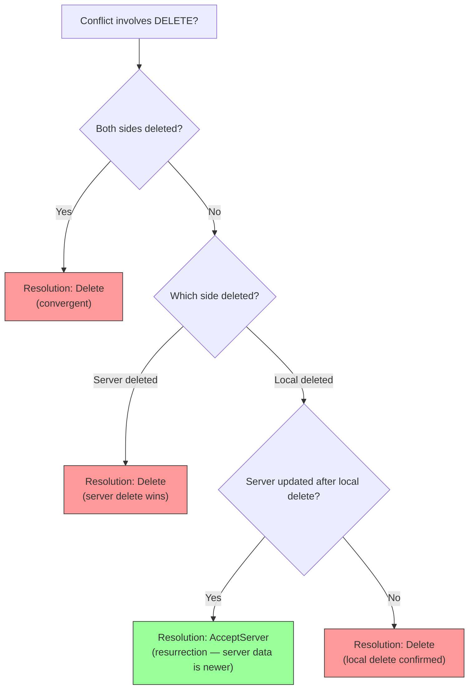
```mermaid
flowchart TD
    A["Conflict involves DELETE?"] --> B{"Both sides deleted?"}
    B -->|Yes| C["Resolution: Delete<br/>(convergent)"]
    B -->|No| D{"Which side deleted?"}
    D -->|Server deleted| E["Resolution: Delete<br/>(server delete wins)"]
    D -->|Local deleted| F{"Server updated after local delete?"}
    F -->|Yes| G["Resolution: AcceptServer<br/>(resurrection — server data is newer)"]
    F -->|No| H["Resolution: Delete<br/>(local delete confirmed)"]

    style C fill:#f99,stroke:#333
    style E fill:#f99,stroke:#333
    style G fill:#9f9,stroke:#333
    style H fill:#f99,stroke:#333
```

---

## 7. PowerSync Bucket Architecture

PowerSync uses sync rules to determine which data replicates to each client. Finance uses two buckets.

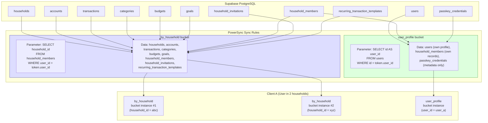
```mermaid
graph TD
    subgraph Server["Supabase PostgreSQL"]
        Users["users"]
        HM["household_members"]
        H["households"]
        Acct["accounts"]
        TX["transactions"]
        Cat["categories"]
        Bud["budgets"]
        Goals["goals"]
        Inv["household_invitations"]
        RT["recurring_transaction_templates"]
        PC["passkey_credentials"]
    end

    subgraph SyncRules["PowerSync Sync Rules"]
        subgraph BH["by_household bucket"]
            BH_Param["Parameter: SELECT household_id<br/>FROM household_members<br/>WHERE user_id = token.user_id"]
            BH_Data["Data: households, accounts,<br/>transactions, categories,<br/>budgets, goals, household_members,<br/>household_invitations,<br/>recurring_transaction_templates"]
        end

        subgraph UP["user_profile bucket"]
            UP_Param["Parameter: SELECT id AS user_id<br/>FROM users<br/>WHERE id = token.user_id"]
            UP_Data["Data: users (own profile),<br/>household_members (own records),<br/>passkey_credentials (metadata only)"]
        end
    end

    subgraph ClientA["Client A (User in 2 households)"]
        BH_A1["by_household<br/>bucket instance #1<br/>(household_id = abc)"]
        BH_A2["by_household<br/>bucket instance #2<br/>(household_id = xyz)"]
        UP_A["user_profile<br/>bucket instance<br/>(user_id = user_a)"]
    end

    H --> BH_Data
    Acct --> BH_Data
    TX --> BH_Data
    Cat --> BH_Data
    Bud --> BH_Data
    Goals --> BH_Data
    HM --> BH_Data
    Inv --> BH_Data
    RT --> BH_Data

    Users --> UP_Data
    HM --> UP_Data
    PC --> UP_Data

    BH_Data --> BH_A1
    BH_Data --> BH_A2
    UP_Data --> UP_A

    style BH fill:#ddf,stroke:#339
    style UP fill:#dfd,stroke:#393
```

**Security filters applied by sync rules:**

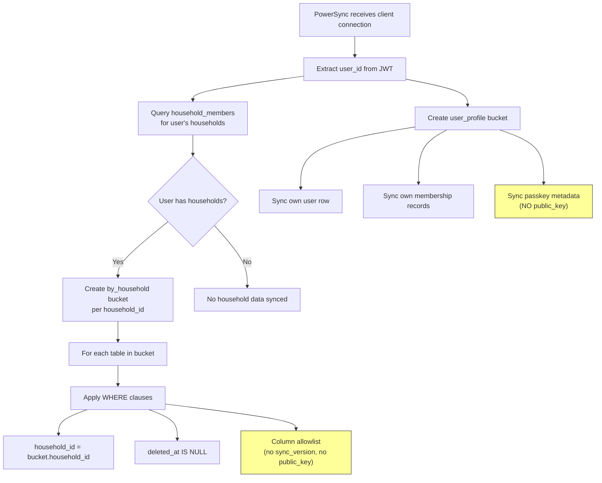
```mermaid
flowchart TD
    A["PowerSync receives client connection"] --> B["Extract user_id from JWT"]
    B --> C["Query household_members<br/>for user's households"]
    C --> D{"User has households?"}
    D -->|Yes| E["Create by_household bucket<br/>per household_id"]
    D -->|No| F["No household data synced"]

    E --> G["For each table in bucket"]
    G --> H["Apply WHERE clauses"]
    H --> I["household_id = bucket.household_id"]
    H --> J["deleted_at IS NULL"]
    H --> K["Column allowlist<br/>(no sync_version, no public_key)"]

    B --> L["Create user_profile bucket"]
    L --> M["Sync own user row"]
    L --> N["Sync own membership records"]
    L --> O["Sync passkey metadata<br/>(NO public_key)"]

    style K fill:#ff9,stroke:#333
    style O fill:#ff9,stroke:#333
```

---

## 8. Credential Refresh During Sync

The sync engine proactively refreshes credentials before they expire, mid-cycle.

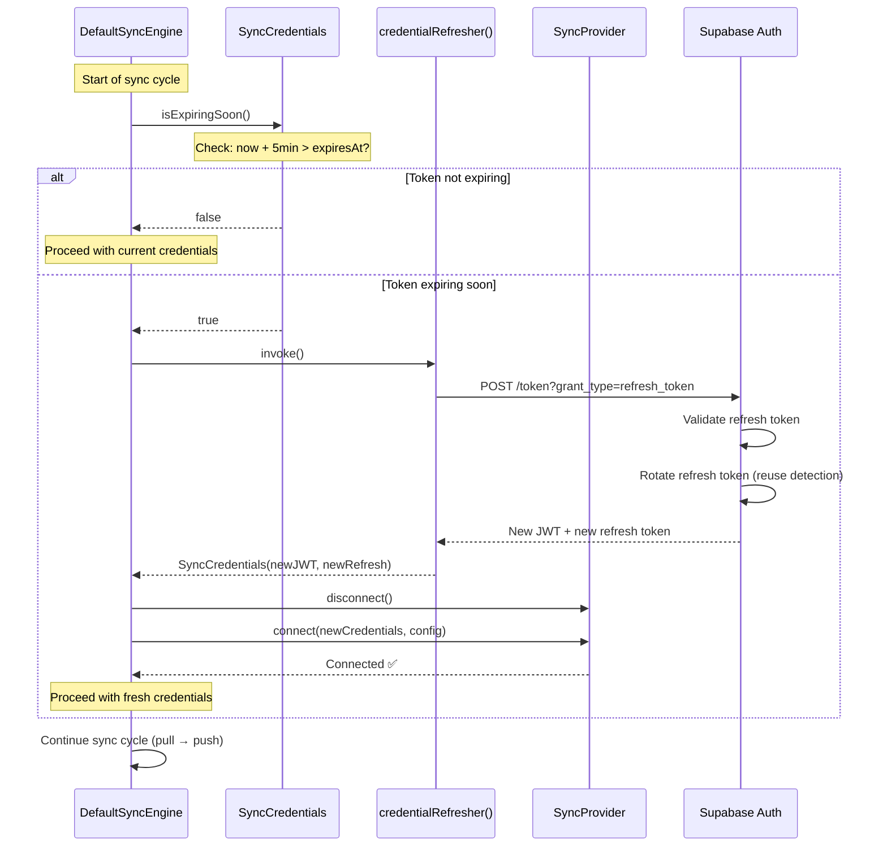
```mermaid
sequenceDiagram
    participant Engine as DefaultSyncEngine
    participant Creds as SyncCredentials
    participant Refresher as credentialRefresher()
    participant Provider as SyncProvider
    participant Auth as Supabase Auth

    Note over Engine: Start of sync cycle

    Engine->>Creds: isExpiringSoon()
    Note over Creds: Check: now + 5min > expiresAt?

    alt Token not expiring
        Creds-->>Engine: false
        Note over Engine: Proceed with current credentials
    else Token expiring soon
        Creds-->>Engine: true
        Engine->>Refresher: invoke()
        Refresher->>Auth: POST /token?grant_type=refresh_token
        Auth->>Auth: Validate refresh token
        Auth->>Auth: Rotate refresh token (reuse detection)
        Auth-->>Refresher: New JWT + new refresh token

        Refresher-->>Engine: SyncCredentials(newJWT, newRefresh)
        Engine->>Provider: disconnect()
        Engine->>Provider: connect(newCredentials, config)
        Provider-->>Engine: Connected ✅

        Note over Engine: Proceed with fresh credentials
    end

    Engine->>Engine: Continue sync cycle (pull → push)
```

---

## 9. Error Recovery & Exponential Backoff

When sync fails, the engine applies exponential backoff with jitter to prevent thundering-herd problems.

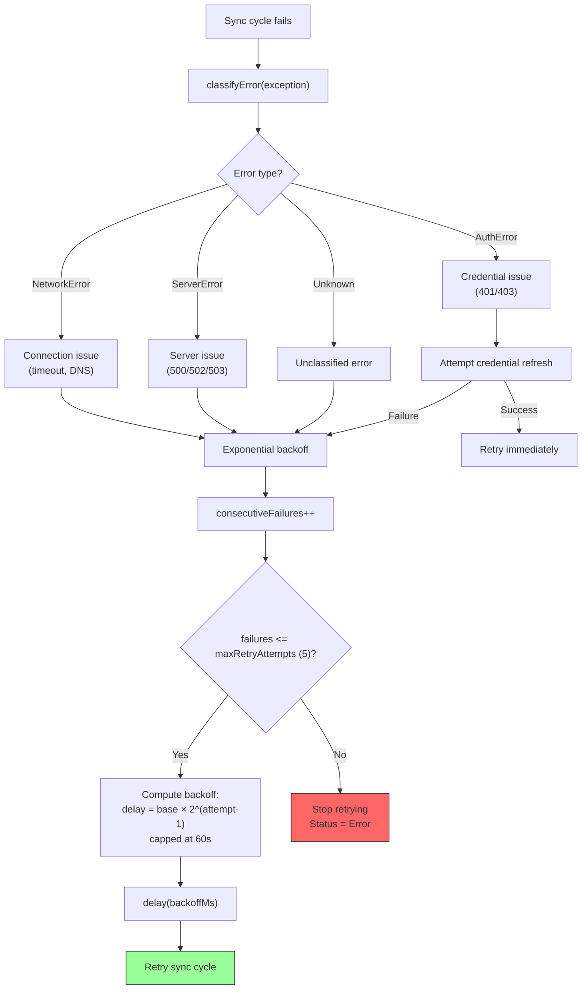
```mermaid
flowchart TD
    A["Sync cycle fails"] --> B["classifyError(exception)"]
    B --> C{"Error type?"}

    C -->|AuthError| D["Credential issue<br/>(401/403)"]
    C -->|NetworkError| E["Connection issue<br/>(timeout, DNS)"]
    C -->|ServerError| F["Server issue<br/>(500/502/503)"]
    C -->|Unknown| G["Unclassified error"]

    D --> H["Attempt credential refresh"]
    E --> I["Exponential backoff"]
    F --> I
    G --> I

    H -->|Success| J["Retry immediately"]
    H -->|Failure| I

    I --> K["consecutiveFailures++"]
    K --> L{"failures <= maxRetryAttempts (5)?"}
    L -->|Yes| M["Compute backoff:<br/>delay = base × 2^(attempt-1)<br/>capped at 60s"]
    L -->|No| N["Stop retrying<br/>Status = Error"]
    M --> O["delay(backoffMs)"]
    O --> P["Retry sync cycle"]

    style N fill:#f66,stroke:#333
    style P fill:#9f9,stroke:#333
```

**Backoff schedule:**


```mermaid
gantt
    title Exponential Backoff Schedule (base=1s, max=60s)
    dateFormat X
    axisFormat %s

    section Attempts
    Attempt 1 (1s delay)    :a1, 0, 1
    Attempt 2 (2s delay)    :a2, 1, 3
    Attempt 3 (4s delay)    :a3, 3, 7
    Attempt 4 (8s delay)    :a4, 7, 15
    Attempt 5 (16s delay)   :a5, 15, 31
    Give up                 :crit, 31, 32
```

**QueueProcessor jitter formula:**

```
delay = min(baseMs × 2^(retryCount-1), maxMs) × (0.5 + random(0, 0.5))
```

The jitter factor (0.5–1.0×) prevents synchronized retries when many clients fail simultaneously.

---

## 10. Multi-Device Propagation

When a change is committed on one device, this is how it reaches all other devices in the household.

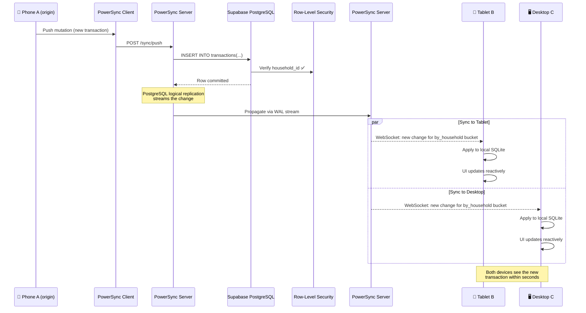
```mermaid
sequenceDiagram
    participant PhoneA as 📱 Phone A (origin)
    participant PSClient as PowerSync Client
    participant PSServer as PowerSync Server
    participant Supabase as Supabase PostgreSQL
    participant RLS as Row-Level Security
    participant PSServer2 as PowerSync Server
    participant Tablet as 📱 Tablet B
    participant Desktop as 🖥️ Desktop C

    PhoneA->>PSClient: Push mutation (new transaction)
    PSClient->>PSServer: POST /sync/push
    PSServer->>Supabase: INSERT INTO transactions(...)
    Supabase->>RLS: Verify household_id ✅
    Supabase-->>PSServer: Row committed

    Note over PSServer: PostgreSQL logical replication<br/>streams the change

    PSServer->>PSServer2: Propagate via WAL stream

    par Sync to Tablet
        PSServer2-->>Tablet: WebSocket: new change for by_household bucket
        Tablet->>Tablet: Apply to local SQLite
        Tablet->>Tablet: UI updates reactively
    and Sync to Desktop
        PSServer2-->>Desktop: WebSocket: new change for by_household bucket
        Desktop->>Desktop: Apply to local SQLite
        Desktop->>Desktop: UI updates reactively
    end

    Note over Tablet,Desktop: Both devices see the new<br/>transaction within seconds
```

---

## 11. Offline Queue Lifecycle

The complete lifecycle of a mutation from creation while offline through eventual sync.

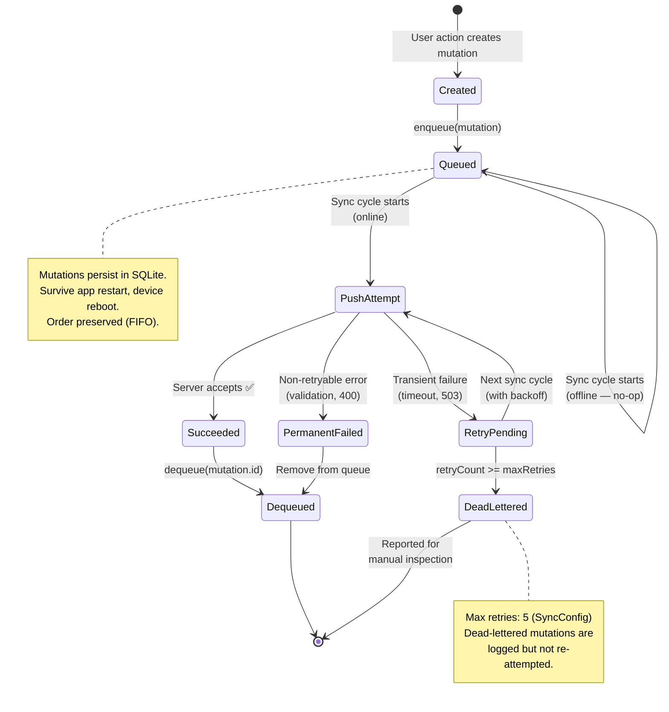
```mermaid
stateDiagram-v2
    [*] --> Created: User action creates mutation

    Created --> Queued: enqueue(mutation)

    Queued --> PushAttempt: Sync cycle starts<br/>(online)
    Queued --> Queued: Sync cycle starts<br/>(offline — no-op)

    PushAttempt --> Succeeded: Server accepts ✅
    PushAttempt --> RetryPending: Transient failure<br/>(timeout, 503)
    PushAttempt --> PermanentFailed: Non-retryable error<br/>(validation, 400)

    Succeeded --> Dequeued: dequeue(mutation.id)
    Dequeued --> [*]

    RetryPending --> PushAttempt: Next sync cycle<br/>(with backoff)
    RetryPending --> DeadLettered: retryCount >= maxRetries

    PermanentFailed --> Dequeued: Remove from queue

    DeadLettered --> [*]: Reported for<br/>manual inspection

    note right of Queued
        Mutations persist in SQLite.
        Survive app restart, device reboot.
        Order preserved (FIFO).
    end note

    note right of DeadLettered
        Max retries: 5 (SyncConfig)
        Dead-lettered mutations are
        logged but not re-attempted.
    end note
```

**Queue persistence:**

| Property    | Value                                               |
| ----------- | --------------------------------------------------- |
| Storage     | Local SQLite (via MutationQueue interface)          |
| Ordering    | FIFO (insertion order)                              |
| Batch size  | 50 (QueueProcessor) or 100 (DeltaSyncManager)       |
| Retry limit | 5 attempts (configurable via SyncConfig)            |
| Backoff     | Exponential: 1s → 2s → 4s → 8s → 16s (max 60s)      |
| Dead letter | After max retries, mutation is flagged, not retried |
| Persistence | Survives app restart, device reboot                 |

---

## 12. Encryption Layers in Data Flow

Data passes through multiple encryption boundaries as it flows from user to cloud.

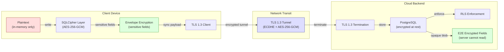
```mermaid
graph LR
    subgraph Device["Client Device"]
        direction TB
        Plain["Plaintext<br/>(in-memory only)"]
        SQLCipher["SQLCipher Layer<br/>(AES-256-GCM)"]
        E2E["Envelope Encryption<br/>(sensitive fields)"]
        TLS_C["TLS 1.3 Client"]
    end

    subgraph Transit["Network Transit"]
        TLS["TLS 1.3 Tunnel<br/>(ECDHE + AES-256-GCM)"]
    end

    subgraph Cloud["Cloud Backend"]
        TLS_S["TLS 1.3 Termination"]
        PG["PostgreSQL<br/>(encrypted at rest)"]
        RLS_E["RLS Enforcement"]
        E2E_S["E2E Encrypted Fields<br/>(server cannot read)"]
    end

    Plain -->|"write"| SQLCipher
    SQLCipher -->|"sensitive fields"| E2E
    E2E -->|"sync payload"| TLS_C
    TLS_C -->|"encrypted tunnel"| TLS
    TLS -->|"terminate"| TLS_S
    TLS_S -->|"store"| PG
    PG -->|"enforce"| RLS_E
    PG -->|"opaque blob"| E2E_S

    style Plain fill:#fdd,stroke:#933
    style E2E fill:#dfd,stroke:#393
    style TLS fill:#ddf,stroke:#339
    style E2E_S fill:#dfd,stroke:#393
```

**What is encrypted at each layer:**

| Layer              | What's Encrypted                                      | Key Source                              |
| ------------------ | ----------------------------------------------------- | --------------------------------------- |
| SQLCipher          | Entire local database file                            | Master key from Keychain/Keystore       |
| Envelope E2E       | Transaction amounts, account numbers, notes, balances | Per-household DEK (Data Encryption Key) |
| TLS 1.3            | All data in transit                                   | Ephemeral ECDHE keys                    |
| PostgreSQL at-rest | Disk-level encryption                                 | Managed by hosting provider             |
| Server-readable    | Timestamps, categories, household_id, sync metadata   | Not encrypted (required for sync/RLS)   |

---

## 13. Complete Sync Cycle Timing

A typical sync cycle with its phases and expected durations.


```mermaid
gantt
    title Sync Cycle Timeline (typical — 5 remote changes, 3 local mutations)
    dateFormat X
    axisFormat %Lms

    section Phase 0
    Credential check       :a0, 0, 5

    section Phase 1 - Pull
    Get pending mutations  :a1, 5, 7
    Pull delta changes     :a2, 7, 150
    Validate sequences     :a3, 150, 155
    Detect conflicts       :a4, 155, 158

    section Phase 2 - Resolve
    Resolve conflicts      :a5, 158, 162

    section Phase 3 - Push
    Push mutations batch   :a6, 162, 350
    Dequeue succeeded      :a7, 350, 355

    section Status Update
    Report to healthListener :a8, 355, 360
    Update SyncStatus      :a9, 360, 362
```

**Typical sync cycle performance:**

| Phase               | Duration      | Notes                                        |
| ------------------- | ------------- | -------------------------------------------- |
| Credential refresh  | 0–200ms       | Only when token expiring; 0ms in most cycles |
| Pull changes        | 50–300ms      | Depends on change count and network latency  |
| Sequence validation | 1–5ms         | In-memory comparison                         |
| Conflict detection  | 1–5ms         | Hash map lookup                              |
| Conflict resolution | 1–10ms        | Per conflict; usually 0 conflicts            |
| Push mutations      | 50–300ms      | Depends on mutation count and network        |
| Dequeue + cleanup   | 1–5ms         | Local SQLite operations                      |
| **Total**           | **100–800ms** | **Typical: ~200–400ms**                      |

---

## Diagram Maintenance

When updating these diagrams:

1. Modify this file (`docs/architecture/data-flow.md`)
2. Verify diagrams render correctly in the [Mermaid Live Editor](https://mermaid.live/)
3. Update `docs/architecture/overview.md` if the high-level data flow description changes
4. Cross-reference with `docs/architecture/diagrams.md` for consistency
5. Commit with: `docs(architecture): update data-flow diagrams (#N)`

---

## References

- [ADR-0002: Backend & Sync Architecture](./0002-backend-sync-architecture.md)
- [ADR-0003: Local Storage Strategy](./0003-local-storage-strategy.md)
- [ADR-0004: Auth & Security Architecture](./0004-auth-security-architecture.md)
- [Architecture Diagrams](./diagrams.md) — High-level system diagrams
- [Architecture Overview](./overview.md) — System overview
- `packages/sync/src/commonMain/kotlin/com/finance/sync/SyncEngine.kt`
- `packages/sync/src/commonMain/kotlin/com/finance/sync/delta/DeltaSyncManager.kt`
- `packages/sync/src/commonMain/kotlin/com/finance/sync/conflict/ConflictResolver.kt`
- `packages/sync/src/commonMain/kotlin/com/finance/sync/queue/QueueProcessor.kt`
- `services/api/powersync/sync-rules.yaml`

_Last updated: 2025-04-21. Maintained by `@system-architect`._
