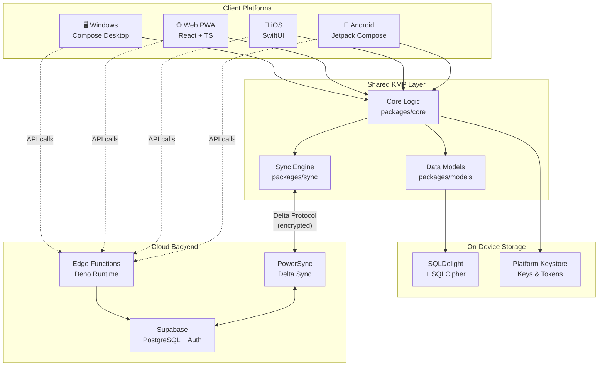
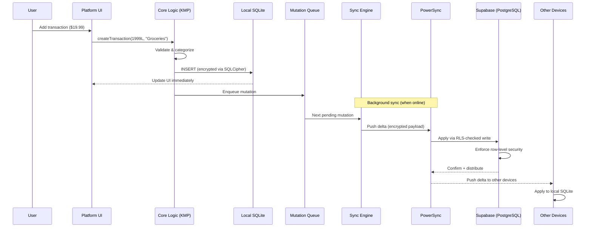
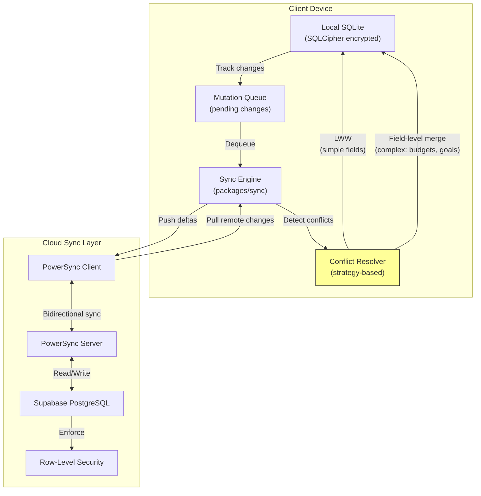
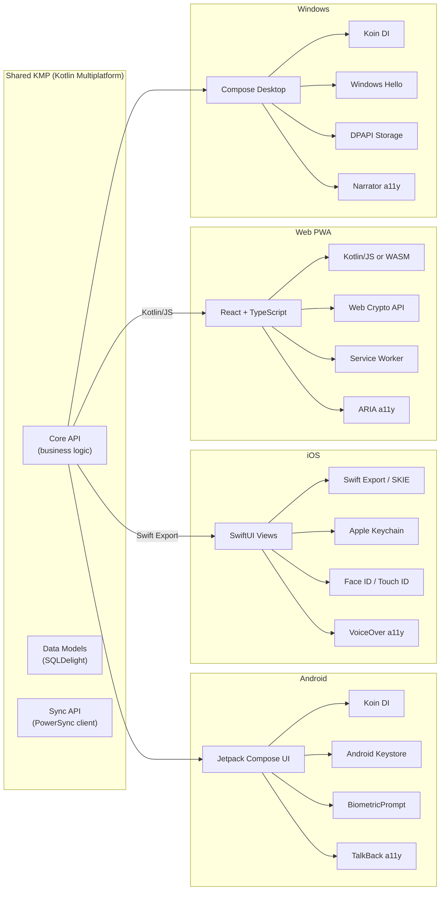
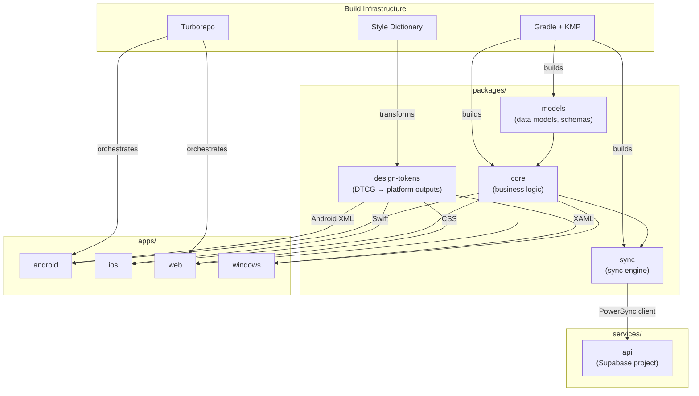
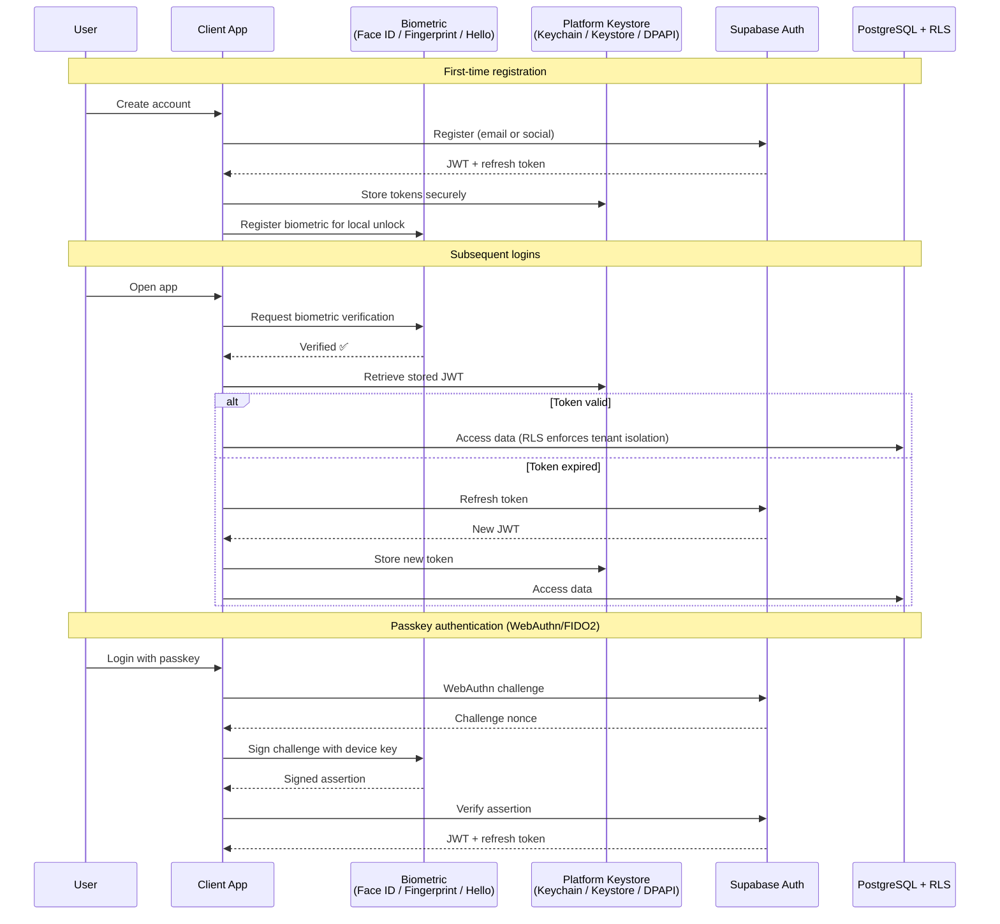
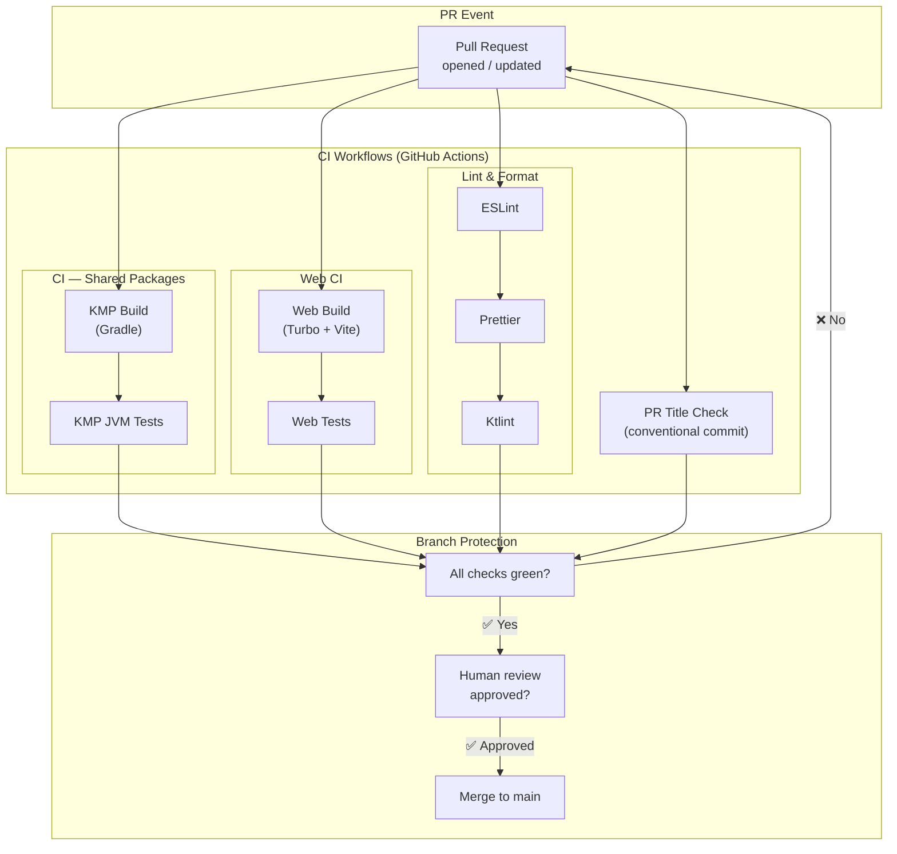
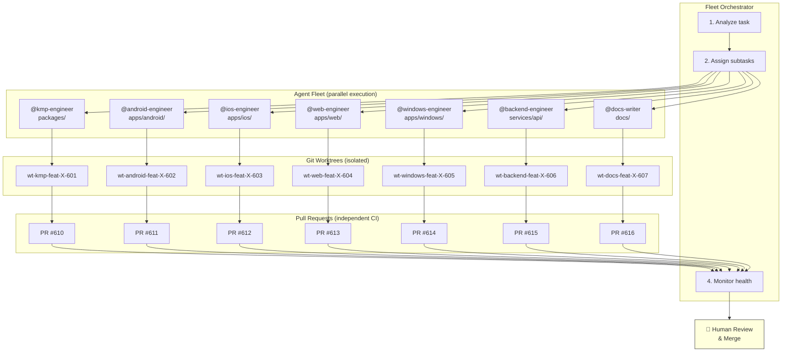
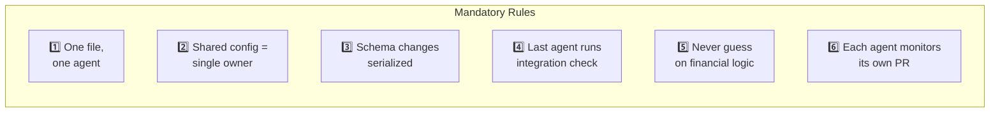

# Architecture Diagrams — Finance Monorepo

This document contains Mermaid diagrams for all major system components. These diagrams are the canonical visual reference for understanding how the Finance application is structured.

> **Rendering:** GitHub, VS Code (with Mermaid extension), and most Markdown viewers render these diagrams automatically. If your viewer doesn't render Mermaid, use the [Mermaid Live Editor](https://mermaid.live/).

---

## Table of Contents

- [1. High-Level System Architecture](#1-high-level-system-architecture)
- [2. Data Flow — Transaction Lifecycle](#2-data-flow--transaction-lifecycle)
- [3. Sync Architecture](#3-sync-architecture)
- [4. Platform Integration Map](#4-platform-integration-map)
- [5. Monorepo Package Dependencies](#5-monorepo-package-dependencies)
- [6. Authentication Flow](#6-authentication-flow)
- [7. CI/CD Pipeline](#7-cicd-pipeline)
- [8. AI Agent Fleet Architecture](#8-ai-agent-fleet-architecture)

---

## 1. High-Level System Architecture

The edge-first architecture: most logic and storage is on-device. The backend is a thin coordination layer for sync and auth.

---

## 2. Data Flow — Transaction Lifecycle

How a financial transaction moves from user input through local storage, sync, and multi-device propagation.

---

## 3. Sync Architecture

The offline-first sync pipeline with conflict resolution.

### Conflict Resolution Strategies

| Data Type         | Strategy                 | Rationale                                     |
| ----------------- | ------------------------ | --------------------------------------------- |
| Simple fields     | Last-Write-Wins (LWW)    | Timestamps determine the winner               |
| Budgets & goals   | Field-level merge        | Each field resolves independently             |
| Household data    | Field-level merge + RBAC | Role-based access controls who can write what |
| Transaction edits | LWW per field            | Individual field timestamps                   |
| Deletes           | Soft-delete + tombstone  | Prevents resurrection of deleted records      |

---

## 4. Platform Integration Map

How each platform integrates with the shared KMP layer and uses platform-native capabilities.

---

## 5. Monorepo Package Dependencies

Build dependency graph for the monorepo packages.

---

## 6. Authentication Flow

Multi-factor authentication with passkeys as primary and OAuth as fallback.

---

## 7. CI/CD Pipeline

GitHub Actions workflow triggered by pull requests.

---

## 8. AI Agent Fleet Architecture

How AI agents are organized, dispatched, and coordinated in fleet mode.

### Fleet Coordination Rules (Visual)

---

## Diagram Maintenance

When updating these diagrams:

1. Modify this file (`docs/architecture/diagrams.md`)
2. Verify diagrams render correctly in the [Mermaid Live Editor](https://mermaid.live/)
3. Update `docs/architecture/overview.md` if the high-level architecture diagram changes
4. Commit with: `docs(architecture): update [diagram-name] diagram (#N)`

If a diagram becomes outdated because of a code change, file a pain point in [pain-points.md](../ai/pain-points.md) with category "Documentation."

---

_Last updated: 2025-07-27. Maintained by `@docs-writer`._
