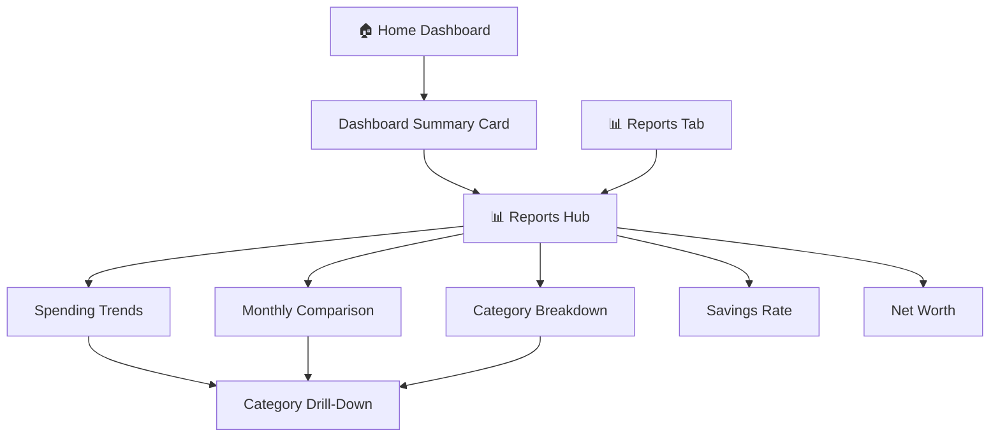

# Architecture Design: Financial Insights Feature

> **Issue:** [#241](https://github.com/nicholasgubbins/finance/issues/241) (Sprint 4)
> **Status:** PROPOSED — Pending human review
> **Date:** 2025-07-26
> **Author:** System Architect (AI agent)
> **Related:** ADR-0001 (KMP), ADR-0003 (Local Storage), Data Visualization Guidelines, Personas (Journey 3)

---

## Table of Contents

1. [Overview](#1-overview)
2. [Design Principles](#2-design-principles)
3. [Insight Modules](#3-insight-modules)
4. [Data Flow Architecture](#4-data-flow-architecture)
5. [Component Hierarchy](#5-component-hierarchy)
6. [State Management](#6-state-management)
7. [Shared KMP Interfaces](#7-shared-kmp-interfaces)
8. [Computation Strategy](#8-computation-strategy)
9. [Accessibility & Visualization](#9-accessibility--visualization)
10. [Expertise Tier Adaptations](#10-expertise-tier-adaptations)
11. [Platform-Specific Adaptations](#11-platform-specific-adaptations)
12. [Testing Strategy](#12-testing-strategy)
13. [Open Questions](#13-open-questions)

---

## 1. Overview

Financial Insights transforms raw transaction and account data into actionable
understanding. Rather than just showing charts, insights answer the questions
users actually ask: _"Am I doing better this month?"_, _"Where is my money
going?"_, and _"Am I saving enough?"_.

All computation runs entirely on-device from local SQLDelight data. The backend
is never involved in insight generation — this is a pure edge-first feature.

### Insight Modules

| Module             | User Question                            | Personas Served     |
| ------------------ | ---------------------------------------- | ------------------- |
| Spending Trends    | "How has my spending changed over time?" | Alex, Jordan, Casey |
| Monthly Comparison | "Am I doing better than last month?"     | Alex, Jordan        |
| Category Breakdown | "Where does my money go?"                | Alex, Casey         |
| Savings Rate       | "Am I saving enough?"                    | Jordan              |
| Net Worth Tracking | "What's my overall financial picture?"   | Jordan              |
| Dashboard Summary  | "How am I doing right now?"              | All                 |

### Relationship to Existing Code

This feature builds on top of the existing shared KMP analytics and aggregation
modules, extending them with an insight-generation layer:

```
Existing (packages/core):
├── aggregation/FinancialAggregator.kt   ← Low-level aggregation primitives
├── analytics/ReportGenerator.kt         ← Report-oriented computations
├── analytics/SpendingInsight.kt         ← Per-category month-over-month comparison
├── analytics/MonthlyComparison.kt       ← Income vs. expense per month
├── analytics/NetWorthSnapshot.kt        ← Point-in-time net worth
└── budget/BudgetCalculator.kt           ← Budget utilization calculations

New (packages/core — this design):
└── insights/
    ├── InsightEngine.kt                 ← Orchestrates all insight computation
    ├── InsightModels.kt                 ← Insight result types
    ├── SpendingTrendAnalyzer.kt         ← Spending trend detection and narratives
    ├── SavingsRateCalculator.kt         ← Savings rate with historical tracking
    ├── DashboardSummaryBuilder.kt       ← Aggregates key metrics for dashboard
    └── InsightFormatter.kt             ← Tier-aware text generation
```

---

## 2. Design Principles

| Principle                     | Application to Insights                                                                                  |
| ----------------------------- | -------------------------------------------------------------------------------------------------------- |
| **Edge-first**                | All computation from local SQLDelight data. Zero network calls. Results available offline instantly.     |
| **Non-judgmental**            | "You spent $200 on dining" — not "You overspent on dining! 🚨". Facts + encouragement, never guilt.      |
| **Clarity over completeness** | One hero metric per insight card. Details on demand. Never more than 5 visible insights at once.         |
| **Expertise-tiered**          | 🌱 sees simple summaries. 📊 sees trends + comparisons. 🧠 sees percentages, rates, and raw data tables. |
| **Accessible**                | All charts have text alternatives. CVD-safe palette. Screen reader describes trends in words.            |
| **Progressive value**         | Insights improve as more data accumulates. New user sees "Not enough data yet" — not empty screens.      |

---

## 3. Insight Modules

### 3.1 Spending Trends

**Question:** _"How has my spending changed over time?"_

**Data source:** `FinancialAggregator.monthlySpendingTrend()` +
`FinancialAggregator.dailySpending()`

**Visualization:** Line chart (monthly) or bar chart (weekly/daily)

**Insight outputs:**

- Total spending this month vs. monthly average
- Spending velocity: "You're spending 15% faster than usual this month"
- Highest/lowest spending day identification
- Per-category trend direction (↑ ↓ →)

**Minimum data requirement:** 2 months of transactions (for trend comparison)

```kotlin
data class SpendingTrendInsight(
    /** Monthly spending totals, ordered chronologically. */
    val monthlyTotals: List<MonthlyTotal>,
    /** Average monthly spending across the period. */
    val monthlyAverage: Cents,
    /** Current month's spending so far. */
    val currentMonthSpending: Cents,
    /** Spending velocity relative to last month (1.0 = same pace). */
    val velocity: Double,
    /** Projected month-end spending at current velocity. */
    val projectedMonthEnd: Cents,
    /** Human-readable insight text (tier-aware). */
    val narrative: InsightNarrative,
)
```

### 3.2 Monthly Comparison

**Question:** _"Am I doing better than last month?"_

**Data source:** `ReportGenerator.incomeVsExpense()` +
`ReportGenerator.spendingInsights()`

**Visualization:** Side-by-side bar chart (this month vs. last month) with
change indicators

**Insight outputs:**

- Total spending comparison (absolute + percentage change)
- Top 3 categories that changed most
- Direction indicator per category (↑ increased, ↓ decreased, → stable)
- Net cash flow comparison

**Minimum data requirement:** 2 months of transactions

```kotlin
data class MonthlyComparisonInsight(
    /** Current month's income/expense/net summary. */
    val currentMonth: MonthlyComparison,
    /** Previous month's income/expense/net summary. */
    val previousMonth: MonthlyComparison,
    /** Total spending change as a percentage. */
    val spendingChangePercent: Double?,
    /** Per-category insights, sorted by largest absolute change. */
    val categoryChanges: List<SpendingInsight>,
    /** Top 3 categories with the largest changes (for summary card). */
    val topChanges: List<SpendingInsight>,
    /** Human-readable insight text (tier-aware). */
    val narrative: InsightNarrative,
)
```

### 3.3 Category Breakdown

**Question:** _"Where does my money go?"_

**Data source:** `ReportGenerator.spendingByCategory()`

**Visualization:** Donut chart with center total + top category list

**Insight outputs:**

- Spending per category as absolute amounts and percentages
- Top category identification
- "Long tail" grouping (categories < 3% of total grouped as "Other")
- Comparison callout: "Food is your #1 category at 32% of spending"

**Minimum data requirement:** 1 transaction

```kotlin
data class CategoryBreakdownInsight(
    /** Period these breakdowns cover. */
    val period: DateRange,
    /** Total spending in the period. */
    val totalSpending: Cents,
    /** Category breakdowns, sorted by amount descending. */
    val categories: List<CategorySpending>,
    /** Maximum 6 slices for chart; remainder grouped into "Other". */
    val chartSlices: List<ChartSlice>,
    /** Human-readable insight text (tier-aware). */
    val narrative: InsightNarrative,
)

data class CategorySpending(
    val categoryId: SyncId,
    val amount: Cents,
    /** Percentage of total spending (0.0–100.0). */
    val percentage: Double,
    /** Rank (1 = highest spending category). */
    val rank: Int,
)

data class ChartSlice(
    val label: String,
    val amount: Cents,
    val percentage: Double,
    val colorIndex: Int,
    /** True if this is the aggregated "Other" slice. */
    val isOther: Boolean = false,
)
```

### 3.4 Savings Rate

**Question:** _"Am I saving enough?"_

**Data source:** `FinancialAggregator.savingsRate()` +
`ReportGenerator.incomeVsExpense()`

**Visualization:** Donut chart (savings as % of income) + trend sparkline

**Insight outputs:**

- Current month savings rate as percentage
- Historical savings rate trend (last 3/6/12 months)
- Absolute savings amount (income - expenses)
- Contextual note: savings rate explained in plain language

**Minimum data requirement:** 1 month with both income and expense transactions

```kotlin
data class SavingsRateInsight(
    /** Current month savings rate (0.0–100.0, can be negative). */
    val currentRate: Double,
    /** Monthly savings rates for the trend line, ordered chronologically. */
    val historicalRates: List<MonthlySavingsRate>,
    /** Absolute savings this month (income - expenses). */
    val currentSavings: Cents,
    /** Average savings rate over the historical period. */
    val averageRate: Double,
    /** Human-readable insight text (tier-aware). */
    val narrative: InsightNarrative,
)

data class MonthlySavingsRate(
    val year: Int,
    val month: Month,
    val rate: Double,
    val savings: Cents,
)
```

### 3.5 Net Worth Tracking

**Question:** _"What's my overall financial picture?"_

**Data source:** `ReportGenerator.netWorthOverTime()` +
`FinancialAggregator.netWorth()`

**Visualization:** Line chart over time with asset/liability breakdown

**Insight outputs:**

- Current net worth (assets - liabilities)
- Net worth change this month (absolute + percentage)
- Asset/liability breakdown
- Net worth trend direction over selected period

**Minimum data requirement:** 1 account with a balance

```kotlin
data class NetWorthInsight(
    /** Current net worth. */
    val currentNetWorth: Cents,
    /** Month-over-month net worth change. */
    val monthlyChange: Cents,
    /** Percentage change in net worth vs. last month. */
    val monthlyChangePercent: Double?,
    /** Historical net worth snapshots for the trend chart. */
    val history: List<NetWorthSnapshot>,
    /** Asset/liability breakdown for current snapshot. */
    val currentAssets: Cents,
    val currentLiabilities: Cents,
    /** Human-readable insight text (tier-aware). */
    val narrative: InsightNarrative,
)
```

### 3.6 Dashboard Summary

**Question:** _"How am I doing right now?"_

**Data source:** Composite of all modules above

**Visualization:** Hero metric card on Home Dashboard

**Insight outputs:**

- Today's spending total
- This week's spending vs. budget pace
- Month-to-date spending with projection
- One highlight insight (the most notable change)

**Minimum data requirement:** None (shows zero-state guidance for new users)

```kotlin
data class DashboardSummary(
    /** Today's total spending. */
    val todaySpending: Cents,
    /** This month's spending so far. */
    val monthToDateSpending: Cents,
    /** Monthly budget total (if budgets exist). */
    val monthlyBudgetTotal: Cents?,
    /** Budget utilization as percentage (if budgets exist). */
    val budgetUtilization: Double?,
    /** The single most notable insight to highlight. */
    val highlightInsight: InsightNarrative?,
    /** Number of days data is available (for progressive disclosure). */
    val dataAgeDays: Int,
)
```

---

## 4. Data Flow Architecture

### 4.1 High-Level Data Flow

```
┌──────────────────────────────────────────────────────────────────────────────┐
│                           Platform UI Layer                                  │
│                                                                              │
│  ┌─────────────────┐  ┌──────────────────┐  ┌──────────────────────────┐    │
│  │  Home Dashboard  │  │  Reports Hub     │  │  Individual Report      │    │
│  │                  │  │                  │  │  Screens                 │    │
│  │  • Summary card  │  │  • Report cards  │  │  • SpendingTrendsScreen  │    │
│  │  • Highlight     │  │  • Quick stats   │  │  • ComparisonScreen     │    │
│  │    insight        │  │                  │  │  • CategoryScreen       │    │
│  └──────┬───────────┘  └──────┬───────────┘  │  • SavingsRateScreen    │    │
│         │                     │              │  • NetWorthScreen        │    │
│         │  Observe StateFlow  │              └──────────┬───────────────┘    │
│         ▼                     ▼                         ▼                    │
├──────────────────────────────────────────────────────────────────────────────┤
│                        Shared KMP Layer                                      │
│                                                                              │
│  ┌───────────────────────────────────────────────────────────────────────┐   │
│  │                        InsightEngine                                  │   │
│  │  • Orchestrates all insight computation                              │   │
│  │  • Accepts InsightRequest (period, modules, tier)                    │   │
│  │  • Returns InsightResult (all computed insights)                     │   │
│  │  • Handles "not enough data" gracefully                              │   │
│  └──────┬──────────────┬──────────────┬──────────────┬─────────────────┘   │
│         │              │              │              │                      │
│         ▼              ▼              ▼              ▼                      │
│  ┌────────────┐ ┌────────────┐ ┌────────────┐ ┌────────────────────┐       │
│  │  Spending  │ │  Savings   │ │  Net Worth │ │  Dashboard Summary │       │
│  │  Trend     │ │  Rate      │ │  Tracker   │ │  Builder           │       │
│  │  Analyzer  │ │  Calc      │ │            │ │                    │       │
│  └─────┬──────┘ └─────┬──────┘ └─────┬──────┘ └──────────┬─────────┘       │
│        │              │              │                   │                  │
│        └──────────────┼──────────────┼───────────────────┘                  │
│                       ▼              ▼                                      │
│        ┌───────────────────────────────────────────┐                        │
│        │ Existing Shared Computation Layer          │                        │
│        │                                           │                        │
│        │  FinancialAggregator   ReportGenerator    │                        │
│        │  • netWorth()          • spendingByCategory() │                    │
│        │  • totalSpending()     • incomeVsExpense()    │                    │
│        │  • totalIncome()       • netWorthOverTime()   │                    │
│        │  • savingsRate()       • spendingInsights()   │                    │
│        │  • dailySpending()     • categoryTrends()     │                    │
│        │  • spendingVelocity()                         │                    │
│        └───────────────┬───────────────────────────┘                        │
│                        │                                                    │
│                        ▼                                                    │
│        ┌────────────────────────────────────────┐                           │
│        │  SQLDelight (Local Database)            │                           │
│        │  • Transactions table                   │                           │
│        │  • Accounts table                       │                           │
│        │  • Categories table                     │                           │
│        │  • Budgets table                        │                           │
│        └────────────────────────────────────────┘                           │
└──────────────────────────────────────────────────────────────────────────────┘
```

### 4.2 Data Query Strategy

All insights are computed from data already loaded into memory by the
repository layer. No additional database queries are added — the existing
`TransactionRepository`, `AccountRepository`, etc., already expose reactive
`Flow<List<T>>` streams that the UI observes.

```
┌──────────────────────────────────────┐
│           Repository Layer            │
│                                      │
│  TransactionRepository               │
│  ├── observeAll(): Flow<List<Txn>>   │   ← Reactive stream, already exists
│  └── getByDateRange(): List<Txn>     │
│                                      │
│  AccountRepository                   │
│  └── observeAll(): Flow<List<Acct>>  │   ← Reactive stream, already exists
│                                      │
│  CategoryRepository                  │
│  └── observeAll(): Flow<List<Cat>>   │   ← Reactive stream, already exists
│                                      │
│  BudgetRepository                    │
│  └── observeAll(): Flow<List<Bud>>   │   ← Reactive stream, already exists
└───────────────┬──────────────────────┘
                │
                │ Flow.combine()
                ▼
┌──────────────────────────────────────┐
│       InsightEngine.observe()         │
│                                      │
│  Combines all repository flows       │
│  into a single InsightResult         │
│  that updates whenever any            │
│  underlying data changes.             │
└──────────────────────────────────────┘
```

---

## 5. Component Hierarchy

### 5.1 Shared KMP Components (packages/core)

```
packages/core/src/commonMain/kotlin/com/finance/core/insights/
├── InsightEngine.kt                 ← Entry point — orchestrates all modules
├── InsightModels.kt                 ← All insight result types (§ 3 above)
├── InsightNarrative.kt              ← Tier-aware text generation types
├── InsightFormatter.kt             ← Generates narratives from raw data
├── SpendingTrendAnalyzer.kt         ← Trend detection, velocity, projection
├── SavingsRateCalculator.kt         ← Historical savings rate tracking
├── DashboardSummaryBuilder.kt       ← Builds composite dashboard summary
├── CategoryBreakdownBuilder.kt      ← Category grouping + chart slice logic
├── MonthlyComparisonBuilder.kt      ← Month-over-month comparison logic
├── NetWorthTracker.kt               ← Net worth trend + change computation
└── InsightDataRequirements.kt       ← Minimum data checks per module
```

### 5.2 Platform UI Components (per app)

```
apps/<platform>/insights/
├── InsightsViewModel                ← Wraps InsightEngine for platform lifecycle
├── DashboardSummaryCard             ← Hero metric on Home tab
├── InsightsHubScreen                ← Reports tab — grid of insight cards
├── SpendingTrendsScreen             ← Full spending trends report
│   ├── TrendLineChart               ← Platform-native line chart
│   └── TrendNarrativeCard           ← Text summary of trends
├── MonthlyComparisonScreen          ← This month vs. last month
│   ├── ComparisonBarChart           ← Side-by-side bar chart
│   └── CategoryChangeList           ← Top category changes
├── CategoryBreakdownScreen          ← Where does my money go?
│   ├── CategoryDonutChart           ← Donut chart with center label
│   └── CategoryRankingList          ← Ranked category list
├── SavingsRateScreen                ← Savings rate with history
│   ├── SavingsRateDonut             ← Rate as donut percentage
│   └── SavingsRateSparkline         ← Historical trend line
├── NetWorthScreen                   ← Net worth over time
│   ├── NetWorthLineChart            ← Asset/liability stacked line
│   └── AccountBreakdownList         ← Per-account contribution
└── components/
    ├── InsightCard                   ← Reusable insight summary card
    ├── EmptyInsightState             ← "Not enough data yet" state
    ├── PeriodPicker                  ← 3/6/12 month period selector
    └── AccessibleChartDescription    ← Screen reader text for charts
```

### 5.3 Screen Navigation



---

## 6. State Management

### 6.1 InsightState

```kotlin
/**
 * UI state for insight screens. Emitted by InsightEngine
 * as a StateFlow that platform ViewModels observe.
 */
sealed interface InsightState {
    /** Initial loading — computing insights from local data. */
    data object Computing : InsightState

    /** Not enough data for meaningful insights. */
    data class InsufficientData(
        val dataAgeDays: Int,
        val transactionCount: Int,
        val availableModules: Set<InsightModule>,
        val unavailableModules: Map<InsightModule, DataRequirement>,
    ) : InsightState

    /** Insights computed and ready for display. */
    data class Ready(
        val summary: DashboardSummary,
        val spendingTrend: SpendingTrendInsight?,
        val monthlyComparison: MonthlyComparisonInsight?,
        val categoryBreakdown: CategoryBreakdownInsight?,
        val savingsRate: SavingsRateInsight?,
        val netWorth: NetWorthInsight?,
        val lastComputed: Instant,
    ) : InsightState
}

/**
 * Which insight modules are available/requested.
 */
enum class InsightModule {
    SPENDING_TRENDS,
    MONTHLY_COMPARISON,
    CATEGORY_BREAKDOWN,
    SAVINGS_RATE,
    NET_WORTH,
    DASHBOARD_SUMMARY,
}
```

### 6.2 InsightRequest

```kotlin
/**
 * Request parameters for insight computation.
 * Enables partial computation (only the modules the user is viewing).
 */
data class InsightRequest(
    /** Which modules to compute. */
    val modules: Set<InsightModule> = InsightModule.entries.toSet(),
    /** How many months of history to include. */
    val periodMonths: Int = 6,
    /** Reference date (defaults to today). */
    val referenceDate: LocalDate? = null,
    /** User's expertise tier (affects narrative text). */
    val expertiseTier: ExpertiseTier = ExpertiseTier.COMFORTABLE,
)
```

### 6.3 Reactive Data Pipeline

```kotlin
/**
 * Reactive pipeline: repository Flows → InsightEngine → InsightState.
 *
 * When any underlying data changes (new transaction, account balance update),
 * the insights automatically recompute and the UI updates.
 */

// In platform ViewModel:
val insightState: StateFlow<InsightState> = combine(
    transactionRepository.observeAll(),
    accountRepository.observeAll(),
    categoryRepository.observeAll(),
    budgetRepository.observeAll(),
) { transactions, accounts, categories, budgets ->
    insightEngine.compute(
        transactions = transactions,
        accounts = accounts,
        categories = categories,
        budgets = budgets,
        request = InsightRequest(expertiseTier = userPreferences.expertiseTier),
    )
}.stateIn(viewModelScope, SharingStarted.WhileSubscribed(5000), InsightState.Computing)
```

---

## 7. Shared KMP Interfaces

### 7.1 InsightEngine

```kotlin
// packages/core/src/commonMain/kotlin/com/finance/core/insights/InsightEngine.kt

/**
 * Central orchestrator for all financial insight computation.
 *
 * Pure Kotlin, no platform dependencies. Takes in-memory data collections
 * and returns computed insights. All monetary values use [Cents].
 *
 * The engine delegates to the existing [FinancialAggregator] and
 * [ReportGenerator] for low-level computations and adds insight-level
 * analysis on top (trend detection, narrative generation, data sufficiency
 * checks).
 */
class InsightEngine(
    private val spendingTrendAnalyzer: SpendingTrendAnalyzer,
    private val savingsRateCalculator: SavingsRateCalculator,
    private val dashboardSummaryBuilder: DashboardSummaryBuilder,
    private val categoryBreakdownBuilder: CategoryBreakdownBuilder,
    private val monthlyComparisonBuilder: MonthlyComparisonBuilder,
    private val netWorthTracker: NetWorthTracker,
    private val insightFormatter: InsightFormatter,
) {
    /**
     * Compute all requested insights from in-memory data.
     *
     * This is a pure function — given the same inputs, it always
     * produces the same output. No side effects, no I/O.
     *
     * @param transactions All user transactions (filtering applied internally).
     * @param accounts     All user accounts.
     * @param categories   All user categories (for name resolution).
     * @param budgets      All user budgets (for budget utilization).
     * @param request      Which modules to compute and configuration.
     */
    fun compute(
        transactions: List<Transaction>,
        accounts: List<Account>,
        categories: List<Category>,
        budgets: List<Budget>,
        request: InsightRequest,
    ): InsightState
}
```

### 7.2 SpendingTrendAnalyzer

```kotlin
// packages/core/src/commonMain/kotlin/com/finance/core/insights/SpendingTrendAnalyzer.kt

/**
 * Analyzes spending patterns over time: trends, velocity, and projections.
 *
 * Builds on [FinancialAggregator.monthlySpendingTrend] and
 * [FinancialAggregator.spendingVelocity] for low-level computation.
 */
class SpendingTrendAnalyzer {
    /**
     * Compute spending trend insight.
     *
     * @param transactions All transactions.
     * @param periodMonths Number of months to analyze.
     * @param referenceDate Anchor date.
     * @return SpendingTrendInsight or null if insufficient data.
     */
    fun analyze(
        transactions: List<Transaction>,
        periodMonths: Int,
        referenceDate: LocalDate,
    ): SpendingTrendInsight?

    /**
     * Project month-end spending based on current velocity.
     *
     * Uses simple linear extrapolation: (spending so far / days elapsed) * days in month.
     */
    fun projectMonthEnd(
        currentMonthSpending: Cents,
        dayOfMonth: Int,
        daysInMonth: Int,
    ): Cents
}
```

### 7.3 SavingsRateCalculator

```kotlin
// packages/core/src/commonMain/kotlin/com/finance/core/insights/SavingsRateCalculator.kt

/**
 * Computes savings rate with historical tracking.
 *
 * Savings rate = (income - expenses) / income × 100
 *
 * A negative savings rate means spending exceeded income.
 * Handles zero-income months gracefully (rate = 0.0, not NaN).
 */
class SavingsRateCalculator {
    /**
     * Compute savings rate insight over a period.
     *
     * @param transactions All transactions.
     * @param periodMonths Number of months for historical rates.
     * @param referenceDate Anchor date.
     * @return SavingsRateInsight or null if no income/expense data.
     */
    fun calculate(
        transactions: List<Transaction>,
        periodMonths: Int,
        referenceDate: LocalDate,
    ): SavingsRateInsight?
}
```

### 7.4 CategoryBreakdownBuilder

```kotlin
// packages/core/src/commonMain/kotlin/com/finance/core/insights/CategoryBreakdownBuilder.kt

/**
 * Builds category breakdown with chart-ready slices.
 *
 * Follows data visualization guidelines:
 * - Maximum 6 colored slices + 1 "Other" (gray)
 * - Categories < 3% of total grouped into "Other"
 * - Sorted by amount descending
 */
class CategoryBreakdownBuilder {
    /**
     * Build category breakdown for a date range.
     *
     * @param transactions All transactions.
     * @param categories All categories (for name/icon resolution).
     * @param dateRange Period to analyze.
     * @return CategoryBreakdownInsight or null if no spending data.
     */
    fun build(
        transactions: List<Transaction>,
        categories: List<Category>,
        dateRange: ReportGenerator.DateRange,
    ): CategoryBreakdownInsight?

    companion object {
        /** Maximum distinct chart slices before grouping into "Other". */
        const val MAX_CHART_SLICES = 6
        /** Categories below this percentage are grouped into "Other". */
        const val OTHER_THRESHOLD_PERCENT = 3.0
    }
}
```

### 7.5 InsightFormatter

```kotlin
// packages/core/src/commonMain/kotlin/com/finance/core/insights/InsightFormatter.kt

/**
 * Generates human-readable narratives from computed insights.
 *
 * Narratives are expertise-tier-aware:
 * - 🌱 Getting Started: Simple, encouraging, plain language
 * - 📊 Comfortable: Standard terminology with context
 * - 🧠 Advanced: Precise numbers, percentages, technical terms
 *
 * All narratives follow UX Principle 3 (Non-Judgmental Finance):
 * present facts, never judgments.
 */
class InsightFormatter {
    /**
     * Format a spending trend into a narrative.
     *
     * Examples:
     * - 🌱 "You've spent $420 so far this month — that's about the same as usual."
     * - 📊 "Month-to-date spending: $420. You're on pace with your monthly average of $450."
     * - 🧠 "MTD: $420 (93% of avg). Velocity: 0.97x. Projected month-end: $440."
     */
    fun formatSpendingTrend(
        insight: SpendingTrendInsight,
        tier: ExpertiseTier,
    ): InsightNarrative

    /** Format monthly comparison. */
    fun formatMonthlyComparison(
        insight: MonthlyComparisonInsight,
        tier: ExpertiseTier,
    ): InsightNarrative

    /** Format category breakdown. */
    fun formatCategoryBreakdown(
        insight: CategoryBreakdownInsight,
        tier: ExpertiseTier,
    ): InsightNarrative

    /** Format savings rate. */
    fun formatSavingsRate(
        insight: SavingsRateInsight,
        tier: ExpertiseTier,
    ): InsightNarrative

    /** Format net worth change. */
    fun formatNetWorth(
        insight: NetWorthInsight,
        tier: ExpertiseTier,
    ): InsightNarrative
}

/**
 * A tier-aware narrative with headline, body, and accessibility description.
 */
data class InsightNarrative(
    /** Short headline for card display. */
    val headline: String,
    /** Longer body text with context. */
    val body: String,
    /** Screen reader optimized description (full sentence). */
    val accessibilityDescription: String,
    /** Optional callout data point (e.g., "$420" or "15%"). */
    val heroValue: String?,
    /** Sentiment: POSITIVE, NEUTRAL, or INFORMATIONAL (never NEGATIVE). */
    val sentiment: InsightSentiment,
)

enum class InsightSentiment {
    /** Good news — celebrate (e.g., spending down, savings up). */
    POSITIVE,
    /** Neutral observation — just the facts. */
    NEUTRAL,
    /** Informational — new data available, not enough data yet, etc. */
    INFORMATIONAL,
}
```

### 7.6 InsightDataRequirements

```kotlin
// packages/core/src/commonMain/kotlin/com/finance/core/insights/InsightDataRequirements.kt

/**
 * Checks whether sufficient data exists for each insight module.
 * Used to show helpful empty states instead of broken/misleading charts.
 */
object InsightDataRequirements {
    /**
     * Check data sufficiency for a module.
     *
     * @return DataRequirement indicating what's needed, or null if sufficient.
     */
    fun check(
        module: InsightModule,
        transactions: List<Transaction>,
        accounts: List<Account>,
    ): DataRequirement?
}

/**
 * Describes what data is missing for a particular insight.
 */
data class DataRequirement(
    /** Human-readable description of what's needed. */
    val descriptionKey: String,
    /** How close the user is to having enough data (0.0–1.0). */
    val progress: Double,
    /** Suggested action to get more data. */
    val actionKey: String?,
)
```

---

## 8. Computation Strategy

### 8.1 Performance Approach

All insight computation is **on-device and synchronous** within a coroutine
context. Given the expected data volumes (thousands of transactions, not
millions), in-memory computation is fast enough without caching.

| Data Volume          | Expected Computation Time | Strategy                               |
| -------------------- | ------------------------- | -------------------------------------- |
| < 1,000 transactions | < 10ms                    | Direct computation, no caching         |
| 1,000–10,000         | 10–50ms                   | Compute on `Dispatchers.Default`       |
| 10,000–100,000       | 50–200ms                  | Background computation with UI loading |

### 8.2 Recomputation Triggers

Insights recompute when any underlying data changes:

```
Transaction added/edited/deleted  ─┐
Account balance changed            ├──▶ Repository Flow emits ──▶ InsightEngine.compute()
Budget created/modified            │
Category changed                  ─┘
```

### 8.3 No Server Involvement

```
┌─────────────────────────────────────────────────────────┐
│                    Client Device                         │
│                                                          │
│  SQLDelight ──▶ Repository ──▶ InsightEngine ──▶ UI     │
│                                                          │
│  ┌─ NEVER ──────────────────────────────────────────┐   │
│  │  ❌ No API calls for insights                     │   │
│  │  ❌ No server-side aggregation                    │   │
│  │  ❌ No analytics telemetry about spending         │   │
│  │  ❌ No insight data leaves the device             │   │
│  └──────────────────────────────────────────────────┘   │
└─────────────────────────────────────────────────────────┘
```

The backend never sees insight results or aggregated spending data. This is
a core privacy guarantee: the server is a sync layer, not a computation layer.

---

## 9. Accessibility & Visualization

### 9.1 Chart Accessibility

Every chart provides three access modes, following the data visualization
guidelines:

1. **Visual chart** — for sighted users
2. **Data table** — toggleable for users who prefer tabular data or use screen
   magnification
3. **Screen reader narrative** — `InsightNarrative.accessibilityDescription`
   describes the chart's meaning in a complete sentence

```kotlin
// Example: Screen reader description for a spending trend chart
InsightNarrative(
    headline = "Spending is steady",
    body = "You've spent $420 this month, which is close to your 6-month average of $450.",
    accessibilityDescription = "Spending trends chart showing 6 months of data. " +
        "Your spending this month is four hundred twenty dollars, " +
        "which is seven percent below your monthly average of four hundred fifty dollars. " +
        "The trend shows steady spending over the past 6 months.",
    heroValue = "$420",
    sentiment = InsightSentiment.NEUTRAL,
)
```

### 9.2 Color Palette

All charts use the IBM CVD-safe palette defined in the data visualization
guidelines:

| Index | Color   | Hex       | Used For              |
| ----- | ------- | --------- | --------------------- |
| 0     | Blue    | `#648FFF` | Category 1 / Income   |
| 1     | Orange  | `#FE6100` | Category 2 / Expense  |
| 2     | Purple  | `#785EF0` | Category 3            |
| 3     | Gold    | `#FFB000` | Category 4            |
| 4     | Magenta | `#DC267F` | Category 5            |
| 5     | Teal    | `#009E73` | Category 6            |
| —     | Gray    | `#9CA3AF` | "Other" grouped slice |

### 9.3 Never Color Alone

Every data point has at least two differentiators:

- **Bar charts:** Axis labels + tooltip values
- **Donut charts:** Slice labels (when > 5%) + legend with text
- **Line charts:** Distinct stroke patterns (solid, dashed, dotted) + legend
- **Trend indicators:** Icon (↑ ↓ →) + text label + color

### 9.4 Motion & Animation

- Chart entrance animations respect `prefers-reduced-motion`
- With reduced motion: charts appear fully rendered (no draw-in)
- Period transitions use simple cross-fade, not sliding animations
- Sparklines are static renderings (no animated drawing)

---

## 10. Expertise Tier Adaptations

Each insight module adapts its presentation to the user's expertise tier:

### 10.1 Spending Trends

| Aspect     | 🌱 Getting Started                | 📊 Comfortable                          | 🧠 Advanced                             |
| ---------- | --------------------------------- | --------------------------------------- | --------------------------------------- |
| Chart      | Simple bar chart (monthly totals) | Line chart with average line overlay    | Multi-line with velocity overlay        |
| Narrative  | "You've spent $420 this month"    | "Spending: $420 MTD. Average: $450/mo." | "MTD: $420 (93% avg). Velocity: 0.97x." |
| Data table | Hidden                            | Toggle available                        | Shown by default                        |
| Projection | Hidden                            | "On pace for ~$440 this month"          | Projected with confidence range         |

### 10.2 Category Breakdown

| Aspect     | 🌱 Getting Started                      | 📊 Comfortable                            | 🧠 Advanced                                      |
| ---------- | --------------------------------------- | ----------------------------------------- | ------------------------------------------------ |
| Chart      | Donut chart (top 4 categories + Other)  | Donut chart (top 6 + Other)               | Donut + full ranked list + percentages           |
| Narrative  | "Food is where most of your money goes" | "Food: $180 (32%), Transport: $120 (21%)" | Full category table with MoM change %            |
| Drill-down | Tap to see category total only          | Tap to see category transactions          | Tap to see transactions + trend + sub-categories |

### 10.3 Savings Rate

| Aspect      | 🌱 Getting Started                               | 📊 Comfortable                                | 🧠 Advanced                                    |
| ----------- | ------------------------------------------------ | --------------------------------------------- | ---------------------------------------------- |
| Display     | "You saved $X this month" (absolute only)        | Savings rate donut + trend sparkline          | Rate + trend + historical comparison table     |
| Explanation | "Savings = what you earned minus what you spent" | "Savings rate: income minus expenses, as a %" | No explanation needed                          |
| Narrative   | "You kept $80 of your income this month"         | "Savings rate: 12%. That's $80 saved."        | "SR: 12.3% ($80). 6mo avg: 10.1%. +2.2pp MoM." |

### 10.4 Net Worth

| Aspect      | 🌱 Getting Started                                    | 📊 Comfortable                 | 🧠 Advanced                                       |
| ----------- | ----------------------------------------------------- | ------------------------------ | ------------------------------------------------- |
| Display     | Single number card: "Your total: $X"                  | Line chart + change this month | Stacked asset/liability chart + per-account table |
| Terminology | "Your total"                                          | "Net worth"                    | "Net worth (assets − liabilities)"                |
| Explanation | "This is everything you own minus everything you owe" | Tooltip on hover/tap           | No explanation                                    |

---

## 11. Platform-Specific Adaptations

### 11.1 iOS (SwiftUI)

- Charts via **Swift Charts** framework (iOS 16+)
- Haptic feedback on period picker selection
- Widget support: savings rate + daily spending in Home Screen widget
- Dynamic Type respects chart label sizes
- VoiceOver: chart accessibility descriptions via `accessibilityLabel`

### 11.2 Android (Jetpack Compose)

- Charts via **Vico** or custom Canvas Compose rendering
- Material 3 dynamic color integration for chart accents
- TalkBack: `contentDescription` on all chart elements
- App Widget with Glance: monthly summary + savings rate
- Predictive back gesture on report drill-down screens

### 11.3 Web (React)

- Charts via **Recharts** (React + D3) or **Visx** for composable charts
- Responsive: cards stack on mobile, grid on desktop
- `aria-label` and `role="img"` on chart containers
- Toggleable data table beneath every chart
- Print-optimized CSS for monthly report printing
- Keyboard: arrow keys navigate between chart data points

### 11.4 Windows (Compose Desktop)

- Charts via Compose Canvas API
- Fluent Design: acrylic card backgrounds for insight cards
- Narrator landmarks on each insight section
- High Contrast mode: charts use high-contrast colors automatically
- Snap Layout: Reports screen optimized for side-by-side with Budget

---

## 12. Testing Strategy

### 12.1 Shared KMP Unit Tests

| Test Area                | Coverage Target | Key Scenarios                                                 |
| ------------------------ | --------------- | ------------------------------------------------------------- |
| InsightEngine.compute()  | 95%+            | All modules, partial modules, insufficient data, empty data   |
| SpendingTrendAnalyzer    | 95%+            | 1 month, 6 months, 12 months, velocity edge cases             |
| SavingsRateCalculator    | 95%+            | Zero income, negative savings, 100% savings, one-month data   |
| CategoryBreakdownBuilder | 95%+            | 1 category, 6 categories, 20 categories (grouping), empty     |
| MonthlyComparisonBuilder | 95%+            | Equal months, large increase, large decrease, first month     |
| NetWorthTracker          | 95%+            | Positive NW, negative NW, zero, single account, many accounts |
| InsightFormatter         | 90%+            | All tiers × all modules, edge case narratives                 |
| InsightDataRequirements  | 100%            | Each module with sufficient/insufficient/zero data            |

### 12.2 Narrative Tests

Validate that generated text follows UX principles:

```kotlin
@Test
fun `narratives never contain judgmental language`() {
    val bannedPhrases = listOf(
        "overspent", "wasted", "bad", "poor", "failing",
        "too much", "excessive", "alarming", "warning",
    )
    val narrative = formatter.formatSpendingTrend(insight, ExpertiseTier.COMFORTABLE)
    bannedPhrases.forEach { phrase ->
        assertFalse(narrative.headline.contains(phrase, ignoreCase = true))
        assertFalse(narrative.body.contains(phrase, ignoreCase = true))
    }
}
```

### 12.3 Accessibility Tests

- Every InsightNarrative has non-empty `accessibilityDescription`
- Screen reader descriptions use spelled-out numbers (not $420 but "four hundred twenty dollars")
- Chart colors conform to CVD-safe palette
- All chart components have non-decorative accessibility labels

### 12.4 Performance Tests

- Compute all insights from 10,000 transactions in < 200ms
- Compute dashboard summary from 1,000 transactions in < 20ms
- No memory allocation spikes during computation (measure via benchmarks)

### 12.5 Edge Case Tests

- Zero transactions → InsufficientData state for all modules
- One transaction → CategoryBreakdown available, others InsufficientData
- All expenses, no income → Savings rate shows 0% (not error)
- All income, no expenses → Savings rate shows 100%
- Single account → Net worth shows single value, no breakdown
- Future-dated transactions → excluded from current period calculations

---

## 13. Open Questions

| #   | Question                                                                                          | Impact | Decision Needed By |
| --- | ------------------------------------------------------------------------------------------------- | ------ | ------------------ |
| 1   | Should insights be cached in MMKV for instant display on app open?                                | Medium | Sprint 4 start     |
| 2   | Should the dashboard summary card be a widget on iOS/Android home screens?                        | Medium | Sprint 4           |
| 3   | Should we add "insight notifications" — e.g., "Your spending this week is 20% higher than usual"? | Medium | Sprint 5           |
| 4   | How should insights handle partial month data? (e.g., user started mid-month)                     | Medium | Sprint 4 start     |
| 5   | Should the Reports tab be renamed "Insights" to match the conversational tone?                    | Low    | Sprint 4           |
| 6   | Should Advanced tier users be able to set custom comparison periods? (e.g., Q1 vs Q2)             | Low    | Sprint 5           |

---

## References

- [Data Visualization Guidelines](../design/data-visualization.md) — Chart types, color palette, accessibility
- [UX Principles](../design/ux-principles.md) — Non-judgmental language, clarity over completeness
- [Product Identity § 3: Expertise Tier System](../design/product-identity.md)
- [Personas: Journey 3 — Monthly review](../design/personas.md)
- [Information Architecture: Reports Hub](../design/information-architecture.md)
- [ADR-0001: KMP Cross-Platform Framework](./0001-cross-platform-framework.md)
- [ADR-0003: Local Storage Strategy](./0003-local-storage-strategy.md)
- Existing code: `packages/core/src/commonMain/kotlin/com/finance/core/analytics/`
- Existing code: `packages/core/src/commonMain/kotlin/com/finance/core/aggregation/`
