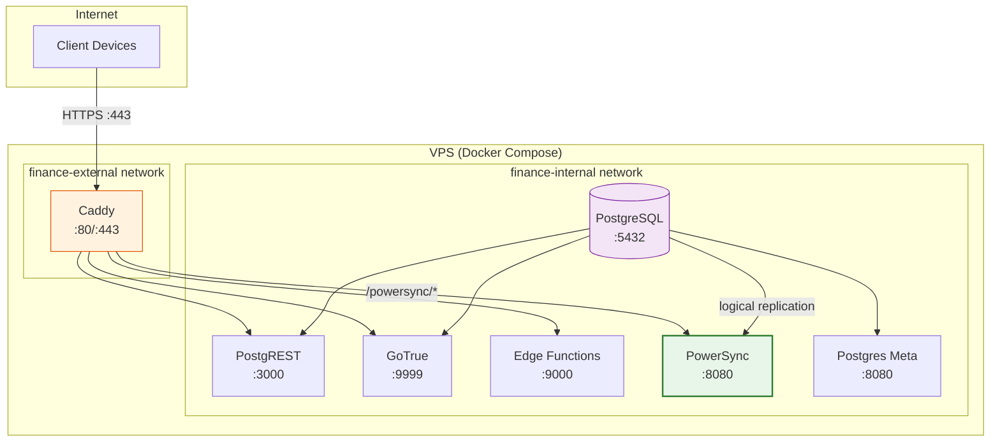

# Implementation Guide: PowerSync Docker Compose

**Issue:** #881
**Sprint:** 2 — Deployment Infrastructure
**Status:** Planned
**Dependencies:** Existing `deploy/docker-compose.yml`, PostgreSQL with WAL level=logical (#268)
**Estimated effort:** 2–3 days

---

## 1. Overview

Add the self-hosted PowerSync service to the production Docker Compose stack in `deploy/docker-compose.yml`. PowerSync connects to PostgreSQL via logical replication and provides real-time sync to clients via WebSocket. This completes the self-hosted backend stack defined in [ADR-0007](../0007-hosting-strategy.md).

### Design Principles

1. **Single `docker compose up`** — The entire backend (PostgreSQL, PostgREST, GoTrue, Edge Functions, PowerSync, Caddy) starts with one command.
2. **Internal networking** — PowerSync connects to PostgreSQL on the internal Docker network. Only Caddy exposes ports to the internet.
3. **Health checks everywhere** — PowerSync has a health check, and Caddy depends on it before routing traffic.
4. **Resource-constrained** — Memory and CPU limits prevent any single service from starving others on a 2 vCPU / 4 GB RAM VPS.

---

## 2. Architecture



### Key Points

- PowerSync reads from PostgreSQL via **logical replication** (requires `wal_level=logical`, already configured in existing compose file).
- PowerSync has its own **JWT verification** — it validates the same JWTs issued by GoTrue, using the shared `JWT_SECRET`.
- Client WebSocket connections to PowerSync are proxied through Caddy for TLS termination.

---

## 3. Docker Compose Addition

Add the following service to `deploy/docker-compose.yml`:

```yaml
# ---------------------------------------------------------------------------
# PowerSync — offline-first sync engine
# Connects to PostgreSQL via logical replication and serves real-time
# sync to clients via WebSocket.
# Issue: #881
# ---------------------------------------------------------------------------
powersync:
  image: journeyapps/powersync-service:latest
  restart: unless-stopped
  environment:
    # PowerSync configuration via environment variables
    # See: https://docs.powersync.com/self-hosting/configuration
    POWERSYNC_CONFIG: |
      replication:
        type: postgresql
        uri: postgres://${POSTGRES_USER:-postgres}:${POSTGRES_PASSWORD}@db:5432/${POSTGRES_DB:-postgres}

      storage:
        type: mongodb
        uri: ${POWERSYNC_MONGO_URI:-mongodb://mongo:27017/powersync}

      # JWT auth — validates the same tokens issued by GoTrue
      client_auth:
        supabase: true
        supabase_jwt_secret: ${JWT_SECRET}

      # Port for the PowerSync HTTP/WebSocket API
      port: 8080

      # Sync rules loaded from file
      sync_rules:
        path: /sync-rules.yaml

      # Telemetry (opt-out for privacy)
      telemetry:
        disable_telemetry: true
  volumes:
    - ../services/api/powersync/sync-rules.yaml:/sync-rules.yaml:ro
  healthcheck:
    test: ['CMD-SHELL', 'curl -sf http://localhost:8080/api/status || exit 1']
    interval: 15s
    timeout: 5s
    retries: 5
    start_period: 30s
  depends_on:
    db:
      condition: service_healthy
    mongo:
      condition: service_healthy
  deploy:
    resources:
      limits:
        cpus: '0.5'
        memory: 512M
      reservations:
        cpus: '0.1'
        memory: 128M
  networks:
    - finance-internal

# ---------------------------------------------------------------------------
# MongoDB — required by PowerSync for bucket storage
# PowerSync uses MongoDB internally to store sync bucket state.
# This is NOT used by application code — only by PowerSync.
# Issue: #881
# ---------------------------------------------------------------------------
mongo:
  image: mongo:7
  restart: unless-stopped
  volumes:
    - mongodata:/data/db
  environment:
    # No auth for internal-only service (not exposed externally)
    MONGO_INITDB_DATABASE: powersync
  healthcheck:
    test: ['CMD', 'mongosh', '--eval', "db.adminCommand('ping')"]
    interval: 10s
    timeout: 5s
    retries: 10
    start_period: 15s
  deploy:
    resources:
      limits:
        cpus: '0.5'
        memory: 512M
      reservations:
        cpus: '0.1'
        memory: 128M
  networks:
    - finance-internal
```

### 3.1 Volume Addition

Add to the `volumes` section:

```yaml
volumes:
  pgdata:
    driver: local
  caddy_data:
    driver: local
  caddy_config:
    driver: local
  mongodata: # NEW — PowerSync bucket storage
    driver: local
```

### 3.2 Caddy Route Addition

Add to `deploy/Caddyfile` before the default handler:

```caddyfile
	# -------------------------------------------------------------------------
	# PowerSync — offline-first sync engine (WebSocket + HTTP)
	# -------------------------------------------------------------------------
	handle_path /powersync/* {
		reverse_proxy powersync:8080 {
			header_up X-Forwarded-Proto {scheme}
			header_up X-Real-IP {remote_host}
			# WebSocket support
			header_up Connection {>Connection}
			header_up Upgrade {>Upgrade}
		}
	}
```

### 3.3 Environment Variables Addition

Add to `deploy/.env.example`:

```bash
# ---------------------------------------------------------------------------
# PowerSync
# ---------------------------------------------------------------------------
# MongoDB URI for PowerSync bucket storage (internal Docker network)
POWERSYNC_MONGO_URI=mongodb://mongo:27017/powersync
```

### 3.4 Update Caddy Health Check Dependencies

Update the Caddy service's `depends_on` to include PowerSync:

```yaml
caddy:
  # ... existing config ...
  depends_on:
    rest:
      condition: service_healthy
    auth:
      condition: service_healthy
    edge-functions:
      condition: service_healthy
    powersync: # NEW
      condition: service_healthy
```

---

## 4. PostgreSQL Replication Configuration

The existing PostgreSQL configuration in `deploy/docker-compose.yml` already sets `wal_level=logical` and `max_replication_slots=10`, which is correct for PowerSync. Verify these are present:

```yaml
command: >
  postgres
  -c wal_level=logical                 # ✅ Required for PowerSync
  -c max_wal_senders=10                # ✅ Sufficient
  -c max_replication_slots=10          # ✅ Sufficient
```

### 4.1 Create Replication Role (Migration)

PowerSync needs a PostgreSQL role with replication privileges. Add a migration:

**File:** `services/api/supabase/migrations/YYYYMMDDHHMMSS_powersync_replication.sql`

```sql
-- Create a dedicated role for PowerSync logical replication.
-- This role has minimal privileges: replication + read-only on synced tables.
-- Issue: #881

DO $$
BEGIN
    IF NOT EXISTS (SELECT FROM pg_catalog.pg_roles WHERE rolname = 'powersync_role') THEN
        CREATE ROLE powersync_role WITH LOGIN REPLICATION PASSWORD current_setting('app.powersync_password');
    END IF;
END $$;

-- Grant read access to all tables that appear in sync-rules.yaml
GRANT USAGE ON SCHEMA public TO powersync_role;
GRANT SELECT ON ALL TABLES IN SCHEMA public TO powersync_role;

-- Ensure future tables are also readable
ALTER DEFAULT PRIVILEGES IN SCHEMA public GRANT SELECT ON TABLES TO powersync_role;

-- Grant access to the replication slot
-- PowerSync creates its own replication slot on first connection.

COMMENT ON ROLE powersync_role IS 'Read-only replication role for PowerSync sync engine. Issue: #881';
```

---

## 5. Resource Budget

With PowerSync and MongoDB added, the total resource allocation for a 2 vCPU / 4 GB RAM VPS:

| Service        | CPU Limit | Memory Limit | Memory Reserved |
| -------------- | --------- | ------------ | --------------- |
| PostgreSQL     | 1.0       | 512 MB       | 256 MB          |
| PostgREST      | 0.5       | 256 MB       | 64 MB           |
| GoTrue         | 0.5       | 256 MB       | 64 MB           |
| Postgres Meta  | 0.25      | 128 MB       | 32 MB           |
| Edge Functions | 0.5       | 256 MB       | 64 MB           |
| **PowerSync**  | **0.5**   | **512 MB**   | **128 MB**      |
| **MongoDB**    | **0.5**   | **512 MB**   | **128 MB**      |
| Caddy          | 0.25      | 128 MB       | 32 MB           |
| **Total**      | **4.0**   | **2,560 MB** | **768 MB**      |

This fits comfortably within 4 GB RAM (2.5 GB limits, 768 MB reserved). CPU limits sum to 4.0 which is over the 2 vCPU count, but Docker CPU limits are soft — they represent maximum burst, not dedicated allocation. Under normal load, total CPU usage will be well under 1.0 vCPU.

> **Note:** If memory is tight, consider upgrading to a 4 vCPU / 8 GB RAM instance (~$15/mo on Hetzner). The cost is still well within the $10–20/mo budget from ADR-0007 depending on provider.

---

## 6. Testing & Verification

### 6.1 Local Verification

```bash
# Start the full stack
cd deploy
docker compose up -d

# Wait for all services to be healthy
docker compose ps  # All should show "healthy"

# Check PowerSync specifically
docker compose logs powersync --tail 50

# Verify PowerSync can reach PostgreSQL
curl -s http://localhost:8080/api/status | jq .

# Expected: {"status": "ok", "replication": {"connected": true}}
```

### 6.2 Sync Round-Trip Test

```bash
# 1. Insert a test record via PostgREST
curl -X POST http://localhost:3000/categories \
  -H "Authorization: Bearer $JWT_TOKEN" \
  -H "Content-Type: application/json" \
  -d '{"name": "Test Category", "household_id": "...", "icon": "🧪"}'

# 2. Connect a PowerSync client and verify the record syncs within 2 seconds

# 3. Delete the test record
curl -X PATCH http://localhost:3000/categories?id=eq.$ID \
  -H "Authorization: Bearer $JWT_TOKEN" \
  -d '{"deleted_at": "now()"}'

# 4. Verify the record disappears from the client's local database
```

### 6.3 Verification Checklist

- [ ] `docker compose up -d` starts all services including PowerSync and MongoDB
- [ ] `docker compose ps` shows PowerSync as "healthy"
- [ ] PowerSync status endpoint reports replication connected
- [ ] PowerSync logs show sync rules loaded successfully
- [ ] Caddy routes `/powersync/*` requests to the PowerSync service
- [ ] WebSocket connections through Caddy work (test with a PowerSync client SDK)
- [ ] Data inserted into PostgreSQL appears on clients within 2 seconds
- [ ] PowerSync uses the dedicated `powersync_role` for replication
- [ ] MongoDB is not exposed externally (only on `finance-internal` network)
- [ ] Total memory usage stays under 3 GB under normal load
- [ ] `docker compose down && docker compose up -d` restarts cleanly (data persisted in volumes)

---

## 7. Rollback Plan

1. **Remove the PowerSync and MongoDB services** from `docker-compose.yml`.
2. **Remove the Caddy route** for `/powersync/*`.
3. **Remove the `mongodata` volume** definition.
4. Clients will fail to sync but continue working offline (edge-first design).
5. The PostgreSQL replication role can be dropped: `DROP ROLE IF EXISTS powersync_role;`

---

## 8. Operational Notes

### 8.1 Sync Rules Updates

When `sync-rules.yaml` changes:

```bash
# Restart PowerSync to reload sync rules
docker compose restart powersync

# Verify rules loaded
docker compose logs powersync --tail 20 | grep "sync rules"
```

### 8.2 MongoDB Maintenance

MongoDB stores PowerSync's internal bucket state. It does NOT contain application data (that's in PostgreSQL). For backup purposes:

- **PostgreSQL backups** are critical (contain all application data).
- **MongoDB backups** are optional — PowerSync can rebuild its bucket state from PostgreSQL's WAL. However, this triggers a full re-sync for all clients, so backing up MongoDB reduces recovery time.

### 8.3 Monitoring

Add to Uptime Kuma (see #887):

- **PowerSync Health:** `GET https://{DOMAIN}/powersync/api/status` — expect `200` with `"status": "ok"`
- **PowerSync Replication:** Check the `replication.connected` field in the status response
