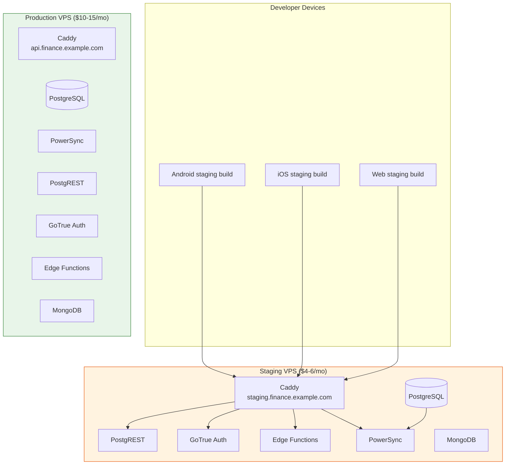

# Implementation Guide: Staging Environment on VPS

**Issue:** #883
**Sprint:** 2 — Deployment Infrastructure
**Status:** Planned
**Dependencies:** #881 (PowerSync Docker Compose), #891 (Per-platform env builds), deploy/docker-compose.yml
**Estimated effort:** 3–5 days

---

## 1. Overview

Deploy a staging environment on a separate VPS (or isolated Docker Compose project on the same VPS) that mirrors production. Staging allows testing deployments, migrations, and sync behavior before production rollout. The staging environment uses the same Docker Compose stack with different credentials and a separate domain.

### Design Principles

1. **Production parity** — Same Docker images, same configuration structure, same Caddy TLS setup. Only URLs and credentials differ.
2. **Complete isolation** — Separate database, separate PowerSync instance, separate auth tokens. No data leakage between staging and production.
3. **Cost efficient** — Run staging on the smallest viable VPS ($4–6/mo) since it only needs to handle developer testing traffic.
4. **Disposable** — Staging data can be wiped and re-seeded at any time without consequence.

---

## 2. Architecture



### Deployment Options

| Option                                | Description                      | Cost          | Isolation       | Recommendation                        |
| ------------------------------------- | -------------------------------- | ------------- | --------------- | ------------------------------------- |
| **A. Separate VPS**                   | Dedicated staging VPS            | $4–6/mo extra | Complete        | ✅ Recommended                        |
| B. Same VPS, separate compose project | Two compose stacks on one VPS    | $0 extra      | Process-level   | Acceptable if cost-constrained        |
| C. Same VPS, Docker namespaces        | Isolated containers sharing host | $0 extra      | Container-level | Not recommended (resource contention) |

**Recommendation: Option A (Separate VPS).** A Hetzner CX22 (2 vCPU, 4 GB RAM, €4.51/mo) provides full isolation and prevents staging load from affecting production.

---

## 3. VPS Setup

### 3.1 Server Provisioning

```bash
# 1. Provision VPS (Hetzner CX22 recommended)
#    - Ubuntu 24.04 LTS
#    - 2 vCPU / 4 GB RAM / 40 GB disk
#    - Datacenter: same region as production for consistency

# 2. Initial hardening (run as root)
apt update && apt upgrade -y

# SSH key-only auth (disable password auth)
sed -i 's/^#*PasswordAuthentication yes/PasswordAuthentication no/' /etc/ssh/sshd_config
sed -i 's/^#*PermitRootLogin yes/PermitRootLogin no/' /etc/ssh/sshd_config
systemctl restart sshd

# Create deploy user
adduser --disabled-password deploy
usermod -aG sudo docker deploy
mkdir -p /home/deploy/.ssh
cp ~/.ssh/authorized_keys /home/deploy/.ssh/
chown -R deploy:deploy /home/deploy/.ssh

# Firewall
ufw default deny incoming
ufw default allow outgoing
ufw allow 22/tcp    # SSH
ufw allow 80/tcp    # HTTP (Caddy redirect)
ufw allow 443/tcp   # HTTPS
ufw allow 443/udp   # HTTP/3 (QUIC)
ufw enable

# Automatic security updates
apt install -y unattended-upgrades
dpkg-reconfigure -plow unattended-upgrades

# Install Docker
curl -fsSL https://get.docker.com | sh
```

### 3.2 DNS Configuration

```
# A records (replace with actual staging VPS IP)
staging.finance.example.com    A    STAGING_VPS_IP
staging.finance.example.com    AAAA STAGING_VPS_IPV6  (if available)
```

### 3.3 Directory Structure on Staging VPS

```
/home/deploy/finance-staging/
├── docker-compose.yml        # Identical to deploy/docker-compose.yml
├── Caddyfile                 # Same structure, staging domain
├── .env                      # Staging-specific credentials
└── volumes/
    └── db/
        └── backups/          # Staging backups (optional)
```

---

## 4. Staging Configuration

### 4.1 Staging `.env`

Create from `deploy/.env.example` with staging-specific values:

```bash
# =============================================================================
# Finance App — Staging Environment
# =============================================================================
# This is a TEMPLATE. Replace all YOUR_* values with actual staging credentials.
# Generate secrets: openssl rand -base64 32

# Domain & TLS
DOMAIN=staging.finance.example.com
TLS_EMAIL=YOUR_EMAIL_HERE

# PostgreSQL (DIFFERENT from production!)
POSTGRES_PASSWORD=YOUR_STAGING_DB_PASSWORD_HERE
POSTGRES_DB=postgres
POSTGRES_USER=postgres
POSTGRES_PORT=5432

# JWT (DIFFERENT from production! Generate a new one.)
JWT_SECRET=YOUR_STAGING_JWT_SECRET_HERE

# Supabase keys (generated from staging JWT_SECRET)
ANON_KEY=YOUR_STAGING_ANON_KEY_HERE
SERVICE_ROLE_KEY=YOUR_STAGING_SERVICE_ROLE_KEY_HERE

# Auth
SITE_URL=https://staging.finance.example.com
AUTH_REDIRECT_URLS=https://staging.finance.example.com/auth/callback,com.finance.app.staging://auth/callback
JWT_EXPIRY=3600
MAILER_AUTOCONFIRM=true  # Auto-confirm for easier staging testing

# SMTP (use a test SMTP like Mailtrap for staging)
SMTP_HOST=sandbox.smtp.mailtrap.io
SMTP_PORT=587
SMTP_USER=YOUR_MAILTRAP_USER_HERE
SMTP_PASS=YOUR_MAILTRAP_PASS_HERE
SMTP_ADMIN_EMAIL=noreply@staging.finance.example.com
SMTP_SENDER_NAME=Finance Staging

# OAuth (optional for staging)
APPLE_AUTH_ENABLED=false
GOOGLE_AUTH_ENABLED=false

# WebAuthn / Passkeys
WEBAUTHN_RP_NAME=Finance Staging
WEBAUTHN_RP_ID=staging.finance.example.com
WEBAUTHN_ORIGIN=https://staging.finance.example.com

# Edge Functions
AUTH_WEBHOOK_SECRET=YOUR_STAGING_WEBHOOK_SECRET_HERE
CRON_SECRET=YOUR_STAGING_CRON_SECRET_HERE
ALLOWED_ORIGINS=https://staging.finance.example.com

# PowerSync
POWERSYNC_MONGO_URI=mongodb://mongo:27017/powersync

# Backups (shorter retention for staging)
BACKUP_RETENTION_DAYS=7
```

### 4.2 Staging Caddyfile

Identical to `deploy/Caddyfile` — the `{$DOMAIN}` variable automatically uses the staging domain from `.env`.

### 4.3 Staging Seed Data

Create a staging-specific seed script that populates test data:

**File:** `deploy/staging-seed.sql`

```sql
-- Staging seed data — test accounts and transactions for development testing.
-- NEVER run this on production.
-- Issue: #883

-- Test user (auto-confirmed since MAILER_AUTOCONFIRM=true)
-- Created via GoTrue API, then seed household data:

-- This script runs after migrations are applied.
-- It creates sample data for a test household.

DO $$
DECLARE
    test_household_id UUID := gen_random_uuid();
BEGIN
    -- Create test household
    INSERT INTO households (id, name, created_by, created_at, updated_at)
    VALUES (test_household_id, 'Test Household', '00000000-0000-0000-0000-000000000001', now(), now())
    ON CONFLICT DO NOTHING;

    -- Create test categories
    INSERT INTO categories (id, household_id, name, icon, is_income, sort_order, created_at, updated_at)
    VALUES
        (gen_random_uuid(), test_household_id, 'Groceries', '🛒', false, 1, now(), now()),
        (gen_random_uuid(), test_household_id, 'Salary', '💰', true, 1, now(), now()),
        (gen_random_uuid(), test_household_id, 'Transport', '🚗', false, 2, now(), now()),
        (gen_random_uuid(), test_household_id, 'Entertainment', '🎬', false, 3, now(), now())
    ON CONFLICT DO NOTHING;

    RAISE NOTICE 'Staging seed data created for household: %', test_household_id;
END $$;
```

---

## 5. Deployment Workflow

### 5.1 Initial Deployment

```bash
# On the staging VPS as the deploy user
ssh deploy@staging.finance.example.com

# Clone the repository (or copy deploy/ directory)
git clone --depth 1 https://github.com/jrmoulckers/finance.git ~/finance-repo
cp -r ~/finance-repo/deploy ~/finance-staging

# Configure environment
cd ~/finance-staging
cp .env.example .env
# Edit .env with staging values (use the template from section 4.1)
nano .env

# Start the stack
docker compose up -d

# Wait for healthy
docker compose ps

# Apply migrations
docker compose exec db psql -U postgres -f /path/to/migrations.sql

# Apply staging seed data (optional)
docker compose exec -T db psql -U postgres < staging-seed.sql
```

### 5.2 Update Deployment Script

**File:** `deploy/scripts/deploy-staging.sh`

```bash
#!/usr/bin/env bash
# Deploy the latest changes to the staging environment.
# Run from local machine. Requires SSH access to staging VPS.
#
# Usage: ./deploy/scripts/deploy-staging.sh
# Issue: #883

set -euo pipefail

STAGING_HOST="${STAGING_HOST:-deploy@staging.finance.example.com}"
STAGING_DIR="${STAGING_DIR:-/home/deploy/finance-staging}"

echo "=== Deploying to staging: $STAGING_HOST ==="

# 1. Copy updated files to staging
echo "→ Syncing deploy configuration..."
rsync -avz --exclude '.env' --exclude 'volumes/' \
    deploy/ "$STAGING_HOST:$STAGING_DIR/"

# 2. Copy sync rules
echo "→ Syncing PowerSync rules..."
rsync -avz services/api/powersync/sync-rules.yaml \
    "$STAGING_HOST:$STAGING_DIR/../services/api/powersync/sync-rules.yaml"

# 3. Copy edge functions
echo "→ Syncing Edge Functions..."
rsync -avz services/api/supabase/functions/ \
    "$STAGING_HOST:$STAGING_DIR/../services/api/supabase/functions/"

# 4. Pull latest images and restart
echo "→ Pulling latest Docker images..."
ssh "$STAGING_HOST" "cd $STAGING_DIR && docker compose pull"

echo "→ Restarting services..."
ssh "$STAGING_HOST" "cd $STAGING_DIR && docker compose up -d"

# 5. Wait for health
echo "→ Waiting for services to be healthy..."
ssh "$STAGING_HOST" "cd $STAGING_DIR && docker compose ps"

echo "=== Staging deployment complete ==="
echo "→ https://staging.finance.example.com/health"
```

---

## 6. Staging vs Production Differences

| Aspect           | Staging                       | Production                               |
| ---------------- | ----------------------------- | ---------------------------------------- |
| Domain           | `staging.finance.example.com` | `api.finance.example.com`                |
| VPS size         | 2 vCPU / 4 GB (CX22)          | 2 vCPU / 4 GB+ (CX22+)                   |
| VPS cost         | ~$4.50/mo                     | ~$10–15/mo                               |
| JWT secret       | Unique staging secret         | Unique production secret                 |
| Email            | Mailtrap (test inbox)         | Real SMTP provider                       |
| Auto-confirm     | `true`                        | `false`                                  |
| Backup retention | 7 days                        | 30 days (7 daily + 4 weekly + 3 monthly) |
| Seed data        | Test data pre-loaded          | Empty (real user data)                   |
| OAuth providers  | Disabled                      | Enabled (Apple, Google)                  |
| Monitoring       | Basic health checks           | Full Uptime Kuma + alerting              |

---

## 7. Testing & Verification

### 7.1 Smoke Tests

After deployment, run these checks:

```bash
# Health check
curl -sf https://staging.finance.example.com/health | jq .
# Expected: {"status": "healthy", "services": {...}}

# PostgREST
curl -sf https://staging.finance.example.com/rest/ | jq .
# Expected: OpenAPI schema

# GoTrue
curl -sf https://staging.finance.example.com/auth/health | jq .
# Expected: health response

# PowerSync
curl -sf https://staging.finance.example.com/powersync/api/status | jq .
# Expected: {"status": "ok", "replication": {"connected": true}}

# TLS certificate
echo | openssl s_client -servername staging.finance.example.com \
    -connect staging.finance.example.com:443 2>/dev/null | \
    openssl x509 -noout -dates
# Expected: valid Let's Encrypt certificate
```

### 7.2 End-to-End Sync Test

1. Register a test user via the staging auth endpoint.
2. Connect a client app (staging build) to the staging PowerSync instance.
3. Create a transaction via the REST API.
4. Verify the transaction appears on the client within 2 seconds.
5. Create a transaction on the client.
6. Verify it appears in the staging PostgreSQL database.

### 7.3 Verification Checklist

- [ ] Staging VPS provisioned and hardened (SSH key-only, firewall, unattended-upgrades)
- [ ] DNS `staging.finance.example.com` resolves to staging VPS IP
- [ ] `docker compose up -d` starts all services on staging
- [ ] All services report healthy via `docker compose ps`
- [ ] TLS certificate issued by Let's Encrypt for staging domain
- [ ] Health check endpoint returns 200
- [ ] PostgREST, GoTrue, Edge Functions, PowerSync all reachable via Caddy
- [ ] PowerSync replication connected to staging PostgreSQL
- [ ] End-to-end sync test passes (server → client and client → server)
- [ ] Staging credentials are completely separate from production
- [ ] Staging app builds (per #891) connect to staging endpoints
- [ ] `deploy-staging.sh` script deploys successfully

---

## 8. Rollback Plan

Staging is disposable. If something goes wrong:

```bash
# Nuclear option: wipe everything and start fresh
ssh deploy@staging.finance.example.com
cd ~/finance-staging
docker compose down -v    # Remove all containers AND volumes
docker compose up -d      # Start fresh
# Re-apply migrations and seed data
```

---

## 9. Cost Summary

| Item                                   | Monthly Cost |
| -------------------------------------- | ------------ |
| Hetzner CX22 (2 vCPU / 4 GB)           | ~€4.51       |
| Staging domain (subdomain of existing) | $0           |
| Mailtrap (free tier: 500 emails/mo)    | $0           |
| **Total staging cost**                 | **~$5/mo**   |

This brings total infrastructure cost to ~$15–20/mo (production + staging), well within the ADR-0007 budget.
