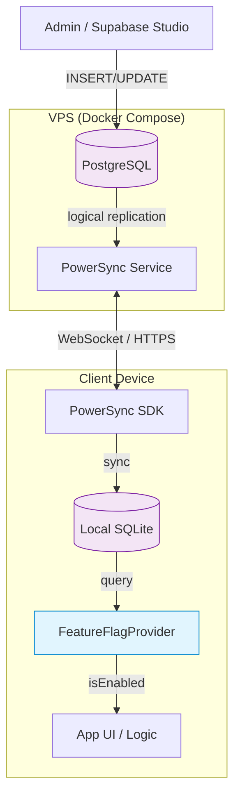

# Implementation Guide: Feature Flag System

**Issue:** #885
**Sprint:** 1 — Application Configuration
**Status:** Planned
**Dependencies:** PostgreSQL (existing), PowerSync sync rules (existing), KMP core package
**Estimated effort:** 3–5 days

---

## 1. Overview

A feature flag system that stores flags in PostgreSQL and syncs them to clients via PowerSync, enabling gradual rollouts, A/B testing, and kill switches without app store releases. Follows the edge-first principle: flags sync to the local SQLite database so evaluation happens entirely on-device with zero network latency.

### Design Principles

1. **Edge-first** — Flags are evaluated locally from the synced SQLite database. No network call at flag-check time.
2. **Privacy-first** — No user behavior tracking in flags. Flag state is boolean/config, never analytics.
3. **Minimal backend** — PostgreSQL table + PowerSync sync. No feature flag SaaS.
4. **Graceful defaults** — Every flag has a hardcoded default. If sync has never completed, the app still works.

---

## 2. Architecture



### Data Flow

1. **Admin** inserts or updates a row in `feature_flags` via Supabase Studio, a migration, or a protected Edge Function.
2. **PostgreSQL** logical replication streams the change to **PowerSync**.
3. **PowerSync** syncs the flag to the client's **local SQLite** via the `global_config` bucket.
4. **FeatureFlagProvider** (KMP shared code) queries the local database. All evaluations are synchronous, zero-latency reads.
5. **App code** calls `featureFlags.isEnabled("new_budget_ui")` — works offline, works instantly.

---

## 3. Database Schema

### 3.1 Migration: Create `feature_flags` Table

**File:** `services/api/supabase/migrations/YYYYMMDDHHMMSS_create_feature_flags.sql`

```sql
-- Feature flag system for gradual rollouts and kill switches.
-- Flags are synced to all clients via PowerSync and evaluated locally.
-- Issue: #885

CREATE TABLE IF NOT EXISTS public.feature_flags (
    id          UUID PRIMARY KEY DEFAULT gen_random_uuid(),
    key         TEXT NOT NULL UNIQUE,       -- e.g. 'new_budget_ui', 'csv_import_v2'
    enabled     BOOLEAN NOT NULL DEFAULT false,
    description TEXT,                       -- Human-readable description for admin UI
    metadata    JSONB DEFAULT '{}'::jsonb,  -- Optional: rollout %, platform filter, etc.
    created_at  TIMESTAMPTZ NOT NULL DEFAULT now(),
    updated_at  TIMESTAMPTZ NOT NULL DEFAULT now(),
    deleted_at  TIMESTAMPTZ                 -- Soft delete (standard convention)
);

-- Index for PowerSync sync queries (filter on deleted_at)
CREATE INDEX idx_feature_flags_active ON public.feature_flags (deleted_at)
    WHERE deleted_at IS NULL;

-- Updated-at trigger (reuses existing function if available)
CREATE OR REPLACE FUNCTION public.set_updated_at()
RETURNS TRIGGER AS $$
BEGIN
    NEW.updated_at = now();
    RETURN NEW;
END;
$$ LANGUAGE plpgsql;

CREATE TRIGGER feature_flags_updated_at
    BEFORE UPDATE ON public.feature_flags
    FOR EACH ROW
    EXECUTE FUNCTION public.set_updated_at();

-- RLS: Feature flags are read-only for authenticated users, writable only by service_role.
ALTER TABLE public.feature_flags ENABLE ROW LEVEL SECURITY;

CREATE POLICY "Feature flags are readable by authenticated users"
    ON public.feature_flags
    FOR SELECT
    TO authenticated
    USING (deleted_at IS NULL);

CREATE POLICY "Feature flags are manageable by service role"
    ON public.feature_flags
    FOR ALL
    TO service_role
    USING (true)
    WITH CHECK (true);

-- Seed default flags (all disabled by default — safe for production)
INSERT INTO public.feature_flags (key, enabled, description) VALUES
    ('new_budget_ui',       false, 'Redesigned budget management interface'),
    ('csv_import_v2',       false, 'CSV import with column mapping'),
    ('household_invites',   false, 'Household invitation flow'),
    ('recurring_templates', false, 'Recurring transaction templates'),
    ('dark_mode',           true,  'Dark mode support (enabled by default)'),
    ('export_pdf',          false, 'PDF export for transaction reports')
ON CONFLICT (key) DO NOTHING;
```

### 3.2 Metadata Schema (Optional Targeting)

The `metadata` JSONB column supports optional targeting without adding complexity to the base system:

```jsonc
{
  // Platform targeting: only enable on specific platforms
  "platforms": ["ios", "android"],

  // Minimum app version required
  "min_version": "1.2.0",

  // Percentage rollout (client evaluates deterministically based on user_id hash)
  "rollout_pct": 25,

  // Expiry date: flag auto-disables after this date (client-side check)
  "expires_at": "2026-09-01T00:00:00Z",
}
```

---

## 4. PowerSync Sync Rules Update

### 4.1 New Bucket: `global_config`

Feature flags are not household-scoped or user-scoped — they apply globally to all authenticated users. Add a new bucket to `services/api/powersync/sync-rules.yaml`:

```yaml
# -------------------------------------------------------------------------
# global_config — application-wide configuration synced to all clients.
# Contains feature flags and other non-user-scoped settings.
# Issue: #885
# -------------------------------------------------------------------------
global_config:
  # No parameters — every authenticated client receives the same data.
  # PowerSync creates a single bucket instance shared by all users.
  parameters:
    - SELECT 'global' AS config_scope

  data:
    # Feature flags — synced to all clients for local evaluation
    - >
      SELECT id, key, enabled, metadata,
             created_at, updated_at, deleted_at
      FROM feature_flags
      WHERE deleted_at IS NULL
```

### 4.2 Why a New Bucket?

- Feature flags are **not** scoped to a household or user — they apply globally.
- Putting them in `by_household` would require every flag row to have a `household_id`, which is semantically wrong.
- Putting them in `user_profile` would require a `user_id` column, also wrong.
- A dedicated `global_config` bucket cleanly separates concerns and can later hold other global configuration (e.g., exchange rates, app announcements).

---

## 5. KMP Shared Code

### 5.1 FeatureFlag Data Class

**File:** `packages/core/src/commonMain/kotlin/com/finance/core/featureflags/FeatureFlag.kt`

```kotlin
package com.finance.core.featureflags

import kotlinx.datetime.Instant
import kotlinx.serialization.Serializable
import kotlinx.serialization.json.JsonObject

/**
 * Represents a feature flag synced from the server.
 * Evaluated locally — no network calls at check time.
 */
@Serializable
data class FeatureFlag(
    val id: String,
    val key: String,
    val enabled: Boolean,
    val metadata: JsonObject? = null,
    val createdAt: Instant,
    val updatedAt: Instant,
)
```

### 5.2 FeatureFlagProvider Interface

**File:** `packages/core/src/commonMain/kotlin/com/finance/core/featureflags/FeatureFlagProvider.kt`

```kotlin
package com.finance.core.featureflags

import kotlinx.coroutines.flow.Flow

/**
 * Provides feature flag evaluation from the local database.
 *
 * All reads are local (SQLite). No network calls. If the database
 * is empty (first launch, never synced), hardcoded defaults apply.
 */
interface FeatureFlagProvider {

    /**
     * Check if a flag is enabled. Returns the hardcoded default
     * if the flag is not found in the local database.
     */
    fun isEnabled(key: String): Boolean

    /**
     * Observe a flag reactively. Emits whenever the flag's state
     * changes (e.g., after a sync updates the local database).
     */
    fun observeFlag(key: String): Flow<Boolean>

    /**
     * Get the full flag object including metadata, or null if not found.
     */
    fun getFlag(key: String): FeatureFlag?

    /**
     * Get all flags. Useful for a debug/admin screen.
     */
    fun getAllFlags(): List<FeatureFlag>
}
```

### 5.3 Hardcoded Defaults Registry

**File:** `packages/core/src/commonMain/kotlin/com/finance/core/featureflags/FeatureFlagDefaults.kt`

```kotlin
package com.finance.core.featureflags

/**
 * Hardcoded default values for all feature flags.
 *
 * These defaults are used when:
 * - The app has never synced (first launch offline)
 * - A flag key exists in code but not yet in the database
 * - The local database is corrupted or cleared
 *
 * IMPORTANT: Every flag checked in code MUST have a default here.
 * Adding a flag to the database without a default is allowed
 * (it will default to false), but the reverse is not safe.
 */
object FeatureFlagDefaults {

    private val defaults: Map<String, Boolean> = mapOf(
        "new_budget_ui" to false,
        "csv_import_v2" to false,
        "household_invites" to false,
        "recurring_templates" to false,
        "dark_mode" to true,
        "export_pdf" to false,
    )

    /** Get the default value for a flag key. Returns false if unknown. */
    fun defaultFor(key: String): Boolean = defaults[key] ?: false

    /** All known flag keys. Useful for validation and testing. */
    val allKeys: Set<String> = defaults.keys
}
```

### 5.4 SQLite-Backed Implementation

**File:** `packages/core/src/commonMain/kotlin/com/finance/core/featureflags/SqlFeatureFlagProvider.kt`

```kotlin
package com.finance.core.featureflags

import kotlinx.coroutines.flow.Flow
import kotlinx.coroutines.flow.map
import kotlinx.serialization.json.Json
import kotlinx.serialization.json.JsonObject
import kotlinx.serialization.json.jsonPrimitive
import kotlinx.serialization.json.intOrNull

/**
 * Feature flag provider backed by the local SQLite database
 * (populated via PowerSync sync).
 *
 * Constructor takes a [FeatureFlagDao] (SQLDelight-generated or manual)
 * that provides raw database access.
 */
class SqlFeatureFlagProvider(
    private val dao: FeatureFlagDao,
    private val platform: String,    // "ios", "android", "web", "windows"
    private val appVersion: String,  // e.g. "1.2.0"
    private val userId: String?,     // For deterministic rollout percentage
) : FeatureFlagProvider {

    override fun isEnabled(key: String): Boolean {
        val flag = dao.findByKey(key) ?: return FeatureFlagDefaults.defaultFor(key)
        return evaluateFlag(flag)
    }

    override fun observeFlag(key: String): Flow<Boolean> {
        return dao.observeByKey(key).map { flag ->
            if (flag == null) FeatureFlagDefaults.defaultFor(key)
            else evaluateFlag(flag)
        }
    }

    override fun getFlag(key: String): FeatureFlag? = dao.findByKey(key)

    override fun getAllFlags(): List<FeatureFlag> = dao.findAll()

    /**
     * Evaluate a flag considering metadata targeting rules.
     * If metadata is null or empty, just return [FeatureFlag.enabled].
     */
    private fun evaluateFlag(flag: FeatureFlag): Boolean {
        if (!flag.enabled) return false

        val meta = flag.metadata ?: return true

        // Platform targeting
        val platforms = meta["platforms"]
        if (platforms != null) {
            val allowed = platforms.toString() // Simple check
            if (platform !in allowed) return false
        }

        // Rollout percentage (deterministic hash based on userId + flag key)
        val rolloutPct = meta["rollout_pct"]?.jsonPrimitive?.intOrNull
        if (rolloutPct != null && userId != null) {
            val hash = "$userId:${flag.key}".hashCode().toUInt()
            val bucket = (hash % 100u).toInt()
            if (bucket >= rolloutPct) return false
        }

        return true
    }
}
```

### 5.5 DAO Interface

**File:** `packages/core/src/commonMain/kotlin/com/finance/core/featureflags/FeatureFlagDao.kt`

```kotlin
package com.finance.core.featureflags

import kotlinx.coroutines.flow.Flow

/**
 * Data access interface for feature flags.
 * Implemented per-platform using SQLDelight or PowerSync SDK queries.
 */
interface FeatureFlagDao {
    fun findByKey(key: String): FeatureFlag?
    fun findAll(): List<FeatureFlag>
    fun observeByKey(key: String): Flow<FeatureFlag?>
}
```

---

## 6. Platform Integration Pattern

Each platform implements `FeatureFlagDao` using its local database access layer.

### 6.1 Usage in App Code

```kotlin
// In a ViewModel or UseCase
class BudgetListViewModel(
    private val featureFlags: FeatureFlagProvider,
    // ... other dependencies
) {
    val useNewBudgetUi: Boolean
        get() = featureFlags.isEnabled("new_budget_ui")

    // Reactive observation for Compose / SwiftUI
    val newBudgetUiEnabled: Flow<Boolean> =
        featureFlags.observeFlag("new_budget_ui")
}
```

### 6.2 Flag Management (Admin)

Flags are managed via:

1. **Database migrations** — Add new flags in seed data (standard for launch).
2. **Supabase Studio** — Toggle `enabled` column for immediate changes (syncs within seconds via PowerSync).
3. **Protected Edge Function** (future) — REST API for flag management with audit logging.

**No admin UI in the client app is needed for v1.** Supabase Studio provides a sufficient interface for a solo/small-team project.

---

## 7. Testing & Verification

### 7.1 Unit Tests

```kotlin
class FeatureFlagProviderTest {

    @Test
    fun `returns default when flag not in database`() {
        val dao = InMemoryFeatureFlagDao(emptyList())
        val provider = SqlFeatureFlagProvider(dao, "ios", "1.0.0", "user-1")

        assertFalse(provider.isEnabled("new_budget_ui"))
        assertTrue(provider.isEnabled("dark_mode")) // default is true
    }

    @Test
    fun `returns database value when flag exists`() {
        val dao = InMemoryFeatureFlagDao(listOf(
            testFlag("new_budget_ui", enabled = true)
        ))
        val provider = SqlFeatureFlagProvider(dao, "ios", "1.0.0", "user-1")

        assertTrue(provider.isEnabled("new_budget_ui"))
    }

    @Test
    fun `platform targeting filters correctly`() {
        val meta = """{"platforms": ["ios", "android"]}"""
        val dao = InMemoryFeatureFlagDao(listOf(
            testFlag("csv_import_v2", enabled = true, metadata = meta)
        ))

        val iosProvider = SqlFeatureFlagProvider(dao, "ios", "1.0.0", "user-1")
        val webProvider = SqlFeatureFlagProvider(dao, "web", "1.0.0", "user-1")

        assertTrue(iosProvider.isEnabled("csv_import_v2"))
        assertFalse(webProvider.isEnabled("csv_import_v2"))
    }

    @Test
    fun `disabled flag ignores metadata`() {
        val meta = """{"platforms": ["ios"]}"""
        val dao = InMemoryFeatureFlagDao(listOf(
            testFlag("export_pdf", enabled = false, metadata = meta)
        ))
        val provider = SqlFeatureFlagProvider(dao, "ios", "1.0.0", "user-1")

        assertFalse(provider.isEnabled("export_pdf"))
    }

    @Test
    fun `rollout percentage is deterministic per user`() {
        val meta = """{"rollout_pct": 50}"""
        val dao = InMemoryFeatureFlagDao(listOf(
            testFlag("new_budget_ui", enabled = true, metadata = meta)
        ))

        // Same user always gets the same result
        val provider = SqlFeatureFlagProvider(dao, "ios", "1.0.0", "user-1")
        val result1 = provider.isEnabled("new_budget_ui")
        val result2 = provider.isEnabled("new_budget_ui")
        assertEquals(result1, result2)
    }
}
```

### 7.2 Integration Test: Sync Round-Trip

1. Insert a flag into PostgreSQL: `INSERT INTO feature_flags (key, enabled) VALUES ('test_flag', true);`
2. Wait for PowerSync sync cycle (typically < 2 seconds).
3. Query local SQLite on the client: `SELECT enabled FROM feature_flags WHERE key = 'test_flag';`
4. Verify the value matches.
5. Update the flag: `UPDATE feature_flags SET enabled = false WHERE key = 'test_flag';`
6. Wait for sync, verify the client reads `false`.

### 7.3 Verification Checklist

- [ ] Migration applies cleanly on a fresh database
- [ ] RLS policies prevent anonymous reads and authenticated writes
- [ ] PowerSync sync rules deploy without errors
- [ ] Flags appear in local SQLite after first sync
- [ ] `FeatureFlagProvider.isEnabled()` returns hardcoded defaults before first sync
- [ ] Toggling a flag in Supabase Studio reflects on clients within one sync cycle
- [ ] Platform targeting correctly filters by platform
- [ ] Rollout percentage is deterministic for the same user
- [ ] Soft-deleted flags are not synced to clients
- [ ] All unit tests pass

---

## 8. Rollback Plan

1. **Remove the sync rule** — Delete the `global_config` bucket from `sync-rules.yaml`. Clients stop receiving flag updates but continue using locally cached values.
2. **Code fallback** — `FeatureFlagDefaults` ensures the app works without any database flags. The provider gracefully returns defaults for missing keys.
3. **Drop the table** — If needed, run `DROP TABLE IF EXISTS feature_flags;` to fully remove. This is non-destructive to the rest of the system since no other tables reference `feature_flags`.

---

## 9. Future Enhancements

- **Protected Edge Function** for flag management with audit logging
- **Flag expiry** — Client-side check of `metadata.expires_at` to auto-disable stale flags
- **Analytics integration** — Track which flags are active during crash reports (flag keys only, no PII)
- **Environment-specific flags** — Add an `environment` column (`staging` / `production`) to support different flag states per environment
