# Implementation Guide: Uptime Kuma Monitoring

**Issue:** #887
**Sprint:** 3 — Observability & Launch Readiness
**Status:** Planned
**Dependencies:** #881 (PowerSync Docker Compose), #883 (Staging environment), deploy/docker-compose.yml
**Estimated effort:** 2–3 days

---

## 1. Overview

Deploy [Uptime Kuma](https://github.com/louislam/uptime-kuma) as a self-hosted monitoring solution for all Finance backend services. Uptime Kuma provides HTTP/TCP/DNS/WebSocket monitoring with configurable alerting, status pages, and a clean web UI — all in a single Docker container.

This implements the "External Health Checks" section of the [Monitoring Architecture](../monitoring.md) and aligns with the [Hosting Strategy](../0007-hosting-strategy.md) recommendation for "lightweight monitoring via Uptime Kuma."

### Design Principles

1. **Self-hosted** — Runs on infrastructure we control. No third-party monitoring SaaS seeing our endpoints.
2. **Separate from monitored services** — Uptime Kuma runs on a separate VPS (or at minimum, a separate Docker Compose project) so it can detect when the main stack is down.
3. **Privacy-first** — Status page shows service health without exposing URLs, internal architecture, or endpoint details.
4. **Low cost** — Single Docker container with minimal resource requirements (~128 MB RAM).

---

## 2. Architecture

```mermaid
flowchart TB
    subgraph MonitorVPS["Monitoring VPS (or separate compose)"]
        UK[Uptime Kuma<br/>:3001]
        UKDB[(SQLite)]
        UK --> UKDB
    end

    subgraph ProdVPS["Production VPS"]
        PC[Caddy :443]
        HC[/health endpoint/]
        PS[/powersync/api/status/]
        AUTH[/auth/health/]
    end

    subgraph StagingVPS["Staging VPS"]
        SC[Caddy :443]
        SHC[/health endpoint/]
    end

    UK -->|HTTPS poll every 60s| PC
    UK -->|HTTPS poll every 60s| SC
    UK -->|check| HC
    UK -->|check| PS
    UK -->|check| AUTH
    UK -->|check| SHC

    subgraph Alerts["Alert Channels"]
        EMAIL[Email]
        WEBHOOK[Discord/Slack<br/>Webhook]
        PUSH[Push Notification]
    end

    UK -->|on failure| EMAIL
    UK -->|on failure| WEBHOOK

    subgraph Public["Public"]
        SP[Status Page<br/>status.finance.example.com]
    end

    UK --> SP

    style UK fill:#e8f5e9,stroke:#2e7d32,stroke-width:2px
    style SP fill:#e3f2fd,stroke:#1565c0
```



### Deployment Options

| Option                    | Description                      | Cost     | Isolation                         |
| ------------------------- | -------------------------------- | -------- | --------------------------------- |
| **A. Separate micro VPS** | Dedicated 1 vCPU / 1 GB instance | ~$3–4/mo | Complete ✅                       |
| B. On staging VPS         | Additional container on staging  | $0 extra | Good (separate VPS from prod)     |
| C. On production VPS      | Same VPS as monitored services   | $0 extra | ⚠️ Can't detect VPS-level outages |

**Recommendation: Option B (on staging VPS).** Uptime Kuma runs on the staging VPS, which is a separate machine from production. If production goes down, Uptime Kuma still detects it. If the staging VPS goes down, you lose monitoring temporarily but production continues working.

For maximum isolation, Option A is ideal at ~$3–4/mo extra. Consider this if the staging VPS is heavily utilized.

---

## 3. Docker Compose Configuration

### 3.1 Monitoring Stack

**File:** `deploy/monitoring/docker-compose.yml`

```yaml
# =============================================================================
# Finance App — Monitoring Stack (Uptime Kuma)
# =============================================================================
#
# Runs separately from the main application stack.
# Deploy on the staging VPS or a dedicated monitoring VPS.
#
# Quick start:
#   1. cp .env.example .env    # Fill in values
#   2. docker compose up -d    # Start monitoring
#   3. Visit http://localhost:3001 to configure
#
# Issue: #887
# =============================================================================

services:
  uptime-kuma:
    image: louislam/uptime-kuma:1
    restart: unless-stopped
    ports:
      - '3001:3001'
    volumes:
      - uptime-kuma-data:/app/data
    environment:
      # Disable telemetry
      DATA_DIR: /app/data
    healthcheck:
      test:
        [
          'CMD-SHELL',
          'wget --no-verbose --tries=1 --spider http://localhost:3001/api/status-page/heartbeat/finance || exit 1',
        ]
      interval: 30s
      timeout: 10s
      retries: 3
      start_period: 30s
    deploy:
      resources:
        limits:
          cpus: '0.25'
          memory: 256M
        reservations:
          cpus: '0.05'
          memory: 128M

  # Optional: Caddy for HTTPS on the monitoring domain
  caddy-monitor:
    image: caddy:2.9-alpine
    restart: unless-stopped
    ports:
      - '80:80'
      - '443:443'
    environment:
      MONITORING_DOMAIN: ${MONITORING_DOMAIN}
      TLS_EMAIL: ${TLS_EMAIL}
    volumes:
      - ./Caddyfile:/etc/caddy/Caddyfile:ro
      - caddy_data:/data
      - caddy_config:/config
    depends_on:
      uptime-kuma:
        condition: service_healthy

volumes:
  uptime-kuma-data:
    driver: local
  caddy_data:
    driver: local
  caddy_config:
    driver: local
```

### 3.2 Monitoring Caddyfile

**File:** `deploy/monitoring/Caddyfile`

```caddyfile
{$MONITORING_DOMAIN} {
    tls {$TLS_EMAIL}

    # Security headers
    header {
        Strict-Transport-Security "max-age=31536000; includeSubDomains"
        X-Content-Type-Options "nosniff"
        X-Frame-Options "SAMEORIGIN"
        -Server
    }

    # Proxy to Uptime Kuma
    reverse_proxy uptime-kuma:3001 {
        header_up X-Forwarded-Proto {scheme}
        header_up X-Real-IP {remote_host}
        # WebSocket support for real-time dashboard
        header_up Connection {>Connection}
        header_up Upgrade {>Upgrade}
    }
}
```

### 3.3 Environment Variables

**File:** `deploy/monitoring/.env.example`

```bash
# =============================================================================
# Finance App — Monitoring Environment
# =============================================================================

# Domain for the monitoring dashboard
MONITORING_DOMAIN=status.finance.example.com

# Email for Let's Encrypt TLS certificate
TLS_EMAIL=YOUR_EMAIL_HERE
```

---

## 4. Monitor Configuration

### 4.1 Production Monitors

Configure these monitors in the Uptime Kuma web UI after initial setup:

| Monitor Name        | Type                  | URL / Host                                             | Interval       | Retry | Alert After |
| ------------------- | --------------------- | ------------------------------------------------------ | -------------- | ----- | ----------- |
| **API Health**      | HTTP(s)               | `https://api.finance.example.com/health`               | 60s            | 3     | 2 min       |
| **PostgREST**       | HTTP(s)               | `https://api.finance.example.com/rest/`                | 60s            | 3     | 2 min       |
| **GoTrue Auth**     | HTTP(s)               | `https://api.finance.example.com/auth/health`          | 60s            | 3     | 2 min       |
| **PowerSync**       | HTTP(s)               | `https://api.finance.example.com/powersync/api/status` | 60s            | 3     | 2 min       |
| **TLS Certificate** | HTTP(s) - Cert Expiry | `https://api.finance.example.com`                      | 86400s (daily) | 1     | < 14 days   |
| **PostgreSQL**      | TCP Port              | `api.finance.example.com:5432`                         | 120s           | 3     | 5 min       |
| **Backup Health**   | Push                  | (Uptime Kuma generates URL)                            | 93600s (26h)   | 1     | 26 hours    |

### 4.2 Staging Monitors

| Monitor Name          | Type                  | URL / Host                                                 | Interval | Retry | Alert After |
| --------------------- | --------------------- | ---------------------------------------------------------- | -------- | ----- | ----------- |
| **Staging Health**    | HTTP(s)               | `https://staging.finance.example.com/health`               | 120s     | 3     | 5 min       |
| **Staging PowerSync** | HTTP(s)               | `https://staging.finance.example.com/powersync/api/status` | 120s     | 3     | 5 min       |
| **Staging TLS**       | HTTP(s) - Cert Expiry | `https://staging.finance.example.com`                      | 86400s   | 1     | < 14 days   |

### 4.3 Expected Responses

| Endpoint                | Expected Status | Expected Body (partial) |
| ----------------------- | --------------- | ----------------------- |
| `/health`               | 200             | `{"status":"healthy"}`  |
| `/rest/`                | 200             | OpenAPI schema JSON     |
| `/auth/health`          | 200             | Health response         |
| `/powersync/api/status` | 200             | `{"status":"ok"}`       |

### 4.4 Push Monitor (Dead Man's Switch) for Backups

The "Backup Health" monitor uses Uptime Kuma's **push** monitor type:

1. Create a Push monitor with heartbeat interval of 93600 seconds (26 hours).
2. Uptime Kuma generates a unique push URL like: `https://status.finance.example.com/api/push/abc123`
3. At the end of `backup.sh`, ping this URL:

```bash
# Add to the end of deploy/scripts/backup.sh
if [ -n "${UPTIME_KUMA_PUSH_URL:-}" ]; then
    curl -sf "${UPTIME_KUMA_PUSH_URL}?status=up&msg=OK&ping=" || true
fi
```

4. If the backup fails or doesn't run, the push never arrives, and Uptime Kuma alerts.

---

## 5. Alerting Configuration

### 5.1 Notification Channels

Configure in Uptime Kuma → Settings → Notifications:

| Channel                 | Type    | Use For      | Configuration                      |
| ----------------------- | ------- | ------------ | ---------------------------------- |
| **Email**               | SMTP    | All alerts   | Use existing SMTP credentials      |
| **Discord Webhook**     | Webhook | P0/P1 alerts | Create a `#finance-alerts` channel |
| **Pushover** (optional) | Push    | P0 critical  | Mobile push for critical incidents |

### 5.2 Alert Routing

| Priority | Trigger Condition       | Channels                   |
| -------- | ----------------------- | -------------------------- |
| **P0**   | API Health down > 2 min | Email + Discord + Pushover |
| **P0**   | Auth down > 2 min       | Email + Discord + Pushover |
| **P1**   | PowerSync down > 5 min  | Email + Discord            |
| **P2**   | TLS cert < 14 days      | Email                      |
| **P2**   | Staging down > 10 min   | Discord                    |
| **P0**   | Backup missed (26h)     | Email + Discord            |

### 5.3 Example Discord Webhook Payload

Uptime Kuma sends structured alerts by default. The Discord message will look like:

```
🔴 [DOWN] API Health
https://api.finance.example.com/health
Duration: 2 min 15 sec
Status: 503
```

---

## 6. Status Page

### 6.1 Public Status Page Configuration

Create a status page in Uptime Kuma for external visibility:

| Setting         | Value                                      |
| --------------- | ------------------------------------------ |
| Slug            | `finance`                                  |
| Title           | Finance Status                             |
| Description     | Current status of Finance backend services |
| Show Powered By | No                                         |
| Published       | Yes                                        |

### 6.2 Status Page Groups

| Group               | Monitors Included           |
| ------------------- | --------------------------- |
| **Core Services**   | API Health, GoTrue Auth     |
| **Sync**            | PowerSync                   |
| **Infrastructure**  | PostgreSQL, TLS Certificate |
| **Data Protection** | Backup Health               |

### 6.3 Status Page URL

`https://status.finance.example.com/status/finance`

This page is public and shows aggregated up/down status without exposing internal URLs, error details, or architecture information.

---

## 7. Security Hardening

### 7.1 Uptime Kuma Access

- **Admin credentials** — Set a strong password on first setup. Uptime Kuma supports only username/password auth.
- **2FA** — Enable TOTP 2FA in Uptime Kuma settings.
- **Restrict admin access** — Use Caddy to restrict the admin UI to specific IPs if desired:

```caddyfile
{$MONITORING_DOMAIN} {
    tls {$TLS_EMAIL}

    # Allow status page for everyone
    @statuspage path /status/* /api/status-page/* /assets/*
    handle @statuspage {
        reverse_proxy uptime-kuma:3001
    }

    # Restrict admin UI to specific IPs (optional)
    @admin {
        not path /status/*
        not path /api/status-page/*
        not path /assets/*
    }
    handle @admin {
        # Uncomment to restrict by IP:
        # @blocked not remote_ip YOUR_HOME_IP/32
        # respond @blocked 403
        reverse_proxy uptime-kuma:3001
    }
}
```

### 7.2 Privacy Considerations

- **Status page shows only service names and up/down status** — no URLs, error messages, or internal details.
- **Uptime Kuma stores check history in local SQLite** — no data leaves the monitoring VPS.
- **Notification messages** contain only service name and status — no request/response bodies.

---

## 8. Testing & Verification

### 8.1 Deployment Test

```bash
# Start monitoring stack
cd deploy/monitoring
docker compose up -d

# Verify Uptime Kuma is running
curl -sf http://localhost:3001 | head -5
# Expected: HTML page (Uptime Kuma UI)

# Access web UI
# Navigate to http://localhost:3001 (or https://status.finance.example.com)
# Complete initial setup (create admin user)
```

### 8.2 Monitor Test

1. Add the "API Health" monitor pointing to the production health endpoint.
2. Wait for the first check (60 seconds).
3. Verify the monitor shows "UP" with a green indicator.
4. Temporarily add a monitor for a known-bad URL (e.g., `https://httpstat.us/500`).
5. Verify it shows "DOWN" and triggers an alert.
6. Delete the test monitor.

### 8.3 Alert Test

1. Create a test notification channel (e.g., Discord webhook to a test channel).
2. Use Uptime Kuma's "Test" button on the notification configuration.
3. Verify the alert arrives in the test channel.
4. Configure the real notification channels.

### 8.4 Push Monitor Test

1. Create the "Backup Health" push monitor.
2. Copy the generated push URL.
3. Manually trigger it: `curl -sf "https://status.finance.example.com/api/push/TOKEN?status=up&msg=OK"`
4. Verify the monitor shows "UP".
5. Wait 26 hours (or set a shorter interval for testing) and verify it triggers an alert.

### 8.5 Status Page Test

1. Create the status page as described in section 6.
2. Visit `https://status.finance.example.com/status/finance`.
3. Verify all monitor groups are visible.
4. Verify no internal URLs or sensitive information is displayed.

### 8.6 Verification Checklist

- [ ] Uptime Kuma container starts and is accessible
- [ ] Admin account created with strong password + 2FA
- [ ] All production monitors configured and showing UP
- [ ] All staging monitors configured and showing UP
- [ ] TLS certificate monitor detects cert expiry
- [ ] Push monitor for backup health configured
- [ ] Email notification channel configured and tested
- [ ] Discord/Slack webhook configured and tested
- [ ] Status page is publicly accessible
- [ ] Status page does NOT expose internal URLs or error details
- [ ] Caddy TLS is active for the monitoring domain
- [ ] Uptime Kuma data persists across container restarts (volume mounted)

---

## 9. DNS Configuration

```
# Monitoring dashboard / status page
status.finance.example.com    A    MONITORING_VPS_IP
status.finance.example.com    AAAA MONITORING_VPS_IPV6  (if available)
```

If running on the staging VPS, point to the staging VPS IP.

---

## 10. Operational Procedures

### 10.1 Adding a New Monitor

When adding a new service or endpoint:

1. Log in to Uptime Kuma admin.
2. Click "Add New Monitor".
3. Configure type, URL, interval, and retry settings.
4. Assign to appropriate notification channels.
5. Add to the status page group.
6. Update this document with the new monitor details.

### 10.2 Responding to Alerts

See the [Incident Response Runbook](../incident-response-runbook.md) for detailed procedures. Quick reference:

| Alert           | First Response                                       |
| --------------- | ---------------------------------------------------- |
| API Health DOWN | Check `docker compose ps` on production VPS          |
| PowerSync DOWN  | Check `docker compose logs powersync`                |
| Auth DOWN       | Check `docker compose logs auth`                     |
| Backup missed   | Check `crontab -l` and `/var/log/finance-backup.log` |
| TLS expiring    | Caddy auto-renews; check `docker compose logs caddy` |

### 10.3 Uptime Kuma Upgrades

```bash
cd deploy/monitoring
docker compose pull
docker compose up -d
```

Uptime Kuma auto-migrates its SQLite database on startup. Check the changelog before major version upgrades.

---

## 11. Cost Summary

| Item                               | Cost                     |
| ---------------------------------- | ------------------------ |
| Uptime Kuma (Docker image)         | Free (MIT license)       |
| VPS (if separate micro instance)   | ~$3–4/mo                 |
| VPS (if on staging VPS)            | $0 (already provisioned) |
| DNS (subdomain of existing domain) | $0                       |
| **Total**                          | **$0–4/mo**              |
