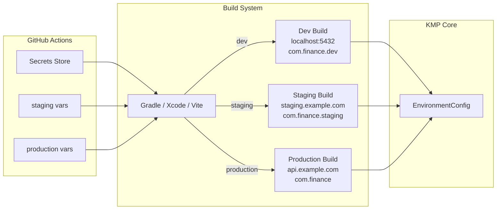

# Implementation Guide: Per-Platform Environment Builds

**Issue:** #891
**Sprint:** 1 — Application Configuration
**Status:** Planned
**Dependencies:** GitHub Actions workflows (existing), Gradle build system, Xcode build configurations
**Estimated effort:** 2–3 days

---

## 1. Overview

Configure each platform's build system to produce distinct `development`, `staging`, and `production` builds with different API endpoints, feature flags, and bundle identifiers. This enables safe testing against staging infrastructure without affecting production users.

### Design Principles

1. **No secrets in code** — All environment-specific values come from build configuration or CI secrets, never hardcoded.
2. **Build-time injection** — Environment is baked into the binary at build time, not determined at runtime via server calls.
3. **Distinct identifiers** — Each environment produces a unique app identifier so dev/staging/production can coexist on the same device.
4. **Shared logic** — The KMP core package receives environment config via dependency injection, not compile-time branching.

---

## 2. Architecture



### Environment Matrix

| Property               | Development              | Staging                            | Production                     |
| ---------------------- | ------------------------ | ---------------------------------- | ------------------------------ |
| API URL                | `http://localhost:54321` | `https://staging.example.com`      | `https://api.example.com`      |
| PowerSync URL          | `http://localhost:8080`  | `https://ps-staging.example.com`   | `https://ps.example.com`       |
| Auth URL               | `http://localhost:9999`  | `https://staging.example.com/auth` | `https://api.example.com/auth` |
| Bundle ID (iOS)        | `com.finance.app.dev`    | `com.finance.app.staging`          | `com.finance.app`              |
| App ID (Android)       | `com.finance.app.dev`    | `com.finance.app.staging`          | `com.finance.app`              |
| Sentry environment     | `development`            | `staging`                          | `production`                   |
| Log level              | `DEBUG`                  | `INFO`                             | `WARN`                         |
| PowerSync verbose logs | `true`                   | `false`                            | `false`                        |

---

## 3. KMP Shared Environment Config

### 3.1 Environment Config Interface

**File:** `packages/core/src/commonMain/kotlin/com/finance/core/config/EnvironmentConfig.kt`

```kotlin
package com.finance.core.config

/**
 * Environment-specific configuration injected at app startup.
 * Values are determined at build time per platform.
 *
 * This is an interface so each platform provides its own implementation
 * populated from build config (BuildConfig, Info.plist, env vars, etc.).
 */
interface EnvironmentConfig {
    /** Current environment: "development", "staging", "production" */
    val environment: String

    /** Supabase REST API base URL */
    val apiUrl: String

    /** PowerSync service URL */
    val powerSyncUrl: String

    /** Supabase Auth URL */
    val authUrl: String

    /** Supabase anonymous key (public, safe to embed) */
    val supabaseAnonKey: String

    /** Sentry DSN (empty string disables Sentry) */
    val sentryDsn: String

    /** Minimum log level: "DEBUG", "INFO", "WARN", "ERROR" */
    val logLevel: String

    /** Whether this is a production build */
    val isProduction: Boolean get() = environment == "production"

    /** Whether this is a debug/development build */
    val isDevelopment: Boolean get() = environment == "development"
}
```

### 3.2 Validation

**File:** `packages/core/src/commonMain/kotlin/com/finance/core/config/EnvironmentConfigValidator.kt`

```kotlin
package com.finance.core.config

/**
 * Validates environment configuration at startup.
 * Fails fast on misconfiguration rather than producing subtle bugs.
 */
object EnvironmentConfigValidator {

    fun validate(config: EnvironmentConfig) {
        require(config.environment in setOf("development", "staging", "production")) {
            "Invalid environment: '${config.environment}'. Must be development, staging, or production."
        }
        require(config.apiUrl.isNotBlank()) { "apiUrl must not be blank" }
        require(config.powerSyncUrl.isNotBlank()) { "powerSyncUrl must not be blank" }
        require(config.authUrl.isNotBlank()) { "authUrl must not be blank" }
        require(config.supabaseAnonKey.isNotBlank()) { "supabaseAnonKey must not be blank" }

        if (config.isProduction) {
            require(config.apiUrl.startsWith("https://")) {
                "Production apiUrl must use HTTPS"
            }
            require(config.powerSyncUrl.startsWith("https://")) {
                "Production powerSyncUrl must use HTTPS"
            }
        }
    }
}
```

---

## 4. Android Configuration

### 4.1 Gradle Build Flavors

**File:** `apps/android/build.gradle.kts` (additions to existing config)

```kotlin
android {
    // ...existing config...

    flavorDimensions += "environment"

    productFlavors {
        create("dev") {
            dimension = "environment"
            applicationIdSuffix = ".dev"
            versionNameSuffix = "-dev"
            buildConfigField("String", "ENVIRONMENT", "\"development\"")
            buildConfigField("String", "API_URL", "\"http://10.0.2.2:54321\"") // Android emulator localhost
            buildConfigField("String", "POWERSYNC_URL", "\"http://10.0.2.2:8080\"")
            buildConfigField("String", "AUTH_URL", "\"http://10.0.2.2:9999\"")
            buildConfigField("String", "SUPABASE_ANON_KEY", "\"${findProperty("dev.supabaseAnonKey") ?: ""}\"")
            buildConfigField("String", "SENTRY_DSN", "\"\"")
            buildConfigField("String", "LOG_LEVEL", "\"DEBUG\"")
        }
        create("staging") {
            dimension = "environment"
            applicationIdSuffix = ".staging"
            versionNameSuffix = "-staging"
            buildConfigField("String", "ENVIRONMENT", "\"staging\"")
            buildConfigField("String", "API_URL", "\"${findProperty("staging.apiUrl") ?: ""}\"")
            buildConfigField("String", "POWERSYNC_URL", "\"${findProperty("staging.powerSyncUrl") ?: ""}\"")
            buildConfigField("String", "AUTH_URL", "\"${findProperty("staging.authUrl") ?: ""}\"")
            buildConfigField("String", "SUPABASE_ANON_KEY", "\"${findProperty("staging.supabaseAnonKey") ?: ""}\"")
            buildConfigField("String", "SENTRY_DSN", "\"${findProperty("staging.sentryDsn") ?: ""}\"")
            buildConfigField("String", "LOG_LEVEL", "\"INFO\"")
        }
        create("prod") {
            dimension = "environment"
            // No applicationIdSuffix — this is the real app
            buildConfigField("String", "ENVIRONMENT", "\"production\"")
            buildConfigField("String", "API_URL", "\"${findProperty("prod.apiUrl") ?: ""}\"")
            buildConfigField("String", "POWERSYNC_URL", "\"${findProperty("prod.powerSyncUrl") ?: ""}\"")
            buildConfigField("String", "AUTH_URL", "\"${findProperty("prod.authUrl") ?: ""}\"")
            buildConfigField("String", "SUPABASE_ANON_KEY", "\"${findProperty("prod.supabaseAnonKey") ?: ""}\"")
            buildConfigField("String", "SENTRY_DSN", "\"${findProperty("prod.sentryDsn") ?: ""}\"")
            buildConfigField("String", "LOG_LEVEL", "\"WARN\"")
        }
    }
}
```

### 4.2 Android EnvironmentConfig Implementation

```kotlin
package com.finance.android.config

import com.finance.android.BuildConfig
import com.finance.core.config.EnvironmentConfig

object AndroidEnvironmentConfig : EnvironmentConfig {
    override val environment = BuildConfig.ENVIRONMENT
    override val apiUrl = BuildConfig.API_URL
    override val powerSyncUrl = BuildConfig.POWERSYNC_URL
    override val authUrl = BuildConfig.AUTH_URL
    override val supabaseAnonKey = BuildConfig.SUPABASE_ANON_KEY
    override val sentryDsn = BuildConfig.SENTRY_DSN
    override val logLevel = BuildConfig.LOG_LEVEL
}
```

### 4.3 Gradle Properties Template

**File:** `apps/android/gradle.properties.example`

```properties
# Per-environment configuration.
# Copy to gradle.properties and fill in values.
# NEVER commit gradle.properties with real values.

# Development (local Docker Compose)
dev.supabaseAnonKey=YOUR_LOCAL_DEV_ANON_KEY

# Staging
staging.apiUrl=https://staging.example.com
staging.powerSyncUrl=https://ps-staging.example.com
staging.authUrl=https://staging.example.com/auth
staging.supabaseAnonKey=YOUR_STAGING_ANON_KEY
staging.sentryDsn=YOUR_STAGING_SENTRY_DSN

# Production
prod.apiUrl=https://api.example.com
prod.powerSyncUrl=https://ps.example.com
prod.authUrl=https://api.example.com/auth
prod.supabaseAnonKey=YOUR_PROD_ANON_KEY
prod.sentryDsn=YOUR_PROD_SENTRY_DSN
```

---

## 5. iOS Configuration

### 5.1 Xcode Build Configurations

Create three `.xcconfig` files in `apps/ios/Config/`:

**File:** `apps/ios/Config/Development.xcconfig`

```
// Development environment — local Docker Compose
PRODUCT_BUNDLE_IDENTIFIER = com.finance.app.dev
DISPLAY_NAME = Finance Dev
API_URL = http://localhost:54321
POWERSYNC_URL = http://localhost:8080
AUTH_URL = http://localhost:9999
SUPABASE_ANON_KEY = $(DEV_SUPABASE_ANON_KEY)
SENTRY_DSN =
LOG_LEVEL = DEBUG
ENVIRONMENT = development
```

**File:** `apps/ios/Config/Staging.xcconfig`

```
// Staging environment — staging VPS
PRODUCT_BUNDLE_IDENTIFIER = com.finance.app.staging
DISPLAY_NAME = Finance Staging
API_URL = https://staging.example.com
POWERSYNC_URL = https://ps-staging.example.com
AUTH_URL = https://staging.example.com/auth
SUPABASE_ANON_KEY = $(STAGING_SUPABASE_ANON_KEY)
SENTRY_DSN = $(STAGING_SENTRY_DSN)
LOG_LEVEL = INFO
ENVIRONMENT = staging
```

**File:** `apps/ios/Config/Production.xcconfig`

```
// Production environment
PRODUCT_BUNDLE_IDENTIFIER = com.finance.app
DISPLAY_NAME = Finance
API_URL = https://api.example.com
POWERSYNC_URL = https://ps.example.com
AUTH_URL = https://api.example.com/auth
SUPABASE_ANON_KEY = $(PROD_SUPABASE_ANON_KEY)
SENTRY_DSN = $(PROD_SENTRY_DSN)
LOG_LEVEL = WARN
ENVIRONMENT = production
```

### 5.2 Info.plist Entries

Add to `apps/ios/Finance/Info.plist`:

```xml
<key>Environment</key>
<string>$(ENVIRONMENT)</string>
<key>ApiUrl</key>
<string>$(API_URL)</string>
<key>PowerSyncUrl</key>
<string>$(POWERSYNC_URL)</string>
<key>AuthUrl</key>
<string>$(AUTH_URL)</string>
<key>SupabaseAnonKey</key>
<string>$(SUPABASE_ANON_KEY)</string>
<key>SentryDsn</key>
<string>$(SENTRY_DSN)</string>
<key>LogLevel</key>
<string>$(LOG_LEVEL)</string>
```

### 5.3 iOS EnvironmentConfig Implementation

```swift
import Foundation

struct IOSEnvironmentConfig {
    static let shared: IOSEnvironmentConfig = {
        guard let info = Bundle.main.infoDictionary else {
            fatalError("Info.plist not found")
        }
        return IOSEnvironmentConfig(
            environment: info["Environment"] as? String ?? "production",
            apiUrl: info["ApiUrl"] as? String ?? "",
            powerSyncUrl: info["PowerSyncUrl"] as? String ?? "",
            authUrl: info["AuthUrl"] as? String ?? "",
            supabaseAnonKey: info["SupabaseAnonKey"] as? String ?? "",
            sentryDsn: info["SentryDsn"] as? String ?? "",
            logLevel: info["LogLevel"] as? String ?? "WARN"
        )
    }()

    let environment: String
    let apiUrl: String
    let powerSyncUrl: String
    let authUrl: String
    let supabaseAnonKey: String
    let sentryDsn: String
    let logLevel: String
}
```

---

## 6. Web Configuration

### 6.1 Vite Environment Files

**File:** `apps/web/.env.development`

```bash
VITE_ENVIRONMENT=development
VITE_API_URL=http://localhost:54321
VITE_POWERSYNC_URL=http://localhost:8080
VITE_AUTH_URL=http://localhost:9999
VITE_SUPABASE_ANON_KEY=local-dev-anon-key
VITE_SENTRY_DSN=
VITE_LOG_LEVEL=DEBUG
```

**File:** `apps/web/.env.staging`

```bash
VITE_ENVIRONMENT=staging
VITE_API_URL=https://staging.example.com
VITE_POWERSYNC_URL=https://ps-staging.example.com
VITE_AUTH_URL=https://staging.example.com/auth
VITE_SUPABASE_ANON_KEY=YOUR_STAGING_ANON_KEY
VITE_SENTRY_DSN=YOUR_STAGING_SENTRY_DSN
VITE_LOG_LEVEL=INFO
```

**File:** `apps/web/.env.production`

```bash
VITE_ENVIRONMENT=production
VITE_API_URL=https://api.example.com
VITE_POWERSYNC_URL=https://ps.example.com
VITE_AUTH_URL=https://api.example.com/auth
VITE_SUPABASE_ANON_KEY=YOUR_PROD_ANON_KEY
VITE_SENTRY_DSN=YOUR_PROD_SENTRY_DSN
VITE_LOG_LEVEL=WARN
```

### 6.2 Web Config Loader

**File:** `apps/web/src/lib/environment.ts`

```typescript
export interface EnvironmentConfig {
  environment: 'development' | 'staging' | 'production';
  apiUrl: string;
  powerSyncUrl: string;
  authUrl: string;
  supabaseAnonKey: string;
  sentryDsn: string;
  logLevel: string;
  isProduction: boolean;
  isDevelopment: boolean;
}

export function loadEnvironment(): EnvironmentConfig {
  const env = import.meta.env.VITE_ENVIRONMENT || 'development';
  return {
    environment: env as EnvironmentConfig['environment'],
    apiUrl: import.meta.env.VITE_API_URL || '',
    powerSyncUrl: import.meta.env.VITE_POWERSYNC_URL || '',
    authUrl: import.meta.env.VITE_AUTH_URL || '',
    supabaseAnonKey: import.meta.env.VITE_SUPABASE_ANON_KEY || '',
    sentryDsn: import.meta.env.VITE_SENTRY_DSN || '',
    logLevel: import.meta.env.VITE_LOG_LEVEL || 'WARN',
    isProduction: env === 'production',
    isDevelopment: env === 'development',
  };
}
```

---

## 7. Windows (Compose Desktop) Configuration

### 7.1 Gradle Build Types

**File:** `apps/windows/build.gradle.kts` (additions)

```kotlin
// Environment is passed via Gradle property: -Pfinance.env=staging
val financeEnv = findProperty("finance.env")?.toString() ?: "development"

compose.desktop {
    application {
        // JVM system properties available at runtime
        jvmArgs(
            "-Dfinance.environment=$financeEnv",
            "-Dfinance.api.url=${findProperty("$financeEnv.apiUrl") ?: "http://localhost:54321"}",
            "-Dfinance.powersync.url=${findProperty("$financeEnv.powerSyncUrl") ?: "http://localhost:8080"}",
            "-Dfinance.auth.url=${findProperty("$financeEnv.authUrl") ?: "http://localhost:9999"}",
            "-Dfinance.supabase.anonKey=${findProperty("$financeEnv.supabaseAnonKey") ?: ""}",
            "-Dfinance.sentry.dsn=${findProperty("$financeEnv.sentryDsn") ?: ""}",
            "-Dfinance.log.level=${findProperty("$financeEnv.logLevel") ?: "DEBUG"}",
        )
    }
}
```

### 7.2 Windows EnvironmentConfig Implementation

```kotlin
package com.finance.desktop.config

import com.finance.core.config.EnvironmentConfig

object DesktopEnvironmentConfig : EnvironmentConfig {
    override val environment = System.getProperty("finance.environment", "development")
    override val apiUrl = System.getProperty("finance.api.url", "http://localhost:54321")
    override val powerSyncUrl = System.getProperty("finance.powersync.url", "http://localhost:8080")
    override val authUrl = System.getProperty("finance.auth.url", "http://localhost:9999")
    override val supabaseAnonKey = System.getProperty("finance.supabase.anonKey", "")
    override val sentryDsn = System.getProperty("finance.sentry.dsn", "")
    override val logLevel = System.getProperty("finance.log.level", "DEBUG")
}
```

---

## 8. CI Integration

### 8.1 GitHub Actions Secrets Structure

```
GitHub Repository Settings → Secrets and variables → Actions

Environments:
├── staging
│   ├── STAGING_API_URL
│   ├── STAGING_POWERSYNC_URL
│   ├── STAGING_AUTH_URL
│   ├── STAGING_SUPABASE_ANON_KEY
│   ├── STAGING_SENTRY_DSN
│   └── (signing keys per platform)
└── production
    ├── PROD_API_URL
    ├── PROD_POWERSYNC_URL
    ├── PROD_AUTH_URL
    ├── PROD_SUPABASE_ANON_KEY
    ├── PROD_SENTRY_DSN
    └── (signing keys per platform)
```

### 8.2 Workflow Snippet

```yaml
# Example: Android staging build
jobs:
  android-staging:
    runs-on: ubuntu-latest
    environment: staging
    steps:
      - uses: actions/checkout@v4
      - name: Build staging APK
        run: |
          ./gradlew :apps:android:assembleStagingRelease \
            -Pstaging.apiUrl="${{ secrets.STAGING_API_URL }}" \
            -Pstaging.powerSyncUrl="${{ secrets.STAGING_POWERSYNC_URL }}" \
            -Pstaging.authUrl="${{ secrets.STAGING_AUTH_URL }}" \
            -Pstaging.supabaseAnonKey="${{ secrets.STAGING_SUPABASE_ANON_KEY }}" \
            -Pstaging.sentryDsn="${{ secrets.STAGING_SENTRY_DSN }}"
```

---

## 9. Testing & Verification

### 9.1 Validation Tests

```kotlin
class EnvironmentConfigValidatorTest {
    @Test
    fun `rejects invalid environment name`() {
        assertFailsWith<IllegalArgumentException> {
            EnvironmentConfigValidator.validate(
                TestConfig(environment = "beta")
            )
        }
    }

    @Test
    fun `rejects non-HTTPS production URLs`() {
        assertFailsWith<IllegalArgumentException> {
            EnvironmentConfigValidator.validate(
                TestConfig(environment = "production", apiUrl = "http://api.example.com")
            )
        }
    }

    @Test
    fun `accepts HTTP for development`() {
        EnvironmentConfigValidator.validate(
            TestConfig(environment = "development", apiUrl = "http://localhost:54321")
        )
    }
}
```

### 9.2 Verification Checklist

- [ ] Android: `./gradlew :apps:android:assembleDevDebug` builds with dev config
- [ ] Android: `./gradlew :apps:android:assembleStagingRelease` builds with staging config
- [ ] Android: Dev and staging APKs can be installed side-by-side (different app IDs)
- [ ] iOS: Development, Staging, and Production schemes build successfully
- [ ] iOS: Dev and staging apps coexist on same device (different bundle IDs)
- [ ] Web: `vite build --mode staging` produces correct env vars
- [ ] Web: `import.meta.env.VITE_API_URL` resolves correctly per mode
- [ ] Windows: `-Pfinance.env=staging` produces correct JVM system properties
- [ ] `EnvironmentConfigValidator` rejects HTTP URLs in production
- [ ] No secrets appear in committed files
- [ ] `.gitignore` includes `gradle.properties`, `.env.staging`, `.env.production`

---

## 10. Security Considerations

1. **Anon keys are public** — The Supabase anonymous key is designed to be embedded in client apps. It only grants access that RLS policies allow. It is NOT a secret.
2. **Service role keys are NEVER embedded** — Only the anon key goes into client builds. The service role key stays server-side.
3. **Sentry DSN is semi-public** — It's a write-only ingest URL. Not ideal to leak, but not a security vulnerability. Embedded in builds is standard practice.
4. **Signing keys are CI-only** — Code signing keys live in GitHub Actions secrets and Fastlane Match. They are never in the repository.
