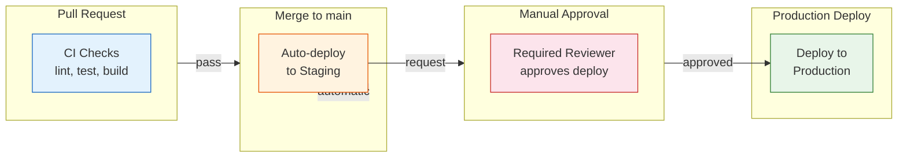
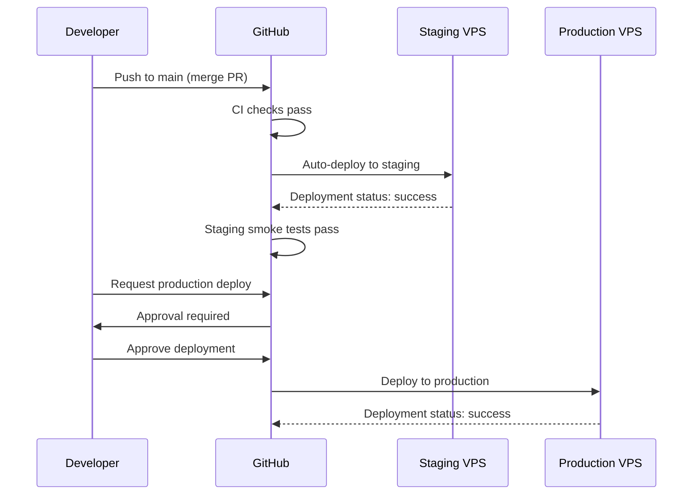

# Implementation Guide: GitHub Actions Environments

**Issue:** #892
**Sprint:** 2 — Deployment Infrastructure
**Status:** Planned
**Dependencies:** #883 (Staging environment), #891 (Per-platform env builds), existing CI workflows
**Estimated effort:** 2–3 days

---

## 1. Overview

Configure GitHub Actions Environments (`staging` and `production`) with environment-specific secrets, protection rules, and deployment workflows. This enables:

- **Staging deployments** triggered automatically on merge to `main`.
- **Production deployments** gated behind manual approval.
- **Environment-specific secrets** (API URLs, signing keys) isolated per environment.
- **Deployment history** visible in the GitHub UI per environment.

### Design Principles

1. **Least privilege** — Each environment only has access to its own secrets. Staging workflows cannot read production secrets.
2. **Manual gate for production** — No code reaches production without a human approving the deployment.
3. **Automated staging** — Every merge to `main` automatically deploys to staging for continuous validation.
4. **Audit trail** — GitHub Environments provide a built-in deployment log showing who approved what, when.

---

## 2. Architecture



### Environment Flow



---

## 3. GitHub Environment Configuration

### 3.1 Create Environments

Navigate to **Repository Settings → Environments** and create:

#### Environment: `staging`

| Setting             | Value              |
| ------------------- | ------------------ |
| Name                | `staging`          |
| Protection rules    | None (auto-deploy) |
| Deployment branches | `main` only        |
| Wait timer          | None               |

#### Environment: `production`

| Setting             | Value                                        |
| ------------------- | -------------------------------------------- |
| Name                | `production`                                 |
| Protection rules    | **Required reviewers: 1** (repository owner) |
| Deployment branches | `main` only                                  |
| Wait timer          | Optional: 5 minutes (allows cancellation)    |

### 3.2 Environment Secrets

#### Staging Secrets

| Secret Name                 | Description                                     |
| --------------------------- | ----------------------------------------------- |
| `SSH_PRIVATE_KEY`           | SSH key for staging VPS `deploy` user           |
| `SSH_HOST`                  | Staging VPS hostname/IP                         |
| `SSH_USER`                  | `deploy`                                        |
| `API_URL`                   | `https://staging.finance.example.com`           |
| `POWERSYNC_URL`             | `https://staging.finance.example.com/powersync` |
| `AUTH_URL`                  | `https://staging.finance.example.com/auth`      |
| `SUPABASE_ANON_KEY`         | Staging anon key                                |
| `SENTRY_DSN`                | Staging Sentry DSN                              |
| `ANDROID_KEYSTORE_BASE64`   | Staging signing keystore (base64)               |
| `ANDROID_KEYSTORE_PASSWORD` | Staging keystore password                       |
| `ANDROID_KEY_ALIAS`         | Staging key alias                               |
| `ANDROID_KEY_PASSWORD`      | Staging key password                            |

#### Production Secrets

| Secret Name                 | Description                                 |
| --------------------------- | ------------------------------------------- |
| `SSH_PRIVATE_KEY`           | SSH key for production VPS `deploy` user    |
| `SSH_HOST`                  | Production VPS hostname/IP                  |
| `SSH_USER`                  | `deploy`                                    |
| `API_URL`                   | `https://api.finance.example.com`           |
| `POWERSYNC_URL`             | `https://api.finance.example.com/powersync` |
| `AUTH_URL`                  | `https://api.finance.example.com/auth`      |
| `SUPABASE_ANON_KEY`         | Production anon key                         |
| `SENTRY_DSN`                | Production Sentry DSN                       |
| `ANDROID_KEYSTORE_BASE64`   | Production signing keystore (base64)        |
| `ANDROID_KEYSTORE_PASSWORD` | Production keystore password                |
| `ANDROID_KEY_ALIAS`         | Production key alias                        |
| `ANDROID_KEY_PASSWORD`      | Production key password                     |
| `APPLE_CONNECT_API_KEY`     | App Store Connect API key                   |
| `FASTLANE_MATCH_PASSWORD`   | Fastlane Match decryption password          |

### 3.3 Environment Variables (Non-Secret)

| Variable Name | Staging Value                  | Production Value       |
| ------------- | ------------------------------ | ---------------------- |
| `ENVIRONMENT` | `staging`                      | `production`           |
| `DEPLOY_DIR`  | `/home/deploy/finance-staging` | `/home/deploy/finance` |

---

## 4. Deployment Workflow

### 4.1 Backend Deploy Workflow

**File:** `.github/workflows/deploy-backend.yml`

```yaml
name: Deploy Backend

on:
  push:
    branches: [main]
    paths:
      - 'deploy/**'
      - 'services/api/**'
  workflow_dispatch:
    inputs:
      environment:
        description: 'Target environment'
        required: true
        type: choice
        options:
          - staging
          - production

concurrency:
  group: deploy-backend-${{ github.event.inputs.environment || 'staging' }}
  cancel-in-progress: false # Never cancel in-progress deployments

permissions:
  contents: read
  deployments: write

jobs:
  # --------------------------------------------------------------------------
  # Deploy to staging (automatic on push to main)
  # --------------------------------------------------------------------------
  deploy-staging:
    if: >
      github.event_name == 'push' ||
      (github.event_name == 'workflow_dispatch' && github.event.inputs.environment == 'staging')
    runs-on: ubuntu-latest
    environment: staging
    timeout-minutes: 15

    steps:
      - name: Checkout
        uses: actions/checkout@v4

      - name: Setup SSH
        run: |
          mkdir -p ~/.ssh
          echo "${{ secrets.SSH_PRIVATE_KEY }}" > ~/.ssh/deploy_key
          chmod 600 ~/.ssh/deploy_key
          ssh-keyscan -H ${{ secrets.SSH_HOST }} >> ~/.ssh/known_hosts

      - name: Deploy to staging
        env:
          SSH_HOST: ${{ secrets.SSH_HOST }}
          SSH_USER: ${{ secrets.SSH_USER }}
          DEPLOY_DIR: ${{ vars.DEPLOY_DIR }}
        run: |
          # Sync deploy configuration
          rsync -avz --exclude '.env' --exclude 'volumes/' \
            -e "ssh -i ~/.ssh/deploy_key" \
            deploy/ $SSH_USER@$SSH_HOST:$DEPLOY_DIR/

          # Sync PowerSync rules
          rsync -avz -e "ssh -i ~/.ssh/deploy_key" \
            services/api/powersync/sync-rules.yaml \
            $SSH_USER@$SSH_HOST:$DEPLOY_DIR/../services/api/powersync/sync-rules.yaml

          # Sync Edge Functions
          rsync -avz -e "ssh -i ~/.ssh/deploy_key" \
            services/api/supabase/functions/ \
            $SSH_USER@$SSH_HOST:$DEPLOY_DIR/../services/api/supabase/functions/

          # Pull and restart
          ssh -i ~/.ssh/deploy_key $SSH_USER@$SSH_HOST \
            "cd $DEPLOY_DIR && docker compose pull && docker compose up -d"

      - name: Smoke test
        run: |
          sleep 30  # Wait for services to stabilize
          STATUS=$(curl -sf -o /dev/null -w "%{http_code}" \
            https://staging.finance.example.com/health || echo "000")
          if [ "$STATUS" != "200" ]; then
            echo "❌ Health check failed with status: $STATUS"
            exit 1
          fi
          echo "✅ Staging health check passed"

  # --------------------------------------------------------------------------
  # Deploy to production (manual approval required)
  # --------------------------------------------------------------------------
  deploy-production:
    if: github.event_name == 'workflow_dispatch' && github.event.inputs.environment == 'production'
    runs-on: ubuntu-latest
    environment: production # This triggers the approval gate
    timeout-minutes: 15

    steps:
      - name: Checkout
        uses: actions/checkout@v4

      - name: Setup SSH
        run: |
          mkdir -p ~/.ssh
          echo "${{ secrets.SSH_PRIVATE_KEY }}" > ~/.ssh/deploy_key
          chmod 600 ~/.ssh/deploy_key
          ssh-keyscan -H ${{ secrets.SSH_HOST }} >> ~/.ssh/known_hosts

      - name: Deploy to production
        env:
          SSH_HOST: ${{ secrets.SSH_HOST }}
          SSH_USER: ${{ secrets.SSH_USER }}
          DEPLOY_DIR: ${{ vars.DEPLOY_DIR }}
        run: |
          rsync -avz --exclude '.env' --exclude 'volumes/' \
            -e "ssh -i ~/.ssh/deploy_key" \
            deploy/ $SSH_USER@$SSH_HOST:$DEPLOY_DIR/

          rsync -avz -e "ssh -i ~/.ssh/deploy_key" \
            services/api/powersync/sync-rules.yaml \
            $SSH_USER@$SSH_HOST:$DEPLOY_DIR/../services/api/powersync/sync-rules.yaml

          rsync -avz -e "ssh -i ~/.ssh/deploy_key" \
            services/api/supabase/functions/ \
            $SSH_USER@$SSH_HOST:$DEPLOY_DIR/../services/api/supabase/functions/

          ssh -i ~/.ssh/deploy_key $SSH_USER@$SSH_HOST \
            "cd $DEPLOY_DIR && docker compose pull && docker compose up -d"

      - name: Smoke test
        run: |
          sleep 30
          STATUS=$(curl -sf -o /dev/null -w "%{http_code}" \
            https://api.finance.example.com/health || echo "000")
          if [ "$STATUS" != "200" ]; then
            echo "❌ Health check failed with status: $STATUS"
            exit 1
          fi
          echo "✅ Production health check passed"
```

### 4.2 App Build Workflow Snippet

Example showing environment-specific Android builds in existing CI:

```yaml
# In .github/workflows/android-ci.yml — add staging/prod build jobs

build-staging:
  needs: [lint-and-test]
  runs-on: ubuntu-latest
  environment: staging
  steps:
    - uses: actions/checkout@v4
    - name: Build staging APK
      run: |
        ./gradlew :apps:android:assembleStagingRelease \
          -Pstaging.apiUrl="${{ secrets.API_URL }}" \
          -Pstaging.powerSyncUrl="${{ secrets.POWERSYNC_URL }}" \
          -Pstaging.authUrl="${{ secrets.AUTH_URL }}" \
          -Pstaging.supabaseAnonKey="${{ secrets.SUPABASE_ANON_KEY }}" \
          -Pstaging.sentryDsn="${{ secrets.SENTRY_DSN }}"

build-production:
  needs: [lint-and-test]
  runs-on: ubuntu-latest
  environment: production # Requires approval
  if: github.event_name == 'workflow_dispatch'
  steps:
    - uses: actions/checkout@v4
    - name: Build production APK
      run: |
        ./gradlew :apps:android:assembleProdRelease \
          -Pprod.apiUrl="${{ secrets.API_URL }}" \
          -Pprod.powerSyncUrl="${{ secrets.POWERSYNC_URL }}" \
          -Pprod.authUrl="${{ secrets.AUTH_URL }}" \
          -Pprod.supabaseAnonKey="${{ secrets.SUPABASE_ANON_KEY }}" \
          -Pprod.sentryDsn="${{ secrets.SENTRY_DSN }}"
```

---

## 5. Workflow Dispatch UI

The `workflow_dispatch` trigger creates a "Run workflow" button in the GitHub Actions UI:

```
Repository → Actions → "Deploy Backend"
  → "Run workflow" dropdown
  → Select environment: staging / production
  → Click "Run workflow"
```

For production, GitHub will show an approval pending notification. The configured reviewer must approve before the deployment executes.

---

## 6. Protection Rules Detail

### 6.1 Branch Protection (Existing)

Ensure `main` branch protection includes:

- [x] Require pull request reviews
- [x] Require status checks to pass (CI workflow)
- [x] Require branches to be up to date

### 6.2 Environment Protection

**Production environment:**

- **Required reviewers:** At least the repository owner. Add additional trusted reviewers as the team grows.
- **Wait timer:** 5 minutes (optional, allows "oh no" cancellation after approval).
- **Deployment branches:** Only `main` — prevents deploying from feature branches.

**Staging environment:**

- **No required reviewers** — auto-deploys on push to `main`.
- **Deployment branches:** Only `main`.

---

## 7. Testing & Verification

### 7.1 Test the Staging Auto-Deploy

1. Merge a PR that modifies a file in `deploy/` or `services/api/`.
2. Go to **Actions** tab → verify "Deploy Backend" workflow triggered.
3. Verify the staging job runs (no approval needed).
4. Verify the smoke test step passes.
5. Visit `https://staging.finance.example.com/health` — should return 200.

### 7.2 Test the Production Approval Gate

1. Go to **Actions** → "Deploy Backend" → "Run workflow".
2. Select `production` environment.
3. Verify the workflow pauses at the production deployment job.
4. Check that an approval request notification is sent to the configured reviewer.
5. Approve the deployment.
6. Verify the production job runs and smoke test passes.

### 7.3 Test Secret Isolation

1. Add a step that echoes a staging secret to the staging job.
2. Verify the secret is masked in logs (`***`).
3. Verify the production job **cannot** access staging secrets (and vice versa).

### 7.4 Verification Checklist

- [ ] `staging` environment created in GitHub repository settings
- [ ] `production` environment created with required reviewers
- [ ] All staging secrets populated
- [ ] All production secrets populated
- [ ] Deploy workflow triggers on push to `main` (paths filter)
- [ ] Deploy workflow supports `workflow_dispatch` with environment selector
- [ ] Staging deploys automatically (no approval)
- [ ] Production deploys require manual approval
- [ ] Approval notification reaches the configured reviewer
- [ ] Smoke tests verify deployment success
- [ ] Failed smoke tests mark the deployment as failed
- [ ] Concurrency settings prevent overlapping deployments
- [ ] Deployment history visible in GitHub UI (Environments tab)

---

## 8. Rollback

### 8.1 Backend Rollback

If a deployment breaks staging or production:

1. Revert the commit on `main`: `git revert HEAD && git push`
2. The auto-deploy to staging triggers automatically.
3. For production: manually trigger the deploy workflow with `production` environment.

### 8.2 Emergency Production Rollback

If production is broken and CI is too slow:

```bash
# SSH directly to production VPS
ssh deploy@api.finance.example.com
cd /home/deploy/finance

# Revert to previous Docker images
docker compose down
docker compose up -d --no-pull  # Use locally cached previous images
```

---

## 9. Future Enhancements

- **Canary deployments** — Deploy to a subset of production traffic first.
- **Automated rollback** — If smoke tests fail, automatically revert to the previous deployment.
- **Slack notifications** — Post deployment status to a Slack channel.
- **Database migration approval** — Separate workflow for migrations that require DBA review.
