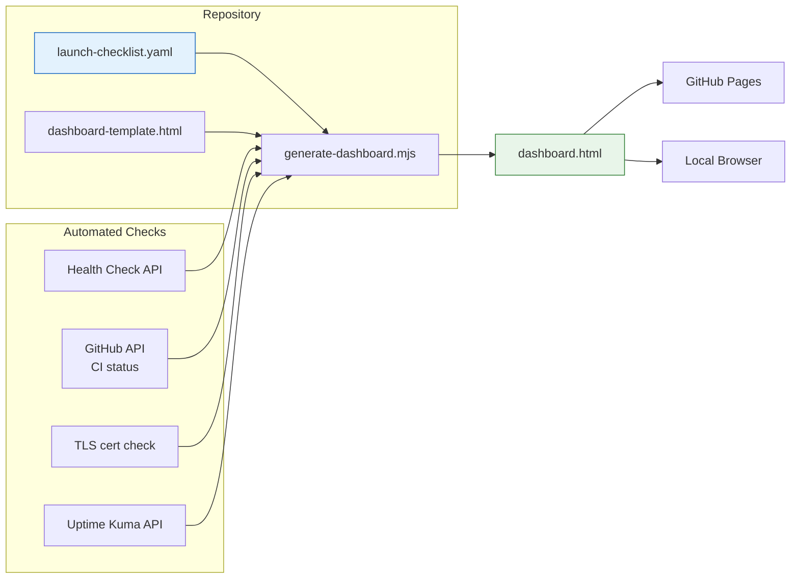
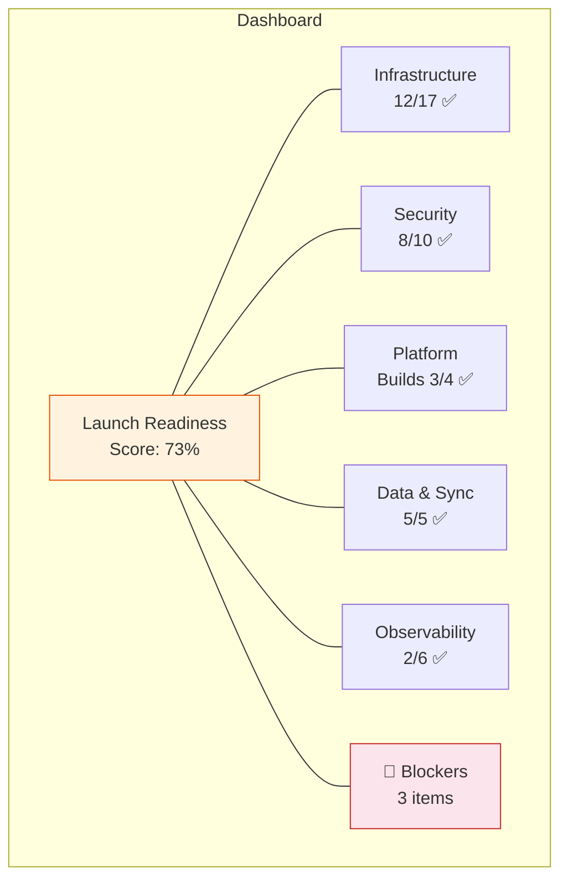

# Implementation Guide: Launch Readiness Dashboard

**Issue:** #894
**Sprint:** 3 — Observability & Launch Readiness
**Status:** Planned
**Dependencies:** #887 (Uptime Kuma), #900 (Backups), existing launch readiness plan
**Estimated effort:** 3–4 days

---

## 1. Overview

Build a launch readiness dashboard that aggregates the status of all pre-launch checklist items into a single view. This provides at-a-glance visibility into what's done, what's blocked, and what remains — enabling a confident go/no-go decision.

The dashboard is implemented as a **static site generated from structured data** (YAML checklist + script), avoiding the need for a database or running service. It can be hosted on GitHub Pages or served locally.

### Design Principles

1. **Single source of truth** — The checklist lives in a YAML file in the repository. The dashboard is generated from it.
2. **No running service** — Static HTML generated by a script. Zero operational overhead.
3. **Offline-capable** — Works as a local HTML file. No external dependencies.
4. **Automated checks where possible** — Health endpoints, CI status, and cert expiry are checked programmatically.

---

## 2. Architecture



### Dashboard Sections



---

## 3. Checklist Data Format

### 3.1 YAML Schema

**File:** `tools/launch-readiness/launch-checklist.yaml`

```yaml
# =============================================================================
# Finance App — Launch Readiness Checklist
# =============================================================================
# Source of truth for launch go/no-go decisions.
# Update this file as items are completed or verified.
#
# Status values: done | in-progress | blocked | not-started
# Priority: P0 (launch blocker) | P1 (should have) | P2 (nice to have)
#
# Issue: #894
# =============================================================================

metadata:
  target_launch_date: '2026-09-01'
  last_updated: '2026-07-15'
  owner: 'jrmoulckers'

categories:
  - name: Infrastructure & Backend
    id: infrastructure
    items:
      - id: I-1
        title: VPS provisioned and hardened
        priority: P0
        status: not-started
        issue: '#883'
        notes: 'SSH key-only, firewall, unattended-upgrades'
        automated_check: null

      - id: I-2
        title: Docker Compose stack runs cleanly
        priority: P0
        status: not-started
        issue: '#881'
        notes: 'PostgreSQL, PostgREST, GoTrue, Edge Functions, PowerSync, Caddy'
        automated_check:
          type: health_endpoint
          url: 'https://${DOMAIN}/health'
          expected_status: 200

      - id: I-3
        title: Caddy TLS with valid certificates
        priority: P0
        status: not-started
        issue: '#883'
        automated_check:
          type: tls_certificate
          hostname: '${DOMAIN}'
          min_days_valid: 14

      - id: I-8
        title: PowerSync deployed and connected
        priority: P0
        status: not-started
        issue: '#881'
        automated_check:
          type: health_endpoint
          url: 'https://${DOMAIN}/powersync/api/status'
          expected_status: 200

      - id: I-12
        title: Automated encrypted daily backups
        priority: P0
        status: not-started
        issue: '#900'
        notes: 'pg_dump + age encryption + off-site storage'
        automated_check:
          type: uptime_kuma
          monitor_name: 'Backup Health'

      - id: I-13
        title: Backup restoration tested
        priority: P0
        status: not-started
        issue: '#900'
        notes: 'Full restore to clean database verified'

  - name: Security & Privacy
    id: security
    items:
      - id: S-1
        title: JWT secret is strong and unique per environment
        priority: P0
        status: not-started
        issue: '#891'

      - id: S-2
        title: RLS policies verified on every table
        priority: P0
        status: not-started
        notes: 'No table has RLS disabled'

      - id: S-3
        title: Passkey authentication working end-to-end
        priority: P0
        status: not-started

  - name: Observability
    id: observability
    items:
      - id: O-1
        title: Uptime Kuma monitoring deployed
        priority: P0
        status: not-started
        issue: '#887'
        automated_check:
          type: health_endpoint
          url: 'https://${MONITORING_DOMAIN}/api/status-page/heartbeat/finance'
          expected_status: 200

      - id: O-2
        title: Health check endpoint functional
        priority: P0
        status: not-started
        automated_check:
          type: health_endpoint
          url: 'https://${DOMAIN}/health'
          expected_status: 200

      - id: O-3
        title: Alerting configured for P0 incidents
        priority: P0
        status: not-started
        issue: '#887'

      - id: O-4
        title: Backup failure alerting active
        priority: P0
        status: not-started
        issue: '#900'

  - name: Platform Builds
    id: platforms
    items:
      - id: P-1
        title: Android staging build works
        priority: P0
        status: not-started
        issue: '#891'

      - id: P-2
        title: iOS staging build works
        priority: P0
        status: not-started
        issue: '#891'

      - id: P-3
        title: Web staging build works
        priority: P0
        status: not-started
        issue: '#891'

      - id: P-4
        title: Windows staging build works
        priority: P1
        status: not-started
        issue: '#891'

  - name: Data & Sync
    id: sync
    items:
      - id: D-1
        title: PowerSync sync rules match RLS policies
        priority: P0
        status: not-started

      - id: D-2
        title: End-to-end sync verified (all platforms)
        priority: P0
        status: not-started

      - id: D-3
        title: Conflict resolution tested
        priority: P0
        status: not-started

      - id: D-4
        title: Feature flags syncing correctly
        priority: P1
        status: not-started
        issue: '#885'
```

---

## 4. Dashboard Generator

### 4.1 Generator Script

**File:** `tools/launch-readiness/generate-dashboard.mjs`

```javascript
#!/usr/bin/env node
/**
 * Launch Readiness Dashboard Generator
 *
 * Reads launch-checklist.yaml, runs automated checks, and generates
 * a self-contained HTML dashboard.
 *
 * Usage:
 *   node tools/launch-readiness/generate-dashboard.mjs
 *   node tools/launch-readiness/generate-dashboard.mjs --check  # Run automated checks
 *   node tools/launch-readiness/generate-dashboard.mjs --output docs/dashboard.html
 *
 * Issue: #894
 */

import { readFileSync, writeFileSync } from 'node:fs';
import { resolve, dirname } from 'node:path';
import { fileURLToPath } from 'node:url';
import { parseArgs } from 'node:util';

const __dirname = dirname(fileURLToPath(import.meta.url));

// ---------------------------------------------------------------------------
// Parse arguments
// ---------------------------------------------------------------------------
const { values: args } = parseArgs({
  options: {
    check: { type: 'boolean', default: false },
    output: { type: 'string', default: resolve(__dirname, 'dashboard.html') },
    domain: { type: 'string', default: '' },
  },
});

// ---------------------------------------------------------------------------
// Load checklist (simple YAML parser for flat structure)
// In production, use a proper YAML parser like 'yaml' npm package
// ---------------------------------------------------------------------------
function parseSimpleYaml(text) {
  // For the full implementation, install 'yaml' package: npm install yaml
  // This is a placeholder that shows the intended interface
  throw new Error('Install yaml package: npm install yaml, then use import {parse} from "yaml"');
}

// ---------------------------------------------------------------------------
// Automated checks
// ---------------------------------------------------------------------------
async function runAutomatedChecks(checklist, domain) {
  if (!domain) {
    console.log('⏭  Skipping automated checks (no --domain provided)');
    return checklist;
  }

  for (const category of checklist.categories) {
    for (const item of category.items) {
      if (!item.automated_check) continue;

      const check = item.automated_check;
      const url = check.url?.replace('${DOMAIN}', domain);

      try {
        switch (check.type) {
          case 'health_endpoint': {
            const response = await fetch(url, { signal: AbortSignal.timeout(10_000) });
            item._check_result = response.status === check.expected_status ? 'pass' : 'fail';
            item._check_detail = `HTTP ${response.status}`;
            break;
          }
          case 'tls_certificate': {
            // TLS check requires Node.js tls module — simplified here
            item._check_result = 'skip';
            item._check_detail = 'Manual verification required';
            break;
          }
          default:
            item._check_result = 'skip';
        }
      } catch (err) {
        item._check_result = 'fail';
        item._check_detail = err.message;
      }
    }
  }

  return checklist;
}

// ---------------------------------------------------------------------------
// Generate HTML
// ---------------------------------------------------------------------------
function generateHtml(checklist) {
  const statusEmoji = {
    done: '✅',
    'in-progress': '🔄',
    blocked: '🚫',
    'not-started': '⬜',
  };

  const priorityColor = {
    P0: '#c62828',
    P1: '#e65100',
    P2: '#1565c0',
  };

  // Calculate stats
  let totalItems = 0;
  let doneItems = 0;
  let blockers = [];

  for (const cat of checklist.categories) {
    for (const item of cat.items) {
      totalItems++;
      if (item.status === 'done') doneItems++;
      if (item.priority === 'P0' && item.status !== 'done') {
        blockers.push(item);
      }
    }
  }

  const score = totalItems > 0 ? Math.round((doneItems / totalItems) * 100) : 0;
  const scoreColor = score >= 90 ? '#2e7d32' : score >= 70 ? '#e65100' : '#c62828';

  let categoriesHtml = '';
  for (const cat of checklist.categories) {
    const catDone = cat.items.filter((i) => i.status === 'done').length;
    const catTotal = cat.items.length;

    let itemsHtml = '';
    for (const item of cat.items) {
      const checkBadge = item._check_result
        ? `<span class="check-badge check-${item._check_result}">${item._check_detail || item._check_result}</span>`
        : '';

      itemsHtml += `
        <tr>
          <td>${statusEmoji[item.status] || '⬜'}</td>
          <td><span class="priority" style="background:${priorityColor[item.priority]}">${item.priority}</span></td>
          <td><strong>${item.id}</strong></td>
          <td>${item.title} ${checkBadge}</td>
          <td>${item.issue ? `<a href="https://github.com/jrmoulckers/finance/issues/${item.issue.replace('#', '')}">${item.issue}</a>` : ''}</td>
          <td class="status-${item.status}">${item.status}</td>
        </tr>`;
    }

    categoriesHtml += `
      <div class="category">
        <h2>${cat.name} <span class="count">${catDone}/${catTotal}</span></h2>
        <table>
          <thead><tr><th></th><th>Pri</th><th>ID</th><th>Item</th><th>Issue</th><th>Status</th></tr></thead>
          <tbody>${itemsHtml}</tbody>
        </table>
      </div>`;
  }

  let blockersHtml = '';
  if (blockers.length > 0) {
    blockersHtml = `
      <div class="blockers">
        <h2>🚫 Launch Blockers (${blockers.length})</h2>
        <ul>
          ${blockers.map((b) => `<li><strong>${b.id}:</strong> ${b.title} — <em>${b.status}</em></li>`).join('\n')}
        </ul>
      </div>`;
  }

  return `<!DOCTYPE html>
<html lang="en">
<head>
  <meta charset="utf-8">
  <meta name="viewport" content="width=device-width, initial-scale=1">
  <title>Finance — Launch Readiness Dashboard</title>
  <style>
    * { box-sizing: border-box; margin: 0; padding: 0; }
    body { font-family: -apple-system, BlinkMacSystemFont, 'Segoe UI', sans-serif; max-width: 1200px; margin: 0 auto; padding: 2rem; background: #fafafa; }
    h1 { font-size: 2rem; margin-bottom: 0.5rem; }
    .meta { color: #666; margin-bottom: 2rem; }
    .score { font-size: 4rem; font-weight: 900; color: ${scoreColor}; }
    .score-label { font-size: 1.2rem; color: #666; }
    .score-section { text-align: center; padding: 2rem; background: white; border-radius: 12px; box-shadow: 0 2px 8px rgba(0,0,0,0.1); margin-bottom: 2rem; }
    .category { background: white; border-radius: 12px; box-shadow: 0 2px 8px rgba(0,0,0,0.1); margin-bottom: 1.5rem; padding: 1.5rem; }
    .category h2 { font-size: 1.3rem; margin-bottom: 1rem; }
    .count { font-weight: 400; color: #666; font-size: 1rem; }
    table { width: 100%; border-collapse: collapse; }
    th, td { padding: 0.5rem; text-align: left; border-bottom: 1px solid #eee; }
    th { font-size: 0.85rem; color: #999; text-transform: uppercase; }
    .priority { color: white; padding: 2px 8px; border-radius: 4px; font-size: 0.75rem; font-weight: 700; }
    .status-done { color: #2e7d32; font-weight: 600; }
    .status-in-progress { color: #e65100; }
    .status-blocked { color: #c62828; font-weight: 600; }
    .status-not-started { color: #999; }
    .blockers { background: #fff5f5; border: 2px solid #c62828; border-radius: 12px; padding: 1.5rem; margin-bottom: 2rem; }
    .blockers h2 { color: #c62828; }
    .blockers ul { margin-top: 0.5rem; padding-left: 1.5rem; }
    .blockers li { margin-bottom: 0.3rem; }
    .check-badge { font-size: 0.75rem; padding: 2px 6px; border-radius: 4px; margin-left: 8px; }
    .check-pass { background: #e8f5e9; color: #2e7d32; }
    .check-fail { background: #fce4ec; color: #c62828; }
    .check-skip { background: #f5f5f5; color: #999; }
    a { color: #1565c0; }
  </style>
</head>
<body>
  <h1>🚀 Finance — Launch Readiness</h1>
  <p class="meta">
    Target: ${checklist.metadata.target_launch_date} ·
    Updated: ${checklist.metadata.last_updated} ·
    Generated: ${new Date().toISOString().split('T')[0]}
  </p>

  <div class="score-section">
    <div class="score">${score}%</div>
    <div class="score-label">${doneItems} of ${totalItems} items complete</div>
  </div>

  ${blockersHtml}
  ${categoriesHtml}
</body>
</html>`;
}

// ---------------------------------------------------------------------------
// Main
// ---------------------------------------------------------------------------
console.log('Launch Readiness Dashboard Generator');
console.log('Output:', args.output);
console.log('NOTE: Install yaml package for full functionality: npm install yaml');
console.log('This is an implementation template — see source for integration details.');
```

---

## 5. CI Integration

### 5.1 Automated Dashboard Update

**File:** `.github/workflows/launch-readiness.yml`

```yaml
name: Launch Readiness Check

on:
  schedule:
    - cron: '0 8 * * *' # Daily at 08:00 UTC
  workflow_dispatch: # Manual trigger
  push:
    branches: [main]
    paths:
      - 'tools/launch-readiness/**'

permissions:
  contents: read
  pages: write

jobs:
  check:
    runs-on: ubuntu-latest
    environment: staging # For health check access
    steps:
      - uses: actions/checkout@v4

      - uses: actions/setup-node@v4
        with:
          node-version: 22

      - name: Install dependencies
        run: cd tools/launch-readiness && npm install yaml

      - name: Generate dashboard
        run: |
          node tools/launch-readiness/generate-dashboard.mjs \
            --check \
            --domain "${{ secrets.API_URL }}" \
            --output tools/launch-readiness/dashboard.html

      - name: Upload artifact
        uses: actions/upload-artifact@v4
        with:
          name: launch-readiness-dashboard
          path: tools/launch-readiness/dashboard.html
```

---

## 6. Testing & Verification

### 6.1 Generator Tests

```javascript
// tools/launch-readiness/generate-dashboard.test.mjs
import { describe, it, assert } from 'node:test';

describe('Dashboard Generator', () => {
  it('calculates score correctly', () => {
    // 2 done out of 4 total = 50%
    const checklist = {
      metadata: { target_launch_date: '2026-09-01', last_updated: '2026-07-15' },
      categories: [
        {
          name: 'Test',
          items: [
            { id: 'T-1', title: 'A', priority: 'P0', status: 'done' },
            { id: 'T-2', title: 'B', priority: 'P0', status: 'done' },
            { id: 'T-3', title: 'C', priority: 'P0', status: 'not-started' },
            { id: 'T-4', title: 'D', priority: 'P1', status: 'in-progress' },
          ],
        },
      ],
    };
    // Score should be 50%
    assert.strictEqual(2, checklist.categories[0].items.filter((i) => i.status === 'done').length);
  });

  it('identifies P0 blockers correctly', () => {
    const items = [
      { priority: 'P0', status: 'not-started' }, // blocker
      { priority: 'P0', status: 'done' }, // not a blocker
      { priority: 'P1', status: 'not-started' }, // not P0, not a blocker
    ];
    const blockers = items.filter((i) => i.priority === 'P0' && i.status !== 'done');
    assert.strictEqual(blockers.length, 1);
  });
});
```

### 6.2 Verification Checklist

- [ ] `launch-checklist.yaml` is valid YAML and loads without errors
- [ ] Generator script produces valid HTML
- [ ] Dashboard displays correct score calculation
- [ ] All P0 not-done items appear in the "Launch Blockers" section
- [ ] Issue links navigate to the correct GitHub issues
- [ ] Automated health checks run when `--check --domain` is provided
- [ ] Dashboard renders correctly in Chrome, Firefox, Safari
- [ ] CI workflow generates and uploads the dashboard artifact
- [ ] Checklist items map 1:1 to the launch readiness plan in `docs/ops/launch-readiness-plan.md`

---

## 7. Maintenance

### 7.1 Updating the Checklist

When completing a launch item:

1. Edit `tools/launch-readiness/launch-checklist.yaml`
2. Change the item's `status` from `not-started` → `in-progress` → `done`
3. Add any notes (e.g., verification date, who verified)
4. Commit and push — the dashboard regenerates automatically

### 7.2 Adding New Items

Follow the existing YAML schema. Every item needs: `id`, `title`, `priority`, `status`. Optional: `issue`, `notes`, `automated_check`.

---

## 8. Relationship to Existing Docs

This dashboard is the **interactive companion** to the existing static checklist in `docs/ops/launch-readiness-plan.md`. The relationship:

| Document                                       | Purpose                                                 | Format                   |
| ---------------------------------------------- | ------------------------------------------------------- | ------------------------ |
| `docs/ops/launch-readiness-plan.md`            | Detailed procedures, dashboard specs, incident response | Markdown (reference doc) |
| `tools/launch-readiness/launch-checklist.yaml` | Machine-readable status tracking                        | YAML (source of truth)   |
| `tools/launch-readiness/dashboard.html`        | Visual at-a-glance status                               | HTML (generated)         |

The YAML checklist is the single source of truth. The markdown doc provides context and procedures. The HTML dashboard provides the view.
