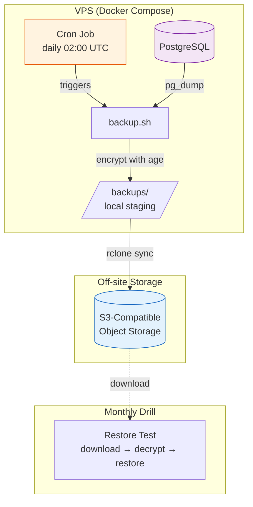
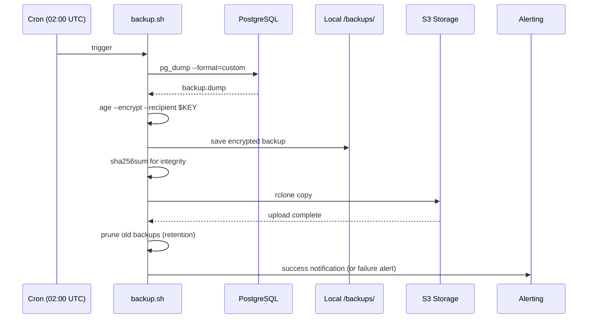

# Implementation Guide: Automated Encrypted Database Backups

**Issue:** #900
**Sprint:** 3 — Observability & Launch Readiness
**Status:** Planned
**Dependencies:** #881 (PowerSync Docker Compose — for complete stack), deploy/docker-compose.yml
**Estimated effort:** 2–3 days

---

## 1. Overview

Implement automated, encrypted PostgreSQL backups with off-site storage and verified restoration. This is a P0 launch blocker per the [Launch Readiness Plan](../../ops/launch-readiness-plan.md) (item I-12). Financial data is irreplaceable — a backup failure is an existential risk for users.

### Design Principles

1. **Encrypt before upload** — Backups are encrypted locally using `age` before leaving the VPS. The backup storage provider never sees plaintext.
2. **Automated and unattended** — A cron job runs daily with no human intervention required.
3. **Verified** — Backup integrity is tested on creation (checksum) and periodically via restore drill.
4. **Retention policy** — 7 daily + 4 weekly + 3 monthly = max 14 backup files at any time.
5. **Off-site storage** — Backups are uploaded to S3-compatible object storage (separate provider from VPS for disaster recovery).

---

## 2. Architecture



### Backup Flow



---

## 3. Tool Selection

| Tool      | Purpose           | Why                                                                              |
| --------- | ----------------- | -------------------------------------------------------------------------------- |
| `pg_dump` | PostgreSQL backup | Standard, battle-tested, supports custom format with compression                 |
| `age`     | Encryption        | Simple, modern, audited. No GPG key management complexity. Single static binary. |
| `rclone`  | Off-site upload   | Supports S3, B2, Minio, and 70+ providers. Single binary, no dependencies.       |

### Why `age` over GPG?

- **Simpler key management** — One key pair, no keyring, no trust model.
- **Audited** — Created by Filippo Valsorda (Go team, former Cloudflare).
- **No configuration** — Works out of the box with a single command.
- **Small binary** — ~5 MB vs GPG's complex dependency chain.

---

## 4. Backup Script

**File:** `deploy/scripts/backup.sh`

```bash
#!/usr/bin/env bash
# =============================================================================
# Finance App — Automated Encrypted Database Backup
# =============================================================================
#
# Performs a full PostgreSQL backup, encrypts it with age, uploads to S3,
# and prunes old backups according to the retention policy.
#
# Usage:
#   ./backup.sh                    # Run backup
#   ./backup.sh --restore latest   # Restore latest backup
#   ./backup.sh --list             # List available backups
#
# Required environment variables (from .env):
#   POSTGRES_USER, POSTGRES_PASSWORD, POSTGRES_DB, POSTGRES_PORT
#   BACKUP_AGE_RECIPIENT     — age public key for encryption
#   BACKUP_RCLONE_REMOTE     — rclone remote name (e.g., "s3:finance-backups")
#   BACKUP_RETENTION_DAYS    — days to keep daily backups (default: 7)
#
# Issue: #900
# =============================================================================

set -euo pipefail

# ---------------------------------------------------------------------------
# Configuration
# ---------------------------------------------------------------------------
BACKUP_DIR="${BACKUP_DIR:-/backups}"
TIMESTAMP=$(date -u +"%Y%m%d_%H%M%S")
DAY_OF_WEEK=$(date -u +"%u")  # 1=Monday, 7=Sunday
DAY_OF_MONTH=$(date -u +"%d")

RETENTION_DAILY="${BACKUP_RETENTION_DAYS:-7}"
RETENTION_WEEKLY=4
RETENTION_MONTHLY=3

DUMP_FILE="${BACKUP_DIR}/finance_${TIMESTAMP}.dump"
ENCRYPTED_FILE="${DUMP_FILE}.age"
CHECKSUM_FILE="${ENCRYPTED_FILE}.sha256"

# Determine backup tier for retention
if [ "$DAY_OF_MONTH" = "01" ]; then
    TIER="monthly"
elif [ "$DAY_OF_WEEK" = "7" ]; then
    TIER="weekly"
else
    TIER="daily"
fi

# ---------------------------------------------------------------------------
# Functions
# ---------------------------------------------------------------------------
log() {
    echo "[$(date -u +"%Y-%m-%d %H:%M:%S UTC")] $*"
}

fail() {
    log "ERROR: $*"
    # Send failure alert (webhook, email, etc.)
    if [ -n "${ALERT_WEBHOOK_URL:-}" ]; then
        curl -sf -X POST "$ALERT_WEBHOOK_URL" \
            -H "Content-Type: application/json" \
            -d "{\"text\": \"🚨 Backup FAILED: $*\"}" || true
    fi
    exit 1
}

# ---------------------------------------------------------------------------
# Pre-flight checks
# ---------------------------------------------------------------------------
command -v pg_dump >/dev/null 2>&1 || fail "pg_dump not found"
command -v age >/dev/null 2>&1 || fail "age not found"
command -v rclone >/dev/null 2>&1 || fail "rclone not found"

[ -n "${BACKUP_AGE_RECIPIENT:-}" ] || fail "BACKUP_AGE_RECIPIENT not set"
[ -n "${BACKUP_RCLONE_REMOTE:-}" ] || fail "BACKUP_RCLONE_REMOTE not set"

mkdir -p "$BACKUP_DIR"

# ---------------------------------------------------------------------------
# Step 1: Database dump
# ---------------------------------------------------------------------------
log "Starting $TIER backup: $DUMP_FILE"

PGPASSWORD="${POSTGRES_PASSWORD}" pg_dump \
    -h "${POSTGRES_HOST:-db}" \
    -p "${POSTGRES_PORT:-5432}" \
    -U "${POSTGRES_USER:-postgres}" \
    -d "${POSTGRES_DB:-postgres}" \
    --format=custom \
    --compress=9 \
    --no-owner \
    --no-privileges \
    --file="$DUMP_FILE" \
    || fail "pg_dump failed"

DUMP_SIZE=$(stat -c %s "$DUMP_FILE" 2>/dev/null || stat -f %z "$DUMP_FILE")
log "Dump complete: $(numfmt --to=iec "$DUMP_SIZE" 2>/dev/null || echo "${DUMP_SIZE} bytes")"

# ---------------------------------------------------------------------------
# Step 2: Encrypt
# ---------------------------------------------------------------------------
log "Encrypting backup..."
age --encrypt --recipient "$BACKUP_AGE_RECIPIENT" \
    --output "$ENCRYPTED_FILE" \
    "$DUMP_FILE" \
    || fail "Encryption failed"

# Remove unencrypted dump immediately
rm -f "$DUMP_FILE"
log "Encrypted backup: $ENCRYPTED_FILE"

# ---------------------------------------------------------------------------
# Step 3: Checksum
# ---------------------------------------------------------------------------
sha256sum "$ENCRYPTED_FILE" > "$CHECKSUM_FILE"
log "Checksum: $(cat "$CHECKSUM_FILE")"

# ---------------------------------------------------------------------------
# Step 4: Upload to off-site storage
# ---------------------------------------------------------------------------
log "Uploading to ${BACKUP_RCLONE_REMOTE}/${TIER}/..."
rclone copy "$ENCRYPTED_FILE" "${BACKUP_RCLONE_REMOTE}/${TIER}/" \
    --progress --stats-one-line \
    || fail "Upload failed"

rclone copy "$CHECKSUM_FILE" "${BACKUP_RCLONE_REMOTE}/${TIER}/" \
    || fail "Checksum upload failed"

log "Upload complete"

# ---------------------------------------------------------------------------
# Step 5: Prune old backups (local and remote)
# ---------------------------------------------------------------------------
log "Pruning old backups..."

# Local: remove files older than retention period
find "$BACKUP_DIR" -name "*.age" -mtime +${RETENTION_DAILY} -delete 2>/dev/null || true
find "$BACKUP_DIR" -name "*.sha256" -mtime +${RETENTION_DAILY} -delete 2>/dev/null || true

# Remote: prune per tier
prune_remote() {
    local tier=$1
    local keep=$2
    local count
    count=$(rclone lsf "${BACKUP_RCLONE_REMOTE}/${tier}/" --files-only 2>/dev/null | grep -c "\.age$" || echo "0")

    if [ "$count" -gt "$keep" ]; then
        local to_delete=$((count - keep))
        log "Pruning $to_delete old $tier backups (keeping $keep)"
        rclone lsf "${BACKUP_RCLONE_REMOTE}/${tier}/" --files-only \
            | sort | head -n "$to_delete" \
            | while read -r file; do
                rclone deletefile "${BACKUP_RCLONE_REMOTE}/${tier}/$file"
                log "  Deleted: $file"
            done
    fi
}

prune_remote "daily" "$RETENTION_DAILY"
prune_remote "weekly" "$RETENTION_WEEKLY"
prune_remote "monthly" "$RETENTION_MONTHLY"

# ---------------------------------------------------------------------------
# Step 6: Success notification
# ---------------------------------------------------------------------------
ENC_SIZE=$(stat -c %s "$ENCRYPTED_FILE" 2>/dev/null || stat -f %z "$ENCRYPTED_FILE")
log "✅ Backup complete: $TIER, $(numfmt --to=iec "$ENC_SIZE" 2>/dev/null || echo "${ENC_SIZE} bytes")"

if [ -n "${ALERT_WEBHOOK_URL:-}" ]; then
    curl -sf -X POST "$ALERT_WEBHOOK_URL" \
        -H "Content-Type: application/json" \
        -d "{\"text\": \"✅ Backup complete: ${TIER}, size: ${ENC_SIZE} bytes\"}" || true
fi
```

---

## 5. Restoration Script

**File:** `deploy/scripts/restore.sh`

```bash
#!/usr/bin/env bash
# =============================================================================
# Finance App — Backup Restoration
# =============================================================================
#
# Downloads, decrypts, and restores a backup to PostgreSQL.
#
# Usage:
#   ./restore.sh <backup-file-name>    # Restore specific backup
#   ./restore.sh --latest              # Restore most recent backup
#   ./restore.sh --list                # List available backups
#
# Required:
#   BACKUP_AGE_IDENTITY — path to age private key file
#   BACKUP_RCLONE_REMOTE — rclone remote name
#
# ⚠️  DESTRUCTIVE: This replaces the current database contents.
#     Always verify you have a current backup before restoring.
#
# Issue: #900
# =============================================================================

set -euo pipefail

RESTORE_DIR="${RESTORE_DIR:-/tmp/restore}"

log() { echo "[$(date -u +"%Y-%m-%d %H:%M:%S UTC")] $*"; }

case "${1:-}" in
    --list)
        log "Available backups:"
        for tier in daily weekly monthly; do
            echo "--- $tier ---"
            rclone lsf "${BACKUP_RCLONE_REMOTE}/${tier}/" --files-only 2>/dev/null \
                | grep "\.age$" | sort -r || echo "  (none)"
        done
        exit 0
        ;;
    --latest)
        # Find the most recent backup across all tiers
        BACKUP_FILE=$(rclone lsf "${BACKUP_RCLONE_REMOTE}/daily/" --files-only 2>/dev/null \
            | grep "\.age$" | sort -r | head -1)
        TIER="daily"
        if [ -z "$BACKUP_FILE" ]; then
            log "No backups found"
            exit 1
        fi
        log "Latest backup: $TIER/$BACKUP_FILE"
        ;;
    "")
        echo "Usage: restore.sh <backup-file-name> | --latest | --list"
        exit 1
        ;;
    *)
        BACKUP_FILE="$1"
        TIER="daily"  # Default tier, override if path includes tier
        ;;
esac

[ -n "${BACKUP_AGE_IDENTITY:-}" ] || { log "ERROR: BACKUP_AGE_IDENTITY not set"; exit 1; }

mkdir -p "$RESTORE_DIR"

# Download
log "Downloading ${TIER}/${BACKUP_FILE}..."
rclone copy "${BACKUP_RCLONE_REMOTE}/${TIER}/${BACKUP_FILE}" "$RESTORE_DIR/"

# Verify checksum if available
CHECKSUM_FILE="${BACKUP_FILE}.sha256"
if rclone lsf "${BACKUP_RCLONE_REMOTE}/${TIER}/${CHECKSUM_FILE}" >/dev/null 2>&1; then
    rclone copy "${BACKUP_RCLONE_REMOTE}/${TIER}/${CHECKSUM_FILE}" "$RESTORE_DIR/"
    cd "$RESTORE_DIR" && sha256sum -c "$CHECKSUM_FILE"
    log "Checksum verified ✅"
fi

# Decrypt
DECRYPTED_FILE="${RESTORE_DIR}/restore.dump"
log "Decrypting..."
age --decrypt --identity "$BACKUP_AGE_IDENTITY" \
    --output "$DECRYPTED_FILE" \
    "$RESTORE_DIR/$BACKUP_FILE"

# Restore
log "⚠️  Restoring database — this will REPLACE current data"
log "Press Ctrl+C within 10 seconds to cancel..."
sleep 10

PGPASSWORD="${POSTGRES_PASSWORD}" pg_restore \
    -h "${POSTGRES_HOST:-db}" \
    -p "${POSTGRES_PORT:-5432}" \
    -U "${POSTGRES_USER:-postgres}" \
    -d "${POSTGRES_DB:-postgres}" \
    --clean --if-exists \
    --no-owner --no-privileges \
    "$DECRYPTED_FILE"

# Cleanup
rm -f "$DECRYPTED_FILE" "$RESTORE_DIR/$BACKUP_FILE" "$RESTORE_DIR/$CHECKSUM_FILE"

log "✅ Restore complete"
```

---

## 6. Docker Integration

### 6.1 Backup Container

Add to `deploy/docker-compose.yml`:

```yaml
# ---------------------------------------------------------------------------
# Backup — automated daily encrypted PostgreSQL backups
# Issue: #900
# ---------------------------------------------------------------------------
backup:
  image: postgres:15-alpine
  restart: 'no' # Run by cron, not always-on
  environment:
    POSTGRES_HOST: db
    POSTGRES_PORT: 5432
    POSTGRES_USER: ${POSTGRES_USER:-postgres}
    POSTGRES_PASSWORD: ${POSTGRES_PASSWORD}
    POSTGRES_DB: ${POSTGRES_DB:-postgres}
    BACKUP_AGE_RECIPIENT: ${BACKUP_AGE_RECIPIENT}
    BACKUP_RCLONE_REMOTE: ${BACKUP_RCLONE_REMOTE}
    BACKUP_RETENTION_DAYS: ${BACKUP_RETENTION_DAYS:-7}
    ALERT_WEBHOOK_URL: ${BACKUP_ALERT_WEBHOOK:-}
  volumes:
    - ./scripts/backup.sh:/usr/local/bin/backup.sh:ro
    - ./volumes/db/backups:/backups
    - ${RCLONE_CONFIG_PATH:-./rclone.conf}:/root/.config/rclone/rclone.conf:ro
  entrypoint: ['/bin/sh', '-c', 'apk add --no-cache age rclone && /usr/local/bin/backup.sh']
  depends_on:
    db:
      condition: service_healthy
  networks:
    - finance-internal
  profiles:
    - backup # Only runs when explicitly invoked
```

### 6.2 Host Cron Job

Add to the VPS crontab (`crontab -e` for the `deploy` user):

```cron
# Finance app — daily encrypted database backup at 02:00 UTC
# Issue: #900
0 2 * * * cd /home/deploy/finance && docker compose --profile backup run --rm backup >> /var/log/finance-backup.log 2>&1
```

### 6.3 Environment Variables

Add to `deploy/.env.example`:

```bash
# ---------------------------------------------------------------------------
# Backups (encrypted off-site storage)
# ---------------------------------------------------------------------------
# age public key for backup encryption.
# Generate with: age-keygen -o backup-key.txt
# The public key is safe to store here. Keep the private key OFFLINE.
BACKUP_AGE_RECIPIENT=YOUR_AGE_PUBLIC_KEY_HERE

# rclone remote for off-site backup storage.
# Configure with: rclone config
# Example: s3:finance-backups/production
BACKUP_RCLONE_REMOTE=YOUR_RCLONE_REMOTE_HERE

# Days to retain daily backups (weekly: 4, monthly: 3 — hardcoded)
BACKUP_RETENTION_DAYS=7

# Webhook URL for backup success/failure notifications (optional)
BACKUP_ALERT_WEBHOOK=

# Path to rclone configuration file
RCLONE_CONFIG_PATH=./rclone.conf
```

---

## 7. Key Management

### 7.1 Generate Backup Key Pair

```bash
# Run this ONCE, on a trusted machine (not the VPS)
age-keygen -o backup-key.txt

# Output:
# Public key: age1ql3z7hjy54pw3hyww5ayyfg7zqgvc7w3j2elw8zmrj2kg5sfn9aqmcac8p
# Private key is written to backup-key.txt

# Store the PUBLIC key in .env on the VPS (BACKUP_AGE_RECIPIENT)
# Store the PRIVATE key in a secure location:
#   - Password manager
#   - Encrypted USB drive
#   - Safety deposit box
#   NEVER store the private key on the VPS or in the repository.
```

### 7.2 Key Storage Recommendations

| Location                                | Purpose                          |
| --------------------------------------- | -------------------------------- |
| VPS `.env`                              | Public key only (for encryption) |
| Password manager (1Password, Bitwarden) | Private key backup               |
| Encrypted USB drive (offline)           | Primary private key storage      |
| **Never in git**                        | Neither key                      |

---

## 8. Off-Site Storage Setup

### 8.1 Recommended Providers

| Provider            | Cost (10 GB)            | Egress        | S3-Compatible | Notes                  |
| ------------------- | ----------------------- | ------------- | ------------- | ---------------------- |
| **Backblaze B2**    | $0.005/GB/mo = $0.05/mo | Free 1 GB/day | Yes           | Recommended for cost   |
| Cloudflare R2       | $0.015/GB/mo = $0.15/mo | Free always   | Yes           | Zero egress fees       |
| Hetzner Storage Box | €3.81/mo (1 TB)         | Included      | Via rclone    | Good if VPS is Hetzner |
| Wasabi              | $5.99/mo min            | Free          | Yes           | Minimum $5.99/mo       |

**Recommendation: Backblaze B2.** Lowest cost for small backup volumes, S3-compatible, and separate provider from the VPS for true disaster recovery.

### 8.2 Rclone Configuration

```bash
# On the VPS, configure rclone for Backblaze B2
rclone config

# Follow prompts:
#   name: b2
#   type: b2
#   account: YOUR_B2_KEY_ID
#   key: YOUR_B2_APPLICATION_KEY
#   hard_delete: true

# Test connectivity
rclone lsd b2:

# Create backup bucket
rclone mkdir b2:finance-backups

# Set BACKUP_RCLONE_REMOTE=b2:finance-backups in .env
```

---

## 9. Testing & Verification

### 9.1 Manual Backup Test

```bash
# Run backup manually
cd /home/deploy/finance
docker compose --profile backup run --rm backup

# Verify local encrypted file exists
ls -la volumes/db/backups/*.age

# Verify remote upload
rclone lsf $BACKUP_RCLONE_REMOTE/daily/ | tail -5

# Verify checksum
sha256sum -c volumes/db/backups/*.sha256
```

### 9.2 Restore Drill

```bash
# ⚠️ Run on a SEPARATE database, not production!
# Option 1: Restore to a temporary Docker container
docker run --rm -it \
    -v /home/deploy/finance/volumes/db/backups:/backups \
    -e PGPASSWORD=test \
    postgres:15 \
    bash -c "
        apk add --no-cache age
        age --decrypt --identity /path/to/backup-key.txt \
            --output /tmp/restore.dump \
            /backups/latest.age
        createdb -h localhost -U postgres restore_test
        pg_restore -h localhost -U postgres -d restore_test /tmp/restore.dump
        psql -h localhost -U postgres -d restore_test -c 'SELECT count(*) FROM transactions;'
    "
```

### 9.3 Verification Checklist

- [ ] `age-keygen` generates a key pair
- [ ] Backup script runs without errors: `./backup.sh`
- [ ] `pg_dump` produces a valid dump file
- [ ] `age` encrypts the dump (output file is not readable as SQL)
- [ ] Unencrypted dump is deleted after encryption
- [ ] SHA-256 checksum is generated
- [ ] `rclone` uploads encrypted file to off-site storage
- [ ] Retention pruning removes old backups correctly
- [ ] Cron job fires at scheduled time (check `/var/log/finance-backup.log`)
- [ ] Alert webhook sends success notification
- [ ] Alert webhook sends failure notification on error
- [ ] Restore script downloads and decrypts successfully
- [ ] `pg_restore` from a backup produces a functional database
- [ ] Restored database contains expected data (spot check row counts)
- [ ] Private key is NOT stored on the VPS or in the repository

---

## 10. Monitoring Integration

### Backup Health Alert (for Uptime Kuma #887)

Create a push monitor in Uptime Kuma:

1. Create a **Push** monitor with a 26-hour interval (expect daily backup).
2. Add the push URL to `BACKUP_ALERT_WEBHOOK` in `.env`.
3. At the end of `backup.sh`, call the push URL on success.
4. If the push doesn't arrive within 26 hours, Uptime Kuma alerts.

This provides a dead-man's-switch: you're alerted if backups _stop running_, not just if they fail.

---

## 11. Retention Policy Summary

| Tier      | Frequency    | Retention | Max Files |
| --------- | ------------ | --------- | --------- |
| Daily     | Every day    | 7 days    | 7         |
| Weekly    | Every Sunday | 4 weeks   | 4         |
| Monthly   | 1st of month | 3 months  | 3         |
| **Total** |              |           | **14**    |

At ~50 MB per encrypted backup (typical for a personal finance app), total storage is ~700 MB. On Backblaze B2 at $0.005/GB/mo, that's ~$0.004/month.
