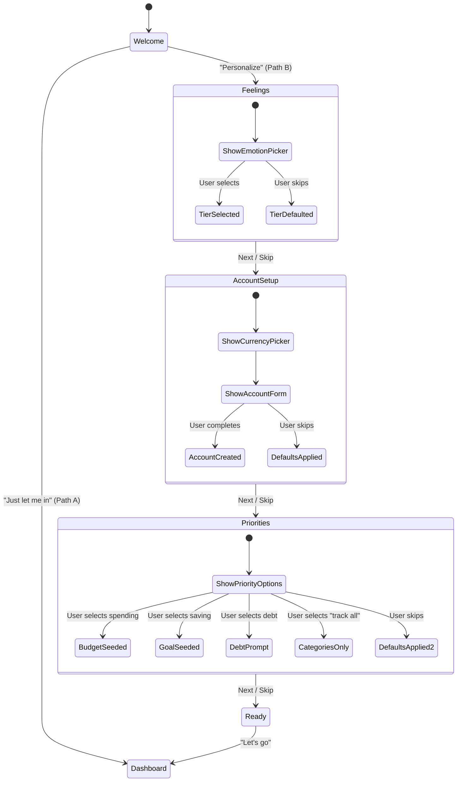

# Architecture Design: First-Time User Onboarding Flow

> **Issue:** [#768](https://github.com/nicholasgubbins/finance/issues/768) (Sprint 3)
> **Status:** PROPOSED — Pending human review
> **Date:** 2025-07-26
> **Author:** System Architect (AI agent)
> **Related:** #385 (Two-path onboarding), ADR-0001 (KMP), ADR-0003 (Local Storage), Product Identity § 5

---

## Table of Contents

1. [Overview](#1-overview)
2. [Design Principles](#2-design-principles)
3. [Onboarding Paths](#3-onboarding-paths)
4. [Data Flow Architecture](#4-data-flow-architecture)
5. [Component Hierarchy](#5-component-hierarchy)
6. [State Management](#6-state-management)
7. [Shared KMP Interfaces](#7-shared-kmp-interfaces)
8. [Accessibility Requirements](#8-accessibility-requirements)
9. [Offline Behavior](#9-offline-behavior)
10. [Post-Onboarding Nudges](#10-post-onboarding-nudges)
11. [Platform-Specific Adaptations](#11-platform-specific-adaptations)
12. [Testing Strategy](#12-testing-strategy)
13. [Open Questions](#13-open-questions)

---

## 1. Overview

The onboarding flow is a user's first experience with Finance. Its purpose is to
get users to a moment of value — "I understand my money better" — as quickly as
possible. The flow must work entirely offline, respect all accessibility
requirements, and avoid any manipulative patterns.

### Goals

1. User reaches a personalized dashboard within **2 minutes** or fewer
2. User creates their **first account** with a balance
3. User optionally adds their **first transaction**
4. User optionally creates their **first budget category**
5. User feels **accomplishment**, not overwhelm

### Non-Goals

- Bank connection setup (deferred; no third-party dependency on first launch)
- Account creation / sign-up (auth is orthogonal — onboarding works pre-auth)
- Feature tutorials (contextual education replaces upfront tutorials)

---

## 2. Design Principles

These principles are drawn directly from the project's UX principles and product
identity and applied specifically to onboarding:

| Principle                         | Application to Onboarding                                                                                       |
| --------------------------------- | --------------------------------------------------------------------------------------------------------------- |
| **Edge-first**                    | Entire flow runs locally. No network calls. No loading spinners. Instant.                                       |
| **Non-manipulative**              | Every step is skippable. No "Are you sure?" on skip. No progress bars that guilt users into completing.         |
| **Emotion-first, not form-first** | Lead with "How do you feel about money?" not "Enter your bank account number."                                  |
| **Useful within 2 minutes**       | Path A ("Just let me in") reaches dashboard in < 5 seconds. Path B completes in < 90 seconds.                   |
| **Accessible**                    | WCAG 2.2 AA. Full screen reader support. Keyboard navigable. Reduced motion respected. Large touch targets.     |
| **Resumable**                     | If the user kills the app mid-onboarding, they resume where they left off — state persists to MMKV immediately. |

---

## 3. Onboarding Paths

Per Product Identity § 5 and #385, two paths are offered:

### Path A: "Just let me in"

Zero-friction entry for users who want to explore on their own.

```
┌─────────────────┐     ┌──────────────┐
│  Welcome Screen │────▶│  Dashboard   │
│                 │     │ (Comfortable │
│ [Just let me in]│     │   tier)      │
│ [Personalize]   │     └──────────────┘
└─────────────────┘
         │
         ▼ (if "Personalize" tapped)
     Path B...
```

**Behavior:**

- Currency auto-detected from device locale
- Expertise tier defaults to 📊 Comfortable
- Creates a default household with a single "Cash" account (balance $0)
- Seeds default expense categories (Food, Transport, Housing, Utilities, Entertainment, Other)
- Drops user directly onto the Home Dashboard
- Post-onboarding nudge cards appear on dashboard

### Path B: "Personalize my experience"

A 3–4 step emotion-first flow (every step skippable):

```
┌─────────────┐    ┌────────────────────┐    ┌──────────────────┐    ┌──────────────┐
│  Step 1:    │    │  Step 2:           │    │  Step 3:         │    │  Step 4:     │
│  How do you │───▶│  Currency +        │───▶│  What matters    │───▶│  You're      │
│  feel about │    │  First Account     │    │  most to you?    │    │  ready!      │
│  money?     │    │                    │    │                  │    │              │
│  [Skip]     │    │  [Skip]            │    │  [Skip]          │    │ [Go →]       │
└─────────────┘    └────────────────────┘    └──────────────────┘    └──────────────┘
```

#### Step 1: "How do you feel about your money?"

Determines the expertise tier via an emotion-first question — not "What's your
financial expertise level?" (intimidating) but "How do you feel?"

| Answer                                     | Maps To            | Rationale                                |
| ------------------------------------------ | ------------------ | ---------------------------------------- |
| 😰 "I avoid thinking about it"             | 🌱 Getting Started | Needs maximum guidance, simplified views |
| 🤔 "I track it but want more clarity"      | 📊 Comfortable     | Has habits, wants better tools           |
| 📊 "I've got a system, I want power tools" | 🧠 Advanced        | Experienced, wants detailed control      |

**If skipped:** Defaults to 📊 Comfortable (same as Path A).

#### Step 2: Currency + First Account (combined)

- Currency picker pre-populated from locale (user can change)
- Account name and type picker (Checking, Savings, Credit Card, Cash)
- Current balance entry via numeric keypad
- Account name has smart default based on type (e.g., "My Checking")

**If skipped:** Uses locale currency, creates default Cash account at $0.

#### Step 3: "What matters most to you?"

Seeds the first budget category and optional goal:

| Answer                             | Seeds                                                   |
| ---------------------------------- | ------------------------------------------------------- |
| 🍽️ "Spending less on dining out"   | Budget: "Food" category with suggested amount           |
| 🏠 "Saving for something big"      | Goal: user names it, sets target (no deadline required) |
| 💳 "Paying off debt"               | Prompt to add a Credit Card / Loan account              |
| 📋 "Just want to track everything" | Seeds broad category set, no specific budget/goal       |

**If skipped:** Seeds default category set (same as Path A).

#### Step 4: "You're ready!"

- Summary of what was set up (account, currency, tier)
- Non-judgmental affirmation: _"You've taken the first step toward financial clarity."_
- Single CTA button: "Let's go" → Dashboard

---

## 4. Data Flow Architecture

### 4.1 Data Flow Diagram

```
┌──────────────────────────────────────────────────────────────────────────┐
│                          Platform UI Layer                               │
│  ┌────────────────────────────────────────────────────────────────────┐  │
│  │  OnboardingScreen (SwiftUI / Compose / React / Compose Desktop)   │  │
│  │  • Renders current step                                           │  │
│  │  • Captures user selections                                       │  │
│  │  • Delegates ALL logic to shared KMP layer                        │  │
│  └──────────────┬───────────────────────────────────────┬────────────┘  │
│                 │ User actions                          │ UI State       │
│                 ▼                                       ▲                │
├─────────────────────────────────────────────────────────────────────────┤
│                        Shared KMP Layer                                 │
│  ┌──────────────────────────────────────────────────────────────────┐   │
│  │                  OnboardingCoordinator                            │   │
│  │  • Pure Kotlin in commonMain                                     │   │
│  │  • Manages step progression state machine                        │   │
│  │  • Validates user input per step                                 │   │
│  │  • Emits OnboardingState via StateFlow                           │   │
│  └──────┬──────────────────────────┬──────────────────────┬─────────┘   │
│         │                          │                      │             │
│         ▼                          ▼                      ▼             │
│  ┌──────────────┐  ┌───────────────────────┐  ┌────────────────────┐   │
│  │ Onboarding   │  │ OnboardingDataSeeder  │  │ OnboardingState    │   │
│  │ Validator    │  │                       │  │ Persister          │   │
│  │              │  │ • Creates default     │  │                    │   │
│  │ • Currency   │  │   household           │  │ • Saves progress   │   │
│  │   validation │  │ • Seeds categories    │  │   to MMKV          │   │
│  │ • Account    │  │ • Creates first       │  │ • Enables resume   │   │
│  │   validation │  │   account             │  │   on app restart   │   │
│  │ • Budget amt │  │ • Sets up budget/goal │  │                    │   │
│  │   validation │  │                       │  │                    │   │
│  └──────────────┘  └───────────┬───────────┘  └────────┬───────────┘   │
│                                │                       │               │
│                                ▼                       ▼               │
│                    ┌───────────────────┐   ┌───────────────────────┐   │
│                    │  SQLDelight       │   │  MMKV / Multiplatform │   │
│                    │  (Local DB)       │   │  Settings             │   │
│                    │                   │   │                       │   │
│                    │ • Accounts table  │   │ • onboarding_complete │   │
│                    │ • Categories table│   │ • onboarding_step     │   │
│                    │ • Budgets table   │   │ • expertise_tier      │   │
│                    │ • Goals table     │   │ • selected_currency   │   │
│                    └───────────────────┘   └───────────────────────┘   │
└──────────────────────────────────────────────────────────────────────────┘
```

### 4.2 Data Written During Onboarding

| Data Entity           | Storage     | When Written                   | Sync Behavior                   |
| --------------------- | ----------- | ------------------------------ | ------------------------------- |
| Expertise tier        | MMKV        | Step 1 completion (or default) | Not synced (local preference)   |
| Default currency      | MMKV + User | Step 2 completion (or default) | Syncs with user profile         |
| Household             | SQLDelight  | Onboarding completion          | Syncs when user authenticates   |
| First account         | SQLDelight  | Step 2 completion (or default) | Syncs via `by_household` bucket |
| Default categories    | SQLDelight  | Onboarding completion          | Syncs via `by_household` bucket |
| First budget          | SQLDelight  | Step 3 (if chosen)             | Syncs via `by_household` bucket |
| First goal            | SQLDelight  | Step 3 (if chosen)             | Syncs via `by_household` bucket |
| Onboarding progress   | MMKV        | After each step                | Not synced (ephemeral)          |
| `onboarding_complete` | MMKV        | Final step                     | Not synced (device-local flag)  |

---

## 5. Component Hierarchy

### 5.1 Shared KMP Components (packages/core)

```
packages/core/src/commonMain/kotlin/com/finance/core/onboarding/
├── OnboardingCoordinator.kt       ← State machine + step orchestration
├── OnboardingState.kt             ← Sealed class for UI state
├── OnboardingStep.kt              ← Enum of all steps
├── OnboardingValidator.kt         ← Input validation per step
├── OnboardingDataSeeder.kt        ← Creates default data entities
├── ExpertiseTier.kt               ← Enum: GETTING_STARTED, COMFORTABLE, ADVANCED
├── OnboardingPreferences.kt       ← MMKV persistence interface
└── DefaultCategorySet.kt          ← Default category definitions
```

### 5.2 Platform UI Components (per app)

Each platform implements its own UI using the shared `OnboardingCoordinator`:

```
apps/<platform>/onboarding/
├── OnboardingContainerScreen      ← Hosts step navigation, progress indicator
├── WelcomeScreen                  ← Path choice: "Just let me in" / "Personalize"
├── FeelingsStepScreen             ← Step 1: Emotion picker
├── AccountSetupStepScreen         ← Step 2: Currency + account
├── PrioritiesStepScreen           ← Step 3: What matters most
├── ReadyScreen                    ← Step 4: Summary + CTA
└── OnboardingViewModel            ← Platform ViewModel wrapping OnboardingCoordinator
```

### 5.3 Screen Flow Diagram



---

## 6. State Management

### 6.1 OnboardingState (Sealed Class Hierarchy)

```kotlin
sealed interface OnboardingState {
    /** Initial state — show welcome/path choice screen. */
    data object Welcome : OnboardingState

    /** Personalization flow steps. */
    data class PersonalizeStep(
        val step: OnboardingStep,
        val stepData: StepData,
        val canGoBack: Boolean,
    ) : OnboardingState

    /** Onboarding complete — navigate to dashboard. */
    data class Complete(
        val summary: OnboardingSummary,
    ) : OnboardingState
}

enum class OnboardingStep {
    FEELINGS,        // Step 1
    ACCOUNT_SETUP,   // Step 2
    PRIORITIES,      // Step 3
    READY,           // Step 4
}
```

### 6.2 StepData (per-step input state)

```kotlin
sealed interface StepData {
    data class FeelingsData(
        val selectedFeeling: FinancialFeeling? = null,
    ) : StepData

    data class AccountSetupData(
        val currency: Currency = Currency.USD,  // Auto-detected
        val accountName: String = "",
        val accountType: AccountType = AccountType.CHECKING,
        val initialBalance: Cents = Cents.ZERO,
        val validationErrors: List<ValidationError> = emptyList(),
    ) : StepData

    data class PrioritiesData(
        val selectedPriority: FinancialPriority? = null,
        val budgetAmount: Cents? = null,
        val goalName: String? = null,
        val goalTarget: Cents? = null,
    ) : StepData

    data object ReadyData : StepData
}

enum class FinancialFeeling {
    AVOIDANT,    // Maps to 🌱 Getting Started
    CURIOUS,     // Maps to 📊 Comfortable
    CONFIDENT,   // Maps to 🧠 Advanced
}

enum class FinancialPriority {
    REDUCE_SPENDING,   // Seeds budget
    SAVE_FOR_GOAL,     // Seeds goal
    PAY_OFF_DEBT,      // Prompts loan/CC account
    TRACK_EVERYTHING,  // Seeds broad categories
}
```

### 6.3 State Persistence Strategy

Onboarding state is persisted to MMKV after every step transition so the flow
is resumable if the app is killed:

```kotlin
// Keys in MMKV / Multiplatform Settings
object OnboardingKeys {
    const val IS_COMPLETE = "onboarding_complete"          // Boolean
    const val CURRENT_STEP = "onboarding_current_step"     // String (enum name)
    const val SELECTED_PATH = "onboarding_selected_path"   // "A" | "B"
    const val EXPERTISE_TIER = "onboarding_expertise_tier"  // String (enum name)
    const val CURRENCY_CODE = "onboarding_currency_code"   // String (ISO 4217)
    const val ACCOUNT_NAME = "onboarding_account_name"     // String
    const val ACCOUNT_TYPE = "onboarding_account_type"     // String (enum name)
    const val INITIAL_BALANCE = "onboarding_balance_cents"  // Long
    const val PRIORITY = "onboarding_priority"             // String (enum name)
}
```

### 6.4 State Machine Transitions

```
┌──────────┐   selectPathA()     ┌────────────┐
│ Welcome  │────────────────────▶│ Complete   │ (with defaults)
│          │   selectPathB()     │            │
│          │──────┐              └────────────┘
└──────────┘      │
                  ▼
           ┌──────────────┐  next()/skip()   ┌──────────────────┐
           │ FEELINGS     │─────────────────▶│ ACCOUNT_SETUP    │
           └──────────────┘                  └────────┬─────────┘
                  ▲                                   │ next()/skip()
                  │ back()                            ▼
                  │                          ┌──────────────────┐
                  ├──────────────────────────│ PRIORITIES       │
                  │                          └────────┬─────────┘
                  │                                   │ next()/skip()
                  │                                   ▼
                  │                          ┌──────────────────┐
                  └──────────────────────────│ READY            │
                                             └────────┬─────────┘
                                                      │ finish()
                                                      ▼
                                             ┌──────────────────┐
                                             │ Complete         │
                                             └──────────────────┘
```

---

## 7. Shared KMP Interfaces

These interfaces live in `packages/core/src/commonMain/` and are consumed by
all platform UI layers.

### 7.1 OnboardingCoordinator

```kotlin
// packages/core/src/commonMain/kotlin/com/finance/core/onboarding/OnboardingCoordinator.kt

/**
 * Orchestrates the onboarding flow as a state machine.
 *
 * Platform ViewModels observe [state] and call action methods to drive
 * transitions. All business logic (validation, data seeding, persistence)
 * is encapsulated here — platform code only renders UI and dispatches actions.
 */
class OnboardingCoordinator(
    private val preferences: OnboardingPreferences,
    private val dataSeeder: OnboardingDataSeeder,
    private val validator: OnboardingValidator,
    private val localeProvider: LocaleProvider,
) {
    private val _state = MutableStateFlow<OnboardingState>(OnboardingState.Welcome)
    val state: StateFlow<OnboardingState> = _state.asStateFlow()

    /** Initialize — check if onboarding was previously started. */
    fun initialize()

    /** Path A: skip personalization, apply defaults, go to dashboard. */
    suspend fun selectQuickStart()

    /** Path B: begin personalization flow. */
    fun selectPersonalize()

    /** Advance to next step, saving current step's data. */
    suspend fun next(stepData: StepData)

    /** Skip current step with defaults. */
    suspend fun skip()

    /** Go back to previous step. */
    fun back()

    /** Complete onboarding, seed all data, mark complete. */
    suspend fun finish(): OnboardingSummary
}
```

### 7.2 OnboardingDataSeeder

```kotlin
// packages/core/src/commonMain/kotlin/com/finance/core/onboarding/OnboardingDataSeeder.kt

/**
 * Creates default data entities during onboarding.
 * All writes go to local SQLDelight database (edge-first).
 */
class OnboardingDataSeeder(
    private val accountRepository: AccountRepository,
    private val categoryRepository: CategoryRepository,
    private val budgetRepository: BudgetRepository,
    private val goalRepository: GoalRepository,
    private val householdRepository: HouseholdRepository,
) {
    /** Create default household for the user. */
    suspend fun createDefaultHousehold(userId: SyncId): Household

    /** Seed default expense/income categories. */
    suspend fun seedDefaultCategories(householdId: SyncId): List<Category>

    /** Create the user's first account. */
    suspend fun createFirstAccount(
        householdId: SyncId,
        name: String,
        type: AccountType,
        currency: Currency,
        initialBalance: Cents,
    ): Account

    /** Create first budget from priority selection. */
    suspend fun createFirstBudget(
        householdId: SyncId,
        categoryId: SyncId,
        amount: Cents,
        currency: Currency,
    ): Budget

    /** Create first goal from priority selection. */
    suspend fun createFirstGoal(
        householdId: SyncId,
        name: String,
        targetAmount: Cents,
        currency: Currency,
    ): Goal

    /** Apply all defaults for Path A (quick start). */
    suspend fun applyDefaults(userId: SyncId, currency: Currency): OnboardingSummary
}
```

### 7.3 OnboardingValidator

```kotlin
// packages/core/src/commonMain/kotlin/com/finance/core/onboarding/OnboardingValidator.kt

/**
 * Validates user input at each onboarding step.
 * Returns structured errors suitable for UI display.
 */
object OnboardingValidator {
    /** Validate account setup inputs. */
    fun validateAccountSetup(
        name: String,
        type: AccountType,
        balance: Cents,
    ): List<ValidationError>

    /** Validate budget amount. */
    fun validateBudgetAmount(amount: Cents): List<ValidationError>

    /** Validate goal inputs. */
    fun validateGoal(
        name: String,
        targetAmount: Cents,
    ): List<ValidationError>
}

sealed interface ValidationError {
    val field: String
    val messageKey: String  // Localization key

    data class Required(override val field: String) : ValidationError {
        override val messageKey = "validation.required"
    }
    data class TooLong(override val field: String, val maxLength: Int) : ValidationError {
        override val messageKey = "validation.too_long"
    }
    data class InvalidAmount(override val field: String) : ValidationError {
        override val messageKey = "validation.invalid_amount"
    }
}
```

### 7.4 ExpertiseTier

```kotlin
// packages/core/src/commonMain/kotlin/com/finance/core/onboarding/ExpertiseTier.kt

/**
 * User's financial expertise level. Affects terminology, visible features,
 * default views, notification style, and chart complexity.
 *
 * See Product Identity § 3 for full behavior specification.
 */
enum class ExpertiseTier {
    /** 🌱 Plain language, simplified views, guided prompts. */
    GETTING_STARTED,
    /** 📊 Standard terminology, full feature set. Default. */
    COMFORTABLE,
    /** 🧠 Technical terms, detailed breakdowns, power-user shortcuts. */
    ADVANCED;

    companion object {
        fun fromFeeling(feeling: FinancialFeeling): ExpertiseTier = when (feeling) {
            FinancialFeeling.AVOIDANT -> GETTING_STARTED
            FinancialFeeling.CURIOUS -> COMFORTABLE
            FinancialFeeling.CONFIDENT -> ADVANCED
        }

        /** Default tier for Path A and skipped Step 1. */
        val DEFAULT = COMFORTABLE
    }
}
```

### 7.5 LocaleProvider (expect/actual)

```kotlin
// packages/core/src/commonMain/kotlin/com/finance/core/onboarding/LocaleProvider.kt

/**
 * Platform-specific locale detection for currency auto-detection.
 */
expect class LocaleProvider {
    /** Returns the ISO 4217 currency code for the device's locale. */
    fun detectCurrency(): Currency

    /** Returns the device's language code (e.g., "en", "es"). */
    fun languageCode(): String
}
```

### 7.6 OnboardingPreferences (expect/actual)

```kotlin
// packages/core/src/commonMain/kotlin/com/finance/core/onboarding/OnboardingPreferences.kt

/**
 * Persists onboarding state to key-value storage (MMKV / Multiplatform Settings).
 * Enables resuming onboarding after app restart.
 */
expect class OnboardingPreferences {
    fun isOnboardingComplete(): Boolean
    fun setOnboardingComplete(complete: Boolean)
    fun getCurrentStep(): OnboardingStep?
    fun setCurrentStep(step: OnboardingStep)
    fun getExpertiseTier(): ExpertiseTier
    fun setExpertiseTier(tier: ExpertiseTier)
    fun getSelectedCurrency(): Currency
    fun setSelectedCurrency(currency: Currency)
    fun clearOnboardingState()
}
```

### 7.7 DefaultCategorySet

```kotlin
// packages/core/src/commonMain/kotlin/com/finance/core/onboarding/DefaultCategorySet.kt

/**
 * Default categories seeded during onboarding.
 * Localized category names are resolved at the platform layer via string resources.
 *
 * Categories follow the hierarchical model defined in the Category data class:
 * top-level groups with optional subcategories.
 */
object DefaultCategorySet {
    /** Expense categories seeded for all users. */
    val expenseCategories = listOf(
        DefaultCategory(nameKey = "category.food", icon = "fork.knife", sortOrder = 0),
        DefaultCategory(nameKey = "category.transport", icon = "car", sortOrder = 1),
        DefaultCategory(nameKey = "category.housing", icon = "house", sortOrder = 2),
        DefaultCategory(nameKey = "category.utilities", icon = "bolt", sortOrder = 3),
        DefaultCategory(nameKey = "category.entertainment", icon = "film", sortOrder = 4),
        DefaultCategory(nameKey = "category.health", icon = "heart", sortOrder = 5),
        DefaultCategory(nameKey = "category.shopping", icon = "bag", sortOrder = 6),
        DefaultCategory(nameKey = "category.other", icon = "ellipsis", sortOrder = 7),
    )

    /** Income categories seeded for all users. */
    val incomeCategories = listOf(
        DefaultCategory(nameKey = "category.salary", icon = "banknote", sortOrder = 0, isIncome = true),
        DefaultCategory(nameKey = "category.other_income", icon = "plus.circle", sortOrder = 1, isIncome = true),
    )
}

data class DefaultCategory(
    val nameKey: String,
    val icon: String,
    val sortOrder: Int,
    val isIncome: Boolean = false,
)
```

---

## 8. Accessibility Requirements

All requirements derived from `docs/design/accessibility-patterns.md` and
`docs/design/ux-principles.md` Principle 4.

### 8.1 Screen Reader Support

- Each step has a unique screen title announced on navigation
- Emotion picker options include descriptive accessibility labels:
  - 😰 → "I avoid thinking about my finances — recommended for beginners"
  - 🤔 → "I track my finances but want more clarity — recommended for most users"
  - 📊 → "I have a financial system and want power tools — for experienced users"
- All form fields have associated labels (not placeholder-only)
- Skip buttons have clear labels: "Skip this step" (not just "Skip")
- Progress indicator announces "Step N of 4" on navigation

### 8.2 Keyboard Navigation

- Full keyboard navigation on all platforms
- Logical tab order: content → primary action → secondary action (skip)
- Focus trapped within current step (no tabbing to hidden steps)
- Enter/Return activates primary action, Escape activates back/skip

### 8.3 Visual Accessibility

- Touch targets: minimum 44×44pt (iOS) / 48×48dp (Android)
- All text respects Dynamic Type / font scaling up to 200%
- Emotion icons are decorative (backed by text labels)
- Currency amounts displayed in locale-appropriate format
- Supports Dark Mode, Light Mode, and High Contrast modes

### 8.4 Cognitive Accessibility

- Maximum 3 options per step (no decision overload)
- Plain language throughout (no financial jargon)
- Every step shows only one question / one action
- Progress is visible but not pressuring (no "Step 2 of 4 — 50% complete!")
- Instead, use subtle step indicators (dots) without percentage

### 8.5 Motion

- Step transitions use simple cross-fade (not sliding animations)
- `prefers-reduced-motion` eliminates all transitions entirely
- No auto-advancing steps — user explicitly taps to proceed

---

## 9. Offline Behavior

Onboarding is **entirely offline by design**. No network calls are made.

| Aspect                | Behavior                                                                          |
| --------------------- | --------------------------------------------------------------------------------- |
| Network requirement   | None. Onboarding works on airplane mode.                                          |
| Data creation         | All entities written to local SQLDelight database.                                |
| Currency detection    | From device locale (no GeoIP or API call).                                        |
| State persistence     | MMKV — survives app kill / force close.                                           |
| Sync after onboarding | When user authenticates and goes online, data syncs via PowerSync `by_household`. |
| Multi-device scenario | If user onboards on two devices before auth, household merge on first sync.       |

---

## 10. Post-Onboarding Nudges

After onboarding completes, non-nagging dismissible task cards appear on the
Home Dashboard. These replace any features skipped during onboarding.

### Task Card System

```kotlin
/**
 * Post-onboarding nudge cards shown on dashboard.
 * Each card is dismissible and tracks completion state in MMKV.
 */
data class OnboardingNudge(
    val id: String,
    val titleKey: String,      // Localization key
    val descriptionKey: String,
    val actionKey: String,     // "Add account", "Set budget", etc.
    val deepLink: String,      // Navigation destination
    val priority: Int,         // Display order
    val isComplete: Boolean,
    val isDismissed: Boolean,
)
```

### Default Nudges

| Nudge ID          | Title                    | Shown When                   | Completes When        |
| ----------------- | ------------------------ | ---------------------------- | --------------------- |
| `add_account`     | "Add your first account" | No accounts (beyond default) | User creates account  |
| `add_transaction` | "Record a transaction"   | No transactions exist        | User adds transaction |
| `set_budget`      | "Set a spending plan"    | No budgets exist             | User creates budget   |
| `set_goal`        | "Set a savings goal"     | No goals exist               | User creates goal     |
| `setup_progress`  | "Complete your setup"    | < 3 nudges completed         | 3+ nudges completed   |

### Design Rules

- Maximum 2 nudge cards visible at once (Clarity Over Completeness)
- Cards use non-judgmental, encouraging language
- Dismissing a card is permanent — it never returns
- Cards disappear automatically when their condition is met
- No nudge notifications — cards are passive, dashboard-only

---

## 11. Platform-Specific Adaptations

### iOS (SwiftUI)

- Navigation via `NavigationStack` with custom `OnboardingPath` enum
- Step transitions as `.sheet` or inline depending on step
- Haptic feedback (`.impact(.light)`) on step completion
- SF Symbols for emotion and priority icons
- Respects `UIAccessibility.isReduceMotionEnabled`

### Android (Jetpack Compose)

- Navigation via `NavHost` with composable destinations per step
- `FloatingActionButton`-style primary actions where appropriate
- Material 3 dynamic color for branded experience
- Material Icons for emotion and priority icons
- Respects `Settings.Global.ANIMATOR_DURATION_SCALE`

### Web (React + KMP bindings)

- URL-routable steps (`/onboarding/welcome`, `/onboarding/feelings`, etc.)
- Browser back/forward maps to step back/forward
- Keyboard-first: tab through options, Enter to select
- `prefers-reduced-motion` CSS media query
- Semantic HTML5: `<main>`, `<form>`, `<fieldset>`, `<legend>` per step

### Windows (Compose Desktop)

- Window-centered card layout (not full-screen)
- System accent color integration
- Narrator landmarks for each step region
- High Contrast mode support
- Keyboard: Tab/Shift+Tab navigation, Space/Enter activation

---

## 12. Testing Strategy

### 12.1 Shared KMP Unit Tests

| Test Area                  | Location                        | Scope                                                    |
| -------------------------- | ------------------------------- | -------------------------------------------------------- |
| State machine transitions  | `packages/core/src/commonTest/` | All valid and invalid state transitions                  |
| Input validation           | `packages/core/src/commonTest/` | Account name, balance, budget amount, goal edge cases    |
| Data seeding               | `packages/core/src/commonTest/` | Default categories, household creation, account creation |
| Tier mapping               | `packages/core/src/commonTest/` | Feeling → ExpertiseTier mapping                          |
| State persistence / resume | `packages/core/src/commonTest/` | Kill app at each step, verify resume                     |
| Skip behavior              | `packages/core/src/commonTest/` | Skip every step, verify correct defaults applied         |

### 12.2 Platform UI Tests

- Path A: one tap to dashboard, verify defaults created
- Path B: complete all steps, verify all data created
- Path B: skip every step, verify defaults applied
- Accessibility: screen reader announces each step title
- Accessibility: keyboard-only navigation through entire flow
- Resume: force-kill at each step, relaunch, verify correct step

### 12.3 Edge Case Tests

- Device locale is unsupported currency → fallback to USD
- User enters $0 balance → allowed (valid starting point)
- User enters negative balance → allowed for credit cards
- User goes back from Step 3 to Step 1 → data preserved
- Extremely long account name → validation error at 50 chars

---

## 13. Open Questions

| #   | Question                                                                                  | Impact | Decision Needed By |
| --- | ----------------------------------------------------------------------------------------- | ------ | ------------------ |
| 1   | Should Path A create a default "Cash" account, or no account at all?                      | Medium | Sprint 3 start     |
| 2   | Should the expertise tier be changeable from Settings after onboarding?                   | Low    | Sprint 3           |
| 3   | How should multi-device onboarding merge work? (User onboards on phone, then tablet)      | High   | Sprint 4           |
| 4   | Should onboarding include a brief privacy explanation? ("Your data stays on this device") | Medium | Sprint 3 start     |
| 5   | Should the "Ready" screen show an animated summary or a static card?                      | Low    | Sprint 3           |

---

## References

- [Product Identity § 5: Onboarding Philosophy](../design/product-identity.md)
- [UX Principles](../design/ux-principles.md)
- [Personas: Journey 1 — First-time setup](../design/personas.md)
- [Information Architecture: Onboarding screens](../design/information-architecture.md)
- [ADR-0001: KMP Cross-Platform Framework](./0001-cross-platform-framework.md)
- [ADR-0003: Local Storage Strategy (MMKV + SQLDelight)](./0003-local-storage-strategy.md)
- [Accessibility Patterns](../design/accessibility-patterns.md)
