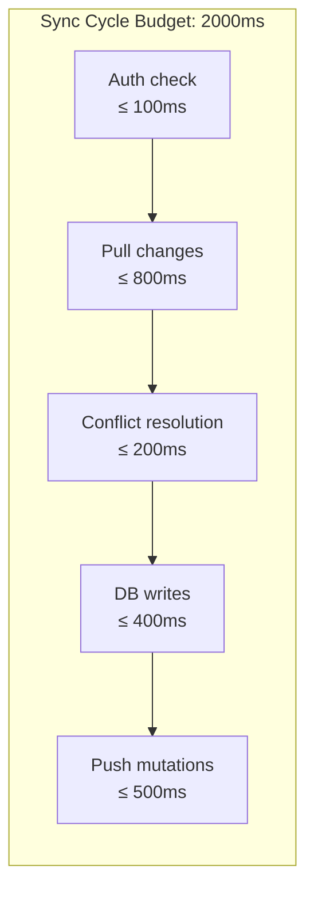
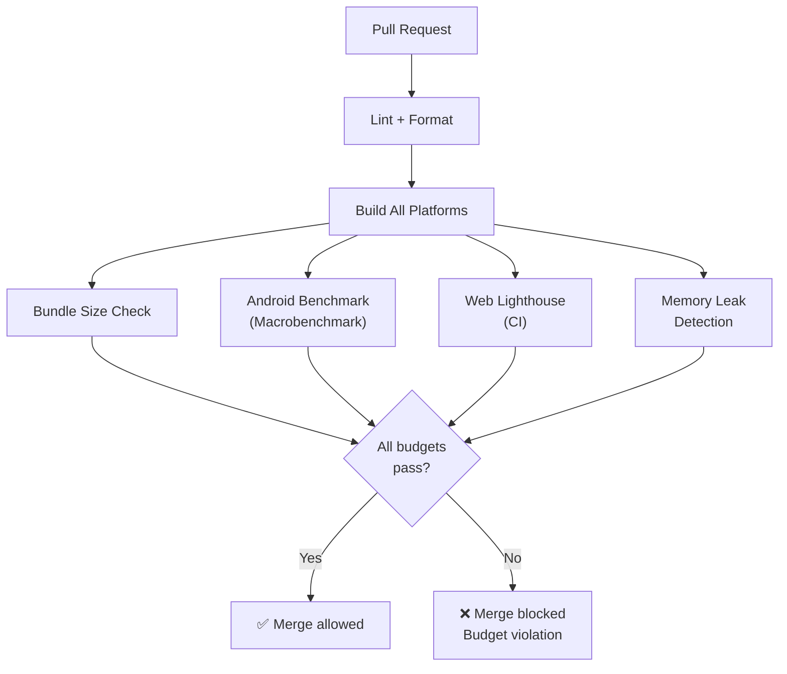
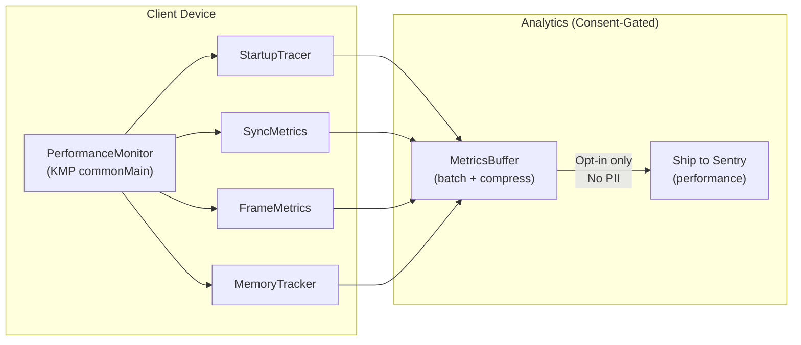
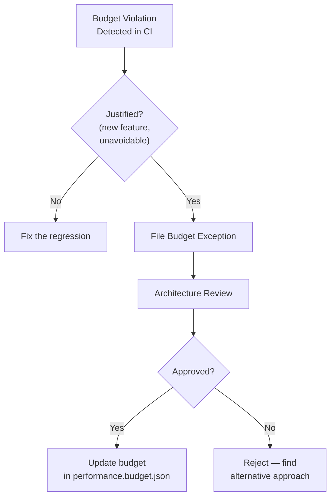

# Performance Budget Architecture

**Status:** Proposed
**Date:** 2025-07-28
**Author:** System Architect (AI agent)
**Reviewers:** Pending human review
**Sprint:** W2-S8
**Related:** [Performance Baselines](./performance-baselines.md) · [Monitoring Architecture](./monitoring.md) · [ADR-0001: Cross-Platform Framework](./0001-cross-platform-framework.md) · [ADR-0011: Scaling Architecture](./0011-scaling-architecture.md)

---

## Overview

This document defines the **performance budget architecture** for Finance — a framework of hard limits, measurement methodology, and enforcement mechanisms that prevent performance regressions across all four platforms. It extends the existing [Performance Baselines](./performance-baselines.md) with:

1. **Budget categories** — startup, sync, rendering, memory, network, and battery
2. **Platform-specific limits** calibrated to reference devices
3. **CI enforcement gates** that block merges on budget violations
4. **Runtime monitoring** that detects regressions in production
5. **Budget review cadence** and escalation policy

### Why Performance Budgets?

Financial apps compete on trust. Trust requires **perceived responsiveness** — users equate slow apps with unreliable apps. A budget architecture enforces this:

| Without Budgets                         | With Budgets                               |
| --------------------------------------- | ------------------------------------------ |
| Regressions discovered by users         | Regressions blocked in CI                  |
| "It feels slow" — no measurement        | Quantified metrics per platform            |
| Performance is a sprint goal, sometimes | Performance is a merge requirement, always |
| Platform-specific issues hidden         | Per-platform gates with reference devices  |

---

## 1. Budget Categories & Limits

### 1.1 App Startup Budget

Time from user action (tap icon / open URL) to interactive first frame.

```mermaid
gantt
    title Cold Start Budget Breakdown (2000ms total)
    dateFormat X
    axisFormat %Lms

    section Android (2000ms)
    Process init + DI       :a1, 0, 400
    SQLCipher open          :a2, after a1, 300
    First query             :a3, after a2, 200
    UI render               :a4, after a3, 300
    Interactive             :milestone, after a4, 0
    Budget headroom (800ms) :a5, after a4, 800

    section iOS (1500ms)
    Process init + DI       :i1, 0, 300
    Keychain + SQLCipher    :i2, after i1, 250
    First query             :i3, after i2, 150
    UI render               :i4, after i3, 250
    Interactive             :milestone, after i4, 0
    Budget headroom (550ms) :i5, after i4, 550
```



| Metric                     | Android  | iOS      | Web            | Windows  | Source                                              |
| -------------------------- | -------- | -------- | -------------- | -------- | --------------------------------------------------- |
| **Cold start**             | ≤ 2000ms | ≤ 1500ms | ≤ 2000ms       | ≤ 2000ms | [Performance Baselines](./performance-baselines.md) |
| **Warm start**             | ≤ 500ms  | ≤ 500ms  | ≤ 300ms        | ≤ 500ms  | [Performance Baselines](./performance-baselines.md) |
| **DI initialization**      | ≤ 400ms  | ≤ 300ms  | ≤ 200ms        | ≤ 400ms  | New                                                 |
| **SQLCipher open**         | ≤ 300ms  | ≤ 250ms  | ≤ 300ms        | ≤ 300ms  | New                                                 |
| **First meaningful paint** | ≤ 1200ms | ≤ 900ms  | ≤ 1500ms (LCP) | ≤ 1200ms | New                                                 |

**Reference devices:**

| Platform | Reference Device                     | Why                                                 |
| -------- | ------------------------------------ | --------------------------------------------------- |
| Android  | Pixel 6a (Tensor G1, 6GB)            | Mid-range, widely available, represents median user |
| iOS      | iPhone 13 (A15 Bionic, 4GB)          | 2-gen-old baseline; covers 90%+ of active iPhones   |
| Web      | Chrome on 4-core laptop, 4G throttle | Lighthouse mobile preset simulates constrained net  |
| Windows  | Surface Go 3 (Pentium Gold, 4GB)     | Low-end Windows target; budget 2-in-1               |

### 1.2 Sync Cycle Budget

Time for a complete pull → resolve → push cycle.

| Metric                    | Budget                | Measurement                         |
| ------------------------- | --------------------- | ----------------------------------- |
| **Full sync (initial)**   | ≤ 10s (1000 records)  | First sync after account creation   |
| **Delta sync (typical)**  | ≤ 2s (≤ 50 changes)   | Periodic background sync            |
| **Delta sync (large)**    | ≤ 5s (50–500 changes) | After extended offline period       |
| **Conflict resolution**   | ≤ 100ms per conflict  | Per-record resolution time          |
| **Push (mutation batch)** | ≤ 1s (≤ 50 mutations) | Queued mutations sent to server     |
| **Sync queue drain**      | ≤ 30s (500 mutations) | Full queue flush after long offline |



### 1.3 UI Rendering Budget

| Metric                            | Android | iOS     | Web     | Windows |
| --------------------------------- | ------- | ------- | ------- | ------- |
| **Frame rate (scrolling)**        | ≥ 60fps | ≥ 60fps | ≥ 60fps | ≥ 60fps |
| **Frame rate (animations)**       | ≥ 60fps | ≥ 60fps | ≥ 60fps | ≥ 60fps |
| **Jank frames** (> 16.7ms)        | < 1%    | < 1%    | < 5%    | < 1%    |
| **Dashboard load**                | ≤ 200ms | ≤ 200ms | ≤ 200ms | ≤ 200ms |
| **Transaction list (1000 items)** | ≤ 100ms | ≤ 100ms | ≤ 150ms | ≤ 100ms |
| **Chart render**                  | ≤ 300ms | ≤ 300ms | ≤ 500ms | ≤ 300ms |
| **Input latency**                 | ≤ 100ms | ≤ 100ms | ≤ 100ms | ≤ 100ms |

### 1.4 Memory Budget

| Metric               | Android | iOS     | Web     | Windows |
| -------------------- | ------- | ------- | ------- | ------- |
| **Baseline (idle)**  | ≤ 80MB  | ≤ 60MB  | ≤ 100MB | ≤ 120MB |
| **Peak (heavy use)** | ≤ 150MB | ≤ 120MB | ≤ 200MB | ≤ 200MB |
| **Background**       | ≤ 30MB  | ≤ 25MB  | N/A     | ≤ 50MB  |
| **AI model loaded**  | +50MB   | +50MB   | +80MB   | +50MB   |
| **Memory leak rate** | 0 MB/hr | 0 MB/hr | 0 MB/hr | 0 MB/hr |
| **SQLite cache**     | ≤ 20MB  | ≤ 20MB  | ≤ 30MB  | ≤ 20MB  |

### 1.5 Network Budget

| Metric                       | Budget             | Rationale                        |
| ---------------------------- | ------------------ | -------------------------------- |
| **Sync payload (typical)**   | ≤ 10KB compressed  | 50 records × ~200 bytes each     |
| **Sync payload (initial)**   | ≤ 500KB compressed | 1000 records full download       |
| **API response (single)**    | ≤ 5KB              | Edge Function responses are lean |
| **App bundle (Web)**         | ≤ 500KB gzip       | Core JS + WASM SQLite            |
| **App bundle (Android APK)** | ≤ 15MB             | Play Store download size         |
| **App bundle (iOS IPA)**     | ≤ 20MB             | App Store download size          |
| **AI model download**        | ≤ 80MB total       | All models combined; on-demand   |
| **Background sync / hour**   | ≤ 50KB             | Battery-conscious sync           |

### 1.6 Battery Budget

| Metric                    | Android   | iOS      | Notes                                              |
| ------------------------- | --------- | -------- | -------------------------------------------------- |
| **Background sync CPU**   | ≤ 2% avg  | ≤ 2% avg | Measured over 1 hour with sync every 15min         |
| **Active use battery/hr** | ≤ 5%      | ≤ 5%     | Typical usage pattern (dashboard, add transaction) |
| **Wake locks**            | 0 (perm.) | N/A      | No persistent wake locks; use WorkManager/BGTask   |

---

## 2. CI Enforcement Architecture

### 2.1 Gate Strategy



### 2.2 Budget Checks Per Platform

| Check             | Platform  | Tool                       | CI Runner            | Gate Level                       |
| ----------------- | --------- | -------------------------- | -------------------- | -------------------------------- |
| Cold start time   | Android   | Macrobenchmark             | Self-hosted + device | **Hard** — blocks merge          |
| Cold start time   | iOS       | XCTest + MetricKit         | macOS runner         | **Soft** — warning only          |
| Bundle size       | Web       | `bundlesize` npm           | Ubuntu               | **Hard** — blocks merge          |
| Lighthouse scores | Web       | Lighthouse CI              | Ubuntu               | **Hard** — blocks merge          |
| Bundle size       | Android   | APK Analyzer gradle task   | Ubuntu               | **Hard** — blocks merge          |
| Memory leaks      | Android   | LeakCanary in instrumented | Self-hosted          | **Hard** — blocks merge          |
| SQLite query time | All (KMP) | JVM benchmark suite        | Ubuntu               | **Soft** — warning at 80% budget |
| Frame rate        | Android   | Macrobenchmark UI tests    | Self-hosted          | **Soft** — warning only          |

### 2.3 Budget Configuration File

The existing `performance.budget.json` at repo root is extended:

```jsonc
{
  "$schema": "https://finance.app/performance-budget.schema.json",
  "version": "2.0.0",
  "targets": {
    "coldStart": {
      "android": { "max": "2000ms", "device": "Pixel 6a", "gate": "hard" },
      "ios": { "max": "1500ms", "device": "iPhone 13", "gate": "soft" },
      "web": { "max": "2000ms", "throttle": "4G", "gate": "hard" },
      "windows": { "max": "2000ms", "device": "Surface Go 3", "gate": "soft" },
    },
    "syncCycle": {
      "deltaSync": { "max": "2000ms", "records": 50, "gate": "hard" },
      "fullSync": { "max": "10000ms", "records": 1000, "gate": "soft" },
    },
    "rendering": {
      "scrollFps": { "min": 60, "jankThreshold": "1%", "gate": "soft" },
      "dashboardLoad": { "max": "200ms", "gate": "hard" },
      "chartRender": { "max": "300ms", "gate": "soft" },
    },
    "memory": {
      "baseline": {
        "android": { "max": "80MB", "gate": "hard" },
        "ios": { "max": "60MB", "gate": "soft" },
        "web": { "max": "100MB", "gate": "hard" },
        "windows": { "max": "120MB", "gate": "soft" },
      },
      "leakRate": { "max": "0MB/hr", "gate": "hard" },
    },
    "bundle": {
      "web": { "max": "500KB", "compression": "gzip", "gate": "hard" },
      "android": { "max": "15MB", "gate": "hard" },
      "ios": { "max": "20MB", "gate": "soft" },
    },
  },
  "web": {
    "lighthouseBudget": "apps/web/budget.json",
    "lighthouseMinScores": {
      "performance": 90,
      "accessibility": 95,
      "bestPractices": 90,
    },
  },
}
```

### 2.4 Enforcement Workflow

```yaml
# .github/workflows/performance-budget.yml
name: Performance Budget Gate
on:
  pull_request:
    paths:
      - 'apps/**'
      - 'packages/**'
      - 'performance.budget.json'

jobs:
  bundle-size:
    runs-on: ubuntu-latest
    steps:
      - uses: actions/checkout@v4
      - name: Build web bundle
        run: cd apps/web && npm run build
      - name: Check bundle size
        run: npx bundlesize --config performance.budget.json
      - name: Build Android APK
        run: ./gradlew :apps:android:assembleRelease
      - name: Check APK size
        run: node tools/check-apk-size.js --max 15MB

  android-benchmark:
    runs-on: [self-hosted, android-device]
    steps:
      - uses: actions/checkout@v4
      - name: Run Macrobenchmark
        run: ./gradlew :benchmark:connectedAndroidTest
      - name: Parse results
        run: node tools/parse-benchmark.js --budget performance.budget.json
      - name: Comment PR with results
        uses: actions/github-script@v7
        with:
          script: |
            // Post benchmark results as PR comment

  lighthouse:
    runs-on: ubuntu-latest
    steps:
      - uses: actions/checkout@v4
      - name: Build web app
        run: cd apps/web && npm run build
      - name: Lighthouse CI
        run: npx lhci autorun
        env:
          LHCI_BUILD_CONTEXT__CURRENT_HASH: ${{ github.sha }}

  memory-check:
    runs-on: [self-hosted, android-device]
    steps:
      - uses: actions/checkout@v4
      - name: Run instrumented tests with LeakCanary
        run: ./gradlew :apps:android:connectedDebugAndroidTest -Pleakcanary=true
```

---

## 3. Runtime Monitoring

### 3.1 Client-Side Performance Collection



**KMP Interface:**

```kotlin
// packages/core/src/commonMain/kotlin/com/finance/core/monitoring/PerformanceMonitor.kt
interface PerformanceMonitor {
    fun startTrace(name: String): TraceHandle
    fun recordMetric(name: String, value: Double, unit: MetricUnit)
    fun checkBudget(metric: String, value: Double): BudgetResult

    data class BudgetResult(
        val metric: String,
        val value: Double,
        val budget: Double,
        val status: BudgetStatus,  // WITHIN, WARNING, EXCEEDED
    )
}

enum class BudgetStatus {
    WITHIN,     // < 80% of budget
    WARNING,    // 80-100% of budget
    EXCEEDED,   // > budget
}
```

### 3.2 Alerting Thresholds

| Metric          | P2 Alert (Warning) | P1 Alert (Regression) | Source             |
| --------------- | ------------------ | --------------------- | ------------------ |
| Cold start P95  | > 80% of budget    | > 100% of budget      | Sentry Performance |
| Sync cycle P95  | > 80% of budget    | > 100% of budget      | sync_health_logs   |
| Jank frame rate | > 3%               | > 5%                  | Sentry Performance |
| Memory P95      | > 80% of budget    | > 100% of budget      | Sentry Performance |
| Bundle size     | > 90% of budget    | > 100% of budget      | CI check           |
| Crash-free rate | < 99.5%            | < 99%                 | Sentry             |

---

## 4. Budget Review & Escalation

### 4.1 Review Cadence

| Frequency     | Activity                            | Outcome                           |
| ------------- | ----------------------------------- | --------------------------------- |
| **Every PR**  | CI budget gates run                 | Auto-block or warning             |
| **Weekly**    | Review Sentry performance dashboard | Identify trends                   |
| **Monthly**   | Budget review meeting               | Adjust budgets if warranted       |
| **Quarterly** | Reference device update             | Re-benchmark on new baseline      |
| **Yearly**    | Full budget recalibration           | Account for hardware improvements |

### 4.2 Budget Exception Process

When a feature legitimately requires exceeding a budget:



**Budget Exception Record:**

```markdown
## Budget Exception: [Feature Name]

- **Date:** YYYY-MM-DD
- **Metric:** [e.g., Web bundle size]
- **Current budget:** 500KB
- **Requested budget:** 600KB
- **Reason:** AI model WASM loader adds 80KB
- **Mitigation:** Lazy-load model; split chunk; tree-shake
- **New budget:** 550KB (after mitigation)
- **Review date:** YYYY-MM-DD (re-evaluate in 90 days)
```

---

## 5. Platform-Specific Measurement Guides

### 5.1 Android

| Metric      | Tool                                  | How                                          |
| ----------- | ------------------------------------- | -------------------------------------------- |
| Cold start  | Macrobenchmark `StartupBenchmark`     | `StartupMode.COLD`, `CompilationMode.Full()` |
| Frame rate  | Macrobenchmark `FrameTimingBenchmark` | Scroll `LazyColumn`, measure frame durations |
| Memory      | Android Studio Profiler               | Heap dump after 5-min active use             |
| Bundle size | `./gradlew analyzeReleaseBundle`      | APK Analyzer output                          |
| Leaks       | LeakCanary in instrumented tests      | Automatic detection, CI-integrated           |

### 5.2 iOS

| Metric      | Tool                               | How                                             |
| ----------- | ---------------------------------- | ----------------------------------------------- |
| Cold start  | Instruments App Launch template    | Time Profiler from process start to first frame |
| Frame rate  | Instruments Core Animation         | Scroll main list, measure frame drops           |
| Memory      | Instruments Leaks + Allocations    | 5-min active use, check for growth              |
| Bundle size | Xcode Archive → App Store estimate | Post-thinning size per device class             |

### 5.3 Web

| Metric      | Tool                                   | How                                                |
| ----------- | -------------------------------------- | -------------------------------------------------- |
| Cold start  | Lighthouse CI                          | TTI + LCP scores                                   |
| Frame rate  | Chrome DevTools Performance tab        | Record scroll, check frame timeline                |
| Memory      | Chrome DevTools Memory tab             | Heap snapshot comparison (before/after navigation) |
| Bundle size | `bundlesize` + webpack-bundle-analyzer | Per-chunk analysis                                 |
| Core Vitals | `web-vitals` library                   | CLS < 0.1, LCP < 2.5s, INP < 200ms                 |

### 5.4 Windows

| Metric      | Tool                               | How                                   |
| ----------- | ---------------------------------- | ------------------------------------- |
| Cold start  | Custom `System.nanoTime()` in init | Log from entry to first Compose frame |
| Frame rate  | JVM Flight Recorder                | Measure Compose frame rendering       |
| Memory      | VisualVM / JFR                     | Track heap usage over time            |
| Bundle size | MSIX package size                  | Post-compression installer size       |

---

## 6. Performance Budget Dashboard

### 6.1 Dashboard Specification

A Grafana-compatible dashboard showing:

```
┌─────────────────────────────────────────────────────────────────┐
│                    Finance Performance Dashboard                 │
├─────────────────┬─────────────────┬─────────────────────────────┤
│ Cold Start P95  │ Sync Cycle P95  │ Crash-Free Rate             │
│ 🟢 1.2s / 2.0s │ 🟡 1.8s / 2.0s │ 🟢 99.7%                   │
│ (Android)       │ (all platforms) │                             │
├─────────────────┴─────────────────┴─────────────────────────────┤
│ Bundle Sizes                              Memory Usage          │
│ Web:  420KB / 500KB  🟢                   Android: 72MB / 80MB 🟡│
│ APK:  12MB  / 15MB   🟢                   iOS:     48MB / 60MB 🟢│
│ iOS:  16MB  / 20MB   🟢                   Web:     85MB /100MB 🟡│
├─────────────────────────────────────────────────────────────────┤
│ 7-Day Trend: Cold Start (P95)                                   │
│ ▁▂▂▃▃▂▂ (stable)                                               │
│                                                                 │
│ 7-Day Trend: Sync Cycle (P95)                                   │
│ ▁▁▂▃▅▅▆ (⚠️ upward trend — investigate)                        │
└─────────────────────────────────────────────────────────────────┘
```

### 6.2 Status Colors

| Color     | Meaning            | Threshold        |
| --------- | ------------------ | ---------------- |
| 🟢 Green  | Within budget      | < 80% of limit   |
| 🟡 Yellow | Approaching budget | 80–100% of limit |
| 🔴 Red    | Budget exceeded    | > 100% of limit  |

## References

- [Performance Baselines](./performance-baselines.md) — existing target metrics
- [Monitoring Architecture](./monitoring.md) — Sentry integration details
- [Alerting Rules](./alerting-rules.md) — P0–P3 alert definitions
- [ADR-0001: Cross-Platform Framework](./0001-cross-platform-framework.md) — platform choices
- [ADR-0011: Scaling Architecture](./0011-scaling-architecture.md) — server-side performance
- [ADR-0014: AI/ML Pipeline](./0014-ai-ml-pipeline-architecture.md) — model size budgets
- [performance.budget.json](../../performance.budget.json) — machine-readable budget config
- [Google Web Vitals](https://web.dev/vitals/)
- [Android Macrobenchmark](https://developer.android.com/topic/performance/benchmarking/macrobenchmark-overview)
