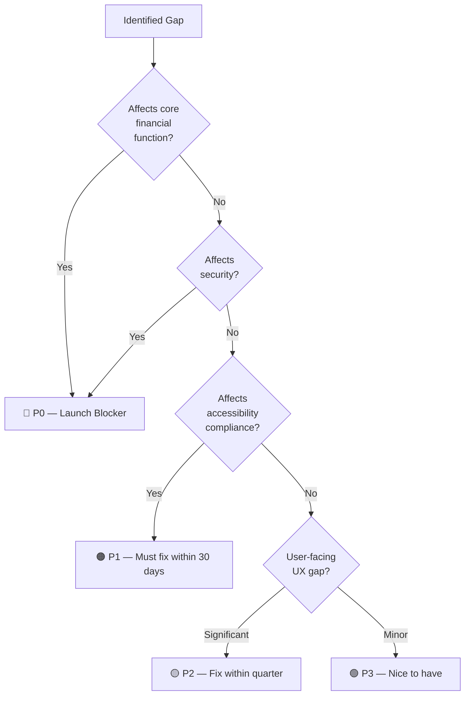
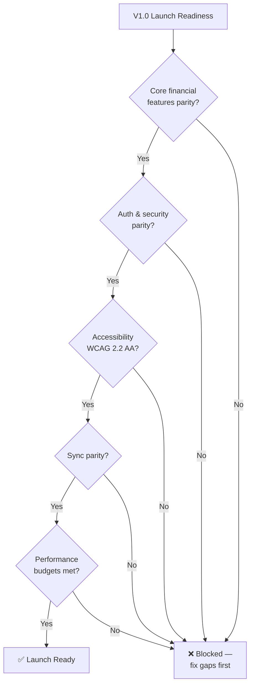
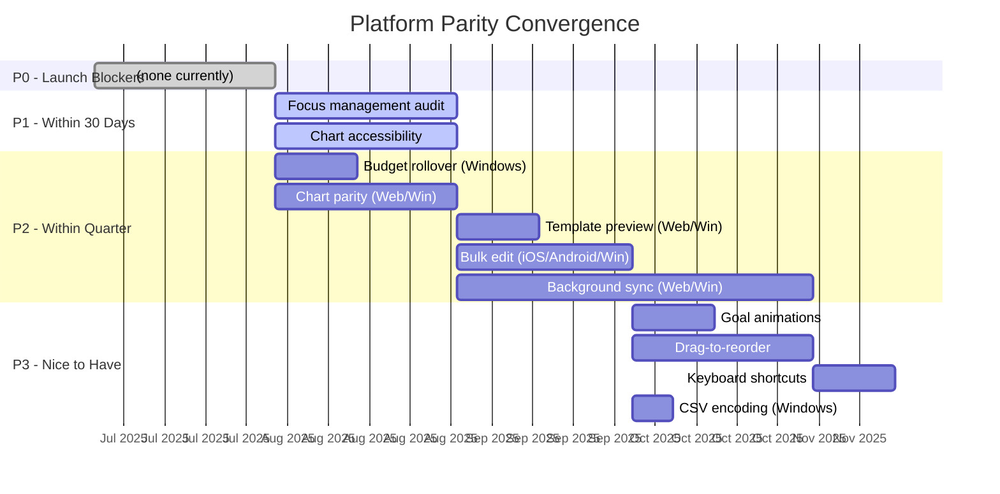

# Platform Parity Analysis

**Status:** Proposed
**Date:** 2025-07-28
**Author:** System Architect (AI agent)
**Reviewers:** Pending human review
**Sprint:** W2-S9
**Related:** [ADR-0001: Cross-Platform Framework](./0001-cross-platform-framework.md) · [Performance Baselines](./performance-baselines.md) · [Roadmap](./roadmap.md)

---

## Overview

Finance targets four platforms: **iOS**, **Android**, **Web (PWA)**, and **Windows**. The KMP architecture (ADR-0001) shares business logic across all four, but UI, platform integrations, and native capabilities vary. This document analyzes the current state of feature parity, identifies gaps, prioritizes convergence, and defines the **Minimum Viable Parity (MVP)** — the feature set that must be consistent across all platforms before public launch.

### Parity Philosophy

Not all features need to exist on all platforms. The decision framework:

1. **Core financial features** → Must be identical on all platforms (non-negotiable)
2. **Platform-enhanced features** → Core available everywhere; enhanced on platforms with native support
3. **Platform-exclusive features** → Only on platforms where the capability exists (e.g., Widgets, Complications)

---

## 1. Feature Parity Matrix

### 1.1 Core Financial Features (Must Be Identical)

```mermaid
quadrantChart
    title Feature Parity: Core Financial Functions
    x-axis Low Implementation --> Full Implementation
    y-axis Low Priority --> High Priority
    quadrant-1 Urgent Gaps
    quadrant-2 On Track
    quadrant-3 Low Priority Gaps
    quadrant-4 Completed
    Transaction CRUD (all): [0.95, 0.95]
    Account Management: [0.90, 0.90]
    Budget Tracking: [0.85, 0.85]
    Category Management: [0.88, 0.80]
    Goal Tracking: [0.80, 0.75]
    Recurring Transactions: [0.75, 0.70]
    CSV Import: [0.70, 0.60]
    Multi-Currency: [0.30, 0.65]
    Reports & Charts: [0.65, 0.80]
```

| Feature                    | iOS        | Android    | Web                            | Windows                    | Gap Analysis                      |
| -------------------------- | ---------- | ---------- | ------------------------------ | -------------------------- | --------------------------------- |
| **Transaction CRUD**       | ✅ Full    | ✅ Full    | ✅ Full                        | ✅ Full                    | Parity achieved                   |
| **Account management**     | ✅ Full    | ✅ Full    | ✅ Full                        | ⚠️ Missing drag-reorder    | Minor UI gap                      |
| **Budget tracking**        | ✅ Full    | ✅ Full    | ✅ Full                        | ⚠️ Missing rollover toggle | Logic exists in KMP; UI gap       |
| **Category management**    | ✅ Full    | ✅ Full    | ⚠️ No subcategory drag-reorder | ⚠️ Same as web             | Web/Windows UI enhancement needed |
| **Goal tracking**          | ✅ Full    | ✅ Full    | ⚠️ No progress animation       | ⚠️ No progress animation   | Visual polish gap                 |
| **Recurring transactions** | ✅ Full    | ✅ Full    | ⚠️ No template preview         | ⚠️ No template preview     | Feature gap                       |
| **CSV import**             | ✅ Full    | ✅ Full    | ✅ Full                        | ⚠️ Limited encoding        | Edge case gap                     |
| **Multi-currency**         | 🔴 V2      | 🔴 V2      | 🔴 V2                          | 🔴 V2                      | V2 feature (ADR-0010)             |
| **Reports / charts**       | ✅ Charts  | ✅ Charts  | ⚠️ Basic charts                | ⚠️ Basic charts            | Web/Windows need chart parity     |
| **Search**                 | ✅ Full    | ✅ Full    | ✅ Full                        | ✅ Full                    | Parity achieved                   |
| **Bulk transaction edit**  | ⚠️ Planned | ⚠️ Planned | ✅ Full                        | ⚠️ Planned                 | Web leads; others need catch-up   |

### 1.2 Sync & Offline Features

| Feature                    | iOS                | Android        | Web                         | Windows               | Notes                               |
| -------------------------- | ------------------ | -------------- | --------------------------- | --------------------- | ----------------------------------- |
| **Offline CRUD**           | ✅                 | ✅             | ✅                          | ✅                    | Core architecture — parity achieved |
| **Background sync**        | ✅ BGTaskScheduler | ✅ WorkManager | ⚠️ Service Worker (limited) | ⚠️ Background (basic) | Web/Windows sync less reliable      |
| **Sync status indicator**  | ✅                 | ✅             | ✅                          | ✅                    | Parity achieved                     |
| **Conflict resolution UI** | 🔴 Planned         | 🔴 Planned     | 🔴 Planned                  | 🔴 Planned            | ADR-0018 defines architecture       |
| **Selective sync**         | ✅                 | ✅             | ✅                          | ✅                    | PowerSync bucket-based — parity     |

### 1.3 Authentication & Security

| Feature                   | iOS                | Android               | Web                      | Windows          | Notes                          |
| ------------------------- | ------------------ | --------------------- | ------------------------ | ---------------- | ------------------------------ |
| **Passkeys (WebAuthn)**   | ✅ ASAuthorization | ✅ Credential Manager | ✅ navigator.credentials | ✅ Windows Hello | Parity achieved (ADR-0004)     |
| **OAuth (Google/Apple)**  | ✅                 | ✅                    | ✅                       | ✅               | Parity achieved                |
| **Biometric auth**        | ✅ Face/Touch ID   | ✅ BiometricPrompt    | ❌ N/A                   | ⚠️ Windows Hello | Platform capability difference |
| **SQLCipher encryption**  | ✅                 | ✅                    | ✅ (WASM)                | ✅               | Parity achieved                |
| **Keystore/Keychain**     | ✅ Keychain        | ✅ AndroidKeyStore    | ⚠️ IndexedDB (limited)   | ✅ DPAPI/TPM     | Web has weaker key storage     |
| **Device attestation**    | ✅ App Attest      | ✅ Play Integrity     | ❌ N/A                   | ⚠️ TPM (basic)   | Platform capability difference |
| **RASP (root/jailbreak)** | ✅                 | ✅                    | ❌ N/A                   | ⚠️ Basic         | Mobile-focused security        |

### 1.4 Platform Integration Features

| Feature                       | iOS                | Android        | Web              | Windows                | Notes                 |
| ----------------------------- | ------------------ | -------------- | ---------------- | ---------------------- | --------------------- |
| **Home screen widgets**       | ✅ WidgetKit       | ✅ App Widgets | ❌ N/A           | ⚠️ Planned             | Mobile advantage      |
| **Watch companion**           | ⚠️ Planned         | ⚠️ Planned     | ❌ N/A           | ❌ N/A                 | Future V2             |
| **Notifications**             | ✅ APNs            | ✅ FCM         | ✅ Web Push      | ⚠️ Toast notifications | Mostly parity         |
| **Share sheet**               | ✅                 | ✅             | ⚠️ Web Share API | ⚠️ Basic               | Platform-dependent    |
| **Deep links**                | ✅ Universal Links | ✅ App Links   | ✅ URL routing   | ⚠️ Protocol handler    | Mostly parity         |
| **Haptic feedback**           | ✅                 | ✅             | ❌ N/A           | ❌ N/A                 | Mobile-exclusive      |
| **Dark mode**                 | ✅                 | ✅             | ✅               | ✅                     | Parity achieved       |
| **Dynamic type / font scale** | ✅                 | ✅             | ✅               | ✅                     | Parity achieved       |
| **Split-screen / multitask**  | ✅ iPad            | ✅ Foldables   | ✅ Responsive    | ✅ Window resize       | All platforms support |
| **Keyboard shortcuts**        | ⚠️ iPad only       | ⚠️ Limited     | ✅ Full          | ✅ Full                | Desktop/Web lead      |
| **Drag and drop**             | ⚠️ iPad            | ⚠️ Limited     | ✅               | ✅                     | Desktop/Web lead      |

### 1.5 Accessibility

| Feature                 | iOS          | Android        | Web                       | Windows        | Notes                       |
| ----------------------- | ------------ | -------------- | ------------------------- | -------------- | --------------------------- |
| **Screen reader**       | ✅ VoiceOver | ✅ TalkBack    | ✅ ARIA                   | ✅ Narrator    | WCAG 2.2 AA required        |
| **Dynamic type**        | ✅           | ✅             | ✅                        | ✅             | Parity achieved             |
| **Reduce motion**       | ✅           | ✅             | ✅ prefers-reduced-motion | ✅             | Parity achieved             |
| **High contrast**       | ✅           | ✅             | ✅ prefers-contrast       | ✅             | Parity achieved             |
| **Focus management**    | ✅           | ⚠️ Needs audit | ✅                        | ⚠️ Needs audit | Android/Windows need review |
| **Chart accessibility** | ⚠️ Basic     | ⚠️ Basic       | ⚠️ Basic                  | ⚠️ Basic       | All need improvement        |

---

## 2. Gap Analysis & Priority

### 2.1 Gap Severity Classification



### 2.2 Prioritized Gap List

| #   | Gap                                    | Platforms Affected    | Severity | Effort | Sprint Target |
| --- | -------------------------------------- | --------------------- | -------- | ------ | ------------- |
| 1   | Chart parity (missing chart types)     | Web, Windows          | P2       | Medium | V1.1          |
| 2   | Recurring template preview             | Web, Windows          | P2       | Small  | V1.1          |
| 3   | Budget rollover toggle                 | Windows               | P2       | Small  | V1.0          |
| 4   | Drag-to-reorder (accounts, categories) | Web, Windows          | P3       | Medium | V1.2          |
| 5   | Goal progress animations               | Web, Windows          | P3       | Small  | V1.1          |
| 6   | Bulk transaction editing               | iOS, Android, Windows | P2       | Medium | V1.1          |
| 7   | Background sync reliability            | Web, Windows          | P2       | Large  | V1.1          |
| 8   | Focus management audit                 | Android, Windows      | P1       | Medium | V1.0          |
| 9   | Chart accessibility (screen reader)    | All                   | P1       | Medium | V1.0          |
| 10  | CSV encoding support                   | Windows               | P3       | Small  | V1.1          |
| 11  | Keyboard shortcuts                     | iOS (iPad), Android   | P3       | Small  | V1.2          |
| 12  | Conflict resolution UI                 | All                   | P2       | Large  | V1.5          |

### 2.3 Effort vs Impact Matrix

```mermaid
quadrantChart
    title Gap Prioritization: Effort vs Impact
    x-axis Low Effort --> High Effort
    y-axis Low Impact --> High Impact
    quadrant-1 Plan Carefully
    quadrant-2 Do First
    quadrant-3 Deprioritize
    quadrant-4 Quick Wins
    Budget rollover (Win): [0.2, 0.5]
    Chart accessibility: [0.5, 0.8]
    Focus management: [0.5, 0.7]
    Chart parity: [0.6, 0.6]
    Bulk edit parity: [0.6, 0.55]
    Template preview: [0.3, 0.4]
    Goal animations: [0.25, 0.3]
    Background sync: [0.8, 0.7]
    Conflict resolution UI: [0.9, 0.6]
    Drag reorder: [0.5, 0.25]
    CSV encoding: [0.2, 0.15]
    Keyboard shortcuts: [0.35, 0.2]
```

---

## 3. Minimum Viable Parity (MVP)

### 3.1 Definition

**Minimum Viable Parity** is the feature set that must be consistent across all four platforms before public launch. A user switching between platforms must be able to perform all core financial tasks without discovering missing functionality.

### 3.2 MVP Feature Set

| Category          | Feature                                      | Requirement      | Status              |
| ----------------- | -------------------------------------------- | ---------------- | ------------------- |
| **Transactions**  | CRUD, search, filter, sort                   | Identical        | ✅                  |
| **Accounts**      | CRUD, balance display, reorder               | Identical        | ⚠️ Windows reorder  |
| **Budgets**       | CRUD, period tracking, rollover              | Identical        | ⚠️ Windows rollover |
| **Categories**    | CRUD, hierarchy, icons                       | Identical        | ✅                  |
| **Goals**         | CRUD, progress tracking                      | Identical        | ✅                  |
| **Recurring**     | Templates, generation, preview               | Identical        | ⚠️ Web/Win preview  |
| **Reports**       | Monthly summary, category breakdown, trends  | Identical        | ⚠️ Web/Win charts   |
| **CSV Import**    | Upload, map columns, preview, import         | Identical        | ⚠️ Windows encoding |
| **Sync**          | Offline CRUD, sync indicator, conflicts      | Identical        | ✅                  |
| **Auth**          | Passkeys, OAuth, biometric (where avail.)    | Platform-adapted | ✅                  |
| **Security**      | Encryption at rest, secure key storage       | Platform-adapted | ✅                  |
| **Accessibility** | Screen reader, dynamic type, high contrast   | WCAG 2.2 AA      | ⚠️ Focus + charts   |
| **Household**     | Invite, roles, shared data                   | Identical        | ✅                  |
| **Settings**      | Profile, preferences, export, delete account | Identical        | ✅                  |

### 3.3 Launch Parity Checklist



### 3.4 Acceptable Platform Differences

These differences are **by design** and do not count as parity gaps:

| Difference                            | Reason                                   | Acceptable? |
| ------------------------------------- | ---------------------------------------- | ----------- |
| Biometric auth absent on Web          | Browsers don't support device biometrics | ✅ Yes      |
| Widgets absent on Web                 | PWAs don't support home screen widgets   | ✅ Yes      |
| Haptic feedback absent on Web/Windows | No haptic hardware                       | ✅ Yes      |
| Device attestation absent on Web      | No trusted execution environment         | ✅ Yes      |
| Background sync less reliable on Web  | Service Worker limitations               | ⚠️ V1 OK    |
| Navigation style differences          | Native conventions (tab bar vs sidebar)  | ✅ Yes      |

---

## 4. Convergence Roadmap

### 4.1 Timeline



### 4.2 Platform Parity Score

A simple tracking metric: `(features at parity / total features) × 100`

| Platform | Current Score | Target (V1.0) | Target (V1.5) |
| -------- | ------------- | ------------- | ------------- |
| iOS      | 95%           | 98%           | 100%          |
| Android  | 93%           | 98%           | 100%          |
| Web      | 82%           | 92%           | 97%           |
| Windows  | 78%           | 90%           | 95%           |

### 4.3 Convergence Principles

1. **KMP-first fixes** — If a gap exists because shared logic is missing, fix it in `packages/core` so all platforms benefit simultaneously
2. **Don't chase 100%** — Platform-exclusive features (widgets, haptics) are strengths, not gaps
3. **Accessibility is non-negotiable** — WCAG 2.2 AA on all platforms before launch
4. **Measure, don't guess** — Track parity score monthly; review in sprint planning
5. **Web and Windows lag is expected** — Mobile platforms had more development time; invest in catching up

---

## 5. Feature Parity Governance

### 5.1 Parity Review Process

Every new feature must include a **parity impact assessment** in the PR description:

```markdown
## Parity Impact

- [ ] This feature is implemented on all platforms
- [ ] OR: This feature is platform-specific (explain why)
- [ ] OR: Issues filed for missing platforms: #xxx, #yyy
```

### 5.2 Parity Dashboard

Track parity status on the project board with labels:

| Label              | Meaning                                      |
| ------------------ | -------------------------------------------- |
| `parity/gap`       | Feature exists on some platforms but not all |
| `parity/blocker`   | Gap that blocks launch                       |
| `parity/tracked`   | Gap documented and scheduled                 |
| `parity/by-design` | Platform difference that is intentional      |

## References

- [ADR-0001: Cross-Platform Framework](./0001-cross-platform-framework.md)
- [ADR-0004: Auth & Security Architecture](./0004-auth-security-architecture.md)
- [ADR-0010: V2 Architecture Vision](./0010-v2-architecture-vision.md)
- [Performance Baselines](./performance-baselines.md)
- [Launch Readiness](./launch-readiness.md)
- [Roadmap](./roadmap.md)
- [WCAG 2.2 — W3C](https://www.w3.org/TR/WCAG22/)
