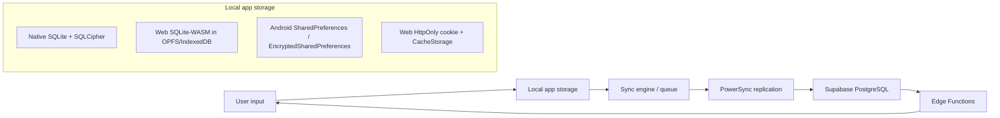

# Privacy Compliance Audit — v1.0

**Date:** 2026-03-15  
**Regulations:** GDPR (EU), CCPA/CPRA (California)  
**Status:** Initial audit — not launch ready

## Executive Summary

Finance has a solid privacy foundation in a few areas: row-level security is enabled on core Supabase tables, native local databases are designed around SQLCipher, web auth tokens are intentionally kept out of `localStorage`, and the codebase includes dedicated export and account-deletion endpoints plus a crypto-shredding abstraction. Evidence includes RLS policies for `users`, `households`, `accounts`, `transactions`, `budgets`, and `goals` in `services/api/supabase/migrations/20260306000002_rls_policies.sql:35-239`, native encrypted database factories in `packages/models/src/commonMain/kotlin/com/finance/db/DatabaseFactory.kt:8-16`, `packages/models/src/androidMain/kotlin/com/finance/db/DatabaseFactory.android.kt:13-33`, `packages/models/src/iosMain/kotlin/com/finance/db/DatabaseFactory.ios.kt:8-31`, and web token handling rules in `apps/web/src/auth/token-storage.ts:8-24`.

The current implementation is still materially short of GDPR/CCPA readiness. The biggest blockers are: incomplete DSAR/export coverage, incomplete and partly stubbed deletion/crypto-shredding, no implemented consent capture or consent records, no published privacy policy or CCPA notice, undefined retention schedules for most personal data, browser-side storage of financial data in OPFS/IndexedDB without an implemented encryption layer, and service-worker caching of API responses that may contain personal or financial data. Existing project docs already note the policy gap in `docs/architecture/0009-legal-monetization-analysis.md:580-589` and launch requirements in `docs/guides/launch-checklist.md:65-70`.

**Estimated compliance:** GDPR ~42%, CCPA/CPRA ~46%, overall ~44%.

## Data Inventory (#361)

### Personal Data Collected

| Data Type                           | Fields                                                                                                                                      | Storage Location                                                                    | Legal Basis                                                      | Retention                                                        |
| ----------------------------------- | ------------------------------------------------------------------------------------------------------------------------------------------- | ----------------------------------------------------------------------------------- | ---------------------------------------------------------------- | ---------------------------------------------------------------- |
| User profile                        | `email`, `displayName`, `avatarUrl`, `defaultCurrency`                                                                                      | Local SQLite `user` table and Supabase `users` table                                | Contract (account creation, authentication, app personalization) | Not defined in code; effectively account lifetime until deletion |
| Household metadata                  | `name`, `ownerId` / `created_by`                                                                                                            | Local SQLite `household` table and Supabase `households` table                      | Contract; legitimate interest for shared household management    | Not defined                                                      |
| Household membership                | `userId`, `role`, `joinedAt`, timestamps                                                                                                    | Local SQLite `household_member` table and Supabase `household_members` table        | Contract                                                         | Not defined                                                      |
| Accounts                            | `name`, `type`, `currency`, `currentBalance`, cosmetic metadata                                                                             | Local SQLite `account` table and Supabase `accounts` table                          | Contract                                                         | Not defined / user-controlled until deletion                     |
| Transactions                        | `amount`, `currency`, `payee`, `note`, `date`, `tags`, recurrence metadata, transfer links                                                  | Local SQLite `transaction` table and Supabase `transactions` table                  | Contract                                                         | Not defined / user-controlled until deletion                     |
| Budgets                             | `name`, `amount`, `period`, `date range`, `categoryId`                                                                                      | Local SQLite `budget` table and Supabase `budgets` table                            | Contract                                                         | Not defined                                                      |
| Goals                               | `name`, `targetAmount`, `currentAmount`, `targetDate`, `status`, `accountId`                                                                | Local SQLite `goal` table and Supabase `goals` table                                | Contract                                                         | Not defined                                                      |
| Categories                          | `name`, `icon`, `color`, `parentId`, `isIncome`                                                                                             | Local SQLite `category` table and Supabase `categories` table                       | Contract                                                         | Not defined                                                      |
| Passkey credentials                 | `credential_id`, `public_key`, `counter`, `device_type`, `backed_up`, `transports`                                                          | Supabase `passkey_credentials`                                                      | Contract; legitimate interest/security for passwordless auth     | Until account deletion; no explicit retention schedule           |
| Household invitations               | `invite_code`, `invited_email`, `invited_by`, `accepted_by`, `role`, `expires_at`                                                           | Supabase `household_invitations`                                                    | Contract; legitimate interest for household collaboration        | Intended expiry (`expires_at`), but no purge job found           |
| WebAuthn challenges                 | `challenge`, `user_id`, `type`, `expires_at`                                                                                                | Supabase `webauthn_challenges`                                                      | Legitimate interest/security for passkey ceremonies              | Intended 5 minutes, but no purge job found                       |
| Audit/security logs                 | `user_id`, `household_id`, `action`, `table_name`, `record_id`, `old_values`, `new_values`, `ip_address`, `user_agent`                      | Supabase `audit_log`                                                                | Legitimate interest; security/accountability                     | Not defined                                                      |
| Sync health logs                    | `user_id`, `device_id`, `sync_duration_ms`, `record_count`, `error_code`, `error_message`, `sync_status`                                    | Supabase `sync_health_logs`                                                         | Legitimate interest; service reliability                         | Docs say 30 days, but no purge implementation found              |
| Auth/session artifacts              | HttpOnly refresh cookie (web), in-memory access token (web), encrypted access/refresh tokens (Android)                                      | Browser cookie + memory; Android `EncryptedSharedPreferences`                       | Contract; security                                               | Session/token lifetime                                           |
| App preferences and onboarding data | Notification and accessibility prefs, `userName`, `userEmail`, onboarding currency, first account name, starting balance, first budget data | Android plain `SharedPreferences` files `finance_settings` and `finance_onboarding` | Contract; user preference persistence                            | Not defined                                                      |

#### Evidence

- Core KMP profile and financial models are defined in:
  - `packages/models/src/commonMain/kotlin/com/finance/models/User.kt:11-21`
  - `packages/models/src/commonMain/kotlin/com/finance/models/Household.kt:10-18`
  - `packages/models/src/commonMain/kotlin/com/finance/models/HouseholdMember.kt:13-23`
  - `packages/models/src/commonMain/kotlin/com/finance/models/Account.kt:15-30`
  - `packages/models/src/commonMain/kotlin/com/finance/models/Transaction.kt:19-40`
  - `packages/models/src/commonMain/kotlin/com/finance/models/Budget.kt:16-31`
  - `packages/models/src/commonMain/kotlin/com/finance/models/Goal.kt:16-32`
  - `packages/models/src/commonMain/kotlin/com/finance/models/Category.kt:10-24`
- Supabase tables for remote storage are created in:
  - `services/api/supabase/migrations/20260306000001_initial_schema.sql:28-278`
  - `services/api/supabase/migrations/20260306000003_auth_config.sql:34-212`
  - `services/api/supabase/migrations/20260307000001_monitoring.sql:9-57`
- WebAuthn challenge retention is intended to be 5 minutes in:
  - `services/api/supabase/functions/passkey-register/index.ts:129-136`
  - `services/api/supabase/functions/passkey-authenticate/index.ts:115-126`
- Invitation expiry defaults to 72 hours in `services/api/supabase/functions/household-invite/index.ts:65-66,112-125`.
- Android secure token persistence is implemented in `apps/android/src/main/kotlin/com/finance/android/security/SecureTokenStorage.kt:10-109`.
- Android onboarding and settings data are stored in plain `SharedPreferences` in:
  - `apps/android/src/main/kotlin/com/finance/android/ui/onboarding/OnboardingViewModel.kt:92-93,171-200`
  - `apps/android/src/main/kotlin/com/finance/android/ui/screens/SettingsViewModel.kt:90-101,131-154`
- Native encrypted local-database design is documented in `README.md:128` and implemented in the KMP database factories above.
- Web local storage uses SQLite-WASM persisted to OPFS or IndexedDB in `apps/web/src/db/sqlite-wasm.ts:4-16,271-352,517-590`.

### Data Flow Diagram

#### Data Flow Notes

- Native platforms are designed to write to local encrypted SQLite first through SQLDelight/SQLCipher (`packages/models/src/commonMain/kotlin/com/finance/db/DatabaseFactory.kt:8-16`, `README.md:128`).
- The web app persists the local SQLite database in OPFS when available and falls back to IndexedDB (`apps/web/src/db/sqlite-wasm.ts:271-352,517-590`).
- The architecture documents local SQLite → PowerSync → Supabase PostgreSQL as the intended sync path (`docs/architecture/0002-backend-sync-architecture.md:45-46`, `docs/architecture/roadmap.md:188-201,325-331`).
- On web, auth is cookie-based and the access token stays in memory only (`apps/web/src/auth/token-storage.ts:8-24,64-80`).
- On web, the service worker caches same-origin static assets and `/api/` responses (`apps/web/src/sw/service-worker.ts:84-113,188-210`).

## Right to Access (#363)

### Assessment

Finance has partial DSAR/data-portability support, but not full right-to-access compliance.

Positive findings:

- There is a shared KMP export service intended for client-side export with JSON/CSV output and integrity metadata (`packages/core/src/commonMain/kotlin/com/finance/core/export/DataExportService.kt:14-18,63-129`, `ExportTypes.kt:14-78`).
- There is a server-side Supabase Edge Function for exporting user data (`services/api/supabase/functions/data-export/index.ts:3-18,33-44,125-229`).
- The server export is authenticated and audit-logged (`services/api/supabase/functions/data-export/index.ts:97-105,153-164`).

However, the implementation is incomplete:

- The shared `ExportData` model only includes `accounts`, `transactions`, `categories`, `budgets`, and `goals` (`packages/core/src/commonMain/kotlin/com/finance/core/export/ExportData.kt:29-53`). It omits `User`, `Household`, and `HouseholdMember`, which means the common self-serve export does **not** include all personal data.
- The client-side export metadata counts only those five entity types (`packages/core/src/commonMain/kotlin/com/finance/core/export/ExportTypes.kt:49-58`).
- The server-side export adds `users`, `households`, `household_members`, and `passkey_credentials` (`services/api/supabase/functions/data-export/index.ts:33-44`), but it still omits `household_invitations`, `webauthn_challenges`, `audit_log`, and `sync_health_logs`, all of which contain personal data in the Supabase schema.
- The native and web app UIs are not wired to working exports:
  - Android export only emits a toast placeholder (`apps/android/src/main/kotlin/com/finance/android/ui/screens/SettingsViewModel.kt:211-219`).
  - iOS export is a TODO placeholder (`apps/ios/Finance/Screens/SettingsView.swift:56-61,181-188`).
  - Web settings only render a static “Export Data” row with no implementation (`apps/web/src/pages/SettingsPage.tsx:56-67`).
- The server export claims it “never exports other users' data even within shared households” (`services/api/supabase/functions/data-export/index.ts:14-18`), but it exports full `household_members` rows by household and exports household rows that can include another member's identifiers (`services/api/supabase/functions/data-export/index.ts:33-44,128-151`). That likely needs a third-party-data review/redaction rule before DSAR use.

### Gaps

- **Critical:** shared export does not include user profile, household, membership, passkey, log, invite, or sync-health data.
- **Critical:** no complete self-service DSAR flow exists in any app UI.
- **High:** no documented identity-verification/request workflow for assisted DSARs beyond bearer-authenticated API access.
- **High:** no export coverage for retention/audit artifacts (`audit_log`, `sync_health_logs`) or invitation/challenge records.
- **High:** export of shared-household data needs redaction rules for third-party personal data.
- **Medium:** export format/versioning is good, but there is no evidence of a 30-day manual fallback workflow if automation fails.

## Right to Erasure (#365)

### Assessment

Finance has strong design intent for erasure, but the implemented end-to-end flow is incomplete and not yet reliable enough for GDPR Article 17 or CCPA deletion rights.

Positive findings:

- Every core model includes `deletedAt`, which establishes a consistent soft-delete pattern (`User.kt:19`, `Account.kt:28`, `Transaction.kt:38`, `Budget.kt:29`, `Goal.kt:30`, `Category.kt:22`, `Household.kt:16`, `HouseholdMember.kt:21`).
- A `CryptoShredder` abstraction exists with `shredHouseholdData`, `shredUserData`, and `DeletionCertificate` support (`packages/sync/src/commonMain/kotlin/com/finance/sync/crypto/CryptoShredder.kt:8-92`, `DeletionCertificate.kt:8-39`).
- A server-side account deletion Edge Function exists (`services/api/supabase/functions/account-deletion/index.ts:3-24,47-256`).

Major problems:

- The server deletion flow does **not** actually call the KMP `CryptoShredder` or a keystore-backed deletion service. Instead it generates synthetic fingerprints and explicitly notes that real keystore integration is only a future production step (`services/api/supabase/functions/account-deletion/index.ts:117-121,133-170`).
- The function mainly soft-deletes household/user rows and then best-effort deletes the Supabase auth user (`services/api/supabase/functions/account-deletion/index.ts:138-160,174-200,223-231`). If `auth.admin.deleteUser` fails, the auth identity remains and some downstream cascades may not happen.
- Audit logs are append-only and are not deleted in the deletion flow (`services/api/supabase/migrations/20260306000003_auth_config.sql:184-212`). Those logs can contain `old_values`, `new_values`, `ip_address`, and `user_agent`, so the app needs a documented retention/legal-obligation basis or minimization/redaction strategy.
- Shared-household deletion is incomplete. If other members remain, the code only removes the user membership and records a “revoked:user-key” placeholder; the shared household data remains (`services/api/supabase/functions/account-deletion/index.ts:122-166`). There is no per-record attribution model to determine whether notes/payees or other content entered by the deleted user should be retained, anonymized, or removed.
- App-level deletion is not wired:
  - Android “delete account” only clears `finance_settings` SharedPreferences and navigates to login (`apps/android/src/main/kotlin/com/finance/android/ui/screens/SettingsViewModel.kt:253-265`). It does not call the server deletion endpoint, clear onboarding prefs, clear secure tokens, or wipe the SQLCipher database.
  - iOS “Delete Everything” is a TODO placeholder (`apps/ios/Finance/Screens/SettingsView.swift:194-212`).
  - Web has only a static “Delete All Data” row with no handler (`apps/web/src/pages/SettingsPage.tsx:78-91`).
- The Android onboarding data file (`finance_onboarding`) persists account name, starting balance, and budget values in plain SharedPreferences and is not cleared by the settings deletion code (`apps/android/src/main/kotlin/com/finance/android/ui/onboarding/OnboardingViewModel.kt:171-200`; compare `SettingsViewModel.kt:260`).

### Gaps

- **Critical:** server crypto-shredding is currently a placeholder, not a real keystore/key-destruction integration.
- **Critical:** deletion is not wired end-to-end in Android, iOS, or web clients.
- **Critical:** Android local deletion misses onboarding prefs, secure tokens, and local database data.
- **High:** audit-log retention/deletion basis is undocumented and unimplemented.
- **High:** shared-household deletion lacks rules for user-contributed data after a member leaves.
- **High:** no evidence of deletion propagation testing across synced devices.
- **Medium:** deletion certificates exist conceptually, but there is no durable certificate store exposed to users or support staff.

## Consent Management (#367)

### Assessment

Optional analytics/crash collection is privacy-preserving by default in the current codebase, but there is no implemented consent-management system that would satisfy GDPR consent requirements if optional processing is enabled.

Positive findings:

- The shared `CrashReporter` contract explicitly requires consent and forbids PII/financial data in reports (`packages/core/src/commonMain/kotlin/com/finance/core/monitoring/CrashReporter.kt:6-15,29-60`).
- The shared `MetricsCollector` is consent-gated and documents that events must not contain PII or financial data (`packages/core/src/commonMain/kotlin/com/finance/core/monitoring/MetricsCollector.kt:8-20,35-65,76-107`).
- Android currently defaults both crash reporting and metrics to disabled by wiring `consentProvider = { false }` (`apps/android/src/main/kotlin/com/finance/android/di/AppModule.kt:18-30`).
- The Android Timber crash reporter checks consent before reporting (`apps/android/src/main/kotlin/com/finance/android/logging/TimberCrashReporter.kt:17-44`).

Compliance gaps:

- No onboarding flow was found that presents a privacy notice, analytics/crash consent choice, or a consent record. Android onboarding collects app-setup data only (`apps/android/src/main/kotlin/com/finance/android/ui/onboarding/OnboardingViewModel.kt:51-80,121-200`), and no consent-related code was found in `apps/web` or `apps/ios` onboarding/settings flow.
- No `ConsentRecord` domain model, database table, or exportable consent receipt exists anywhere in `packages/models`, `services/api/supabase/migrations`, or the apps.
- There is no implemented withdrawal UI for optional processing. Android defaults everything to off but has no settings toggle for analytics/crash consent; iOS and web likewise do not expose a consent control.
- The iOS privacy policy screen is placeholder text only (`apps/ios/Finance/Screens/SettingsView.swift:142-153`).
- Android settings expose a privacy policy callback but not a concrete consent implementation (`apps/android/src/main/kotlin/com/finance/android/ui/screens/SettingsScreen.kt:91-113,560-590`).
- Web settings currently expose no privacy-policy or consent UI (`apps/web/src/pages/SettingsPage.tsx:4-95`).

### Gaps

- **Critical:** no consent capture flow, consent receipt, or withdrawal workflow exists for optional processing.
- **High:** privacy policy is not implemented in-app on iOS/web and appears callback-only on Android.
- **High:** if analytics/crash reporting is ever enabled, the current codebase lacks a compliant record of what the user agreed to, when, and how.
- **Medium:** Windows Hello “user consent” is OS biometric verification consent, not GDPR consent for data processing, so it does not solve regulatory consent requirements (`apps/windows/src/main/kotlin/com/finance/desktop/security/WindowsHelloManager.kt:95-117`).

## Data Minimization (#369)

### Assessment

Finance does several things well from a minimization standpoint: it avoids localStorage/sessionStorage token persistence on web, uses pseudonymous device IDs for sync logs in principle, and does not model obvious over-collection such as bank account numbers or raw payment cards. But several fields and storage patterns still exceed a defensible minimum or lack documented purpose/retention.

Positive findings:

- Web auth token storage avoids `localStorage`, `sessionStorage`, and IndexedDB for tokens (`apps/web/src/auth/token-storage.ts:12-24`).
- Core analytics and crash interfaces are designed to avoid PII (`MetricsCollector.kt:11-14`, `CrashReporter.kt:8-12`).
- Core models do not include full bank account numbers, routing numbers, or payment-card PANs.

Material minimization risks:

- Several sensitive fields are stored in cleartext by design or omission. The KMP audit found no field-encryption coverage for `User.email`, `displayName`, `Goal.name`, `Budget.name`, `Household.name`, `currentBalance`, and transaction `tags`; see the model definitions above and crypto-shredding analysis in `packages/sync/src/commonMain/kotlin/com/finance/sync/crypto/CryptoShredder.kt:8-92`.
- Android stores `userName` and `userEmail` in plain `SharedPreferences` (`apps/android/src/main/kotlin/com/finance/android/ui/screens/SettingsViewModel.kt:57-60,90-101,131-149`) rather than encrypted storage.
- Android onboarding stores financial setup data (`accountName`, `startingBalance`, `budgetAmount`) in plain `SharedPreferences` (`apps/android/src/main/kotlin/com/finance/android/ui/onboarding/OnboardingViewModel.kt:171-200`).
- The audit log schema can store full before/after record snapshots plus IP address and user agent (`services/api/supabase/migrations/20260306000003_auth_config.sql:184-195`). That is a broad collection surface and must be justified, minimized, redacted, retained for a limited period, and disclosed.
- `sync_health_logs` stores `device_id` and `error_message` (`services/api/supabase/migrations/20260307000001_monitoring.sql:9-25`). The column comments say the `device_id` must be pseudonymous and `error_message` must be sanitized, but enforcement is not visible in this audit.
- `HouseholdMember` stores both `joinedAt` and `createdAt` (`packages/models/src/commonMain/kotlin/com/finance/models/HouseholdMember.kt:13-23`), which appears redundant.

### Gaps

- **Critical:** sensitive financial and identity fields still lack consistently implemented field-level protection and/or documented purpose.
- **High:** audit-log scope is too broad to treat as “minimal” without additional constraints.
- **High:** plain SharedPreferences are used for some profile and onboarding data on Android.
- **Medium:** sync-health logging needs enforced sanitization and implemented retention.
- **Medium:** redundant timestamps and cosmetic/profile fields should be reviewed for necessity.

## CCPA Compliance (#373, #374)

### Assessment

CCPA/CPRA support is partial and not ready for launch.

What exists:

- A partial “right to know” implementation via export endpoints and partial “right to delete” implementation via server/client deletion scaffolding.
- No evidence of selling or sharing personal information with ad-tech providers was found in the audited code. Android metrics/crash are off by default (`apps/android/src/main/kotlin/com/finance/android/di/AppModule.kt:18-30`), and no third-party analytics SDK was identified in the reviewed paths.

Missing for compliance:

- No public CCPA/CPRA privacy notice or notice at collection exists. Existing internal docs explicitly say a privacy policy is missing and required before launch (`docs/architecture/0009-legal-monetization-analysis.md:580-589`) and that store/onboarding/in-app access is required (`docs/guides/launch-checklist.md:65-70`, `docs/guides/app-store-preparation.md:103-111`).
- No “Do Not Sell or Share My Personal Information” disclosure exists, even to state that Finance does not sell/share data.
- No California-specific disclosures were found for sensitive personal information, data retention, categories of recipients, or non-discrimination rights.
- No rights-request workflow was found for offline/manual requests, authorized agents, or identity verification beyond the authenticated self-service path.
- No explicit non-discrimination policy or financial-incentive disclosure exists.

### Gaps

- **Critical:** no CCPA/CPRA privacy notice is published or linked in-product.
- **High:** right-to-know and right-to-delete implementation is incomplete for several data categories.
- **High:** no no-sale/no-sharing disclosure or opt-out presentation exists.
- **Medium:** no documented process for California requests submitted outside the app.
- **Medium:** no explicit non-discrimination or financial-incentive disclosures exist.

## Web Storage Audit (#376)

### Assessment

The web app gets token handling largely right, but there are serious open questions around browser-side storage of financial data and cached API responses.

Positive findings:

- Tokens are intentionally **not** stored in `localStorage`, `sessionStorage`, or IndexedDB (`apps/web/src/auth/token-storage.ts:8-24`).
- The refresh flow uses HttpOnly cookies and keeps the access token in memory only (`apps/web/src/auth/token-storage.ts:12-24,64-80,153-171,346-360`; `apps/web/src/auth/auth-context.tsx:147-180`).
- No direct `localStorage` or `sessionStorage` usage was found in `apps/web/src/` during this audit.

Major web-storage gaps:

- The full web SQLite database is persisted in OPFS when possible and otherwise exported to IndexedDB (`apps/web/src/db/sqlite-wasm.ts:271-352,531-549,557-590`). The current implementation shows persistence but **no implemented encryption layer** in this file. For a finance app, unencrypted browser-stored financial data is a launch blocker unless a verified Web Crypto envelope is added.
- The service worker caches all same-origin `/api/` responses in `CacheStorage` (`apps/web/src/sw/service-worker.ts:84-113,188-210`). If authenticated API responses include user profile, account, transaction, or export data, those responses may persist in the browser cache without a user-facing explanation or clear data-retention controls.
- There is no in-app storage-management UI to explain or clear browser-side data (cookies, OPFS/IndexedDB, CacheStorage).
- There is no cookie/storage disclosure or cookie policy, even though strict-necessary auth cookies are used and browser storage is substantial.
- The service worker references a future IndexedDB offline mutation queue (`apps/web/src/sw/service-worker.ts:221-227`), which will need its own retention/encryption review before implementation.

### Gaps

- **Critical:** financial database persistence in OPFS/IndexedDB lacks visible encryption in the audited implementation.
- **Critical:** API response caching in `CacheStorage` may store personal/financial data without minimization controls.
- **High:** no cookie/storage disclosure exists for auth cookies, OPFS/IndexedDB, or CacheStorage.
- **High:** no self-service browser-data clearing UX exists.
- **Medium:** future offline mutation queue needs privacy review before shipping.

## Privacy Policy Requirements (#371)

### Required Sections

Based on the audit findings and existing project guidance (`docs/architecture/0009-legal-monetization-analysis.md:594-625`, `docs/guides/app-store-preparation.md:103-111`), the privacy policy must cover at minimum:

1. **Categories of personal information collected**
   - Profile data (`email`, `displayName`, avatar URL)
   - Financial data (accounts, balances, transactions, budgets, goals, categories)
   - Shared-household data (household name, memberships, invitations)
   - Authentication/passkey data
   - Device/service metadata (device ID, sync logs, error codes)
   - Security/audit metadata (IP address, user agent, audit-log entries)
   - Browser storage/cookie data for the web app
2. **Purposes of processing**
   - Core service delivery, sync, household sharing, authentication, security, reliability, optional analytics/crash reporting
3. **Legal bases**
   - Contract for core account/finance/sync functionality
   - Legitimate interests for security, audit, anti-abuse, and service reliability
   - Consent for any optional analytics/crash reporting or non-essential tracking
4. **Storage locations**
   - Native local SQLite + SQLCipher
   - Web OPFS/IndexedDB/CacheStorage/cookies
   - Supabase PostgreSQL / Auth / Edge Functions
   - PowerSync replication path
5. **Retention periods**
   - Actual implemented periods where they exist (5-minute challenges, 72-hour invitation expiry)
   - Explicit schedules for audit logs, sync logs, browser caches, and soft-deleted data
6. **Data sharing / processors**
   - Supabase and PowerSync roles
   - Statement that Finance does not sell personal information
7. **User rights**
   - Access, deletion, portability, correction/rectification, objection where applicable
   - California rights to know, delete, correct, and opt out of sale/share
8. **Deletion limitations and shared-household edge cases**
   - What happens to shared household records when one member leaves
   - Whether any security/audit data is retained after deletion and why
9. **Cookies and web storage**
   - Strictly necessary auth cookies
   - OPFS/IndexedDB database persistence
   - CacheStorage/service-worker caching behavior
10. **Security measures**
    - Encryption at rest/in transit, passkeys, key management, RLS
11. **International transfers / processor terms**
    - SCC/DPA review for Supabase/PowerSync if EU data is processed
12. **Contact and complaints**
    - Privacy contact method, supervisory authority complaint rights, California contact methods

## Recommendations

### Critical (Must Address Before Launch)

1. **Publish a privacy policy and CCPA notice** and link them from onboarding, app settings, and store listings. Evidence of current gap: `docs/architecture/0009-legal-monetization-analysis.md:580-589`, `docs/guides/launch-checklist.md:65-70`, `docs/guides/app-store-preparation.md:103-111`.
2. **Complete DSAR/export coverage** so exports include all personal data categories: user profile, household/membership data, passkeys, invitations, audit/security metadata, sync-health logs, and consent records.
3. **Implement real end-to-end deletion** in all apps and backend paths, including actual key destruction, local database wiping, SharedPreferences cleanup, token cleanup, and synced-device propagation testing.
4. **Implement consent management** for optional processing: privacy notice, explicit opt-in, stored consent record, withdrawal flow, exportable consent receipt.
5. **Fix web storage risks** by encrypting browser-stored financial data (or otherwise constraining storage) and excluding authenticated personal-data responses from generic service-worker `CacheStorage`.
6. **Define and enforce retention schedules** for audit logs, sync-health logs, soft-deleted rows, expired invitations, and WebAuthn challenges.
7. **Review/minimize audit logging** so `old_values`, `new_values`, `ip_address`, and `user_agent` are justified, sanitized, and retained only as long as necessary.

### High (Should Address Before Launch)

1. Add third-party data redaction rules for shared-household DSAR exports.
2. Move Android profile/onboarding personal data out of plain `SharedPreferences` or encrypt/minimize it.
3. Formalize deletion certificates and support/audit workflows.
4. Document lawful basis per processing category in architecture and legal docs.
5. Add automated cleanup jobs for expired invitation and challenge records and for sync-health retention.
6. Review field-level protection/minimization for high-risk fields such as balances, goal names, notes, and tags.

### Medium (Address in v1.1)

1. Add user-facing browser-data management UX for web (clear cached data, explain offline storage).
2. Add explicit California non-discrimination and no-sale/no-sharing statements in product/legal copy.
3. Remove or justify redundant fields such as `HouseholdMember.joinedAt` vs `createdAt`.
4. Expand privacy regression testing to include DSAR completeness, deletion propagation, consent withdrawal, and browser-storage inspection.
