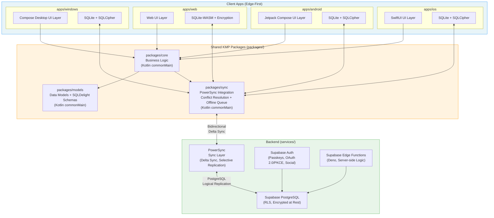

# System Architecture Roadmap — Finance

> **Status:** All 8 development phases COMPLETE — pre-launch (v0.1.0)
> **Last Updated:** 2026-03-11
> **Purpose:** Source-of-truth for issue creation and development planning

---

## Executive Summary

Finance is a multi-platform, native-first financial tracking application for personal, family, and partnered finances. It targets iOS (iPhone, iPad, Mac, watchOS), Android (phones, tablets, Wear OS), Web (PWA), and Windows 11. The app follows an edge-first architecture where most computation happens on-device, with a thin backend serving as the coordination and sync layer. All financial data is encrypted at rest using SQLCipher, and the system is designed to be fully functional offline with opportunistic sync.

The proposed technology stack centers on **Kotlin Multiplatform (KMP)** for shared business logic with native UI per platform (SwiftUI, Jetpack Compose, Compose Desktop, and a web frontend), **Supabase** (PostgreSQL + Auth + Edge Functions) as the backend, and **PowerSync** as the offline-first sync engine between local SQLite databases and the server. This combination delivers truly native experiences on every platform while sharing core logic (data models, sync engine, business rules) across all targets — a pattern proven at scale by Cash App, Google Docs, and Shopify.

The development is organized into eight phases, from foundational infrastructure through platform-by-platform rollout to advanced features and launch. The project follows an Agentic Kanban methodology where AI agents are first-class contributors, with all work tracked as GitHub Issues and all decisions documented as Architecture Decision Records (ADRs). Every phase's work items are designed to be directly convertible into actionable GitHub issues.

---

## Product Identity

**Core Promise:** "See your money clearly. Keep it private. No expertise required."

**Differentiators:**

1. Expertise-tiered UI — adapts to user's financial comfort level
2. Offline-first, encrypted-at-rest privacy — Signal-like data practices
3. 30-second daily interaction — 3-tap transaction entry, widget-first habit loop
4. Contextual financial education — learn by using, not by studying
5. Non-judgmental design — facts + encouragement, never guilt

**Target Users:** People who want to understand their money without needing a finance degree. Inclusive of users with cognitive differences (ADHD-friendly design).

See [Product Identity](../design/product-identity.md) for the complete specification.

---

## Technology Decisions

All technology choices below are **proposals** based on research. Each requires explicit human confirmation before implementation begins. Confirmed decisions will be documented as ADRs in `docs/architecture/`.

| Decision                 | Proposed Choice                                                                   | Alternatives Considered                                               | Status       |
| ------------------------ | --------------------------------------------------------------------------------- | --------------------------------------------------------------------- | ------------ |
| Cross-platform framework | KMP (Kotlin Multiplatform)                                                        | React Native/Expo, Flutter, .NET MAUI                                 | ✅ Confirmed |
| Backend database & auth  | Supabase (PostgreSQL + Auth + Edge Functions)                                     | Firebase, Custom Node.js, PocketBase                                  | ✅ Confirmed |
| Sync engine              | PowerSync                                                                         | ElectricSQL, Custom sync, WatermelonDB sync                           | ✅ Confirmed |
| Hosting                  | Self-hosted (Supabase + PowerSync on VPS, ~$10-20/mo)                             | Managed cloud (~$74/mo)                                               | ✅ Confirmed |
| Local database           | SQLite via SQLDelight (KMP) + SQLCipher encryption                                | Room KMP, Drift (Flutter), WatermelonDB                               | ✅ Confirmed |
| Key-value store          | Multiplatform Settings (KMP) / MMKV                                               | SharedPreferences, UserDefaults, AsyncStorage                         | ✅ Confirmed |
| Primary auth method      | Passkeys (WebAuthn/FIDO2) + OAuth 2.0/PKCE fallback                               | Magic links, Social-only, Email/password-only                         | ✅ Confirmed |
| Design system approach   | Design tokens (DTCG JSON) + native UI per platform                                | Shared cross-platform UI components, Compose Multiplatform everywhere | ✅ Confirmed |
| Token pipeline           | Style Dictionary                                                                  | Manual per-platform, Tokens Studio only                               | ✅ Confirmed |
| CI/CD platform           | GitHub Actions + Turborepo (affected-only builds)                                 | CircleCI, GitLab CI, Xcode Cloud, Nx                                  | ✅ Confirmed |
| Versioning               | Per-package semver with Changesets                                                | Unified version, Nx Release                                           | ✅ Confirmed |
| iOS UI framework         | SwiftUI                                                                           | UIKit, Compose Multiplatform iOS                                      | ✅ Confirmed |
| Android UI framework     | Jetpack Compose                                                                   | XML Views, Compose Multiplatform                                      | ✅ Confirmed |
| Web approach             | TypeScript + React consuming KMP logic via JS bindings                            | Compose for Web (Wasm), Kobweb, Kotlin/JS                             | ✅ Confirmed |
| Windows approach         | Compose Desktop (JVM)                                                             | WinUI 3, Compose Multiplatform Desktop                                | ✅ Confirmed |
| First platform priority  | iOS first, Android in parallel                                                    | Android first                                                         | ✅ Confirmed |
| Budgeting methodology    | Both envelope/zero-based AND category budgets                                     | Single methodology                                                    | ✅ Confirmed |
| Transaction entry        | Manual + CSV import + Plaid bank connections at launch                            | Manual only, Plaid later                                              | ✅ Confirmed |
| Encryption scope         | Hybrid E2E (encrypt sensitive fields, metadata readable) + GDPR baseline globally | Full E2E, Standard only                                               | ✅ Confirmed |
| Monetization             | Freemium + donations (premium: AI analysis, extra connections, sharing)           | Subscription-only, Free forever                                       | ✅ Confirmed |
| Wearables                | Deferred post-launch (user stories created, deprioritized)                        | In initial platform phases                                            | ✅ Confirmed |
| App name                 | "Finance" (working title, workshop later)                                         | —                                                                     | ⏳ Pending   |

### Rationale Summary

**KMP over React Native/Flutter/.NET MAUI:**
KMP scored 80/90 in research evaluation — highest among all frameworks. It is the only option delivering truly native UI on every platform (SwiftUI, Jetpack Compose, etc.), has the strongest offline-first database story (SQLDelight, Room KMP), and provides unbeatable WCAG accessibility by inheriting each platform's native accessibility stack. Financial pedigree is proven by Cash App, Google Docs, and Shopify.

**Supabase + PowerSync over Firebase/Custom/PocketBase:**
Supabase provides an open-source (Apache 2.0), self-hostable PostgreSQL backend with built-in Auth and Edge Functions — avoiding Firebase's proprietary lock-in and unpredictable costs. PowerSync fills Supabase's offline-first gap with a production-grade sync engine purpose-built for local SQLite ↔ PostgreSQL synchronization, supporting delta sync, selective replication, and SQLCipher encryption. Combined baseline cost is ~$74/mo.

**SQLite + SQLDelight + SQLCipher over Realm/WatermelonDB/IndexedDB:**
SQLite is the most deployed database engine in the world with full SQL query power essential for financial aggregations (SUM, GROUP BY, JOINs, window functions). SQLDelight generates type-safe Kotlin from `.sq` files and was built by Cash App specifically for KMP offline-first apps. SQLCipher provides AES-256 encryption at rest. Realm is deprecated (EOL Sept 2025). WatermelonDB lacks encryption and uses LokiJS on web (different storage engine).

**Passkeys + OAuth 2.0/PKCE over alternatives:**
Passkeys provide phishing-resistant, passwordless authentication supported natively on all target platforms (iOS 16+, Android 9+, Web, Windows Hello). OAuth 2.0 + PKCE is mandatory for public clients under OAuth 2.1 (RFC 9700) and serves as the universal fallback. Biometric authentication gates access to locally stored tokens via platform secure storage (Keychain, Keystore, DPAPI).

**Design tokens + native UI over shared components:**
The native-first principle demands that each platform uses its own UI framework. Design tokens (DTCG JSON spec) encode visual decisions (colors, typography, spacing) and are transformed via Style Dictionary into platform-native code (Swift constants, XML resources, CSS variables, XAML resources). This ensures brand consistency without fighting platform conventions.

**GitHub Actions + Turborepo over alternatives:**
GitHub Actions provides a unified CI platform for all four target platforms (macOS for iOS, Linux for Android/Web, Windows for desktop) with native Copilot coding agent integration. Turborepo adds lightweight affected-only builds with automatic dependency graph detection and remote caching, reducing CI costs by 50-80%. Estimated CI cost: ~$143/mo.

---

## Freemium Model

The app follows a "complete free tracker + premium intelligence" model.

### Free Tier — Complete Financial Tracker

All core functionality is free with no artificial limitations:

- Accounts, transactions, budgets, goals, categories, rules
- Expertise-tiered UI (Getting Started / Comfortable / Advanced)
- Contextual financial education tooltips
- Offline-first single-device operation
- Data export (JSON/CSV)
- Basic reports (spending by category, monthly trends)
- "Can I Afford This?" budget check widget
- Non-manipulative streak tracking
- Full accessibility features

### Premium Tier — AI Intelligence Layer

Premium adds intelligence and collaboration (target: ~$4.99/mo or ~$39.99/yr):

- AI auto-categorization with trend marking
- Suggested budgets based on spending history
- Holistic portfolio and goal analysis
- Spending forecasts with confidence intervals
- Structured financial learning paths
- Multi-device cloud sync (Supabase + PowerSync)
- Household/partner sharing with role-based access
- Advanced reports and custom visualizations

### Design Principle

> Free users never feel limited — the core app is genuinely complete.
> Premium feels like a superpower, not a paywall — you're adding intelligence, not removing features.

---

## System Architecture Diagram



### Data Flow (Edge-First Pattern)

```
User Action → Local SQLite (immediate write) → UI Update (instant feedback)
                    ↓
            Sync Queue (offline-capable)
                    ↓
            PowerSync Client SDK
                    ↓ (when connected)
            PowerSync Cloud (delta sync)
                    ↓
            Supabase PostgreSQL (source of truth)
                    ↓ (propagate to other devices)
            PowerSync → Other Devices' Local SQLite → UI Update
```

All CRUD operations happen against the local SQLite database first. The UI updates immediately. Changes are queued and synced to the backend opportunistically. Conflict resolution uses last-write-wins (LWW) for simple fields with developer-defined merge logic for complex data (budgets, shared household items).

---

## Component Architecture

### Shared Packages (`packages/`)

#### `packages/core` — Business Logic

- **Purpose:** Core financial logic shared across all platforms
- **Technology:** Kotlin Multiplatform (`commonMain`), kotlinx-datetime, kotlinx-serialization
- **Responsibilities:**
  - Budget calculations (envelope method, zero-based budgeting)
  - Transaction categorization engine
  - Financial aggregations (net worth, spending velocity, savings rate)
  - Money arithmetic (integer cents, never floating point, ISO 4217 currency codes, banker's rounding)
  - Validation rules for all financial operations
  - Domain events and business rule enforcement
- **Dependencies:** `packages/models`

#### `packages/models` — Data Models & Schemas

- **Purpose:** Shared data model definitions and database schema
- **Technology:** Kotlin Multiplatform, SQLDelight (`.sq` files), kotlinx-serialization
- **Responsibilities:**
  - Data classes: Account, Transaction, Category, Budget, Goal, Household, User
  - SQLDelight schema definitions with type-safe generated queries
  - Database migrations (version-numbered SQL scripts)
  - Sync metadata columns (`id UUID PK`, `created_at`, `updated_at`, `deleted_at`, `sync_version`, `is_synced`)
  - Serialization/deserialization for sync payloads
- **Dependencies:** None (leaf package)

#### `packages/sync` — Sync Engine

- **Purpose:** PowerSync integration and offline-first sync infrastructure
- **Technology:** Kotlin Multiplatform, PowerSync SDK, kotlinx-coroutines
- **Responsibilities:**
  - PowerSync client configuration and lifecycle management
  - Conflict resolution strategies (LWW + custom merge for complex data)
  - Offline mutation queue with retry logic and exponential backoff
  - Delta sync with sequence numbers and checksum verification
  - Selective sync (per-user, per-household data subsets)
  - Background sync integration with platform-native APIs
  - Soft deletes (never hard-delete synced records)
- **Dependencies:** `packages/models`

### Platform Apps (`apps/`)

#### `apps/ios` — iOS / macOS / watchOS

- **Purpose:** Native Apple platform app
- **Technology:** SwiftUI, Swift, KMP shared logic (via Swift Export)
- **Key Components:**
  - SwiftUI views following Human Interface Guidelines
  - Apple Keychain for token and key storage (Secure Enclave)
  - Face ID / Touch ID via `LocalAuthentication` (LAContext)
  - VoiceOver accessibility with `.accessibilityLabel()`, `.accessibilityHint()`
  - Swift Charts for financial data visualization
  - Core Haptics for transaction feedback
  - watchOS companion app (basic balance + recent transactions)
  - Universal Links for OAuth redirect handling

#### `apps/android` — Android / Wear OS

- **Purpose:** Native Android platform app
- **Technology:** Jetpack Compose, Kotlin, KMP shared logic (direct)
- **Key Components:**
  - Jetpack Compose UI following Material Design 3
  - Android Keystore for token storage (TEE/Secure Element)
  - BiometricPrompt for fingerprint/face authentication
  - TalkBack accessibility with `semantics {}` blocks
  - Vico for Compose-native financial charts
  - Haptic feedback via `HapticFeedbackConstants`
  - Wear OS companion app (Compose for Wear OS + Horologist)
  - App Links for OAuth redirect handling

#### `apps/web` — Progressive Web App

- **Purpose:** Web-based access with offline PWA support
- **Technology:** Kotlin/JS or TypeScript + React with KMP logic via compiled JS/WASM (decision pending)
- **Key Components:**
  - Responsive design (mobile + desktop web)
  - SQLite-WASM for local database (OPFS persistence)
  - PWA manifest + service worker for offline support
  - HttpOnly + Secure + SameSite cookies for token storage
  - WebAuthn for passkey authentication
  - ARIA landmarks, live regions, keyboard navigation (WCAG 2.2 AA)
  - Recharts for data visualization, D3.js for custom charts
  - Lighthouse CI performance and accessibility budgets

#### `apps/windows` — Windows 11 Desktop

- **Purpose:** Native Windows desktop app
- **Technology:** Compose Desktop (JVM) or WinUI 3 (decision pending)
- **Key Components:**
  - Desktop-optimized UI with sidebar navigation
  - DPAPI / Credential Locker for token storage (TPM-backed)
  - Windows Hello for biometric authentication
  - Narrator accessibility via UI Automation properties
  - LiveCharts2 or Compose-native charts for data visualization
  - Windows notification integration for budget alerts
  - MSIX packaging for Microsoft Store distribution

### Backend (`services/`)

#### `services/api` — Supabase Project

- **Purpose:** Backend coordination, auth, and sync relay
- **Technology:** Supabase (managed or self-hosted), PostgreSQL, Deno (Edge Functions)
- **Key Components:**
  - **PostgreSQL database** with row-level security (RLS) policies
    - `household_id` on every row for tenant isolation
    - Encrypted columns for sensitive financial data (pgcrypto)
    - Audit log table (immutable, no PII)
  - **Supabase Auth** — email/password, social (Apple, Google), phone OTP, passkey registration
  - **Edge Functions** — server-side validation, household invitation flow, data export
  - **PowerSync integration** — sync rules, selective replication configuration
  - **Compliance** — SOC 2 Type II (managed), GDPR data deletion APIs, CCPA support

### Data Flow (Detailed)

```
1. User creates transaction in app UI
2. Transaction written to local SQLite (encrypted via SQLCipher) → UI updates instantly
3. Sync engine adds mutation to offline queue with timestamp + sync_version
4. When connected: PowerSync client sends delta (changed records since last sync)
5. PowerSync server validates and writes to Supabase PostgreSQL
6. PostgreSQL RLS enforces household-level access control
7. PowerSync propagates changes to other devices in the household
8. Other devices' local SQLite updated → their UI updates automatically
9. If conflict: LWW by updated_at timestamp; complex data uses custom merge logic
```

---

## Development Phases

### Phase 0: Foundation (Current) ✅

- ✅ Repository structure — monorepo with `apps/`, `packages/`, `services/`, `docs/`, `tools/`
- ✅ AI tooling — custom Copilot agents (`@architect`, `@docs-writer`, `@security-reviewer`, `@accessibility-reviewer`, `@finance-domain`), skills, instructions
- ✅ Planning system — SDLC (Agentic Kanban), issue templates, labels, project board
- ✅ Documentation — AGENTS.md, README.md, restrictions, workflow docs
- ✅ Research — cross-platform, backend/sync, local storage, auth/security, design system, CI/CD

**What remains in Phase 0:**

- ✅ Technology decisions confirmed (except app name — pending workshop)
- Write ADRs for each confirmed decision (`docs/architecture/adr-001-*.md` through `adr-007-*.md`)
- Set up Turborepo workspace configuration (`turbo.json`)
- Configure Dependabot for all package ecosystems
- Set up conventional commits enforcement (commitlint + husky)

### Phase 1: Core Engine ✅

Set up the KMP project structure and implement foundational business logic. All items are in `packages/`.

- Set up KMP Gradle project structure with `commonMain`, `androidMain`, `iosMain`, `jvmMain`, `jsMain` source sets
- Configure Gradle version catalogs and convention plugins for consistent dependency management
- Implement data models in `packages/models` — Account, Transaction, Category, Budget, Goal, Household, User
- Define SQLDelight `.sq` schema files with sync metadata columns (`id`, `created_at`, `updated_at`, `deleted_at`, `sync_version`, `is_synced`)
- Set up SQLCipher encryption for local SQLite databases with platform keystore key management
- Implement database migration framework (version-numbered SQL scripts with up/down migrations)
- Implement core financial logic in `packages/core` — money arithmetic (integer cents), budget calculations, categorization engine
- Implement currency handling — ISO 4217 codes, banker's rounding, multi-currency conversion
- Implement transaction validation rules and domain event system
- Implement financial aggregation queries — net worth, spending by category/period, budget utilization, trend analysis
- Set up kotlinx-serialization for model serialization/deserialization
- Set up kotlinx-datetime for cross-platform date/time handling
- Write comprehensive unit test suite for all financial logic (edge cases: rounding, currency conversion, leap years, timezone boundaries)
- Set up CI workflow for shared package tests (`ci.yml` — lint + test on ubuntu-latest)
- Set up design tokens package (`packages/design-tokens`) — primitive, semantic, and component token definitions in DTCG JSON format
- Configure Style Dictionary pipeline to generate platform-native output (Swift, XML, CSS, XAML)

### Phase 2: Sync & Backend ✅

Set up Supabase project and integrate PowerSync for offline-first sync.

- Set up Supabase project — PostgreSQL database with schema matching SQLDelight models
- Configure row-level security (RLS) policies for household-level data isolation
- Implement Supabase Auth configuration — email/password, social providers (Apple Sign-In, Google Sign-In)
- Set up passkey/WebAuthn registration and authentication ceremonies (backend: SimpleWebAuthn)
- Implement OAuth 2.0 + PKCE flow for all platforms with `code_verifier`/`code_challenge`
- Configure JWT access tokens (RS256, 15-min expiry) and opaque refresh tokens with rotation + reuse detection
- Implement PowerSync integration in `packages/sync` — client setup, sync rules, selective replication
- Define PowerSync sync rules for per-household, per-user data subsets
- Implement conflict resolution strategies — LWW for simple fields, custom merge logic for budgets and shared items
- Implement offline mutation queue with retry logic, exponential backoff, and deduplication
- Implement delta sync with monotonic sequence numbers and checksum verification
- Set up E2E encryption for sensitive financial fields — envelope encryption (DEK/KEK) with Argon2id key derivation
- Implement household key sharing protocol — KEK encrypted with each member's public key
- Implement crypto-shredding for GDPR-compliant account deletion
- Implement Edge Functions for server-side operations — household invitations, data export (JSON/CSV), GDPR deletion
- Set up integration test suite for sync scenarios — online/offline transitions, conflict resolution, multi-device sync
- Configure security scanning — CodeQL SAST, GitHub secret scanning with push protection

### Phase 3: First Platform — Android ✅

Android is the natural first platform for a KMP project since Kotlin is Android's primary language.

- Set up Jetpack Compose app project in `apps/android/` with KMP shared logic dependency
- Implement app navigation shell — bottom navigation bar with Material 3 (Accounts, Transactions, Budgets, Goals, Settings)
- Implement dashboard screen — net worth, today's spending, budget health rings, recent transactions, upcoming bills
- Implement accounts list and detail screens — account balances, transaction history per account
- Implement transaction creation flow — amount + payee → category + account → confirm (max 3 steps, smart defaults)
- Implement transaction list screen — grouped by date, sticky headers, swipe actions, search + filter
- Implement budget management screens — category budgets, circular progress rings, month-over-month comparison
- Implement goal tracking screens — savings goals with progress visualization and projections
- Integrate design tokens — Material 3 theme from generated XML resources, light/dark/high-contrast themes
- Implement Android Keystore integration for secure token and encryption key storage
- Implement BiometricPrompt authentication for app unlock and sensitive operations
- Implement TalkBack accessibility — content descriptions, semantic grouping, live regions for balance updates
- Implement haptic feedback for financial events (transaction confirmed, budget threshold, goal milestone)
- Ensure WCAG 2.2 AA compliance — 48dp minimum touch targets, focus management, font scaling support
- Implement local notifications for budget alerts and bill reminders
- Implement deep linking / App Links for OAuth redirect handling
- Set up Vico charts for financial data visualization with color-blind-safe palette (IBM CVD-safe)
- Set up Android CI workflow — Gradle build + unit tests on ubuntu-latest, triggered by affected-only detection
- Implement Fastlane configuration for Android — automated builds, signing, Google Play internal track upload

### Phase 4: iOS App ✅

Implement the iOS app using SwiftUI with KMP shared logic via Swift Export.

- Set up SwiftUI app project in `apps/ios/` with KMP framework dependency (via Swift Export or KMP-NativeCoroutines)
- Implement app navigation shell — tab bar following Human Interface Guidelines
- Implement same core screens as Android — dashboard, accounts, transactions, budgets, goals, settings
- Adapt UI patterns to iOS conventions — navigation controller push/pop, sheets, context menus
- Implement Apple Keychain integration for token and encryption key storage (Secure Enclave, `kSecAttrAccessibleWhenUnlockedThisDeviceOnly`)
- Implement Face ID / Touch ID via LAContext for app unlock and sensitive operations
- Implement Apple Sign-In (required for App Store) and Universal Links for OAuth redirects
- Implement VoiceOver accessibility — `.accessibilityLabel()`, `.accessibilityHint()`, rotor actions for transaction lists
- Implement Dynamic Type support — all text scales with user font size preference
- Implement Swift Charts for financial data visualization with color-blind-safe palette
- Implement Core Haptics for financial event feedback
- Implement basic watchOS companion app — balance at-a-glance, recent transactions, budget status
- Set up iOS CI workflow — Xcode build + XCTest on macos-14 runners, Fastlane Match for signing
- Implement Fastlane configuration for iOS — TestFlight upload, App Store Connect metadata

### Phase 5: Web PWA ✅

Implement the web app with offline PWA support.

- Set up web app project in `apps/web/` — Kotlin/JS with Compose for Web OR TypeScript + React (pending decision)
- Integrate KMP shared logic via compiled JavaScript or WASM module
- Implement responsive UI — mobile-first design scaling to desktop, semantic HTML structure
- Implement core screens matching mobile apps — dashboard, accounts, transactions, budgets, goals, settings
- Set up SQLite-WASM for local database with OPFS (Origin Private File System) persistence
- Implement PWA manifest — app name, icons, theme colors, display mode (standalone)
- Implement service worker — offline page caching, background sync registration
- Implement WebAuthn passkey authentication with `navigator.credentials` API
- Implement web-specific token storage — HttpOnly + Secure + SameSite cookies (never localStorage)
- Implement ARIA landmarks, live regions, keyboard navigation, and focus management (WCAG 2.2 AA)
- Implement Recharts for standard financial charts, D3.js for custom visualizations
- Set up Storybook component catalog with `@storybook/addon-a11y` for accessibility auditing
- Implement Lighthouse CI budgets — LCP < 2.5s, FID < 100ms, CLS < 0.1, accessibility score ≥ 95
- Set up web CI workflow — build + test + Lighthouse CI on ubuntu-latest
- Configure deployment to Vercel or Cloudflare Pages with preview environments per PR

### Phase 6: Windows App ✅

Implement the Windows desktop app.

- Set up Windows app project in `apps/windows/` — Compose Desktop (JVM) or WinUI 3 (pending decision)
- Integrate KMP shared logic — direct via JVM target (Compose Desktop) or via compiled library (WinUI)
- Implement desktop-optimized UI — sidebar navigation, multi-panel layouts, keyboard shortcuts
- Implement core screens matching other platforms — dashboard, accounts, transactions, budgets, goals, settings
- Implement DPAPI / Credential Locker integration for secure token and key storage (TPM-backed)
- Implement Windows Hello authentication for app unlock
- Implement Narrator accessibility — UI Automation properties, automation peers for custom controls
- Implement Windows notification integration — toast notifications for budget alerts, bill reminders
- Set up MSIX packaging for Microsoft Store distribution
- Set up Windows CI workflow — build + test on windows-latest runners
- Configure MS Store Submission API for automated flight ring uploads

### Phase 7: Advanced Features ✅

Cross-platform features that build on the core platform implementations.

#### Pre-Launch Features (Freemium Foundation)

- Implement expertise tier system — Getting Started / Comfortable / Advanced UI modes with progressive feature disclosure
- Implement contextual financial education tooltips — in-context definitions, tips, and explanations that appear at point-of-need
- Implement "Can I Afford This?" affordability check widget — quick budget check for discretionary spending decisions
- Implement iOS/Android platform widgets — at-a-glance balance, budget status, and quick transaction entry from home screen
- Implement two-path onboarding — "Quick Start" (minimal setup, start tracking immediately) and "Full Setup" (accounts, budgets, goals)
- Implement opt-in notification system — budget alerts, bill reminders, and streak nudges with user-controlled frequency and channels
- Implement non-manipulative streak tracking — celebrate consistency without guilt; streaks pause gracefully, never punish

#### Cross-Platform Advanced Features

- Implement household/family/partner account sharing — invite flow, role assignment (Owner, Partner, Member, Viewer)
- Implement RBAC permission enforcement — per-role access to transactions, budgets, member management
- Implement household key exchange protocol for E2E encrypted shared data
- Implement recurring transactions and bill schedules — creation, editing, auto-generation, reminders
- Implement financial goal tracking with projections — target date estimation, contribution suggestions
- Implement reports and analytics dashboard — spending trends, category breakdowns, income vs expense, net worth over time
- Implement multi-currency support — ISO 4217 codes, real-time exchange rates, currency conversion in reports
- Implement natural language transaction input — "Spent $45 at Target groceries" parsed into structured transaction
- Implement data import — CSV upload with column mapping, duplicate detection
- Implement data export — JSON/CSV export for GDPR Right to Portability compliance
- Implement financial insights — spending velocity, savings rate, budget health scoring, personalized suggestions
- Implement gamification — streaks for staying under budget, milestone celebrations, achievement badges
- Future consideration: Bank connection API integration (Plaid, MX) for automatic transaction import

### Phase 8: Polish & Launch ✅

Final optimization, auditing, and release preparation.

- Performance optimization across all platforms — startup time, scroll performance, animation smoothness, memory usage
- Full accessibility audit against WCAG 2.2 AA — automated (axe-core, Lighthouse, platform inspectors) + manual screen reader testing
- Security audit — OWASP MASVS checklist, penetration testing, dependency vulnerability review
- Privacy compliance review — GDPR DPIA, CCPA/CPRA assessment, data inventory documentation
- App store preparation — screenshots, descriptions, keywords, privacy labels, content ratings for iOS/Android/Windows stores
- Implement onboarding flow per platform — welcome, personalization, account setup, first budget, first insight
- Cross-platform visual parity audit — ensure design token consistency and brand alignment
- Set up beta testing program — TestFlight (iOS), Google Play internal/beta tracks, web staging, Windows flight ring
- Implement crash reporting and analytics (privacy-respecting, PII-free) with user consent
- Set up monitoring and alerting for sync health, API errors, and auth failures
- Write user-facing documentation — help center, FAQ, getting started guide
- Finalize Changesets + release workflows for all platforms
- Launch 🚀

---

## Cost Estimates

Estimated monthly costs for a production deployment at moderate scale (~1K users):

| Item                    | Monthly Cost | Notes                                                                        |
| ----------------------- | ------------ | ---------------------------------------------------------------------------- |
| Supabase (Pro)          | ~$25         | PostgreSQL, Auth, Edge Functions, 8 GB DB, 100K MAUs                         |
| PowerSync (Pro)         | ~$49         | Sync layer, 30 GB synced/mo, 1K connections                                  |
| GitHub Actions (CI/CD)  | ~$143        | Affected-only builds; iOS builds are the primary cost driver (~$64 of total) |
| Apple Developer Program | ~$8          | $99/year for App Store + TestFlight distribution                             |
| Google Play Console     | ~$2          | $25 one-time fee amortized                                                   |
| Domain + web hosting    | ~$10         | Vercel/Cloudflare Pages for PWA hosting                                      |
| **Total**               | **~$237/mo** | **Before scale optimization**                                                |

**Scale projections:**

- At 10K users: ~$400–$600/mo (PowerSync + Supabase compute scaling)
- At 100K users: ~$1,000–$1,500/mo — consider self-hosting Supabase + PowerSync Open Edition to reduce to $200–$500/mo infrastructure-only
- ElectricSQL (Apache 2.0, self-hosted, CRDT-based) should be re-evaluated in 6–12 months as a potential cost-reducing migration if SDK maturity improves

---

## Open Questions

All technology decisions from Phase 0 have been confirmed and documented as ADRs:

| #   | Question                 | Resolution                                                              |
| --- | ------------------------ | ----------------------------------------------------------------------- |
| 1   | Cross-platform framework | ✅ KMP confirmed — [ADR-0001](0001-cross-platform-framework.md)         |
| 2   | Backend choice           | ✅ Supabase + PowerSync — [ADR-0002](0002-backend-sync-architecture.md) |
| 3   | Web app approach         | ✅ TypeScript + React consuming KMP via JS bindings                     |
| 4   | Windows app approach     | ✅ Compose Desktop (JVM)                                                |
| 5   | Wearable priority        | ✅ Deferred to post-launch                                              |
| 6   | Bank connection API      | ✅ Deferred to post-launch (Plaid/MX)                                   |
| 7   | Monetization model       | ✅ Freemium — [ADR-0009](0009-legal-monetization-analysis.md)           |
| 8   | App name                 | ⏳ "Finance" remains the working title                                  |
| 9   | Self-hosting timeline    | ✅ Self-hosted on VPS — [ADR-0007](0007-hosting-strategy.md)            |
| 10  | E2E encryption scope     | ✅ Hybrid E2E — [ADR-0004](0004-auth-security-architecture.md)          |

---

## References

### Research Documents

- [Cross-Platform Framework Research](../../.github/research/cross-platform.md) — KMP, React Native, Flutter, .NET MAUI evaluation
- [Backend & Sync Architecture Research](../../.github/research/backend-sync.md) — Supabase, Firebase, PowerSync, ElectricSQL, Custom, PocketBase
- [Local Database & Storage Research](../../.github/research/local-storage.md) — SQLite, Realm, WatermelonDB, MMKV, IndexedDB, Drift
- [Authentication & Security Research](../../.github/research/auth-security.md) — OAuth 2.0/PKCE, Passkeys, biometrics, encryption, RBAC, compliance
- [Design System & UI Architecture Research](../../.github/research/design-system.md) — Design tokens, accessibility, financial UI patterns, charting
- [CI/CD & Release Strategy Research](../../.github/research/cicd.md) — GitHub Actions, Turborepo, Fastlane, testing strategy, cost optimization

### Project Documents

- [README.md](../../README.md) — Project vision, principles, repository structure
- [AGENTS.md](../../AGENTS.md) — AI agent guidance, restrictions, human-gated operations
- [SDLC](sdlc.md) — Agentic Kanban methodology, lifecycle stages, definitions of ready/done

### External Resources

- [JetBrains KMP Documentation](https://kotlinlang.org/docs/multiplatform.html)
- [SQLDelight](https://cashapp.github.io/sqldelight/)
- [Supabase Documentation](https://supabase.com/docs)
- [PowerSync Documentation](https://docs.powersync.com)
- [FIDO Alliance — Passkeys](https://fidoalliance.org/passkeys/)
- [WCAG 2.2 Specification](https://www.w3.org/TR/WCAG22/)
- [Style Dictionary](https://styledictionary.com/)
- [Turborepo Documentation](https://turbo.build/repo/docs)
- [OAuth 2.1 — RFC 9700](https://datatracker.ietf.org/doc/rfc9700/)
