# Scalability Analysis — Finance Monorepo

_Last updated: 2025-04-21_

This document analyzes the Finance application's scalability characteristics across all tiers: database performance, sync engine throughput, API rate limiting, storage projections, and cost modeling. It extends [ADR-0011 (Scaling Architecture)](./0011-scaling-architecture.md) with quantitative analysis.

---

## Table of Contents

- [1. Architecture Scalability Profile](#1-architecture-scalability-profile)
- [2. Edge-First Multiplier Effect](#2-edge-first-multiplier-effect)
- [3. Database Performance Analysis](#3-database-performance-analysis)
- [4. Sync Engine Performance at Scale](#4-sync-engine-performance-at-scale)
- [5. PowerSync Scaling Characteristics](#5-powersync-scaling-characteristics)
- [6. API Rate Limiting Strategy](#6-api-rate-limiting-strategy)
- [7. Storage Growth Projections](#7-storage-growth-projections)
- [8. Cost Modeling per Tier](#8-cost-modeling-per-tier)
- [9. Bottleneck Analysis](#9-bottleneck-analysis)
- [10. Scaling Decision Framework](#10-scaling-decision-framework)
- [11. Load Testing Strategy](#11-load-testing-strategy)

---

## 1. Architecture Scalability Profile

Finance's edge-first architecture fundamentally changes scaling characteristics compared to traditional server-heavy applications.

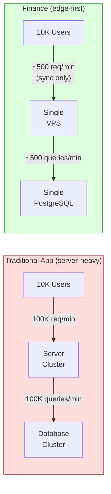

**Why Finance scales differently:**

| Property             | Traditional App            | Finance (Edge-First)         |
| -------------------- | -------------------------- | ---------------------------- |
| Read path            | Server → DB for every view | Local SQLite (0 server load) |
| Write path           | Client → Server → DB       | Local SQLite → async sync    |
| Query load           | N users × M views/min      | N users × 1 sync/30s         |
| Offline behavior     | App is dead                | App is fully functional      |
| Server load per user | ~10 req/min average        | ~2 req/min (sync cycle)      |
| **10× reduction**    | Baseline                   | **~5% of traditional load**  |

---

## 2. Edge-First Multiplier Effect

The edge-first architecture provides a ~10–20× server load reduction compared to server-first apps.

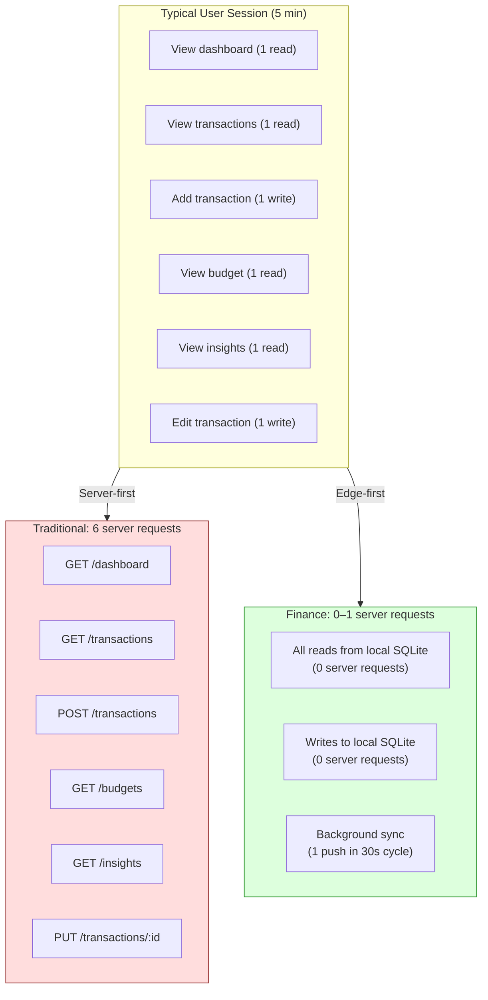

**Quantified multiplier:**

| Metric                       | Traditional | Finance | Reduction |
| ---------------------------- | ----------- | ------- | --------- |
| API requests/user/hour       | 120         | 6–12    | 10–20×    |
| DB queries/user/hour         | 240         | 6–12    | 20–40×    |
| Bandwidth/user/hour          | 5 MB        | 50 KB   | 100×      |
| P95 latency (user-perceived) | 200ms       | 10ms    | 20×       |

---

## 3. Database Performance Analysis

### 3.1 Per-User Data Profile

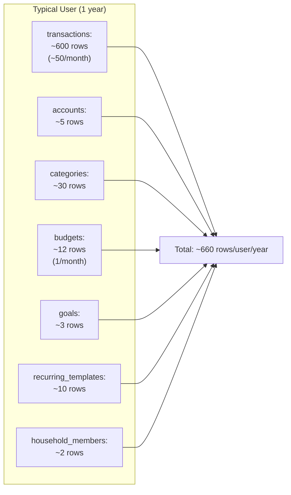

**Row growth estimates:**

| Table               | Rows/user/year | Row size (avg) | Storage/user/year |
| ------------------- | -------------- | -------------- | ----------------- |
| transactions        | 600            | 400 bytes      | 240 KB            |
| accounts            | 5              | 300 bytes      | 1.5 KB            |
| categories          | 30             | 200 bytes      | 6 KB              |
| budgets             | 12             | 250 bytes      | 3 KB              |
| goals               | 3              | 300 bytes      | 0.9 KB            |
| recurring_templates | 10             | 350 bytes      | 3.5 KB            |
| household_members   | 2              | 200 bytes      | 0.4 KB            |
| **Total**           | **~660**       | —              | **~255 KB**       |

### 3.2 Database Size Projections

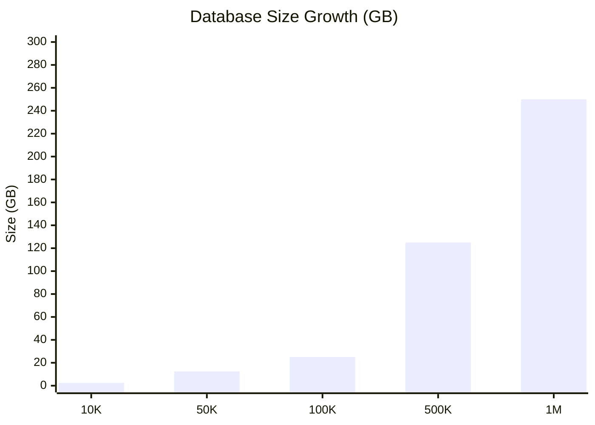

| Users | Total Rows | DB Size | Index Size | Total   |
| ----- | ---------- | ------- | ---------- | ------- |
| 10K   | 6.6M       | 2.5 GB  | 0.8 GB     | 3.3 GB  |
| 50K   | 33M        | 12.5 GB | 4 GB       | 16.5 GB |
| 100K  | 66M        | 25 GB   | 8 GB       | 33 GB   |
| 500K  | 330M       | 125 GB  | 40 GB      | 165 GB  |
| 1M    | 660M       | 250 GB  | 80 GB      | 330 GB  |

### 3.3 Query Performance at Scale

All queries are scoped by `household_id` (RLS + explicit WHERE). With proper indexing, query performance is O(household_size), not O(total_users).

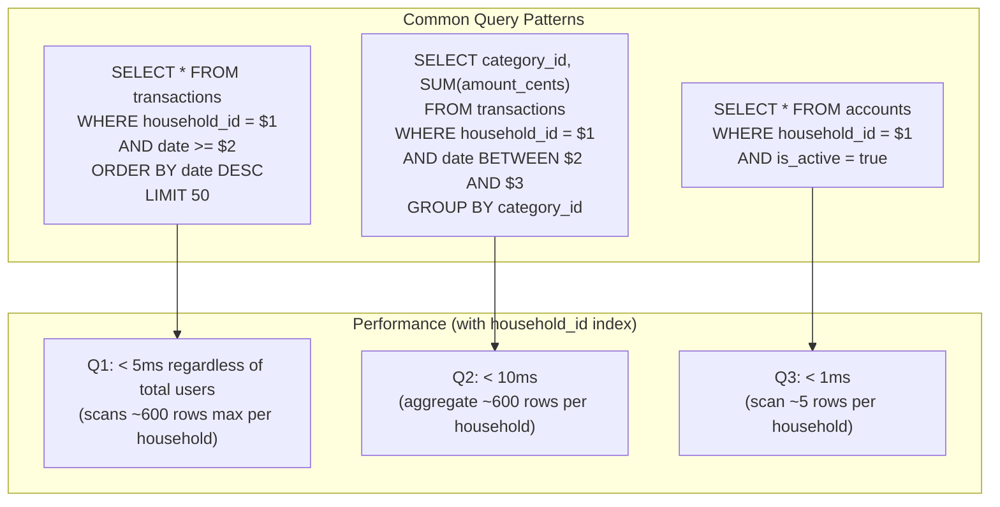

**Key index strategy:**

```sql
-- These indexes ensure all queries are household-scoped and fast
CREATE INDEX idx_transactions_household_date ON transactions(household_id, date DESC)
    WHERE deleted_at IS NULL;
CREATE INDEX idx_transactions_household_category ON transactions(household_id, category_id)
    WHERE deleted_at IS NULL;
CREATE INDEX idx_accounts_household ON accounts(household_id)
    WHERE deleted_at IS NULL;
CREATE INDEX idx_budgets_household ON budgets(household_id)
    WHERE deleted_at IS NULL;
```

### 3.4 Sharding Strategy (Tier 3+)

Per ADR-0011, `household_id` is the shard key via Citus extension:

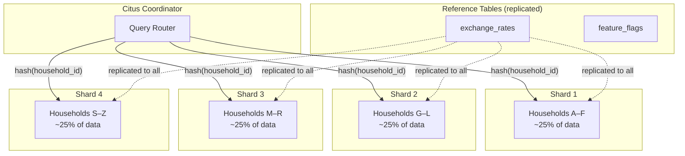

**Why `household_id` is the perfect shard key:**

1. **Zero cross-shard queries:** All application queries filter by `household_id` (RLS + PowerSync sync rules). No query ever needs data from multiple households.
2. **Uniform distribution:** UUID household IDs distribute evenly across shards.
3. **Colocated JOINs:** All tables for a household are on the same shard — JOINs remain local.
4. **PowerSync alignment:** The `by_household` bucket maps 1:1 to shard boundaries.

---

## 4. Sync Engine Performance at Scale

### 4.1 Sync Throughput Model

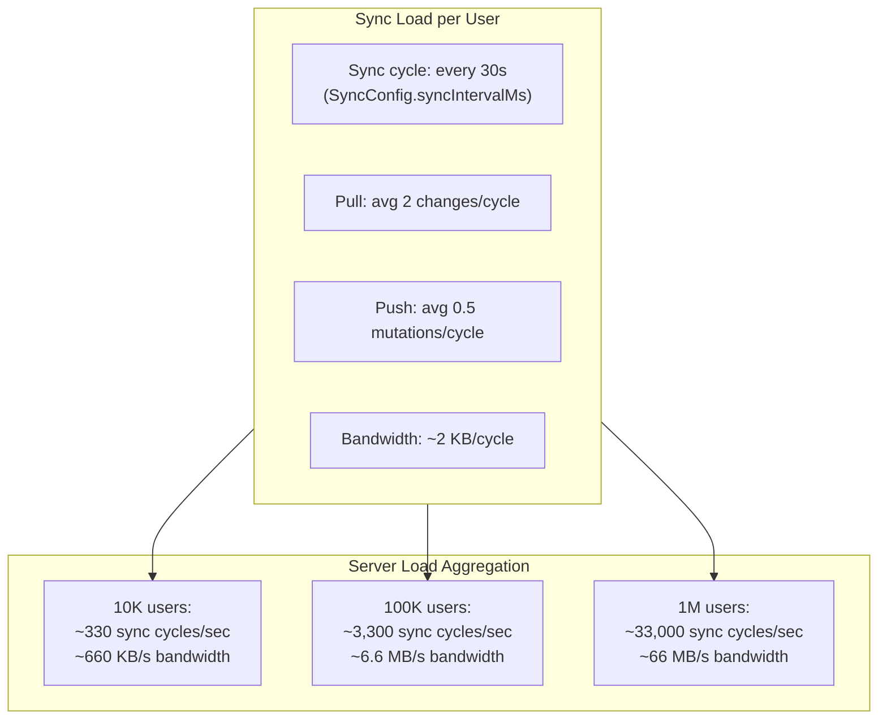

**Detailed sync load calculation:**

| Metric                 | Per User | 10K Users | 100K Users | 1M Users |
| ---------------------- | -------- | --------- | ---------- | -------- |
| Sync cycles/min        | 2        | 20K/min   | 200K/min   | 2M/min   |
| Sync cycles/sec        | 0.033    | 333/s     | 3,333/s    | 33,333/s |
| Changes pulled/cycle   | 2 avg    | 667/s     | 6,667/s    | 66,667/s |
| Mutations pushed/cycle | 0.5 avg  | 167/s     | 1,667/s    | 16,667/s |
| Bandwidth (pull)       | 1 KB     | 667 KB/s  | 6.5 MB/s   | 65 MB/s  |
| Bandwidth (push)       | 0.5 KB   | 167 KB/s  | 1.6 MB/s   | 16 MB/s  |
| WebSocket connections  | 1        | 10K       | 100K       | 1M       |

### 4.2 Concurrent Connection Limits

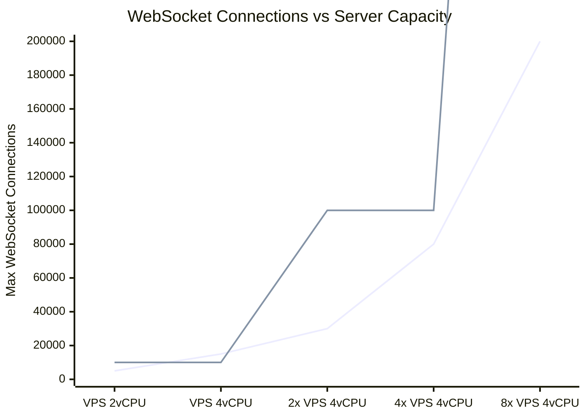

| Infrastructure             | Max WebSocket Connections | Sufficient For          |
| -------------------------- | ------------------------- | ----------------------- |
| Single VPS (2 vCPU / 4 GB) | ~5,000                    | Tier 1 (< 1K users)     |
| Single VPS (4 vCPU / 8 GB) | ~15,000                   | Tier 2 (1K–10K users)   |
| 2× VPS + LB                | ~30,000                   | Tier 2–3                |
| PowerSync Cloud (managed)  | 100K+                     | Tier 3 (10K–100K users) |
| Multi-region cluster       | 1M+                       | Tier 4 (100K–1M users)  |

### 4.3 Batch Size Optimization

The `SyncConfig.batchSize` (default 100) and `QueueProcessor.DEFAULT_BATCH_SIZE` (50) affect throughput:

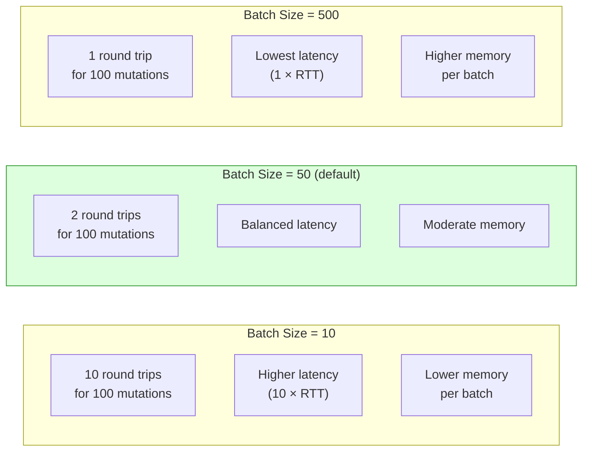

| Batch Size | RTTs for 100 mutations | Optimal For                               |
| ---------- | ---------------------- | ----------------------------------------- |
| 10         | 10                     | Low-memory devices, high-latency networks |
| 50         | 2                      | **Default — balanced for most devices**   |
| 100        | 1                      | Desktop/web with good connectivity        |
| 500        | 1                      | Bulk import scenarios                     |

---

## 5. PowerSync Scaling Characteristics

PowerSync is the sync coordination layer. Its scaling properties determine the system's ceiling.

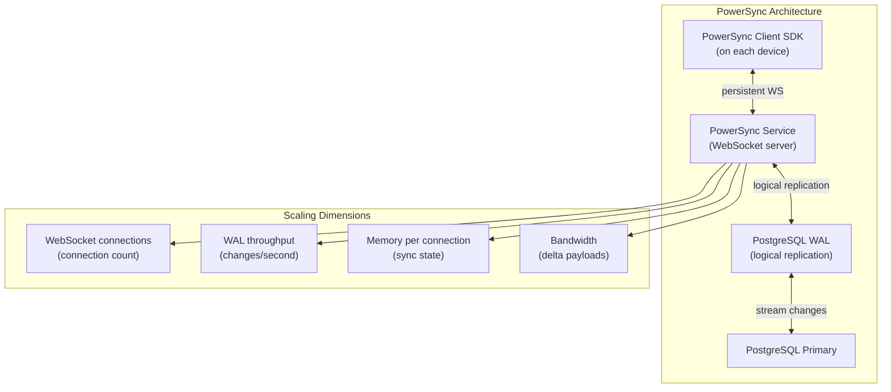

**PowerSync scaling characteristics:**

| Dimension                 | Self-Hosted              | PowerSync Cloud | Notes                  |
| ------------------------- | ------------------------ | --------------- | ---------------------- |
| WebSocket connections     | ~5K–15K per VPS          | 100K+ (managed) | Memory-bound           |
| Changes/second throughput | ~10K/s                   | 100K+/s         | CPU-bound              |
| Memory per connection     | ~50 KB                   | Optimized       | Sync state + buffers   |
| Bucket computation        | Per-change               | Per-change      | Evaluated on WAL event |
| Horizontal scaling        | Manual (sticky sessions) | Auto-scaled     | Consistent hashing     |

### Bucket Computation Cost

Each WAL change triggers bucket rule evaluation:

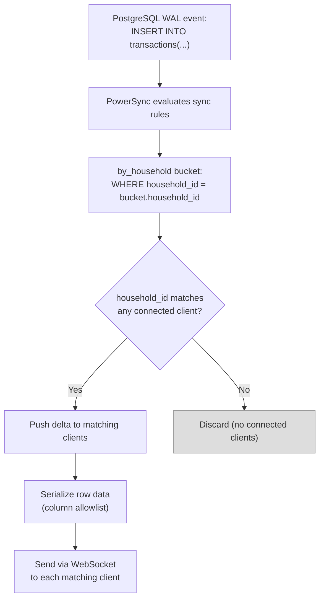

---

## 6. API Rate Limiting Strategy

Rate limiting protects the backend from abuse while ensuring legitimate users have a smooth experience.

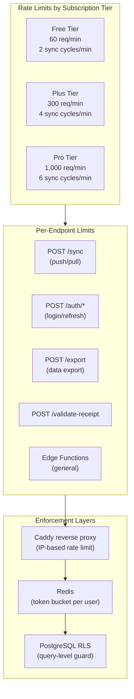

**Rate limit matrix:**

| Endpoint           | Free   | Plus    | Pro     | Window         | Algorithm     |
| ------------------ | ------ | ------- | ------- | -------------- | ------------- |
| Sync push          | 2/min  | 4/min   | 6/min   | Sliding window | Token bucket  |
| Sync pull          | 4/min  | 8/min   | 12/min  | Sliding window | Token bucket  |
| Auth (login)       | 5/min  | 5/min   | 5/min   | Fixed window   | Fixed counter |
| Auth (refresh)     | 10/min | 10/min  | 10/min  | Fixed window   | Fixed counter |
| Data export        | 2/hour | 10/hour | 30/hour | Fixed window   | Fixed counter |
| Receipt validation | 5/hour | 5/hour  | 5/hour  | Fixed window   | Fixed counter |
| Edge functions     | 30/min | 120/min | 600/min | Sliding window | Token bucket  |

**Rate limit headers (RFC 6585 / draft-ietf-httpapi-ratelimit-headers):**

```
X-RateLimit-Limit: 300
X-RateLimit-Remaining: 287
X-RateLimit-Reset: 1714693200
Retry-After: 42
```

### Sync Interval Adaptation

When rate limited, the sync engine should back off:

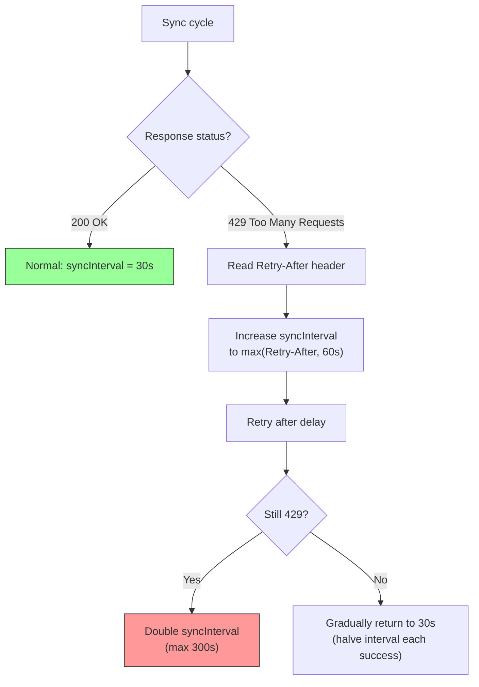

---

## 7. Storage Growth Projections

### 7.1 Server-Side Storage

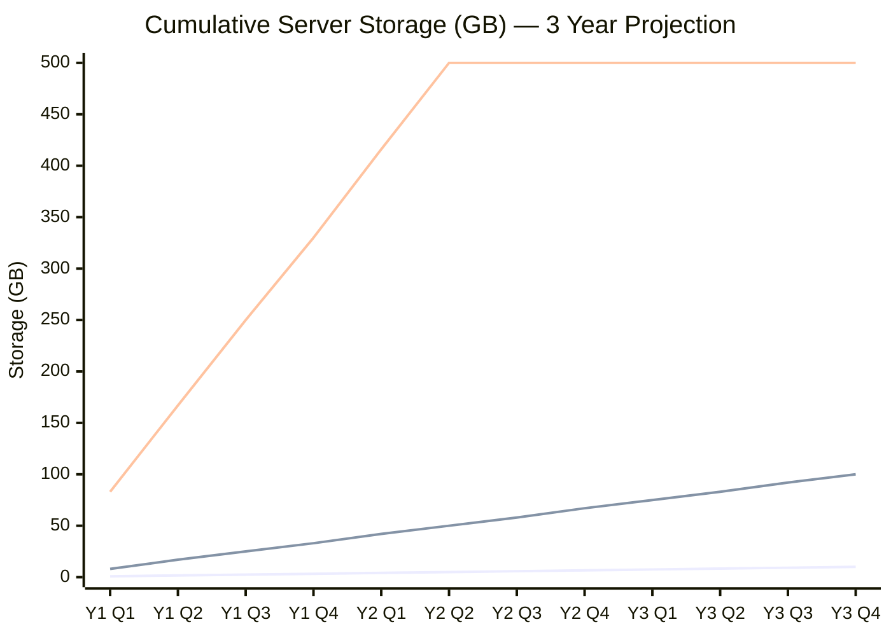

**Note:** At 1M users, data retention policies should limit growth (e.g., archive transactions > 5 years).

### 7.2 Client-Side Storage

| Content                       | Size per User                 |
| ----------------------------- | ----------------------------- |
| SQLite database (1 year data) | ~5 MB (with SQLCipher)        |
| SQLite database (3 year data) | ~15 MB                        |
| AI models (if downloaded)     | 10–80 MB                      |
| App binary                    | 20–40 MB (platform-dependent) |
| Cached images (receipts)      | 0–100 MB                      |
| **Typical total**             | **35–235 MB**                 |

### 7.3 Backup Storage

| Tier | Users | DB Size | Daily Backup | 30-Day Retention |
| ---- | ----- | ------- | ------------ | ---------------- |
| 1    | 1K    | 0.33 GB | 0.33 GB      | 10 GB            |
| 2    | 10K   | 3.3 GB  | 3.3 GB       | 100 GB           |
| 3    | 100K  | 33 GB   | 33 GB        | 1 TB             |
| 4    | 1M    | 330 GB  | 330 GB       | 10 TB            |

---

## 8. Cost Modeling per Tier

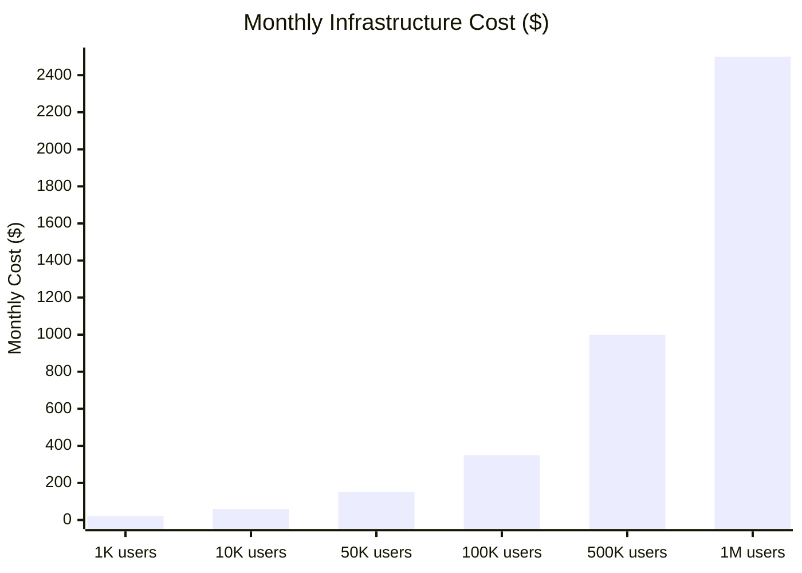

**Detailed cost breakdown:**

| Component         | Tier 1 (1K)    | Tier 2 (10K)     | Tier 3 (100K)    | Tier 4 (1M)       |
| ----------------- | -------------- | ---------------- | ---------------- | ----------------- |
| VPS (compute)     | $10–20         | $40–60           | $100–200         | $500–800          |
| Database storage  | Included       | $10–20           | $30–50           | $100–200          |
| PowerSync         | Self-hosted    | Self-hosted      | Cloud ($50–100)  | Cloud ($200–500)  |
| Backups           | $5             | $10–20           | $50–100          | $200–500          |
| CDN (Cloudflare)  | Free           | Free             | $20              | $50–100           |
| Monitoring        | Free           | $10              | $20              | $50               |
| Domain + SSL      | $15/yr         | $15/yr           | $15/yr           | $15/yr            |
| **Total/month**   | **$20–40**     | **$60–120**      | **$200–500**     | **$1,000–2,500**  |
| **Cost per user** | **$0.02–0.04** | **$0.006–0.012** | **$0.002–0.005** | **$0.001–0.0025** |

**Revenue vs. cost (freemium model):**

Assuming 5% conversion to Plus ($4.99/mo) and 1% to Pro ($9.99/mo):

| Users | Paying Users | Monthly Revenue | Monthly Cost | Margin |
| ----- | ------------ | --------------- | ------------ | ------ |
| 10K   | 600          | $3,694          | $60–120      | 97%    |
| 100K  | 6,000        | $36,940         | $200–500     | 99%    |
| 1M    | 60,000       | $369,400        | $1,000–2,500 | 99%    |

---

## 9. Bottleneck Analysis

Identifying the first bottleneck at each scale tier:

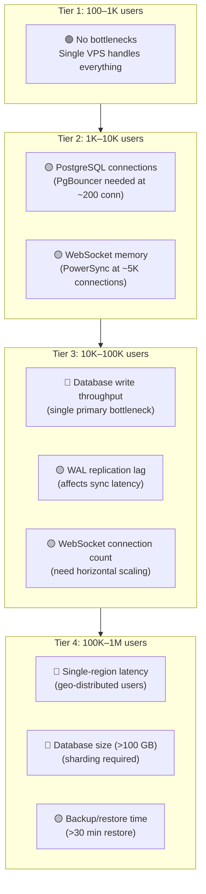

**Mitigation per bottleneck:**

| Bottleneck             | Trigger                   | Mitigation                                | ADR Reference   |
| ---------------------- | ------------------------- | ----------------------------------------- | --------------- |
| PostgreSQL connections | > 200 concurrent          | PgBouncer (transaction mode, pool=50)     | ADR-0011 Tier 1 |
| WebSocket memory       | > 5K connections          | Dedicated PowerSync VPS                   | ADR-0011 Tier 2 |
| DB write throughput    | > 5K writes/sec           | Read replica + Citus sharding             | ADR-0011 Tier 3 |
| WAL replication lag    | > 5s p95                  | Tune `max_wal_senders`, dedicated replica | ADR-0011 Tier 2 |
| Geo-latency            | Users > 200ms from server | Multi-region read replicas                | ADR-0011 Tier 4 |
| DB size                | > 100 GB                  | Citus sharding by household_id            | ADR-0011 Tier 3 |
| Backup time            | > 30 min restore          | Incremental backups (pgBackRest)          | —               |

---

## 10. Scaling Decision Framework

When to trigger each scaling tier:

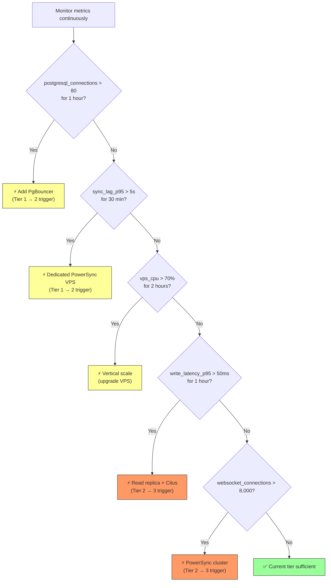

**Monitoring stack:**

| Metric                 | Source                | Alert Threshold    |
| ---------------------- | --------------------- | ------------------ |
| PostgreSQL connections | `pg_stat_activity`    | > 80 active for 1h |
| Sync lag P95           | PowerSync metrics     | > 5s for 30min     |
| VPS CPU utilization    | Node exporter         | > 70% for 2h       |
| VPS memory utilization | Node exporter         | > 85% for 1h       |
| Write latency P95      | `pg_stat_statements`  | > 50ms for 1h      |
| WebSocket connections  | PowerSync metrics     | > 80% of capacity  |
| Disk usage             | Node exporter         | > 75% of volume    |
| WAL lag (replication)  | `pg_stat_replication` | > 10s for 15min    |

---

## 11. Load Testing Strategy

Before scaling decisions, validate assumptions with realistic load tests.

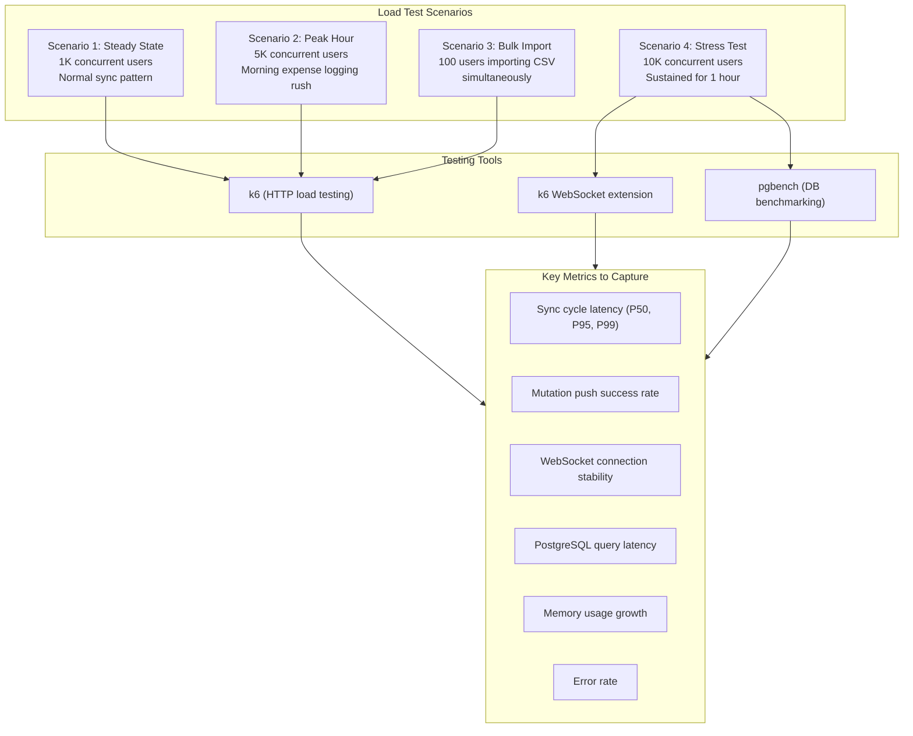

**Load test acceptance criteria:**

| Metric              | Acceptable  | Warning     | Critical  |
| ------------------- | ----------- | ----------- | --------- |
| Sync cycle P95      | < 500ms     | 500ms–2s    | > 2s      |
| Push success rate   | > 99.9%     | 99–99.9%    | < 99%     |
| WebSocket drop rate | < 0.1%/hour | 0.1–1%/hour | > 1%/hour |
| DB query P95        | < 50ms      | 50–200ms    | > 200ms   |
| Error rate          | < 0.1%      | 0.1–1%      | > 1%      |

---

## References

- [ADR-0011: Scaling Architecture](./0011-scaling-architecture.md) — Phased scaling tiers
- [ADR-0002: Backend & Sync Architecture](./0002-backend-sync-architecture.md) — Sync protocol design
- [ADR-0007: Hosting Strategy](./0007-hosting-strategy.md) — VPS infrastructure
- [ADR-0015: Premium Architecture](./adr/adr-0015-premium-architecture.md) — Tier-based rate limits
- [Data Flow Diagrams](./data-flow.md) — Detailed sync flow diagrams
- `packages/sync/src/commonMain/kotlin/com/finance/sync/SyncConfig.kt`
- `packages/sync/src/commonMain/kotlin/com/finance/sync/queue/QueueProcessor.kt`
- [Citus Documentation](https://docs.citusdata.com/)
- [PgBouncer](https://www.pgbouncer.org/)
- [k6 Load Testing](https://k6.io/)

_Last updated: 2025-04-21. Maintained by `@system-architect`._
