# Security Architecture Review — Finance Application

_Last updated: 2025-04-21_

This document provides a comprehensive review of the Finance application's security architecture, covering encryption, authentication, session management, certificate pinning, biometric integration, threat modeling, and compliance mapping. It consolidates and extends the security decisions in [ADR-0004 (Auth & Security)](./0004-auth-security-architecture.md) with implementation-level detail.

---

## Table of Contents

- [1. Security Architecture Overview](#1-security-architecture-overview)
- [2. Encryption at Rest](#2-encryption-at-rest)
- [3. Encryption in Transit](#3-encryption-in-transit)
- [4. Authentication Flow](#4-authentication-flow)
- [5. Session Management](#5-session-management)
- [6. Biometric Authentication](#6-biometric-authentication)
- [7. Certificate Pinning](#7-certificate-pinning)
- [8. Key Hierarchy & Rotation](#8-key-hierarchy--rotation)
- [9. Threat Model (STRIDE)](#9-threat-model-stride)
- [10. Defense-in-Depth Layers](#10-defense-in-depth-layers)
- [11. Platform Security Integration](#11-platform-security-integration)
- [12. Compliance Mapping](#12-compliance-mapping)
- [13. Security Monitoring & Incident Response](#13-security-monitoring--incident-response)

---

## 1. Security Architecture Overview

Finance handles sensitive financial data across four platforms. The security architecture follows defense-in-depth: multiple independent layers ensure that a breach of any single layer does not compromise user data.

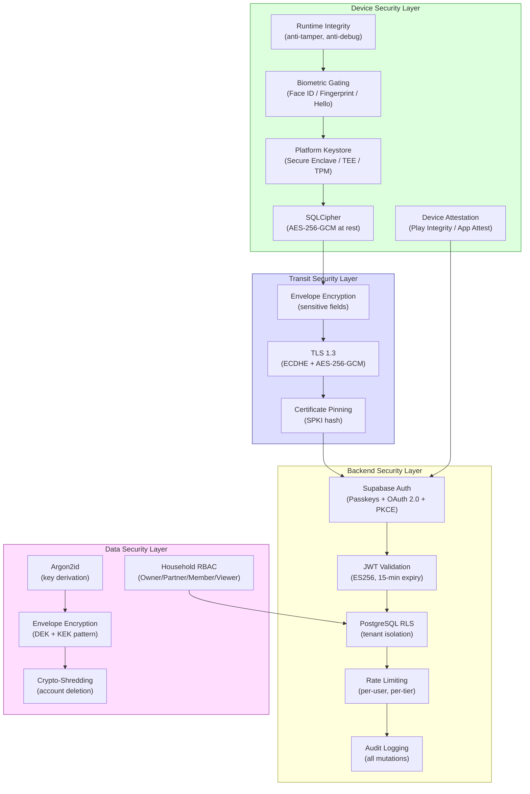
```mermaid
graph TD
    subgraph DeviceSecurity["Device Security Layer"]
        Bio["Biometric Gating<br/>(Face ID / Fingerprint / Hello)"]
        KS["Platform Keystore<br/>(Secure Enclave / TEE / TPM)"]
        SQLCipher["SQLCipher<br/>(AES-256-GCM at rest)"]
        Attest["Device Attestation<br/>(Play Integrity / App Attest)"]
        Integrity["Runtime Integrity<br/>(anti-tamper, anti-debug)"]
    end

    subgraph TransitSecurity["Transit Security Layer"]
        TLS["TLS 1.3<br/>(ECDHE + AES-256-GCM)"]
        Pin["Certificate Pinning<br/>(SPKI hash)"]
        E2E["Envelope Encryption<br/>(sensitive fields)"]
    end

    subgraph BackendSecurity["Backend Security Layer"]
        Auth["Supabase Auth<br/>(Passkeys + OAuth 2.0 + PKCE)"]
        JWT["JWT Validation<br/>(ES256, 15-min expiry)"]
        RLS["PostgreSQL RLS<br/>(tenant isolation)"]
        RateLimit["Rate Limiting<br/>(per-user, per-tier)"]
        Audit["Audit Logging<br/>(all mutations)"]
    end

    subgraph DataSecurity["Data Security Layer"]
        Envelope["Envelope Encryption<br/>(DEK + KEK pattern)"]
        Argon["Argon2id<br/>(key derivation)"]
        CryptoShred["Crypto-Shredding<br/>(account deletion)"]
        RBAC["Household RBAC<br/>(Owner/Partner/Member/Viewer)"]
    end

    Bio --> KS
    KS --> SQLCipher
    SQLCipher --> E2E
    E2E --> TLS
    TLS --> Pin
    Pin --> Auth
    Auth --> JWT
    JWT --> RLS
    RLS --> RateLimit
    RateLimit --> Audit

    Envelope --> CryptoShred
    Argon --> Envelope
    RBAC --> RLS

    Attest --> Auth
    Integrity --> Bio

    style DeviceSecurity fill:#dfd,stroke:#393
    style TransitSecurity fill:#ddf,stroke:#339
    style BackendSecurity fill:#ffd,stroke:#993
    style DataSecurity fill:#fdf,stroke:#939
```

---

## 2. Encryption at Rest

All financial data is encrypted on every storage surface.

### 2.1 Local Database Encryption (SQLCipher)

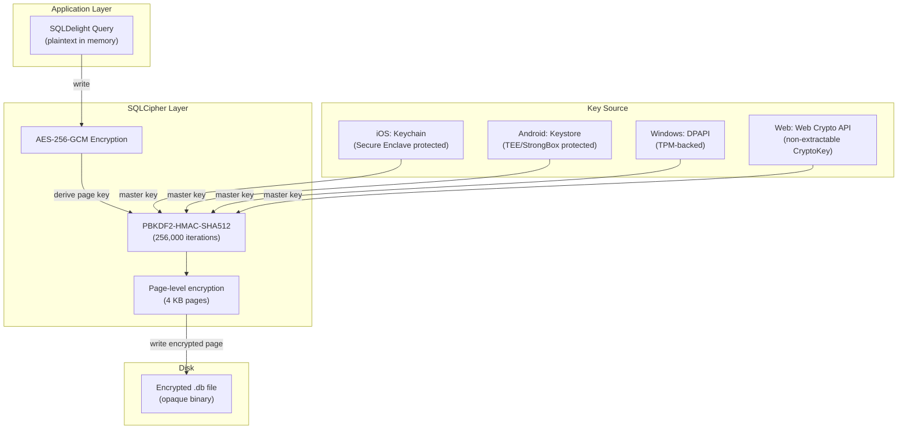
```mermaid
graph TD
    subgraph App["Application Layer"]
        SQL["SQLDelight Query<br/>(plaintext in memory)"]
    end

    subgraph SQLCipher["SQLCipher Layer"]
        ENC["AES-256-GCM Encryption"]
        KDF["PBKDF2-HMAC-SHA512<br/>(256,000 iterations)"]
        PAGE["Page-level encryption<br/>(4 KB pages)"]
    end

    subgraph Storage["Disk"]
        DB["Encrypted .db file<br/>(opaque binary)"]
    end

    subgraph KeySource["Key Source"]
        KS_iOS["iOS: Keychain<br/>(Secure Enclave protected)"]
        KS_Android["Android: Keystore<br/>(TEE/StrongBox protected)"]
        KS_Win["Windows: DPAPI<br/>(TPM-backed)"]
        KS_Web["Web: Web Crypto API<br/>(non-extractable CryptoKey)"]
    end

    SQL -->|"write"| ENC
    ENC -->|"derive page key"| KDF
    KDF --> PAGE
    PAGE -->|"write encrypted page"| DB

    KS_iOS -->|"master key"| KDF
    KS_Android -->|"master key"| KDF
    KS_Win -->|"master key"| KDF
    KS_Web -->|"master key"| KDF
```

**SQLCipher configuration per platform:**

| Platform | SQLCipher Version | KDF Algorithm            | Key Storage                                               | Hardware Protection |
| -------- | ----------------- | ------------------------ | --------------------------------------------------------- | ------------------- |
| iOS      | SQLCipher 4.x     | PBKDF2 (256K iterations) | Keychain (`kSecAttrAccessibleWhenUnlockedThisDeviceOnly`) | Secure Enclave      |
| Android  | SQLCipher 4.x     | PBKDF2 (256K iterations) | AndroidKeyStore (`PURPOSE_ENCRYPT \| DECRYPT`)            | TEE / StrongBox     |
| Windows  | SQLCipher 4.x     | PBKDF2 (256K iterations) | DPAPI (`PasswordVault`)                                   | TPM 2.0             |
| Web      | Not applicable    | —                        | Web Crypto API                                            | Browser sandbox     |

### 2.2 Sensitive Field Encryption (Envelope Pattern)

Beyond database-level encryption, sensitive fields use an additional encryption layer so the server never sees plaintext financial data.

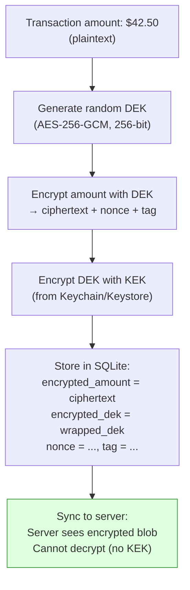
```mermaid
flowchart TD
    A["Transaction amount: $42.50<br/>(plaintext)"] --> B["Generate random DEK<br/>(AES-256-GCM, 256-bit)"]
    B --> C["Encrypt amount with DEK<br/>→ ciphertext + nonce + tag"]
    C --> D["Encrypt DEK with KEK<br/>(from Keychain/Keystore)"]
    D --> E["Store in SQLite:<br/>encrypted_amount = ciphertext<br/>encrypted_dek = wrapped_dek<br/>nonce = ..., tag = ..."]

    E --> F["Sync to server:<br/>Server sees encrypted blob<br/>Cannot decrypt (no KEK)"]

    style F fill:#dfd,stroke:#393
```

**Fields encrypted end-to-end:**

| Field           | Table        | Encryption        | Server Can Read          |
| --------------- | ------------ | ----------------- | ------------------------ |
| `amount_cents`  | transactions | AES-256-GCM (DEK) | ❌ No                    |
| `balance_cents` | accounts     | AES-256-GCM (DEK) | ❌ No                    |
| `note`          | transactions | AES-256-GCM (DEK) | ❌ No                    |
| `target_cents`  | goals        | AES-256-GCM (DEK) | ❌ No                    |
| `current_cents` | goals        | AES-256-GCM (DEK) | ❌ No                    |
| `category_id`   | transactions | Plaintext         | ✅ Yes (needed for sync) |
| `date`          | transactions | Plaintext         | ✅ Yes (needed for sync) |
| `household_id`  | all tables   | Plaintext         | ✅ Yes (needed for RLS)  |
| `created_at`    | all tables   | Plaintext         | ✅ Yes (needed for sync) |

---

## 3. Encryption in Transit

### 3.1 TLS Configuration

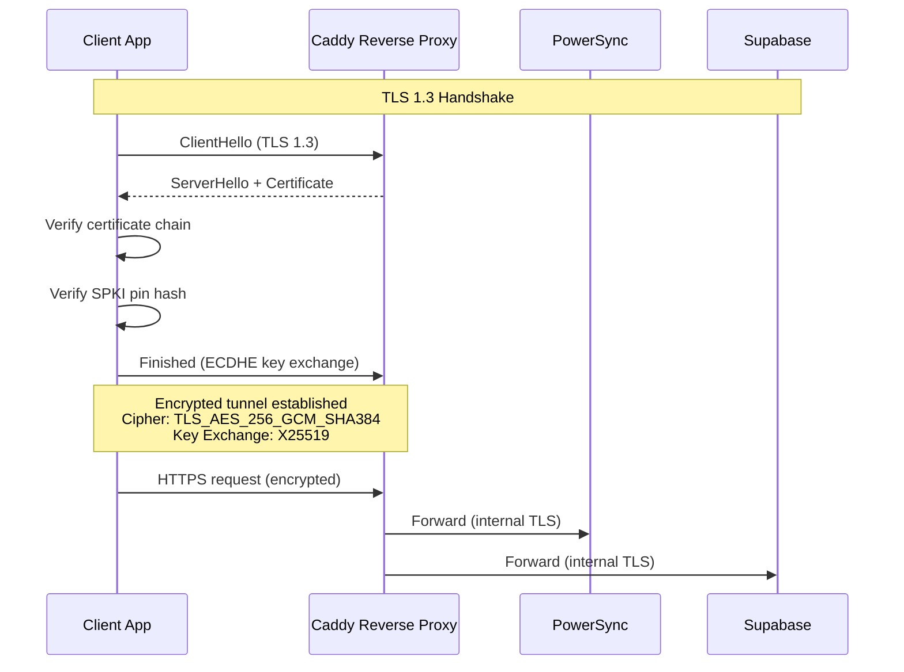
```mermaid
sequenceDiagram
    participant Client as Client App
    participant Caddy as Caddy Reverse Proxy
    participant PS as PowerSync
    participant SB as Supabase

    Note over Client,SB: TLS 1.3 Handshake
    Client->>Caddy: ClientHello (TLS 1.3)
    Caddy-->>Client: ServerHello + Certificate
    Client->>Client: Verify certificate chain
    Client->>Client: Verify SPKI pin hash
    Client->>Caddy: Finished (ECDHE key exchange)

    Note over Client,Caddy: Encrypted tunnel established<br/>Cipher: TLS_AES_256_GCM_SHA384<br/>Key Exchange: X25519

    Client->>Caddy: HTTPS request (encrypted)
    Caddy->>PS: Forward (internal TLS)
    Caddy->>SB: Forward (internal TLS)
```

**TLS configuration requirements:**

| Setting             | Value                                                | Rationale                             |
| ------------------- | ---------------------------------------------------- | ------------------------------------- |
| Minimum TLS version | 1.3                                                  | 1.2 deprecated for new financial apps |
| Cipher suites       | TLS_AES_256_GCM_SHA384, TLS_CHACHA20_POLY1305_SHA256 | AEAD only                             |
| Key exchange        | X25519 (ECDHE)                                       | Forward secrecy                       |
| Certificate         | Let's Encrypt (ECDSA P-256)                          | Auto-renewed via Caddy                |
| HSTS                | `max-age=63072000; includeSubDomains; preload`       | 2-year HSTS with preload              |
| OCSP stapling       | Enabled                                              | Avoids client-side OCSP check latency |

### 3.2 WebSocket Security

PowerSync uses persistent WebSocket connections for real-time sync:

| Property         | Configuration                         |
| ---------------- | ------------------------------------- |
| Protocol         | WSS (WebSocket Secure over TLS 1.3)   |
| Auth             | JWT bearer token in initial handshake |
| Heartbeat        | 30-second ping/pong                   |
| Max message size | 1 MB (configurable)                   |
| Compression      | `permessage-deflate` when enabled     |

---

## 4. Authentication Flow

### 4.1 Complete Authentication Decision Tree

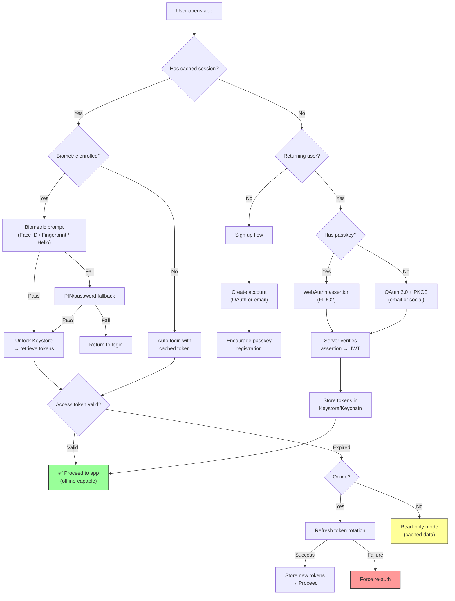
```mermaid
flowchart TD
    A["User opens app"] --> B{"Has cached session?"}

    B -->|Yes| C{"Biometric enrolled?"}
    C -->|Yes| D["Biometric prompt<br/>(Face ID / Fingerprint / Hello)"]
    D -->|Pass| E["Unlock Keystore<br/>→ retrieve tokens"]
    D -->|Fail| F["PIN/password fallback"]
    F -->|Pass| E
    F -->|Fail| G["Return to login"]

    C -->|No| H["Auto-login with<br/>cached token"]

    E --> I{"Access token valid?"}
    H --> I
    I -->|Valid| J["✅ Proceed to app<br/>(offline-capable)"]
    I -->|Expired| K{"Online?"}
    K -->|Yes| L["Refresh token rotation"]
    L -->|Success| M["Store new tokens<br/>→ Proceed"]
    L -->|Failure| N["Force re-auth"]
    K -->|No| O["Read-only mode<br/>(cached data)"]

    B -->|No| P{"Returning user?"}
    P -->|Yes| Q{"Has passkey?"}
    Q -->|Yes| R["WebAuthn assertion<br/>(FIDO2)"]
    Q -->|No| S["OAuth 2.0 + PKCE<br/>(email or social)"]

    P -->|No| T["Sign up flow"]
    T --> U["Create account<br/>(OAuth or email)"]
    U --> V["Encourage passkey<br/>registration"]

    R --> W["Server verifies<br/>assertion → JWT"]
    S --> W
    W --> X["Store tokens in<br/>Keystore/Keychain"]
    X --> J

    style J fill:#9f9,stroke:#333
    style O fill:#ff9,stroke:#333
    style N fill:#f99,stroke:#333
```

### 4.2 Passkey (WebAuthn/FIDO2) Registration

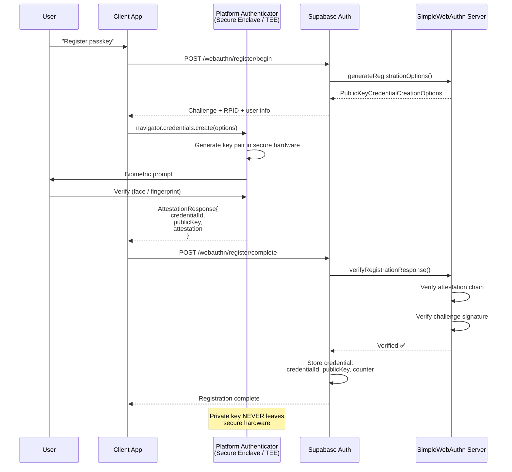
```mermaid
sequenceDiagram
    participant User
    participant App as Client App
    participant Bio as Platform Authenticator<br/>(Secure Enclave / TEE)
    participant Auth as Supabase Auth
    participant WebAuthn as SimpleWebAuthn Server

    User->>App: "Register passkey"
    App->>Auth: POST /webauthn/register/begin
    Auth->>WebAuthn: generateRegistrationOptions()
    WebAuthn-->>Auth: PublicKeyCredentialCreationOptions

    Auth-->>App: Challenge + RPID + user info

    App->>Bio: navigator.credentials.create(options)
    Bio->>Bio: Generate key pair in secure hardware
    Bio->>User: Biometric prompt
    User->>Bio: Verify (face / fingerprint)
    Bio-->>App: AttestationResponse{<br/>  credentialId,<br/>  publicKey,<br/>  attestation<br/>}

    App->>Auth: POST /webauthn/register/complete
    Auth->>WebAuthn: verifyRegistrationResponse()
    WebAuthn->>WebAuthn: Verify attestation chain
    WebAuthn->>WebAuthn: Verify challenge signature
    WebAuthn-->>Auth: Verified ✅

    Auth->>Auth: Store credential:<br/>credentialId, publicKey, counter
    Auth-->>App: Registration complete

    Note over Bio: Private key NEVER leaves<br/>secure hardware
```

### 4.3 OAuth 2.0 + PKCE Flow

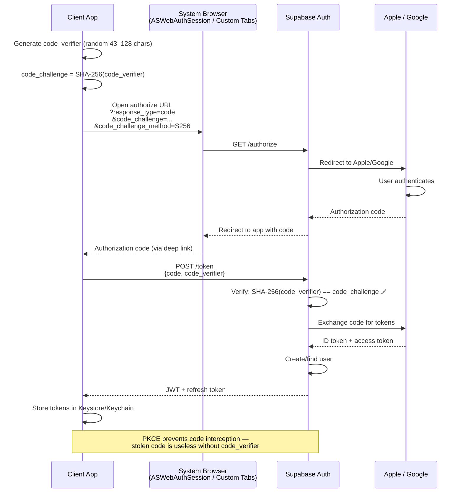
```mermaid
sequenceDiagram
    participant App as Client App
    participant Browser as System Browser<br/>(ASWebAuthSession / Custom Tabs)
    participant Auth as Supabase Auth
    participant Provider as Apple / Google

    App->>App: Generate code_verifier (random 43–128 chars)
    App->>App: code_challenge = SHA-256(code_verifier)

    App->>Browser: Open authorize URL<br/>?response_type=code<br/>&code_challenge=...<br/>&code_challenge_method=S256

    Browser->>Auth: GET /authorize
    Auth->>Provider: Redirect to Apple/Google
    Provider->>Provider: User authenticates
    Provider-->>Auth: Authorization code
    Auth-->>Browser: Redirect to app with code

    Browser-->>App: Authorization code (via deep link)

    App->>Auth: POST /token<br/>{code, code_verifier}
    Auth->>Auth: Verify: SHA-256(code_verifier) == code_challenge ✅
    Auth->>Provider: Exchange code for tokens
    Provider-->>Auth: ID token + access token
    Auth->>Auth: Create/find user
    Auth-->>App: JWT + refresh token

    App->>App: Store tokens in Keystore/Keychain

    Note over App,Auth: PKCE prevents code interception —<br/>stolen code is useless without code_verifier
```

---

## 5. Session Management

### 5.1 Token Lifecycle

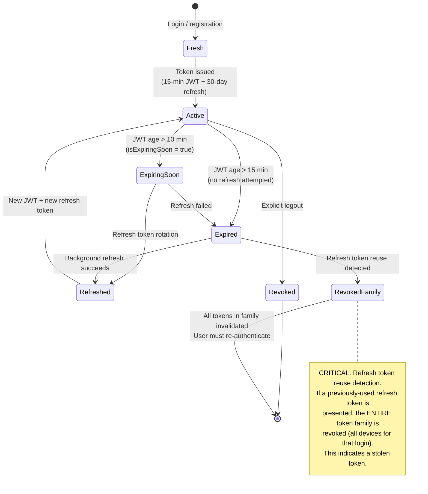
```mermaid
stateDiagram-v2
    [*] --> Fresh: Login / registration

    Fresh --> Active: Token issued<br/>(15-min JWT + 30-day refresh)

    Active --> ExpiringSoon: JWT age > 10 min<br/>(isExpiringSoon = true)
    ExpiringSoon --> Refreshed: Refresh token rotation
    Refreshed --> Active: New JWT + new refresh token

    Active --> Expired: JWT age > 15 min<br/>(no refresh attempted)
    ExpiringSoon --> Expired: Refresh failed

    Expired --> Refreshed: Background refresh succeeds
    Expired --> RevokedFamily: Refresh token reuse detected

    Active --> Revoked: Explicit logout
    Revoked --> [*]

    RevokedFamily --> [*]: All tokens in family invalidated<br/>User must re-authenticate

    note right of RevokedFamily
        CRITICAL: Refresh token reuse detection.
        If a previously-used refresh token is
        presented, the ENTIRE token family is
        revoked (all devices for that login).
        This indicates a stolen token.
    end note
```

### 5.2 Refresh Token Rotation

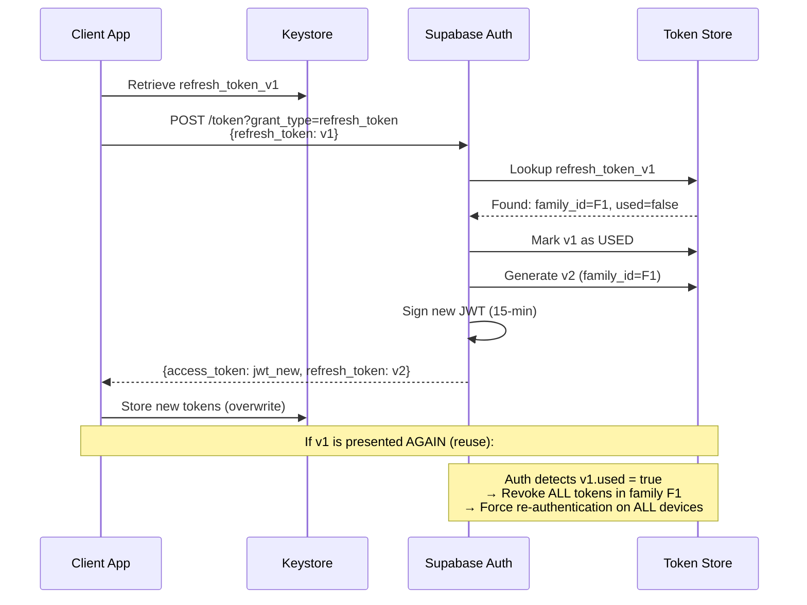
```mermaid
sequenceDiagram
    participant App as Client App
    participant KS as Keystore
    participant Auth as Supabase Auth
    participant DB as Token Store

    App->>KS: Retrieve refresh_token_v1
    App->>Auth: POST /token?grant_type=refresh_token<br/>{refresh_token: v1}

    Auth->>DB: Lookup refresh_token_v1
    DB-->>Auth: Found: family_id=F1, used=false

    Auth->>DB: Mark v1 as USED
    Auth->>DB: Generate v2 (family_id=F1)
    Auth->>Auth: Sign new JWT (15-min)

    Auth-->>App: {access_token: jwt_new, refresh_token: v2}
    App->>KS: Store new tokens (overwrite)

    Note over App,DB: If v1 is presented AGAIN (reuse):
    Note over Auth,DB: Auth detects v1.used = true<br/>→ Revoke ALL tokens in family F1<br/>→ Force re-authentication on ALL devices
```

### 5.3 Token Storage Security

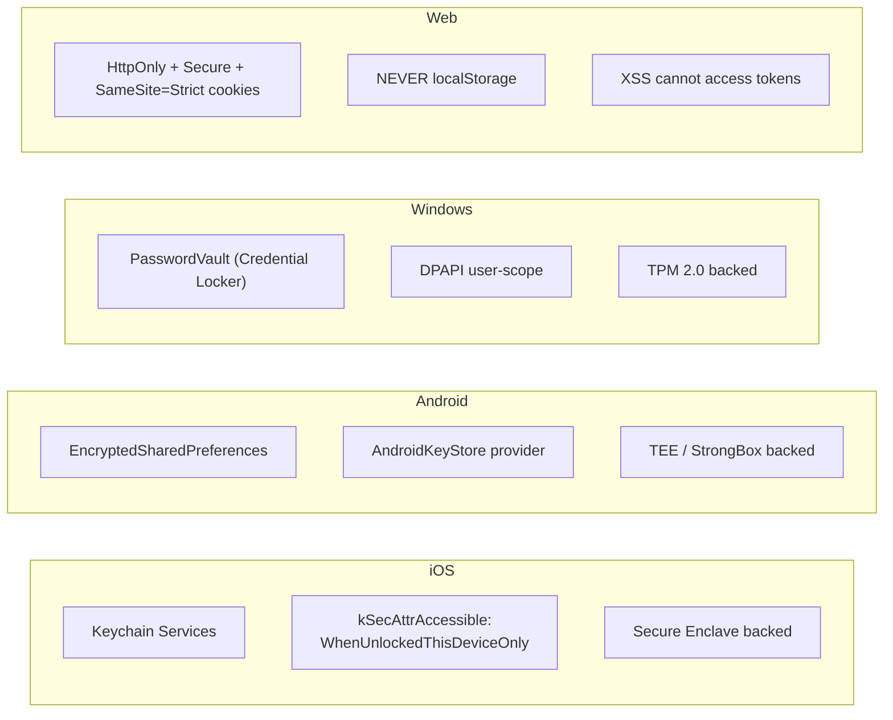
```mermaid
graph LR
    subgraph iOS["iOS"]
        IK["Keychain Services"]
        IA["kSecAttrAccessible:<br/>WhenUnlockedThisDeviceOnly"]
        IS["Secure Enclave backed"]
    end

    subgraph Android["Android"]
        AK["EncryptedSharedPreferences"]
        AA["AndroidKeyStore provider"]
        AT["TEE / StrongBox backed"]
    end

    subgraph Windows["Windows"]
        WK["PasswordVault (Credential Locker)"]
        WA["DPAPI user-scope"]
        WT["TPM 2.0 backed"]
    end

    subgraph Web["Web"]
        WC["HttpOnly + Secure + SameSite=Strict cookies"]
        WN["NEVER localStorage"]
        WX["XSS cannot access tokens"]
    end
```

| Platform | Storage                    | Token Accessible By                     | Survives                           |
| -------- | -------------------------- | --------------------------------------- | ---------------------------------- |
| iOS      | Keychain                   | App only (entitlement + biometric gate) | App reinstall: No (ThisDeviceOnly) |
| Android  | EncryptedSharedPreferences | App only (Keystore + biometric gate)    | App reinstall: No                  |
| Windows  | PasswordVault              | App only (DPAPI user scope)             | User login session                 |
| Web      | HttpOnly cookies           | HTTP requests only (not JS)             | Browser session / cookie expiry    |

---

## 6. Biometric Authentication

Biometric auth gates access to the local keystore. The app **never** receives raw biometric data.

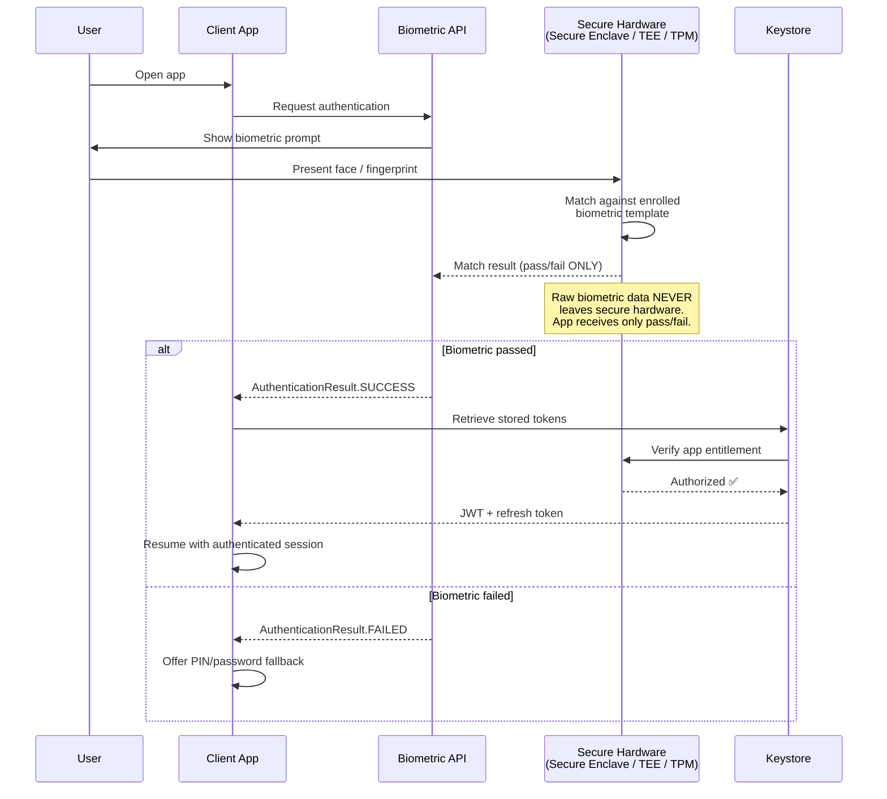
```mermaid
sequenceDiagram
    participant User
    participant App as Client App
    participant BioAPI as Biometric API
    participant Hardware as Secure Hardware<br/>(Secure Enclave / TEE / TPM)
    participant KS as Keystore

    User->>App: Open app
    App->>BioAPI: Request authentication
    BioAPI->>User: Show biometric prompt
    User->>Hardware: Present face / fingerprint

    Hardware->>Hardware: Match against enrolled<br/>biometric template
    Hardware-->>BioAPI: Match result (pass/fail ONLY)

    Note over Hardware: Raw biometric data NEVER<br/>leaves secure hardware.<br/>App receives only pass/fail.

    alt Biometric passed
        BioAPI-->>App: AuthenticationResult.SUCCESS
        App->>KS: Retrieve stored tokens
        KS->>Hardware: Verify app entitlement
        Hardware-->>KS: Authorized ✅
        KS-->>App: JWT + refresh token
        App->>App: Resume with authenticated session
    else Biometric failed
        BioAPI-->>App: AuthenticationResult.FAILED
        App->>App: Offer PIN/password fallback
    end
```

**Platform biometric APIs:**

| Platform | API                                                                      | Hardware                                 | Fallback                    |
| -------- | ------------------------------------------------------------------------ | ---------------------------------------- | --------------------------- |
| iOS      | `LAContext.evaluatePolicy(.deviceOwnerAuthenticationWithBiometrics)`     | Secure Enclave (Face ID / Touch ID)      | Device passcode             |
| Android  | `BiometricPrompt` (Class 3 STRONG only)                                  | TEE / StrongBox                          | Device PIN/pattern          |
| Windows  | `Windows.Security.Credentials.UI.UserConsentVerifier`                    | Windows Hello (face / fingerprint / PIN) | Windows password            |
| Web      | `navigator.credentials.get({publicKey: {userVerification: "required"}})` | Platform authenticator                   | No biometric (passkey only) |

**Security requirements for biometric:**

1. **Class 3 (Strong) biometrics only** on Android — Class 1/2 biometrics (e.g., screen unlock pattern) are not accepted.
2. **Re-authentication required** for sensitive operations: changing account settings, large transfers, deleting data, managing household members.
3. **Biometric change detection:** If biometric enrollment changes (new fingerprint added), invalidate stored keys and require full re-authentication.

---

## 7. Certificate Pinning

Certificate pinning prevents MITM attacks even if a CA is compromised.

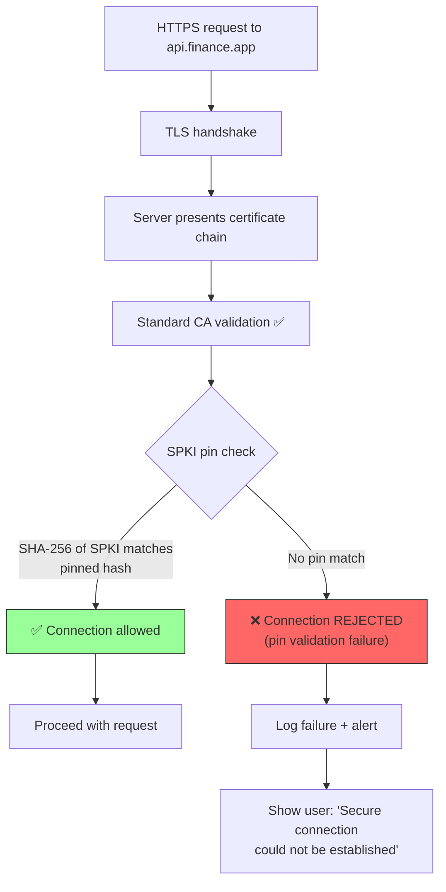
```mermaid
flowchart TD
    A["HTTPS request to api.finance.app"] --> B["TLS handshake"]
    B --> C["Server presents certificate chain"]
    C --> D["Standard CA validation ✅"]
    D --> E{"SPKI pin check"}

    E -->|"SHA-256 of SPKI matches<br/>pinned hash"| F["✅ Connection allowed"]
    E -->|"No pin match"| G["❌ Connection REJECTED<br/>(pin validation failure)"]

    F --> H["Proceed with request"]
    G --> I["Log failure + alert"]
    I --> J["Show user: 'Secure connection<br/>could not be established'"]

    style F fill:#9f9,stroke:#333
    style G fill:#f66,stroke:#333
```

**Pinning configuration per platform:**

| Platform | Implementation                                               | Pin Target             | Backup Pin                   |
| -------- | ------------------------------------------------------------ | ---------------------- | ---------------------------- |
| iOS      | `NSAppTransportSecurity` in Info.plist + URLSession delegate | SPKI hash of leaf cert | SPKI hash of CA intermediate |
| Android  | `network_security_config.xml`                                | SPKI hash of leaf cert | SPKI hash of CA intermediate |
| Windows  | Custom `HttpClientHandler` + manual SPKI validation          | SPKI hash of leaf cert | SPKI hash of CA intermediate |
| Web      | N/A (browser manages)                                        | —                      | —                            |

**Pin rotation strategy:**

1. Always pin **two** SPKI hashes: current certificate and next (backup).
2. When rotating certificates, the backup becomes primary, and a new backup is generated.
3. App updates ship new pin hashes 30 days before certificate rotation.
4. Emergency pin bypass: feature flag `security.cert-pinning.enabled` can disable pinning if a bad pin ships in a release.

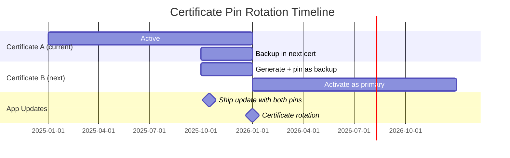
```mermaid
gantt
    title Certificate Pin Rotation Timeline
    dateFormat YYYY-MM-DD

    section Certificate A (current)
    Active             :a1, 2025-01-01, 2025-12-31
    Backup in next cert :a2, 2025-10-01, 2025-12-31

    section Certificate B (next)
    Generate + pin as backup :b1, 2025-10-01, 2025-12-31
    Activate as primary      :b2, 2026-01-01, 2026-12-31

    section App Updates
    Ship update with both pins :milestone, 2025-10-15, 0d
    Certificate rotation       :milestone, 2026-01-01, 0d
```

---

## 8. Key Hierarchy & Rotation

### 8.1 Key Hierarchy

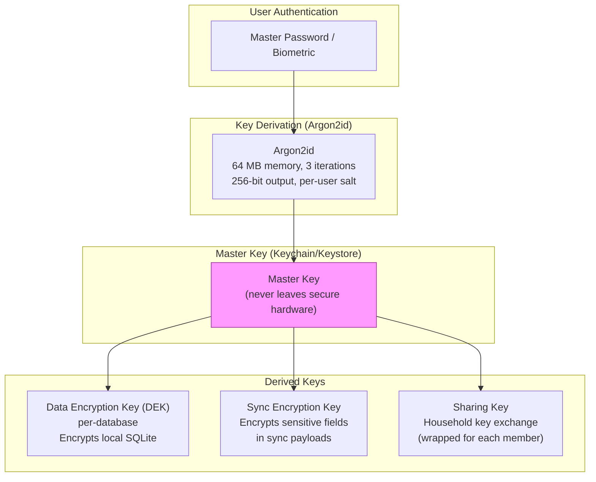
```mermaid
graph TD
    subgraph UserAuth["User Authentication"]
        MP["Master Password / Biometric"]
    end

    subgraph KeyDerivation["Key Derivation (Argon2id)"]
        A2["Argon2id<br/>64 MB memory, 3 iterations<br/>256-bit output, per-user salt"]
    end

    subgraph MasterKey["Master Key (Keychain/Keystore)"]
        MK["Master Key<br/>(never leaves secure hardware)"]
    end

    subgraph DerivedKeys["Derived Keys"]
        DEK["Data Encryption Key (DEK)<br/>per-database<br/>Encrypts local SQLite"]
        SEK["Sync Encryption Key<br/>Encrypts sensitive fields<br/>in sync payloads"]
        SHK["Sharing Key<br/>Household key exchange<br/>(wrapped for each member)"]
    end

    MP --> A2
    A2 --> MK
    MK --> DEK
    MK --> SEK
    MK --> SHK

    style MK fill:#f9f,stroke:#939
```

### 8.2 Key Rotation Schedule

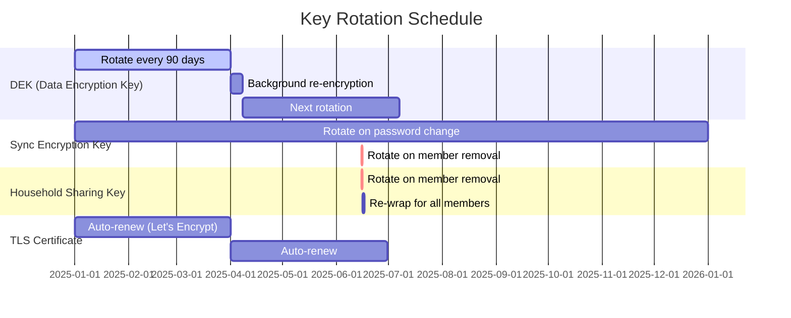
```mermaid
gantt
    title Key Rotation Schedule
    dateFormat YYYY-MM-DD

    section DEK (Data Encryption Key)
    Rotate every 90 days       :active, dek1, 2025-01-01, 90d
    Background re-encryption   :dek2, after dek1, 7d
    Next rotation              :dek3, after dek2, 90d

    section Sync Encryption Key
    Rotate on password change  :sek1, 2025-01-01, 365d
    Rotate on member removal   :crit, sek_event, 2025-06-15, 1d

    section Household Sharing Key
    Rotate on member removal   :crit, shk1, 2025-06-15, 1d
    Re-wrap for all members    :shk2, after shk1, 1d

    section TLS Certificate
    Auto-renew (Let's Encrypt) :tls1, 2025-01-01, 90d
    Auto-renew                 :tls2, after tls1, 90d
```

### 8.3 Crypto-Shredding (Account Deletion)

```mermaid
flowchart TD
    A["User requests account deletion"] --> B["Confirm via re-authentication<br/>(biometric + passkey)"]
    B --> C["Destroy KEK<br/>(delete from Keychain/Keystore)"]
    C --> D["All encrypted data becomes<br/>permanently irrecoverable"]
    D --> E["Delete user row<br/>(cascade to all tables)"]
    E --> F["Sync deletion to all devices"]
    F --> G["Each device destroys<br/>local KEK + database"]

    Note over C,D: Without the KEK, the DEK cannot<br/>be unwrapped. Without the DEK,<br/>all data is random noise — even<br/>in database backups.

    style C fill:#f66,stroke:#933
    style D fill:#f99,stroke:#933
```

---

## 9. Threat Model (STRIDE)

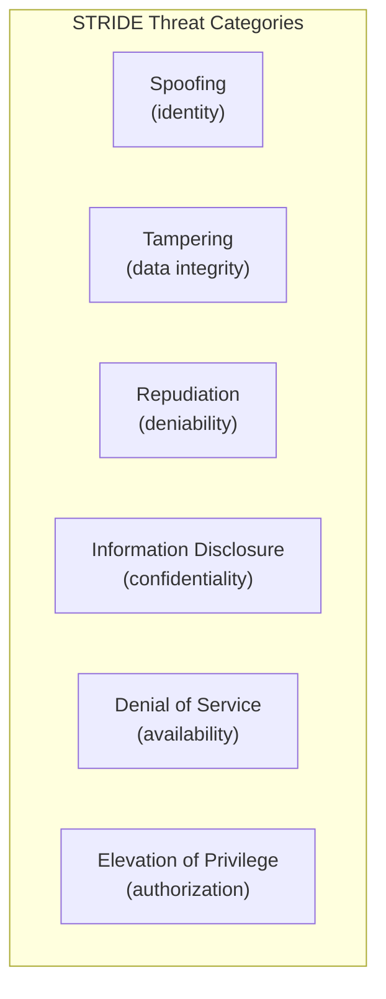
```mermaid
graph TD
    subgraph STRIDE["STRIDE Threat Categories"]
        S["Spoofing<br/>(identity)"]
        T["Tampering<br/>(data integrity)"]
        R["Repudiation<br/>(deniability)"]
        I["Information Disclosure<br/>(confidentiality)"]
        D["Denial of Service<br/>(availability)"]
        E["Elevation of Privilege<br/>(authorization)"]
    end
```

| Threat                          | Category | Attack Vector                      | Mitigation                                                                                | Residual Risk                                |
| ------------------------------- | -------- | ---------------------------------- | ----------------------------------------------------------------------------------------- | -------------------------------------------- |
| **Stolen device access**        | S, I     | Physical access to unlocked device | Biometric gate + auto-lock (30s) + encrypted DB                                           | Low (if biometric enrolled)                  |
| **MITM on public WiFi**         | T, I     | Network interception               | TLS 1.3 + certificate pinning + E2E encryption                                            | Very Low                                     |
| **Phishing for credentials**    | S        | Fake login page                    | Passkeys (phishing-resistant by design)                                                   | Very Low (passkeys); Medium (OAuth fallback) |
| **Token theft (XSS)**           | S, I     | JavaScript injection (web)         | HttpOnly cookies; CSP; no localStorage for tokens                                         | Low                                          |
| **SQL injection**               | T, E     | Malformed sync payloads            | SQLDelight type-safe queries; parameterized; RLS                                          | Very Low                                     |
| **Privilege escalation**        | E        | Modify household_id in request     | RLS enforces household_id from JWT; 3-layer auth check                                    | Very Low                                     |
| **Replay attack**               | S, T     | Replay sync mutations              | Idempotent operations; unique mutation IDs; sequence numbers                              | Very Low                                     |
| **Brute force login**           | S        | Automated login attempts           | Rate limiting (5/min); Argon2id; account lockout after 10 failures                        | Low                                          |
| **Server-side data breach**     | I        | Database compromise                | E2E encryption (server cannot read financial data); encrypted backups                     | Low (financial data protected)               |
| **Sync conflict exploitation**  | T        | Craft conflicting mutations        | ConflictResolver is deterministic; server version validated; RLS prevents cross-household | Low                                          |
| **Clock manipulation**          | T        | Device clock set forward           | Server timestamp validation; 72-hour offline tolerance with sync-required check           | Low                                          |
| **Root/jailbreak exploitation** | E        | Modified device environment        | RuntimeIntegrityChecker; DeviceAttestor; graceful degradation                             | Medium (accept risk for usability)           |

---

## 10. Defense-in-Depth Layers

Every security-relevant operation passes through multiple independent verification layers.

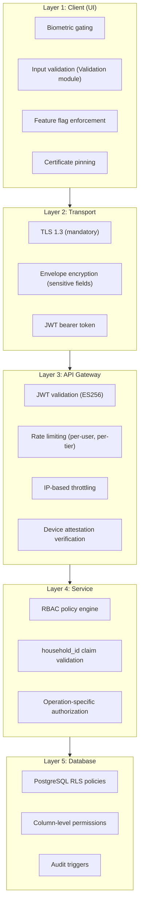
```mermaid
graph TD
    subgraph Layer1["Layer 1: Client (UI)"]
        L1A["Biometric gating"]
        L1B["Input validation (Validation module)"]
        L1C["Feature flag enforcement"]
        L1D["Certificate pinning"]
    end

    subgraph Layer2["Layer 2: Transport"]
        L2A["TLS 1.3 (mandatory)"]
        L2B["Envelope encryption (sensitive fields)"]
        L2C["JWT bearer token"]
    end

    subgraph Layer3["Layer 3: API Gateway"]
        L3A["JWT validation (ES256)"]
        L3B["Rate limiting (per-user, per-tier)"]
        L3C["IP-based throttling"]
        L3D["Device attestation verification"]
    end

    subgraph Layer4["Layer 4: Service"]
        L4A["RBAC policy engine"]
        L4B["household_id claim validation"]
        L4C["Operation-specific authorization"]
    end

    subgraph Layer5["Layer 5: Database"]
        L5A["PostgreSQL RLS policies"]
        L5B["Column-level permissions"]
        L5C["Audit triggers"]
    end

    Layer1 --> Layer2
    Layer2 --> Layer3
    Layer3 --> Layer4
    Layer4 --> Layer5
```

**Example: Adding a transaction goes through all 5 layers:**

| Layer        | Check                                                             | What Happens on Failure    |
| ------------ | ----------------------------------------------------------------- | -------------------------- |
| 1. Client    | Biometric unlock; validation (amount > 0, valid currency)         | Operation rejected locally |
| 2. Transport | TLS 1.3 tunnel; amount encrypted with DEK; JWT attached           | Connection rejected        |
| 3. Gateway   | JWT verified (not expired, valid signature); rate limit checked   | 401/429 response           |
| 4. Service   | RBAC: user has "create transaction" permission for this household | 403 response               |
| 5. Database  | RLS: `household_id = current_setting('app.current_household_id')` | Query returns 0 rows       |

---

## 11. Platform Security Integration

```mermaid
graph TD
    subgraph KMPShared["KMP Shared Security (packages/core/security/)"]
        BCC["BiometricCryptoBinding<br/>(biometric + key binding)"]
        DA["DeviceAttestor<br/>(attestation interface)"]
        RIC["RuntimeIntegrityChecker<br/>(tamper detection)"]
    end

    subgraph iOS_Sec["iOS Security"]
        SE["Secure Enclave"]
        KC["Keychain Services"]
        AA["App Attest"]
        DP["Data Protection API"]
        ATS["App Transport Security"]
    end

    subgraph Android_Sec["Android Security"]
        TEE["TEE / StrongBox"]
        AKS["Android Keystore"]
        PI["Play Integrity API"]
        ESP["EncryptedSharedPreferences"]
        NSC["Network Security Config"]
    end

    subgraph Win_Sec["Windows Security"]
        TPM["TPM 2.0"]
        DPAPI["DPAPI"]
        WH["Windows Hello"]
        VBS["Virtualization-Based Security"]
    end

    subgraph Web_Sec["Web Security"]
        WC["Web Crypto API"]
        CSP["Content Security Policy"]
        CORS["CORS Policy"]
        SRI["Subresource Integrity"]
    end

    BCC -->|"expect/actual"| SE
    BCC -->|"expect/actual"| TEE
    BCC -->|"expect/actual"| TPM
    BCC -->|"expect/actual"| WC

    DA -->|"expect/actual"| AA
    DA -->|"expect/actual"| PI
    DA -->|"expect/actual"| VBS

    RIC -->|"expect/actual"| DP
    RIC -->|"expect/actual"| ESP
    RIC -->|"expect/actual"| DPAPI
    RIC -->|"expect/actual"| CSP
```

---

## 12. Compliance Mapping

### 12.1 OWASP MASVS Mapping

| MASVS Category       | Requirement                          | Finance Implementation                       | Status         |
| -------------------- | ------------------------------------ | -------------------------------------------- | -------------- |
| **MASVS-STORAGE**    | Sensitive data encrypted at rest     | SQLCipher + Keychain/Keystore                | ✅ Implemented |
| **MASVS-STORAGE**    | No sensitive data in logs/backups    | Log filtering; backup encryption             | ✅ Implemented |
| **MASVS-CRYPTO**     | Strong cryptographic algorithms      | AES-256-GCM, Argon2id, ES256                 | ✅ Implemented |
| **MASVS-CRYPTO**     | Key management in secure hardware    | Secure Enclave/TEE/TPM                       | ✅ Implemented |
| **MASVS-AUTH**       | Biometric authentication             | Platform biometric APIs (Class 3)            | ✅ Implemented |
| **MASVS-AUTH**       | Session management                   | JWT (15-min) + refresh rotation              | ✅ Implemented |
| **MASVS-NETWORK**    | TLS for all connections              | TLS 1.3 mandatory                            | ✅ Implemented |
| **MASVS-NETWORK**    | Certificate pinning                  | SPKI pinning on native apps                  | ✅ Implemented |
| **MASVS-PLATFORM**   | Inter-process communication security | No exported components; deep link validation | ✅ Implemented |
| **MASVS-RESILIENCE** | Anti-tampering                       | RuntimeIntegrityChecker                      | ✅ Implemented |
| **MASVS-RESILIENCE** | Device attestation                   | Play Integrity / App Attest                  | ✅ Implemented |

### 12.2 GDPR Compliance

| GDPR Right             | Implementation                        | Mechanism                              |
| ---------------------- | ------------------------------------- | -------------------------------------- |
| Right to Access        | Self-serve data export (JSON/CSV)     | Edge Function: `data-export`           |
| Right to Erasure       | Crypto-shredding (destroy KEK)        | Edge Function: `account-deletion`      |
| Right to Portability   | Machine-readable export format        | JSON export with schema documentation  |
| Right to Rectification | User can edit all personal data       | Standard CRUD via platform app         |
| Data Minimization      | Only necessary data collected         | Sync rules exclude unnecessary columns |
| Purpose Limitation     | Data used only for financial tracking | No advertising, no third-party sharing |

### 12.3 CCPA Compliance

| CCPA Right         | Implementation                                           |
| ------------------ | -------------------------------------------------------- |
| Right to Know      | Privacy policy + data export                             |
| Right to Delete    | Crypto-shredding                                         |
| Right to Opt-Out   | No sale/sharing of personal data (N/A)                   |
| Non-Discrimination | Same service for all users regardless of rights exercise |

---

## 13. Security Monitoring & Incident Response

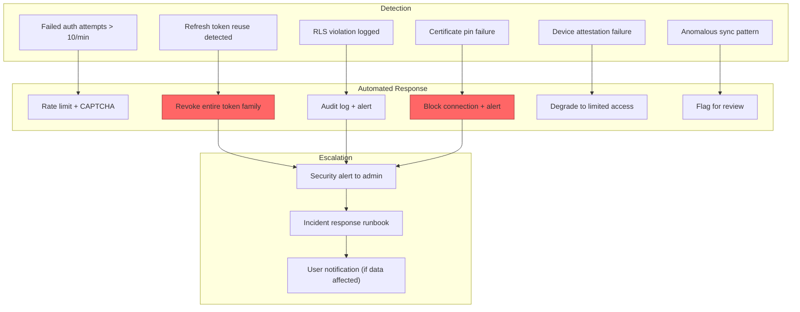
```mermaid
flowchart TD
    subgraph Detection["Detection"]
        A1["Failed auth attempts > 10/min"]
        A2["Refresh token reuse detected"]
        A3["RLS violation logged"]
        A4["Certificate pin failure"]
        A5["Device attestation failure"]
        A6["Anomalous sync pattern"]
    end

    subgraph Response["Automated Response"]
        R1["Rate limit + CAPTCHA"]
        R2["Revoke entire token family"]
        R3["Audit log + alert"]
        R4["Block connection + alert"]
        R5["Degrade to limited access"]
        R6["Flag for review"]
    end

    subgraph Escalation["Escalation"]
        E1["Security alert to admin"]
        E2["Incident response runbook"]
        E3["User notification (if data affected)"]
    end

    A1 --> R1
    A2 --> R2
    A3 --> R3
    A4 --> R4
    A5 --> R5
    A6 --> R6

    R2 --> E1
    R3 --> E1
    R4 --> E1
    E1 --> E2
    E2 --> E3

    style R2 fill:#f66,stroke:#933
    style R4 fill:#f66,stroke:#933
```

**Security event logging:**

| Event                   | Severity | Logged Fields                          | Retention               |
| ----------------------- | -------- | -------------------------------------- | ----------------------- |
| Failed login            | WARNING  | user_id, IP, timestamp, method         | 90 days                 |
| Successful login        | INFO     | user_id, IP, timestamp, method, device | 90 days                 |
| Token refresh           | INFO     | user_id, token_family_id               | 30 days                 |
| Token reuse detected    | CRITICAL | user_id, token_family_id, IP           | 1 year                  |
| RLS policy violation    | CRITICAL | user_id, table, attempted_household_id | 1 year                  |
| Certificate pin failure | HIGH     | IP, presented_cert_hash                | 90 days                 |
| Account deletion        | HIGH     | user_id, timestamp                     | Permanent (audit trail) |

---

## References

- [ADR-0004: Auth & Security Architecture](./0004-auth-security-architecture.md) — Primary security decisions
- [ADR-0002: Backend & Sync Architecture](./0002-backend-sync-architecture.md) — Sync security model
- [ADR-0003: Local Storage Strategy](./0003-local-storage-strategy.md) — SQLCipher configuration
- [OWASP MASVS](https://mas.owasp.org/) — Mobile Application Security Verification Standard
- [MASVS Storage Audit](./masvs-storage-audit.md) — Detailed storage security audit
- [MASVS Network Audit](./masvs-network-audit.md) — Network security audit
- [MASVS Platform Audit](./masvs-platform-audit.md) — Platform security audit
- [MASVS Resilience Audit](./masvs-resilience-audit.md) — Resilience audit
- [Security Audit V1](./security-audit-v1.md) — Initial security audit
- [Privacy Audit V1](./privacy-audit-v1.md) — Privacy review
- [Incident Response Runbook](./incident-response-runbook.md) — Incident procedures
- `packages/core/src/commonMain/kotlin/com/finance/core/security/`
- `packages/sync/src/commonMain/kotlin/com/finance/sync/crypto/`
- [RFC 9700: OAuth 2.0 Security BCP](https://datatracker.ietf.org/doc/rfc9700/)
- [FIDO Alliance: Passkeys](https://fidoalliance.org/passkeys/)
- [SimpleWebAuthn](https://simplewebauthn.dev/)

_Last updated: 2025-04-21. Maintained by `@system-architect`._
