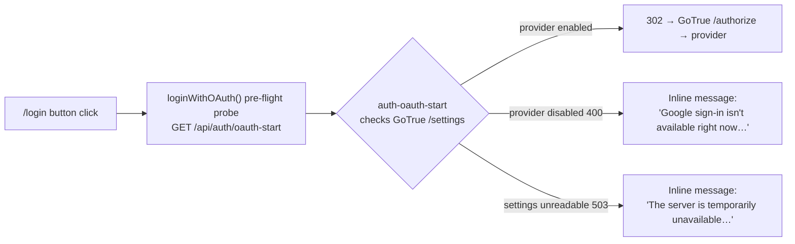

# OAuth Provider Enablement (Deployment Config)

> **Issue:** #3187 — social sign-in fails with `provider is not enabled`
> **Audience:** Human operators with access to the Supabase deployment
> **Related:** [`oauth-setup.md`](./oauth-setup.md) (per-provider credential setup)

This document explains **why** the social sign-in buttons (Continue with
Google / GitHub / Apple) can fail on a deployed environment and the **exact
configuration a human must apply** to enable them. Enabling providers requires
real OAuth credentials, which are secret-gated — **an AI agent cannot perform
this step.** This doc gives the operator a copy-paste checklist.

## Symptom

On the deployed site, clicking **Continue with Google / GitHub / Apple** on
`/login` fails. Before the app-side hardening (#3188/#3187) the browser landed
on a raw JSON page:

```
400 validation_failed — "Unsupported provider: provider is not enabled"
```

That string is emitted by **Supabase GoTrue's** `/auth/v1/authorize`
endpoint — not by our code. It means the external provider is **not enabled /
not configured** in the deployed Supabase Auth instance.

## How the app handles this today (graceful degradation)

The web app no longer dumps the raw GoTrue page. The flow is:



- `services/api/supabase/functions/auth-oauth-start/index.ts` calls
  `fetchProviderEnabled()` (reads GoTrue's public `/auth/v1/settings`) **before**
  issuing the redirect. A disabled provider returns `400`; an unreadable
  settings document returns `503`.
- `apps/web/src/auth/auth-context.tsx` pre-flights that endpoint with
  `redirect: 'manual'` and, on a non-healthy response, shows a friendly,
  accessible, **provider-named** inline message
  (`oauthProviderUnavailableMessage`) instead of navigating the browser onto a
  raw page. Passkey and email/password paths are unaffected.

Because the app degrades gracefully, the social buttons can safely stay
visible — they simply show a helpful message until an operator enables the
providers using the config below.

## Fix: enable the providers (human, secret-gated)

There are two deployment shapes. Use whichever matches your environment.

### Option A — Supabase Cloud (Dashboard)

1. Open the [Supabase Dashboard](https://supabase.com/dashboard) → your project.
2. **Authentication → Providers →** _Google_ / _GitHub_ / _Apple_.
3. Toggle **Enable**, then paste the provider's **Client ID** and **Client
   Secret** (obtain these per [`oauth-setup.md`](./oauth-setup.md)).
4. **Authentication → URL Configuration → Redirect URLs**: add the app callback
   `https://YOUR_APP_DOMAIN/api/auth/oauth-callback`.

### Option B — Self-hosted GoTrue (environment variables)

Set these on the GoTrue container/service. **Use your real values in the
deployment secret store — never commit them and never place them in a
`.env` file tracked by git.** Placeholders shown below:

```bash
# ── Google ───────────────────────────────────────────────────────────────
GOTRUE_EXTERNAL_GOOGLE_ENABLED=true
GOTRUE_EXTERNAL_GOOGLE_CLIENT_ID=YOUR_GOOGLE_CLIENT_ID
GOTRUE_EXTERNAL_GOOGLE_SECRET=YOUR_GOOGLE_CLIENT_SECRET
GOTRUE_EXTERNAL_GOOGLE_REDIRECT_URI=https://YOUR_SUPABASE_REF.supabase.co/auth/v1/callback

# ── GitHub ───────────────────────────────────────────────────────────────
GOTRUE_EXTERNAL_GITHUB_ENABLED=true
GOTRUE_EXTERNAL_GITHUB_CLIENT_ID=YOUR_GITHUB_CLIENT_ID
GOTRUE_EXTERNAL_GITHUB_SECRET=YOUR_GITHUB_CLIENT_SECRET
GOTRUE_EXTERNAL_GITHUB_REDIRECT_URI=https://YOUR_SUPABASE_REF.supabase.co/auth/v1/callback

# ── Apple ────────────────────────────────────────────────────────────────
GOTRUE_EXTERNAL_APPLE_ENABLED=true
GOTRUE_EXTERNAL_APPLE_CLIENT_ID=YOUR_APPLE_SERVICES_ID
GOTRUE_EXTERNAL_APPLE_SECRET=YOUR_APPLE_CLIENT_SECRET_JWT
GOTRUE_EXTERNAL_APPLE_REDIRECT_URI=https://YOUR_SUPABASE_REF.supabase.co/auth/v1/callback

# Allow GoTrue to redirect back to our app callback after the provider hop.
# Comma-separated allow list — include the app's oauth-callback URL.
GOTRUE_URI_ALLOW_LIST=https://YOUR_APP_DOMAIN/api/auth/oauth-callback
```

> Enable only the providers you intend to offer. A provider left disabled
> continues to show the graceful in-app message rather than an error page.

### Edge Function environment (already required, for reference)

The auth Edge Functions that broker the flow require these (see
`services/api/supabase/functions/_shared/env.ts`). They are **not secrets you
generate here** — they are the standard deployment values:

| Variable              | Used by                                   | Value                                               |
| --------------------- | ----------------------------------------- | --------------------------------------------------- |
| `SUPABASE_URL`        | all functions                             | `https://YOUR_SUPABASE_REF.supabase.co`             |
| `SUPABASE_ANON_KEY`   | `auth-oauth-start`, `auth-oauth-callback` | project anon key                                    |
| `OAUTH_REDIRECT_BASE` | `auth-oauth-start`, `auth-oauth-callback` | `https://YOUR_APP_DOMAIN` (the app's public origin) |

`auth-oauth-start` builds the return URL as
`${OAUTH_REDIRECT_BASE}/api/auth/oauth-callback`, so `OAUTH_REDIRECT_BASE` must
match the app's public origin and be present in `GOTRUE_URI_ALLOW_LIST`.

## Redirect URL summary

| Where                                                      | Value                                                    |
| ---------------------------------------------------------- | -------------------------------------------------------- |
| Provider console (Google/GitHub/Apple) authorized redirect | `https://YOUR_SUPABASE_REF.supabase.co/auth/v1/callback` |
| GoTrue `..._REDIRECT_URI`                                  | `https://YOUR_SUPABASE_REF.supabase.co/auth/v1/callback` |
| GoTrue `GOTRUE_URI_ALLOW_LIST` / Dashboard Redirect URLs   | `https://YOUR_APP_DOMAIN/api/auth/oauth-callback`        |

## Verification checklist

After applying the config, verify each enabled provider:

- [ ] `GET https://YOUR_SUPABASE_REF.supabase.co/auth/v1/settings` shows the
      provider `true` under `external` (this is what `auth-oauth-start` reads).
- [ ] Clicking the provider button on `/login` redirects to the provider
      (no raw JSON page).
- [ ] After consent, the browser returns to the app and lands authenticated.
- [ ] A provider you deliberately left disabled still shows the friendly
      inline message — not a raw error page.
- [ ] Passkey and email/password sign-in continue to work.
- [ ] No client secrets are committed to the repo or exposed to the browser.

## Alternative: hide the buttons

Issue #3187 notes a second option — hide the social buttons until providers are
configured — so users aren't offered options that can't work. Because the app
already degrades gracefully with a clear, provider-named message, keeping the
buttons visible is acceptable for beta. If you prefer to hide them, gate the
`.auth-oauth-buttons` group in `apps/web/src/pages/LoginPage.tsx` on a
per-provider enablement probe (tracked separately as a frontend enhancement).
