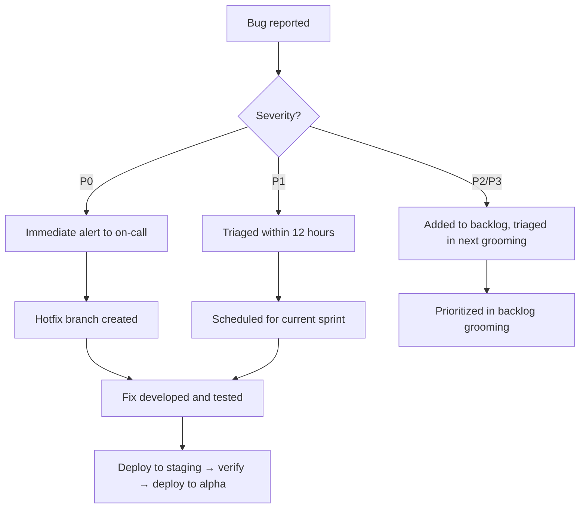
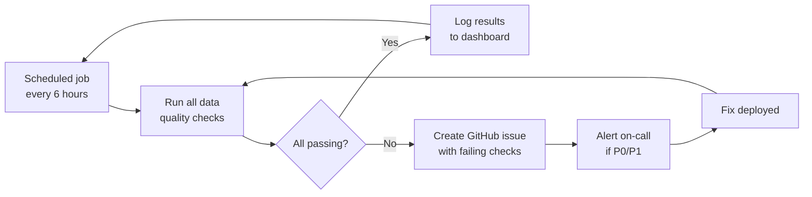

# Alpha Testing Protocol and Data Quality Loop

> **Issue:** [#1392](https://github.com/jrmoulckers/finance/issues/1392)
> **Priority:** P2 — Medium
> **Date:** 2025-07-29
> **Owner:** Product Management
> **Status:** Draft — awaiting human review

---

## Executive Summary

This document defines the repeatable testing protocol for Finance's alpha
launch. It covers three testing phases (Internal → Friends & Family → Wider
Alpha), entry and exit criteria for each phase, automated data-quality checks,
bug triage and escalation, feedback collection mechanisms, key metrics, and the
rollback plan. The goal is to ship a high-quality alpha that surfaces real
issues early while protecting tester data integrity.

### Core Objectives

1. **Catch data-integrity bugs before they compound** — financial data errors
   are uniquely harmful because they erode trust permanently.
2. **Establish a fast feedback loop** — tester → bug report → triage → fix →
   deploy → verify, targeting < 48 hours for P0/P1 issues.
3. **Define clear phase gates** — no phase advances until exit criteria are met.
4. **Automate what can be automated** — data-quality checks run continuously,
   not just when someone remembers to check.

---

## 1. Testing Phases

### Phase Overview

```
Phase 1: Internal          Phase 2: Friends & Family     Phase 3: Wider Alpha
(Team only, ~5 users)      (~20–30 invited testers)      (~100–200 testers)
  Duration: 1–2 weeks        Duration: 2–3 weeks           Duration: 4–6 weeks
  Focus: Core flows,         Focus: Real-world usage,      Focus: Scale, edge
         crash discovery,           UX friction,                  cases, performance,
         data model                 data quality                  sync under load
         validation                 at small scale
         |                          |                             |
         +--- Gate 1 ---------------+--- Gate 2 -----------------+--- Beta Decision
```

### 1.1 Phase 1 — Internal Testing

**Audience:** Core team members and close collaborators (~5 users)

**Duration:** 1–2 weeks

**Objective:** Validate that all core flows work end-to-end on all target
platforms (Android, iOS, Web, Windows) without data loss or corruption.

**Entry Criteria:**

- [ ] All P0 issues from the current sprint are resolved
- [ ] Core CRUD flows (accounts, transactions, budgets, goals) pass automated
      tests on all 4 platforms
- [ ] Sync engine (PowerSync) connects and syncs successfully in staging
- [ ] Authentication (signup, login, logout, token refresh) works on all
      platforms
- [ ] Single-user household constraints are enforced (see
      [alpha-household-constraints.md](alpha-household-constraints.md))
- [ ] Feature flags for alpha are configured in staging environment
- [ ] Crash reporting (Sentry or equivalent) is active on all platforms
- [ ] Staging environment is provisioned and stable

**Exit Criteria (Gate 1):**

- [ ] Zero P0 bugs open
- [ ] ≤ 2 P1 bugs open (with fixes in progress)
- [ ] All 4 platforms tested by at least 1 internal tester
- [ ] Data quality score ≥ 95% (see [Section 3](#3-data-quality-checks))
- [ ] No data loss incidents
- [ ] Sync consistency check passes on all active accounts
- [ ] Core user journey completion rate ≥ 90%
      (signup → add account → add transaction → view balance)

### 1.2 Phase 2 — Friends & Family

**Audience:** Trusted external testers recruited from personal network
(~20–30 users)

**Duration:** 2–3 weeks

**Objective:** Validate real-world usage patterns, identify UX friction, and
verify data quality holds with diverse input patterns (different currencies,
category usage, transaction volumes).

**Entry Criteria:**

- [ ] Gate 1 passed
- [ ] Onboarding flow polished (no placeholder copy, no broken links)
- [ ] In-app feedback mechanism is functional
- [ ] Privacy policy and terms of service are published
- [ ] Data export works (users can retrieve their data at any time)
- [ ] Known issues documented in a tester-facing FAQ or known-issues list

**Exit Criteria (Gate 2):**

- [ ] Zero P0 bugs open
- [ ] ≤ 3 P1 bugs open (with fixes in progress or scheduled)
- [ ] Data quality score ≥ 97%
- [ ] No data loss incidents
- [ ] Crash-free session rate ≥ 99.5%
- [ ] Median sync latency < 3 seconds
- [ ] At least 10 testers have used the app for ≥ 7 days
- [ ] Net Promoter Score (NPS) survey collected, score ≥ 30
- [ ] All critical feedback themes have been triaged and addressed or
      documented as known limitations

### 1.3 Phase 3 — Wider Alpha

**Audience:** Broader alpha cohort via invitation codes (~100–200 users)

**Duration:** 4–6 weeks

**Objective:** Stress-test at moderate scale, validate performance baselines,
uncover edge cases from diverse usage, and confirm the product is ready for
beta.

**Entry Criteria:**

- [ ] Gate 2 passed
- [ ] Performance baselines documented (see
      [performance-baselines.md](../architecture/performance-baselines.md))
- [ ] Rate limiting and abuse prevention active on API
- [ ] Automated data-quality loop running in production (see
      [Section 4](#4-data-quality-loop))
- [ ] Rollback plan tested (see [Section 8](#8-rollback-plan))
- [ ] Monitoring and alerting configured (see
      [monitoring.md](../architecture/monitoring.md))

**Exit Criteria (Beta Decision):**

- [ ] Zero P0 bugs open
- [ ] ≤ 5 P1 bugs open (with clear fix timeline)
- [ ] Data quality score ≥ 99%
- [ ] No data loss incidents across entire alpha period
- [ ] Crash-free session rate ≥ 99.8%
- [ ] Median sync latency < 2 seconds (p95 < 5 seconds)
- [ ] DAU/MAU ratio ≥ 0.3 (indicates healthy engagement)
- [ ] Feature adoption: ≥ 60% of users have used budgets or goals
- [ ] All platform-specific P1 issues resolved
- [ ] Security review completed (see
      [security-posture-report.md](../architecture/security/security-posture-report.md))
- [ ] Go/no-go review meeting held with documented decision

---

## 2. Bug Triage Process

### 2.1 Severity Levels

| Severity | Definition                                               | Examples                                                  | Response Time | Resolution Target |
| -------- | -------------------------------------------------------- | --------------------------------------------------------- | ------------- | ----------------- |
| **P0**   | Data loss, security vulnerability, complete auth failure | Transactions deleted, balance incorrect, RLS bypass       | < 4 hours     | < 24 hours        |
| **P1**   | Core feature broken, sync failure, a11y blocker          | Cannot add transaction, sync stalls, screen reader broken | < 12 hours    | < 72 hours        |
| **P2**   | Feature bug, UX issue, performance degradation           | Category picker slow, chart renders incorrectly           | < 48 hours    | Next sprint       |
| **P3**   | Cosmetic, minor UX polish, tech debt                     | Alignment off by 1px, tooltip wording unclear             | Best effort   | Backlog           |

### 2.2 Triage Workflow



### 2.3 Escalation Rules

| Condition                              | Escalation                                            |
| -------------------------------------- | ----------------------------------------------------- |
| P0 not acknowledged within 4 hours     | Escalate to project owner                             |
| P0 not resolved within 24 hours        | Consider rollback (see [Section 8](#8-rollback-plan)) |
| P1 count exceeds 5 open simultaneously | Pause new feature work; focus on stability            |
| Data quality score drops below 90%     | Halt new tester onboarding                            |
| Any data loss confirmed                | Immediate incident review; consider pause             |

---

## 3. Data Quality Checks

These checks validate the integrity of financial data. They run both as
automated scheduled jobs and as on-demand verification tools.

### 3.1 Balance Reconciliation

**Rule:** For each account, the sum of transactions must equal the current
balance.

```sql
-- Check: account balance matches transaction sum
SELECT
  a.id AS account_id,
  a.name,
  a.balance AS reported_balance,
  COALESCE(SUM(t.amount), 0) AS calculated_balance,
  a.balance - COALESCE(SUM(t.amount), 0) AS discrepancy
FROM accounts a
LEFT JOIN transactions t ON t.account_id = a.id AND t.deleted_at IS NULL
WHERE a.deleted_at IS NULL
GROUP BY a.id, a.name, a.balance
HAVING a.balance != COALESCE(SUM(t.amount), 0);
```

**Expected result:** Zero rows. Any row indicates a balance discrepancy.

**Severity if failing:** P0 — financial data integrity.

### 3.2 Category Integrity

**Rule:** Every non-deleted transaction must reference a valid, non-deleted
category.

```sql
-- Check: orphaned category references
SELECT t.id, t.category_id
FROM transactions t
LEFT JOIN categories c ON c.id = t.category_id
WHERE t.deleted_at IS NULL
  AND t.category_id IS NOT NULL
  AND (c.id IS NULL OR c.deleted_at IS NOT NULL);
```

**Expected result:** Zero rows.

**Severity if failing:** P1 — data model violation.

### 3.3 Sync Consistency

**Rule:** Client-side data must match server-side data after sync completes.

**Method:** After each sync cycle, the client computes a checksum
(count + max `updated_at`) per table and compares with the server's values.

```
Client: { transactions: { count: 142, max_updated: "2025-07-29T10:00:00Z" } }
Server: { transactions: { count: 142, max_updated: "2025-07-29T10:00:00Z" } }
→ Match ✅

Client: { transactions: { count: 141, max_updated: "2025-07-29T09:55:00Z" } }
Server: { transactions: { count: 142, max_updated: "2025-07-29T10:00:00Z" } }
→ Mismatch ❌ → trigger full resync + log discrepancy
```

**Severity if failing:** P1 — sync engine reliability.

### 3.4 Date Consistency

**Rule:** No transactions should have a `date` in the future (beyond
end-of-today in the user's timezone), and no transactions should have
impossible dates (e.g., year 1970, year 9999).

```sql
-- Check: future-dated transactions
SELECT id, date, created_at
FROM transactions
WHERE deleted_at IS NULL
  AND date > (CURRENT_DATE + INTERVAL '1 day');

-- Check: suspiciously old transactions
SELECT id, date, created_at
FROM transactions
WHERE deleted_at IS NULL
  AND date < '2000-01-01';
```

**Expected result:** Zero rows (or only intentionally scheduled transactions).

**Severity if failing:** P2 — likely user input error or timezone bug.

### 3.5 Currency Consistency

**Rule:** Transaction amounts must be consistent with the declared currency of
their parent account. No mixed-currency accounts (unless explicitly
multi-currency in a future release).

```sql
-- Check: transactions with currency mismatch
SELECT t.id, t.currency AS txn_currency, a.currency AS account_currency
FROM transactions t
JOIN accounts a ON a.id = t.account_id
WHERE t.deleted_at IS NULL
  AND a.deleted_at IS NULL
  AND t.currency != a.currency;
```

**Expected result:** Zero rows.

**Severity if failing:** P1 — financial calculation integrity.

### 3.6 Household Isolation (Alpha-Specific)

**Rule:** Every user has exactly one household, and every data row's
`household_id` matches the user's household.

```sql
-- Check: users with != 1 household
SELECT user_id, count(*) AS household_count
FROM household_members
GROUP BY user_id
HAVING count(*) != 1;

-- Check: data rows with mismatched household_id
SELECT t.id, t.household_id, hm.household_id AS expected_household
FROM transactions t
JOIN household_members hm ON hm.user_id = t.owner_id
WHERE t.household_id != hm.household_id;
```

**Expected result:** Zero rows for both queries.

**Severity if failing:** P0 — data isolation breach.

### 3.7 Data Quality Score

The overall data quality score is computed as:

```
Score = 100 - (P0_failures × 10) - (P1_failures × 5) - (P2_failures × 1)
```

Where each failure type counts the number of distinct check categories failing,
not the number of affected rows.

| Score  | Interpretation                                    |
| ------ | ------------------------------------------------- |
| 95–100 | Healthy — proceed normally                        |
| 85–94  | Warning — investigate failures, no new onboarding |
| < 85   | Critical — halt alpha, fix data issues            |

---

## 4. Data Quality Loop

The data quality loop is a continuous, automated process that detects data
drift before users notice it.



### Implementation

- **Frequency:** Every 6 hours during active alpha, configurable via cron
- **Runner:** Supabase Edge Function or scheduled GitHub Action
- **Output:** Results written to a `data_quality_runs` table:

```sql
CREATE TABLE data_quality_runs (
  id UUID PRIMARY KEY DEFAULT gen_random_uuid(),
  run_at TIMESTAMPTZ NOT NULL DEFAULT now(),
  check_name TEXT NOT NULL,
  passed BOOLEAN NOT NULL,
  failure_count INT NOT NULL DEFAULT 0,
  failure_details JSONB,
  overall_score INT NOT NULL
);
```

- **Alerting:** P0/P1 failures trigger a notification (Slack webhook, email,
  or GitHub issue auto-creation)
- **Dashboard:** A simple query view shows score over time, enabling trend
  detection

---

## 5. Feedback Collection

### 5.1 In-App Feedback

| Mechanism                | Trigger                                      | Data Collected                        |
| ------------------------ | -------------------------------------------- | ------------------------------------- |
| Shake-to-report (mobile) | User shakes device                           | Screenshot, device info, app state    |
| Feedback button          | Persistent in app settings / help section    | Free-text + optional screenshot       |
| Contextual prompt        | After completing key flows (first week only) | 1–5 star rating + optional comment    |
| Crash report             | Automatic on unhandled exception             | Stack trace, device info, breadcrumbs |

### 5.2 Structured Feedback Forms

Sent via email at key milestones:

| Timing                  | Survey Content                                       | Format       |
| ----------------------- | ---------------------------------------------------- | ------------ |
| Day 1 (post-onboarding) | Onboarding clarity, first impression                 | 5 questions  |
| Day 7                   | Feature discovery, friction points, missing features | 8 questions  |
| Day 14                  | Trust, accuracy perception, likelihood to continue   | 6 questions  |
| End of phase            | NPS, overall satisfaction, feature requests          | 10 questions |

### 5.3 Crash Reporting

- **Tool:** Sentry (or equivalent) integrated on all 4 platforms
- **Configuration:** Breadcrumbs enabled, PII scrubbed, financial data
  excluded from crash payloads
- **Alerting:** New crash types trigger immediate notification; crash-free rate
  monitored on dashboard
- **Privacy:** No account balances, transaction amounts, or category names
  included in crash reports — only structural metadata (table names, counts,
  error codes)

---

## 6. Metrics to Track

### 6.1 Engagement Metrics

| Metric                | Definition                               | Target (Phase 3) |
| --------------------- | ---------------------------------------- | ---------------- |
| DAU                   | Unique users with ≥ 1 session per day    | Trending upward  |
| DAU/MAU ratio         | Daily active / monthly active            | ≥ 0.3            |
| Session duration      | Median time per session                  | 2–5 minutes      |
| Sessions per user/day | Average sessions per active user per day | ≥ 1.5            |
| Retention (D7)        | % of users returning on day 7            | ≥ 60%            |
| Retention (D30)       | % of users returning on day 30           | ≥ 40%            |

### 6.2 Feature Adoption

| Feature        | Metric                                         | Target              |
| -------------- | ---------------------------------------------- | ------------------- |
| Accounts       | % of users with ≥ 1 account                    | ≥ 95%               |
| Transactions   | % of users with ≥ 5 transactions               | ≥ 80%               |
| Budgets        | % of users who created ≥ 1 budget              | ≥ 40%               |
| Goals          | % of users who created ≥ 1 goal                | ≥ 30%               |
| Categories     | % of users who customized categories           | ≥ 20%               |
| Data export    | % of users who exported data at least once     | Tracked (no target) |
| Recurring txns | % of users with ≥ 1 recurring transaction rule | ≥ 15%               |

### 6.3 Reliability Metrics

| Metric                  | Definition                                    | Target      |
| ----------------------- | --------------------------------------------- | ----------- |
| Crash-free session rate | % of sessions without a crash                 | ≥ 99.8%     |
| Sync success rate       | % of sync operations completing without error | ≥ 99.5%     |
| Sync latency (median)   | Time from mutation to server confirmation     | < 2 seconds |
| Sync latency (p95)      | 95th percentile sync latency                  | < 5 seconds |
| API error rate          | % of API calls returning 5xx                  | < 0.1%      |
| API latency (p50)       | Median API response time                      | < 200ms     |
| API latency (p95)       | 95th percentile API response time             | < 500ms     |

### 6.4 Data Quality Metrics

| Metric                 | Definition                              | Target |
| ---------------------- | --------------------------------------- | ------ |
| Data quality score     | Composite score (see Section 3.7)       | ≥ 99%  |
| Balance discrepancies  | Accounts failing reconciliation         | 0      |
| Category orphans       | Transactions with invalid category refs | 0      |
| Sync mismatches        | Tables with client-server divergence    | 0      |
| Future-dated anomalies | Transactions with impossible dates      | 0      |
| Currency mismatches    | Transactions in wrong currency          | 0      |

---

## 7. Alpha Communication Plan

### 7.1 Tester Onboarding

- **Welcome email:** App download links, getting started guide, known
  limitations, feedback channels
- **Known issues page:** Maintained and updated with each deploy — testers
  check here before reporting
- **Feedback channel:** Dedicated channel (Discord, Slack, or email group) for
  real-time communication

### 7.2 Release Communication

| Event                    | Communication                                    |
| ------------------------ | ------------------------------------------------ |
| New alpha build deployed | Changelog posted to feedback channel             |
| P0 bug discovered        | Immediate notice: "We're aware and fixing X"     |
| P0 bug fixed             | Follow-up notice: "X has been resolved"          |
| Phase transition         | Email to all testers with summary and next steps |
| Alpha conclusion         | Thank-you email, summary of findings, beta plans |

---

## 8. Rollback Plan

### 8.1 When to Rollback

A rollback is triggered if any of the following occur during alpha:

- [ ] Confirmed data loss affecting ≥ 1 user
- [ ] Security vulnerability actively exploitable (RLS bypass, auth failure)
- [ ] Data quality score drops below 85% for > 12 hours
- [ ] Crash-free rate drops below 98% for > 24 hours
- [ ] Sync engine fails for > 50% of users for > 1 hour

### 8.2 Rollback Procedures by Layer

| Layer           | Rollback Method                                                  | Time to Rollback |
| --------------- | ---------------------------------------------------------------- | ---------------- |
| **Backend API** | Revert Edge Function deployment to previous version              | < 5 minutes      |
| **Database**    | Revert migration (down migration); restore from backup if needed | < 30 minutes     |
| **Sync rules**  | Revert `sync-rules.yaml` and redeploy PowerSync                  | < 10 minutes     |
| **Web app**     | Revert Vercel/Caddy deployment to previous build                 | < 5 minutes      |
| **Android**     | Halt staged rollout in Play Console; revert to prior build       | < 1 hour         |
| **iOS**         | Submit emergency update via App Store expedited review           | 1–24 hours       |
| **Windows**     | Revert MSIX package in Microsoft Store                           | < 1 hour         |

### 8.3 Post-Rollback Protocol

1. **Communicate immediately** — notify all testers that a rollback occurred
   and why
2. **Preserve evidence** — snapshot logs, database state, crash reports before
   any cleanup
3. **Root cause analysis** — conduct within 48 hours; document in a GitHub
   issue with the `incident` label
4. **Fix forward** — develop and test the fix in staging before re-deploying
5. **Re-verify data quality** — run full data quality check suite before
   resuming alpha
6. **Update this protocol** — if the rollback revealed a gap in the process,
   update this document

---

## 9. Success Criteria Summary

The alpha is considered successful and ready for beta transition when:

| Criterion                 | Threshold |
| ------------------------- | --------- |
| P0 bugs open              | 0         |
| P1 bugs open              | ≤ 5       |
| Data quality score        | ≥ 99%     |
| Data loss incidents       | 0         |
| Crash-free session rate   | ≥ 99.8%   |
| Sync success rate         | ≥ 99.5%   |
| D7 retention              | ≥ 60%     |
| DAU/MAU ratio             | ≥ 0.3     |
| Core journey completion   | ≥ 90%     |
| NPS                       | ≥ 30      |
| All platforms tested      | 4/4       |
| Security review completed | Yes       |

---

## 10. Findings That Block Wider Rollout

The following categories of findings should **block** advancement to the next
phase:

- Any confirmed data loss
- Any P0 bug (security, financial integrity, auth)
- Data quality score below phase threshold
- Crash-free rate below phase threshold
- Unresolved sync consistency failures

The following can be **triaged forward** (documented but not blocking):

- P2/P3 UX polish issues
- Feature requests from testers
- Performance optimizations (if within acceptable thresholds)
- Platform-specific cosmetic issues
- Non-critical accessibility improvements (though WCAG AA blockers are P1)

---

## References

- [Alpha Household Constraints](alpha-household-constraints.md)
- [Rollout Strategy](../architecture/rollout-strategy.md)
- [Performance Baselines](../architecture/performance-baselines.md)
- [Monitoring Infrastructure](../architecture/monitoring-infrastructure.md)
- [Security Posture Report](../architecture/security/security-posture-report.md)
- [Smart Features Beta Program](sprint-9-beta-program.md)
- [Go-Live Assessment](go-live-assessment.md)
