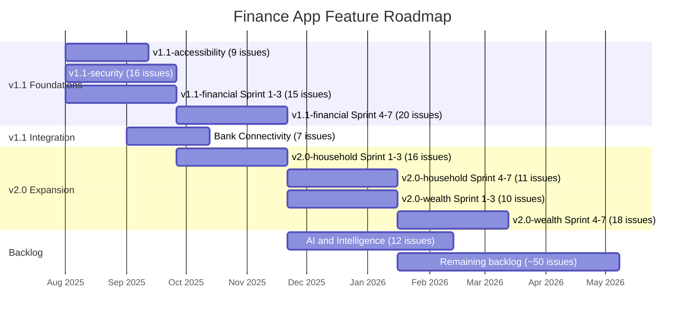
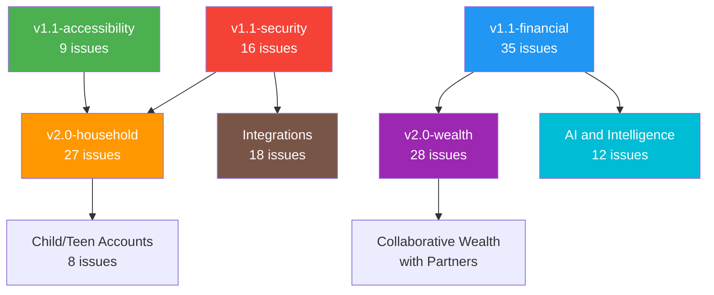

# Feature Roadmap

> **Generated**: 2025-07-17
> **Based on**: [Issue Triage Report](./issue-triage-report.md) — 247 open issues triaged

## Milestone Timeline

The following Mermaid diagram shows the proposed milestone sequence and dependencies.

## Dependency Map

### Key Dependency Chains

1. **Security before Household**: Privacy controls (#1641, #1636, #1612) must ship before any data-sharing features (#1780, #1779, #1781).
2. **Financial Core before Wealth**: Budgeting engine (#1558, #1566) and net worth tracking (#1578) must exist before portfolio analytics (#1585, #1588, #1595).
3. **Financial Core before AI**: Cash flow data (#1587) and transaction history are prerequisites for AI recommendations (#1633, #1637, #1642).
4. **Security before Integrations**: Connection transparency (#1677) and audit logging (#1682) should precede third-party bank connections (#1575, #1586).
5. **Household Core before Child/Teen**: Roles/permissions (#1780) and account sharing (#1781) must exist before child sub-accounts (#1796).

---

## Milestone Details

### v1.1-accessibility (9 issues)

**Goal**: Achieve WCAG 2.2 AA compliance across all platforms.

**Timeline**: 6 weeks (3 sprints)

| Sprint   | Issues                     | Focus                                                        |
| -------- | -------------------------- | ------------------------------------------------------------ |
| Sprint 1 | #1684, #1680, #1699, #1693 | Core compliance: screen readers, font scaling, motion, color |
| Sprint 2 | #1689, #1708               | Enhanced: spoken amounts, onboarding preferences             |
| Sprint 3 | #1703, #1664, #1732        | Inclusive: cognitive mode, quiet hours, elder mode           |

**Agents**: @accessibility-reviewer (audit), @web-engineer, @android-engineer, @ios-engineer, @windows-engineer

**Exit Criteria**:

- All platforms pass automated WCAG 2.2 AA audit
- Manual screen reader testing completed on each platform
- Reduced-motion respects system preferences on all platforms

---

### v1.1-security (16 issues)

**Goal**: Ship privacy controls required before household and integration features.

**Timeline**: 8 weeks (3 sprints)

| Sprint   | Issues                                   | Focus                                                             |
| -------- | ---------------------------------------- | ----------------------------------------------------------------- |
| Sprint 1 | #1641, #1636, #1687, #1612               | Privacy foundation: consent, dashboard, trust, privacy shell      |
| Sprint 2 | #1621, #1719, #1682, #1677, #1643, #1613 | Controls: local-only, biometric, audit, transparency, masking     |
| Sprint 3 | #1668, #1663, #1658, #1654, #1673, #1723 | Data rights: no-telemetry, devices, erasure, access, crash, memos |

**Agents**: @security-reviewer (audit), @kmp-engineer, @backend-engineer, platform agents

**Exit Criteria**:

- Privacy dashboard operational with full data inventory
- Consent management with GDPR/CCPA compliance
- Biometric protection available for sensitive categories
- Security review sign-off from @security-reviewer

---

### v1.1-financial (35 issues)

**Goal**: Build the core budgeting engine, debt tools, tax features, and cash flow analytics.

**Timeline**: 14 weeks (7 sprints)

| Sprint   | Issues                                   | Focus                                    |
| -------- | ---------------------------------------- | ---------------------------------------- |
| Sprint 1 | #1558, #1566, #1567, #1587, #1578        | Budget core + cash flow + net worth      |
| Sprint 2 | #1559, #1560, #1569, #1662, #1644        | Budget methods + debt + savings goals    |
| Sprint 3 | #1635, #1593, #1685, #1705, #1757        | Savings automation + subscriptions + tax |
| Sprint 4 | #1572, #1571, #1561, #1562, #1563, #1565 | Transactions + budget variants           |
| Sprint 5 | #1590, #1576, #1574, #1650, #1695, #1649 | Spending analytics + tax summaries       |
| Sprint 6 | #1700, #1573, #1630, #1568, #1601, #1570 | Business expenses + misc                 |
| Sprint 7 | #1681, #1690                             | Advanced debt (student loans, BNPL)      |

**Agents**: @finance-domain, @kmp-engineer, @backend-engineer, platform agents

**Exit Criteria**:

- At least 3 budgeting methods available (zero-based, envelope, variable-income)
- Debt payoff planner with avalanche/snowball strategies
- Cash flow analytics tab with income/spend/net views
- Net worth timeline with milestone tracking

---

### v2.0-household (27 issues)

**Goal**: Enable multi-user household finances with privacy controls.

**Timeline**: 14 weeks (7 sprints) — **Depends on**: v1.1-security

| Sprint   | Issues                            | Focus                                                  |
| -------- | --------------------------------- | ------------------------------------------------------ |
| Sprint 1 | #1780, #1779, #1781, #1716        | Household foundation: roles, invites, sharing, privacy |
| Sprint 2 | #1784, #1786, #1785, #1783        | Shared budgets, goals, dashboard, permissions          |
| Sprint 3 | #1782, #1794, #1792, #1790        | Collaboration: private txns, splits, review queue      |
| Sprint 4 | #1789, #1787, #1788, #1793, #1722 | Advanced: collaboration, goals, onboarding             |
| Sprint 5 | #1791, #1727, #1733               | Safeguards + offboarding                               |
| Sprint 6 | #1796, #1797, #1799               | Child/teen accounts                                    |
| Sprint 7 | #1798, #1800, #1728, #1731        | Child/teen advanced features                           |

**Agents**: @backend-engineer (RLS policies), @kmp-engineer (models), platform agents

**Exit Criteria**:

- Household invitation and role management operational
- Mine/yours/ours account sharing with privacy boundaries
- Shared budgets and savings goals functional
- Anti-coercion safeguards reviewed by security team

---

### v2.0-wealth (28 issues)

**Goal**: Comprehensive investment tracking, retirement planning, and wealth management.

**Timeline**: 14 weeks (7 sprints) — **Depends on**: v1.1-financial

| Sprint   | Issues                            | Focus                                              |
| -------- | --------------------------------- | -------------------------------------------------- |
| Sprint 1 | #1585, #1588, #1595               | Investment data layer: taxonomy, lots, allocation  |
| Sprint 2 | #1625, #1721, #1679               | Fee analysis + retirement readiness + Monte Carlo  |
| Sprint 3 | #1735, #1600, #1609, #1592        | Scenario modeling + rebalancing + brokerage import |
| Sprint 4 | #1715, #1737, #1736, #1653        | FIRE + retirement withdrawal + tax-advantaged      |
| Sprint 5 | #1645, #1660, #1639, #1631, #1603 | Tax optimization + dividends + exposure            |
| Sprint 6 | #1672, #1667, #1738, #1678        | Crypto + HSA/529 + property                        |
| Sprint 7 | #1744, #1742                      | Collaborative wealth + AI insights                 |

**Agents**: @finance-domain, @kmp-engineer, @backend-engineer, platform agents

**Exit Criteria**:

- Investment account tracking with cost-basis methods
- Retirement Monte Carlo planner operational
- Asset allocation dashboard with rebalancing recommendations
- FIRE dashboard with FI% and savings-rate tracking

---

### backlog (remaining ~50 issues)

Low-priority and future-consideration items reviewed monthly and promoted to milestones as capacity allows.

**Categories in backlog**:

- Lifestyle planning (#1772, #1773, #1774, #1775, #1776, #1777)
- Caregiver/advisor access (#1795, #1730, #1729)
- Stretch features (#1499, #1500, #1545)
- Low-priority integrations (#1622, #1628, #1610, #1597)
- Low-priority UX (#1764, #1758, #1725, #1638)
- Low-priority visualizations (#1741, #1745, #1717, #1707)
- Alpha launch infrastructure (#1239, #1241, #1242, #1243, #1244, #1248)
- Duplicate issues (to be consolidated per triage report Section 2)

---

## Priority Framework

All issues are triaged using the P0-P3 framework:

| Priority | Criteria                                        | Response                     | Example Issues                          |
| -------- | ----------------------------------------------- | ---------------------------- | --------------------------------------- |
| **P0**   | Security vulnerability, data loss, auth failure | Immediate — interrupt sprint | (none currently open)                   |
| **P1**   | Core feature bug, sync failure, a11y blocker    | Current sprint               | #1684, #1680, #1699, #1641              |
| **P2**   | New feature, UX improvement, performance        | Backlog for upcoming sprint  | Most issues in v1.1 and v2.0 milestones |
| **P3**   | Nice-to-have, cosmetic, tech debt               | Backlog, as capacity allows  | Lifestyle planning, stretch features    |

---

## Next Steps

1. **Human PM**: Review and approve milestone assignments
2. **Human PM**: Consolidate duplicate issues (14 pairs identified in triage report)
3. **@architect**: Review architecture decisions needed (6 issues flagged)
4. **@product-manager**: Create GitHub milestones and assign issues
5. **Sprint planning**: Begin with Batch 1 (Accessibility) and Batch 3 (Budgeting Core) in parallel
6. **Monthly review**: Re-triage backlog, promote issues as capacity allows
