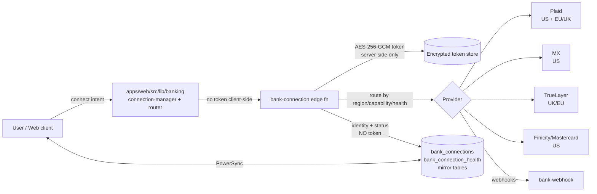

# Bank Aggregator Live-Data Path — Regulatory Compliance Assessment

> **Issue:** [#3866](https://github.com/jrmoulckers/finance/issues/3866)
> **Epic:** [#3846](https://github.com/jrmoulckers/finance/issues/3846) — consolidated live-data aggregator (Phase 6)
> **Date:** 2026-07-13
> **Regulations:** GDPR (EU) 2016/679 (Arts. 5, 6, 15, 17, 20, 28, 30, 44–49); PSD2 (Directive (EU) 2015/2366) / open banking; GLBA (US, 15 U.S.C. §§ 6801–6809); CCPA/CPRA (US-CA)
> **Status:** Assessment complete — gaps identified, follow-ups filed
> **Author:** AI agent (compliance-specialist) — advisory; requires human/legal review
> **Owner:** [`@compliance-specialist`](../../.github/agents/compliance-specialist.agent.md)

> **⚠️ DISCLAIMER:** This document is an advisory compliance assessment of the
> codebase and data-processing posture, **NOT legal advice**. It identifies
> product obligations and routes technical fixes to the owning engineering
> agents; it does not implement controls, and it does not constitute a legal
> determination. Have qualified legal counsel review all findings — and negotiate
> and sign all processor agreements — before making any compliance claim. Items
> that require a formal legal determination are marked **Needs Legal Review**;
> items where a control's existence or behavior could not be confirmed from the
> code are marked **Needs verification** and carry a follow-up issue.

> **Satisfies:** `PROD-COMP-002`, `PROD-COMP-004` — Product obligations are defined in
> [jrmoulckers/product](https://github.com/jrmoulckers/product), pinned to
> [`3a752c1`](https://github.com/jrmoulckers/product/blob/3a752c11856515a74eb204675d5d5198cac1e48e/principles/compliance.md).
> This document is the local evidence; the obligation is central. These principles
> establish governance and qualified-review triggers and are not legal advice.

---

## Table of Contents

1. [Summary](#1-summary)
2. [Scope and evidence](#2-scope-and-evidence)
3. [Architecture recap](#3-architecture-recap)
4. [Data inventory delta](#4-data-inventory-delta)
5. [Third-party processors and sub-processors](#5-third-party-processors-and-sub-processors)
6. [Data residency and cross-border transfers](#6-data-residency-and-cross-border-transfers)
7. [Legal basis and consent](#7-legal-basis-and-consent)
8. [Data minimization](#8-data-minimization)
9. [Retention](#9-retention)
10. [Right to erasure (Art. 17)](#10-right-to-erasure-art-17)
11. [Right to access and portability (Arts. 15/20)](#11-right-to-access-and-portability-arts-1520)
12. [Regional obligations](#12-regional-obligations)
13. [Security cross-reference](#13-security-cross-reference)
14. [Obligation matrix / gap table](#14-obligation-matrix--gap-table)
15. [Follow-up issues filed](#15-follow-up-issues-filed)
16. [Needs Legal Review](#16-needs-legal-review)
17. [Related documents](#17-related-documents)

---

## 1. Summary

Phases 1–5 of epic [#3846](https://github.com/jrmoulckers/finance/issues/3846)
wired the web app to live banking data through a provider-agnostic aggregator
layer that routes across **Plaid, MX, TrueLayer, and Finicity**, selecting a
provider by region, capability, and health/priority with failover. This
materially changes Finance's data-processing posture: it introduces new personal
and financial data categories, adds four third-party **data processors /
sub-processors** with differing regional footprints, and brings the product into
scope for **open-banking / PSD2** (EU/UK) and **US financial-data rules (GLBA,
CCPA/CPRA, state privacy laws)** in addition to the existing GDPR corpus.

The core encryption and access posture is sound: a session security review
([#3857](https://github.com/jrmoulckers/finance/issues/3857), merged) found the
web client, token storage, and repository layer **clean**, aggregator access
tokens are **AES-256-GCM encrypted server-side and never returned to the client
or logged**, and two IDOR holes in `aggregator-health` were fixed. However, the
**data-subject-rights and processor-governance layers have material gaps**:

- **Disconnect does not revoke or purge tokens or propagate deletion to the
  provider.** The `bank-connection` DELETE handler performs a local soft-delete
  only (`deleted_at` + `status = 'disconnected'`); it does not call the
  provider's token-revocation / item-removal API and does not purge the encrypted
  access token. This under-delivers on GDPR Art. 17 and on PSD2 consent
  withdrawal. **(Gap — highest priority.)**
- **Aggregator-sourced data is not included in the data export.** The
  `data-export` function contains no reference to the `bank_connection*` /
  `open_banking_connections` tables, so aggregator identity, health, and
  connection data are absent from the Art. 15/20 export. **(Gap.)**
- **Processor governance is undocumented.** No Art. 28 Data Processing
  Agreement, sub-processor register entry, residency mapping, or transfer
  mechanism (SCCs / UK IDTA / adequacy) is yet recorded for any of the four
  providers. **(Gap — Needs Legal Review for DPA execution.)**
- **Account deletion cascades the local mirror but processor propagation is
  unconfirmed.** `account-delete` cascade-deletes the `bank_connection*` mirror
  tables, but there is no evidence it revokes tokens or notifies the provider to
  delete upstream copies. **(Gap — Needs verification.)**

This document maps each obligation to an owning engineering agent and a priority
in the [obligation matrix](#14-obligation-matrix--gap-table). Concrete technical
gaps are routed as follow-up issues (§15); processor-agreement execution is
routed to human/legal (§16).

---

## 2. Scope and evidence

This assessment reviews the aggregator live-data path introduced by epic #3846
against the code present on `main` at the time of writing:

- Web client abstraction: `apps/web/src/lib/banking/` (provider registry, router,
  connection manager, transport, aggregator metadata, normalizers).
- Backend edge functions: `services/api/supabase/functions/`
  - `bank-connection` — connection lifecycle (create / update / disconnect;
    Plaid & MX)
  - `bank-webhook` — provider webhook ingestion
  - `aggregator-health` — provider health/priority (subject of #3857)
  - `connector-permissions` — connector scoping
  - `manage-webhooks` — webhook endpoint management (subject of #3859)
  - `account-delete`, `data-export` — existing data-subject-rights functions
- Synced mirror tables (as referenced by the edge functions): `bank_connections`
  (identity + status, **no token**), `bank_connection_health` (health log),
  `bank_connection_accounts`, `bank_sync_log`, `open_banking_connections`,
  `connector_permissions`, `connector_access_log`, and an aggregator/provider
  directory table.

> **Naming note (Needs verification):** the epic brief refers to `bank_connection`
> (singular), `bank_connection_health`, and `aggregator_provider`, while the
> `account-delete` and `bank-connection` functions reference `bank_connections`
> (plural) and related `bank_*` / `open_banking_connections` tables. The exact
> canonical schema names should be confirmed with @backend-engineer; this
> document uses the names observed in the edge-function code and does not assert a
> single authoritative schema.

**Out of scope:** implementing any control (routed to owning agents); executing
or negotiating processor DPAs (human/legal); native iOS/Android/Windows
aggregator flows (web-only in this phase); the underlying encryption
implementation (owned by @security-reviewer, reviewed clean in #3857).

---

## 3. Architecture recap

Finance is **edge-first**: financial data lives on-device (SQLite) and syncs
through Supabase/PowerSync. The aggregator layer adds a **server-mediated** path:
the client never holds provider access tokens. Tokens are exchanged and stored
**server-side only**, AES-256-GCM encrypted, and used by edge functions to pull
account and transaction data on the user's behalf. The client sees only
normalized, provider-agnostic data and a non-secret connection identity/status
mirror.

**Compliance implication:** because the sensitive secret (the access token) and
the upstream copy of financial data live off-device — at the provider and in
server-side storage — deletion and residency obligations must be satisfied in
**three** places: (1) the on-device mirror, (2) the server-side encrypted store,
and (3) the **provider's own systems**. The current disconnect flow addresses
only (1) partially and not (2) or (3). See §10.

---

## 4. Data inventory delta

The aggregator introduces the following **new** personal/financial data
categories not previously covered by
[`data-inventory.md`](data-inventory.md). These should be folded into that
document's "Financial Data" and "Sub-Processors" sections (follow-up
[filed](#15-follow-up-issues-filed)).

| #   | Data category                      | Example fields                                                       | Storage location                                                            | Sensitivity                      | Legal basis                                  |
| --- | ---------------------------------- | -------------------------------------------------------------------- | --------------------------------------------------------------------------- | -------------------------------- | -------------------------------------------- |
| A   | Institution / connection identity  | institution id + name, connection id, provider id, connection status | `bank_connections` mirror + local SQLite                                    | Financial (indirect)             | Art. 6(1)(b) Contract                        |
| B   | Aggregator access token            | provider OAuth/access token, refresh token, item id                  | **Server-side only**, AES-256-GCM encrypted; **never** on client or in logs | **High — credential**            | Art. 6(1)(b) Contract; Art. 6(1)(f) security |
| C   | Aggregator-sourced accounts        | account id, mask, type, balance (integer cents), currency            | Server pull → normalized → local SQLite mirror                              | Financial                        | Art. 6(1)(b) Contract                        |
| D   | Aggregator-sourced transactions    | amount (cents), date, merchant/description, category                 | Normalized → local SQLite; synced                                           | Financial                        | Art. 6(1)(b) Contract                        |
| E   | Connection health / error metadata | health status, error codes, last-sync, provider priority             | `bank_connection_health`, `bank_sync_log`                                   | Operational (financial-adjacent) | Art. 6(1)(f) Legitimate interest             |
| F   | Provider directory                 | provider id, region, capability flags, priority                      | Aggregator/provider directory table                                         | Non-personal config              | N/A (config)                                 |
| G   | Connector permissions / access log | scope grants, connector access events                                | `connector_permissions`, `connector_access_log`                             | Operational                      | Art. 6(1)(f) Legitimate interest             |

**Special-category note:** transaction descriptions and merchant data can reveal
special categories of data under GDPR Art. 9 (e.g., health, religion, trade-union
membership inferred from spending). This is an existing risk for manually entered
transactions, but the aggregator **increases volume and automation**, which
strengthens the case that the aggregator path is a **DPIA-triggering** activity
(large-scale processing of financial data, GDPR Art. 35). The DPIA screening in
[`data-inventory.md`](data-inventory.md#dpia-screening) should be re-run for this
path. **Needs Legal Review.**

---

## 5. Third-party processors and sub-processors

Each aggregator is a **data processor** (GDPR Art. 28) acting on Finance's
instructions, and — where the aggregator itself relies on downstream data-access
providers or a bank's open-banking API — a **sub-processor** chain exists. As
controller, Finance must, for each provider:

- **Art. 28(3) DPA** — have a written data-processing agreement binding the
  processor to process only on documented instructions, ensure confidentiality,
  implement Art. 32 security, assist with data-subject requests, and delete/return
  data at end of contract.
- **Art. 28(2)/(4)** — authorize and flow down obligations to sub-processors, and
  maintain a sub-processor list with a change-notification mechanism.
- **Art. 30** — record the processor in the Records of Processing Activities
  (RoPA); see [`data-inventory.md`](data-inventory.md#sub-processors).
- **Art. 32** — confirm the processor's technical and organizational security
  measures.
- **Transfer mechanism** — establish a lawful basis for any cross-border transfer
  (see §6).

| Provider                  | Role      | Primary region(s)      | Sub-processor chain                              | DPA status                           | RoPA entry                           |
| ------------------------- | --------- | ---------------------- | ------------------------------------------------ | ------------------------------------ | ------------------------------------ |
| **Plaid**                 | Processor | US + EU/UK             | Downstream bank / open-banking APIs; Plaid infra | **Not on file — Needs Legal Review** | Missing — add to `data-inventory.md` |
| **MX**                    | Processor | US-centric             | US financial-data providers                      | **Not on file — Needs Legal Review** | Missing                              |
| **TrueLayer**             | Processor | UK / EU (open banking) | Bank open-banking (PSD2 AIS) APIs                | **Not on file — Needs Legal Review** | Missing                              |
| **Finicity (Mastercard)** | Processor | US                     | Mastercard / Finicity data network               | **Not on file — Needs Legal Review** | Missing                              |

> **Gap:** No executed Art. 28 DPA, sub-processor register entry, or Art. 32
> security attestation is on file for any provider. DPA **execution** is a
> human/legal action ([§16](#16-needs-legal-review)); the **documentation**
> tasks (add each provider to the RoPA/sub-processor list in
> `data-inventory.md`, publish an updated sub-processor list, and align the
> app-store privacy labels and CCPA processor list) are routed as follow-ups
> (§15).

The **CCPA/CPRA processor list** in
[`ccpa-verification.md`](ccpa-verification.md#processor-list) and the
[`app-store-privacy-labels.md`](app-store-privacy-labels.md) "Data linked to you"
mapping must both be updated to disclose the four aggregators and the categories
they receive. Under CCPA these should be structured as **service-provider /
contractor** relationships (not "sales/sharing") — confirm the contract language
qualifies. **Needs Legal Review.**

---

## 6. Data residency and cross-border transfers

The aggregator router selects providers by region, so a given user's financial
data may be processed in the US, the EU, or the UK depending on which provider
serves their institution. Cross-border transfers of EU/UK personal data require a
lawful transfer mechanism under GDPR Chapter V.

| Flow                                             | Data exporter      | Data importer         | Transfer?                     | Required mechanism                                                                                                |
| ------------------------------------------------ | ------------------ | --------------------- | ----------------------------- | ----------------------------------------------------------------------------------------------------------------- |
| EU user → Plaid (EU)                             | Finance (EU scope) | Plaid EU              | Intra-EEA — no Ch. V transfer | N/A (confirm EU processing region)                                                                                |
| EU user → US provider (Plaid US / MX / Finicity) | Finance            | US processor          | **Yes — EEA→US**              | **SCCs** (+ TIA); rely on EU–US Data Privacy Framework only if the importer is certified — **Needs verification** |
| UK user → TrueLayer (UK/EU)                      | Finance            | TrueLayer             | UK→EEA                        | **UK adequacy** (EEA adequate) — confirm                                                                          |
| UK user → US provider                            | Finance            | US processor          | **Yes — UK→US**               | **UK IDTA** or UK Addendum to the SCCs (+ UK extension to DPF if certified)                                       |
| Server-side encrypted token store                | Finance            | Supabase infra region | Depends on region             | Confirm Supabase project region vs. user region with @backend-engineer / @architect                               |

**Requirements:**

- Confirm, per provider, the **actual processing/storage region** (some providers
  offer EU data residency for EU customers — verify rather than assume).
- Where an EEA/UK→US transfer occurs, ensure **SCCs (2021/914)** and, for the UK,
  the **IDTA or UK Addendum** are in place, backed by a **Transfer Impact
  Assessment**. This is contractual/legal work — **Needs Legal Review**.
- The **region-gating** of provider availability (e.g., only offer EU-resident
  providers to EU users where required) is a product control routed to
  @web-engineer; the compliance requirement is: _a user's data must not be routed
  to a provider/region for which no lawful transfer basis exists._
- Update the **cross-border transfers** section of
  [`data-inventory.md`](data-inventory.md#cross-border-transfers) with the
  per-provider mapping above.

---

## 7. Legal basis and consent

| Requirement                                      | Regime                        | Assessment                                                                                                                                                                                                                                                                                                                                                                             |
| ------------------------------------------------ | ----------------------------- | -------------------------------------------------------------------------------------------------------------------------------------------------------------------------------------------------------------------------------------------------------------------------------------------------------------------------------------------------------------------------------------- |
| **Explicit, informed consent to connect a bank** | GDPR Art. 6(1)(a)/(b), Art. 7 | Bank connection is initiated by an explicit user action (connect flow), but a **granular, recorded consent artifact** (what was shared, with which provider, under which policy version, when) is **not confirmed** in the mirror schema. **Needs verification** — align with [`consent-management-audit.md`](consent-management-audit.md) and the `consent-management` edge function. |
| **PSD2 / open-banking consent** (EU/UK)          | PSD2 Art. 64–67; SCA (RTS)    | Open-banking AIS access requires the user's explicit consent captured at the bank/provider (via TrueLayer/Plaid EU flows) and is **time-boxed (typically 90 days)** with **SCA re-authentication** on expiry. The product must surface consent status and expiry and prompt re-consent. **Needs verification** that re-consent/expiry is handled.                                      |
| **Consent withdrawal linked to disconnect**      | GDPR Art. 7(3)                | Withdrawing consent must be **as easy as giving it** and must actually stop processing. Today, disconnect soft-deletes the mirror row but does **not** revoke the provider token or terminate upstream access — so consent withdrawal is **not fully effective**. **Gap** (see §10).                                                                                                   |
| **Consent record / audit**                       | GDPR Art. 7(1)                | Ability to demonstrate consent (who, what, when, version). **Needs verification** — likely partially served by `consent-management`; confirm it covers aggregator connections.                                                                                                                                                                                                         |

**Legal basis choice — Needs Legal Review:** the primary basis for aggregator
processing is most naturally **Art. 6(1)(b) (performance of a contract / service
the user requested)** rather than consent, but **PSD2 independently mandates
explicit consent** for AIS access, and CCPA/GLBA disclosure duties apply
regardless. Counsel should confirm the basis and the layered consent model
(service contract + PSD2 consent) before launch.

---

## 8. Data minimization

GDPR Art. 5(1)(c) and the existing
[`data-minimization-audit.md`](data-minimization-audit.md) require pulling only
the data necessary for the feature.

- **Scope requested from providers.** Request only the products/scopes needed
  (accounts + transactions + balances). Do **not** request identity, income,
  liabilities, or investments scopes unless a shipped feature uses them.
  **Needs verification** with @web-engineer / @backend-engineer that the connect
  flow requests the minimal product set per provider.
- **Fields persisted.** Persist only normalized fields Finance uses (see §4).
  Avoid storing raw provider payloads verbatim; do not persist full account
  numbers — mask only. **Needs verification** that no raw PII-heavy provider blob
  is retained.
- **Transaction free-text.** Merchant/description strings inherit the same
  high-risk-free-text handling `transactions.note` already requires: encrypt at
  rest, exclude from logs and telemetry (consistent with
  `data-minimization-audit.md`).
- **Health/error metadata.** `bank_connection_health` and `bank_sync_log` should
  store diagnostic codes, **not** account contents or token material — consistent
  with the #3857 finding that tokens are never logged.

---

## 9. Retention

Extends [`data-retention-schedule.md`](data-retention-schedule.md). Proposed
retention for the new categories (to be merged into that schedule — follow-up
filed):

| Data                                       | Proposed retention                                                     | Trigger for deletion                      | Legal basis                |
| ------------------------------------------ | ---------------------------------------------------------------------- | ----------------------------------------- | -------------------------- |
| Encrypted access/refresh token             | **Life of the connection** — purged immediately on disconnect          | Disconnect or account deletion            | Art. 6(1)(b); Art. 5(1)(e) |
| `bank_connections` identity/status mirror  | Life of the connection; **30 days** after soft-delete then hard-delete | Disconnect / account deletion + purge job | Art. 5(1)(e)               |
| `bank_connection_health` / `bank_sync_log` | **30–90 days** rolling (align with sync/audit log windows)             | Automated purge job                       | Art. 6(1)(f)               |
| Aggregator-sourced accounts/transactions   | Same as user financial data — until record/account deletion            | User or account deletion                  | Art. 6(1)(b)               |
| `connector_access_log`                     | **90 days** (align with `audit_log`)                                   | Automated purge job                       | Art. 6(1)(f)               |

> **Gaps:** (1) There is **no confirmed purge job** for encrypted tokens or the
> health/log tables — this mirrors the pre-existing "purge jobs defined but not
> implemented" status in `data-retention-schedule.md`. (2) The token must be
> purged **on disconnect**, not merely on account deletion. Routed to
> @backend-engineer (§15).

**GLBA record-retention note:** GLBA and related US financial rules impose
record-keeping obligations, but Finance is a personal-finance tool acting for the
consumer, not a financial institution of record — whether any GLBA retention
minimum applies is a **Needs Legal Review** question and must not override the
minimization defaults above.

---

## 10. Right to erasure (Art. 17)

Cross-references [`gdpr-right-to-erasure-audit.md`](gdpr-right-to-erasure-audit.md)
(existing Art. 17 compliance estimate ~55%). Erasure for the aggregator path must
delete data in **three** locations (see §3):

| Location                          | Current behavior                                                              | Compliant?                                 |
| --------------------------------- | ----------------------------------------------------------------------------- | ------------------------------------------ |
| On-device mirror                  | Soft-delete via `deleted_at`; synced                                          | Partial — depends on hard-delete purge job |
| Server-side encrypted token store | **Not purged on disconnect** (only soft-delete of the `bank_connections` row) | **No — Gap**                               |
| Provider's own systems            | **No revocation / deletion call to the provider** on disconnect               | **No — Gap**                               |

**Findings:**

1. **Disconnect (`bank-connection` DELETE) does not revoke the token or
   propagate deletion.** The handler sets `deleted_at` and
   `status = 'disconnected'` on `bank_connections` and returns 204. It does
   **not** call the provider token-revocation / item-removal API
   (e.g., Plaid `/item/remove`, MX/TrueLayer/Finicity equivalents), and does not
   purge the encrypted token. Result: the provider may retain access and the
   encrypted token persists. **Gap — highest priority.** Routed to
   @backend-engineer (revocation + purge) with @security-reviewer to attest the
   revocation/shred control.
2. **Account deletion cascades the local mirror but processor propagation is
   unconfirmed.** `account-delete` cascade-deletes `bank_connections`,
   `bank_connection_health`, `bank_connection_accounts`, `bank_sync_log`,
   `open_banking_connections`, `connector_permissions`, and `connector_access_log`
   (good — the local mirror is covered). However, there is **no evidence** it
   revokes provider tokens or requests upstream deletion. **Gap — Needs
   verification / propagation.**
3. **Consent-withdrawal effectiveness.** Because disconnect does not stop
   upstream processing, GDPR Art. 7(3) ("withdrawal as easy as giving") and
   Art. 17 are not fully met. See §7.

**Required end state:** disconnect (and account deletion) must, atomically where
possible: (a) revoke the provider access token via the provider API, (b) purge
the server-side encrypted token, (c) hard-delete or schedule purge of the mirror
rows, and (d) record a deletion/ revocation audit entry.

---

## 11. Right to access and portability (Arts. 15/20)

Cross-references [`gdpr-right-to-access-audit.md`](gdpr-right-to-access-audit.md)
(existing estimate ~70% Art. 15, ~85% Art. 20).

- **Gap: aggregator data is not in the export.** The `data-export` function
  contains **no reference** to the `bank_connections` / `bank_connection_health`
  / `bank_connection_accounts` / `bank_sync_log` / `open_banking_connections`
  tables. A data-subject-access request therefore **omits** the user's connected
  institutions, connection status/health, and aggregator-sourced account/
  transaction records that are not already surfaced via the general
  accounts/transactions export. Routed to @backend-engineer (§15).
- **Token exclusion (correct behavior).** The encrypted access token is a
  credential/secret and **must be excluded** from the export (exporting it would
  create a security risk). The export should include connection **metadata**
  (institution, status, connected-since, provider) but never token material —
  consistent with the encrypted-field handling in the access audit.
- **Portability format.** Include aggregator connection metadata and
  aggregator-sourced accounts/transactions in the existing JSON/CSV structured
  export so the user can port their connected-account picture, not just raw
  transactions.

---

## 12. Regional obligations

### European Union / United Kingdom

- **GDPR** — Arts. 5, 6, 7, 13/14 (transparency of the new processing + new
  sub-processors), 15/20 (access/portability, §11), 17 (erasure, §10), 28
  (processor DPAs, §5), 30 (RoPA), 32 (security, §13), 35 (DPIA re-screen, §4),
  44–49 (transfers, §6).
- **PSD2 / open banking** — explicit, time-boxed AIS consent with SCA; consent
  status/expiry surfacing and re-consent; use of a regulated AISP (the provider)
  where required. Finance itself relying on a licensed aggregator as the
  regulated AISP is the intended model — **confirm each provider's AISP/licensing
  coverage per market with counsel. Needs Legal Review.**

### United States

- **GLBA** (Privacy Rule + Safeguards Rule) — even where Finance is not itself a
  "financial institution," the aggregators are, and Finance handles GLBA
  "nonpublic personal information." Requirements: a clear privacy notice covering
  aggregator data, and reasonable safeguards (largely satisfied by the
  server-side AES-256-GCM posture; confirm with @security-reviewer). GLBA
  applicability scope — **Needs Legal Review.**
- **CCPA/CPRA (US-CA)** — disclose the aggregators as **service providers /
  contractors** in the notice at collection and processor list
  ([`ccpa-verification.md`](ccpa-verification.md)); financial account data and
  transaction contents are **sensitive personal information** under CPRA,
  engaging the right to **limit use of SPI** and honoring **right to know /
  delete / correct**. Ensure the disconnect/erasure gaps (§10) do not break the
  Right to Delete.
- **Other US state privacy laws** (VA/CO/CT/UT/TX/OR and successors) — broadly
  parallel disclosure, deletion, and sensitive-data provisions; treat CCPA/CPRA
  as the high-water mark. **Needs Legal Review** for state-by-state applicability.
- **KYC/AML** — Finance's aggregator use is read-only account information, not
  money movement, so direct KYC/AML obligations are **not triggered** by this
  path; flagged here only to note the boundary. Re-assess if payment initiation
  (PIS) or identity-verification features are added.

---

## 13. Security cross-reference

The technical security controls for this path are owned and audited by
@security-reviewer. This assessment relies on and cross-references the session
security review:

| Item                                                             | Ref                                                         | Status                            | Compliance relevance                                                          |
| ---------------------------------------------------------------- | ----------------------------------------------------------- | --------------------------------- | ----------------------------------------------------------------------------- |
| Web client / token storage / repository review                   | [#3857](https://github.com/jrmoulckers/finance/issues/3857) | **Merged — clean**                | Supports Art. 32 (security of processing) and GLBA Safeguards                 |
| Two IDOR holes in `aggregator-health`                            | #3857                                                       | **Fixed**                         | Prevents cross-tenant exposure of connection health (Art. 32; access-control) |
| Access tokens AES-256-GCM, server-side only, never client/logged | #3857                                                       | **Verified**                      | Confirms token confidentiality (Art. 32; minimization §8)                     |
| MX webhook replay protection                                     | [#3858](https://github.com/jrmoulckers/finance/issues/3858) | **Deferred — gated on MX launch** | Integrity of webhook-ingested data; must land **before** MX goes live         |
| `manage-webhooks` SSRF                                           | [#3859](https://github.com/jrmoulckers/finance/issues/3859) | **Deferred — not in alpha**       | Must land before webhook-endpoint management is enabled                       |

**Compliance position:** #3858 and #3859 are acceptable to defer **only while the
gated features (MX, webhook-endpoint management) are not live**. This assessment
records them as **launch-blocking preconditions** for those features — the
stricter regulatory requirement (integrity/security of processing under Art. 32
and GLBA Safeguards) wins over convenience. No new security _code_ fix is
requested here; these are tracked in the security agent's queue.

---

## 14. Obligation matrix / gap table

Priority: **P1** = launch-blocking for the live-data path / data-subject right;
**P2** = required before broad/EU-UK rollout; **P3** = documentation / hygiene.

| #   | Obligation                                                          | Regulation                     | Current status                                 | Owner                                                 | Priority       |
| --- | ------------------------------------------------------------------- | ------------------------------ | ---------------------------------------------- | ----------------------------------------------------- | -------------- |
| 1   | Disconnect revokes provider token + purges encrypted token          | GDPR Art. 17, Art. 7(3); PSD2  | ❌ **Gap** — soft-delete only, no revoke/purge | @backend-engineer (+@security-reviewer attest)        | **P1**         |
| 2   | Account deletion propagates deletion/revocation to provider         | GDPR Art. 17; Art. 28(3)(g)    | ⚠️ **Needs verification** — local cascade only | @backend-engineer                                     | **P1**         |
| 3   | Aggregator data included in Art. 15/20 export (metadata, not token) | GDPR Art. 15, Art. 20          | ❌ **Gap** — not in `data-export`              | @backend-engineer                                     | **P1**         |
| 4   | Encrypted token confidentiality (AES-256-GCM, never client/logged)  | GDPR Art. 32; GLBA Safeguards  | ✅ **Verified** (#3857)                        | @security-reviewer                                    | —              |
| 5   | `aggregator-health` access control (IDOR fix)                       | GDPR Art. 32                   | ✅ **Fixed** (#3857)                           | @security-reviewer                                    | —              |
| 6   | MX webhook replay protection before MX launch                       | GDPR Art. 32 (integrity)       | ⏳ **Deferred/gated** (#3858)                  | @security-reviewer                                    | **P2** (gate)  |
| 7   | `manage-webhooks` SSRF before webhook mgmt enabled                  | GDPR Art. 32                   | ⏳ **Deferred/gated** (#3859)                  | @security-reviewer                                    | **P2** (gate)  |
| 8   | Purge jobs for tokens + health/log tables                           | GDPR Art. 5(1)(e)              | ❌ **Gap** — not implemented                   | @backend-engineer                                     | **P2**         |
| 9   | Granular, recorded connection consent (what/when/version)           | GDPR Art. 7; PSD2              | ⚠️ **Needs verification**                      | @backend-engineer / @web-engineer                     | **P2**         |
| 10  | PSD2 consent expiry + SCA re-consent handling (EU/UK)               | PSD2 Art. 64–67                | ⚠️ **Needs verification**                      | @web-engineer                                         | **P2**         |
| 11  | Region-gate provider routing to lawful transfer basis               | GDPR Ch. V                     | ⚠️ **Needs verification**                      | @web-engineer                                         | **P2**         |
| 12  | Minimal provider scopes/products requested                          | GDPR Art. 5(1)(c)              | ⚠️ **Needs verification**                      | @web-engineer / @backend-engineer                     | **P2**         |
| 13  | No raw provider PII blob persisted; masked account numbers          | GDPR Art. 5(1)(c)              | ⚠️ **Needs verification**                      | @backend-engineer                                     | **P2**         |
| 14  | Art. 28 DPAs executed for all four providers                        | GDPR Art. 28                   | ❌ **Gap** — none on file                      | **Human / legal**                                     | **P1** (legal) |
| 15  | Providers added to RoPA / sub-processor list                        | GDPR Art. 30, Art. 28(2)       | ❌ **Gap**                                     | @compliance-specialist (+ update `data-inventory.md`) | **P2**         |
| 16  | SCCs / UK IDTA / TIA for EEA-UK→US transfers                        | GDPR Art. 46                   | ❌ **Gap** — Needs Legal Review                | **Human / legal**                                     | **P1** (legal) |
| 17  | CCPA processor list + privacy labels disclose aggregators           | CCPA/CPRA                      | ❌ **Gap**                                     | @compliance-specialist / @docs-writer                 | **P2**         |
| 18  | Financial correctness of aggregator amounts (cents, rounding)       | Consumer-protection / accuracy | ⚠️ **Needs verification**                      | @finance-domain                                       | **P3**         |
| 19  | DPIA re-screen for large-scale aggregator processing                | GDPR Art. 35                   | ❌ **Gap** — Needs Legal Review                | @compliance-specialist (+ counsel)                    | **P2**         |
| 20  | Retention schedule updated for aggregator categories                | GDPR Art. 5(1)(e)              | ❌ **Gap** — this doc proposes; not yet merged | @compliance-specialist                                | **P3**         |

Legend: ✅ satisfied · ⚠️ needs verification · ❌ gap · ⏳ deferred (gated).

---

## 15. Follow-up issues filed

Concrete **technical** gaps are routed to owning engineering agents as follow-up
issues (this document does not implement code). Documentation follow-ups the
compliance-specialist owns are tracked here and in the matrix. Non-technical
legal actions are in §16.

Each filed issue references `Refs #3846` and `Refs #3866`.

| Matrix # | Follow-up                                                                    | Owner                                 | Labels                                          | Issue                                                       |
| -------- | ---------------------------------------------------------------------------- | ------------------------------------- | ----------------------------------------------- | ----------------------------------------------------------- |
| 1        | Disconnect must revoke provider token + purge encrypted token                | @backend-engineer                     | `compliance`, `comp:api`, `priority:high`       | [#3867](https://github.com/jrmoulckers/finance/issues/3867) |
| 3        | Include aggregator connection metadata in data-export (exclude token)        | @backend-engineer                     | `compliance`, `comp:api`, `priority:high`       | [#3868](https://github.com/jrmoulckers/finance/issues/3868) |
| 2        | Propagate deletion/revocation to provider on account deletion                | @backend-engineer                     | `compliance`, `comp:api`, `priority:high`       | [#3869](https://github.com/jrmoulckers/finance/issues/3869) |
| 8        | Retention purge jobs for aggregator tokens + health/log tables               | @backend-engineer                     | `compliance`, `comp:api`, `priority:medium`     | [#3870](https://github.com/jrmoulckers/finance/issues/3870) |
| 9–12     | Verify minimal scopes, consent record, PSD2 expiry/re-consent, region-gating | @web-engineer                         | `compliance`, `platform:web`, `priority:medium` | [#3871](https://github.com/jrmoulckers/finance/issues/3871) |
| 17,15    | Update CCPA processor list, privacy labels, and RoPA/sub-processor list      | @compliance-specialist / @docs-writer | `compliance`, `comp:docs`, `priority:medium`    | [#3872](https://github.com/jrmoulckers/finance/issues/3872) |
| 18       | Verify aggregator amount/rounding correctness (integer cents)                | @finance-domain                       | `compliance`, `priority:low`                    | [#3873](https://github.com/jrmoulckers/finance/issues/3873) |

---

## 16. Needs Legal Review

The following require a formal legal determination and/or human action and are
**out of scope for any engineering fix**:

- **Execute Art. 28 DPAs** with Plaid, MX, TrueLayer, and Finicity, and record
  their sub-processor chains (matrix #14).
- **Establish transfer mechanisms** — SCCs (2021/914) + Transfer Impact
  Assessment for EEA→US, and UK IDTA / UK Addendum for UK→US; confirm any DPF
  certification reliance (matrix #16).
- **Confirm legal basis / layered consent model** (Art. 6(1)(b) service contract
  vs. consent, plus PSD2 explicit consent) (§7).
- **Confirm PSD2 / AISP licensing coverage** for each provider per market (§12).
- **Determine GLBA applicability** and any record-retention minimum (§9, §12).
- **Re-run and sign off the DPIA** for large-scale financial-data processing
  (GDPR Art. 35) (§4, matrix #19).
- **Confirm CCPA service-provider/contractor characterization** (no "sale/share")
  in the provider contracts (§5, §12).

---

## 17. Related documents

- [Compliance README](README.md) — directory index (this doc added there)
- [GDPR Data Inventory and Processing Map](data-inventory.md) — fold in the §4
  data delta, §5 sub-processors, §6 transfers
- [Data Retention Schedule](data-retention-schedule.md) — merge §9 categories
- [GDPR Data Minimization Audit](data-minimization-audit.md) — §8 alignment
- [GDPR Right to Erasure Audit](gdpr-right-to-erasure-audit.md) — §10 gaps
- [GDPR Right to Access Audit](gdpr-right-to-access-audit.md) — §11 gaps
- [GDPR Consent Management Audit](consent-management-audit.md) — §7 alignment
- [CCPA / CPRA Consumer Rights Verification](ccpa-verification.md) — §12 processor list
- [App Store Privacy Labels](app-store-privacy-labels.md) — §5 disclosure parity
- Security review [#3857](https://github.com/jrmoulckers/finance/issues/3857) and deferred [#3858](https://github.com/jrmoulckers/finance/issues/3858), [#3859](https://github.com/jrmoulckers/finance/issues/3859)
- `services/api/supabase/functions/bank-connection/`, `account-delete/`, `data-export/`, `aggregator-health/` — reviewed edge functions
- `apps/web/src/lib/banking/` — web aggregator abstraction

---

## Document History

| Date       | Change                                                                       | Author                           |
| ---------- | ---------------------------------------------------------------------------- | -------------------------------- |
| 2026-07-13 | Initial aggregator live-data compliance assessment (issue #3866, epic #3846) | compliance-specialist (AI agent) |
