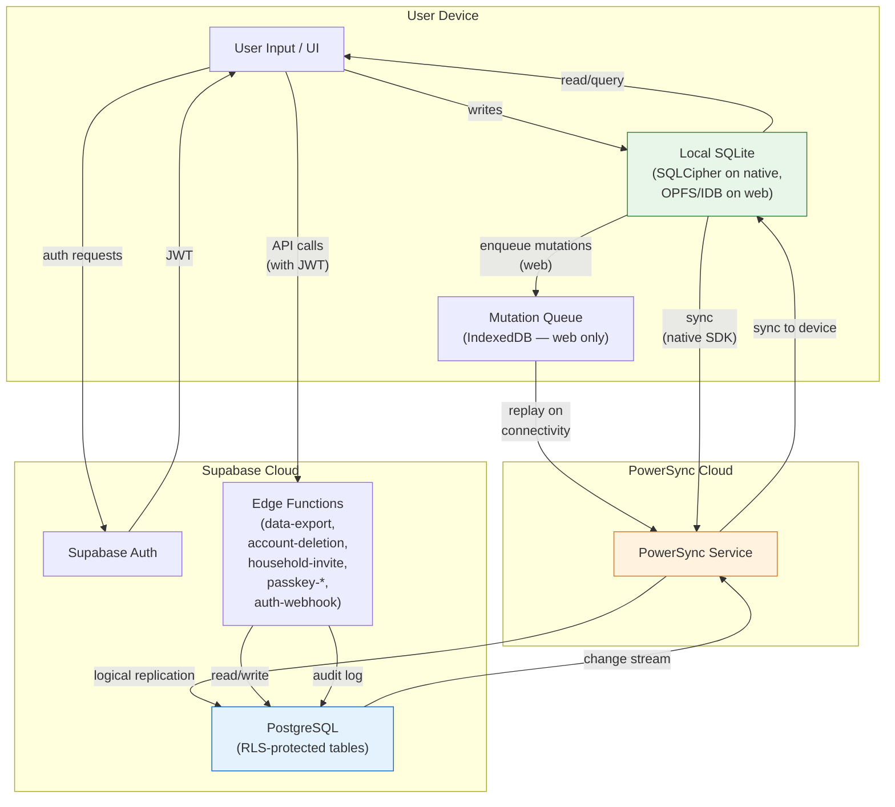

# GDPR Data Inventory and Processing Map

> **Issue:** [#361](https://github.com/jrmoulckers/finance/issues/361)
> **Last updated:** 2025-07-26
> **Regulation:** EU General Data Protection Regulation (GDPR) — Regulation (EU) 2016/679
> **Status:** Initial inventory — living document

This document inventories all personal data processed by Finance, maps data flows, identifies
legal bases for processing, documents sub-processors, and screens for Data Protection Impact
Assessment (DPIA) requirements. It supports GDPR Articles 5, 6, 13, 14, 28, 30, 35, and 44–49.

---

## Table of Contents

- [Data Controller](#data-controller)
- [Processing Overview](#processing-overview)
- [Personal Data Categories](#personal-data-categories)
  - [1. User Identity](#1-user-identity)
  - [2. Household & Membership](#2-household--membership)
  - [3. Financial Data](#3-financial-data)
  - [4. Authentication Credentials](#4-authentication-credentials)
  - [5. Operational & Audit Data](#5-operational--audit-data)
- [Data Flow Diagram](#data-flow-diagram)
- [Sub-Processors](#sub-processors)
- [Cross-Border Transfers](#cross-border-transfers)
- [Data Subject Rights](#data-subject-rights)
- [Retention Schedule](#retention-schedule)
- [DPIA Screening](#dpia-screening)

---

## Data Controller

| Field                        | Value                                                                     |
| ---------------------------- | ------------------------------------------------------------------------- |
| **Controller**               | Finance project maintainer(s)                                             |
| **Contact**                  | See [Privacy & Security Guide](../guides/privacy-security.md)             |
| **Representative (Art. 27)** | To be designated before EU launch                                         |
| **DPO (Art. 37)**            | Not yet appointed — DPIA screening below assesses whether one is required |

---

## Processing Overview

Finance is a local-first personal finance application. The core architecture is **edge-first** —
all reads and writes happen against a local SQLite database on the user's device. Data is
replicated to a server-side PostgreSQL database (hosted on Supabase) only when the user enables
cross-device sync, using PowerSync as the sync coordination layer.

**Processing purposes:**

1. **Core functionality** — Personal and household financial tracking (transactions, accounts,
   budgets, goals, categories)
2. **Authentication** — Account creation, login, session management, passkey (WebAuthn) support
3. **Household collaboration** — Multi-user household sharing with invitation flow
4. **Data synchronisation** — Cross-device sync via PowerSync ↔ Supabase PostgreSQL
5. **Security & accountability** — Audit logging, sync health monitoring, rate limiting

---

## Personal Data Categories

The following tables document every database table containing personal data, with field-level
detail. Source: Supabase migrations in
[`services/api/supabase/migrations/`](../../services/api/supabase/migrations/).

### 1. User Identity

#### Table: `users`

> **Migration:**
> [`20260306000001_initial_schema.sql:28–37`](../../services/api/supabase/migrations/20260306000001_initial_schema.sql)
> **KMP model:**
> [`packages/models/.../User.kt`](../../packages/models/src/commonMain/kotlin/com/finance/models/User.kt)

| Column          | Data Type       | GDPR Category           | Legal Basis (Art. 6) | Encrypted at Rest?                                                                     | Notes                           |
| --------------- | --------------- | ----------------------- | -------------------- | -------------------------------------------------------------------------------------- | ------------------------------- |
| `id`            | UUID            | Pseudonymous identifier | 6(1)(b) Contract     | Server: Supabase default encryption. Local: SQLCipher (native), unencrypted (web OPFS) | Primary key; auto-generated     |
| `email`         | TEXT            | Directly identifying    | 6(1)(b) Contract     | Same as above                                                                          | Unique; used for authentication |
| `display_name`  | TEXT            | Directly identifying    | 6(1)(b) Contract     | Same as above                                                                          | User-chosen display name        |
| `avatar_url`    | TEXT (nullable) | Indirectly identifying  | 6(1)(a) Consent      | Same as above                                                                          | Optional profile image URL      |
| `currency_code` | TEXT            | Preference data         | 6(1)(b) Contract     | Same as above                                                                          | Default currency (e.g. `USD`)   |
| `created_at`    | TIMESTAMPTZ     | Metadata                | 6(1)(b) Contract     | Same as above                                                                          | Account creation timestamp      |
| `updated_at`    | TIMESTAMPTZ     | Metadata                | 6(1)(b) Contract     | Same as above                                                                          | Auto-set by trigger             |
| `deleted_at`    | TIMESTAMPTZ     | Metadata                | 6(1)(b) Contract     | Same as above                                                                          | Soft-delete marker              |

### 2. Household & Membership

#### Table: `households`

> **Migration:**
> [`20260306000001_initial_schema.sql:48–55`](../../services/api/supabase/migrations/20260306000001_initial_schema.sql)

| Column       | Data Type           | GDPR Category           | Legal Basis (Art. 6) | Encrypted at Rest?         | Notes                                                 |
| ------------ | ------------------- | ----------------------- | -------------------- | -------------------------- | ----------------------------------------------------- |
| `id`         | UUID                | Pseudonymous identifier | 6(1)(b) Contract     | Server: default encryption | —                                                     |
| `name`       | TEXT                | Indirectly identifying  | 6(1)(b) Contract     | Server: default encryption | Often contains user's name (e.g. "Alice's Household") |
| `created_by` | UUID (FK → `users`) | Pseudonymous identifier | 6(1)(b) Contract     | Server: default encryption | Links to household owner                              |
| `created_at` | TIMESTAMPTZ         | Metadata                | 6(1)(b) Contract     | Server: default encryption | —                                                     |
| `updated_at` | TIMESTAMPTZ         | Metadata                | 6(1)(b) Contract     | Server: default encryption | —                                                     |
| `deleted_at` | TIMESTAMPTZ         | Metadata                | 6(1)(b) Contract     | Server: default encryption | Soft-delete marker                                    |

#### Table: `household_members`

> **Migration:**
> [`20260306000001_initial_schema.sql:66–75`](../../services/api/supabase/migrations/20260306000001_initial_schema.sql)

| Column         | Data Type                | GDPR Category           | Legal Basis (Art. 6) | Encrypted at Rest?         | Notes               |
| -------------- | ------------------------ | ----------------------- | -------------------- | -------------------------- | ------------------- |
| `id`           | UUID                     | Pseudonymous identifier | 6(1)(b) Contract     | Server: default encryption | —                   |
| `household_id` | UUID (FK → `households`) | Relationship data       | 6(1)(b) Contract     | Server: default encryption | —                   |
| `user_id`      | UUID (FK → `users`)      | Pseudonymous identifier | 6(1)(b) Contract     | Server: default encryption | —                   |
| `role`         | TEXT                     | Access control          | 6(1)(b) Contract     | Server: default encryption | `owner` or `member` |
| `joined_at`    | TIMESTAMPTZ              | Metadata                | 6(1)(b) Contract     | Server: default encryption | —                   |
| `created_at`   | TIMESTAMPTZ              | Metadata                | 6(1)(b) Contract     | Server: default encryption | —                   |
| `updated_at`   | TIMESTAMPTZ              | Metadata                | 6(1)(b) Contract     | Server: default encryption | —                   |
| `deleted_at`   | TIMESTAMPTZ              | Metadata                | 6(1)(b) Contract     | Server: default encryption | Soft-delete marker  |

#### Table: `household_invitations`

> **Migration:**
> [`20260306000003_auth_config.sql:85–97`](../../services/api/supabase/migrations/20260306000003_auth_config.sql)

| Column          | Data Type                     | GDPR Category           | Legal Basis (Art. 6) | Encrypted at Rest?         | Notes                          |
| --------------- | ----------------------------- | ----------------------- | -------------------- | -------------------------- | ------------------------------ |
| `id`            | UUID                          | Pseudonymous identifier | 6(1)(b) Contract     | Server: default encryption | —                              |
| `household_id`  | UUID (FK → `households`)      | Relationship data       | 6(1)(b) Contract     | Server: default encryption | —                              |
| `invited_by`    | UUID (FK → `users`)           | Pseudonymous identifier | 6(1)(b) Contract     | Server: default encryption | —                              |
| `invite_code`   | TEXT                          | Access token            | 6(1)(b) Contract     | Server: default encryption | Unique per invitation          |
| `invited_email` | TEXT (nullable)               | Directly identifying    | 6(1)(b) Contract     | Server: default encryption | Email of invitee, if specified |
| `role`          | TEXT                          | Access control          | 6(1)(b) Contract     | Server: default encryption | —                              |
| `expires_at`    | TIMESTAMPTZ                   | Metadata                | 6(1)(b) Contract     | Server: default encryption | Default 72 hours               |
| `accepted_at`   | TIMESTAMPTZ (nullable)        | Metadata                | 6(1)(b) Contract     | Server: default encryption | —                              |
| `accepted_by`   | UUID (nullable, FK → `users`) | Pseudonymous identifier | 6(1)(b) Contract     | Server: default encryption | —                              |
| `created_at`    | TIMESTAMPTZ                   | Metadata                | 6(1)(b) Contract     | Server: default encryption | —                              |
| `updated_at`    | TIMESTAMPTZ                   | Metadata                | 6(1)(b) Contract     | Server: default encryption | —                              |
| `deleted_at`    | TIMESTAMPTZ                   | Metadata                | 6(1)(b) Contract     | Server: default encryption | —                              |

### 3. Financial Data

#### Table: `accounts`

> **Migration:**
> [`20260306000001_initial_schema.sql:92–108`](../../services/api/supabase/migrations/20260306000001_initial_schema.sql)

| Column                                     | Data Type       | GDPR Category                  | Legal Basis (Art. 6) | Encrypted at Rest? | Notes                                                |
| ------------------------------------------ | --------------- | ------------------------------ | -------------------- | ------------------ | ---------------------------------------------------- |
| `id`                                       | UUID            | Pseudonymous identifier        | 6(1)(b) Contract     | Server: default    | —                                                    |
| `household_id`                             | UUID (FK)       | Relationship data              | 6(1)(b) Contract     | Server: default    | —                                                    |
| `name`                                     | TEXT            | Financial — account identifier | 6(1)(b) Contract     | Server: default    | User-chosen display name (not a real account number) |
| `type`                                     | TEXT            | Financial — classification     | 6(1)(b) Contract     | Server: default    | e.g. `checking`, `savings`, `credit`                 |
| `currency_code`                            | TEXT            | Preference data                | 6(1)(b) Contract     | Server: default    | —                                                    |
| `balance_cents`                            | BIGINT          | Financial — monetary value     | 6(1)(b) Contract     | Server: default    | Current balance in minor currency units              |
| `is_active`                                | BOOLEAN         | Status                         | 6(1)(b) Contract     | Server: default    | Whether the account is active or archived            |
| `icon`                                     | TEXT (nullable) | Cosmetic                       | 6(1)(b) Contract     | Server: default    | —                                                    |
| `color`                                    | TEXT (nullable) | Cosmetic                       | 6(1)(b) Contract     | Server: default    | —                                                    |
| `sort_order`                               | INTEGER         | Preference data                | 6(1)(b) Contract     | Server: default    | —                                                    |
| `sync_version`                             | BIGINT          | Sync metadata                  | 6(1)(b) Contract     | Server: default    | Monotonic version counter                            |
| `is_synced`                                | BOOLEAN         | Sync metadata                  | 6(1)(b) Contract     | Server: default    | —                                                    |
| `created_at` / `updated_at` / `deleted_at` | TIMESTAMPTZ     | Metadata                       | 6(1)(b) Contract     | Server: default    | Standard timestamps                                  |

#### Table: `categories`

> **Migration:**
> [`20260306000001_initial_schema.sql:121–135`](../../services/api/supabase/migrations/20260306000001_initial_schema.sql)

| Column                                     | Data Type                          | GDPR Category              | Legal Basis (Art. 6) | Encrypted at Rest? | Notes                      |
| ------------------------------------------ | ---------------------------------- | -------------------------- | -------------------- | ------------------ | -------------------------- |
| `id`                                       | UUID                               | Pseudonymous identifier    | 6(1)(b) Contract     | Server: default    | —                          |
| `household_id`                             | UUID (FK)                          | Relationship data          | 6(1)(b) Contract     | Server: default    | —                          |
| `name`                                     | TEXT                               | Financial — classification | 6(1)(b) Contract     | Server: default    | e.g. "Groceries", "Salary" |
| `icon`                                     | TEXT (nullable)                    | Cosmetic                   | 6(1)(b) Contract     | Server: default    | —                          |
| `color`                                    | TEXT (nullable)                    | Cosmetic                   | 6(1)(b) Contract     | Server: default    | —                          |
| `parent_id`                                | UUID (nullable, FK → `categories`) | Relationship data          | 6(1)(b) Contract     | Server: default    | Subcategory hierarchy      |
| `is_income`                                | BOOLEAN                            | Classification             | 6(1)(b) Contract     | Server: default    | —                          |
| `sort_order`                               | INTEGER                            | Preference data            | 6(1)(b) Contract     | Server: default    | —                          |
| `sync_version` / `is_synced`               | BIGINT / BOOLEAN                   | Sync metadata              | 6(1)(b) Contract     | Server: default    | —                          |
| `created_at` / `updated_at` / `deleted_at` | TIMESTAMPTZ                        | Metadata                   | 6(1)(b) Contract     | Server: default    | —                          |

#### Table: `transactions`

> **Migration:**
> [`20260306000001_initial_schema.sql:149–169`](../../services/api/supabase/migrations/20260306000001_initial_schema.sql)

| Column                                     | Data Type                          | GDPR Category              | Legal Basis (Art. 6) | Encrypted at Rest? | Notes                                      |
| ------------------------------------------ | ---------------------------------- | -------------------------- | -------------------- | ------------------ | ------------------------------------------ |
| `id`                                       | UUID                               | Pseudonymous identifier    | 6(1)(b) Contract     | Server: default    | —                                          |
| `household_id`                             | UUID (FK)                          | Relationship data          | 6(1)(b) Contract     | Server: default    | —                                          |
| `account_id`                               | UUID (FK → `accounts`)             | Relationship data          | 6(1)(b) Contract     | Server: default    | —                                          |
| `category_id`                              | UUID (nullable, FK → `categories`) | Relationship data          | 6(1)(b) Contract     | Server: default    | —                                          |
| `amount_cents`                             | BIGINT                             | Financial — monetary value | 6(1)(b) Contract     | Server: default    | Transaction amount in minor currency units |
| `currency_code`                            | TEXT                               | Financial — monetary value | 6(1)(b) Contract     | Server: default    | —                                          |
| `type`                                     | TEXT                               | Financial — classification | 6(1)(b) Contract     | Server: default    | e.g. `EXPENSE`, `INCOME`, `TRANSFER`       |
| `payee`                                    | TEXT (nullable)                    | Potentially identifying    | 6(1)(b) Contract     | Server: default    | Merchant or counterparty name              |
| `note`                                     | TEXT (nullable)                    | Potentially identifying    | 6(1)(b) Contract     | Server: default    | Free-text; may contain personal details    |
| `date`                                     | DATE                               | Financial — temporal       | 6(1)(b) Contract     | Server: default    | Transaction date                           |
| `is_recurring`                             | BOOLEAN                            | Financial — scheduling     | 6(1)(b) Contract     | Server: default    | —                                          |
| `recurring_rule`                           | TEXT (nullable)                    | Financial — scheduling     | 6(1)(b) Contract     | Server: default    | iCal RRULE or similar                      |
| `transfer_account_id`                      | UUID (nullable, FK → `accounts`)   | Relationship data          | 6(1)(b) Contract     | Server: default    | For transfer-type transactions             |
| `status`                                   | TEXT                               | Financial — status         | 6(1)(b) Contract     | Server: default    | `CLEARED`, `PENDING`, etc.                 |
| `sync_version` / `is_synced`               | BIGINT / BOOLEAN                   | Sync metadata              | 6(1)(b) Contract     | Server: default    | —                                          |
| `created_at` / `updated_at` / `deleted_at` | TIMESTAMPTZ                        | Metadata                   | 6(1)(b) Contract     | Server: default    | —                                          |

> **Note:** The KMP model
> ([`Transaction.kt`](../../packages/models/src/commonMain/kotlin/com/finance/models/Transaction.kt))
> references `tags`. The current migration schema does not include a `tags` column. If tags are
> added in a future migration, this inventory must be updated — tags are potentially identifying
> and should carry the same legal basis and encryption treatment as `note` and `payee`.

#### Table: `budgets`

> **Migration:**
> [`20260306000001_initial_schema.sql:186–200`](../../services/api/supabase/migrations/20260306000001_initial_schema.sql)

| Column                                     | Data Type                | GDPR Category              | Legal Basis (Art. 6) | Encrypted at Rest? | Notes                       |
| ------------------------------------------ | ------------------------ | -------------------------- | -------------------- | ------------------ | --------------------------- |
| `id`                                       | UUID                     | Pseudonymous identifier    | 6(1)(b) Contract     | Server: default    | —                           |
| `household_id`                             | UUID (FK)                | Relationship data          | 6(1)(b) Contract     | Server: default    | —                           |
| `category_id`                              | UUID (FK → `categories`) | Relationship data          | 6(1)(b) Contract     | Server: default    | —                           |
| `amount_cents`                             | BIGINT                   | Financial — monetary value | 6(1)(b) Contract     | Server: default    | Budget limit in minor units |
| `currency_code`                            | TEXT                     | Preference data            | 6(1)(b) Contract     | Server: default    | —                           |
| `period`                                   | TEXT                     | Financial — scheduling     | 6(1)(b) Contract     | Server: default    | e.g. `MONTHLY`, `WEEKLY`    |
| `start_date`                               | DATE                     | Financial — temporal       | 6(1)(b) Contract     | Server: default    | —                           |
| `end_date`                                 | DATE (nullable)          | Financial — temporal       | 6(1)(b) Contract     | Server: default    | —                           |
| `sync_version` / `is_synced`               | BIGINT / BOOLEAN         | Sync metadata              | 6(1)(b) Contract     | Server: default    | —                           |
| `created_at` / `updated_at` / `deleted_at` | TIMESTAMPTZ              | Metadata                   | 6(1)(b) Contract     | Server: default    | —                           |

> **Note:** The KMP model
> ([`Budget.kt`](../../packages/models/src/commonMain/kotlin/com/finance/models/Budget.kt))
> may include `name` and `rollover` fields that do not yet exist in the migration schema.
> If added, `name` would be Financial — classification and `rollover` would be Financial —
> scheduling. Update this inventory when the schema changes.

#### Table: `goals`

> **Migration:**
> [`20260306000001_initial_schema.sql:214–229`](../../services/api/supabase/migrations/20260306000001_initial_schema.sql)

| Column                                     | Data Type        | GDPR Category              | Legal Basis (Art. 6) | Encrypted at Rest? | Notes                         |
| ------------------------------------------ | ---------------- | -------------------------- | -------------------- | ------------------ | ----------------------------- |
| `id`                                       | UUID             | Pseudonymous identifier    | 6(1)(b) Contract     | Server: default    | —                             |
| `household_id`                             | UUID (FK)        | Relationship data          | 6(1)(b) Contract     | Server: default    | —                             |
| `name`                                     | TEXT             | Financial — identifier     | 6(1)(b) Contract     | Server: default    | User-chosen goal name         |
| `target_cents`                             | BIGINT           | Financial — monetary value | 6(1)(b) Contract     | Server: default    | Savings target in minor units |
| `current_cents`                            | BIGINT           | Financial — monetary value | 6(1)(b) Contract     | Server: default    | Current progress              |
| `currency_code`                            | TEXT             | Preference data            | 6(1)(b) Contract     | Server: default    | —                             |
| `target_date`                              | DATE (nullable)  | Financial — temporal       | 6(1)(b) Contract     | Server: default    | —                             |
| `icon`                                     | TEXT (nullable)  | Cosmetic                   | 6(1)(b) Contract     | Server: default    | —                             |
| `color`                                    | TEXT (nullable)  | Cosmetic                   | 6(1)(b) Contract     | Server: default    | —                             |
| `sync_version` / `is_synced`               | BIGINT / BOOLEAN | Sync metadata              | 6(1)(b) Contract     | Server: default    | —                             |
| `created_at` / `updated_at` / `deleted_at` | TIMESTAMPTZ      | Metadata                   | 6(1)(b) Contract     | Server: default    | —                             |

> **Note:** The KMP model
> ([`Goal.kt`](../../packages/models/src/commonMain/kotlin/com/finance/models/Goal.kt))
> may include `status` and `accountId` fields not yet present in the migration schema.
> Update this inventory when the schema is extended.

### 4. Authentication Credentials

#### Table: `passkey_credentials`

> **Migration:**
> [`20260306000003_auth_config.sql:34–46`](../../services/api/supabase/migrations/20260306000003_auth_config.sql)

| Column                                     | Data Type           | GDPR Category           | Legal Basis (Art. 6)                                     | Encrypted at Rest? | Notes                             |
| ------------------------------------------ | ------------------- | ----------------------- | -------------------------------------------------------- | ------------------ | --------------------------------- |
| `id`                                       | UUID                | Pseudonymous identifier | 6(1)(b) Contract; 6(1)(f) Legitimate interest (security) | Server: default    | —                                 |
| `user_id`                                  | UUID (FK → `users`) | Pseudonymous identifier | 6(1)(b) Contract                                         | Server: default    | —                                 |
| `credential_id`                            | TEXT                | Authentication material | 6(1)(f) Legitimate interest (security)                   | Server: default    | WebAuthn credential identifier    |
| `public_key`                               | TEXT                | Authentication material | 6(1)(f) Legitimate interest (security)                   | Server: default    | Redacted in data exports          |
| `counter`                                  | BIGINT              | Authentication material | 6(1)(f) Legitimate interest (security)                   | Server: default    | Replay attack counter             |
| `device_type`                              | TEXT (nullable)     | Device metadata         | 6(1)(f) Legitimate interest (security)                   | Server: default    | e.g. `platform`, `cross-platform` |
| `backed_up`                                | BOOLEAN             | Device metadata         | 6(1)(f) Legitimate interest (security)                   | Server: default    | —                                 |
| `transports`                               | TEXT[]              | Device metadata         | 6(1)(f) Legitimate interest (security)                   | Server: default    | e.g. `['internal', 'hybrid']`     |
| `created_at` / `updated_at` / `deleted_at` | TIMESTAMPTZ         | Metadata                | 6(1)(f) Legitimate interest                              | Server: default    | —                                 |

**RLS:** Users can only access their own passkey credentials (enforced by
[`20260306000003_auth_config.sql:59–74`](../../services/api/supabase/migrations/20260306000003_auth_config.sql)).

### 5. Operational & Audit Data

#### Table: `data_export_audit_log`

> **Migration:**
> [`20260315000001_export_audit_log.sql:14–27`](../../services/api/supabase/migrations/20260315000001_export_audit_log.sql)

| Column                         | Data Type       | GDPR Category           | Legal Basis (Art. 6)                                  | Encrypted at Rest? | Notes                       |
| ------------------------------ | --------------- | ----------------------- | ----------------------------------------------------- | ------------------ | --------------------------- |
| `id`                           | UUID            | Pseudonymous identifier | 6(1)(c) Legal obligation; 6(1)(f) Legitimate interest | Server: default    | —                           |
| `user_id`                      | UUID (FK)       | Pseudonymous identifier | 6(1)(c) Legal obligation                              | Server: default    | —                           |
| `export_format`                | TEXT            | Operational metadata    | 6(1)(f) Legitimate interest                           | Server: default    | `json` or `csv`             |
| `account_count` … `goal_count` | INTEGER         | Operational metadata    | 6(1)(f) Legitimate interest                           | Server: default    | Record counts per entity    |
| `status`                       | TEXT            | Operational metadata    | 6(1)(f) Legitimate interest                           | Server: default    | `success` or `failure`      |
| `error_message`                | TEXT (nullable) | Operational metadata    | 6(1)(f) Legitimate interest                           | Server: default    | Sanitised — no PII          |
| `ip_address`                   | INET (nullable) | Network identifier      | 6(1)(f) Legitimate interest                           | Server: default    | Logged for abuse prevention |
| `created_at`                   | TIMESTAMPTZ     | Metadata                | 6(1)(f) Legitimate interest                           | Server: default    | —                           |

#### Table: `sync_health_logs`

> **Migration:**
> [`20260307000001_monitoring.sql:9–18`](../../services/api/supabase/migrations/20260307000001_monitoring.sql)

| Column             | Data Type       | GDPR Category                  | Legal Basis (Art. 6)        | Encrypted at Rest? | Notes                                     |
| ------------------ | --------------- | ------------------------------ | --------------------------- | ------------------ | ----------------------------------------- |
| `id`               | UUID            | Pseudonymous identifier        | 6(1)(f) Legitimate interest | Server: default    | —                                         |
| `user_id`          | UUID (FK)       | Pseudonymous identifier        | 6(1)(f) Legitimate interest | Server: default    | —                                         |
| `device_id`        | TEXT            | Pseudonymous device identifier | 6(1)(f) Legitimate interest | Server: default    | Rotatable; not a hardware ID              |
| `sync_duration_ms` | BIGINT          | Performance metric             | 6(1)(f) Legitimate interest | Server: default    | —                                         |
| `record_count`     | INTEGER         | Operational metric             | 6(1)(f) Legitimate interest | Server: default    | —                                         |
| `error_code`       | TEXT (nullable) | Operational metadata           | 6(1)(f) Legitimate interest | Server: default    | Machine-readable error code               |
| `error_message`    | TEXT (nullable) | Operational metadata           | 6(1)(f) Legitimate interest | Server: default    | Must not contain PII (per schema comment) |
| `sync_status`      | TEXT            | Operational metadata           | 6(1)(f) Legitimate interest | Server: default    | `success`, `failure`, or `partial`        |
| `created_at`       | TIMESTAMPTZ     | Metadata                       | 6(1)(f) Legitimate interest | Server: default    | —                                         |

#### Table: `audit_log`

> **Migration:**
> [`20260306000003_auth_config.sql:184–201`](../../services/api/supabase/migrations/20260306000003_auth_config.sql)

| Column         | Data Type           | GDPR Category                           | Legal Basis (Art. 6)        | Encrypted at Rest? | Notes                                        |
| -------------- | ------------------- | --------------------------------------- | --------------------------- | ------------------ | -------------------------------------------- |
| `id`           | UUID                | Pseudonymous identifier                 | 6(1)(f) Legitimate interest | Server: default    | —                                            |
| `household_id` | UUID (nullable, FK) | Pseudonymous identifier                 | 6(1)(f) Legitimate interest | Server: default    | —                                            |
| `user_id`      | UUID                | Pseudonymous identifier                 | 6(1)(f) Legitimate interest | Server: default    | Actor who performed the action               |
| `action`       | TEXT                | Operational metadata                    | 6(1)(f) Legitimate interest | Server: default    | e.g. `INSERT`, `UPDATE`, `DELETE`            |
| `table_name`   | TEXT                | Operational metadata                    | 6(1)(f) Legitimate interest | Server: default    | —                                            |
| `record_id`    | UUID                | Operational metadata                    | 6(1)(f) Legitimate interest | Server: default    | —                                            |
| `old_values`   | JSONB (nullable)    | **May contain personal/financial data** | 6(1)(f) Legitimate interest | Server: default    | Previous state of the record                 |
| `new_values`   | JSONB (nullable)    | **May contain personal/financial data** | 6(1)(f) Legitimate interest | Server: default    | New state of the record                      |
| `ip_address`   | INET (nullable)     | Network identifier                      | 6(1)(f) Legitimate interest | Server: default    | —                                            |
| `user_agent`   | TEXT (nullable)     | Device fingerprint data                 | 6(1)(f) Legitimate interest | Server: default    | —                                            |
| `created_at`   | TIMESTAMPTZ         | Metadata                                | 6(1)(f) Legitimate interest | Server: default    | Append-only; no `updated_at` or `deleted_at` |

> **⚠️ Risk:** The `old_values` and `new_values` JSONB columns in `audit_log` may contain
> personal data (email, display name) or financial data (amounts, payee names). A retention
> policy and minimisation strategy for these fields is not yet implemented. See
> [Privacy Audit v1](../architecture/privacy-audit-v1.md) for gap analysis.

---

## Data Flow Diagram

### Data Flow Notes

1. **Local-first writes:** All user actions write to local SQLite before any network call.
   Native platforms encrypt the database with SQLCipher. The web platform uses OPFS (or
   IndexedDB fallback) without application-layer encryption — see
   [Web Storage Audit](web-storage-audit.md).
2. **Sync path:** Local SQLite → PowerSync SDK → PowerSync Service → Supabase PostgreSQL
   (via logical replication). The reverse path delivers changes from other devices.
3. **Authentication:** Supabase Auth issues JWTs containing `user_id` and `household_ids`
   claims. Tokens are stored in-memory on web (never persisted to localStorage/IndexedDB)
   and in Android `EncryptedSharedPreferences`.
4. **Edge Functions:** Server-side functions run on Deno Deploy (within Supabase
   infrastructure) and handle data export, account deletion, household invitations, and
   passkey ceremonies.
5. **No third-party analytics by default:** Sentry error tracking is consent-gated and
   currently disabled. When enabled, all PII and financial data are scrubbed before
   transmission.

---

## Sub-Processors

All sub-processors act as data processors under GDPR Art. 28. Data Processing Agreements
(DPAs) are required with each before launch.

| Sub-Processor                                             | Role                                             | Data Accessed                                                                                   | Can Read Plaintext PII?                                 | Can Read Financial Data?                                              | DPA Status              |
| --------------------------------------------------------- | ------------------------------------------------ | ----------------------------------------------------------------------------------------------- | ------------------------------------------------------- | --------------------------------------------------------------------- | ----------------------- |
| **[Supabase](https://supabase.com/)**                     | Backend database, authentication, Edge Functions | All synced data: user profiles, household data, financial records, auth credentials, audit logs | Yes — email, display name, IP addresses                 | Yes — amounts, payees, notes (not yet E2E encrypted in transit to DB) | Required before launch  |
| **[PowerSync](https://www.powersync.com/)**               | Offline-first sync coordination                  | All synced table data in transit (see sync rules below)                                         | Technically yes — data passes through PowerSync service | Technically yes — same data stream                                    | Required before launch  |
| **[Sentry](https://sentry.io/)** (opt-in)                 | Error tracking and crash reporting               | Pseudonymous user ID, scrubbed error context only                                               | No — PII scrubbed via `scrubFinancialData()`            | No — financial data scrubbed before transmission                      | Required if enabled     |
| **[Deno Deploy](https://deno.com/deploy)** (via Supabase) | Edge Function runtime                            | Same scope as Supabase (runs within Supabase infrastructure)                                    | Same as Supabase                                        | Same as Supabase                                                      | Covered by Supabase DPA |

### PowerSync Sync Rules

PowerSync's access to data is governed by sync rules defined in
[`services/api/powersync/sync-rules.yaml`](../../services/api/powersync/sync-rules.yaml):

- **`by_household` bucket:** Syncs `accounts`, `transactions`, `categories`, `budgets`, and
  `goals` — scoped to households the user belongs to.
- **`user_profile` bucket:** Syncs `users` and `household_members` — scoped to the
  authenticated user only.

Tables **not** synced via PowerSync: `passkey_credentials`, `household_invitations`,
`webauthn_challenges`, `audit_log`, `data_export_audit_log`, `sync_health_logs`. These are
accessed only via direct API calls or Edge Functions.

---

## Cross-Border Transfers

| Transfer                | Mechanism                                                                              | GDPR Basis (Chapter V)                                                                                                                                        |
| ----------------------- | -------------------------------------------------------------------------------------- | ------------------------------------------------------------------------------------------------------------------------------------------------------------- |
| **EU → US** (Supabase)  | Supabase hosts on AWS. Region selection may place data in `us-east-1` or an EU region. | If US region: EU-US Data Privacy Framework (Art. 45 adequacy) or Standard Contractual Clauses (SCCs) (Art. 46(2)(c)). If EU region: no cross-border transfer. |
| **EU → US** (PowerSync) | PowerSync cloud infrastructure is US-based.                                            | SCCs (Art. 46(2)(c)) via PowerSync DPA.                                                                                                                       |
| **EU → US** (Sentry)    | Sentry's infrastructure is US-based.                                                   | SCCs (Art. 46(2)(c)) via Sentry DPA. Only applicable if consent is given and Sentry is enabled.                                                               |

### Recommendations

1. **Select an EU Supabase region** (e.g. `eu-west-1` / `eu-central-1`) to eliminate the
   primary cross-border transfer.
2. **Confirm PowerSync's EU region availability** or ensure SCCs are in place.
3. **Document the chosen regions** in the deployment runbook before launch.

---

## Data Subject Rights

This section maps each GDPR data subject right to the current implementation status. See also
the [CCPA Rights Verification](ccpa-verification.md) for US-specific rights.

| Right                         | GDPR Article | Implementation                                                                                                                                                                                                                 | Status                                                                                                                  |
| ----------------------------- | ------------ | ------------------------------------------------------------------------------------------------------------------------------------------------------------------------------------------------------------------------------ | ----------------------------------------------------------------------------------------------------------------------- |
| **Right of access**           | Art. 15      | Server-side data export Edge Function ([`data-export/index.ts`](../../services/api/supabase/functions/data-export/index.ts)) exports 9 tables in JSON or CSV. Client-side export exists in KMP but covers only 5 entity types. | ⚠️ Partial — missing `household_invitations`, `audit_log`, `sync_health_logs`, `webauthn_challenges` from server export |
| **Right to rectification**    | Art. 16      | All financial and profile data is editable in-app. Changes sync via the mutation queue.                                                                                                                                        | ✅ Implemented                                                                                                          |
| **Right to erasure**          | Art. 17      | Account deletion Edge Function ([`account-deletion/index.ts`](../../services/api/supabase/functions/account-deletion/index.ts)) with crypto-shredding design and deletion certificate.                                         | ⚠️ Partial — crypto-shredding is placeholder; client-side deletion not wired on any platform                            |
| **Right to restriction**      | Art. 18      | Not explicitly implemented. Soft-delete pattern (`deleted_at`) could serve as a mechanism.                                                                                                                                     | ❌ Not implemented                                                                                                      |
| **Right to data portability** | Art. 20      | JSON and CSV export via data-export Edge Function.                                                                                                                                                                             | ⚠️ Partial — same coverage gaps as right of access                                                                      |
| **Right to object**           | Art. 21      | No profiling or automated decision-making exists. No direct marketing.                                                                                                                                                         | ✅ Not applicable (no processing to object to)                                                                          |
| **Automated decision-making** | Art. 22      | No automated decisions with legal or similarly significant effects.                                                                                                                                                            | ✅ Not applicable                                                                                                       |
| **Right to withdraw consent** | Art. 7(3)    | No consent-based processing is currently active (Sentry is disabled). No consent management UI exists.                                                                                                                         | ⚠️ Not implemented — needed before any consent-based processing is enabled                                              |

### Implementation References

| Right                | Primary Code Path                                                                                                              |
| -------------------- | ------------------------------------------------------------------------------------------------------------------------------ |
| Access / Portability | [`services/api/supabase/functions/data-export/index.ts`](../../services/api/supabase/functions/data-export/index.ts)           |
| Erasure              | [`services/api/supabase/functions/account-deletion/index.ts`](../../services/api/supabase/functions/account-deletion/index.ts) |
| Rectification        | All repository CRUD operations in `apps/web/src/db/repositories/` and KMP model layer                                          |

---

## Retention Schedule

| Data Category             | Table(s)                                                     | Intended Retention                          | Current Implementation                                                          | Gap?                                          |
| ------------------------- | ------------------------------------------------------------ | ------------------------------------------- | ------------------------------------------------------------------------------- | --------------------------------------------- |
| **User profile**          | `users`                                                      | Account lifetime → deletion on request      | Soft-delete via `deleted_at`; hard delete via `auth.admin.deleteUser()`         | ⚠️ No automated purge of soft-deleted records |
| **Financial data**        | `accounts`, `transactions`, `budgets`, `goals`, `categories` | Account lifetime → deletion on request      | Soft-delete via `deleted_at`                                                    | ⚠️ No automated purge of soft-deleted records |
| **Household data**        | `households`, `household_members`                            | Account lifetime → deletion on request      | Soft-delete via `deleted_at`                                                    | ⚠️ No automated purge                         |
| **Household invitations** | `household_invitations`                                      | 72 hours (`expires_at`)                     | `expires_at` is set, but **no purge job exists** to remove expired invitations  | ❌ Missing purge job                          |
| **WebAuthn challenges**   | `webauthn_challenges`                                        | 5 minutes (`expires_at`)                    | `expires_at` is set, but **no purge job exists**                                | ❌ Missing purge job                          |
| **Passkey credentials**   | `passkey_credentials`                                        | Account lifetime → deletion on request      | Soft-delete in account-deletion flow                                            | ⚠️ No standalone revocation UI                |
| **Audit logs**            | `audit_log`                                                  | Regulatory minimum (recommended: 1–3 years) | Append-only; **no retention policy or purge**                                   | ❌ No retention limit defined or enforced     |
| **Export audit logs**     | `data_export_audit_log`                                      | Regulatory minimum (recommended: 1 year)    | Append-only; **no retention policy or purge**                                   | ❌ No retention limit defined or enforced     |
| **Sync health logs**      | `sync_health_logs`                                           | 30 days (per documentation intent)          | **No purge implementation found**                                               | ❌ Missing purge job                          |
| **Auth sessions**         | Supabase-managed `auth.sessions`                             | Configurable via Supabase dashboard         | Managed by Supabase Auth                                                        | ✅ Managed by sub-processor                   |
| **Local device data**     | SQLite (all platforms), IndexedDB, OPFS, localStorage        | Until user signs out or deletes account     | No `Clear-Site-Data` header on logout; Android deletion misses onboarding prefs | ⚠️ Incomplete local cleanup                   |

### Recommended Actions

1. **Implement scheduled purge jobs** for `household_invitations` (expired),
   `webauthn_challenges` (expired), and `sync_health_logs` (> 30 days). A PostgreSQL `pg_cron`
   job or Supabase Edge Function cron is recommended.
2. **Define and enforce audit log retention** — choose a retention period (e.g. 2 years) and
   implement automated purge or archival.
3. **Purge soft-deleted records** after a configurable grace period (e.g. 30 days) to comply
   with data minimisation (Art. 5(1)(c)).
4. **Add a `Clear-Site-Data` header** on the logout response to purge all browser-side storage.

---

## DPIA Screening

A Data Protection Impact Assessment (DPIA) is required under GDPR Art. 35 when processing is
"likely to result in a high risk to the rights and freedoms of natural persons." The European
Data Protection Board (EDPB) Guidelines (WP 248 rev.01) list nine criteria; a DPIA is generally
required when two or more apply.

| #   | EDPB Criterion                                                 | Applies?           | Rationale                                                                                        |
| --- | -------------------------------------------------------------- | ------------------ | ------------------------------------------------------------------------------------------------ |
| 1   | Evaluation or scoring                                          | ❌ No              | No credit scoring, profiling, or behavioural prediction                                          |
| 2   | Automated decision-making with legal/significant effect        | ❌ No              | No automated decisions affecting users                                                           |
| 3   | Systematic monitoring                                          | ❌ No              | No surveillance or public space monitoring                                                       |
| 4   | Sensitive data or data of a highly personal nature             | ⚠️ Possibly        | Financial data is "highly personal" per EDPB guidelines, though not Art. 9 special category data |
| 5   | Data processed on a large scale                                | ❌ No (pre-launch) | Currently pre-launch; if user base exceeds ~10K, reassess                                        |
| 6   | Matching or combining datasets                                 | ❌ No              | No cross-referencing with external datasets                                                      |
| 7   | Data concerning vulnerable data subjects                       | ❌ No              | Not specifically targeting children, employees, or vulnerable groups                             |
| 8   | Innovative use or applying new technology                      | ⚠️ Possibly        | Edge-first sync with crypto-shredding is non-standard                                            |
| 9   | Processing that prevents data subjects from exercising a right | ❌ No              | Users can access, export, and delete their data                                                  |

### Screening Result

**1 criterion clearly applies (#4), 1 possibly applies (#8).** This is at the threshold for a
mandatory DPIA. Given the financial nature of the data and the multi-device sync architecture,
**a DPIA is recommended as a precautionary measure** before launch.

### DPO Requirement

Under GDPR Art. 37, a Data Protection Officer (DPO) is required when the controller's core
activities involve "regular and systematic monitoring of data subjects on a large scale" or
processing of special category data on a large scale. Neither condition currently applies to
Finance. A DPO is **not required** at pre-launch scale but should be reassessed at scale.

---

## Document History

| Date       | Change                                                | Author                 |
| ---------- | ----------------------------------------------------- | ---------------------- |
| 2025-07-26 | Initial data inventory created from codebase analysis | docs-writer (AI agent) |

---

## Related Documents

- [Privacy Audit v1](../architecture/privacy-audit-v1.md) — Comprehensive GDPR/CCPA compliance
  gap analysis
- [CCPA Rights Verification](ccpa-verification.md) — CCPA/CPRA consumer rights verification
- [Web Storage Audit](web-storage-audit.md) — Browser storage inventory and privacy impact
- [Privacy & Security Guide](../guides/privacy-security.md) — User-facing privacy documentation
- [ADR-0002: Backend & Sync Architecture](../architecture/0002-backend-sync-architecture.md) —
  Supabase + PowerSync architecture decision
- [ADR-0004: Auth & Security Architecture](../architecture/0004-auth-security-architecture.md) —
  Authentication and encryption decisions
