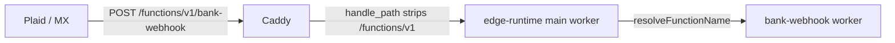

# Bank webhook production runbook

How inbound aggregator webhooks (Plaid and MX) are configured, deployed, and verified for the
self-hosted Finance production stack.

Related: [infrastructure standards](../ops/infrastructure-standards.md) ·
[secrets inventory](../ops/secrets.md) · [uptime monitoring](../ops/uptime-monitoring.md)

> **Audience:** whoever operates the production deployment. Some steps can only be done by hand in
> the Plaid and MX dashboards — they are not automated by CI and never will be.

## Why this matters

`bank-connection` exposes exactly four routes — `create_link_token`, `exchange_token`, `GET` (list)
and `DELETE` (disconnect). There is **no manual refresh or re-sync action**, and no scheduled job
re-syncs bank connections.

Inbound webhooks are therefore the **only** mechanism that keeps linked accounts current. If webhook
delivery is misconfigured, a user sees their transactions once at link time and the account then
**silently freezes** — no error is raised, nothing is logged as failed on our side, and a stale
account is indistinguishable from an account with no new activity. The only user-visible recovery is
to delete and re-link the connection.

Treat broken webhook delivery as a P0 data-correctness issue, not a cosmetic one.

## What depends on webhooks

Client-initiated calls work with no webhook endpoint at all:

| Capability                    | Route                                           |
| ----------------------------- | ----------------------------------------------- |
| Create link token             | `POST bank-connection?action=create_link_token` |
| Exchange public token         | `POST bank-connection?action=exchange_token`    |
| Account discovery and linking | during `exchange_token`                         |
| Initial transaction backfill  | during `exchange_token`                         |
| List connections              | `GET bank-connection`                           |
| Disconnect                    | `DELETE bank-connection`                        |

Everything below arrives **only** by webhook, and has no fallback:

| Capability                     | Trigger                                                           |
| ------------------------------ | ----------------------------------------------------------------- |
| Incremental transaction sync   | Plaid `SYNC_UPDATES_AVAILABLE`, `DEFAULT_UPDATE`; MX aggregation  |
| Historical backfill completion | Plaid `HISTORICAL_UPDATE`                                         |
| Transaction removals           | Plaid `TRANSACTIONS_REMOVED`                                      |
| Re-authentication required     | Plaid `ITEM/ERROR`, `PENDING_EXPIRATION`; MX member status change |
| Revocation detection           | Plaid `USER_PERMISSION_REVOKED`                                   |
| Sync and health telemetry      | `bank_sync_log`, `bank_connection_health` rows                    |

## Endpoint

Production runs at `https://finance.jrmoulckers.com`, served by Caddy with an automatically renewed
Let's Encrypt certificate. Both providers post to the same edge function, distinguished by the
`provider` query parameter:

| Provider | Webhook URL                                                                                       |
| -------- | ------------------------------------------------------------------------------------------------- |
| Plaid    | `https://finance.jrmoulckers.com/functions/v1/bank-webhook?provider=plaid`                        |
| MX       | `https://finance.jrmoulckers.com/functions/v1/bank-webhook?provider=mx&token=<MX_WEBHOOK_SECRET>` |

A request with a missing or unrecognised `provider` is rejected with `400`. An MX request whose
`token` is missing or does not match `MX_WEBHOOK_SECRET` is rejected with `401`. The MX URL
therefore contains a live secret — see [security notes](#security-notes).

### Request path



The prefix stripping is deliberate and safe:

- [`deploy/Caddyfile`](../../deploy/Caddyfile) uses `handle_path /functions/v1/*`, which **strips**
  the matched prefix before proxying to `edge-functions:9000`. The query string is preserved.
- [`functions/main/index.ts`](../../services/api/supabase/functions/main/index.ts) resolves the
  target function from **either** the `/functions/v1/<fn>` or the prefix-stripped `/<fn>` form, then
  forwards the original request to the worker — so `?provider=…` survives the hop.

No change is needed here; both halves of this contract are documented in `main/index.ts`.

## Configuration and scope

All bank credentials are **`production` environment** secrets in GitHub, not repository-level
secrets. They are declared optional in
[`deploy-production.yml`](../../.github/workflows/deploy-production.yml).

| Name                  | Kind                 | Purpose                                       |
| --------------------- | -------------------- | --------------------------------------------- |
| `PLAID_CLIENT_ID`     | environment secret   | Plaid API auth; webhook key fetch             |
| `PLAID_SECRET`        | environment secret   | Plaid API auth                                |
| `PLAID_ENVIRONMENT`   | environment variable | `sandbox` or `production`                     |
| `PLAID_WEBHOOK_URL`   | environment variable | Sent as `webhook` on link-token creation      |
| `MX_CLIENT_ID`        | environment secret   | MX API auth                                   |
| `MX_API_KEY`          | environment secret   | MX API auth                                   |
| `MX_ENVIRONMENT`      | environment variable | `sandbox` or `production`                     |
| `MX_WEBHOOK_SECRET`   | environment secret   | Shared secret in the MX webhook URL's `token` |
| `BANK_ENCRYPTION_KEY` | environment secret   | AES-256 key for stored access tokens          |

Record names and scopes only — never commit or paste the values.

### There is no `MX_WEBHOOK_URL`

Plaid's webhook URL is delivered **programmatically**: `PLAID_WEBHOOK_URL` is written to the server
`.env` and passed as the `webhook` field when a link token is created, so it attaches to every Item
created from that token.

MX has no equivalent. MX webhooks are configured **exclusively in the MX Client Dashboard** — MX
exposes no API for registering a webhook URL. This is why no `MX_WEBHOOK_URL` variable exists in any
workflow, and it is correct that none does.

**Consequence: after any change to the MX webhook destination, someone must update it by hand in the
MX dashboard.** Nothing in CI will do it, and nothing will warn you if it is wrong.

### Changes take effect on the next deploy

Secrets and variables are written to the server's `deploy/.env` only by the `deploy-backend` job of
`deploy-production.yml`. Saving a value in GitHub does **not** change the running stack — a
production deploy must run afterwards.

If `PLAID_CLIENT_ID`, `MX_CLIENT_ID` and `MX_WEBHOOK_SECRET` are all empty, the provisioning step
deliberately no-ops and logs that it is leaving bank features dark.

## Current prerequisites

- `PLAID_ENVIRONMENT` is now set to `production` (it previously defaulted to `sandbox`, which is why
  Plaid was not live).
- **`MX_CLIENT_ID` and `MX_API_KEY` are still unset.** MX cannot fetch live data until they are
  provisioned. Development and production credentials are separate key pairs, both issued from the
  MX Client Dashboard.
- `MX_ENVIRONMENT` still defaults to `sandbox`; set it to `production` when going live.
- MX requires **outbound IP allowlisting** in its dashboard before API calls succeed. The production
  host's egress IP must be allowlisted, or every MX call fails regardless of credentials.

MX base URLs are `https://int-api.mx.com` for development/integration and `https://api.mx.com` for
production.

## Manual dashboard steps

### Plaid

1. Sign in to the Plaid Dashboard and select the **Production** environment.
2. Confirm the account is enabled for Production and for the Transactions product.
3. No webhook URL needs to be entered for Transactions — it is supplied per-Item via the link token.
   Only dashboard-configured products (Transfer, Payment Initiation, Monitor, Identity Verification)
   require a URL in the UI, and Finance does not use those.
4. For Items linked **before** the webhook URL was correct, call `/item/webhook/update` with the
   Item's `access_token` and the Plaid URL above. On success Plaid sends a
   `WEBHOOK_UPDATE_ACKNOWLEDGED` event to the new URL.

### MX

1. Sign in to the MX Client Dashboard, then go to **Developers → Webhooks**.
2. Create a webhook for the types Finance consumes: **Aggregation** and **Connection Status**. Any
   other type is accepted and logged as an unhandled category, so enable only these two.
3. Set the destination URL to the MX URL above, including **both** the `?provider=mx` and
   `&token=<MX_WEBHOOK_SECRET>` query parameters. Copy the secret from the `production` GitHub
   environment; a URL without a matching `token` is rejected with `401`.
4. Leave MX's own security options (HTTP Basic, mutual TLS, OAuth 2) unset — Finance authenticates
   on the `token` parameter, because MX does not sign webhook bodies.
5. Save, then repeat for the production environment separately from development.

Some webhook types are not offered in the dashboard by default and must be requested from MX Support
with your client ID, environment, destination URL, and use case.

## Verifying delivery after a deploy

1. Confirm the deploy ran and the stack is healthy:

   ```bash
   curl -sS https://finance.jrmoulckers.com/health
   ```

2. **Plaid, sandbox:** fire a synthetic event against a sandbox Item.

   ```bash
   curl -X POST https://sandbox.plaid.com/sandbox/item/fire_webhook \
     -H 'Content-Type: application/json' \
     -d '{"client_id":"…","secret":"…","access_token":"…","webhook_code":"SYNC_UPDATES_AVAILABLE"}'
   ```

   Plaid has **no production equivalent** — in production, webhooks fire only on real events.

3. **Plaid, any environment:** review delivery attempts and response codes in the Plaid Dashboard
   activity logs.
4. **MX:** use the **Test** action beside the webhook in the Client Dashboard, or trigger a real
   aggregation in the integration environment against a test institution such as MX Bank or MXCU. MX
   has no fire-webhook API.
5. Confirm the event was actually **ingested**, not merely accepted: look for a new `bank_sync_log`
   row and a `bank_connection_health` row for the connection. A `200` response alone does not prove
   ingestion.

### Retry behaviour

Both providers retry, so a short outage is recoverable — but neither retries indefinitely.

| Behaviour       | Plaid                                   | MX                               |
| --------------- | --------------------------------------- | -------------------------------- |
| Failure trigger | non-2xx, or no response within 10s      | non-2xx, timeouts, DNS errors    |
| Backoff         | 4× the previous delay, from 30s         | decreasing frequency, randomised |
| Gives up after  | about 24h                               | 12–15h                           |
| Auto-disable    | stops early if over 90% rejected in 24h | none documented                  |

Plaid honours `Retry-After` on `429`; MX re-queues on `429`.

## Open risks

Plaid documents its webhook URL format as `http(s)://(www.)domain.com/` and does not state whether
query strings are preserved. Finance relies on `?provider=plaid`, so confirm with a sandbox
`fire_webhook` that the query string arrives intact before trusting it in production. The same
caveat applies with more force to MX, whose URL carries the shared secret as well as the provider.

The two MX defects previously listed here — the `event_type` mismatch and the non-existent
`mx-signature` header — were fixed in #4377. MX event handling now dispatches on `type`, and an
unrecognised category is logged as a warning rather than silently accepted, so a future contract
drift is visible in the logs instead of presenting as a silent freeze.

MX endpoint paths and response field names in `_shared/mx.ts` were written from the API reference and
have still never been exercised against a live MX response. Validate them in the integration
environment before enabling MX in production.

## Certificate renewal

The TLS certificate is issued by Let's Encrypt and renewed automatically by Caddy. Renewal requires
the host to stay reachable on ports 80 and 443 for the ACME challenge. Expiry breaks **all** webhook
delivery, because both providers require a valid certificate. The TLS-expiry monitor described in
[uptime monitoring](../ops/uptime-monitoring.md) should alert below 14 days remaining.

## Security notes

- The endpoint is intentionally unauthenticated at the platform layer but verified per provider:
  Plaid via the ES256 JWT in `Plaid-Verification` (key fetched from `/webhook_verification_key/get`),
  MX via the shared secret in the `token` query parameter, compared in constant time. It is
  additionally rate limited per IP.
- **The MX webhook URL is itself a secret**, because it embeds `MX_WEBHOOK_SECRET`. Treat it like a
  credential: never paste it into an issue, PR, log, or screenshot, and rotate `MX_WEBHOOK_SECRET`
  (then update the MX dashboard) if it is exposed.
- Verification runs **before** the payload is parsed or processed.
- Do not probe the production webhook endpoint to check whether it is up — unverified requests are
  rejected and recorded as security events. Use `/health` instead.
- Access tokens are decrypted only in memory, and raw financial values are never logged.
