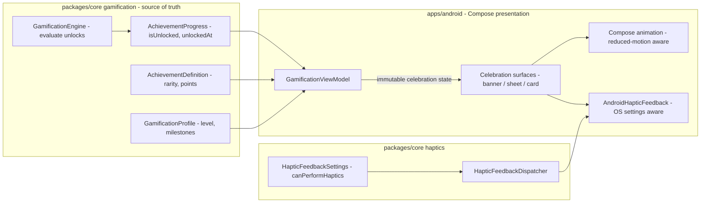
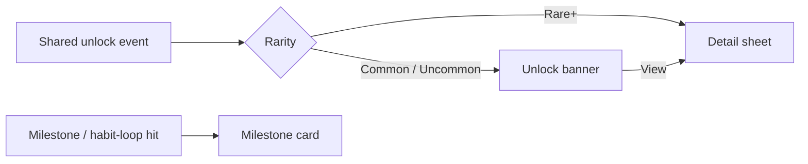
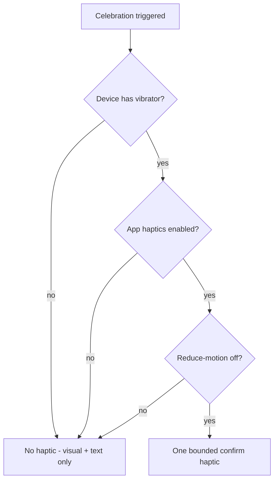

# Android Achievement Celebration — Motion & Haptics — Design

> **Status:** DESIGN — Implementation-ready (debug build/test unblocked; Play distribution gated by [#1242](https://github.com/jrmoulckers/finance/issues/1242))
> **Issue:** [#2692](https://github.com/jrmoulckers/finance/issues/2692) — _Part of [#2211](https://github.com/jrmoulckers/finance/issues/2211)_ (gamification depth)
> **Platform:** Android (Jetpack Compose · Material 3 · Compose animation · Android haptics)
> **Companion designs:** [Streak & Near-Win States](./android-streak-near-win-states.md) · [Sharesheet Wins & Badges](./android-sharesheet-wins-badges.md) · [Privacy-Safe Share Cards](./android-privacy-safe-share-cards.md)
> **Last Updated:** 2026-06-22

This document designs **achievement celebration moments** on Android — the **unlock
banner**, the **detail sheet**, and the **milestone card** — using **tasteful
motion** and **Android haptics**. It specifies celebration **surfaces**,
**intensity tiers** (driven by the shared `AchievementRarity`), and the
**reduced-motion** and **non-haptic** behaviors that keep celebrations inclusive.

Crucially, haptics and motion are **enhancements, never the sole signal**: every
celebration is fully legible with **no motion and no vibration**. Celebrations are
also **guarded against manipulative patterns** — they reward _habits and
milestones_, never _spending volume_. All achievement state comes from the shared
KMP `GamificationEngine`; Compose only **renders** unlock state and plays the
presentation layer. No Kotlin is written here — design + breakdown only.

---

## Table of Contents

1. [Goals & Non-Goals](#1-goals--non-goals)
2. [Architecture Boundary (Compose ↔ KMP)](#2-architecture-boundary-compose--kmp)
3. [Grounding in Existing Code](#3-grounding-in-existing-code)
4. [Celebration Surfaces](#4-celebration-surfaces)
5. [Intensity Tiers by Rarity](#5-intensity-tiers-by-rarity)
6. [Motion Spec](#6-motion-spec)
7. [Haptics Spec](#7-haptics-spec)
8. [Reduced-Motion & Non-Haptic Alternatives](#8-reduced-motion--non-haptic-alternatives)
9. [Ethical Guardrails (No Manipulative Rewards)](#9-ethical-guardrails-no-manipulative-rewards)
10. [Accessibility (TalkBack, Switch Access, Font Scaling)](#10-accessibility-talkback-switch-access-font-scaling)
11. [Offline, Empty & Error States](#11-offline-empty--error-states)
12. [Test Plan](#12-test-plan)
13. [Implementation Readiness](#13-implementation-readiness)
14. [Open Questions](#14-open-questions)
15. [References](#15-references)

---

## 1. Goals & Non-Goals

### Goals

- Define **three celebration surfaces** — unlock banner, detail sheet, milestone
  card — for unlocks, milestone hits, and healthy habit loops.
- Specify **motion and haptic intensity** scaled by the shared
  `AchievementRarity` (COMMON → LEGENDARY), with explicit ceilings.
- Guarantee **reduced-motion** behavior and **non-haptic** alternatives so the
  celebration is never dependent on motion or vibration.
- Document **guardrails** against manipulative rewards tied to spending volume.
- Reuse the existing shared haptics dispatcher and gamification models; **no new
  finance/achievement rules in Compose**.

### Non-Goals

- **No achievement logic in Compose.** Unlock evaluation, rarity, points, and
  milestone thresholds are the shared `GamificationEngine` / `Achievements` — the UI
  renders results (see §2–§3).
- **No new Kotlin in this issue.** Design-ready scoping; implementation follows once
  agreed (#2211).
- **No share/export design here.** Sharing wins lives in
  [sharesheet wins & badges](./android-sharesheet-wins-badges.md) and
  [privacy-safe share cards](./android-privacy-safe-share-cards.md); this doc is the
  in-app moment only.
- **No streak math.** Streak states are
  [android-streak-near-win-states.md](./android-streak-near-win-states.md); a streak
  milestone may _trigger_ a celebration but its rules stay shared.
- **No financial amounts in celebration copy** (see §9). Counts, dates, and
  milestone labels only.
- **No Play distribution work** (gated by #1242 — see §13).

---

## 2. Architecture Boundary (Compose ↔ KMP)

The celebration is a **presentation reaction to shared state**. The engine decides
_what_ was unlocked and _how rare_ it is; Compose decides _how to present_ it
(within accessibility and ethics constraints) and plays motion/haptics.

- The ViewModel exposes an **immutable celebration UI state** (which achievement,
  its rarity, its label) — Compose draws and animates it. The **decision to
  celebrate** is shared; the **way to celebrate** is platform presentation.
- Haptics route through the existing shared
  [`HapticFeedbackDispatcher`](../../packages/core/src/commonMain/kotlin/com/finance/core/haptics/HapticFeedback.kt),
  which only fires when `HapticFeedbackSettings.canPerformHaptics` is true — so OS
  and app settings are honored centrally.

---

## 3. Grounding in Existing Code

| Concern               | Source of truth (reuse — do **not** reimplement in Compose)                                                                                                                                                                       | Today's state                                                                |
| --------------------- | --------------------------------------------------------------------------------------------------------------------------------------------------------------------------------------------------------------------------------- | ---------------------------------------------------------------------------- |
| Achievement model     | [`AchievementDefinition`](../../packages/core/src/commonMain/kotlin/com/finance/core/gamification/GamificationTypes.kt)                                                                                                           | Exists: `rarity`, `points`, `category`, `icon`                               |
| Rarity tiers          | [`AchievementRarity`](../../packages/core/src/commonMain/kotlin/com/finance/core/gamification/GamificationTypes.kt)                                                                                                               | Exists: COMMON…LEGENDARY — _"affects display prominence and celebration UI"_ |
| Unlock progress       | [`AchievementProgress`](../../packages/core/src/commonMain/kotlin/com/finance/core/gamification/GamificationTypes.kt)                                                                                                             | Exists: `isUnlocked`, `unlockedAt`, `progressFraction`                       |
| Milestones            | [`SavingsMilestone`](../../packages/core/src/commonMain/kotlin/com/finance/core/gamification/GamificationTypes.kt) · `GamificationProfile`                                                                                        | Exists: milestone reached flags, level/points                                |
| Unlock evaluation     | [`GamificationEngine`](../../packages/core/src/commonMain/kotlin/com/finance/core/gamification/GamificationEngine.kt) · [`Achievements`](../../packages/core/src/commonMain/kotlin/com/finance/core/gamification/Achievements.kt) | Exists: evaluates data → unlock state                                        |
| Shared haptics        | [`HapticFeedbackDispatcher` / `HapticFeedbackSettings`](../../packages/core/src/commonMain/kotlin/com/finance/core/haptics/HapticFeedback.kt)                                                                                     | Exists: gated by `canPerformHaptics`; `NoOpHapticFeedback`                   |
| Android haptic bridge | [`AndroidHapticFeedback`](../../apps/android/src/main/kotlin/com/finance/android/ui/feedback/HapticFeedbackManager.kt)                                                                                                            | Exists: `View.performHapticFeedback`, **reduce-motion guard**                |
| Existing UI           | [`GamificationScreen` / `GamificationViewModel`](../../apps/android/src/main/kotlin/com/finance/android/ui/gamification/GamificationViewModel.kt)                                                                                 | Exists: renders profile; **no celebration moment yet**                       |
| The gap to fill       | Celebration banner / sheet / card that reacts to a new unlock with rarity-scaled motion + haptics, reduced-motion safe                                                                                                            | **Not built** — this is the design target                                    |

> Note the existing
> [`AndroidHapticFeedback`](../../apps/android/src/main/kotlin/com/finance/android/ui/feedback/HapticFeedbackManager.kt)
> already **no-ops when reduce-motion is on** (animator duration scale = 0). The
> celebration layer must extend that same discipline to **motion**, not just haptics.

---

## 4. Celebration Surfaces

Three surfaces, escalating in prominence, all built from shared unlock state:

### 4.1 Unlock banner (lightweight)

- A transient Material 3 banner / snackbar-style surface that slides in when a new
  `AchievementProgress.isUnlocked` flips true.
- Shows icon + title + "Unlocked" + a **View** action that opens the detail sheet.
- Auto-dismisses after a short, accessibility-extended timeout; never blocks input.
- This is the **default** moment for COMMON/UNCOMMON unlocks.

### 4.2 Detail sheet (focused)

- A Material 3 modal bottom sheet opened from the banner or the achievements list.
- Shows the achievement art, title, description, **points** and **rarity** label,
  and (for progressive ones) the `progressFraction` that completed it.
- Houses the entry to **share** (handed off to
  [sharesheet wins & badges](./android-sharesheet-wins-badges.md)).
- Used for RARE+ unlocks and any "tap to view" from a banner.

### 4.3 Milestone card (in-context)

- An inline card on the dashboard / goal screen that marks a **healthy habit loop**
  or **milestone hit** (e.g. a savings milestone reached, a streak milestone).
- Persistent (not transient) — celebrates without nagging; dismissible.
- Reuses milestone state from `GamificationProfile` / `SavingsMilestone` /
  [streak states](./android-streak-near-win-states.md).

---

## 5. Intensity Tiers by Rarity

`AchievementRarity` already "affects display prominence and celebration UI". We map
it to **explicit, capped** motion + haptic tiers. Higher rarity = slightly richer,
**never** longer-than-tasteful or seizure-risky.

| Rarity        | Surface (default) | Motion tier                                                   | Haptic tier (when allowed)         |
| ------------- | ----------------- | ------------------------------------------------------------- | ---------------------------------- |
| **COMMON**    | Banner            | Subtle fade + small scale-in                                  | Light confirm tick (or none)       |
| **UNCOMMON**  | Banner            | Fade + scale-in + soft accent shimmer                         | Light confirm                      |
| **RARE**      | Sheet             | Scale-in + brief accent sweep                                 | Confirm                            |
| **EPIC**      | Sheet             | Scale-in + accent sweep + sparse particles                    | Confirm + a single soft emphasis   |
| **LEGENDARY** | Sheet             | Richer (still brief) sweep + particles, single emphasis pulse | Emphasis confirm (single, bounded) |

Hard ceilings (all tiers):

- **Duration** ≤ ~1200ms total motion; particle effects ≤ ~800ms and **off** under
  reduced motion.
- **No flashing** faster than 3 Hz (photosensitivity safety) — never.
- **Haptics** never repeat/loop; one bounded effect per celebration; always gated by
  `canPerformHaptics`.
- A higher tier must remain **fully legible** when reduced to the COMMON (text-only)
  presentation.

---

## 6. Motion Spec

- **Library:** Jetpack Compose animation (`AnimatedVisibility`, `animateFloatAsState`,
  `updateTransition`) — no XML/View animators.
- **Banner enter:** fade (`alpha 0→1`) + scale (`0.96→1.0`) over ~200–300ms with a
  standard Material easing; exit symmetric.
- **Sheet content:** staggered fade/scale of icon → title → meta; total ≤ ~600ms.
- **Accent sweep / particles:** decorative, additive, and **strictly optional** —
  rendered only when motion is allowed. They carry **no information**; removing them
  loses nothing semantically.
- **Determinism for tests:** drive animation from the immutable celebration state so
  Paparazzi can snapshot the **settled** frame (post-animation) deterministically.
- **Performance:** budget for low-end devices (minSdk 28) — particles capped, no
  per-frame allocation; prefer `graphicsLayer` transforms.

---

## 7. Haptics Spec

- Route **only** through the shared
  [`HapticFeedbackDispatcher`](../../packages/core/src/commonMain/kotlin/com/finance/core/haptics/HapticFeedback.kt)
  via the Android
  [`AndroidHapticFeedback`](../../apps/android/src/main/kotlin/com/finance/android/ui/feedback/HapticFeedbackManager.kt)
  bridge (which uses `View.performHapticFeedback` with API-aware constants).
- A celebration emits **one** bounded effect — semantically a "success/confirm".
  Today the shared `HapticFeedbackEffect` exposes `TRANSACTION_SAVE_SUCCESS` and
  `TRANSACTION_VALIDATION_WARNING`; a celebration would reuse the success semantics
  (a future shared `ACHIEVEMENT_UNLOCK` effect, if added, stays in `packages/core` —
  not invented in Compose).
- **Gating (all must pass):** OS haptics available (`hasVibrator`), app haptics
  enabled (`HapticFeedbackSettings.appHapticsEnabled`), and reduce-motion **off**
  (the bridge already returns early when animator duration scale = 0).
- Requires the existing `android.permission.VIBRATE` (already in the manifest). No
  custom waveform loops; no escalation that could feel coercive.

---

## 8. Reduced-Motion & Non-Haptic Alternatives

**Haptics and motion are enhancements, never the sole signal.** The celebration
must be fully understandable with **zero motion and zero vibration**.

| User setting / capability | Celebration behavior                                                                                                  |
| ------------------------- | --------------------------------------------------------------------------------------------------------------------- |
| **Reduce motion ON**      | No particles/sweep/scale; instant, static reveal of banner/sheet/card. Haptics also suppressed (per existing bridge). |
| **No haptic hardware**    | Visual + textual celebration only; identical information.                                                             |
| **App haptics disabled**  | Visual + textual only.                                                                                                |
| **Both disabled**         | Static, text-first celebration — title, "Unlocked", rarity, points; nothing lost.                                     |
| **TalkBack on**           | Announce the unlock via live region regardless of motion/haptics (see §10).                                           |

Principles:

- **Information parity** — every fact conveyed by motion/haptics (something was
  unlocked; how notable) is **also** conveyed in text and iconography.
- **Detect reduced motion** the same way the existing bridge does
  (`Settings.Global.ANIMATOR_DURATION_SCALE == 0`); honor it for **motion** too, not
  only haptics.
- **No "turn on animations" nagging.** Respect the choice silently.
- **Settings** — celebrations honor a dedicated in-app "Celebrations" toggle
  (and the existing haptics toggle); users can dial them down to text-only.

---

## 9. Ethical Guardrails (No Manipulative Rewards)

Celebrations reinforce **healthy financial habits**, never spending. Guardrails:

- **Never reward spending volume.** No celebration is triggered by _how much_ was
  spent, by purchase count, or by hitting a higher spend tier. Triggers are habit /
  milestone / savings / streak based (tracking consistency, budget adherence, goal
  progress) — sourced from the shared engine's existing categories
  (`TRACKING`, `BUDGETING`, `SAVING`, `STREAKS`, `ONBOARDING`).
- **No amounts in celebration copy.** Show counts, dates, milestone labels, and
  points — never balances or transaction amounts (consistent with
  [privacy-safe share cards](./android-privacy-safe-share-cards.md)).
- **No loss-aversion / FOMO pressure.** No countdowns that imply a reward "expires";
  no "you're about to lose X" framing in celebrations (near-win _encouragement_ is
  the separate, gentle [streak near-win](./android-streak-near-win-states.md) design).
- **No artificial scarcity or variable-reward gambling loops.** Rarity reflects
  genuine difficulty defined in `AchievementDefinition`, not a randomized payout.
- **Frequency caps.** Coalesce multiple simultaneous unlocks into one moment; never
  chain celebrations to maximize dopamine hits.
- **Always dismissible & disableable.** Celebrations never block a task and can be
  turned down to text-only or off.

---

## 10. Accessibility (TalkBack, Switch Access, Font Scaling)

- **TalkBack** — the celebration announces via an `assertive`/polite **live region**
  ("Achievement unlocked: Budget Keeper. Rare.") so it is conveyed independent of
  motion/haptics. Banner/sheet/card all carry `contentDescription` (icon + title +
  rarity + points). Decorative particles are marked **non-focusable / decorative**
  and excluded from semantics.
- **Switch Access** — the banner's **View** action and the sheet's **Share** /
  **Dismiss** are standard focusable controls; nothing requires a gesture. Transient
  banners give Switch/AT users **enough time** (extended timeout) or remain until
  dismissed when an accessibility service is active.
- **200% font scaling** — celebration text uses `sp` and wraps; the sheet scrolls;
  the banner grows to fit rather than truncating. Layout verified at the largest
  scale.
- **Reduced motion** — see §8; static, instant reveal.
- **Touch targets** — actions ≥ 48dp.
- See [Accessibility Patterns Library](./accessibility-patterns.md) and
  [Cognitive Accessibility Mode](./cognitive-accessibility.md) (cognitive mode may
  prefer the calmest tier — text-only — for all rarities).

---

## 11. Offline, Empty & Error States

| Condition                           | Behavior                                                                                                                        |
| ----------------------------------- | ------------------------------------------------------------------------------------------------------------------------------- |
| **Offline**                         | Unlocks are evaluated locally by the shared engine; celebrations fire normally. No network needed.                              |
| **No achievements yet (empty)**     | No celebration; the achievements screen shows its existing empty state. Never fabricate a moment.                               |
| **Multiple simultaneous unlocks**   | Coalesce into one banner ("3 achievements unlocked") opening a sheet listing them — no chaining (§9).                           |
| **Unlock state unreadable / error** | Skip the celebration silently; log via Timber (no sensitive data); the achievement still shows as unlocked once state recovers. |
| **Haptics/motion unavailable**      | Degrade to text-only celebration (§8) — never an error.                                                                         |
| **Celebration setting OFF**         | No motion/haptics/banner; achievement still recorded and visible in the list.                                                   |

---

## 12. Test Plan

### Shared unit tests (reuse)

- Unlock evaluation, rarity, points, milestones covered by the shared
  `GamificationEngine` / `Achievements` tests in `packages/core`. **No** new shared
  rules added here. Shared haptic gating covered by
  [`HapticFeedbackDispatcherTest`](../../packages/core/src/commonTest/kotlin/com/finance/core/haptics/HapticFeedbackDispatcherTest.kt).

### Android unit tests (`apps/android/src/test`)

- ViewModel maps a new `AchievementProgress.isUnlocked` transition → celebration UI
  state with the correct rarity tier.
- Multiple unlocks coalesce into a single celebration state.
- Haptic is requested only when `canPerformHaptics` and reduce-motion is off.
- Celebration setting OFF suppresses banner/motion/haptics but not the unlock record.

### Compose / instrumentation tests

- Banner appears on unlock, exposes a **View** action, and is dismissible.
- Live-region announcement is emitted (semantics) for TalkBack.
- Reduce-motion: assert no particle/animation nodes; static reveal present.
- Switch Access: actions are focusable; transient banner timeout extends under AT.

### Paparazzi snapshot tests

- Banner, detail sheet, and milestone card at each rarity tier (**settled** frame).
- Reduced-motion variant (static) and full-motion settled variant.
- 200% font scale variant; text-only (haptics+motion disabled) variant.

---

## 13. Implementation Readiness

| Phase                                                                                                                                                     | Status               | Gate                                                                                                      |
| --------------------------------------------------------------------------------------------------------------------------------------------------------- | -------------------- | --------------------------------------------------------------------------------------------------------- |
| This design doc                                                                                                                                           | ✅ Done              | None                                                                                                      |
| Shared gamification + haptics models (consumed, not modified)                                                                                             | ✅ Exists            | None — `packages/core`, owned by `@kmp-engineer`                                                          |
| Celebration banner / sheet / milestone card, Compose motion (reduced-motion aware), haptic bridge reuse, unit/Compose/Paparazzi, `assembleDebug` sideload | 🟢 **Buildable now** | None — debug sideload per [`../ops/human-gated-prerequisites.md` §2](../ops/human-gated-prerequisites.md) |
| Play Store release + production distribution of the celebration experience                                                                                | 🔒 **Gated**         | [#1242](https://github.com/jrmoulckers/finance/issues/1242) — keystore + Play Console                     |

Celebration motion (Compose animation) and haptics (existing `AndroidHapticFeedback`
bridge + shared dispatcher) are **standard local Android code** — fully
implementable and testable today with `./gradlew :apps:android:assembleDebug`,
Compose instrumentation, and Paparazzi snapshots of the settled frames. Achievement
and rarity rules stay in `packages/core`. **Only Play distribution** (release
signing, Play Console upload) is human-gated by #1242 — see
[`../ops/human-gated-prerequisites.md`](../ops/human-gated-prerequisites.md) §§2–3.1.
No build, signing, or store action is performed by this design.

---

## 14. Open Questions

1. **Shared `ACHIEVEMENT_UNLOCK` effect.** Should `packages/core` add a dedicated
   semantic haptic effect (vs. reusing `TRANSACTION_SAVE_SUCCESS`)? Owned by
   `@kmp-engineer`; this doc only consumes it.
2. **Celebration toggle granularity.** One "Celebrations" toggle vs. separate
   "motion" and "haptics" sub-toggles (beyond the existing app haptics setting)?
3. **Coalescing window.** How long to wait before grouping simultaneous unlocks into
   one moment (e.g. 500ms) so we never chain dopamine hits (§9)?
4. **Legendary art.** Particle/sweep assets per rarity from `@design-engineer` —
   placeholders until provided; must stay within the photosensitivity ceiling.

---

## 15. References

- Streak/near-win triggers: [Streak & Near-Win States](./android-streak-near-win-states.md)
- Sharing wins: [Sharesheet Wins & Badges](./android-sharesheet-wins-badges.md) · [Privacy-Safe Share Cards](./android-privacy-safe-share-cards.md)
- Shared models: [`GamificationTypes.kt`](../../packages/core/src/commonMain/kotlin/com/finance/core/gamification/GamificationTypes.kt) · [`GamificationEngine.kt`](../../packages/core/src/commonMain/kotlin/com/finance/core/gamification/GamificationEngine.kt) · [`Achievements.kt`](../../packages/core/src/commonMain/kotlin/com/finance/core/gamification/Achievements.kt)
- Shared haptics: [`HapticFeedback.kt`](../../packages/core/src/commonMain/kotlin/com/finance/core/haptics/HapticFeedback.kt)
- Android haptic bridge: [`HapticFeedbackManager.kt`](../../apps/android/src/main/kotlin/com/finance/android/ui/feedback/HapticFeedbackManager.kt)
- Accessibility: [Accessibility Patterns Library](./accessibility-patterns.md) · [Cognitive Accessibility Mode](./cognitive-accessibility.md)
- Gating: [`../ops/human-gated-prerequisites.md`](../ops/human-gated-prerequisites.md)
