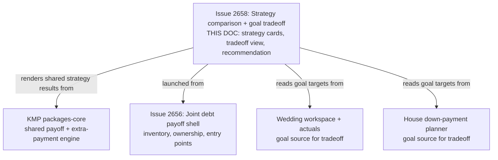
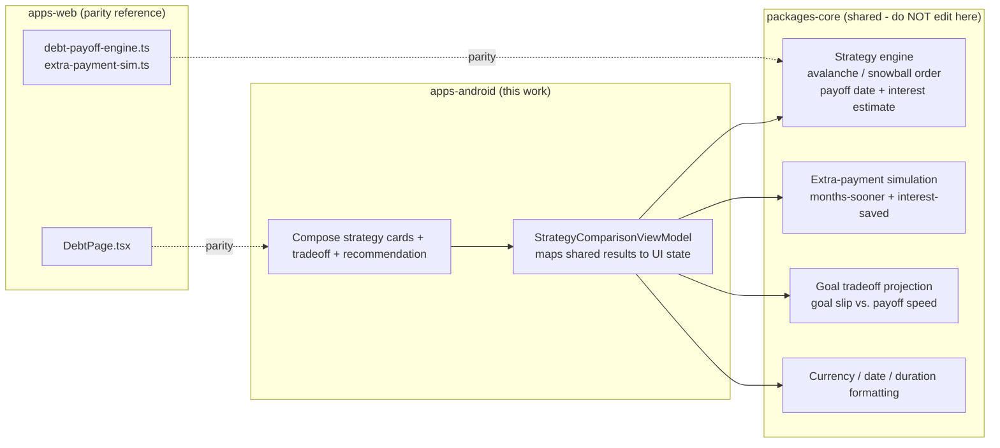
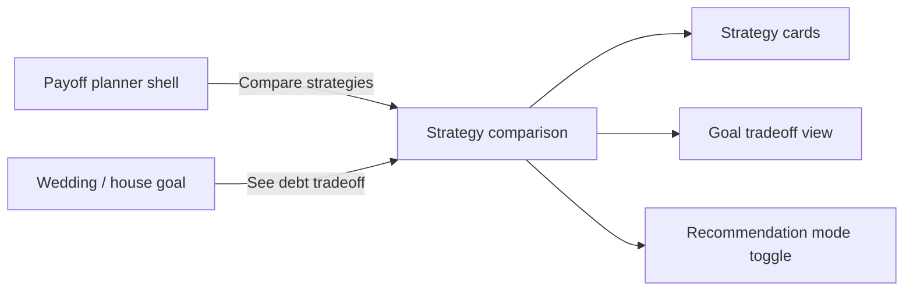
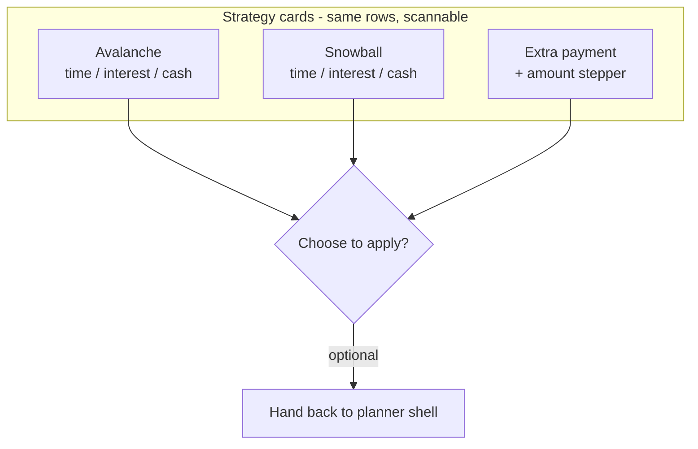
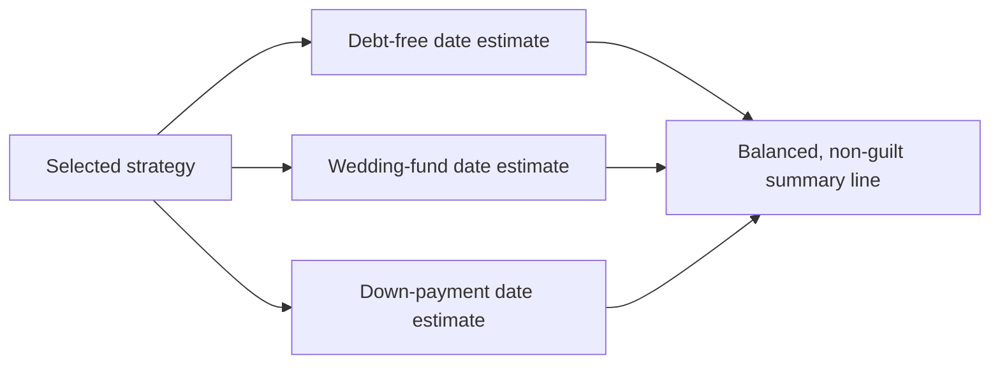

# Android Avalanche / Snowball Comparison & Goal Tradeoff UI

> **Status:** PROPOSED — Pending human review
> **Issue:** [#2658](https://github.com/jrmoulckers/finance/issues/2658) · Part of [#2153](https://github.com/jrmoulckers/finance/issues/2153)
> **Platform:** Android (Jetpack Compose, Material 3)
> **Last Updated:** 2026-06-22
> **Design only:** Native implementation remains blocked by [#1242](https://github.com/jrmoulckers/finance/issues/1242)

---

## Table of Contents

1. [Purpose](#purpose)
2. [Persona and Why This Matters](#persona-and-why-this-matters)
3. [Goals and Non-Goals](#goals-and-non-goals)
4. [Scope Boundaries With Sibling Work](#scope-boundaries-with-sibling-work)
5. [Payoff Math Lives in KMP](#payoff-math-lives-in-kmp)
6. [Comparison Surface and Entry Points](#comparison-surface-and-entry-points)
7. [Strategy Cards: Time, Interest, and Cash Impact](#strategy-cards-time-interest-and-cash-impact)
8. [Goal Tradeoff View](#goal-tradeoff-view)
9. [Recommendation Mode](#recommendation-mode)
10. [Plain-Language Copy](#plain-language-copy)
11. [Accessibility Considerations](#accessibility-considerations)
12. [Offline, Empty, and Error States](#offline-empty-and-error-states)
13. [Test Plan](#test-plan)
14. [Implementation Readiness](#implementation-readiness)
15. [References](#references)

---

## Purpose

A household that is paying down debt usually faces the same question: _should we
attack the highest-interest balance first (avalanche), the smallest balance first
(snowball), or add an extra payment — and what does each choice cost us against our
**wedding** and **down-payment** goals?_ This document designs the Android Compose
**payoff-strategy comparison surface** and the **goal tradeoff view**: how the three
strategies sit side by side, how each reports **time-to-payoff, interest saved, and
monthly cash impact**, how the tradeoff against funded goals is shown without guilt,
and an optional **recommendation mode** for users who just want a nudge toward a
sensible default.

It is **design and breakdown only** while
[#1242](https://github.com/jrmoulckers/finance/issues/1242) gates Google Play
distribution. No Kotlin is written here, and **no payoff math is implemented in
Compose** — that arithmetic is a shared KMP concern, with the web debt engines as
the parity reference.

> **Important framing:** every payoff date, interest-saved figure, and "months
> sooner" number on this surface is an **estimate**, visibly labelled as such. The
> comparison plans the household's _own_ payoff; it is not debt counseling,
> consolidation advice, or a credit decision.

---

## Persona and Why This Matters

The persona ([#2153](https://github.com/jrmoulckers/finance/issues/2153)): a couple
balancing **debt payoff** against two near-term life goals — a **wedding** and a
**house down payment**. They have heard the words "avalanche" and "snowball" but
cannot feel the difference in their own numbers, and every dollar sent to debt is a
dollar that does not go to the wedding fund. They need an honest, side-by-side
comparison that makes the tradeoff legible **without shaming them** for choosing the
emotionally easier path. This intersects with
[Persona 3 (household / couples)](personas.md), the joint-debt foundation in
[android-joint-debt-payoff-planner.md](android-joint-debt-payoff-planner.md), and the
goal surfaces in
[android-house-downpayment-planner.md](android-house-downpayment-planner.md) and
[android-wedding-workspace-shell.md](android-wedding-workspace-shell.md).

---

## Goals and Non-Goals

**Goals**

- Show **avalanche, snowball, and extra-payment** strategies side by side, each with
  **time-to-payoff**, **interest saved** (versus a minimum-only baseline), and
  **monthly cash impact**.
- Make the tradeoff against the **wedding** and **down-payment** goals visible — how
  much a goal slips (or speeds up) under each strategy — in **neutral, non-guilt
  language**.
- Offer a **recommendation mode**: a single suggested strategy with a one-line
  rationale, for users who want a simpler decision aid instead of a full comparison.
- Render only **shared payoff state** from KMP; keep all math out of Compose.
- Be fully accessible (TalkBack, Switch Access, 200% font, plain language) and define
  offline/empty/error states.

**Non-Goals**

- Implementing the payoff engine, extra-payment simulation, or interest math — that is
  KMP `packages/core`, with the web debt engines as parity (owned by @native-app-engineer /
  @web-engineer).
- Debt ownership, classification, and the planner shell — owned by
  [android-joint-debt-payoff-planner.md](android-joint-debt-payoff-planner.md).
- Editing the wedding or down-payment goal surfaces themselves — owned by
  [android-wedding-workspace-shell.md](android-wedding-workspace-shell.md),
  [android-wedding-actuals-cashflow.md](android-wedding-actuals-cashflow.md), and
  [android-house-downpayment-planner.md](android-house-downpayment-planner.md).
- Any debt counseling, refinancing, or consolidation recommendation.
- Editing KMP `packages/*`, web, or any non-Android platform.

---

## Scope Boundaries With Sibling Work

This doc owns the **comparison and tradeoff surfaces only**. The planner shell and
debt ownership are the joint-debt doc; the wedding and house planners own their goal
definitions; the strategy arithmetic is shared KMP. This surface is launched from the
planner and **reads** goal targets to render the tradeoff — it never edits them.

---

## Payoff Math Lives in KMP

Strategy ordering, projected payoff dates, interest-saved comparisons, and
extra-payment simulation are **business logic** and must be shared, not duplicated in
Compose. The web references already exist —
[`debt-payoff-engine.ts`](../../apps/web/src/lib/debt-payoff-engine.ts),
[`extra-payment-sim.ts`](../../apps/web/src/lib/expenses/extra-payment-sim.ts),
[`debt-interest.ts`](../../apps/web/src/lib/expenses/debt-interest.ts), and
[`debt-types.ts`](../../apps/web/src/lib/debt-types.ts) — and drive the web
[`DebtPage.tsx`](../../apps/web/src/pages/DebtPage.tsx). The Android client consumes an
**equivalent shared model from KMP `packages/core`** so both platforms agree on every
strategy number.

> This document **describes** the boundary. It does **not** implement KMP changes —
> `packages/core` is owned by @native-app-engineer and the web engines by @web-engineer.
> Compose is a pure renderer of shared state. The existing
> [`Liability`](../../packages/models/src/commonMain/kotlin/com/finance/models/Liability.kt)
> and
> [`LiabilityInstallment`](../../packages/models/src/commonMain/kotlin/com/finance/models/LiabilityInstallment.kt)
> models are the inputs the shared strategy and tradeoff model needs; goal targets
> arrive from the shared goal models that the wedding and house planners already
> consume. The ViewModel maps a shared `StrategyComparisonSummary` into immutable UI
> state — it **never** re-derives a payoff date, interest figure, or goal slip in
> Kotlin UI code.

---

## Comparison Surface and Entry Points

The comparison is a focused surface reached **from the payoff planner shell**, not a
new top-level destination. Entry points:

- A **"Compare strategies"** action on the planner shell
  ([android-joint-debt-payoff-planner.md](android-joint-debt-payoff-planner.md)).
- A contextual link from a goal that is competing for cash (wedding / down payment),
  framed as _"See how paying off debt affects this goal."_

The surface has three regions, each independently focusable: the **strategy cards**
(default), the **goal tradeoff view**, and the **recommendation mode** toggle. A
persistent, dismissible estimate banner sits at the top: _"These are estimates based on
your current balances and payments."_

---

## Strategy Cards: Time, Interest, and Cash Impact

Three cards (or a comparison table at ≥600dp width) present the strategies with
identical metric rows so they are scannable:

| Metric                  | What it shows                                                      | Tone                              |
| ----------------------- | ------------------------------------------------------------------ | --------------------------------- |
| **Time to payoff**      | Estimated debt-free date / months remaining                        | Neutral, "estimated" label inline |
| **Interest saved**      | Versus a minimum-payment-only baseline (never a negative framing)  | Positive, factual                 |
| **Monthly cash impact** | Dollars per month the plan asks for (and how it compares to today) | Neutral                           |

- **Avalanche** — highest interest rate first; usually the largest interest saved.
- **Snowball** — smallest balance first; usually the fastest first "win," labelled as
  a **motivation** benefit, not a math benefit.
- **Extra payment** — a what-if on top of either ordering; a small stepper/slider sets
  the extra amount and the card recomputes (from the **shared** simulation) the
  months-sooner and interest-saved deltas.

Non-color cues are mandatory: each metric carries an **icon + text label**, and the
"best on this metric" marker is a labelled badge ("Most interest saved"), never color
alone — see [data-visualization.md](data-visualization.md) and
[chart-component-specs.md](chart-component-specs.md).

Choosing a strategy does **not** mutate anything here; it hands the selected strategy
id back to the planner shell, which owns any "make this my plan" action.

---

## Goal Tradeoff View

The tradeoff view answers _"what does this cost my wedding / down payment?"_ For each
funded goal it shows, per strategy, the **estimated change in the goal's funded date**
(e.g. "wedding fund reaches target ~2 months later") alongside the debt benefit, so the
user sees both sides of the same dollar.

- Framing is **strictly neutral**: _"Sending more to debt moves your debt-free date up
  and your wedding-fund date back by about the same effort."_ No "you're behind," no
  "sacrifice," no urgency pressure — per
  [content-language-guidelines.md](content-language-guidelines.md).
- Both directions are shown: a strategy that frees cash _sooner_ can also _help_ a goal
  later; the view never implies debt is the only virtuous choice.
- Every number is an **estimate** and inherits the same inline labelling and a
  short "How we estimate this" affordance.

If a household has no wedding or house goal configured, the tradeoff view shows a calm
empty state (see [offline, empty, and error states](#offline-empty-and-error-states))
rather than implying they _should_ have one.

---

## Recommendation Mode

For users who do not want to weigh three cards, a **recommendation mode** toggle
collapses the comparison to a **single suggested strategy** with a one-line rationale
(e.g. _"Avalanche saves you the most interest based on your current rates — about
[estimated amount]."_).

- The recommendation is produced by the **shared** engine (a deterministic rule over
  the same results), not a Compose-side heuristic.
- It is a **decision aid, not advice**: copy says _"a common choice"_ / _"often saves
  the most,"_ never _"you should."_ A persistent _"Compare all three"_ affordance keeps
  the full view one tap away.
- Snowball is surfaced honestly when its motivational "first win" is soon, with the
  tradeoff (slightly more interest) stated plainly.

The toggle state is a simple UI preference and is remembered across sessions via the
existing learning/UX preference mechanism — it carries **no financial data**.

---

## Plain-Language Copy

| Surface              | Plain-language copy                                                                   |
| -------------------- | ------------------------------------------------------------------------------------- |
| Estimate banner      | "These are estimates based on your current balances and payments. Real results vary." |
| Avalanche card       | "Pay the highest-interest debt first. Usually saves the most on interest."            |
| Snowball card        | "Pay the smallest balance first. You'll get your first win sooner."                   |
| Extra payment        | "Add a little extra each month and see how much sooner you're debt-free."             |
| Tradeoff line        | "More to debt now means debt-free sooner and your wedding fund a bit later."          |
| Recommendation       | "A common choice for your numbers: avalanche. It often saves the most interest."      |
| No goals empty state | "Add a wedding or down-payment goal to see how a payoff plan affects it."             |

Copy avoids jargon, guilt, and urgency; numbers are always paired with the word
"estimate" or "about." See [cognitive-accessibility.md](cognitive-accessibility.md) and
[content-language-guidelines.md](content-language-guidelines.md).

---

## Accessibility Considerations

- **TalkBack:** each strategy card is a single semantic group whose
  `contentDescription` reads strategy name, then time/interest/cash as a sentence
  ("Avalanche. Estimated debt-free in about 3 years. Saves about [amount] in interest.
  Costs about [amount] a month."). The "best on metric" badge is announced as text. The
  estimate banner is announced before the cards.
- **Switch Access / keyboard:** linear focus order is banner → strategy cards →
  extra-payment stepper → tradeoff view → recommendation toggle. Every control is
  reachable and operable without gestures; the stepper exposes increment/decrement
  actions, not only a drag.
- **200% font / large text:** cards reflow from a 3-up row to a stacked single column;
  the comparison table collapses to per-strategy stacked rows. No text is truncated and
  no metric is hidden behind ellipsis at 200%.
- **Touch targets:** all interactive elements ≥ 48dp; stepper buttons have generous
  spacing to avoid mis-taps.
- **Non-color encoding:** every comparative cue (best/most/fastest) uses icon + text;
  charts follow [data-visualization.md](data-visualization.md) for non-color state.
- **Cognitive load:** recommendation mode is the low-load path; the full comparison
  never shows more than three metrics per card; one decision per screen.
- See [accessibility-patterns.md](accessibility-patterns.md) and
  [cognitive-accessibility.md](cognitive-accessibility.md).

---

## Offline, Empty, and Error States

| State                | Behavior                                                                                                                                                    |
| -------------------- | ----------------------------------------------------------------------------------------------------------------------------------------------------------- |
| **Offline**          | Comparison renders from the last shared payoff snapshot; a quiet "Showing your last figures" note appears. No metric is fabricated.                         |
| **Empty (no debts)** | "No debts to compare yet" with a link back to the planner to add one — not an error.                                                                        |
| **Empty (no goals)** | Tradeoff view shows "Add a goal to see the tradeoff"; strategy cards still work standalone.                                                                 |
| **Single debt**      | Avalanche/snowball are identical; the surface says so plainly and leads with extra-payment.                                                                 |
| **Stale estimate**   | If inputs changed since the last shared compute, show "Figures may be out of date" with a refresh affordance; never silently show stale numbers as current. |
| **Compute error**    | Friendly retry ("We couldn't work out the comparison just now"); no raw error, no partial numbers presented as final.                                       |

Errors and empties use plain language and never imply the user did something wrong. No
balances, amounts, or payoff dates are written to Timber in any state (see
[Test Plan](#test-plan)).

---

## Test Plan

| Layer              | Tooling                         | What it verifies                                                                                      |
| ------------------ | ------------------------------- | ----------------------------------------------------------------------------------------------------- |
| Unit               | JUnit                           | ViewModel maps shared `StrategyComparisonSummary` → UI state for avalanche / snowball / extra.        |
| Unit               | JUnit                           | Extra-payment slider value maps to the shared simulation request; no math is done in the ViewModel.   |
| Unit               | JUnit                           | Recommendation mode reflects the shared engine's pick; UI never computes its own recommendation.      |
| Unit (safety)      | JUnit                           | No Timber call logs balances, rates, amounts, payoff dates, or goal targets.                          |
| Compose UI         | `createComposeRule` + semantics | Strategy cards, metric rows, tradeoff lines, and recommendation resolve `contentDescription`.         |
| Compose UI         | `createComposeRule`             | Estimate banner is present and announced before metrics; "best on metric" badge is text, not color.   |
| Compose UI         | `createComposeRule`             | Single-debt and no-goal states render their calm empties without fabricated numbers.                  |
| Snapshot           | Paparazzi                       | Strategy cards (3-up + stacked), tradeoff view, recommendation mode, empties at {1x, 2x}, light/dark. |
| Pseudolocalization | `en-XA` / `ar-XB`               | Copy expansion and RTL mirroring for metric labels, tradeoff lines, and the estimate banner.          |
| Accessibility      | Espresso/Accessibility checks   | TalkBack order, Switch Access reachability, stepper actions, touch targets ≥ 48dp.                    |

---

## Implementation Readiness

This is a design artifact. Execution splits into a **buildable-now** tier and a
**Play-distribution tail** gated by
[#1242](https://github.com/jrmoulckers/finance/issues/1242). See
[../ops/human-gated-prerequisites.md](../ops/human-gated-prerequisites.md) and
[../ops/launch-readiness-plan.md](../ops/launch-readiness-plan.md).

**Buildable now — `assembleDebug` + sideload (no human gate):**

- Build the comparison surface, strategy cards, extra-payment stepper, goal tradeoff
  view, and recommendation mode as Compose surfaces rendering a shared
  `StrategyComparisonSummary` (mock/in-memory results while KMP wiring lands).
- Verify estimate labelling, non-guilt tradeoff copy, single-debt/no-goal empties,
  accessibility, and pseudolocale/expansion snapshots on a debug build / emulator.
- All of this runs on an emulator with **no signing, store credentials, or human-gated
  operations**.

**Play-distribution tail — human-gated by [#1242](https://github.com/jrmoulckers/finance/issues/1242):**

- Production signing + Play Console listing.
- Any store-level data-safety declaration touching debt / household financial data.
- Staged rollout / internal testing track.

The shared strategy, extra-payment, and tradeoff models are delivered by KMP
`packages/core` (the web `DebtPage` and debt engines are the parity reference); Compose
stays render-only.

---

## References

**Design docs**

- [android-joint-debt-payoff-planner.md](android-joint-debt-payoff-planner.md) — payoff planner shell + debt ownership (#2656)
- [android-house-downpayment-planner.md](android-house-downpayment-planner.md) — down-payment goal source
- [android-wedding-workspace-shell.md](android-wedding-workspace-shell.md) — wedding workspace goal source
- [android-wedding-actuals-cashflow.md](android-wedding-actuals-cashflow.md) — wedding cashflow context
- [android-shared-goal-contributors.md](android-shared-goal-contributors.md) — household contribution flow
- [android-credit-building-education.md](android-credit-building-education.md) — debt/credit education content
- [content-language-guidelines.md](content-language-guidelines.md) — non-judgmental, plain copy
- [cognitive-accessibility.md](cognitive-accessibility.md) — plain-language and load reduction
- [accessibility-patterns.md](accessibility-patterns.md) — screen reader, focus, touch targets
- [data-visualization.md](data-visualization.md) — non-color comparative cues
- [chart-component-specs.md](chart-component-specs.md) — comparison visual specs
- [component-library.md](component-library.md) — card, chip, stepper components
- [information-architecture.md](information-architecture.md) — surface and navigation map
- [ux-principles.md](ux-principles.md) — product UX principles
- [personas.md](personas.md) — household / couples persona

**Ops**

- [../ops/human-gated-prerequisites.md](../ops/human-gated-prerequisites.md) — buildable-now vs. gated split
- [../ops/launch-readiness-plan.md](../ops/launch-readiness-plan.md) — launch checklist

**Android / web / KMP (read-only boundary)**

- [`DebtPage.tsx`](../../apps/web/src/pages/DebtPage.tsx) — web payoff-planner parity reference (owned by @web-engineer)
- [`debt-payoff-engine.ts`](../../apps/web/src/lib/debt-payoff-engine.ts) — strategy ordering + payoff math parity
- [`extra-payment-sim.ts`](../../apps/web/src/lib/expenses/extra-payment-sim.ts) — extra-payment simulation parity
- [`debt-interest.ts`](../../apps/web/src/lib/expenses/debt-interest.ts) — interest computation parity
- [`debt-types.ts`](../../apps/web/src/lib/debt-types.ts) — debt classification types
- [`Liability.kt`](../../packages/models/src/commonMain/kotlin/com/finance/models/Liability.kt) — shared liability model (owned by @native-app-engineer)
- [`LiabilityInstallment.kt`](../../packages/models/src/commonMain/kotlin/com/finance/models/LiabilityInstallment.kt) — installment schedule model
- [`PlanningScreen.kt`](../../apps/android/src/main/kotlin/com/finance/android/ui/screens/PlanningScreen.kt) — candidate entry-point host

**Issues**

- [#2658](https://github.com/jrmoulckers/finance/issues/2658) — this issue
- [#2153](https://github.com/jrmoulckers/finance/issues/2153) — parent (joint debt cluster)
- [#1242](https://github.com/jrmoulckers/finance/issues/1242) — Play Console + keystore (gate)
