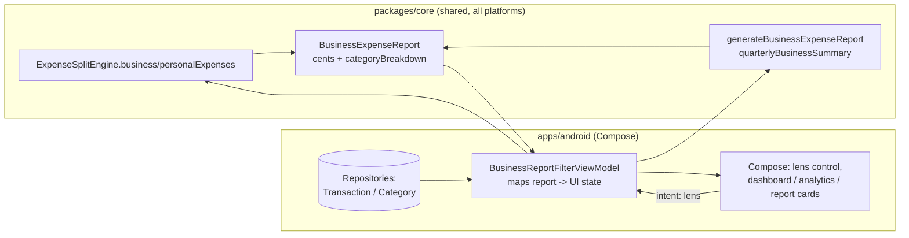
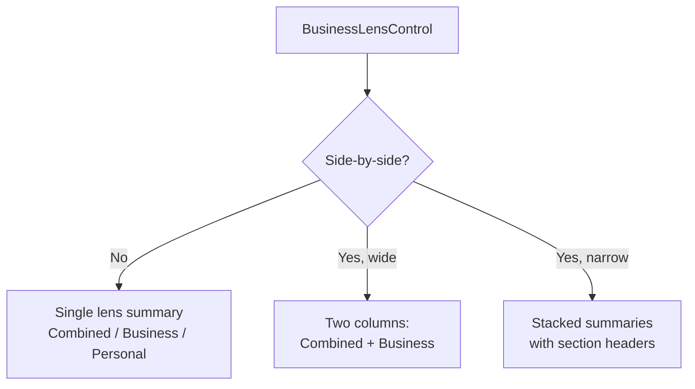
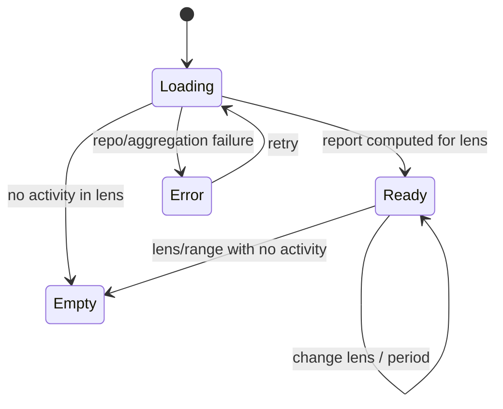

# Android Business / Personal Reporting Filters — Design

> **Status:** PROPOSED — Pending human review
> **Issue:** #2545 · **Part of** #2182
> **Platform:** Android (Jetpack Compose · Material 3)
> **Priority:** P1 · **Effort:** M (3–5 days)
> **Last Updated:** 2026-06-22

This document specifies the Android design for a **business / personal lens** that
filters the dashboard, analytics, and report builder into **Combined**,
**Business-only**, and **Personal-only** views, backed by the shared split logic.
It covers the Compose surfaces, the boundary between Compose UI and the shared
Kotlin Multiplatform (KMP) finance engine, offline/empty/error states,
accessibility, a test plan, and implementation readiness.

> **User story (#2182):** _"As a small business owner, I want to filter my
> dashboard, analytics, and report builder by business, personal, or split, and see
> a combined view and a business-only view side by side, so I can answer 'how is the
> truck doing?' separately from 'how is my household doing?'"_

This design **consumes** the classification produced by the sibling
[Business / Personal / Split Tagging UX](./android-business-personal-split-tagging.md)
(#2543) and renders aggregates the shared engine computes.

---

## Table of Contents

1. [Goals & Non-Goals](#1-goals--non-goals)
2. [Architecture Boundary (Compose ↔ KMP)](#2-architecture-boundary-compose--kmp)
3. [Affected Android Surfaces](#3-affected-android-surfaces)
4. [Shared Dependencies](#4-shared-dependencies)
5. [Filter Model & Lens Behavior](#5-filter-model--lens-behavior)
6. [Side-by-Side Combined vs. Business View](#6-side-by-side-combined-vs-business-view)
7. [UI States: Loading, Empty, Error, Offline](#7-ui-states-loading-empty-error-offline)
8. [Accessibility (TalkBack, Switch Access, Font Scaling)](#8-accessibility-talkback-switch-access-font-scaling)
9. [Test Plan](#9-test-plan)
10. [Implementation Readiness](#10-implementation-readiness)
11. [Open Questions](#11-open-questions)

---

## 1. Goals & Non-Goals

**Goals**

- Add a persistent **business/personal lens** to the dashboard, analytics, and
  report builder with three positions: **Combined**, **Business**, **Personal**.
- For **Split** transactions, attribute only the **business portion** to the
  Business lens and only the **personal portion** to the Personal lens — the engine
  computes the portions; the filter never double-counts.
- Offer a **side-by-side** Combined vs. Business comparison so the operator can read
  household and truck health together.
- Keep the chosen lens **persisted** per surface (the operator's last choice sticks).
- Work fully **offline-first** against the local encrypted store; never block on
  network.
- Be fully operable with **TalkBack**, **Switch Access**, and large font scaling.

**Non-Goals**

- No finance math in Compose. Filtering, business-portion attribution, and totals
  stay in KMP (see [§2](#2-architecture-boundary-compose--kmp)).
- No classification UI here — that is the sibling
  [Tagging UX](./android-business-personal-split-tagging.md) (#2543).
- No P&L template work — the food-truck P&L is
  [its own design](./android-foodtruck-pnl-report.md) (#2551); this issue only adds
  the business/personal **lens** to existing report surfaces.
- No CSV/PDF export changes in this issue.
- No native release/signing work — distribution is gated (see
  [§10](#10-implementation-readiness)).

---

## 2. Architecture Boundary (Compose ↔ KMP)

**The rule:** Compose renders pre-filtered, pre-aggregated state. It does **not**
filter by classification, sum business vs. personal portions, or split amounts. All
of that is owned by the shared engine.

The shared engine already exists:
[`packages/core/.../expensesplit/ExpenseSplitEngine.kt`](../../packages/core/src/commonMain/kotlin/com/finance/core/expensesplit/ExpenseSplitEngine.kt)
with models in
[`ExpenseSplitModels.kt`](../../packages/core/src/commonMain/kotlin/com/finance/core/expensesplit/ExpenseSplitModels.kt).
Relevant API:

- `ExpenseSplitEngine.businessExpenses(classified)` /
  `personalExpenses(classified)` — partition a classified list by lens. Note the
  engine treats `BUSINESS` **and** `SPLIT` as having a business side; `PERSONAL` is
  the personal side.
- `ExpenseSplitEngine.businessPortion(amountCents, expenseType, splitRatio)` /
  `personalPortion(...)` — the portion attributed to each lens for a split.
- `ExpenseSplitEngine.generateBusinessExpenseReport(classified, start, end)` →
  `BusinessExpenseReport(totalBusinessCents, totalDeductibleCents,
totalSplitBusinessPortionCents, categoryBreakdown, ...)`.
- `ExpenseSplitEngine.quarterlyBusinessSummary(classified, year)` for period
  roll-ups.

**Mapping responsibilities**

| Concern                                          | Owner                                                  |
| ------------------------------------------------ | ------------------------------------------------------ |
| Partition classified transactions by lens        | KMP `ExpenseSplitEngine.business/personalExpenses`     |
| Business/personal portion of each split          | KMP `ExpenseSplitEngine.business/personalPortion`      |
| Totals, deductible totals, category breakdown    | KMP `ExpenseSplitEngine.generateBusinessExpenseReport` |
| Quarterly business roll-ups                      | KMP `ExpenseSplitEngine.quarterlyBusinessSummary`      |
| Cents → currency string, percent display         | Android (presentation only, shared currency formatter) |
| Lens selection, persistence, side-by-side layout | Android (UI state, not math)                           |
| Reading classified transactions from local store | Android repositories (offline-first)                   |

> If a number must be **computed or filtered**, it belongs in KMP. If it must be
> **formatted, selected, or laid out**, it belongs in Compose. The Android client
> passes `ClassifiedExpense` lists from local data to the engine; it never
> re-implements partitioning or attribution.

---

## 3. Affected Android Surfaces

All paths under `apps/android/src/main/kotlin/com/finance/android/`.

**New**

- `ui/business/report/BusinessLensControl.kt` — the reusable lens selector: a
  Material 3 `SegmentedButton` (**Combined | Business | Personal**) with a
  side-by-side toggle.
- `ui/business/report/BusinessReportFilterViewModel.kt` — `koinViewModel`, collects
  classified-transaction flows, calls `ExpenseSplitEngine`, exposes a single
  `StateFlow<BusinessReportUiState>` keyed by the active lens.
- `ui/business/report/BusinessReportUiState.kt` — sealed UI state
  (`Loading`, `Empty`, `Error`, `Ready`) + display models (formatted strings + raw
  cents for semantics) for each lens.
- `ui/business/report/SideBySideComparison.kt` — a two-column (or stacked, on narrow
  widths) Combined-vs-Business comparison block.

**Modified (within `apps/android/` only)**

- Dashboard, analytics, and report-builder composables — host `BusinessLensControl`
  at the top and read the lens-scoped totals (entry point only; no math added).
- `ui/navigation/FinanceNavHost.kt` — carry the lens as a typed nav argument /
  saved state so it persists across navigation (follows the existing `Route`
  pattern).

**Reused (no edits required)**

- Existing chart/card composables — reference for Material 3 card + Canvas chart
  patterns and `semantics { heading() }` usage; charts re-render with lens-scoped
  data.
- `logging/TimberCrashReporter.kt` — structured logging (never log amounts).

---

## 4. Shared Dependencies

| Dependency                                                                                     | Location                                               | Use                                                   |
| ---------------------------------------------------------------------------------------------- | ------------------------------------------------------ | ----------------------------------------------------- |
| `ExpenseSplitEngine`, `BusinessExpenseReport`, `QuarterlyBusinessSummary`, `ClassifiedExpense` | `packages/core/.../expensesplit/ExpenseSplitEngine.kt` | Lens partitioning, attribution, period roll-ups       |
| `ExpenseType`, `SplitRatio`, `SplitAmounts`                                                    | `packages/core/.../expensesplit/ExpenseSplitModels.kt` | Classification + split portion inputs                 |
| `Cents` / money formatting                                                                     | `packages/core/.../money`, `.../multicurrency`         | Integer-cents money + display formatting              |
| Transaction / Category repositories                                                            | `apps/android/.../data/repository/`                    | Offline-first source of classified transactions       |
| Koin modules                                                                                   | `apps/android/.../di/`                                 | `viewModelOf(::BusinessReportFilterViewModel)` wiring |
| Timber                                                                                         | `apps/android/.../logging/TimberCrashReporter.kt`      | Structured logging (never `Log.*`, never log amounts) |

> **Boundary note:** `apps/android` consumes `packages/core` as a direct Kotlin
> dependency (no bridging layer). Edits in this issue stay inside `apps/android/`;
> the engine in `packages/` is consumed as-is.

---

## 5. Filter Model & Lens Behavior

The lens has three positions backed by the engine's partitioning:

| Lens         | What it shows                                                                    | Engine call                                      |
| ------------ | -------------------------------------------------------------------------------- | ------------------------------------------------ |
| **Combined** | Everything, full transaction amounts (household + truck together)                | No partition — full classified list              |
| **Business** | Business side only: `BUSINESS` full amount + the **business portion** of `SPLIT` | `businessExpenses(...)` + `businessPortion(...)` |
| **Personal** | Personal side only: `PERSONAL` full amount + the **personal portion** of `SPLIT` | `personalExpenses(...)` + `personalPortion(...)` |

Key behaviors:

- **Split attribution, never double-count:** under the Business lens a 70/30 split
  contributes only its business portion; under Personal, only its personal portion.
  The two lenses partition the same total — the engine guarantees the portions sum
  back exactly (remainder cent → personal).
- **Deductible emphasis:** the Business lens can surface `totalDeductibleCents` and
  `totalSplitBusinessPortionCents` from `BusinessExpenseReport` as secondary lines.
- **Lens persistence:** the active lens is saved per surface (dashboard / analytics /
  report builder) so reopening keeps the operator's last choice.
- **Period interaction:** the existing period/range controls remain; the lens is an
  orthogonal dimension layered on top. Quarterly roll-ups use
  `quarterlyBusinessSummary`.

**Formatting rules (presentation only):**

- Currency via the shared formatter (household default currency, integer cents).
- Empty lens (e.g. Business lens with no business activity) renders `—` totals with
  an explanatory empty state, never `0` masquerading as data.

---

## 6. Side-by-Side Combined vs. Business View

The **side-by-side** toggle answers the user's explicit request to read
"how is the truck doing?" next to "how is my household doing?".

- **Wide layout (≥ medium width / unfolded):** two columns — **Combined** (left)
  and **Business** (right) — each a compact summary card (net, top categories,
  trend). Personal can be derived as Combined − Business but is rendered as its own
  column only when the operator selects it (avoids a cramped three-column layout).
- **Narrow layout (phones):** the two summaries stack vertically with clear section
  headers; the lens control collapses to a single segmented row.
- Each side reads its **own** engine-computed totals; the UI never subtracts one card
  from another to fake a lens (that subtraction, if needed, is an engine concern).

Responsive behavior follows the breakpoints in
[`responsive-breakpoints.md`](./responsive-breakpoints.md); information grouping
follows [`information-architecture.md`](./information-architecture.md).

---

## 7. UI States: Loading, Empty, Error, Offline

`BusinessReportUiState` is a sealed interface; each surface renders exactly one
branch per lens.

- **Loading** — skeleton placeholders for summary cards/charts; TalkBack announces
  "Loading business and personal report".
- **Empty (lens)** — the active lens has no activity in range (e.g. Business lens
  before any business classification): show "No business activity for this period"
  with a CTA to classify (links conceptually to the
  [Tagging UX](./android-business-personal-split-tagging.md)); render totals as `—`.
- **Empty (all)** — no transactions in range at all: a neutral empty state shared
  with the existing dashboard.
- **Error** — repository/aggregation failure. Show a retry affordance; log via
  `Timber.e(t, "Business report filter failed")` **without** any amounts, merchant
  names, or account data.
- **Offline** — the default, not an error. Reports compute from the local
  SQLCipher-encrypted store; show a subtle "Showing local data" affordance only if a
  sync is pending, never a blocking spinner.

---

## 8. Accessibility (TalkBack, Switch Access, Font Scaling)

Mandatory — every interactive and informational Composable carries a
`contentDescription`, consistent with
[`accessibility-patterns.md`](./accessibility-patterns.md) §7 (Financial Data
Accessibility), §8 (Touch Target Sizing), and §9.3 (Android / Compose).

- **Lens control:** the `SegmentedButton` exposes `selected` semantics so TalkBack
  reads "Business, selected" / "Combined, not selected". The side-by-side toggle
  announces its on/off state.
- **Summary values:** each total is a single merged semantics node combining label +
  value + lens, e.g. _"Business net, 4,260 dollars"_ and _"Personal net, 1,180
  dollars"_. Use `Modifier.semantics(mergeDescendants = true)`; spell out "dollars"
  and "percent".
- **Headings:** lens section titles and each side-by-side column header use
  `semantics { heading() }` so TalkBack users can jump between Combined and Business.
- **Side-by-side reading order:** focus order is Combined column → Business column on
  wide layouts and top → bottom on narrow layouts, so the comparison reads logically.
- **Charts:** lens-scoped charts carry text alternatives / data-table fallbacks per
  accessibility-patterns §7.2 (never color-only); the lens name is part of the chart
  description.
- **Empty `—` totals** read "not available, no business activity this period".
- **Switch Access:** lens change, side-by-side toggle, and period change are all
  reachable by sequential scanning; no action is swipe-only.
- **Font scaling:** layout uses `sp` text and reflows to **200%**; side-by-side
  columns collapse to a stacked layout when width is constrained, with no truncation
  of money values.
- **Touch targets:** all segments/toggles/chips ≥ 48×48 dp (accessibility-patterns
  §8).
- **Color & contrast:** lens states and profit/loss emphasis are conveyed by label +
  sign, not hue alone (WCAG 1.4.1); emphasis meets ≥ 4.5:1.

---

## 9. Test Plan

**Shared engine (already covered in `packages/`; not edited here)** — referenced for
traceability: partitioning, business/personal portion attribution, report totals,
and quarterly roll-ups are unit-tested in the `expensesplit` package
(`ExpenseSplitEngineTest`). The Android work depends on, but does not re-test, that
math.

**Android unit tests** (`apps/android/src/test/...`)

- `BusinessReportFilterViewModelTest` — each lens maps to the correct engine call;
  the Business lens includes the **business portion** of splits and the Personal lens
  the **personal portion** (asserts the ViewModel does **no** arithmetic and that
  business + personal portions reconcile to Combined); empty lens yields the `—`
  state; error on repository failure; lens persists across recomputes.
- `BusinessReportFormattingTest` — cents→currency and percent display only, including
  the `—` placeholder for empty lenses.

**Compose UI tests** (`apps/android/src/androidTest/...`)

- `BusinessLensControlTest` — switching Combined/Business/Personal updates the
  summary; side-by-side toggle shows two columns on wide and stacks on narrow.
- `SideBySideComparisonTest` — Combined and Business columns render their own
  engine-computed totals; focus order is correct.
- **Accessibility assertions** — every interactive node has a non-empty content
  description; totals merge into single semantics nodes; heading semantics present;
  verified with `onNodeWithContentDescription` and the Compose a11y test APIs.

**Snapshot tests (Paparazzi)** (`apps/android/src/test/.../ui/snapshot/`)

- `BusinessReportFilterSnapshotTest` — Combined, Business, Personal, side-by-side
  (wide), stacked (narrow), empty-lens, light/dark, and large-font (1.5×/2.0×)
  variants. Mirrors the existing `DashboardSnapshotTest` approach.

**Manual QA**

- Airplane mode: all three lenses and side-by-side render from local data.
- Switch lens and confirm a known split contributes its business portion to Business
  and its personal portion to Personal (sums reconcile to Combined).
- TalkBack swipe-through reads lens control → Combined → Business in logical order.
- Largest system font: side-by-side collapses cleanly with no truncated totals.

---

## 10. Implementation Readiness

This is a **design deliverable**; the feature is implementable now up to the
distribution boundary. Per
[`docs/ops/human-gated-prerequisites.md`](../ops/human-gated-prerequisites.md) §2,
the "blocked by #1242" reference on #2545 is a **distribution** gate only.

**Buildable now (no enrollment, SME-completable):**

- Lens control, side-by-side comparison, ViewModel, Koin wiring, navigation/state
  persistence, and all tests above.
- Local verification via `./gradlew :apps:android:assembleDebug` and sideload, plus
  `:apps:android:testDebugUnitTest` / Paparazzi `verifyPaparazziDebug`.
- The shared `ExpenseSplitEngine` already exists — no `packages/` changes. (Depends on
  the #2543 classification being persisted; the filter reads whatever is stored.)

**Distribution tail (human-gated by #1242):**

- Google Play release signing, AAB upload, and release-track promotion.
- See
  [Android distribution checklist](../ops/human-gated-prerequisites.md#31-android-distribution--google-play-1242).
  Nothing in this design requires a store build to validate.

---

## 11. Open Questions

1. **Three-up layout** — should very wide / unfolded layouts offer Combined +
   Business + Personal as three columns, or keep Personal as a separate selection?
   Proposed: two-column max for legibility; revisit on large-screen telemetry.
2. **Income vs. expense lens** — the engine's report focuses on business expenses;
   should the Business lens also attribute business **income**? Proposed: yes via the
   existing transaction kind, but confirm income classification source with #2543.
3. **Default lens** — should the dashboard default to Combined or remember the last
   lens per surface? Proposed: remember per surface, defaulting to Combined on first
   run.
