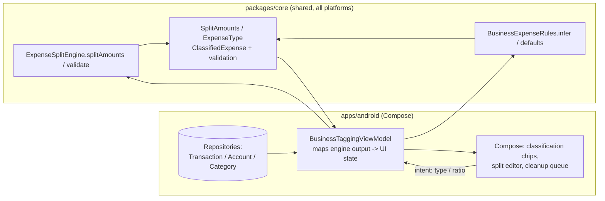
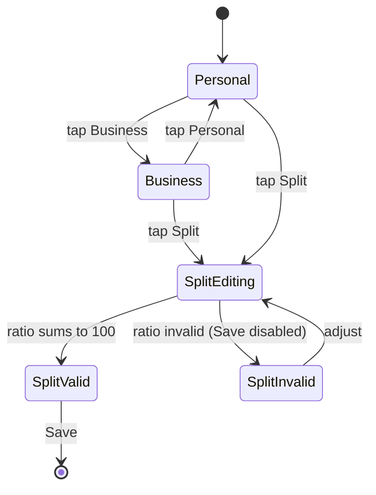
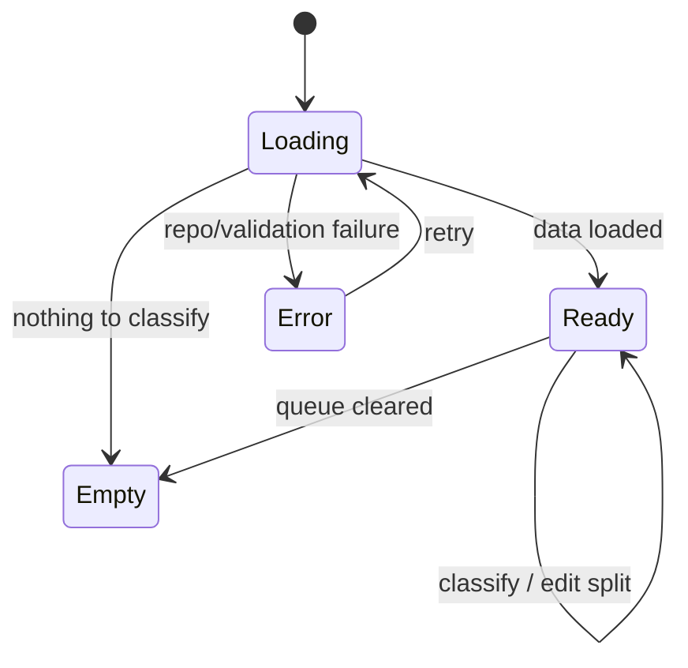

# Android Business / Personal / Split Tagging UX — Design

> **Status:** PROPOSED — Pending human review
> **Issue:** #2543 · **Part of** #2182
> **Platform:** Android (Jetpack Compose · Material 3)
> **Priority:** P1 · **Effort:** M (3–5 days)
> **Last Updated:** 2026-06-22

This document specifies the Android design for classifying transactions,
accounts, and categories as **business**, **personal**, or **split**, plus the
**ambiguous cleanup** flow for transactions that have not yet been classified.
It covers the Compose surfaces to build, the boundary between Compose UI and the
shared Kotlin Multiplatform (KMP) finance engine, offline/empty/error states,
accessibility, a test plan, and implementation readiness.

> **User story (#2182):** _"As a small business owner, I want to tag accounts,
> categories, budgets, and transactions as business, personal, or split, so I can
> use one app without losing separation."_ When the food-truck owner buys propane,
> groceries, and commissary supplies on the same card, they need **fast separation
> at entry time** and a way to **flag ambiguous transactions for later cleanup**.

---

## Table of Contents

1. [Goals & Non-Goals](#1-goals--non-goals)
2. [Architecture Boundary (Compose ↔ KMP)](#2-architecture-boundary-compose--kmp)
3. [Affected Android Surfaces](#3-affected-android-surfaces)
4. [Shared Dependencies](#4-shared-dependencies)
5. [Tagging UX Layout](#5-tagging-ux-layout)
6. [Split Editor & Validation](#6-split-editor--validation)
7. [Ambiguous Cleanup Flow](#7-ambiguous-cleanup-flow)
8. [UI States: Loading, Empty, Error, Offline](#8-ui-states-loading-empty-error-offline)
9. [Accessibility (TalkBack, Switch Access, Font Scaling)](#9-accessibility-talkback-switch-access-font-scaling)
10. [Test Plan](#10-test-plan)
11. [Implementation Readiness](#11-implementation-readiness)
12. [Open Questions](#12-open-questions)

---

## 1. Goals & Non-Goals

**Goals**

- Let an operator classify a transaction as **Business**, **Personal**, or
  **Split** in one tap from the transaction detail and quick-entry surfaces.
- Provide a **split editor** for the business/personal percentage with a live
  preview of the business and personal currency portions.
- Surface **smart defaults** (category- and merchant-inferred) so most expenses are
  pre-classified, with manual override always available.
- Provide an **ambiguous cleanup** queue listing transactions that still need
  classification, so the operator can clear the backlog quickly.
- Carry a **business/personal default** on accounts and categories so new
  transactions inherit a sensible starting classification.
- Work fully **offline-first** against the local encrypted store; never block on
  network.
- Be fully operable with **TalkBack**, **Switch Access**, and large font scaling.

**Non-Goals**

- No finance math in Compose. Split portions, rounding, deductible amounts, and
  validation all stay in KMP (see [§2](#2-architecture-boundary-compose--kmp)).
- No dashboard/report filtering here — that is the sibling design
  [Business / Personal Reporting Filters](./android-business-personal-reporting-filters.md)
  (#2545); this issue produces the classification the filters consume.
- No tax-form export in this issue (Schedule C draft entry is covered by
  [Schedule C Quick-Add Sheet](./android-schedule-c-quick-add-sheet.md)).
- No native release/signing work — distribution is gated (see
  [§11](#11-implementation-readiness)).

---

## 2. Architecture Boundary (Compose ↔ KMP)

**The rule:** Compose renders shared, pre-computed state and collects user intent.
It does **not** compute split portions, round cents, validate ratios, or decide
deductibility. All of that is owned by the shared engine.

The shared engine already exists:
[`packages/core/.../expensesplit/ExpenseSplitEngine.kt`](../../packages/core/src/commonMain/kotlin/com/finance/core/expensesplit/ExpenseSplitEngine.kt)
with models in
[`ExpenseSplitModels.kt`](../../packages/core/src/commonMain/kotlin/com/finance/core/expensesplit/ExpenseSplitModels.kt)
and inference rules in
[`BusinessExpenseRules.kt`](../../packages/core/src/commonMain/kotlin/com/finance/core/expensesplit/BusinessExpenseRules.kt).
Relevant API:

- `ExpenseType` — `BUSINESS`, `PERSONAL`, `SPLIT`.
- `SplitRatio(businessPercent, personalPercent)` — whole-number percents that must
  sum to 100.
- `ExpenseSplitEngine.splitAmounts(totalCents, expenseType, splitRatio)` →
  `SplitAmounts(totalCents, businessCents, personalCents, remainderAssignedTo)`.
  Split uses **banker's rounding** on the business portion and assigns any
  remainder cent to **personal**, so portions always sum exactly to the total.
- `ExpenseSplitEngine.validateSplitRatio(...)` and `validateClassification(...)`
  return an `ExpenseSplitValidationResult` that **keeps all errors** (no fail-fast)
  for inline display.
- `BusinessExpenseRules.inferExpenseCategory(...)` / `getBusinessExpenseDefaults(...)`
  derive a suggested category + deductible percent from payee/note/tags.

**Mapping responsibilities**

| Concern                                                | Owner                                                  |
| ------------------------------------------------------ | ------------------------------------------------------ |
| Business/personal split portions (banker's rounding)   | KMP `ExpenseSplitEngine.splitAmounts`                  |
| Remainder-cent assignment (→ personal)                 | KMP `ExpenseSplitEngine`                               |
| Ratio + classification validation (all errors)         | KMP `ExpenseSplitEngine.validate*`                     |
| Category/merchant inference & deductible defaults      | KMP `BusinessExpenseRules`                             |
| Cents → currency string, percent display               | Android (presentation only, shared currency formatter) |
| Chip selection, sheet state, undo, cleanup queue order | Android (UI state, not math)                           |
| Reading/writing classification on local store          | Android repositories (offline-first)                   |

> If a number must be **computed or validated**, it belongs in KMP. If it must be
> **formatted, selected, or styled**, it belongs in Compose. The Android client
> constructs `ExpenseSplitTransaction` / `SplitRatio` from local data and passes
> them to the engine; it never re-implements the split math.

---

## 3. Affected Android Surfaces

All paths under `apps/android/src/main/kotlin/com/finance/android/`.

**New**

- `ui/business/tagging/BusinessTaggingControls.kt` — the reusable classification
  control: a Material 3 `SegmentedButton` row (**Business | Personal | Split**)
  plus an inline split summary. Embeddable in transaction detail and quick-entry.
- `ui/business/tagging/SplitEditorSheet.kt` — a Material 3 `ModalBottomSheet` with a
  percentage `Slider` + stepper, live business/personal currency preview, and
  inline validation messages.
- `ui/business/tagging/AmbiguousCleanupScreen.kt` — `Scaffold` + `LazyColumn` queue
  of unclassified transactions with one-tap classify and swipe affordances.
- `ui/business/tagging/BusinessTaggingViewModel.kt` — `koinViewModel`, collects
  repository flows, calls `ExpenseSplitEngine` / `BusinessExpenseRules`, exposes a
  single `StateFlow<BusinessTaggingUiState>`.
- `ui/business/tagging/BusinessTaggingUiState.kt` — sealed UI state
  (`Loading`, `Empty`, `Error`, `Ready`) + display models (already-formatted
  strings + raw cents for semantics).

**Modified (within `apps/android/` only)**

- `ui/navigation/FinanceNavHost.kt` — add a `Route.AmbiguousCleanup` destination and
  wire entry from the existing transaction list overflow / insights. (Follows the
  existing `Route` sealed-class pattern.)
- Transaction detail and quick-entry composables — host `BusinessTaggingControls`
  (entry point only; no math added).

**Reused (no edits required)**

- Account/Category settings composables — reference for surfacing a
  business/personal **default** selector (the default seeds new transactions).
- `logging/TimberCrashReporter.kt` — structured logging (never log amounts).

---

## 4. Shared Dependencies

| Dependency                                                                               | Location                                                 | Use                                                   |
| ---------------------------------------------------------------------------------------- | -------------------------------------------------------- | ----------------------------------------------------- |
| `ExpenseSplitEngine`, `SplitAmounts`, `ExpenseType`, `SplitRatio`, `ClassifiedExpense`   | `packages/core/.../expensesplit/ExpenseSplitEngine.kt`   | Split portions, classification, validation            |
| `BusinessExpenseRules`, `ExpenseCategory`, `ExpenseCategoryOption`, `BusinessExpenseTag` | `packages/core/.../expensesplit/BusinessExpenseRules.kt` | Category inference + deductible defaults              |
| `Cents` / money formatting                                                               | `packages/core/.../money`, `.../multicurrency`           | Integer-cents money + display formatting              |
| Transaction / Account / Category repositories                                            | `apps/android/.../data/repository/`                      | Offline-first source + persistence of classification  |
| Koin modules                                                                             | `apps/android/.../di/`                                   | `viewModelOf(::BusinessTaggingViewModel)` wiring      |
| Timber                                                                                   | `apps/android/.../logging/TimberCrashReporter.kt`        | Structured logging (never `Log.*`, never log amounts) |

> **Boundary note:** `apps/android` consumes `packages/core` as a direct Kotlin
> dependency (no bridging layer). Edits in this issue stay inside `apps/android/`;
> the engine and rules in `packages/` are consumed as-is.

---

## 5. Tagging UX Layout

`BusinessTaggingControls` is a compact, embeddable block:

1. **Classification segmented control** — Material 3 `SegmentedButton`:
   **Business | Personal | Split**. Maps directly to
   `ExpenseType.BUSINESS / PERSONAL / SPLIT`. The initial selection comes from the
   account/category default or `BusinessExpenseRules` inference, never guessed in UI.
2. **Inline split summary** (visible only when `SPLIT` is selected) — reads the
   `SplitAmounts` returned by the engine, e.g. _"Business $42.00 · Personal $18.00
   (70/30)"_. Tapping opens the [Split Editor](#6-split-editor--validation).
3. **Deductible hint** (optional) — when the engine flags a likely deductible
   business category, show a quiet assist chip ("Likely deductible: Meals 50%")
   sourced from `BusinessExpenseRules`; this is informational, not a calculation.

**Formatting rules (presentation only):**

- Currency via the shared formatter (household default currency, integer cents).
- Percentages render the whole-number `businessPercent` / `personalPercent`.
- A split that has not been edited shows the inherited default ratio; the engine
  is still the source of the portion math.

---

## 6. Split Editor & Validation

`SplitEditorSheet` (Material 3 `ModalBottomSheet`):

- **Percentage control** — a `Slider` (0–100, business side) with a paired numeric
  stepper. The personal percent is always `100 − business`, mirroring the engine's
  invariant; the UI never lets the two drift out of sum.
- **Live preview** — on every change the ViewModel calls
  `ExpenseSplitEngine.splitAmounts(...)` and renders `businessCents` /
  `personalCents`. Because the engine assigns the remainder cent to personal, the
  preview always sums to the transaction total — the UI shows exactly what will be
  saved.
- **Inline validation** — `validateSplitRatio` / `validateClassification` return a
  list of human-readable errors (e.g. _"Split ratio must sum to 100"_,
  _"Personal expenses cannot be deductible"_). The sheet renders all of them and
  disables **Save** until `isValid`.
- **Quick presets** — chips for common ratios (50/50, 70/30, 80/20, 100/0). Each
  preset just sets a `SplitRatio`; the engine recomputes portions.

---

## 7. Ambiguous Cleanup Flow

The **ambiguous cleanup** queue (`AmbiguousCleanupScreen`) lists transactions whose
classification is still unresolved — for example a card used for both groceries at
home and commissary supplies. "Ambiguous" is defined by repository state (no stored
`ExpenseType`, or an explicit `needs-review` flag), **not** by UI heuristics; the
engine's inference only supplies a _suggested_ classification.

Per row:

- Merchant, amount, date, and the **suggested** classification from
  `BusinessExpenseRules.getBusinessExpenseDefaults(...)` shown as a dismissible
  assist chip.
- **One-tap accept** applies the suggestion; **Business / Personal / Split** chips
  override it; **Split** opens the editor.
- An **Undo** snackbar follows each classification so a mis-tap is reversible
  without leaving the queue.

Clearing the queue is the core "later cleanup" job; the count is surfaced as a
badge on the entry point so the operator knows how much business cleanup remains.

---

## 8. UI States: Loading, Empty, Error, Offline

`BusinessTaggingUiState` is a sealed interface; each surface renders exactly one
branch.

- **Loading** — skeleton placeholders for the controls / queue rows; TalkBack
  announces "Loading business and personal classification".
- **Empty (cleanup queue)** — no unclassified transactions: a positive empty state
  ("All caught up — every transaction is classified") rather than an error.
- **Empty (no business activity)** — account/category has no transactions yet: show
  the controls with the inherited default and a hint to classify on first entry.
- **Error** — repository/validation failure. Show a retry affordance; log via
  `Timber.e(t, "Business classification failed")` **without** any amounts, merchant
  names, or account data.
- **Offline** — the default, not an error. Classification reads and writes the local
  SQLCipher-encrypted store; show a subtle "Saved locally, will sync" affordance only
  if a sync is pending, never a blocking spinner.

---

## 9. Accessibility (TalkBack, Switch Access, Font Scaling)

Mandatory — every interactive and informational Composable carries a
`contentDescription`, consistent with
[`accessibility-patterns.md`](./accessibility-patterns.md) §7 (Financial Data
Accessibility), §8 (Touch Target Sizing), and §9.3 (Android / Compose).

- **Classification control:** the `SegmentedButton` exposes `selected` semantics so
  TalkBack reads "Business, selected" / "Split, not selected". Each segment is a
  labelled button, not an icon-only target.
- **Split summary & preview:** the inline summary is a single merged semantics node
  combining label + portions, e.g. _"Split: business 42 dollars, personal 18
  dollars, 70 to 30"_. Use `Modifier.semantics(mergeDescendants = true)`. Spell out
  "dollars" and "percent" — never read raw glyphs.
- **Split editor slider:** the `Slider` sets `stateDescription` to the current
  percentage ("Business 70 percent") and supports Switch Access increment/decrement;
  the numeric stepper provides an alternative to dragging for motor accessibility.
- **Validation errors:** announced via a `LiveRegion` (assertive) so they are read
  immediately when Save is blocked; each error is also visually adjacent to the
  control.
- **Cleanup rows:** each row merges into one node ("Commissary Supply, 60 dollars,
  June 18, suggested Business"); swipe/Undo actions are exposed as custom
  accessibility actions, not gesture-only.
- **Switch Access:** all actions (classify, open editor, accept suggestion, undo)
  are reachable by sequential scanning; no action depends on a swipe gesture alone.
- **Font scaling:** layout uses `sp` text and reflows to **200%** with no truncation;
  the split summary stacks label/portions vertically when width is constrained.
- **Touch targets:** all chips/segments/stepper buttons ≥ 48×48 dp
  (accessibility-patterns §8).
- **Color & contrast:** business/personal/split states are distinguished by \*\*label
  - icon\*\*, not hue alone (WCAG 1.4.1); emphasis meets ≥ 4.5:1.

---

## 10. Test Plan

**Shared engine (already covered in `packages/`; not edited here)** — referenced for
traceability: split portions, banker's rounding, remainder-to-personal, and ratio/
classification validation are unit-tested in the `expensesplit` package
(`ExpenseSplitEngineTest`). The Android work depends on, but does not re-test, that
math.

**Android unit tests** (`apps/android/src/test/...`)

- `BusinessTaggingViewModelTest` — selecting Business/Personal/Split maps straight to
  `ExpenseType`; the split preview reflects the engine's `SplitAmounts` (asserts the
  ViewModel does **no** arithmetic, including remainder-cent placement); invalid
  ratios surface the engine's error list and keep Save disabled; suggestion accept
  applies `BusinessExpenseRules` defaults.
- `BusinessTaggingFormattingTest` — cents→currency and percent display only (e.g.
  `4200 → "$42.00"`, `70 → "70%"`), including the inherited-default rendering.

**Compose UI tests** (`apps/android/src/androidTest/...`)

- `BusinessTaggingControlsTest` — segmented control switches type; split summary
  appears only for `SPLIT`; opening the editor and saving persists the ratio.
- `SplitEditorSheetTest` — slider/stepper stay in sum; Save disabled on invalid;
  presets set the expected ratio.
- `AmbiguousCleanupScreenTest` — queue lists unclassified rows; one-tap accept and
  override update state; Undo restores prior state; empty state renders.
- **Accessibility assertions** — every interactive node has a non-empty content
  description; rows/summaries merge into single semantics nodes; slider exposes a
  state description; verified with `onNodeWithContentDescription` and the Compose
  a11y test APIs.

**Snapshot tests (Paparazzi)** (`apps/android/src/test/.../ui/snapshot/`)

- `BusinessTaggingSnapshotTest` — controls (Business / Personal / Split), split
  editor (valid + invalid), cleanup queue (populated + empty), light/dark, and
  large-font (1.5×/2.0×) variants. Mirrors the existing snapshot-test approach.

**Manual QA**

- Airplane mode: classify and edit splits; values persist and sync flag appears.
- TalkBack swipe-through reads control → summary → editor in logical order.
- Switch Access: classify a transaction and edit a split using scanning only.
- Largest system font: no truncated money values in summary or queue rows.

---

## 11. Implementation Readiness

This is a **design deliverable**; the feature is implementable now up to the
distribution boundary. Per
[`docs/ops/human-gated-prerequisites.md`](../ops/human-gated-prerequisites.md) §2,
the "blocked by #1242" reference on #2543 is a **distribution** gate only.

**Buildable now (no enrollment, SME-completable):**

- Compose controls, split editor, cleanup screen, ViewModel, Koin wiring,
  navigation, and all tests above.
- Local verification via `./gradlew :apps:android:assembleDebug` and sideload, plus
  `:apps:android:testDebugUnitTest` / Paparazzi `verifyPaparazziDebug`.
- The shared `ExpenseSplitEngine` and `BusinessExpenseRules` already exist — no
  `packages/` changes.

**Distribution tail (human-gated by #1242):**

- Google Play release signing, AAB upload, and release-track promotion.
- See
  [Android distribution checklist](../ops/human-gated-prerequisites.md#31-android-distribution--google-play-1242).
  Nothing in this design requires a store build to validate.

---

## 12. Open Questions

1. **Default inheritance order** — when both account and category carry a
   business/personal default, which wins? Proposed: category default overrides
   account default; merchant inference only fills when neither is set.
2. **Ambiguity definition** — should "ambiguous" include transactions whose stored
   classification disagrees with current inference (a re-review prompt), or only
   never-classified ones? Proposed: start with never-classified; add a soft
   "re-review" signal later.
3. **Bulk classify** — is multi-select bulk classification in scope for the cleanup
   queue, or a fast-follow? Proposed: ship single-row first, add bulk once the queue
   pattern is validated.
