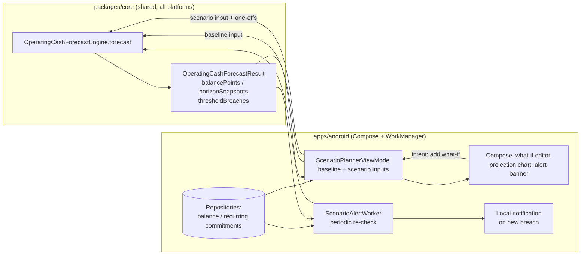
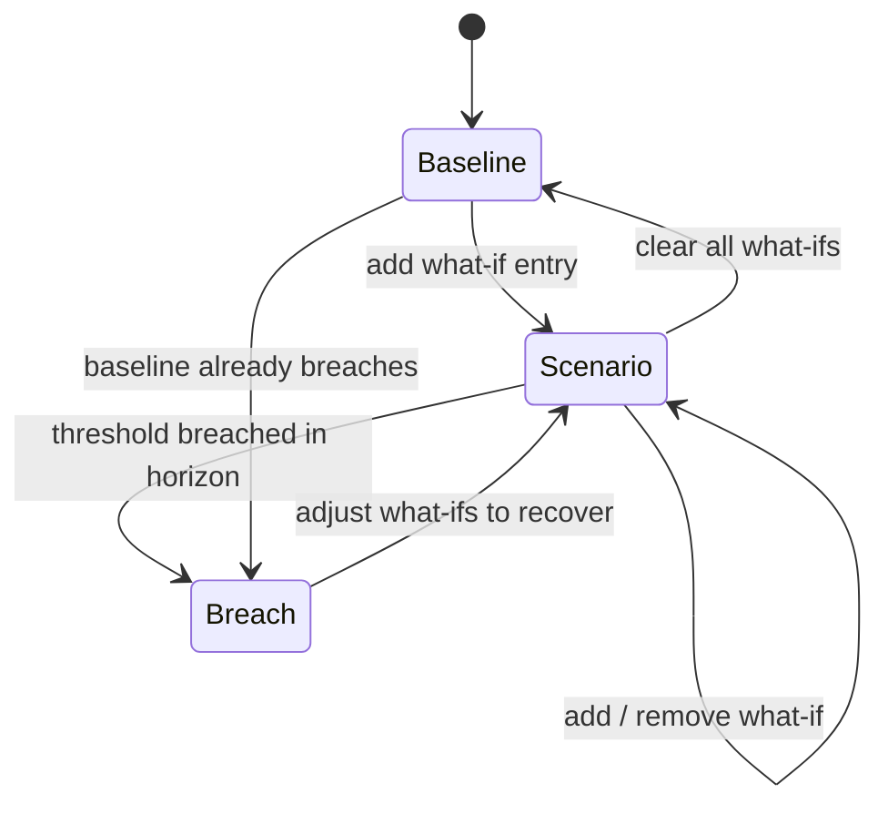
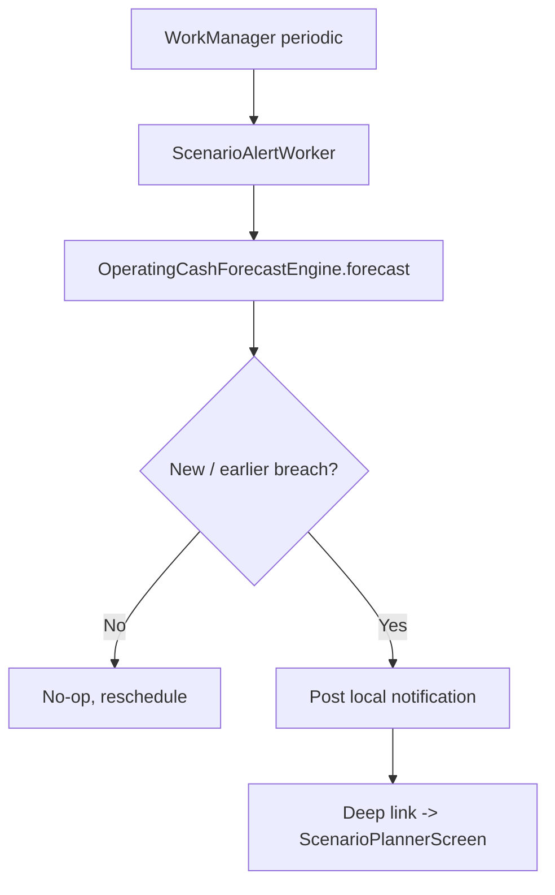
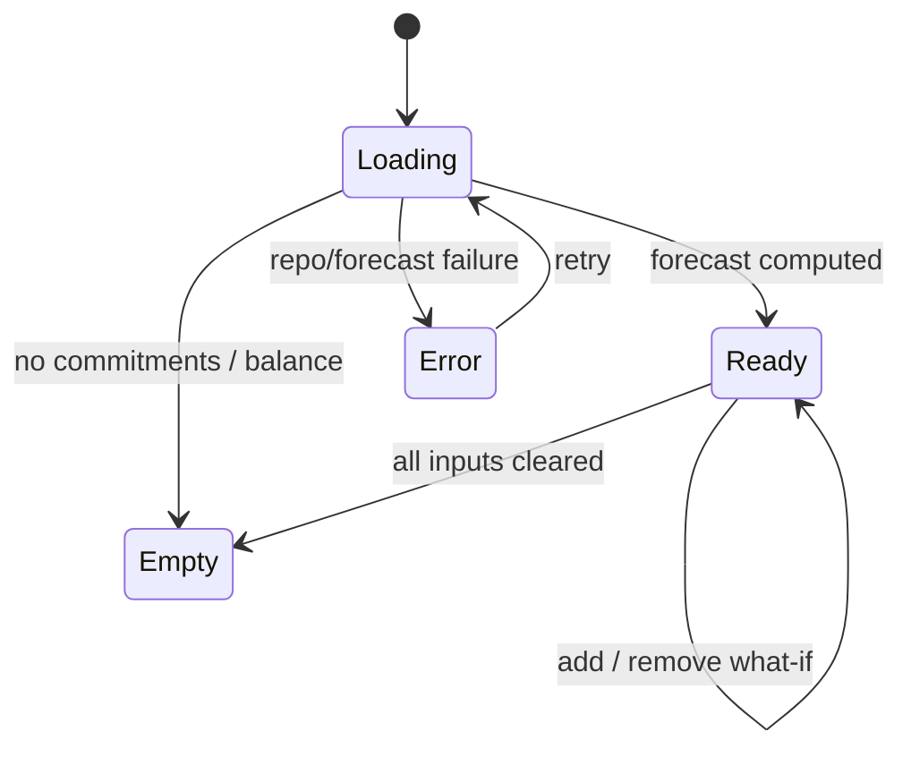

# Android Business Scenario Planner & Alerts — Design

> **Status:** PROPOSED — Pending human review
> **Issue:** #2557 · **Part of** #2185
> **Platform:** Android (Jetpack Compose · Material 3)
> **Priority:** P1 · **Effort:** L (1–2 weeks)
> **Last Updated:** 2026-06-22

This document specifies the Android design for a **what-if scenario planner** that
models one-off expenses/revenue against recurring obligations, plus **local
low-balance and payroll-risk alerts**. It answers the operator's recurring
question — _"If I buy $900 of ingredients today, am I still safe for payroll
Friday?"_ — and warns before a projected balance goes negative. It covers the
Compose surfaces, the boundary between Compose UI and the shared Kotlin
Multiplatform (KMP) finance engine, offline/empty/error states, accessibility, a
test plan, and implementation readiness.

> **User story (#2185):** _"As a small business owner, I want to model payroll, tax
> estimates, commissary rent, and one-off expenses against expected inflows, and be
> warned when projected balances go negative before a future date, so I avoid timing
> mistakes instead of explaining them after the fact."_

This design **extends** the read-only
[Operating Cash Calendar](./android-operating-cash-calendar.md) (#2555, also part of
#2185) with **interactive what-if scenarios** and **local alerts**; both render the
same shared forecast engine's output.

---

## Table of Contents

1. [Goals & Non-Goals](#1-goals--non-goals)
2. [Architecture Boundary (Compose ↔ KMP)](#2-architecture-boundary-compose--kmp)
3. [Affected Android Surfaces](#3-affected-android-surfaces)
4. [Shared Dependencies](#4-shared-dependencies)
5. [Scenario Planner UX](#5-scenario-planner-ux)
6. [Local Alerts: Low-Balance & Payroll-Risk](#6-local-alerts-low-balance--payroll-risk)
7. [UI States: Loading, Empty, Error, Offline](#7-ui-states-loading-empty-error-offline)
8. [Accessibility (TalkBack, Switch Access, Font Scaling)](#8-accessibility-talkback-switch-access-font-scaling)
9. [Test Plan](#9-test-plan)
10. [Implementation Readiness](#10-implementation-readiness)
11. [Open Questions](#11-open-questions)

---

## 1. Goals & Non-Goals

**Goals**

- Let an operator add **one-off what-if entries** (an expense like "$900 ingredients
  today" or revenue like "$2k catering deposit Friday") and instantly see the
  re-projected balance and whether any **threshold is breached**.
- Compare a **baseline** forecast (recurring commitments only) against a **scenario**
  forecast (baseline + what-ifs) so the operator sees the delta.
- Detect and surface **low-balance** and **payroll-risk** alerts: the first date a
  projected balance falls below zero or a buffer, and specifically whether an
  upcoming **payroll** commitment is covered.
- Evaluate alerts **locally** and re-check them in the background with **WorkManager**,
  posting an on-device notification when a breach is newly detected.
- Label all forward-looking numbers as **estimates / projections**, never as
  guaranteed balances.
- Work fully **offline-first**; the forecast is deterministic and local.
- Be fully operable with **TalkBack**, **Switch Access**, and large font scaling.

**Non-Goals**

- No forecast math in Compose — expansion of recurring commitments, day-by-day
  balances, confidence bands, and breach detection live in the shared engine
  ([§2](#2-architecture-boundary-compose--kmp)).
- No remote push (FCM/Supabase) delivery in this issue — alerts are **local**;
  server push is distribution-adjacent and out of scope here.
- No bank-connection / live-balance ingestion — starting balance and commitments
  come from existing local data and user entries.
- No `AlarmManager` / `JobScheduler` — background re-checks use **WorkManager** only.
- No native release/signing work — distribution is gated (see
  [§10](#10-implementation-readiness)).

---

## 2. Architecture Boundary (Compose ↔ KMP)

**The rule:** Compose collects what-if intent and renders a pre-computed forecast. It
never expands recurring schedules, sums balances, computes confidence bands, or
decides when a threshold is breached. The shared engine owns all of it.

The shared engine already exists:
[`packages/core/.../forecast/OperatingCashForecast.kt`](../../packages/core/src/commonMain/kotlin/com/finance/core/forecast/OperatingCashForecast.kt).
`OperatingCashForecastEngine.forecast(input)` consumes an
`OperatingCashForecastInput` and returns an `OperatingCashForecastResult`. Relevant
API:

- `OneOffForecastEntry(id, description, amount, direction, kind, date)` — the what-if
  input; `kind` defaults to `ForecastCashFlowKind.SCENARIO`.
- `RecurringForecastCommitment(...)` — payroll/tax/bill commitments with cadence;
  `ForecastCashFlowKind.PAYROLL` marks payroll for risk evaluation.
- `ForecastBalanceThreshold` (e.g. `ForecastBalanceThreshold.ZERO`) — the floor used
  to detect a breach; the engine returns the **first** breach date per threshold.
- `OperatingCashForecastResult` exposes `balancePoints` (per-day), `horizonSnapshots`
  (7/30/90-day with `lowBalance`/`highBalance` confidence bands), `occurrences`, and
  `thresholdBreaches` (`ForecastThresholdBreach(thresholdId, date, projectedBalance)`).

The scenario is just **two engine calls**: a baseline `forecast(...)` and a scenario
`forecast(...)` whose input adds the operator's `oneOffEntries`. The UI diffs the two
results for display; it does not recompute balances.

**Mapping responsibilities**

| Concern                                                     | Owner                                                   |
| ----------------------------------------------------------- | ------------------------------------------------------- |
| Expanding recurring commitments to dated occurrences        | KMP `OperatingCashForecastEngine`                       |
| Day-by-day balance projection + horizon roll-ups            | KMP `OperatingCashForecastEngine`                       |
| Confidence bands (low/high) and z-score math                | KMP `OperatingCashForecastEngine`                       |
| First threshold breach detection (low-balance / payroll)    | KMP `OperatingCashForecastEngine` (`thresholdBreaches`) |
| Building baseline vs. scenario inputs from local data       | Android ViewModel (assembles inputs, no math)           |
| Cents → currency string, date formatting, "estimate" labels | Android (presentation only, shared currency formatter)  |
| Scheduling background re-checks                             | Android **WorkManager** (`ScenarioAlertWorker`)         |
| Posting the local notification                              | Android `NotificationManager` (on-device only)          |

> If a number must be **computed or projected**, it belongs in KMP. If it must be
> **formatted, scheduled, or rendered**, it belongs in Compose / platform services.
> Every projected value is labeled an **estimate** in the UI.

---

## 3. Affected Android Surfaces

All paths under `apps/android/src/main/kotlin/com/finance/android/`.

**New**

- `ui/business/scenario/ScenarioPlannerScreen.kt` — `Scaffold` + `LazyColumn`:
  what-if editor, baseline-vs-scenario projection, horizon outlook, and the alert
  banner.
- `ui/business/scenario/WhatIfEntrySheet.kt` — Material 3 `ModalBottomSheet` to add a
  one-off entry (amount, inflow/outflow, date, optional kind), mapped to
  `OneOffForecastEntry`.
- `ui/business/scenario/ScenarioPlannerViewModel.kt` — `koinViewModel`, builds the
  baseline and scenario `OperatingCashForecastInput`, calls the engine twice, and
  exposes a single `StateFlow<ScenarioPlannerUiState>`.
- `ui/business/scenario/ScenarioPlannerUiState.kt` — sealed UI state
  (`Loading`, `Empty`, `Error`, `Ready`) + display models (formatted strings + raw
  cents/dates for semantics), including a `payrollSafe: Boolean` flag derived from
  the engine's breaches vs. payroll occurrences.
- `sync/work/ScenarioAlertWorker.kt` — a `CoroutineWorker` (WorkManager) that
  re-runs the forecast on a periodic cadence and posts a local notification when a
  **new** breach is detected.
- `notifications/ScenarioAlertNotifier.kt` — wraps `NotificationManager` channel
  creation + posting (on-device only; no FCM).

**Modified (within `apps/android/` only)**

- `ui/navigation/FinanceNavHost.kt` — add a `Route.ScenarioPlanner` destination and
  wire entry from the operating cash calendar and insights (follows the existing
  `Route` sealed-class pattern; deep link from the alert notification).
- Koin DI module — `viewModelOf(::ScenarioPlannerViewModel)` and worker/notifier
  wiring (mirrors the existing `SyncModule` / `SyncWorker` registration pattern).

**Reused (no edits required)**

- [Operating Cash Calendar](./android-operating-cash-calendar.md) composables —
  reference for rendering `balancePoints` / `horizonSnapshots` and risk indicators.
- `sync/SyncWorker.kt` — reference for the WorkManager registration pattern.
- `logging/TimberCrashReporter.kt` — structured logging (never log amounts).

---

## 4. Shared Dependencies

| Dependency                                                                                                  | Location                                              | Use                                                        |
| ----------------------------------------------------------------------------------------------------------- | ----------------------------------------------------- | ---------------------------------------------------------- |
| `OperatingCashForecastEngine`, `OperatingCashForecastInput`, `OperatingCashForecastResult`                  | `packages/core/.../forecast/OperatingCashForecast.kt` | Baseline + scenario projection, breaches, confidence bands |
| `OneOffForecastEntry`, `RecurringForecastCommitment`, `ForecastBalanceThreshold`, `ForecastThresholdBreach` | `packages/core/.../forecast/OperatingCashForecast.kt` | What-if entries, commitments, thresholds, breaches         |
| `ForecastCashFlowKind` (`PAYROLL`, `TAX`, `BILL`, `SCENARIO`), `ForecastConfidence`                         | `packages/core/.../forecast/OperatingCashForecast.kt` | Classifying payroll risk + confidence presets              |
| `Cents` / money formatting                                                                                  | `packages/core/.../money`, `.../multicurrency`        | Integer-cents money + display formatting                   |
| Balance / recurring-commitment repositories                                                                 | `apps/android/.../data/repository/`                   | Offline-first source for starting balance + commitments    |
| WorkManager                                                                                                 | `apps/android/.../sync/` (pattern)                    | Background periodic alert re-check                         |
| Koin modules                                                                                                | `apps/android/.../di/`                                | `viewModelOf(::ScenarioPlannerViewModel)` + worker wiring  |
| Timber                                                                                                      | `apps/android/.../logging/TimberCrashReporter.kt`     | Structured logging (never `Log.*`, never log amounts)      |

> **Boundary note:** `apps/android` consumes `packages/core` as a direct Kotlin
> dependency (no bridging layer). Edits in this issue stay inside `apps/android/`;
> the forecast engine in `packages/` is consumed as-is.

---

## 5. Scenario Planner UX

`ScenarioPlannerScreen`, top to bottom:

1. **Top app bar** — title "Scenario planner", back navigation, overflow (horizon
   range, confidence preset). Confidence maps to `ForecastConfidence` LOW/MEDIUM/HIGH.
2. **Headline answer card** — the operator's core question, phrased plainly:
   _"Payroll Friday: **Safe** (estimated $1,240 cushion)"_ or _"**At risk** — short
   by an estimated $310 on Jun 27"_. The verdict is derived from the engine's
   `thresholdBreaches` and the payroll `occurrences`; the cushion is straight from a
   `balancePoint` / `horizonSnapshot`. Always labeled **estimate**.
3. **What-if list** — the operator's added `OneOffForecastEntry` items, each with
   amount, direction, and date; swipe-to-remove and an **Add what-if** button opening
   `WhatIfEntrySheet`.
4. **Baseline vs. scenario projection** — a line/area chart of `balancePoints` for
   both the baseline and scenario results, with the **first breach** marked. The
   delta ("$900 today moves your Friday low to …") is computed by diffing the two
   engine results, not by the UI summing anything.
5. **Horizon outlook** — 7/30/90-day `horizonSnapshots` with `expectedBalance` and
   the low/high confidence band, each labeled as an estimated range.

**Add-what-if flow** (`WhatIfEntrySheet`):

- Amount (integer cents via the shared money input), **Inflow/Outflow** toggle, date
  picker, and an optional kind (defaults to `SCENARIO`). On confirm, the ViewModel
  appends an `OneOffForecastEntry` and re-runs the scenario `forecast(...)`.

**Formatting rules (presentation only):**

- Currency via the shared formatter (household default currency, integer cents).
- Every projected figure carries an **"estimate"** / **"projected"** qualifier in the
  visible label and the TalkBack description.
- Breach dates render in the user's locale date format; "no breach in horizon" renders
  as an explicit positive state, never a blank.

---

## 6. Local Alerts: Low-Balance & Payroll-Risk

Alerts are **derived from the engine**, evaluated **locally**, and re-checked in the
background — no server, no remote push in this issue.

- **Low-balance alert:** the engine's first `ForecastThresholdBreach` against
  `ForecastBalanceThreshold.ZERO` (or an operator-set buffer) — "Projected to go
  negative on Jun 27 (estimated −$310)".
- **Payroll-risk alert:** the planner adds a payroll-specific check — is the balance
  on/just-before the next `ForecastCashFlowKind.PAYROLL` occurrence ≥ the payroll
  amount? This reuses `balancePoints` + `occurrences`; the threshold can be modeled as
  a payroll-sized `ForecastBalanceThreshold` so detection stays in the engine.
- **Background re-check (`ScenarioAlertWorker`):** a periodic WorkManager job
  re-builds the baseline input from local data, runs `forecast(...)`, and compares the
  earliest breach date against the last notified state. On a **new or earlier** breach
  it posts a local notification deep-linking into `ScenarioPlannerScreen`. The worker
  honors battery/Doze constraints via WorkManager `Constraints`; it **never** uses
  `AlarmManager`/`JobScheduler`.
- **De-duplication:** the worker stores the last-notified breach key (threshold id +
  date) so the operator is not re-notified for an unchanged risk.
- **No sensitive logging:** the worker and notifier log only outcomes
  (`Timber.i("scenario alert posted")`) — never amounts, balances, or breach values.

> The notification copy states the **estimated** breach date and a single clear
> action ("Review scenario"); it deliberately omits exact amounts from the
> notification surface for privacy on a lock screen.

---

## 7. UI States: Loading, Empty, Error, Offline

`ScenarioPlannerUiState` is a sealed interface; the screen renders exactly one branch.

- **Loading** — skeleton placeholders for the headline card and chart; TalkBack
  announces "Loading scenario planner".
- **Empty** — no recurring commitments and no balance to project from: an onboarding
  empty state ("Add payroll, taxes, or bills to forecast your cash") with a CTA;
  what-ifs are disabled until there is a baseline.
- **Baseline-only** — commitments exist but the operator has added no what-ifs: show
  the baseline projection and alerts; the scenario equals the baseline.
- **Error** — repository/forecast failure. Show a retry affordance; log via
  `Timber.e(t, "Scenario forecast failed")` **without** any amounts, balances, or
  account data.
- **Offline** — the default, not an error. The forecast is deterministic and computes
  from the local SQLCipher-encrypted store; no spinner, no network dependency. The
  background worker also runs fully offline.

---

## 8. Accessibility (TalkBack, Switch Access, Font Scaling)

Mandatory — every interactive and informational Composable carries a
`contentDescription`, consistent with
[`accessibility-patterns.md`](./accessibility-patterns.md) §7 (Financial Data
Accessibility), §8 (Touch Target Sizing), and §9.3 (Android / Compose).

- **Headline verdict:** a single merged semantics node spelling out the estimate, e.g.
  _"Payroll Friday, estimated safe, cushion 1,240 dollars"_ or _"At risk, estimated
  short by 310 dollars on June 27"_. Use `Modifier.semantics(mergeDescendants = true)`;
  spell out "dollars" and always include "estimated".
- **Headings:** the headline, projection, horizon outlook, and what-if list titles use
  `semantics { heading() }` so TalkBack users can jump by section.
- **Projection chart:** carries a text-alternative / data-table fallback per
  accessibility-patterns §7.2 — describing the baseline line, the scenario line, and
  the breach point in words (never color-only). Breach is conveyed by label + marker,
  not hue alone (WCAG 1.4.1).
- **What-if entries:** each row merges into one node ("Ingredients, outflow 900
  dollars, June 22"); remove is exposed as a custom accessibility action, not
  swipe-only.
- **Add-what-if sheet:** amount/date/direction controls are labelled fields with error
  association; the Inflow/Outflow toggle announces its state.
- **Alert notification:** uses a clear, non-truncated title + body and a single
  action; the channel name is descriptive ("Cash-flow alerts").
- **Switch Access:** add/remove what-if, change horizon, open the alert, and dismiss
  are all reachable by sequential scanning; no swipe-only actions.
- **Font scaling:** layout uses `sp` text and reflows to **200%**; the headline card and
  horizon rows stack vertically with no truncation of money values.
- **Touch targets:** all controls ≥ 48×48 dp (accessibility-patterns §8).

---

## 9. Test Plan

**Shared engine (already covered in `packages/`; not edited here)** — referenced for
traceability: recurring expansion, day-by-day balances, confidence bands, and
threshold-breach detection are unit-tested in the `forecast` package
(`OperatingCashForecastEngineTest`). The Android work depends on, but does not
re-test, that math.

**Android unit tests** (`apps/android/src/test/...`)

- `ScenarioPlannerViewModelTest` — adding a what-if appends an `OneOffForecastEntry`
  and the scenario result differs from baseline exactly by the engine's output
  (asserts the ViewModel does **no** arithmetic); the `payrollSafe` verdict is derived
  from the engine's breaches vs. payroll occurrences; empty/baseline-only/error states
  map correctly.
- `ScenarioFormattingTest` — cents→currency, date formatting, and the mandatory
  "estimate"/"projected" qualifier on every projected value.
- `ScenarioAlertWorkerTest` — given a fixture forecast with a breach, the worker
  decides to notify; given an unchanged breach key, it de-duplicates (no notify); it
  logs no amounts.

**Compose UI tests** (`apps/android/src/androidTest/...`)

- `ScenarioPlannerScreenTest` — add/remove what-if updates the projection and headline;
  a breach marker appears when the scenario crosses zero; baseline-only and empty
  states render their CTAs.
- `WhatIfEntrySheetTest` — amount/date/direction inputs build the expected entry;
  invalid input blocks confirm.
- **Accessibility assertions** — every interactive node has a non-empty content
  description; the headline and rows merge into single semantics nodes; chart text
  alternative present; heading semantics present; verified with
  `onNodeWithContentDescription` and the Compose a11y test APIs.

**Snapshot tests (Paparazzi)** (`apps/android/src/test/.../ui/snapshot/`)

- `ScenarioPlannerSnapshotTest` — Ready (payroll safe), Ready (at risk / breach),
  baseline-only, Empty, light/dark, and large-font (1.5×/2.0×) variants. Mirrors the
  existing snapshot-test approach.

**Manual QA**

- Airplane mode: add a what-if and confirm the projection and alert recompute from
  local data; the background worker runs offline.
- TalkBack swipe-through reads headline verdict → what-ifs → projection in logical
  order, always announcing "estimated".
- Switch Access: add and remove a what-if and open the alert using scanning only.
- Largest system font: headline and horizon rows reflow with no truncated money values.

---

## 10. Implementation Readiness

This is a **design deliverable**; the feature is implementable now up to the
distribution boundary. Per
[`docs/ops/human-gated-prerequisites.md`](../ops/human-gated-prerequisites.md) §2,
the "blocked by #1242" reference on #2557 is a **distribution** gate only. Note the
**local** alert path needs no server enrollment; only remote push would be gated, and
remote push is explicitly out of scope here.

**Buildable now (no enrollment, SME-completable):**

- Scenario screen, what-if sheet, ViewModel, the WorkManager `ScenarioAlertWorker`,
  the local notifier, Koin wiring, navigation, and all tests above.
- Local verification via `./gradlew :apps:android:assembleDebug` and sideload, plus
  `:apps:android:testDebugUnitTest` / Paparazzi `verifyPaparazziDebug`. Local
  notifications post on a sideloaded debug build with no Play services.
- The shared `OperatingCashForecastEngine` already exists — no `packages/` changes.

**Distribution tail (human-gated by #1242):**

- Google Play release signing, AAB upload, and release-track promotion.
- See
  [Android distribution checklist](../ops/human-gated-prerequisites.md#31-android-distribution--google-play-1242).
  Nothing in this design requires a store build to validate; remote/FCM push (if added
  later) is a separate, distribution-adjacent effort.

---

## 11. Open Questions

1. **Re-check cadence** — how often should `ScenarioAlertWorker` re-forecast? Proposed:
   daily, plus an immediate re-check after the operator edits commitments, balancing
   freshness against battery.
2. **Buffer default** — should the low-balance threshold default to zero or a
   configurable safety buffer (e.g. one payroll run)? Proposed: zero by default with an
   optional buffer the engine treats as the threshold amount.
3. **Saved scenarios** — should the operator be able to name and save multiple scenarios
   for later, or is a single live scenario enough for v1? Proposed: single live scenario
   first; add saved scenarios as a fast-follow if requested.
4. **Notification permission** — on Android 13+ the app must request
   `POST_NOTIFICATIONS`; confirm the in-app priming UX so alerts are not silently
   dropped (the rationale prompt is itself accessible and non-blocking).
