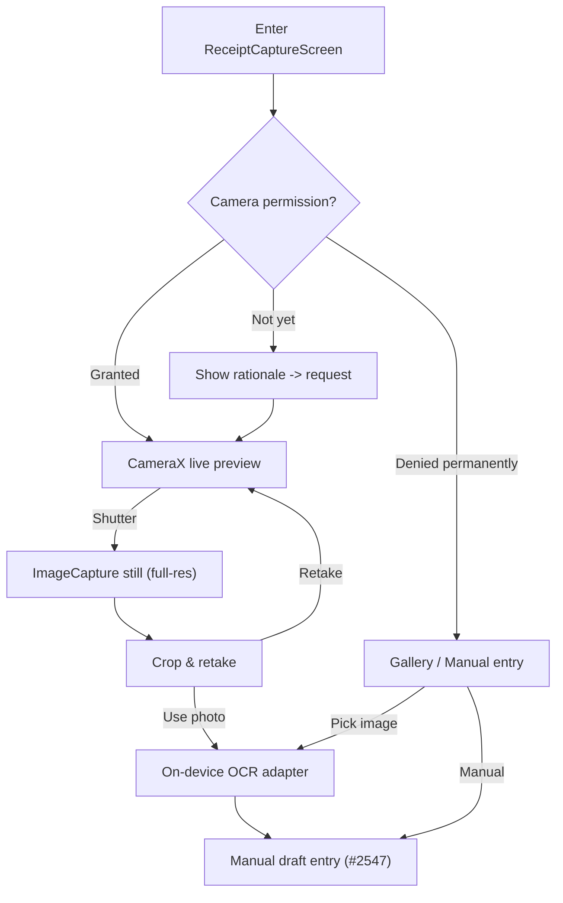
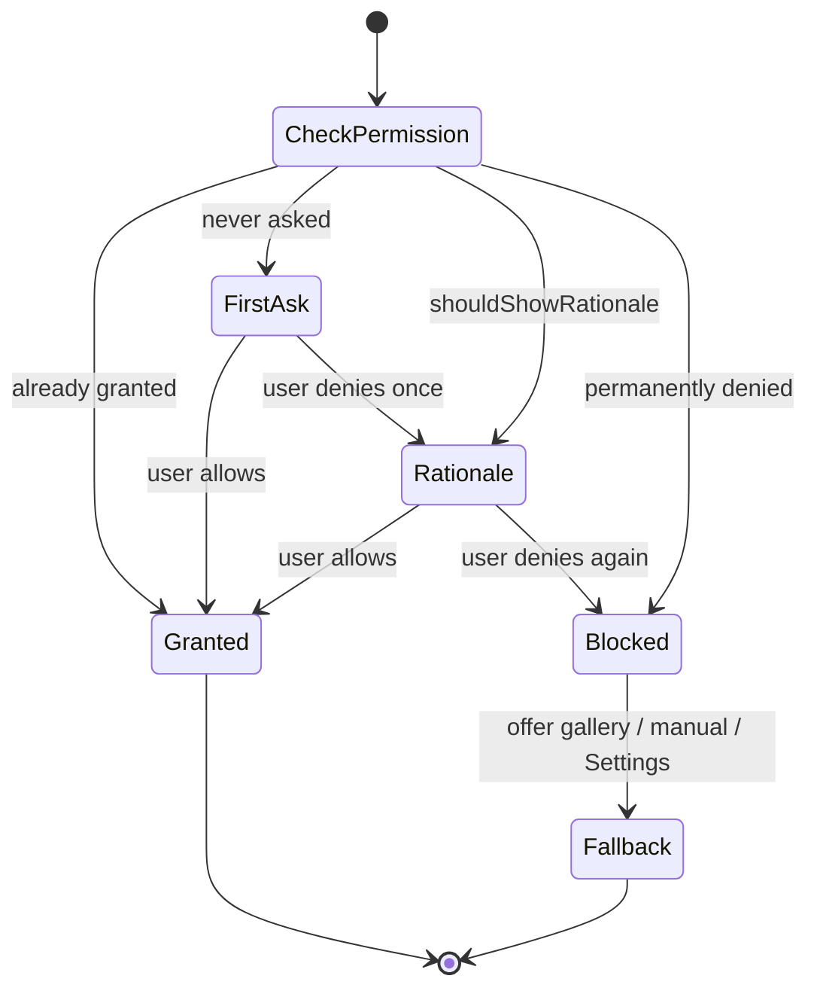

# Android CameraX Receipt Capture & Fallback — Design

> **Status:** Design / breakdown only — native implementation gated by [#1242](https://github.com/jrmoulckers/finance/issues/1242)
> **Issue:** [#2563](https://github.com/jrmoulckers/finance/issues/2563) · **Part of:** [#2388](https://github.com/jrmoulckers/finance/issues/2388)
> **Platform:** Android (Jetpack Compose + Material 3) · **Audience:** Android engineers, design, QA

This document designs **production-grade receipt capture** on Android using
**CameraX**, with permission rationale, gallery and manual-entry fallbacks,
crop/retake, and clear **no-upload** privacy copy. It is the capture front-end for
the [receipt-to-expense draft flow](./android-receipt-to-expense-draft.md); the
captured image is handed to on-device OCR and never leaves the device.

It replaces the prototype capture in
[`ReceiptOcrScreen`](../../apps/android/src/main/kotlin/com/finance/android/ui/screens/ReceiptOcrScreen.kt),
which uses `ActivityResultContracts.TakePicturePreview()` (a low-resolution
thumbnail) — insufficient for reliable OCR. CameraX gives full-resolution capture,
tap-to-focus, and a controllable preview surface.

As everywhere in the receipt cluster, **Compose renders shared state**. Capture
produces a `Bitmap`/URI for the existing on-device
[`AndroidMlKitReceiptOcrAdapter`](../../apps/android/src/main/kotlin/com/finance/android/receipt/AndroidMlKitReceiptOcrAdapter.kt);
all parsing and finance math stay in KMP `packages/core`.

---

## Table of Contents

1. [Goals & non-goals](#1-goals--non-goals)
2. [Capture architecture](#2-capture-architecture)
3. [Camera permission rationale](#3-camera-permission-rationale)
4. [Fallback: gallery & manual entry](#4-fallback-gallery--manual-entry)
5. [Crop & retake](#5-crop--retake)
6. [No-upload privacy copy](#6-no-upload-privacy-copy)
7. [Offline-first, empty, and error states](#7-offline-first-empty-and-error-states)
8. [Accessibility](#8-accessibility)
9. [Test plan](#9-test-plan)
10. [Implementation readiness](#10-implementation-readiness)
11. [Cross-links](#11-cross-links)

---

## 1. Goals & non-goals

### Goals

- Add a **CameraX capture flow** that produces a full-resolution image for OCR
  (acceptance criterion from [#2388](https://github.com/jrmoulckers/finance/issues/2388):
  "Add a camera capture flow that produces a reviewable transaction draft").
- Show a **clear permission rationale** before/at the camera request, and a
  graceful path when permission is denied.
- Provide **gallery** and **manual-entry** fallbacks when ML Kit or camera
  permission is unavailable (criterion: "Document fallback/manual entry when ML Kit
  or camera permissions are unavailable").
- Offer **crop and retake** before committing to OCR.
- Reassure with **no-upload** privacy copy at the point of capture.

### Non-goals

- OCR field parsing, draft assembly, and save — see [Android Receipt-to-Expense Draft Flow](./android-receipt-to-expense-draft.md) ([#2547](https://github.com/jrmoulckers/finance/issues/2547)).
- Attachment persistence and COGS mapping — see [Android Receipt Attachments & COGS Mapping](./android-receipt-attachments-cogs.md) ([#2549](https://github.com/jrmoulckers/finance/issues/2549)).
- Any change to KMP packages or to other platforms.

---

## 2. Capture architecture

CameraX is composed inside Compose; the preview is hosted in an `AndroidView`
wrapping a `PreviewView`, which is the standard, supported Compose↔CameraX bridge
(this is **not** an XML layout — it is a single interop node, allowed for
framework surfaces like camera previews).

| Component                 | Type          | Responsibility                                                             |
| ------------------------- | ------------- | -------------------------------------------------------------------------- |
| `ReceiptCaptureScreen`    | `@Composable` | Hosts preview, shutter, gallery/manual entry points, and privacy banner.   |
| `CameraPreview`           | `@Composable` | `AndroidView(PreviewView)` bound to a CameraX `Preview` + `ImageCapture`.  |
| `CaptureControls`         | `@Composable` | Shutter, flash toggle, gallery shortcut, cancel.                           |
| `CropRetakeScreen`        | `@Composable` | Review the still: crop overlay, **Retake**, **Use photo**.                 |
| `ReceiptCaptureViewModel` | `ViewModel`   | Owns capture/permission state; emits the image to the OCR adapter.         |
| CameraX use cases         | (CameraX)     | `Preview` + `ImageCapture` bound to lifecycle via `ProcessCameraProvider`. |

- Capture is bound to the Composable lifecycle; the camera is released on
  `onStop`/dispose to avoid leaks and battery drain.
- The shutter writes a full-resolution still (compressed) and passes it to the
  existing `AndroidMlKitReceiptOcrAdapter.extract(bitmap)` — the OCR boundary is
  unchanged.
- DI: `koinViewModel<ReceiptCaptureViewModel>()`; registered additively in the
  receipt Koin module.

---

## 3. Camera permission rationale

Permission is requested with rationale, not cold. The flow distinguishes
first-ask, "show rationale", and "permanently denied".

- Rationale copy explains **why** the camera is needed and reaffirms **no upload**
  (see §6) in plain language per [Content & Language Guidelines](./content-language-guidelines.md).
- "Permanently denied" never dead-ends: the user is offered **Choose from
  gallery**, **Enter manually**, and a deep link to **App settings**.
- Permission state is held in the ViewModel and survives configuration changes; the
  request uses `ActivityResultContracts.RequestPermission()`.

---

## 4. Fallback: gallery & manual entry

Fallback is a first-class path, not an error.

| Condition                      | Fallback offered                                                                                                       |
| ------------------------------ | ---------------------------------------------------------------------------------------------------------------------- |
| Camera permission denied       | **Choose from gallery** (`GetContent("image/*")`) + **Enter manually**.                                                |
| No camera hardware             | Gallery + manual; camera controls hidden.                                                                              |
| ML Kit unavailable / OCR fails | **Enter manually** (jump straight to the draft form from [#2547](https://github.com/jrmoulckers/finance/issues/2547)). |
| Low-quality / unreadable image | Retake (camera) or re-pick (gallery), plus manual entry.                                                               |

- The gallery path reuses the existing `GetContent` contract already present in
  [`ReceiptOcrScreen`](../../apps/android/src/main/kotlin/com/finance/android/ui/screens/ReceiptOcrScreen.kt).
- Manual entry hands off directly to the
  [receipt-to-expense draft flow](./android-receipt-to-expense-draft.md) with an
  empty draft, so the user can always create the expense regardless of camera/OCR
  availability.
- Fallbacks are surfaced **before** failure where possible (for example, a
  permanent "Enter manually" affordance always visible on the capture screen).

---

## 5. Crop & retake

After the shutter, the user reviews the still before OCR runs:

- **Crop overlay** with draggable handles to isolate the receipt and drop
  background clutter, improving OCR accuracy. Crop math is local image geometry, not
  finance math.
- **Retake** returns to the live preview without losing the camera session.
- **Use photo** commits the cropped bitmap to
  `AndroidMlKitReceiptOcrAdapter.extract(...)`.
- Rotation is corrected from EXIF/sensor orientation before OCR.
- The cropped result is what flows downstream; the attachment opt-in in
  [#2549](https://github.com/jrmoulckers/finance/issues/2549) stores the cropped
  image (only if the user opts in).

---

## 6. No-upload privacy copy

Privacy is stated **at the moment of capture**, not buried in settings:

- A persistent banner on the capture and crop screens: **"Receipts are scanned on
  this device. The photo and its text are never uploaded."** This mirrors the
  existing on-screen assurance in `ReceiptOcrScreen`.
- The permission rationale repeats the no-upload promise so the user grants camera
  access with full context.
- Copy is reviewed against [Content & Language Guidelines](./content-language-guidelines.md)
  and kept plain per [Cognitive Accessibility Mode](./cognitive-accessibility.md).
- Engineering guardrail: capture, crop, and OCR have **no network calls**; ML Kit
  Text Recognition runs on-device. This is asserted in tests (§9).

---

## 7. Offline-first, empty, and error states

Capture is inherently offline; no connectivity is required at any step.

| State                  | Trigger                     | UX                                                                                                                             |
| ---------------------- | --------------------------- | ------------------------------------------------------------------------------------------------------------------------------ |
| First entry            | Screen opened               | Live preview (if permitted) + visible gallery/manual affordances.                                                              |
| Permission not granted | No camera permission        | Rationale (§3); never a blank black screen.                                                                                    |
| No camera hardware     | `FEATURE_CAMERA_ANY` absent | Hide camera UI; lead with gallery + manual.                                                                                    |
| Capture failure        | `ImageCapture` error        | Inline error + **Try again**; offer gallery/manual.                                                                            |
| Unreadable image       | OCR returns unusable result | Route to crop/retake or manual; reuse the unusable-scan path from [#2547](https://github.com/jrmoulckers/finance/issues/2547). |
| ML Kit unavailable     | Recognition module missing  | Skip OCR; go straight to manual draft entry.                                                                                   |

No image bytes, OCR text, or financial values are written to Timber. Capture logs
record only non-sensitive lifecycle events ("camera bound", "capture succeeded",
"permission denied") via `Timber.d`/`Timber.w` — never `Log.*` directly and never
sensitive data.

---

## 8. Accessibility

Camera UIs are notoriously hard for assistive tech; this design treats
accessibility as a requirement, per the
[Accessibility Patterns Library](./accessibility-patterns.md). Target WCAG 2.2 AA.

- **TalkBack:** The shutter, flash, gallery, and cancel controls each have a clear
  `contentDescription` ("Capture receipt photo"). The live preview is labelled and
  announces guidance ("Point the camera at a receipt, then double-tap to capture").
  The no-upload banner is announced on screen entry.
- **Switch Access:** All controls are ≥ 48 dp and reachable without relying on the
  preview surface; the shutter is operable via a single switch action. Crop handles
  expose discrete nudge actions so cropping does not require a drag gesture.
- **200% font scaling:** Controls and banner text scale and wrap; the preview area
  shrinks gracefully but controls remain fully visible (no clipped shutter).
- **Non-visual capture:** Because framing a receipt is visual, the gallery and
  **manual entry** fallbacks are always available as fully accessible alternatives —
  a blind user can still create the expense end-to-end.
- **Color independence & contrast:** Controls use icon + label with sufficient
  contrast over the preview (scrim behind controls).

Every interactive Composable here carries a `contentDescription`.

---

## 9. Test plan

| Layer                | Tooling                   | Coverage                                                                                                                                             |
| -------------------- | ------------------------- | ---------------------------------------------------------------------------------------------------------------------------------------------------- |
| Unit (ViewModel)     | JUnit + coroutine test    | Permission state machine (first-ask → rationale → blocked → fallback); capture-to-OCR handoff; manual fallback path.                                 |
| Unit (no-network)    | JUnit                     | Assert capture/crop/OCR perform no network I/O (fake injected; verify zero calls).                                                                   |
| Compose UI           | `compose-ui-test`         | Rationale shown before request; denied → gallery/manual visible; crop **Retake**/**Use photo**; semantics + `contentDescription`; font-scale `2.0f`. |
| Snapshot             | Paparazzi                 | `ReceiptCaptureScreen` (permission-needed, denied/blocked, no-camera), `CropRetakeScreen` — default + 200% font, light/dark + dynamic color.         |
| Instrumented (later) | `androidx.test` + CameraX | Real `PreviewView` binding + `ImageCapture` on emulator/sideload (debug build) for the live preview path.                                            |

CameraX preview binding is verified on-device with a **debug** build; no signing is
required. Shared OCR parsing is covered by existing `packages/core` tests.

---

## 10. Implementation readiness

This is a design artifact. CameraX and permission plumbing are **fully
debug-implementable today**. See [Human-Gated Prerequisites](../ops/human-gated-prerequisites.md)
and the [Launch Readiness Plan](../ops/launch-readiness-plan.md) for gating.

### Buildable now (debug, no human gate)

- **All** CameraX capture, `PreviewView` interop, the permission rationale state
  machine, crop/retake, gallery + manual fallbacks, and no-upload copy are pure
  Compose + AndroidX — runnable via `./gradlew :apps:android:assembleDebug` and
  sideload to a device/emulator.
- Permission flows, fallbacks, and accessibility semantics need no signing, no
  store presence, and no production keystore.
- The capture → OCR handoff reuses the existing on-device adapter; unit, Compose,
  Paparazzi, and emulator instrumentation all run in CI/debug.

### Play-distribution tail (gated by [#1242](https://github.com/jrmoulckers/finance/issues/1242))

- Production signing keystore + Google Play Console onboarding.
- Play **Data safety** / privacy declarations reflecting on-device-only camera and
  OCR (no image upload), camera-permission justification, internal-testing-track
  upload, and staged rollout.
- Anything requiring a release-signed AAB (not `assembleDebug`).

The entire capture experience can be built, sideloaded, and tested in debug now;
only its production distribution is gated.

---

## 11. Cross-links

- Sibling: [Android Receipt-to-Expense Draft Flow](./android-receipt-to-expense-draft.md) — [#2547](https://github.com/jrmoulckers/finance/issues/2547)
- Sibling: [Android Receipt Attachments & COGS Mapping](./android-receipt-attachments-cogs.md) — [#2549](https://github.com/jrmoulckers/finance/issues/2549)
- [Android Architecture](../architecture/android-architecture.md)
- [Accessibility Patterns Library](./accessibility-patterns.md) · [Cognitive Accessibility Mode](./cognitive-accessibility.md)
- [Component Library](./component-library.md) · [UX Design Principles](./ux-principles.md) · [Content & Language Guidelines](./content-language-guidelines.md)
- [Information Architecture](./information-architecture.md) · [User Personas](./personas.md)
- Ops: [Human-Gated Prerequisites](../ops/human-gated-prerequisites.md) · [Launch Readiness Plan](../ops/launch-readiness-plan.md)
