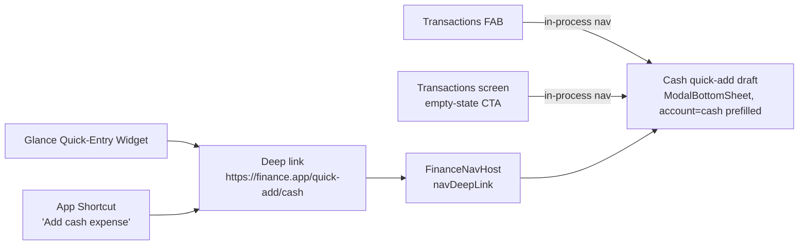
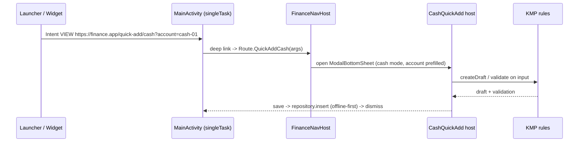

# Android Cash Quick-Entry Deep Links — Design

> **Status:** Design / breakdown · **Issue:** [#2538](https://github.com/jrmoulckers/finance/issues/2538) · **Part of [#2180](https://github.com/jrmoulckers/finance/issues/2180)**
> **Platform:** Android (Jetpack Compose · Material 3 · Glance) · **minSdk 28 / target 35**
> **Companion designs:** [Schedule C Quick-Add Sheet](./android-schedule-c-quick-add-sheet.md) · [Quick-Add Defaults & Persistence](./android-quick-add-defaults-persistence.md)

Defines four entry points — **Glance widget, App Shortcut, in-app FAB, and a
Transactions-screen deep link** — that all land in the **same prefilled
cash-expense draft**, so a cash-first user can log a small purchase before they
forget it.

This is a **design + breakdown** document. The deep-link / App-Shortcut / Glance
plumbing is **implementable now** in debug (`assembleDebug` sideload); only
**Play Store distribution** is human-gated by
[#1242](https://github.com/jrmoulckers/finance/issues/1242). See
[Implementation readiness](#implementation-readiness) and
[`../ops/human-gated-prerequisites.md`](../ops/human-gated-prerequisites.md).

---

## Table of Contents

1. [Problem & Goals](#1-problem--goals)
2. [Entry Points & Single Destination](#2-entry-points--single-destination)
3. [Architecture Boundary (KMP vs. Compose vs. Android plumbing)](#3-architecture-boundary-kmp-vs-compose-vs-android-plumbing)
4. [Affected Android Surfaces & Shared Dependencies](#4-affected-android-surfaces--shared-dependencies)
5. [Deep-Link Contract](#5-deep-link-contract)
6. [App Shortcut, Widget & FAB Wiring](#6-app-shortcut-widget--fab-wiring)
7. [Prefilled Cash-Expense Draft](#7-prefilled-cash-expense-draft)
8. [Offline-First, Empty & Error States](#8-offline-first-empty--error-states)
9. [Accessibility & Localization (TalkBack, Switch Access, i18n)](#9-accessibility--localization-talkback-switch-access-i18n)
10. [Test Plan](#10-test-plan)
11. [Implementation readiness](#implementation-readiness)
12. [Open Questions](#open-questions)

---

## 1. Problem & Goals

From [#2180](https://github.com/jrmoulckers/finance/issues/2180): _"As a
cash-first Android user, I need true quick cash entry so small purchases are
logged before I forget them... Make widget/shortcut actions deep-link directly
into a prefilled cash expense flow."_

Today the
[`QuickEntryWidget`](../../apps/android/src/main/kotlin/com/finance/android/widget/QuickEntryWidget.kt)
just calls `actionStartActivity<MainActivity>()` (lands on the app, not a
prefilled draft) with **hardcoded English labels**, and the main path is the
3-step
[`TransactionCreateScreen`](../../apps/android/src/main/kotlin/com/finance/android/ui/screens/TransactionCreateScreen.kt)
wizard.

**Goals**

- One canonical **deep link** to a prefilled cash-expense draft.
- Reach it from **widget, App Shortcut, FAB, and the Transactions screen**.
- Default to the user's chosen **cash wallet/account** (ties into
  [#2525 defaults](./android-quick-add-defaults-persistence.md)).
- **Offline-first**, low-friction, works on budget devices.
- **Localized** widget/shortcut labels and semantics (Spanish first per #2180).

**Non-goals**

- Implementing the draft sheet itself (covered by the
  [quick-add sheet design](./android-schedule-c-quick-add-sheet.md)); here we
  define how to _reach_ a **cash** variant of it.
- Owning the cash-account selection rule or any finance math (shared/repository).

---

## 2. Entry Points & Single Destination



All four paths converge on **one destination** so behavior, accessibility, and
tests are defined once. External surfaces (widget, shortcut) use the **deep-link
URI**; in-app surfaces (FAB, Transactions CTA) use **in-process navigation** to
the same route.

---

## 3. Architecture Boundary (KMP vs. Compose vs. Android plumbing)

- **Android plumbing** (this doc): the deep-link URI + `navDeepLink`, the App
  Shortcut, the Glance widget click action, and the FAB — all platform glue that
  is implementable now in debug.
- **Compose** renders the prefilled draft (reusing the
  [quick-add sheet](./android-schedule-c-quick-add-sheet.md), in a "cash"
  configuration).
- **KMP** still owns the rules: amount validation, draft creation, and (for cash
  business expenses) the Schedule C taxonomy in
  [`ScheduleCDeductionPresets.kt`](../../packages/core/src/commonMain/kotlin/com/finance/core/schedulec/ScheduleCDeductionPresets.kt).
  A plain personal cash expense uses the standard
  [`Transaction`](../../packages/models/src/commonMain/kotlin/com/finance/models/Transaction.kt)
  - shared
    [`TransactionValidator`](../../packages/core/src/commonMain/kotlin/com/finance/core/validation/TransactionValidator.kt).

> **Boundary rule:** the deep link only carries _intent + prefill hints_
> (mode = cash, optional category/amount). It never carries computed financial
> results. The draft's deductible/proration math (if a business cash expense) is
> produced by the shared taxonomy exactly as in the
> [sheet design](./android-schedule-c-quick-add-sheet.md#6-transaction-draft-contract).

---

## 4. Affected Android Surfaces & Shared Dependencies

| Surface (new/modified)                        | Type            | Role                                                                                                                                                            |
| --------------------------------------------- | --------------- | --------------------------------------------------------------------------------------------------------------------------------------------------------------- |
| `ui/navigation/FinanceNavHost.kt` (modified)  | Nav graph       | New `Route.QuickAddCash` + `navDeepLink { uriPattern = "$DEEP_LINK_BASE/quick-add/cash..." }`.                                                                  |
| `AndroidManifest.xml` (modified)              | Manifest        | `<data android:host="finance.app" android:path="/quick-add/cash"/>` in the existing autoVerify VIEW filter; `<meta-data android:name="android.app.shortcuts">`. |
| `res/xml/shortcuts.xml` (new)                 | Static shortcut | "Add cash expense" App Shortcut → deep-link intent.                                                                                                             |
| `widget/QuickEntryWidget.kt` (modified)       | Glance widget   | Replace `actionStartActivity<MainActivity>()` with `actionStartActivity` carrying the deep-link URI; localize labels.                                           |
| `ui/screens/TransactionsScreen.kt` (modified) | Composable      | FAB + empty-state CTA navigate to `Route.QuickAddCash`.                                                                                                         |
| `ui/quickadd/CashQuickAddArgs.kt` (new)       | Data class      | Parses/validates deep-link args (mode, account hint, category, amount).                                                                                         |
| `res/values-es/strings.xml` (modified/new)    | Resources       | Spanish strings for widget, shortcut, and sheet labels (#2180 i18n).                                                                                            |

**Shared (KMP) dependencies — read only, no edits:**

- `ScheduleCDeductionPresetTaxonomy` (when the cash expense is a business
  deduction).
- `TransactionValidator`, `Transaction`, `Cents`, `Currency`, `SyncId`.
- `CurrencyFormatter` for display.

**Existing deep-link precedent** (already in
[`FinanceNavHost.kt`](../../apps/android/src/main/kotlin/com/finance/android/ui/navigation/FinanceNavHost.kt)):
`navDeepLink { uriPattern = "$DEEP_LINK_BASE/auth/callback" }`,
`/invite/{code}`, `/transaction/{id}` with base `https://finance.app` and an
`autoVerify` VIEW intent filter — the new route follows the same pattern.

---

## 5. Deep-Link Contract

**Canonical URI**

```
https://finance.app/quick-add/cash?account={accountId}&category={categoryId}&amount={cents}&presetId={presetId}
```

| Query param | Required | Meaning                                                                                                           | Validation                                                                   |
| ----------- | -------- | ----------------------------------------------------------------------------------------------------------------- | ---------------------------------------------------------------------------- |
| `account`   | No       | Pre-select this account id (else resolve cash default, see [#2525](./android-quick-add-defaults-persistence.md)). | Re-validated against `AccountRepository`; ignored if missing/archived.       |
| `category`  | No       | Pre-select category id.                                                                                           | Ignored if unknown.                                                          |
| `amount`    | No       | Prefill amount in **cents** (`Long`).                                                                             | `> 0` enforced by shared validation _on save_, not on prefill.               |
| `presetId`  | No       | Schedule C preset (business cash expense).                                                                        | Resolved via `ScheduleCDeductionPresetTaxonomy.findPreset`; ignored if null. |

With **no params**, the link opens the cash draft with the **last-used cash
account** prefilled and an empty amount — the lowest-friction default.

**`navDeepLink` (in `FinanceNavHost`):**

```kotlin
data object QuickAddCash : Route(
    "quick-add/cash?account={account}&category={category}&amount={amount}&presetId={presetId}",
) {
    fun createRoute(account: String? = null /* ...optional... */): String = /* build query */ ""
}

composable(
    route = Route.QuickAddCash.route,
    arguments = listOf(
        navArgument("account") { nullable = true; defaultValue = null },
        navArgument("category") { nullable = true; defaultValue = null },
        navArgument("amount") { type = NavType.StringType; nullable = true; defaultValue = null },
        navArgument("presetId") { nullable = true; defaultValue = null },
    ),
    deepLinks = listOf(navDeepLink { uriPattern = "$DEEP_LINK_BASE/quick-add/cash?account={account}&category={category}&amount={amount}&presetId={presetId}" }),
) { /* CashQuickAdd host renders the sheet */ }
```

> **Safety:** all params are _hints_. Parsing is defensive (`CashQuickAddArgs`)
> — bad/unknown values are dropped and the draft falls back to safe defaults; a
> malformed deep link never crashes or persists garbage. No sensitive data is put
> in the URI beyond opaque ids (no amounts logged via Timber).

---

## 6. App Shortcut, Widget & FAB Wiring

**App Shortcut (`res/xml/shortcuts.xml`, static):**

```xml
<shortcuts xmlns:android="http://schemas.android.com/apk/res/android">
  <shortcut
      android:shortcutId="add_cash_expense"
      android:enabled="true"
      android:icon="@drawable/ic_shortcut_cash"
      android:shortcutShortLabel="@string/shortcut_cash_short"
      android:shortcutLongLabel="@string/shortcut_cash_long">
    <intent
        android:action="android.intent.action.VIEW"
        android:data="https://finance.app/quick-add/cash" />
    <categories android:name="android.shortcut.conversation" />
  </shortcut>
</shortcuts>
```

Referenced from the launcher activity via
`<meta-data android:name="android.app.shortcuts" android:resource="@xml/shortcuts"/>`.
Labels come from localized string resources (`@string/...`), **not** hardcoded —
fixing the #2180 i18n gap.

**Glance widget (modify `QuickEntryWidget`):**

- Replace `clickable(actionStartActivity<MainActivity>())` with an action that
  starts an `Intent(ACTION_VIEW, "https://finance.app/quick-add/cash?...")`
  (Glance `actionStartActivity(intent)`), so the tile lands directly in the
  prefilled cash draft instead of the app home.
- A dedicated **"Cash"** chip defaults to the cash wallet; category chips append
  `?category=...`.
- Replace hardcoded `"Quick Add"`, `"Food"`, `"Gas"`, etc. with
  `context.getString(R.string.widget_...)` for localization, and update each
  `contentDescription` to use localized strings.

**FAB & Transactions CTA (in-app):**

- `TransactionsScreen` FAB → `navController.navigate(Route.QuickAddCash.createRoute())`
  (in-process, no URI round-trip).
- Empty-state CTA ("Log your first cash expense") → same route.



---

## 7. Prefilled Cash-Expense Draft

The destination reuses the [quick-add sheet](./android-schedule-c-quick-add-sheet.md)
in a **cash configuration**:

- **Account** defaults to the chosen cash wallet (deep-link `account` hint →
  else last-used cash account → else household primary cash account → else first
  account). Account resolution rule lives with
  [#2525 defaults](./android-quick-add-defaults-persistence.md).
- **Type** = `EXPENSE`; **amount** prefilled from `amount` cents if present,
  otherwise empty and focused for immediate entry.
- **Personal cash expense** → validated by the shared `TransactionValidator`,
  saved as a standard `Transaction` (no Schedule C tags).
- **Business cash expense** (a `presetId` was supplied, e.g. from the Schedule C
  widget chip) → uses the shared taxonomy draft contract exactly as the
  [sheet design §6](./android-schedule-c-quick-add-sheet.md#6-transaction-draft-contract).
- **Save** writes through `TransactionRepository.insert` to the local
  SQLDelight/SQLCipher store immediately (offline-first); `SyncWorker`
  (WorkManager) reconciles later.

---

## 8. Offline-First, Empty & Error States

| Scenario                                      | Behavior                                                                                                                                                                                                                                   |
| --------------------------------------------- | ------------------------------------------------------------------------------------------------------------------------------------------------------------------------------------------------------------------------------------------ |
| **Offline (typical for cash-on-the-go)**      | Entire flow works; save persists locally and syncs later. "Saved offline" snackbar with `contentDescription`.                                                                                                                              |
| **Deep link while app cold-started**          | `MainActivity` (launchMode `singleTask`) routes the link after auth/onboarding gate; the pending route is preserved and opened post-unlock.                                                                                                |
| **Deep link while locked (biometric)**        | Honor the existing biometric gate via [`BiometricAuthManager`](../../apps/android/src/main/kotlin/com/finance/android/security/BiometricAuthManager.kt); open the draft only after successful auth. Never bypass the lock for a deep link. |
| **Unknown/malformed params**                  | `CashQuickAddArgs` drops them; draft opens with safe defaults. No crash, no error toast.                                                                                                                                                   |
| **No cash account configured**                | Sheet prompts "Choose an account" / "Add a cash wallet"; Save disabled with helper text; CTA to account create.                                                                                                                            |
| **Save failure**                              | Non-dismissing error snackbar + Retry; input preserved; `Timber.e(t, "Cash quick-add save failed")` (no amount/account values logged).                                                                                                     |
| **No transactions yet (Transactions screen)** | Empty-state illustration + "Log your first cash expense" CTA → `Route.QuickAddCash`.                                                                                                                                                       |

---

## 9. Accessibility & Localization (TalkBack, Switch Access, i18n)

**Accessibility**

- **Widget**: every chip and the widget root carry `contentDescription` (Glance
  `semantics { contentDescription = ... }`) sourced from **localized** strings,
  e.g. `getString(R.string.widget_cash_add_cd)`.
- **App Shortcut** long/short labels are localized resources; the launcher
  announces them via TalkBack automatically.
- **FAB**: `contentDescription = stringResource(R.string.fab_quick_add_cash)`
  ("Add cash expense"); ≥ 56 dp target.
- **Destination sheet** inherits the
  [sheet accessibility spec](./android-schedule-c-quick-add-sheet.md#9-accessibility-talkback-switch-access-font-scaling)
  (heading title, live-region deductible/amount, focus order, ≥ 56 dp targets,
  200% font scaling).
- **Switch Access**: FAB and widget chips are single focusable targets with clear
  labels; the deep link lands focus on the amount field for immediate entry.

**Localization (#2180 — Spanish first)**

- All widget/shortcut/FAB strings move to `res/values/strings.xml` with a
  `res/values-es/strings.xml` translation; **no hardcoded English** in Compose,
  Glance, or the manifest-referenced shortcut labels.
- `contentDescription`s use the same localized resources so TalkBack speaks the
  user's language.
- Currency/number formatting goes through shared `CurrencyFormatter` (locale-aware),
  not manual string building.
- Verify RTL safety of the widget/sheet layouts (start/end, not left/right).

---

## 10. Test Plan

**Android unit (`apps/android/src/test`, JVM, CI without device):**

- `CashQuickAddArgsTest`
  - parses all params; drops unknown/malformed values; empty link → safe defaults.
  - `amount` cents parsed to `Long`; non-numeric ignored.
  - `presetId` resolves via shared taxonomy; unknown id ignored.
- `CashQuickAddViewModelTest` (or extension of the quick-add VM tests)
  - account resolution: deep-link hint → last-used cash → primary cash → first.
  - personal vs. business (presetId present) draft paths use the correct shared API.
  - offline insert path saves without network.

**Instrumentation / deep-link (`androidTest`, debug build):**

- `adb shell am start -a android.intent.action.VIEW -d "https://finance.app/quick-add/cash?account=cash-01"`
  opens the prefilled cash draft (verified via a deep-link instrumentation test,
  consistent with existing
  [`NavigationE2ETest`](../../apps/android/src/androidTest/kotlin/com/finance/android/e2e/NavigationE2ETest.kt)).
- App Shortcut launch opens the same destination.
- FAB and empty-state CTA navigate to `Route.QuickAddCash`.
- Cold-start + locked-device deep link respects the biometric gate before opening.

**Localization tests:**

- widget/shortcut/FAB render Spanish strings under `values-es`; no hardcoded
  English remains (lint check for string literals in Glance/Compose label slots).
- `contentDescription`s are non-empty and localized.

**Paparazzi snapshots:** widget (English + Spanish), cash draft prefilled state,
empty-account state, large-font and OLED-dark variants.

---

## Implementation readiness

| Phase                                                                                                                          | Status               | Gate                                                                                                      |
| ------------------------------------------------------------------------------------------------------------------------------ | -------------------- | --------------------------------------------------------------------------------------------------------- |
| This design doc                                                                                                                | ✅ Done              | None                                                                                                      |
| `navDeepLink` route, App Shortcut, Glance widget rewire, FAB/CTA, `values-es`, unit/instrumentation/Paparazzi, `assembleDebug` | 🟢 **Buildable now** | None — debug sideload per [`../ops/human-gated-prerequisites.md` §2](../ops/human-gated-prerequisites.md) |
| Play Store release + Play **App Shortcuts / deep-link verification on the production listing**                                 | 🔒 **Gated**         | [#1242](https://github.com/jrmoulckers/finance/issues/1242) — keystore + Play Console                     |

The deep-link, App Shortcut, and Glance-widget plumbing is **standard Android
local code** — fully implementable and testable today with
`./gradlew :apps:android:assembleDebug` plus `adb`-driven deep-link
instrumentation; the App Links `autoVerify` filter already exists in the
manifest. The finance _rules_ live in `packages/core`. **Only Play
distribution** (release signing, Play Console upload, and the production
Digital Asset Links / store listing) is human-gated by #1242 — see
[`../ops/human-gated-prerequisites.md`](../ops/human-gated-prerequisites.md)
§§2–3.1. No build, signing, or store action is performed by this design.

---

## Open Questions

1. **App Links autoVerify vs. custom scheme**: reuse the verified
   `https://finance.app` host (consistent with existing deep links) — production
   Digital Asset Links verification is part of the #1242 distribution tail, but
   debug builds work via the same VIEW filter. Confirmed approach: reuse host.
2. **Shortcut iconography**: needs a `ic_shortcut_cash` vector from
   `@design-engineer`/icon system ([`icon-system.md`](./icon-system.md)); placeholder
   until then.
3. **Additional locales beyond Spanish**: #2180 calls out Spanish; structure the
   strings so adding more `values-xx` later is trivial.
