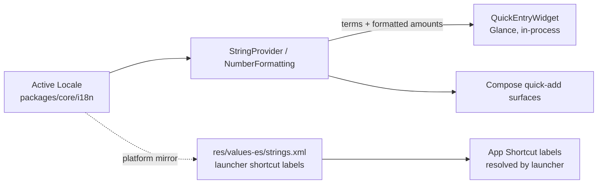
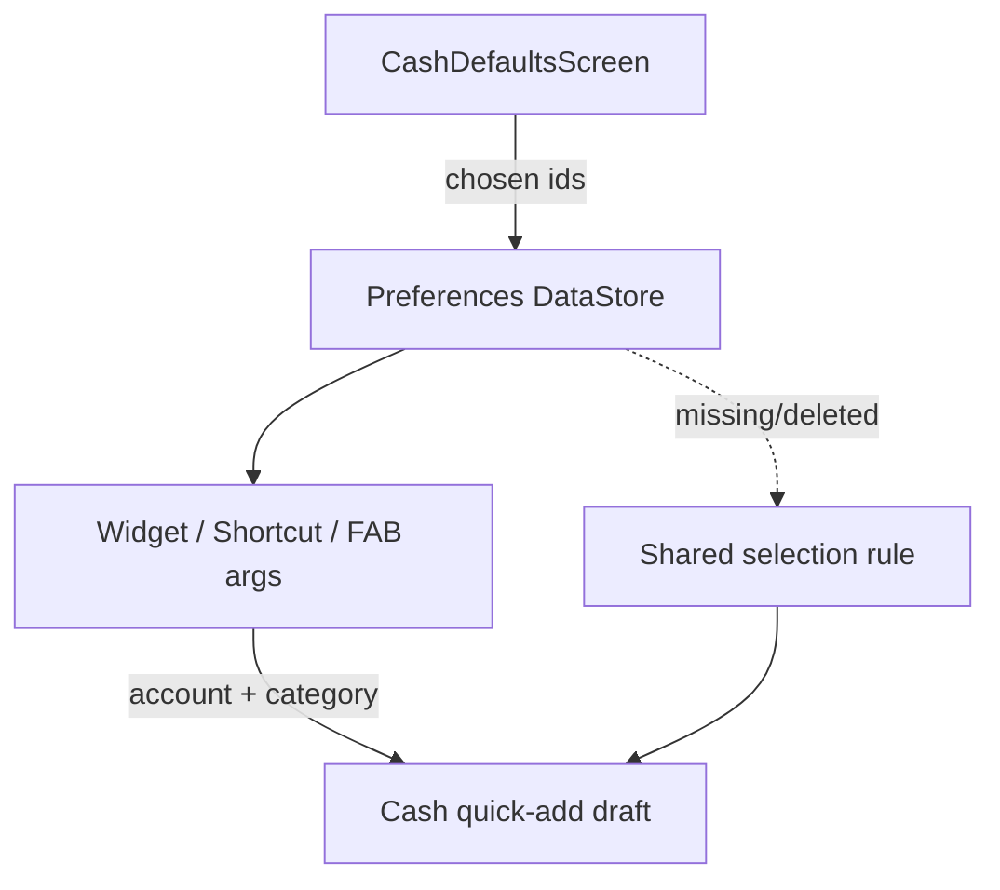
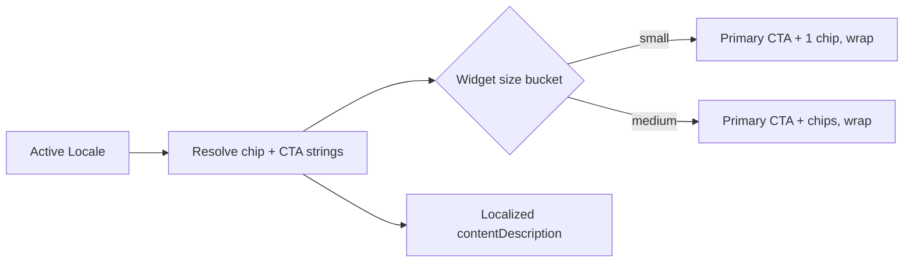

# Android — Cash Wallet Defaults & Localized Widget UX

> **Status:** DRAFT — design only (pending human review)
> **Owner:** @android-engineer
> **Issue:** [#2541](https://github.com/jrmoulckers/finance/issues/2541) · **Part of** [#2180](https://github.com/jrmoulckers/finance/issues/2180)
> **Platform:** Android phone (Jetpack Compose · Material 3 · Glance) · **minSdk 28 / compile-target 35**
> **Last Updated:** 2026-06-22

This document specifies the **design** for a cash-first Android user's **default cash wallet / category
preferences**, **offline behavior** on budget devices, and a **localized Glance quick-entry widget**
(Spanish first per [#2180](https://github.com/jrmoulckers/finance/issues/2180)). The widget today
hardcodes English labels and just opens `MainActivity`; this design makes it default to a chosen cash
wallet and speak the user's language.

It is **design + breakdown only**. The defaults persistence and Glance widget plumbing are
**buildable now** in a debug build (`assembleDebug` sideload); only **Play Store distribution** is
human-gated by [#1242](https://github.com/jrmoulckers/finance/issues/1242). See
[§10 Implementation readiness](#10-implementation-readiness) and
[`../ops/human-gated-prerequisites.md`](../ops/human-gated-prerequisites.md). All effort figures are
**estimates**.

---

## Table of Contents

- [1. Problem & Goals](#1-problem--goals)
- [2. KMP / Compose / i18n Boundary](#2-kmp--compose--i18n-boundary)
- [3. Affected Android Surfaces](#3-affected-android-surfaces)
- [4. Shared Dependencies](#4-shared-dependencies)
- [5. Default Cash Wallet & Category Preferences](#5-default-cash-wallet--category-preferences)
- [6. Localized Glance Widget (Labels, Semantics, Text Expansion)](#6-localized-glance-widget-labels-semantics-text-expansion)
- [7. Offline Behavior on Budget Devices](#7-offline-behavior-on-budget-devices)
- [8. Accessibility (TalkBack, Switch Access, Font Scaling, Localization)](#8-accessibility-talkback-switch-access-font-scaling-localization)
- [9. Test Plan](#9-test-plan)
- [10. Implementation readiness](#10-implementation-readiness)
- [11. Open Questions](#11-open-questions)

---

## 1. Problem & Goals

From [#2180](https://github.com/jrmoulckers/finance/issues/2180): _"Allow quick entry to default to a
chosen cash wallet/account… Localize widget labels and semantics for Spanish users… Support a very
low-friction offline path for small cash expenses on budget Android devices."_

Today the
[`QuickEntryWidget`](../../apps/android/src/main/kotlin/com/finance/android/widget/QuickEntryWidget.kt)
claims "Configurable default account and category" but **hardcodes English labels** and calls
`actionStartActivity<MainActivity>()` (lands on the app home, not a prefilled draft).

### Goals

- Let the user pick a **default cash wallet/account** and **default category** for quick entry.
- Persist those preferences locally and apply them across the **widget, App Shortcut, and FAB** paths.
- **Localize** all widget labels and `contentDescription`s (Spanish first), with layouts that tolerate
  **text expansion**.
- Keep a **very low-friction offline path** that works on budget devices.

### Non-Goals

- The **deep-link destination / draft sheet** itself — owned by
  [Cash quick-entry deep links](./android-cash-quick-entry-deep-links.md)
  ([#2538](https://github.com/jrmoulckers/finance/issues/2538)). This doc decides **what defaults flow
  into it** and **how the widget is localized**.
- The generic **defaults persistence engine** — owned by
  [Quick-add defaults & persistence](./android-quick-add-defaults-persistence.md)
  ([#2525](https://github.com/jrmoulckers/finance/issues/2525)); here we specialize it for **cash**.
- Owning the cash-account **selection rule** or any finance math (shared / repository).
- Adding new translated strings to `packages/core` (that is `@kmp-engineer`'s catalog); this doc
  defines the **boundary and the Android mirror**, not the canonical translations.

---

## 2. KMP / Compose / i18n Boundary

**Terminology and value formatting are owned by KMP `packages/core/i18n`.** Compose and Glance render
shared state; the cash-account selection rule and any money math stay shared/repository. The Android
layer owns only the platform surfacing (Glance/RemoteViews, manifest-referenced shortcut labels) and
text-expansion-tolerant layout.

| Concern                                                     | Owner    | Symbol / location                                                                       |
| ----------------------------------------------------------- | -------- | --------------------------------------------------------------------------------------- |
| Locale resolution + fallback chain (es-MX → es → en)        | KMP      | `com.finance.core.i18n.Locale`, `StringProvider`                                        |
| Canonical financial terminology (keys + bundles)            | KMP      | `com.finance.core.i18n.Strings`, `StringBundle` (e.g. `Strings.ACCOUNT_CASH`)           |
| Currency / number / percent formatting                      | KMP      | `com.finance.core.i18n.NumberFormatting`, `com.finance.core.currency.CurrencyFormatter` |
| Cash-account selection rule (which wallet when none chosen) | KMP/repo | shared rule per [defaults doc](./android-quick-add-defaults-persistence.md)             |
| User's chosen default wallet/category (preference value)    | Android  | DataStore (Preferences) — see [§5](#5-default-cash-wallet--category-preferences)        |
| Glance widget labels / semantics surfacing                  | Android  | `QuickEntryWidget` + Android string mirror (this doc)                                   |
| Launcher-resolved App Shortcut labels                       | Android  | `res/values[-es]/strings.xml` (platform requires Android resources)                     |

> **The boundary, precisely:**
>
> - **Financial _terminology_** ("Cash", "Groceries", "Gas") and **_value formatting_** (amounts,
>   currency symbol, decimals) are **canonical in `packages/core/i18n`**. In-process Compose/Glance
>   code resolves them via `StringProvider` / `NumberFormatting` for the active `Locale`.
> - **Platform chrome that the OS resolves outside our process** — manifest-referenced **App Shortcut
>   long/short labels** — must live in Android `res/values[-es]/strings.xml`. These are a **thin mirror**
>   of the shared catalog and must stay in sync (audited by
>   [String-resource migration audit](./android-string-resource-migration-audit.md)); they are **not**
>   a second source of truth for terminology.
> - **No hardcoded English** anywhere in `QuickEntryWidget`, the manifest shortcuts, or Compose —
>   replacing the current hardcoded labels is the core #2180 i18n fix.

---

## 3. Affected Android Surfaces

All new/modified surfaces are Compose or Glance — **no XML layouts**.

| Surface                       | Type                          | Responsibility                                                                   |
| ----------------------------- | ----------------------------- | -------------------------------------------------------------------------------- |
| `QuickEntryWidget` (modify)   | Glance widget                 | Localized labels/semantics; cash chip defaults to chosen wallet; deep-links out. |
| `CashDefaultsScreen`          | Composable (settings)         | Pick default cash wallet + default category; preview of widget result.           |
| `CashDefaultsViewModel`       | `ViewModel` (`koinViewModel`) | Reads/writes preference; resolves display labels via `StringProvider`.           |
| `CashDefaultsRepository`      | Repository / DataStore        | Persists chosen wallet id + category id (Preferences DataStore).                 |
| `res/values[-es]/strings.xml` | Android resources             | Launcher-resolved App Shortcut labels (platform mirror only).                    |
| `CashDefaultsModule`          | Koin module                   | `viewModelOf(::CashDefaultsViewModel)`, `singleOf(::CashDefaultsRepository)`.    |

The widget/shortcut/FAB all funnel into the **existing** cash deep-link destination defined by
[Cash quick-entry deep links](./android-cash-quick-entry-deep-links.md); this doc supplies the
**default account/category args** and the **localized chrome**.

---

## 4. Shared Dependencies

| Dependency                                       | Use                                                | Notes                                                |
| ------------------------------------------------ | -------------------------------------------------- | ---------------------------------------------------- |
| `StringProvider`, `Strings`, `Locale` (KMP i18n) | Localized terminology + fallback chain             | Canonical source; Compose/Glance resolve in-process. |
| `NumberFormatting` / `CurrencyFormatter` (KMP)   | Locale-aware amount formatting                     | Compose/Glance never build money strings.            |
| Cash-account selection rule (shared/repo)        | Resolve effective default when none chosen         | Owned by the defaults/persistence doc.               |
| Preferences DataStore                            | Persist chosen wallet/category ids                 | Not secrets; never SharedPreferences for secrets.    |
| Glance + GlanceAppWidget                         | Localized widget rendering & actions               | Debug-implementable plumbing.                        |
| Koin 4.0.1 (`koin-compose-viewmodel`)            | DI for ViewModel + repository                      | `koinViewModel()` in Composables.                    |
| Timber 5.0.1                                     | Structured logs (never `Log.*`, never log amounts) | See [§7](#7-offline-behavior-on-budget-devices).     |

---

## 5. Default Cash Wallet & Category Preferences

- `CashDefaultsScreen` lets the user choose a **default cash wallet/account** and a **default
  category** (e.g. "Cash" / "Groceries"). Labels are resolved via `StringProvider` for the active
  `Locale`, so the picker reads in the user's language.
- The **chosen ids** are persisted in **Preferences DataStore** (`cash_default_account_id`,
  `cash_default_category_id`). These are non-secret preference values; secrets remain in Keystore.
- **Effective default resolution** (when no explicit choice, or the chosen account was deleted) defers
  to the **shared selection rule** (deep-link `account` hint → last-used cash account → household
  primary cash account → first account), exactly as the
  [cash quick-entry doc §7](./android-cash-quick-entry-deep-links.md#7-prefilled-cash-expense-draft)
  defines. Android does not invent its own rule.
- These defaults become the **deep-link args** appended by the widget / shortcut / FAB
  (`?account=<id>&category=<id>`), landing the user in a prefilled cash draft.

---

## 6. Localized Glance Widget (Labels, Semantics, Text Expansion)

**Localized labels & semantics**

- Replace every hardcoded string in `QuickEntryWidget` ("Quick Add", "Food", "Gas", …) with values
  resolved from the shared catalog for the active `Locale`; every chip and the widget root carries a
  **localized** `contentDescription` (Glance `semantics { contentDescription = … }`).
- App Shortcut long/short labels come from `res/values[-es]/strings.xml` (launcher-resolved) — a thin
  mirror of the shared terminology, never hardcoded English.
- Amounts/preview values format through `NumberFormatting` / `CurrencyFormatter` (locale-aware), never
  manual string concatenation.

**Text-expansion tolerance (the key localization risk)**

Spanish strings commonly run **~15–30% longer** than English ("Add" → "Añadir", "Cash" → "Efectivo");
some locales expand further. Glance/RemoteViews layouts must not assume English width:

| Risk                          | Design response                                                                                    |
| ----------------------------- | -------------------------------------------------------------------------------------------------- |
| Chip label overflow           | Chips size to content with wrap/`maxLines`; no fixed-width pills; min touch target ≥ 48 dp kept.   |
| Truncated action label        | Prefer icon + short label; allow 2-line wrap on the smaller widget size before ellipsis.           |
| Multi-cell widgets clipping   | Provide responsive size buckets (small/medium); hide secondary chips first, never the primary CTA. |
| `contentDescription` mismatch | Descriptions resolve from the same locale source so TalkBack speaks the visible language.          |

> Pseudo-locale (`en-XA`, accented + ~lengthened) and a real `es` pass are both used in snapshot tests
> to catch expansion clipping early — see [§9](#9-test-plan).

---

## 7. Offline Behavior on Budget Devices

| Scenario                                 | Behavior                                                                                                                                                              |
| ---------------------------------------- | --------------------------------------------------------------------------------------------------------------------------------------------------------------------- |
| **Offline (typical for cash-on-the-go)** | Tapping the widget/shortcut opens the prefilled draft and saves locally; "Saved offline" snackbar with localized `contentDescription`; `SyncWorker` reconciles later. |
| **No default chosen yet**                | Widget uses the shared effective-default rule; `CashDefaultsScreen` prompts to pick a wallet; nothing crashes.                                                        |
| **Chosen wallet deleted**                | Falls back to the shared selection rule; preference is cleared lazily; user sees the resolved account in the draft.                                                   |
| **Budget device (low RAM / slow CPU)**   | Widget stays lightweight (no heavy images, minimal recompositions); cold deep-link routes after the auth/onboarding gate.                                             |
| **Locale change at runtime**             | Widget re-renders labels via `StringProvider` on next update; launcher re-reads shortcut labels from resources.                                                       |
| **Save failure**                         | Non-dismissing error snackbar + Retry; input preserved; `Timber.e(t, "Cash quick-add save failed")` — **never** log amount/account.                                   |

> **Logging rule:** Timber only — never `Log.*`. Never log amounts, account numbers, balances, or
> category values. Event names and non-sensitive identifiers only.

See [Rugged Mode tokens](./android-rugged-mode-tokens.md) for budget/outdoor-device considerations and
[Operating cash calendar](./android-operating-cash-calendar.md) for the broader cash context.

---

## 8. Accessibility (TalkBack, Switch Access, Font Scaling, Localization)

- **`contentDescription` on every interactive/informational element** — widget root, each chip, the
  FAB, and `CashDefaultsScreen` controls; all sourced from **localized** strings.
- **TalkBack speaks the user's language** because descriptions and visible labels resolve from the
  same shared locale source (no English description on a Spanish UI).
- **Switch Access:** widget chips and the FAB are single focusable targets with clear labels; the deep
  link lands focus on the amount field for immediate entry.
- **Font scaling verified at 200%:** `CashDefaultsScreen` and the in-app surfaces reflow without
  truncation; the widget degrades to a compact layout and wraps labels rather than clipping.
- **Text expansion + font scale together:** snapshot the widget at `es` + 200% font to ensure the
  primary CTA is never clipped (worst-case path).
- **No color-only meaning:** default/selected chips use text + icon + container, not hue alone; AA
  contrast across light / dark / OLED.

See [Accessibility Patterns Library](./accessibility-patterns.md),
[Cognitive Accessibility Mode](./cognitive-accessibility.md),
[Content Language Guidelines](./content-language-guidelines.md), and
[Spanish education & formatting coverage](./android-spanish-education-formatting.md).

---

## 9. Test Plan

| Layer                  | Tool                                                                   | Coverage                                                                                                                   |
| ---------------------- | ---------------------------------------------------------------------- | -------------------------------------------------------------------------------------------------------------------------- |
| KMP i18n (reference)   | existing `StringProvider` / `NumberFormatting` tests (`packages/core`) | Fallback chain (es-MX → es → en), formatting — Android does not re-assert                                                  |
| Preferences            | DataStore tests                                                        | Persist/read default wallet + category; clear on deletion; defaults survive process death                                  |
| ViewModel              | JUnit + Turbine                                                        | `CashDefaultsUiState` emissions; label resolution via `StringProvider`; effective-default fallback                         |
| Selection-rule wiring  | JUnit                                                                  | Missing/deleted chosen wallet → shared rule; Android adds no rule of its own                                               |
| Glance widget          | Glance test + instrumented                                             | Localized labels render; chip → deep link with `account`/`category` args; `contentDescription` localized                   |
| App Shortcut           | instrumented                                                           | Localized long/short labels from `res/values-es`; deep link resolves                                                       |
| Localization snapshots | **Paparazzi**                                                          | Widget + `CashDefaultsScreen` in **en / es / pseudo-locale**, light / dark / OLED, **200% font**, RTL — assert no clipping |
| Accessibility          | semantics assertions + Accessibility Scanner                           | `contentDescription` present + localized; spoken language matches UI; 200% font                                            |
| Edge cases             | unit + UI                                                              | No default chosen, deleted wallet, runtime locale change, offline save, budget-device cold start                           |

---

## 10. Implementation readiness

**Design + breakdown only** for this issue. Per the
[Human-Gated Prerequisites runbook](../ops/human-gated-prerequisites.md), "blocked by #1242" gates
**only distribution**, not implementation
([decoupling §2](../ops/human-gated-prerequisites.md#2-implementation-vs-distribution--the-decoupling)).

| Phase                                                                         | Status                                                                  | Notes                                                                                              |
| ----------------------------------------------------------------------------- | ----------------------------------------------------------------------- | -------------------------------------------------------------------------------------------------- |
| **Design** (this doc)                                                         | ✅ Deliverable now                                                      | No accounts/secrets needed.                                                                        |
| **Implementation** (defaults DataStore, localized `QuickEntryWidget`, screen) | ✅ Buildable now                                                        | `./gradlew :apps:android:assembleDebug` + sideload; Glance widget plumbing is debug-implementable. |
| **Localization** (Spanish strings via shared catalog + Android mirror)        | ✅ Buildable now                                                        | Terminology canonical in `packages/core/i18n`; Android mirrors only launcher labels.               |
| **Local tests** (unit / Compose / Glance / Paparazzi incl. es + 200% font)    | ✅ Runnable now                                                         | No enrollment.                                                                                     |
| **Distribution** (Play Store, release signing)                                | 🔒 Gated by [#1242](https://github.com/jrmoulckers/finance/issues/1242) | Google Play enrollment, keystore, CI secrets — **human-gated**.                                    |

**Buildable-now scope (estimate):** default cash wallet/category preferences, the localized Glance
widget (labels + semantics + text-expansion-tolerant layout), App Shortcut labels, and the offline
save path all run on a debug build with on-device storage — no paid entitlement.

**Distribution tail (human action required):** Play Store release and signing depend on the #1242
prerequisites in
[§3.1 of the runbook](../ops/human-gated-prerequisites.md#31-android-distribution--google-play-1242).
No AI agent performs those steps.

---

## 11. Open Questions

- Spanish variant priority — `es-MX` vs. generic `es` for first launch? Proposed: generic `es` with
  the shared fallback chain handling regional variants; product confirms.
- Should the widget offer **multiple** quick chips (cash + last-used category) on the medium size, or
  stay single-CTA for speed? Proposed: single primary CTA + one default-category chip; hide extras on
  small size first.
- Do we add a one-time "Set your cash wallet" nudge after onboarding? Proposed: yes, soft and
  dismissible; tracked separately.

---

_Part of [#2180](https://github.com/jrmoulckers/finance/issues/2180). Companion designs:
[Cash quick-entry deep links](./android-cash-quick-entry-deep-links.md) ·
[Quick-add defaults & persistence](./android-quick-add-defaults-persistence.md) ·
[Spanish education & formatting coverage](./android-spanish-education-formatting.md)._
