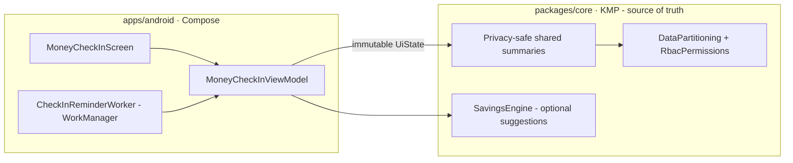
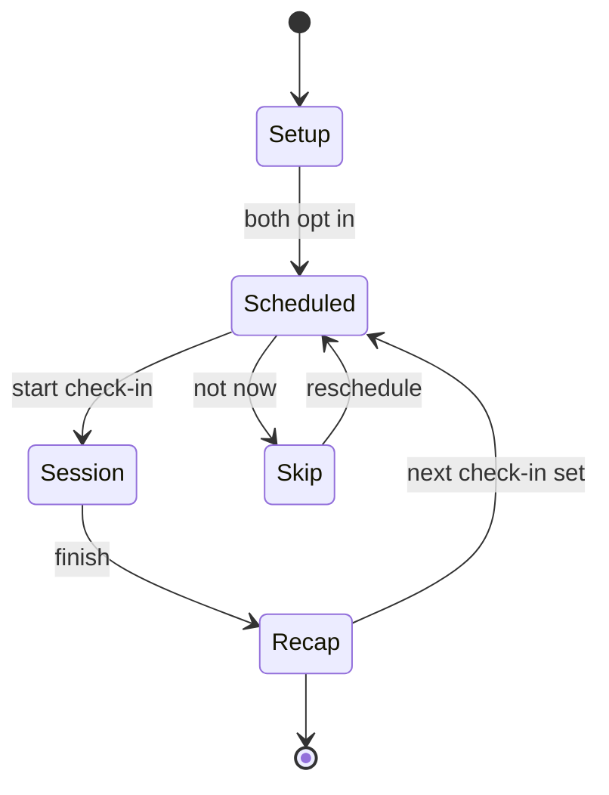

# Android Couples Money Check-In Flow & Prompt Experience — Design

> **Status:** DESIGN — Implementation-ready (native build/test unblocked; store distribution gated by [#1242](https://github.com/jrmoulckers/finance/issues/1242))
> **Issue:** [#2652](https://github.com/jrmoulckers/finance/issues/2652) — _Part of [#2150](https://github.com/jrmoulckers/finance/issues/2150)_ (couples collaboration)
> **Platform:** Android (Jetpack Compose · Material 3)
> **Last Updated:** 2026-06-22

This document specifies the **opt-in couples money check-in**: a supportive,
weekly or monthly Compose ritual with discussion prompts and a collaborative
tone. It covers **setup, session, recap, and skip/reschedule** states and the
**prompt library** (fun-money boundaries, joint account structure, wedding spend,
and upcoming shared expenses).

This is a **ritual, not a surveillance dashboard.** It opens conversation; it does
not rank, audit, or expose either partner's private data. Any figure shown is a
**privacy-safe shared summary** sourced from `packages/core`, and copy is written
to be **collaborative and never accusatory**.

---

## Table of Contents

1. [Goals & Non-Goals](#1-goals--non-goals)
2. [Architecture Boundary (Compose ↔ KMP)](#2-architecture-boundary-compose--kmp)
3. [Grounding in Existing Code](#3-grounding-in-existing-code)
4. [Flow Overview](#4-flow-overview)
5. [Setup State](#5-setup-state)
6. [Session State](#6-session-state)
7. [Recap State](#7-recap-state)
8. [Skip & Reschedule States](#8-skip--reschedule-states)
9. [Prompt Library & Collaborative Tone](#9-prompt-library--collaborative-tone)
10. [Scheduling (WorkManager) & Privacy](#10-scheduling-workmanager--privacy)
11. [Composable & ViewModel Structure](#11-composable--viewmodel-structure)
12. [Accessibility (TalkBack, Switch Access, Font Scaling)](#12-accessibility-talkback-switch-access-font-scaling)
13. [Offline, Empty & Error States](#13-offline-empty--error-states)
14. [Test Plan](#14-test-plan)
15. [Implementation Readiness](#15-implementation-readiness)
16. [Open Questions](#16-open-questions)

---

## 1. Goals & Non-Goals

### Goals

- Offer an **opt-in** weekly/monthly check-in both partners agree to — never
  imposed, always escapable.
- Guide a short **session** with **discussion prompts** that open conversation
  about fun-money boundaries, joint account structure, wedding spend, and
  upcoming shared expenses.
- Provide **setup, session, recap, and skip/reschedule** states with a warm,
  collaborative tone.
- Show only **privacy-safe shared summaries** (aggregates the couple already
  chose to share) — never raw transactions or a partner's private balances.
- Write **accessibility copy that avoids accusatory language** and works fully
  with **TalkBack, Switch Access, and 200% font scaling**.

### Non-Goals

- **Not a surveillance dashboard.** No spend ranking, no "who overspent," no
  drill-down into a partner's private line items.
- **No money math in Compose.** Any summary shown is computed in `packages/core`
  and respects the household privacy boundary (see §2–§3).
- **No new shared rules here.** Where prompt content references shared figures
  (e.g., wedding spend), it consumes existing shared summaries; missing summaries
  are an @kmp-engineer follow-up under #2150, not a Compose workaround.
- **No notifications via AlarmManager/JobScheduler.** Reminders use WorkManager
  - the existing push path (§10).
- **No store distribution work** (gated by #1242 — see §15).

---

## 2. Architecture Boundary (Compose ↔ KMP)

The check-in is a **conversation surface** with a thin data tail. Prompt content
and session structure live in the Android layer; **any money summary it
references is shared, privacy-safe state from `packages/core`.**

- The ViewModel exposes **one immutable `StateFlow<MoneyCheckInUiState>`**.
- **Summaries are pre-bucketed shared aggregates** filtered through
  `DataPartitioning` — the check-in cannot request a partner's private detail.
- **Prompt copy is local string resources** (no business logic); only the
  optional figure attached to a prompt comes from shared code.

---

## 3. Grounding in Existing Code

| Concern                    | Source of truth (do **not** reimplement in Compose)                                                                                                                                                                           | Today's state                              |
| -------------------------- | ----------------------------------------------------------------------------------------------------------------------------------------------------------------------------------------------------------------------------- | ------------------------------------------ |
| Partner partition & roles  | [`DataPartitioning`](../../packages/core/src/commonMain/kotlin/com/finance/core/household/DataPartitioning.kt) + [`RbacPermissions`](../../packages/core/src/commonMain/kotlin/com/finance/core/household/RbacPermissions.kt) | Exists: `filterVisible`, role gates        |
| Privacy-safe masking       | Privacy foundation per [android-household-privacy-dashboard.md](./android-household-privacy-dashboard.md)                                                                                                                     | Exists: bucketed / percent summaries       |
| Joint vs personal accounts | [`Household`](../../packages/models/src/commonMain/kotlin/com/finance/models/Household.kt) + [`HouseholdMember`](../../packages/models/src/commonMain/kotlin/com/finance/models/HouseholdMember.kt)                           | Exists: household scoping                  |
| Wedding spend summary      | Wedding workspace shell — [android-wedding-workspace-shell.md](./android-wedding-workspace-shell.md)                                                                                                                          | Designed under #2645 (summary reused here) |
| Upcoming shared expenses   | [`BillReminderEngine`](../../packages/core/src/commonMain/kotlin/com/finance/core/recurring/BillReminderEngine.kt)                                                                                                            | Exists: next-N due bucketing               |
| Optional savings nudge     | [`SavingsEngine`](../../packages/core/src/commonMain/kotlin/com/finance/core/savings/SavingsEngine.kt)                                                                                                                        | Exists: suggestion generation              |
| Reminder scheduling        | WorkManager (Android) — see [SyncWorker pattern]                                                                                                                                                                              | Exists: WorkManager is the app's scheduler |

> The check-in **reuses** these summaries; it does not compute new financial
> figures. Wedding spend, joint structure, and upcoming expenses are all shown as
> shared, privacy-safe summaries.

---

## 4. Flow Overview

- The check-in is reachable from the Planning hub and from a gentle reminder
  notification (§10).
- Either partner can **skip or reschedule** at any point; skipping is friction-
  free and never framed as a failure.

---

## 5. Setup State

First run is a **mutual opt-in**, not a unilateral toggle.

- **Invite to ritual:** one partner proposes a cadence (**weekly** or
  **monthly**) and a default day/time; the other **accepts** before reminders
  start. Until both accept, no reminders are scheduled.
- **What we'll talk about:** a preview of prompt themes (fun-money, joint
  accounts, wedding, upcoming expenses) so consent is informed.
- **Privacy note up front:** plain copy stating the check-in shows **only shared
  summaries**, never a partner's private transactions — sets the supportive tone.
- **Tone preview:** an example prompt is shown so partners see the collaborative
  framing before committing.

> Setup copy follows [content-language-guidelines.md](./content-language-guidelines.md)
> and [cognitive-accessibility.md](./cognitive-accessibility.md): short, warm,
> one decision per step.

---

## 6. Session State

A session is a **short, paced sequence of prompt cards** — think 5–8 minutes, not
an audit.

- **One prompt per card**, advanced at the couple's pace; a progress indicator
  shows "Prompt 2 of 5."
- **Optional shared figure:** a prompt may attach a **privacy-safe summary**
  (e.g., "Wedding spend so far: a rounded range") pulled from shared code — shown
  as context for conversation, **not a scorecard**.
- **No inputs required:** prompts invite discussion, not data entry. An optional
  "Jot a shared note" field can capture an agreement the couple wants to keep.
- **Pause / leave anytime:** leaving mid-session saves progress and routes to a
  gentle skip state (§8) — never a "you abandoned it" message.
- **Equal footing:** copy addresses "you two" / "as a team," never singling out a
  partner.

---

## 7. Recap State

The recap **closes the loop warmly** and sets up the next ritual.

- **Highlights, not metrics:** a short summary of themes discussed and any
  **shared notes/agreements** the couple chose to save — no spending verdicts.
- **Optional next step:** at most one gentle, **opt-in** suggestion sourced from
  `SavingsEngine` (e.g., "Want to set a fun-money amount together?"), clearly
  skippable.
- **Next check-in:** confirms the next scheduled date and offers to change
  cadence.
- **Gratitude tone:** closing copy thanks both partners for showing up — framing
  the ritual as a positive habit.

---

## 8. Skip & Reschedule States

Skipping is **first-class and judgment-free**.

| Action                | Behavior                                                                            |
| --------------------- | ----------------------------------------------------------------------------------- |
| **Not now**           | Dismisses the session; offers a one-tap reschedule (e.g., "Tomorrow," "Next week"). |
| **Reschedule**        | Picks a new date/time; reminder re-queues via WorkManager (§10).                    |
| **Pause ritual**      | Stops reminders entirely until the couple opts back in; no nagging.                 |
| **Leave mid-session** | Saves progress; returns to a calm "Pick up later?" state — never a failure label.   |

- Copy for every skip path is **supportive** ("Life's busy — we'll check in
  later") and avoids guilt or streak-shaming.
- Reschedule respects both partners: a change one proposes is reflected for both
  but doesn't expose either's calendar detail.

---

## 9. Prompt Library & Collaborative Tone

Prompts are **local string resources** grouped by theme. Every prompt is phrased
as a **shared, open question** — collaborative, curious, never accusatory.

| Theme                        | Example prompt (collaborative framing)                                            |
| ---------------------------- | --------------------------------------------------------------------------------- |
| **Fun-money boundaries**     | "What's a personal-spending amount that feels fair to both of us this month?"     |
| **Joint account structure**  | "Is our split of joint vs personal still working for both of us?"                 |
| **Wedding spend**            | "How are we feeling about wedding spending so far — anything to adjust together?" |
| **Upcoming shared expenses** | "What's coming up that we'd like to plan for as a team?"                          |

**Tone rules (enforced in copy review and tests):**

- Use **"we" / "us" / "together"**; avoid "you spent," "you went over," "your
  fault," or any second-person blame.
- Frame numbers as **shared context**, never as a verdict on one partner.
- Prefer **questions over statements**; invite, don't instruct.
- No streaks, scores, or guilt mechanics — this is a ritual, not a leaderboard.
- Cross-check against [content-language-guidelines.md](./content-language-guidelines.md)
  and [ux-principles.md](./ux-principles.md) (supportive, non-judgmental finance
  voice).

---

## 10. Scheduling (WorkManager) & Privacy

- **Reminders use WorkManager**, never AlarmManager/JobScheduler. A
  `CheckInReminderWorker` enqueues the next gentle reminder after setup/recap and
  on reschedule.
- **Push:** if a reminder surfaces as a notification, it carries **no financial
  data** — just "Time for your money check-in?" Tapping deep-links into the flow.
- **Both-opt-in gating:** reminders only schedule once both partners accepted in
  setup; pausing cancels the worker.
- **Privacy boundary:** the worker and notification never read or render private
  partner data; any summary is fetched in-session through the shared
  privacy-safe path. No secrets or balances in `SharedPreferences` — sensitive
  values stay in the encrypted store; auth-gated surfaces use the existing
  biometric/Keystore path.

---

## 11. Composable & ViewModel Structure

| Composable             | Responsibility                                                         |
| ---------------------- | ---------------------------------------------------------------------- |
| `MoneyCheckInScreen`   | Host scaffold routing setup / session / recap / skip; live-region host |
| `CheckInSetupScreen`   | Mutual opt-in, cadence picker, privacy note (§5)                       |
| `CheckInSessionScreen` | Paced prompt-card pager with progress + optional shared note (§6)      |
| `PromptCard`           | Single prompt with optional privacy-safe summary chip                  |
| `CheckInRecapScreen`   | Highlights, optional opt-in suggestion, next-check-in (§7)             |
| `SkipRescheduleSheet`  | Not-now / reschedule / pause options (§8)                              |
| `SharedSummaryChip`    | Privacy-safe bucketed/percent context with non-accusatory semantics    |

- **ViewModel:** `MoneyCheckInViewModel` (Koin `viewModelOf`, resolved via
  `koinViewModel()`), exposing one immutable `StateFlow<MoneyCheckInUiState>`;
  any shared figure is read through the privacy-safe path.
- **Koin wiring (additions only):** `viewModelOf(::MoneyCheckInViewModel)`.
- **Logging:** Timber only; **never log prompt responses, shared notes, or any
  financial summary** — log lifecycle as enum/boolean (e.g.
  `Timber.d("check-in state -> %s", state.name)`); never `Log.*`.
- **Theming:** Material 3 + dynamic color; warm semantic tokens, no hard-coded
  hex.

---

## 12. Accessibility (TalkBack, Switch Access, Font Scaling)

Per [accessibility-patterns.md](./accessibility-patterns.md). Copy is written to
be **non-accusatory** for assistive-tech users too — the `contentDescription`
carries the same warm, collaborative framing as the visible text.

| Surface             | Visible UI                 | TalkBack `contentDescription`                                                  |
| ------------------- | -------------------------- | ------------------------------------------------------------------------------ |
| Setup opt-in        | "Start a money ritual"     | "Set up a money check-in together. Both of you choose the day and how often."  |
| Cadence picker      | "Weekly / Monthly"         | "Choose how often to check in. Weekly or monthly."                             |
| Prompt card         | prompt text                | "Discussion prompt 2 of 5. {prompt}. There's no right answer."                 |
| Shared summary chip | "Wedding: a rounded range" | "Wedding spending so far, shown as a rounded range for privacy. Context only." |
| Skip                | "Not now"                  | "Skip this check-in. We can pick a new time. No problem."                      |
| Reschedule          | "Next week"                | "Reschedule the check-in for next week."                                       |
| Recap               | "Thanks for checking in"   | "Check-in complete. Thanks for taking time together. Next one is scheduled."   |

- **Headings:** each state's title uses `semantics { heading() }`.
- **No accusatory copy:** assistive-tech strings avoid "you spent / you went
  over"; a string-resource lint/test guards against blame phrasing.
- **Switch Access:** logical order title → prompt → advance → skip; targets
  ≥ 48dp; the pager is operable without gestures.
- **200% font scaling:** prompt cards reflow and never truncate prompt text;
  verified via Compose preview + Paparazzi at large-font configs.
- **Live region:** advancing a prompt announces "Prompt 3 of 5"; finishing
  announces the recap politely.
- **No color-only signaling:** state and summary cues pair icon + text with color.

---

## 13. Offline, Empty & Error States

- **Offline:** the ritual runs fully offline — prompts are local resources; any
  shared summary uses cached privacy-safe state with a "may be a few minutes old"
  note. Shared notes save locally and sync via WorkManager.
- **Empty (not set up):** setup invitation (§5); no reminders until both opt in.
- **Empty (no shared summaries available):** prompts still run as pure discussion
  — the optional summary chip is simply omitted, never a blank/error.
- **Solo (no partner yet):** the ritual explains it's designed for two and offers
  to invite a partner; it does not present a one-sided "audit."
- **Error (summary fetch):** the prompt degrades gracefully to discussion-only
  with a quiet "couldn't load context" note; no stack traces, no sensitive data.
- **Reminder delivery offline:** WorkManager retries with backoff; a missed
  reminder never double-fires.

---

## 14. Test Plan

- **Unit (ViewModel):** state machine transitions Setup → Scheduled → Session →
  Recap and every skip/reschedule/pause path; reminders only schedule after
  mutual opt-in; pause cancels the worker.
- **Copy / tone tests:** a string-resource test asserts prompt and accessibility
  copy contain no blame phrases ("you spent," "you went over," "your fault," etc.)
  — enforcing the collaborative, non-accusatory rule (§9, §12).
- **Privacy parity:** assert any in-session figure is a privacy-safe summary from
  the shared path (`DataPartitioning.filterVisible`), never a raw partner amount;
  a semantics test asserts no exact private amount renders in a prompt card.
- **Compose UI / semantics:** assert `contentDescription` on every prompt card,
  chip, skip, and reschedule control; assert the pager is Switch-Access operable.
- **Paparazzi snapshots:** setup, session (with and without summary chip), recap,
  and skip sheet — at default and 200% font scale, light/dark + dynamic color.
- **Accessibility:** TalkBack walkthrough per §12; Switch Access order;
  touch-target and contrast checks.
- **Scheduling:** WorkManager reminder enqueues/cancels correctly across setup,
  reschedule, and pause; offline retry/backoff verified.

---

## 15. Implementation Readiness

Per [`../ops/human-gated-prerequisites.md`](../ops/human-gated-prerequisites.md)
§2 (Implementation vs. Distribution), this feature is **decoupled**: design and
native implementation are buildable and testable now; only store distribution
waits on #1242.

### ✅ Buildable now (debug / free signing — no enrollment, no secrets)

- This design doc and all shared-summary consumption decisions.
- All Compose UI, `MoneyCheckInViewModel`, the `CheckInReminderWorker`, and Koin
  wiring.
- Unit tests, copy/tone tests, Compose semantics/UI tests, and Paparazzi
  snapshots.
- Local verification via `./gradlew :apps:android:assembleDebug` + sideload, per
  [`../ops/human-gated-prerequisites.md`](../ops/human-gated-prerequisites.md)
  §2 "Free local build/test paths."
- Any required **shared** summary is a `packages/core` change (owned by
  @kmp-engineer) — also unblocked; not store-gated.

### 🔒 Distribution tail — gated by [#1242](https://github.com/jrmoulckers/finance/issues/1242)

- Release signing with the production keystore.
- Google Play Console upload / release-track promotion.
- The signed-AAB release workflow and its CI secrets.
- Push notification delivery configuration for production reminders.

These are **human-gated** and out of scope for SME agents — see the
[Human-Gated Prerequisites Runbook](../ops/human-gated-prerequisites.md) §3.1.
Until then the ritual is fully exercisable via debug sideload (reminders fire
locally through WorkManager).

---

## 16. Open Questions

1. **Cadence defaults** — should the suggested default be weekly or monthly for
   couples planning a wedding (higher activity), and who can change it?
2. **Shared notes storage** — are check-in notes a shared household record (synced
   via the existing pipeline), and what scope masks them from a future viewer?
3. **Prompt personalization** — should the prompt set adapt when a wedding
   workspace exists (surface more wedding prompts), driven by a shared flag rather
   than a Compose heuristic?
4. **Suggestion source** — confirm `SavingsEngine` is the right (single, opt-in)
   nudge source for the recap, or whether a couples-specific suggestion is a
   shared follow-up under #2150.
