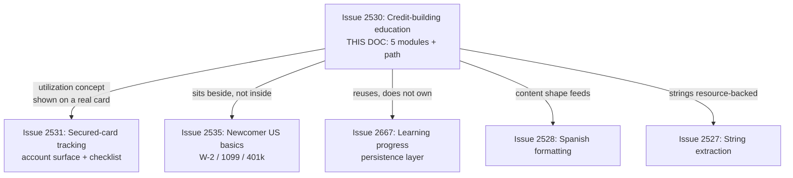
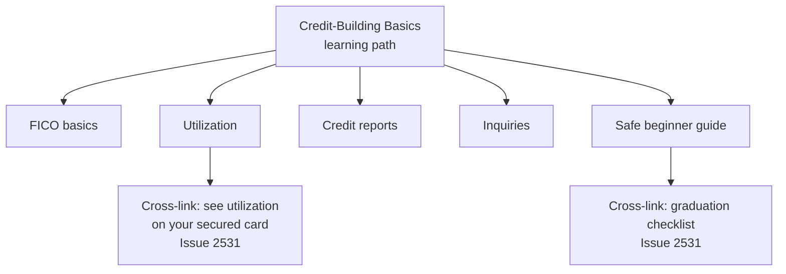
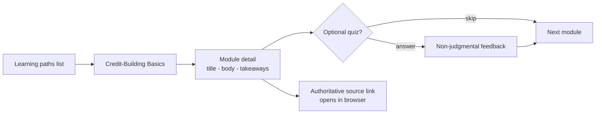
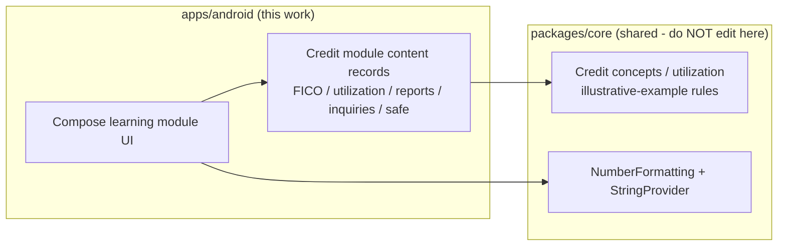

# Android Credit-Building Education Path

> **Status:** PROPOSED — Pending human review
> **Issue:** [#2530](https://github.com/jrmoulckers/finance/issues/2530) · Part of [#2174](https://github.com/jrmoulckers/finance/issues/2174)
> **Platform:** Android (Compose education modules, learning paths)
> **Last Updated:** 2026-06-22
> **Design only:** Native implementation remains blocked by [#1242](https://github.com/jrmoulckers/finance/issues/1242)

---

## Table of Contents

1. [Purpose](#purpose)
2. [Persona and Why This Matters](#persona-and-why-this-matters)
3. [Goals and Non-Goals](#goals-and-non-goals)
4. [Scope Boundaries With Sibling Work](#scope-boundaries-with-sibling-work)
5. [Education Modules](#education-modules)
6. [Learning Path Structure](#learning-path-structure)
7. [Content Model and KMP Boundary](#content-model-and-kmp-boundary)
8. [Estimates, Sensitivity, and Tone](#estimates-sensitivity-and-tone)
9. [Localization and Text Expansion](#localization-and-text-expansion)
10. [Accessibility Considerations](#accessibility-considerations)
11. [Offline, Empty, and Error States](#offline-empty-and-error-states)
12. [Test Plan](#test-plan)
13. [Implementation Readiness](#implementation-readiness)
14. [References](#references)

---

## Purpose

A newcomer building credit from zero rarely arrives knowing what a FICO score is,
why a credit card kept at 90% utilization quietly hurts them, what a credit report
contains, or that a flurry of applications creates hard inquiries. The existing
Android learning surface ([`LearningPathContent.kt`](../../apps/android/src/main/kotlin/com/finance/android/ui/learning/LearningPathContent.kt),
rendered by [`LearningPathsScreen.kt`](../../apps/android/src/main/kotlin/com/finance/android/ui/learning/LearningPathsScreen.kt))
covers general budgeting, debt, and investing — it has **no credit-building path**.

This document designs a **plain-language credit-building learning path** — five
Compose education modules (FICO, utilization, credit reports, inquiries, and safe
beginner guidance), authored in English/Spanish and rendered from shared state. It
is **design and breakdown only** while [#1242](https://github.com/jrmoulckers/finance/issues/1242)
gates store distribution. It teaches; it never gives credit, legal, or financial
advice, and it never owns finance math.

---

## Persona and Why This Matters

The persona ([#2174](https://github.com/jrmoulckers/finance/issues/2174)): someone
new to US credit — perhaps a recent immigrant, a young adult, or anyone with a thin
or nonexistent credit file — who wants to build credit safely without falling into
fee traps or debt. They benefit from short, jargon-free explanations more than from
dashboards full of numbers. This intersects with [Persona 4: Casey](personas.md)
(plain-language, low cognitive load) and the broader newcomer cluster designed in
[android-newcomer-us-finance-education.md](android-newcomer-us-finance-education.md).

> **Important framing:** this is **financial _education_**, not credit, legal, or
> financial _advice_. Every module says so, links to authoritative primary sources
> (e.g. CFPB, AnnualCreditReport.gov), labels any number as an illustrative
> _estimate_, and never prescribes an action ("apply for X", "do Y"). See
> [Estimates, Sensitivity, and Tone](#estimates-sensitivity-and-tone).

---

## Goals and Non-Goals

**Goals**

- A dedicated **credit-building learning path** with five beginner modules: FICO
  basics, utilization, credit reports, hard/soft inquiries, and safe beginner
  guidance.
- Plain language, translatable copy, and an **English/Spanish** content shape that
  feeds [#2528](android-spanish-education-formatting.md) directly.
- Reuse the existing `LearningPath` / `LearningModule` / `QuizQuestion` scaffolding
  rather than inventing a parallel UI.
- Clear cross-links to the **secured-card tracking** surface
  ([android-secured-card-tracking.md](android-secured-card-tracking.md)) so a
  learner who understands utilization can see it reflected on their own card.

**Non-Goals**

- Pulling, scoring, or estimating the user's _real_ credit score (no bureau
  integration, no score simulation in this work — illustrative examples only).
- Tax, legal, immigration, or credit _advice_ of any kind.
- Editing KMP `packages/*` or any non-Android platform.
- Learning-progress persistence mechanics (owned by
  [android-learning-progress-persistence.md](android-learning-progress-persistence.md)),
  string-extraction mechanics (owned by
  [android-string-resource-migration-audit.md](android-string-resource-migration-audit.md)),
  and Spanish copy review (owned by
  [android-spanish-education-formatting.md](android-spanish-education-formatting.md)).

---

## Scope Boundaries With Sibling Work

This doc owns **only** the credit-building education content and its learning-path
surface. Where a concept (utilization) has a concrete in-app expression, it
**cross-links** to the secured-card surface rather than duplicating it.

---

## Education Modules

Each module is short, plain-language, and structured like existing learning modules
(title, body, key takeaways, optional non-gating quiz) so it slots into the current
[`LearningPath` / `LearningModule`](../../apps/android/src/main/kotlin/com/finance/android/ui/learning/LearningPathContent.kt)
model. Glossary terms reuse [`FinancialConceptContent.kt`](../../apps/android/src/main/kotlin/com/finance/android/ui/education/FinancialConceptContent.kt).

| Module              | One-line scope                                                       | Key takeaway focus                                                          |
| ------------------- | -------------------------------------------------------------------- | --------------------------------------------------------------------------- |
| FICO basics         | What a credit score is, roughly what moves it, and what it is _for_. | Payment history + amounts owed matter most; range is a band, not a verdict. |
| Utilization         | What "using a percentage of your limit" means and why lower helps.   | Keeping balances low relative to the limit generally helps over time.       |
| Credit reports      | What a credit report is, who issues it, and how to read one.         | You can get reports for free; checking your own does not hurt your score.   |
| Inquiries           | Hard vs. soft inquiries and why many applications at once can hurt.  | Checking your own (soft) is safe; many hard pulls cluster as risk.          |
| Safe beginner guide | Low-risk habits for building credit from zero, fee-trap awareness.   | Pay on time, keep balances low, avoid fee traps; building takes time.       |

**Content rules**

- Define every acronym on first use (FICO, APR, utilization); assume no prior
  knowledge.
- All amounts and any score figure are **illustrative and obviously fictional**,
  visibly labelled as an _estimate / example_ — never the user's real number.
- Every module ends with "this is general education, not financial or credit
  advice" plus a link to an authoritative primary source (CFPB,
  AnnualCreditReport.gov) instead of an in-app instruction to act.
- The optional quiz (reusing `QuizQuestion`) reinforces understanding and **never
  gates** progression or unlocks features.

---

## Learning Path Structure

The credit-building path is a new `LearningPath` entry alongside the existing
budgeting/investing/debt paths. It does not change path ordering logic or the
in-memory model — it adds content.

- Progress (completed modules, resume pointer, quiz scores) is **read from** the
  persistence layer in [android-learning-progress-persistence.md](android-learning-progress-persistence.md);
  this doc does not re-design persistence.
- The path renders through the existing
  [`LearningPathViewModel`](../../apps/android/src/main/kotlin/com/finance/android/ui/learning/LearningPathViewModel.kt)
  state; Compose stays a pure renderer.

---

## Content Model and KMP Boundary

Education content is _content_, but **any reusable business rule (e.g. a utilization
ratio, a score-band lookup, an illustrative example calculation) stays in KMP
`packages/core`**. Compose renders shared state; it never computes credit math
locally.

**Content storage decision (to confirm in implementation):**

- Short labels/titles → Android string resources (localizable via
  [#2527](android-string-resource-migration-audit.md) /
  [#2528](android-spanish-education-formatting.md)).
- Long-form module bodies → structured content records (as today's
  `LearningModule`) whose **text fields remain resource-backed or
  translation-managed**, so Spanish coverage is achievable. Long prose as raw
  Kotlin literals is disallowed.
- Any numeric example that touches a ratio or band defers to shared KMP rules and
  [`NumberFormatting`](../../packages/core/src/commonMain/kotlin/com/finance/core/i18n/NumberFormatting.kt) /
  [`StringProvider`](../../packages/core/src/commonMain/kotlin/com/finance/core/i18n/StringProvider.kt);
  the module never re-implements finance math.

> This document **describes** the boundary. It does not implement KMP changes —
> `packages/core` is owned by @native-app-engineer.

---

## Estimates, Sensitivity, and Tone

This content is high-trust. Non-negotiables:

- **No advice framing, ever.** Every module is labelled financial _education_, not
  financial/credit/legal advice, and links to a primary source rather than telling
  the user to take an action.
- **Label every estimate.** Any score or dollar figure is an illustrative
  _example_, visibly marked as such, never represented as the user's real score or
  a prediction of it. No score "simulator".
- **Never log sensitive data.** Per the observability guardrails, do not log any
  real or example score, balance, or limit through Timber; calls must omit them.
- **Inclusive, non-judgmental tone** per
  [content-language-guidelines.md](content-language-guidelines.md): building credit
  from zero is normal, not a failing; avoid shame or pressure language.
- **No dark patterns.** No urgency, no "apply now" nudges, no affiliate framing.

---

## Localization and Text Expansion

- All module text is **resource-backed and translatable**, feeding Spanish coverage
  ([#2528](android-spanish-education-formatting.md)). US credit terms (FICO, hard
  inquiry) often lack a short Spanish equivalent, so expect **25–30%+ expansion**;
  design module cards and takeaway chips to wrap, never clip.
- Keep proper nouns/acronyms (FICO, APR) as-is across languages but localize the
  surrounding explanation.
- Validate layouts under the `en-XA` pseudolocale and at `2.0x` font scale; verify
  RTL safety with `ar-XB`.

---

## Accessibility Considerations

- **TalkBack:** every module card, quiz option, source link, and cross-link carries
  a meaningful `contentDescription`; reading order follows module structure
  (title → body → takeaways → quiz → source). Estimate labels are spoken ("example
  score, not your real score").
- **Switch Access:** quiz controls, links, and the path list are reachable and
  operable with adequate (≥ 48dp) touch targets.
- **Font scaling:** all education prose stays readable and unclipped at **200%**
  font scale; no fixed-height text containers.
- **Plain language / cognitive load:** one concept per screen, short sentences,
  glossary cross-links — aligned with
  [cognitive-accessibility.md](cognitive-accessibility.md).
- **Non-color cues:** any "good/caution" framing of an example utilization uses
  text/icon, not color alone.
- See [accessibility-patterns.md](accessibility-patterns.md) for the underlying
  patterns.

---

## Offline, Empty, and Error States

- **Offline:** credit-building content is static and must be **fully available
  offline** — bundle it with the app, do not fetch at read time. A learner on a
  budget device with intermittent data must still learn. Authoritative source links
  open the browser only when tapped, with a graceful "no connection" message.
- **Empty:** if the path renders before content loads (or a future locale lacks a
  module), show a helpful empty state ("more guides coming") rather than a blank
  screen.
- **Error:** if a source link cannot open, fail safe with a non-judgmental message
  and the plain URL to copy; never block the learner from continuing the module.

---

## Test Plan

| Layer              | Tooling                         | What it verifies                                                                 |
| ------------------ | ------------------------------- | -------------------------------------------------------------------------------- |
| Unit               | JUnit                           | Each of the five modules has title/body/takeaways; path registers in the list.   |
| Unit (safety)      | JUnit                           | Every module carries an "education, not advice" disclaimer + a source link.      |
| Compose UI         | `createComposeRule` + semantics | Module text, quiz options, and `contentDescription` resolve from resources.      |
| Snapshot           | Paparazzi                       | FICO/utilization/reports/inquiries/safe cards at `{en, en-XA, es}` × `{1x, 2x}`. |
| Pseudolocalization | `en-XA` / `ar-XB`               | Expansion + mirroring for long credit prose.                                     |
| Accessibility      | Espresso/Accessibility checks   | TalkBack order, Switch Access reachability, touch targets ≥ 48dp.                |
| Behavior           | Espresso                        | Quiz never gates progression; estimate labels are present and announced.         |

---

## Implementation Readiness

This is a design artifact. Execution splits into a **buildable-now** tier and a
**Play-distribution tail** gated by
[#1242](https://github.com/jrmoulckers/finance/issues/1242). See
[../ops/human-gated-prerequisites.md](../ops/human-gated-prerequisites.md) and
[../ops/launch-readiness-plan.md](../ops/launch-readiness-plan.md).

**Buildable now — `assembleDebug` + sideload (no human gate):**

- Author the five credit-building modules as resource-backed content records and
  register the new learning path.
- Wire any illustrative example to shared KMP rules / formatting (render-only).
- Verify offline availability, accessibility, and pseudolocale/expansion snapshots
  on a debug build / emulator.

**Play-distribution tail — human-gated by [#1242](https://github.com/jrmoulckers/finance/issues/1242):**

- Production signing + Play Console listing.
- Any store-level content declaration referencing educational/financial content.
- Staged rollout / internal testing track.

Everything in the buildable-now tier runs on an emulator with **no signing, store
credentials, or human-gated operations**. Spanish rendering is delivered through
[#2528](android-spanish-education-formatting.md).

---

## References

**Design docs**

- [android-secured-card-tracking.md](android-secured-card-tracking.md) — secured-card surface + checklist (#2531)
- [android-newcomer-us-finance-education.md](android-newcomer-us-finance-education.md) — sibling newcomer education (#2535)
- [android-itin-onboarding-profile.md](android-itin-onboarding-profile.md) — onboarding profile capture (#2532)
- [android-learning-progress-persistence.md](android-learning-progress-persistence.md) — progress persistence (#2667)
- [android-string-resource-migration-audit.md](android-string-resource-migration-audit.md) — string extraction + lint (#2527)
- [android-spanish-education-formatting.md](android-spanish-education-formatting.md) — Spanish coverage (#2528)
- [content-language-guidelines.md](content-language-guidelines.md) — non-judgmental, inclusive copy
- [accessibility-patterns.md](accessibility-patterns.md) — screen reader, focus, touch targets
- [cognitive-accessibility.md](cognitive-accessibility.md) — plain-language and load reduction
- [information-architecture.md](information-architecture.md) — surface and navigation map
- [ux-principles.md](ux-principles.md) — product UX principles
- [personas.md](personas.md) — Persona 4 (Casey)

**Ops**

- [../ops/human-gated-prerequisites.md](../ops/human-gated-prerequisites.md) — buildable-now vs. gated split
- [../ops/launch-readiness-plan.md](../ops/launch-readiness-plan.md) — launch checklist

**Android / KMP (read-only boundary)**

- [`LearningPathContent.kt`](../../apps/android/src/main/kotlin/com/finance/android/ui/learning/LearningPathContent.kt) — existing module model
- [`LearningPathViewModel.kt`](../../apps/android/src/main/kotlin/com/finance/android/ui/learning/LearningPathViewModel.kt) — existing path state
- [`FinancialConceptContent.kt`](../../apps/android/src/main/kotlin/com/finance/android/ui/education/FinancialConceptContent.kt) — existing glossary content
- [`NumberFormatting.kt`](../../packages/core/src/commonMain/kotlin/com/finance/core/i18n/NumberFormatting.kt) — shared formatting (owned by @native-app-engineer)

**Issues**

- [#2530](https://github.com/jrmoulckers/finance/issues/2530) — this issue
- [#2174](https://github.com/jrmoulckers/finance/issues/2174) — parent (credit education + secured-card support)
- [#1242](https://github.com/jrmoulckers/finance/issues/1242) — Play Console + keystore (gate)
