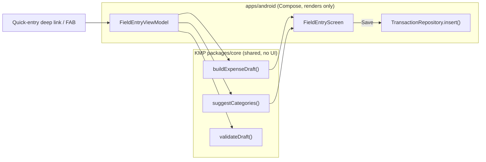
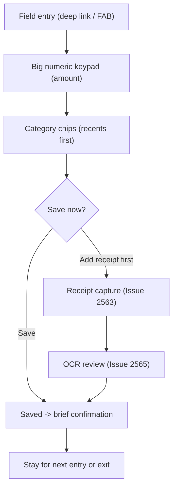

# Android Field-Mode Transaction & Receipt Flow — Design

> **Status:** Design / breakdown only — native implementation gated by [#1242](https://github.com/jrmoulckers/finance/issues/1242)
> **Issue:** [#2561](https://github.com/jrmoulckers/finance/issues/2561) · **Part of:** [#2186](https://github.com/jrmoulckers/finance/issues/2186)
> **Platform:** Android (Jetpack Compose + Material 3 · Glance) · **minSdk 28 / target 35** · **Audience:** Android engineers, design, QA

This document designs **Field mode** — a simplified, one-handed, glove-friendly
flow for **adding an expense, picking a category, and (optionally) attaching a
receipt** while working: wet hands, sunlight, cold fingers, a budget phone in one
hand. It is the navigation/interaction companion to
[Android Rugged Mode — Design Tokens & Preference](./android-rugged-mode-tokens.md)
([#2559](https://github.com/jrmoulckers/finance/issues/2559)); rugged mode owns
the _look and sizing_, this doc owns the _flow_.

It is a **design / breakdown only** document and adds **no native code** while
production signing and Play distribution remain blocked by
[#1242](https://github.com/jrmoulckers/finance/issues/1242).

The guiding rule, as everywhere in the Android client: **Compose renders shared
state; it does not own finance math.** Draft assembly, category suggestion, and
validation already live in Kotlin Multiplatform (KMP)
[`packages/core`](../../packages/core/). Field mode is a thinner, larger-target
_presentation_ of that same shared draft — never a second source of truth.

---

## Table of Contents

1. [Goals & non-goals](#1-goals--non-goals)
2. [Personas & jobs to be done](#2-personas--jobs-to-be-done)
3. [The Compose-renders-shared-state boundary](#3-the-compose-renders-shared-state-boundary)
4. [Field-mode navigation model](#4-field-mode-navigation-model)
5. [Simplified add-expense flow](#5-simplified-add-expense-flow)
6. [Category selection](#6-category-selection)
7. [Receipt attachment entry point](#7-receipt-attachment-entry-point)
8. [Offline-first, empty, and error states](#8-offline-first-empty-and-error-states)
9. [Accessibility](#9-accessibility)
10. [Test plan](#10-test-plan)
11. [Implementation readiness](#11-implementation-readiness)
12. [Cross-links](#12-cross-links)

---

## 1. Goals & non-goals

### Goals

- Provide a **two-tap-to-save** expense flow optimised for the field: amount →
  category → save, with everything else deferred or pre-filled.
- Make every primary action **bottom-reachable and large** (≥ 56 dp) so it works
  one-handed with gloves on a budget device.
- Offer an **optional** receipt attachment without making it a required step —
  the user can save now and attach later.
- Reuse the **existing shared draft and save path** so field mode produces a
  normal [`Transaction`](../../packages/models/src/commonMain/kotlin/com/finance/models/Transaction.kt),
  not a special-case record.
- Be **offline-first**: every field-mode action works with no connectivity.

### Non-goals

- The visual token profile (contrast, sizing, motion) — owned by
  [Android Rugged Mode — Design Tokens & Preference](./android-rugged-mode-tokens.md)
  ([#2559](https://github.com/jrmoulckers/finance/issues/2559)).
- Receipt _capture_ (CameraX, permissions, crop/retake) — designed in
  [Android CameraX Receipt Capture & Fallback](./android-cameraX-receipt-capture.md)
  ([#2563](https://github.com/jrmoulckers/finance/issues/2563)).
- OCR review/correction → draft — designed in
  [Android Receipt OCR Review → Transaction Draft](./android-receipt-ocr-review-draft.md)
  ([#2565](https://github.com/jrmoulckers/finance/issues/2565)) and
  [Android Receipt-to-Expense Draft Flow](./android-receipt-to-expense-draft.md).
- Any change to KMP finance rules, money math, or category logic.

---

## 2. Personas & jobs to be done

The driving persona from [#2186](https://github.com/jrmoulckers/finance/issues/2186)
is a **mobile/field worker** — gig driver, food-truck operator, on-site trades —
who must log a purchase _between tasks_, not at a desk. See
[User Personas & MVP Scope](./personas.md).

Jobs this flow must satisfy:

- "Log a **cash or card expense in seconds** while I keep working."
- "Pick the **right category without reading tiny rows** in the sun."
- "**Snap a receipt if I have time**, otherwise just save and move on."

Each job maps to a section: fast save (§4–§5), category (§6), receipt (§7).

This flow reuses the canonical quick-entry destination from
[Android Cash Quick-Entry Deep Links](./android-cash-quick-entry-deep-links.md)
([#2538](https://github.com/jrmoulckers/finance/issues/2538)); field mode is the
**enlarged, simplified rendering** of that same prefilled draft, not a new entry
point.

---

## 3. The Compose-renders-shared-state boundary

| Concern                               | Where it lives                                                                                                  | Notes                                                         |
| ------------------------------------- | --------------------------------------------------------------------------------------------------------------- | ------------------------------------------------------------- |
| Draft assembly & validation           | KMP [`packages/core`](../../packages/core/)                                                                     | Amount (cents), category, payment hint, required-field rules. |
| Category suggestion / recents ranking | KMP `packages/core`                                                                                             | Shared ranking; Compose only renders the ordered list.        |
| Money formatting                      | [`CurrencyFormatter`](../../packages/core/src/commonMain/kotlin/com/finance/core/currency/CurrencyFormatter.kt) | Integer cents in, localized string out.                       |
| Field-mode layout & navigation        | `apps/android` Compose                                                                                          | Larger targets, bottom-anchored actions, fewer steps.         |
| Display sizing/contrast/motion        | Rugged tokens ([#2559](https://github.com/jrmoulckers/finance/issues/2559))                                     | Field mode consumes; does not define.                         |

**Boundary rules**

- The field-mode ViewModel calls shared draft/validation/suggestion functions and
  exposes their results as immutable UI state. It never re-implements totals, tax,
  or category rules in Kotlin/JVM code.
- All money is integer **cents**; Compose only formats for display.
- "Field mode" is a presentation flag — it changes step count, target size, and
  reachability, never the underlying draft semantics or the saved record shape.

---

## 4. Field-mode navigation model

Field mode collapses the standard multi-step create wizard into a **single
bottom-sheet-style screen** where the most likely actions are within thumb reach.

| Principle          | Implementation                                                           |
| ------------------ | ------------------------------------------------------------------------ |
| One-handed         | Primary actions pinned to the bottom; nothing critical in the top inset. |
| Few steps          | Amount + category visible at once; save always reachable.                |
| Forgiving touch    | ≥ 56 dp targets, generous spacing, no swipe-to-act, no long-press-only.  |
| Defer the optional | Receipt, notes, account override are secondary, never blocking save.     |
| Reuse, don't fork  | Saves through the same shared draft + repository as the standard flow.   |

| Composable            | Type          | Responsibility                                                 |
| --------------------- | ------------- | -------------------------------------------------------------- |
| `FieldEntryScreen`    | `@Composable` | Hosts the keypad, category chips, and bottom action bar.       |
| `FieldAmountKeypad`   | `@Composable` | Large numeric entry feeding shared cents.                      |
| `FieldCategoryChips`  | `@Composable` | Horizontally scannable, recents-first category targets.        |
| `FieldActionBar`      | `@Composable` | Bottom-anchored Save / Add receipt / Cancel.                   |
| `FieldEntryViewModel` | `ViewModel`   | Owns the shared draft state; calls KMP draft/suggest/validate. |

---

## 5. Simplified add-expense flow

- **Amount first.** A large numeric keypad with a prominent running total. The
  value is held as integer **cents** in the shared draft; Compose formats it via
  [`CurrencyFormatter`](../../packages/core/src/commonMain/kotlin/com/finance/core/currency/CurrencyFormatter.kt).
- **Sensible defaults.** Payment method and account default to the user's
  configured field defaults (see
  [Quick-Add Defaults & Persistence](./android-quick-add-defaults-persistence.md)),
  so a typical save needs only amount + category.
- **Save is always reachable.** The bottom `FieldActionBar` keeps **Save** enabled
  once the shared `validateDraft()` reports the required fields are present;
  validation errors surface inline and via an assertive live region.
- **Stay-to-continue.** After save, a brief confirmation offers "Add another" so a
  user logging several field purchases in a row never leaves the flow.

This flow reuses the proven save path rather than forking it — it produces a
normal [`Transaction`](../../packages/models/src/commonMain/kotlin/com/finance/models/Transaction.kt)
through the existing repository, queued locally and synced later when online.

---

## 6. Category selection

Category selection is the highest-friction step in the sun, so field mode makes it
**scan-fast and large**:

- **Recents first.** The shared `suggestCategories()` ranking (recency +
  frequency, computed in KMP) drives the chip order; Compose only renders it.
- **Big chips, not tiny rows.** Each category is a ≥ 56 dp chip with an icon +
  label (icon from the shared [icon system](./icon-system.md)), so it reads at a
  glance and is glove-tappable.
- **Search as escape hatch.** A single tap expands a searchable full list for the
  rare uncommon category; the field default is the chip grid.
- **Color is never the only signal.** Category is conveyed by icon + label, not
  hue alone, satisfying the contrast guidance in the patterns library.

No category math happens on the Android side — the chip order and the resulting
category id come straight from shared state.

---

## 7. Receipt attachment entry point

Receipt attachment in field mode is **optional and deferrable**. The
`FieldActionBar` offers **Add receipt** as a secondary action that hands off to
the existing receipt cluster and returns to the same draft:

1. **Capture** — [Android CameraX Receipt Capture & Fallback](./android-cameraX-receipt-capture.md)
   ([#2563](https://github.com/jrmoulckers/finance/issues/2563)) produces a
   full-resolution image on-device.
2. **OCR review** — [Android Receipt OCR Review → Transaction Draft](./android-receipt-ocr-review-draft.md)
   ([#2565](https://github.com/jrmoulckers/finance/issues/2565)) lets the user
   confirm/correct extracted fields, merging them into the **same** field-mode
   draft.
3. **Attachment** — persistence and COGS mapping are handled by
   [Android Receipt Attachments & COGS Mapping](./android-receipt-attachments-cogs.md)
   ([#2549](https://github.com/jrmoulckers/finance/issues/2549)).

Crucially, **save never depends on the receipt**. The user can save the expense
now and attach a receipt later; the attachment links to the already-saved
transaction. All capture and OCR stay on-device (privacy-preserving — see §8).

---

## 8. Offline-first, empty, and error states

| State                   | Trigger                                  | UX                                                                            |
| ----------------------- | ---------------------------------------- | ----------------------------------------------------------------------------- |
| Empty / first entry     | Screen opened with no amount             | Keypad focused; "Enter an amount to start" hint; Save disabled until valid.   |
| No connectivity         | Airplane mode / dead zone                | Everything works; draft saved locally; optional "Saved — will sync later".    |
| Validation error        | `validateDraft()` flags a required field | Inline error + assertive live region; focus moves to the first invalid field. |
| Save failure            | Repository `insert` throws               | Non-destructive error card with **Retry**; the draft is preserved.            |
| Receipt unavailable     | Camera/ML Kit unavailable                | Save still works; receipt step degrades to gallery/manual per #2563.          |
| Process death mid-entry | App killed before save                   | `SavedStateHandle` restores amount/category so nothing is retyped.            |

No financial data (amounts, totals, account numbers) is ever written to Timber.
Structured logs capture flow milestones only (for example "field draft saved")
via `Timber.d`/`Timber.w` with **no** sensitive values, per the client logging
rules.

---

## 9. Accessibility

This flow targets WCAG 2.2 AA and follows the shared
[Accessibility Patterns Library](./accessibility-patterns.md). Because field mode
is used in hostile conditions, accessibility _is_ the core requirement.

- **TalkBack:** The amount announces its running value ("Amount, 12 dollars 50
  cents"); each category chip exposes label + selected state; Save announces its
  action and result. Headings use `semantics { heading() }`.
- **Switch Access:** Logical top-to-bottom focus ending on the bottom action bar;
  every action is a single, large, single-purpose target. No action depends on a
  gesture, swipe, or long-press only.
- **200% font scaling:** All text uses `sp` and wraps; the keypad and chips grow
  in height rather than truncating. The action bar collapses to a vertical stack
  at large scale without clipping Save.
- **High contrast / sunlight / gloves:** When [rugged mode](./android-rugged-mode-tokens.md)
  is on, targets grow to ≥ 56 dp, contrast rises, and motion reduces — field mode
  consumes those tokens directly. State is shown by text + icon + shape, never
  color alone.
- **Wet-screen safety:** Generous hit slop; destructive actions (cancel/discard)
  always confirm; no swipe-to-delete in the field path.
- **Live regions:** Validation errors and save confirmation use an assertive live
  region so non-visual users hear the outcome immediately.

---

## 10. Test plan

| Layer                | Tooling                | Coverage                                                                                                                                                           |
| -------------------- | ---------------------- | ------------------------------------------------------------------------------------------------------------------------------------------------------------------ |
| Unit (ViewModel)     | JUnit + coroutine test | Draft built from shared functions; amount held as cents; Save gates on shared `validateDraft()`; defaults applied; offline save queues locally.                    |
| Unit (state machine) | JUnit                  | `Entering → Valid → Saving → Saved` transitions; error path preserves the draft; process-death restore from `SavedStateHandle`; "add another" resets cleanly.      |
| Compose UI           | `compose-ui-test`      | Keypad/chip targets ≥ 56 dp; Save disabled until valid; category recents order matches shared ranking; semantics/`contentDescription` assertions; font-scale 2.0f. |
| Snapshot             | Paparazzi              | `FieldEntryScreen` in: empty, valid, validation-error, saving, saved — at default and 200% font scale, standard vs. rugged theme, light/dark.                      |

Shared business rules (`buildExpenseDraft`, `suggestCategories`, `validateDraft`)
are covered by existing `packages/core` tests and are **not** re-tested here —
only the Android rendering, navigation, and save wiring are.

---

## 11. Implementation readiness

This is a design artifact. Implementation splits into a part that is fully
buildable today and a tail that is gated by Play onboarding.

See [Human-Gated Prerequisites](../ops/human-gated-prerequisites.md) and the
[Launch Readiness Plan](../ops/launch-readiness-plan.md) for the gating context.

### Buildable now (debug, no human gate)

- `FieldEntryScreen`, `FieldEntryViewModel`, the keypad/chips/action-bar
  composables, state model, and Koin wiring are pure Compose + KMP consumption —
  fully implementable and runnable via `./gradlew :apps:android:assembleDebug`
  and sideload.
- Save wiring reuses the existing local `TransactionRepository`; verifiable with
  unit, Compose, and Paparazzi tests on CI and emulator/sideload.
- The receipt entry point degrades gracefully (gallery/manual) so the flow is
  testable without store presence.

### Play-distribution tail (gated by [#1242](https://github.com/jrmoulckers/finance/issues/1242))

- Production signing keystore + Google Play Console onboarding.
- Internal-testing-track upload, privacy declarations, and staged rollout.
- Anything requiring a release-signed AAB (not `assembleDebug`).

No part of the field-mode flow itself is blocked from being built and tested in
debug; only its production distribution is.

---

## 12. Cross-links

- Sibling: [Android Rugged Mode — Design Tokens & Preference](./android-rugged-mode-tokens.md) — [#2559](https://github.com/jrmoulckers/finance/issues/2559)
- Sibling: [Android Receipt OCR Review → Transaction Draft](./android-receipt-ocr-review-draft.md) — [#2565](https://github.com/jrmoulckers/finance/issues/2565)
- [Android CameraX Receipt Capture & Fallback](./android-cameraX-receipt-capture.md) — [#2563](https://github.com/jrmoulckers/finance/issues/2563)
- [Android Receipt-to-Expense Draft Flow](./android-receipt-to-expense-draft.md) · [Android Receipt Attachments & COGS Mapping](./android-receipt-attachments-cogs.md)
- [Android Cash Quick-Entry Deep Links](./android-cash-quick-entry-deep-links.md) · [Quick-Add Defaults & Persistence](./android-quick-add-defaults-persistence.md)
- [Accessibility Patterns Library](./accessibility-patterns.md) · [Cognitive Accessibility Mode](./cognitive-accessibility.md) · [Icon System](./icon-system.md)
- [Component Library](./component-library.md) · [UX Design Principles](./ux-principles.md) · [Content & Language Guidelines](./content-language-guidelines.md)
- [Android Architecture](../architecture/android-architecture.md) · [Data Model](./data-model.md) · [Information Architecture](./information-architecture.md) · [User Personas](./personas.md)
- Ops: [Human-Gated Prerequisites](../ops/human-gated-prerequisites.md) · [Launch Readiness Plan](../ops/launch-readiness-plan.md)
