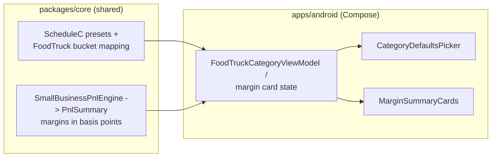
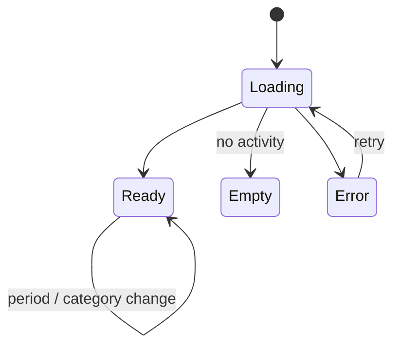

# Android Food-Truck Category Defaults & Margin Cards — Design

> **Status:** PROPOSED — Pending human review
> **Issue:** #2553 · **Part of** #2184
> **Platform:** Android (Jetpack Compose · Material 3)
> **Priority:** P1 · **Effort:** L (1–2 weeks)
> **Last Updated:** 2026-06-22

This document specifies the Android design for **(a)** small-business/food-truck
**category defaults** that pre-classify income and expenses into the P&L buckets,
and **(b)** **margin summary cards** that surface gross/net margin and food-cost
at a glance. It complements the P&L report template
([`android-foodtruck-pnl-report.md`](./android-foodtruck-pnl-report.md), #2551) by
defining how raw activity becomes the categorized inputs that report aggregates.

> **User story (#2184):** _"As a food-truck owner, I want sensible default
> categories and quick margin cards so I can see whether each week is healthy
> without building a spreadsheet."_

---

## Table of Contents

1. [Goals & Non-Goals](#1-goals--non-goals)
2. [Architecture Boundary (Compose ↔ KMP)](#2-architecture-boundary-compose--kmp)
3. [Affected Android Surfaces](#3-affected-android-surfaces)
4. [Shared Dependencies](#4-shared-dependencies)
5. [Category Defaults](#5-category-defaults)
6. [Margin Summary Cards](#6-margin-summary-cards)
7. [UI States: Loading, Empty, Error, Offline](#7-ui-states-loading-empty-error-offline)
8. [Accessibility (TalkBack)](#8-accessibility-talkback)
9. [Test Plan](#9-test-plan)
10. [Implementation Readiness](#10-implementation-readiness)
11. [Open Questions](#11-open-questions)

---

## 1. Goals & Non-Goals

**Goals**

- Provide a curated set of **default categories** for food-truck operators that
  map cleanly onto the four P&L buckets — **Revenue, COGS, Labor, Overhead** — and
  carry IRS Schedule C alignment for later tax workflows.
- Present **margin summary cards** (Gross Margin, Net Margin, Food-Cost %, Net
  Profit) that an operator can scan in seconds, reusing the same shared engine
  output as the full P&L report.
- Make categorizing a transaction a one-tap action from sensible defaults.
- Be fully **offline-first** and **TalkBack**-accessible.

**Non-Goals**

- No new finance math in Compose — margins/ratios come from the shared engine
  (see [§2](#2-architecture-boundary-compose--kmp)).
- No automatic ML categorization in this issue (defaults + manual selection only;
  ML categorization tracked separately).
- No editing of the canonical Schedule C taxonomy from Android — presets are
  read-only shared data; user overrides are per-transaction.

---

## 2. Architecture Boundary (Compose ↔ KMP)

**The rule:** the **list of default categories**, their **P&L bucket mapping**,
their **Schedule C alignment**, and all **margin math** live in KMP. Compose
renders the presets and the computed margins; it owns only layout, labels, and
selection state.

Two shared sources already exist:

- **Category defaults / tax taxonomy:**
  [`packages/core/.../schedulec/ScheduleCDeductionPresets.kt`](../../packages/core/src/commonMain/kotlin/com/finance/core/schedulec/ScheduleCDeductionPresets.kt)
  — `ScheduleCDeductionPresetTaxonomy.presets` with `displayName`, `irsLine`,
  `description`, `examples`, and `defaultBusinessUsePercent`.
- **Margins:**
  [`packages/core/.../pnl/SmallBusinessPnlEngine.kt`](../../packages/core/src/commonMain/kotlin/com/finance/core/pnl/SmallBusinessPnlEngine.kt)
  — `PnlSummary.grossMarginBasisPoints`, `netMarginBasisPoints`,
  `foodCostBasisPoints` (basis points, `10_000 = 100.00%`).

The **food-truck default mapping** (which preset/category belongs to Revenue vs.
COGS vs. Labor vs. Overhead) is a reusable business rule and therefore belongs in
KMP. If a `FoodTruckCategoryDefaults` provider does not yet exist in
`packages/core`, it must be added **by the KMP engineer** (out of scope for this
Android issue); Android consumes it read-only. Android must **not** hard-code the
mapping in Compose.

| Concern                                                         | Owner                                                             |
| --------------------------------------------------------------- | ----------------------------------------------------------------- |
| Default category list, display names, examples, Schedule C line | KMP `ScheduleCDeductionPresetTaxonomy`                            |
| Mapping default categories → Revenue/COGS/Labor/Overhead bucket | KMP (`FoodTruckCategoryDefaults`, shared)                         |
| Gross/net margin, food-cost ratio                               | KMP `SmallBusinessPnlEngine`                                      |
| Selection state, chip/grid layout, labels                       | Android (presentation)                                            |
| Color/threshold treatment of "healthy vs. thin" margin          | Android (semantic styling; thresholds sourced from shared config) |
| Reading/writing the chosen category on a transaction            | Android repository (offline-first)                                |

---

## 3. Affected Android Surfaces

All paths under `apps/android/src/main/kotlin/com/finance/android/`.

**New**

- `ui/screens/report/foodtruck/components/MarginSummaryCards.kt` — a row/grid of
  Material 3 cards: **Gross Margin**, **Net Margin**, **Food-Cost %**, **Net
  Profit**. Pure presentation of `PnlSummary`.
- `ui/categorization/foodtruck/CategoryDefaultsPicker.kt` — a Compose picker
  showing the food-truck default categories grouped by P&L bucket, each with its
  Schedule C subtitle and examples.
- `ui/categorization/foodtruck/FoodTruckCategoryViewModel.kt` — `koinViewModel`;
  exposes the shared defaults and the current margin summary as one
  `StateFlow<FoodTruckCategoryUiState>`.

**Modified**

- `ui/components/CategoryPicker.kt` — add an optional "Food-truck defaults" tab/
  section that renders `CategoryDefaultsPicker` (entry point only; no mapping
  logic added in Compose).
- `ui/screens/report/foodtruck/PnlReportScreen.kt` (from #2551) — embed
  `MarginSummaryCards` above the statement card so the report and the summary
  cards share one source of truth.
- `ui/navigation/FinanceNavHost.kt` — no new top-level route required; cards live
  inside the P&L surface and the picker is reached from transaction entry.

**Reused (reference)**

- `ui/insights/InsightsScreen.kt` — Material 3 card + `semantics { heading() }`
  patterns.
- `ui/screens/report/ReportBuilderScreen.kt` — `FilterChip`/`SegmentedButton`
  patterns for the bucket grouping.

---

## 4. Shared Dependencies

| Dependency                                                                                 | Location                                                   | Use                                                |
| ------------------------------------------------------------------------------------------ | ---------------------------------------------------------- | -------------------------------------------------- |
| `ScheduleCDeductionPresetTaxonomy`, `ScheduleCDeductionPreset`, `ScheduleCExpenseCategory` | `packages/core/.../schedulec/ScheduleCDeductionPresets.kt` | Default category metadata + tax alignment          |
| `FoodTruckCategoryDefaults` (bucket mapping)                                               | `packages/core` (shared; added by KMP eng if absent)       | Maps defaults → P&L buckets                        |
| `SmallBusinessPnlEngine`, `PnlSummary`                                                     | `packages/core/.../pnl/SmallBusinessPnlEngine.kt`          | Margin/food-cost basis points                      |
| `Cents` / money formatting                                                                 | `packages/core/.../money`, `.../multicurrency`             | Display formatting                                 |
| Category & Transaction repositories                                                        | `apps/android/.../data/repository/`                        | Offline-first persistence                          |
| Koin modules                                                                               | `apps/android/.../di/`                                     | `viewModelOf(::FoodTruckCategoryViewModel)`        |
| Timber                                                                                     | `apps/android/.../logging/`                                | Logging (no amounts/category-level financial data) |

> **Boundary note:** Android consumes `packages/core` directly. All edits in this
> issue stay within `apps/android/`. Any new shared mapping is owned by the KMP
> engineer; this design only describes how Android reads it.

---

## 5. Category Defaults

Default categories are grouped by P&L bucket. The labels/Schedule C lines come
from `ScheduleCDeductionPresetTaxonomy`; the bucket assignment comes from the
shared `FoodTruckCategoryDefaults`. Representative starter set:

| P&L bucket   | Default category                                                                                                  | Schedule C line (shared)                   |
| ------------ | ----------------------------------------------------------------------------------------------------------------- | ------------------------------------------ |
| **Revenue**  | Truck sales, Catering, Event/festival sales                                                                       | — (income)                                 |
| **COGS**     | Food & ingredients, Beverages, Packaging/supplies                                                                 | Line 22 (Supplies) / COGS Part III         |
| **Labor**    | Crew wages, Contract labor                                                                                        | Line 26 (Wages) / Line 11 (Contract labor) |
| **Overhead** | Commissary/booth rent, Fuel & vehicle, Permits & licenses, Insurance, Repairs & maintenance, Card-processing fees | Lines 20b, 9, 23, 15, 21, 10               |

**Picker behavior**

- Defaults render as Material 3 cards/chips grouped under bucket headers; each
  shows the category name, a one-line description, and up to three `examples`
  (from the shared preset) to disambiguate.
- Selecting a default writes the chosen category onto the transaction via the
  repository (offline-first). The default `defaultBusinessUsePercent` is carried
  through for later Schedule C use but is **not** edited here.
- An operator can still pick any existing category; defaults are a fast path, not
  a restriction.
- The set is **read-only shared data** — Android never mutates the taxonomy.

---

## 6. Margin Summary Cards

A compact, scannable summary computed entirely from one `PnlSummary` for the
selected period (same engine call as the P&L report — never a second, divergent
computation).

| Card             | Source field             | Display                          |
| ---------------- | ------------------------ | -------------------------------- |
| **Gross Margin** | `grossMarginBasisPoints` | `xx.x%` (Gross Profit ÷ Revenue) |
| **Net Margin**   | `netMarginBasisPoints`   | `xx.x%` (Net Profit ÷ Revenue)   |
| **Food-Cost %**  | `foodCostBasisPoints`    | `xx.x%` (COGS ÷ Revenue)         |
| **Net Profit**   | `netProfitCents`         | currency, sign-aware             |

**Health styling (presentation only):** cards may apply a healthy / watch / thin
emphasis (e.g., food-cost in a typical 28–35% target band reads "healthy", above
reads "watch"). The **thresholds are sourced from shared config**, not hard-coded
math; Compose only maps a shared band value to a color + label. Color never
carries meaning alone — a text label ("Healthy", "Watch", "Thin") and an icon
accompany it.

**Zero-revenue:** ratio cards render `—` with the TalkBack label "not available,
no revenue this period"; the Net Profit card still renders (costs can exist with
no revenue).

---

## 7. UI States: Loading, Empty, Error, Offline

- **Loading** — shimmer placeholders for cards and picker; announces "Loading
  margins".
- **Empty** — no activity in range → cards show `—`; picker still shows the full
  default set so the operator can start categorizing.
- **Zero-revenue** — ratio cards `—`, Net Profit populated, inline hint "Add
  revenue to see margins".
- **Error** — repository/shared-data load failure → retry affordance; `Timber.e`
  without amounts.
- **Offline** — default mode; cards and defaults compute/read from the local
  encrypted store with no network dependency.

---

## 8. Accessibility (TalkBack)

Per [`docs/design/accessibility-patterns.md`](./accessibility-patterns.md) §5
(Color & Contrast) and §7 (Financial Data):

- Each margin card is a **single merged semantics node**:
  _"Gross Margin, 62.0 percent, healthy"_ — label, value, and health band read
  together. Use `Modifier.semantics(mergeDescendants = true)`.
- Health band is conveyed by **label + icon**, never color alone (WCAG 1.4.1).
- `—` ratio reads "not available, no revenue this period".
- Card group has a `heading()` ("Margin summary"); cards are reachable in a
  logical left-to-right, top-to-bottom order.
- Category defaults: each option exposes `contentDescription` combining bucket +
  name + Schedule C line, e.g. _"Overhead, Commissary rent, Schedule C line 20b"_;
  selected state announced ("selected").
- Touch targets ≥ 48×48 dp; cards/chips reflow under large font scaling without
  truncating the percentage or currency value.
- Contrast ≥ 4.5:1 for all card text and band emphasis.

---

## 9. Test Plan

**Android unit tests** (`apps/android/src/test/...`)

- `FoodTruckCategoryViewModelTest` — exposes shared defaults unchanged; maps a
  fixture `PnlSummary` to card display models; Empty/zero-revenue → `—`; Error on
  load failure; never computes a ratio itself (passes engine basis points through).
- `MarginCardFormattingTest` — bps→`xx.x%` and cents→currency, including `—`
  placeholder and sign-aware Net Profit.

**Compose UI tests** (`apps/android/src/androidTest/...`)

- `MarginSummaryCardsTest` — renders four cards; zero-revenue shows `—`; health
  band label present; every card has a non-empty merged content description.
- `CategoryDefaultsPickerTest` — defaults grouped by bucket; selection writes back;
  Schedule C subtitle shown; all options have content descriptions.

**Snapshot tests (Paparazzi)**

- `MarginSummaryCardsSnapshotTest` — healthy / watch / thin / zero-revenue, light
  - dark, large font (1.5×/2.0×).

**Manual QA**

- Airplane mode: cards + defaults render from local data.
- TalkBack: cards read as single nodes with health band; picker order logical.
- Largest font: no truncated percentages.

---

## 10. Implementation Readiness

This is a **design deliverable**; implementation is unblocked up to distribution.
Per [`docs/ops/human-gated-prerequisites.md`](../ops/human-gated-prerequisites.md)
§2, "blocked by #1242" is a **distribution** gate only.

**Buildable now (SME-completable):**

- Compose cards/picker, ViewModel, Koin wiring, and all tests.
- Local verification: `./gradlew :apps:android:assembleDebug`,
  `:apps:android:testDebugUnitTest`, Paparazzi `verifyPaparazziDebug`, sideload.
- Shared `ScheduleCDeductionPresetTaxonomy` and `SmallBusinessPnlEngine` already
  exist. The only shared addition (food-truck bucket **mapping**) is owned by the
  KMP engineer and does not require any store enrollment.

**Distribution tail (human-gated by #1242):**

- Google Play signing/upload only — see
  [Android distribution checklist](../ops/human-gated-prerequisites.md#31-android-distribution--google-play-1242).

---

## 11. Open Questions

1. **Food-cost target band** — confirm the healthy/watch/thin thresholds (e.g.
   28–35% food cost) and whether they vary by cuisine; these belong in shared
   config, not Compose.
2. **Card-processing fees** — Overhead vs. COGS placement (also flagged in #2551).
3. **Default set ownership** — confirm the canonical food-truck default list lives
   in `packages/core` (`FoodTruckCategoryDefaults`) so iOS/Web/Windows reuse it.
