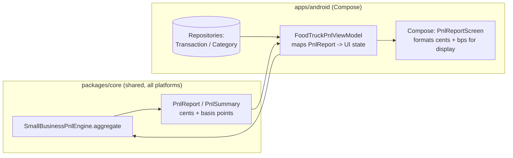
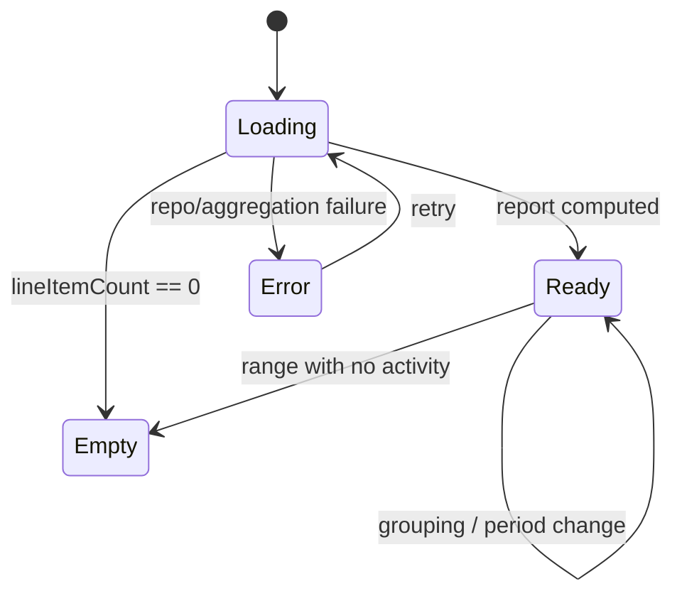

# Android Food-Truck P&L Report Template — Design

> **Status:** PROPOSED — Pending human review
> **Issue:** #2551 · **Part of** #2184
> **Platform:** Android (Jetpack Compose · Material 3)
> **Priority:** P1 · **Effort:** L (1–2 weeks)
> **Last Updated:** 2026-06-22

This document specifies the Android design for a weekly/monthly profit-and-loss
(P&L) report tailored to small-business and food-truck operators. It covers the
surfaces to build, the boundary between Compose UI and the shared Kotlin
Multiplatform (KMP) finance engine, offline/empty/error states, accessibility,
a test plan, and implementation readiness.

> **User story (#2184):** _"As a food-truck owner, I want a weekly/monthly P&L
> with COGS, labor, and margin breakdowns so I know whether the truck is making
> money."_

---

## Table of Contents

1. [Goals & Non-Goals](#1-goals--non-goals)
2. [Architecture Boundary (Compose ↔ KMP)](#2-architecture-boundary-compose--kmp)
3. [Affected Android Surfaces](#3-affected-android-surfaces)
4. [Shared Dependencies](#4-shared-dependencies)
5. [Report Template Layout](#5-report-template-layout)
6. [UI States: Loading, Empty, Error, Offline](#6-ui-states-loading-empty-error-offline)
7. [Accessibility (TalkBack)](#7-accessibility-talkback)
8. [Test Plan](#8-test-plan)
9. [Implementation Readiness](#9-implementation-readiness)
10. [Open Questions](#10-open-questions)

---

## 1. Goals & Non-Goals

**Goals**

- Render a **weekly** and **monthly** P&L report with the canonical small-business
  lines: **Revenue → COGS → Gross Profit → Labor → Overhead → Net Profit**, plus
  **Gross Margin** and **Net Margin** percentages.
- Let an operator switch the grouping (weekly/monthly) and the period range, and
  drill into a single period to see its contributing line items.
- Work fully **offline-first** against the local encrypted store; never block on
  network.
- Be fully operable with **TalkBack**, **Switch Access**, and large font scaling.

**Non-Goals**

- No finance math in Compose. All aggregation, margin, and rounding logic stays
  in KMP (see [§2](#2-architecture-boundary-compose--kmp)).
- No PDF/CSV export in this issue (the existing `ReportBuilder` export path is
  reused later; out of scope here).
- No multi-currency consolidation; reports render in the household default
  currency, mirroring `docs/design/data-model.md` money rules.
- No native release/signing work — distribution is gated (see [§9](#9-implementation-readiness)).

---

## 2. Architecture Boundary (Compose ↔ KMP)

**The rule:** Compose renders shared, pre-computed state. It does **not** sum
cents, compute margins, divide ratios, or pick period boundaries. All of that is
owned by the shared engine.

The shared engine already exists:
[`packages/core/.../pnl/SmallBusinessPnlEngine.kt`](../../packages/core/src/commonMain/kotlin/com/finance/core/pnl/SmallBusinessPnlEngine.kt).
It exposes `SmallBusinessPnlEngine.aggregate(...)` returning a `PnlReport` with:

- `summary: PnlSummary` and `periods: List<PnlPeriodReport>`.
- `PnlSummary` fields are integer cents (`revenueCents`, `cogsCents`,
  `laborCents`, `overheadCents`, `grossProfitCents`, `operatingExpenseCents`,
  `netProfitCents`) plus **basis-point** ratios (`grossMarginBasisPoints`,
  `netMarginBasisPoints`, `foodCostBasisPoints`) where `10_000 = 100.00%`.
- Weekly periods start Monday; monthly periods are calendar months (engine-owned).
- Zero-revenue periods return a `ZERO_REVENUE_RATIO_BASIS_POINTS` sentinel rather
  than dividing by zero — the UI maps this to a `—` placeholder, never `NaN`.

**Mapping responsibilities**

| Concern                                               | Owner                                                      |
| ----------------------------------------------------- | ---------------------------------------------------------- |
| Summing revenue/COGS/labor/overhead, overflow-checked | KMP `SmallBusinessPnlEngine`                               |
| Gross/net margin, food-cost ratio (basis points)      | KMP `SmallBusinessPnlEngine`                               |
| Weekly (Mon–Sun) / monthly period bucketing           | KMP `SmallBusinessPnlEngine.periodFor`                     |
| Cents → currency string, bps → `xx.x%`                | Android (presentation only, via shared currency formatter) |
| Color/sign/treatment of negative net profit           | Android (semantic, not math)                               |
| Reading transactions/categories from local store      | Android repositories (offline-first)                       |

> If a number must be **computed**, it belongs in KMP. If it must be
> **formatted or styled**, it belongs in Compose. Currency/percent string
> formatting reuses the shared formatter in `packages/core/.../money` /
> `multicurrency` so all platforms render identically.

---

## 3. Affected Android Surfaces

All paths under `apps/android/src/main/kotlin/com/finance/android/`.

**New**

- `ui/screens/report/foodtruck/PnlReportScreen.kt` — the P&L report screen
  (Scaffold + `LazyColumn`). Grouping toggle (Weekly/Monthly), period selector,
  summary header, line-item rows, per-period drill-in.
- `ui/screens/report/foodtruck/PnlReportViewModel.kt` — `koinViewModel`, collects
  repository flows, calls `SmallBusinessPnlEngine.aggregate`, exposes a single
  `StateFlow<PnlReportUiState>`.
- `ui/screens/report/foodtruck/PnlReportUiState.kt` — sealed UI state
  (`Loading`, `Empty`, `Error`, `Ready`) + display models (already-formatted
  strings + raw values for semantics).
- `ui/screens/report/foodtruck/components/PnlLineRow.kt`,
  `PnlMarginHeader.kt`, `PnlPeriodCard.kt` — reusable Compose pieces.

**Modified**

- `ui/navigation/FinanceNavHost.kt` — add a `Route.FoodTruckPnl` destination and
  wire navigation from the existing **Report Builder** entry point. (Follows the
  existing `Route` sealed-class pattern, e.g. `ReportBuilder`, `Insights`.)
- `ui/screens/report/ReportBuilderScreen.kt` — add a "Food-truck P&L" template
  card that deep-links into the new screen (entry point only; no math added).

**Reused (no edits required)**

- `ui/insights/InsightsScreen.kt` — reference for Material 3 card + Canvas chart
  patterns and `semantics { heading() }` usage.
- `widget/BudgetSummaryWidget.kt` — reference for a future Glance P&L summary
  (out of scope here, noted for continuity).

---

## 4. Shared Dependencies

| Dependency                                                                                                       | Location                                          | Use                                                   |
| ---------------------------------------------------------------------------------------------------------------- | ------------------------------------------------- | ----------------------------------------------------- |
| `SmallBusinessPnlEngine`, `PnlReport`, `PnlSummary`, `PnlPeriodReport`, `PnlPeriodGrouping`, `PnlLineItem(Type)` | `packages/core/.../pnl/SmallBusinessPnlEngine.kt` | All P&L aggregation, margins, period bucketing        |
| `Cents` / money formatting                                                                                       | `packages/core/.../money`, `.../multicurrency`    | Integer-cents money + display formatting              |
| Transaction & Category repositories                                                                              | `apps/android/.../data/repository/`               | Offline-first source for line items                   |
| Koin modules                                                                                                     | `apps/android/.../di/`                            | `viewModelOf(::PnlReportViewModel)` wiring            |
| Timber                                                                                                           | `apps/android/.../logging/TimberCrashReporter.kt` | Structured logging (never `Log.*`, never log amounts) |

> **Boundary note:** `apps/android` consumes `packages/core` as a direct Kotlin
> dependency (no bridging layer). The Android client only constructs
> `PnlLineItem`/`PnlInputs` from local data and passes them to the engine; it
> never re-implements the aggregation. Edits in this issue stay inside
> `apps/android/`; the engine in `packages/` is consumed as-is.

---

## 5. Report Template Layout

Vertical scroll (`LazyColumn`), top to bottom:

1. **Top app bar** — title "Food-Truck P&L", back navigation, overflow (period
   range, future export).
2. **Grouping toggle** — Material 3 `SegmentedButton`: **Weekly | Monthly**.
   Maps directly to `PnlPeriodGrouping.WEEKLY` / `MONTHLY`.
3. **Period selector** — chip row / dropdown listing the available periods from
   `PnlReport.periods` (engine-provided, Monday-start weeks or calendar months).
4. **Margin header card** (`PnlMarginHeader`) — emphasizes the two headline
   ratios: **Gross Margin** and **Net Margin**, plus **Net Profit** in currency.
   Color/sign treatment is presentational; the values come straight from
   `PnlSummary`.
5. **P&L statement card** — ordered `PnlLineRow`s:

   | Row                       | Source field             | Notes                          |
   | ------------------------- | ------------------------ | ------------------------------ |
   | Revenue                   | `revenueCents`           | —                              |
   | Cost of Goods Sold (COGS) | `cogsCents`              | Subtracted                     |
   | **Gross Profit**          | `grossProfitCents`       | Subtotal, emphasized           |
   | Food Cost %               | `foodCostBasisPoints`    | COGS ÷ revenue, secondary line |
   | Labor                     | `laborCents`             | —                              |
   | Overhead                  | `overheadCents`          | —                              |
   | Operating Expenses        | `operatingExpenseCents`  | Labor + overhead subtotal      |
   | **Net Profit**            | `netProfitCents`         | Bottom line, emphasized        |
   | Gross Margin %            | `grossMarginBasisPoints` | —                              |
   | Net Margin %              | `netMarginBasisPoints`   | —                              |

6. **Per-period breakdown** — a `PnlPeriodCard` per `PnlPeriodReport`, each
   showing that period's mini-summary; tapping expands to the contributing
   `lineItemIds` (drill-in resolves IDs back to transactions via the repository).

**Formatting rules (presentation only):**

- Currency via the shared formatter (household default currency, integer cents).
- Percentages: `basisPoints / 100.0` → one decimal place, e.g. `2_540 → 25.4%`.
- Zero-revenue period: render margins/food-cost as `—` with the TalkBack label
  "not available, no revenue this period".

---

## 6. UI States: Loading, Empty, Error, Offline

`PnlReportUiState` is a sealed interface; the screen renders exactly one branch.

- **Loading** — skeleton placeholders for the margin header and statement card;
  TalkBack announces "Loading profit and loss report".
- **Empty** — no transactions in range (or no revenue and no costs). Show an
  illustrative empty state: "No business activity yet for this period" + a CTA to
  add income/expense. `PnlSummary.lineItemCount == 0` drives this.
- **Partial / zero-revenue** — costs exist but `hasRevenue == false`. Render the
  statement with currency rows populated and ratio rows as `—`; surface an inline
  note "Add revenue to see margins".
- **Error** — repository/aggregation failure. Show a retry affordance; log via
  `Timber.e(t, "P&L aggregation failed")` **without** any amounts or account data.
- **Offline** — this is the default, not an error. Reports compute from the local
  SQLCipher-encrypted store; show a subtle "Showing local data" affordance only if
  a sync is pending, never a blocking spinner.

---

## 7. Accessibility (TalkBack)

Mandatory — every interactive and informational Composable carries a
`contentDescription`, consistent with
[`docs/design/accessibility-patterns.md`](./accessibility-patterns.md) §7
(Financial Data Accessibility).

- **Headings:** margin header and statement card titles use
  `semantics { heading() }` so TalkBack users can jump by heading.
- **Money & ratios:** each `PnlLineRow` exposes a single merged semantics node
  combining label + value, e.g. _"Gross Profit, 1,240 dollars"_ and _"Net Margin,
  18.2 percent"_. Use `Modifier.semantics(mergeDescendants = true)` so the row
  reads as one node, not three fragments. Spell out "percent" and the currency —
  never read raw glyphs.
- **Negative net profit** announces sign explicitly: _"Net Profit, negative 320
  dollars"_ (do not rely on color alone — WCAG 1.4.1).
- **Grouping toggle** is a labelled `SegmentedButton`; selected state is conveyed
  via `selected` semantics ("Weekly, selected").
- **Period selector** chips read "Week of June 9, selected" / "June 2026".
- **Zero-revenue ratios** read "not available, no revenue this period".
- **Font scaling:** layout uses `sp` text and wraps/reflows to 200% scale with no
  truncation of money values; statement rows stack label/value vertically when the
  available width is constrained.
- **Touch targets:** all toggles/chips ≥ 48×48 dp (accessibility-patterns §8).
- **Color & contrast:** profit/loss emphasis meets ≥ 4.5:1; sign + label carry the
  meaning independently of hue.

---

## 8. Test Plan

**Shared engine (already covered in `packages/`; not edited here)** — referenced
for traceability: weekly/monthly bucketing, margin basis points, zero-revenue
sentinel, and overflow checks are unit-tested in the `pnl` package. The Android
work depends on, but does not re-test, that math.

**Android unit tests** (`apps/android/src/test/...`)

- `PnlReportViewModelTest` — maps a fixture `PnlReport` to `Ready`; verifies
  Empty when `lineItemCount == 0`; Error on repository failure; recomputes on
  grouping/period change; never performs arithmetic itself (asserts it passes the
  engine's values straight through, including the zero-revenue `—` mapping).
- `PnlReportFormattingTest` — cents→currency and bps→percent formatting only
  (e.g. `2_540 → "25.4%"`, `-32000 → "-$320.00"`), including the `—` placeholder.

**Compose UI tests** (`apps/android/src/androidTest/...`)

- `PnlReportScreenTest` — grouping toggle switches Weekly/Monthly; period
  selection updates the statement; drill-in expands a period card; empty/error
  states render their CTAs.
- **Accessibility assertions** — every interactive node has a non-empty
  content description; statement rows merge into single semantics nodes; heading
  semantics present; verified with `onNodeWithContentDescription` and the
  Compose a11y test APIs.

**Snapshot tests (Paparazzi)** (`apps/android/src/test/.../ui/snapshot/`)

- `PnlReportSnapshotTest` — Ready (profit), Ready (loss), Empty, zero-revenue,
  light/dark, and large-font (1.5×/2.0×) variants. Mirrors the existing
  `DashboardSnapshotTest`/`BudgetsSnapshotTest` approach.

**Manual QA**

- Airplane mode: full report renders from local data.
- TalkBack swipe-through reads headings → margins → statement in logical order.
- Font size set to largest system setting: no truncated money values.

---

## 9. Implementation Readiness

This is a **design deliverable**; the feature is implementable now up to the
distribution boundary. Per
[`docs/ops/human-gated-prerequisites.md`](../ops/human-gated-prerequisites.md) §2,
the "blocked by #1242" reference on #2551 is a **distribution** gate only.

**Buildable now (no enrollment, SME-completable):**

- Compose screens, ViewModel, Koin wiring, navigation, and all tests above.
- Local verification via `./gradlew :apps:android:assembleDebug` and sideload, plus
  `:apps:android:testDebugUnitTest` / Paparazzi `verifyPaparazziDebug`.
- The shared `SmallBusinessPnlEngine` already exists — no `packages/` changes.

**Distribution tail (human-gated by #1242):**

- Google Play release signing, AAB upload, and release-track promotion.
- See [Android distribution checklist](../ops/human-gated-prerequisites.md#31-android-distribution--google-play-1242).
  Nothing in this design requires a store build to validate.

---

## 10. Open Questions

1. **Period range default** — last 4 weeks vs. current month? Proposed: default to
   the current month for Monthly and trailing 8 weeks for Weekly.
2. **Tips & fees mapping** — confirm whether card-processing fees land in Overhead
   vs. COGS for food trucks (engine treats them as line-item type; mapping is a
   data/categorization concern, see #2553).
3. **Owner draws** — out of P&L (a distribution, not an expense); confirm they are
   excluded from the four P&L line types upstream.
