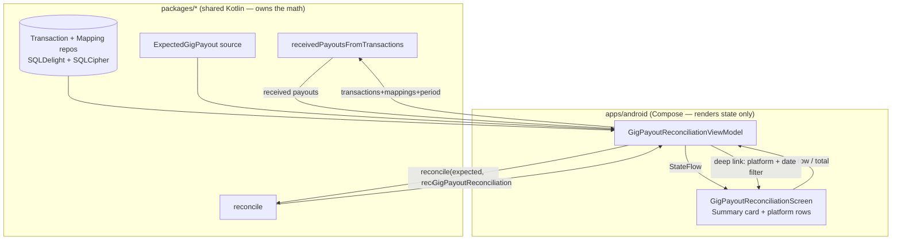
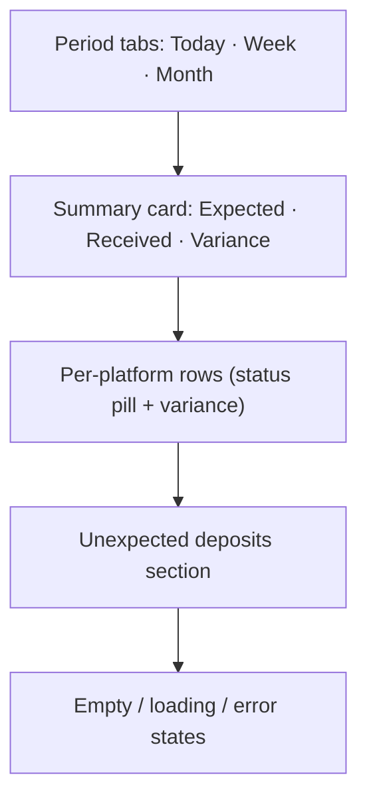

# Android Gig Payout Reconciliation by Platform — Design

> **Status:** PROPOSED — Pending human review
> **Issue:** [#2514](https://github.com/jrmoulckers/finance/issues/2514) — _Part of [#2133](https://github.com/jrmoulckers/finance/issues/2133)_
> **Platform:** Android / Wear OS (Jetpack Compose, Material 3)
> **Last Updated:** 2026-06-22
> **Owner:** @native-app-engineer

---

## Table of Contents

1. [Overview](#overview)
2. [Goals and Non-Goals](#goals-and-non-goals)
3. [Affected Android Surfaces](#affected-android-surfaces)
4. [Shared Dependencies (KMP)](#shared-dependencies-kmp)
5. [Architecture and Math Boundary](#architecture-and-math-boundary)
6. [Dashboard Layout](#dashboard-layout)
7. [Period Selection (Today / Week / Month)](#period-selection-today--week--month)
8. [Linking to Filtered Transactions](#linking-to-filtered-transactions)
9. [Offline-First Behavior](#offline-first-behavior)
10. [Screen States](#screen-states)
11. [Accessibility (TalkBack)](#accessibility-talkback)
12. [Test Plan](#test-plan)
13. [Implementation Readiness](#implementation-readiness)
14. [Open Questions](#open-questions)

---

## Overview

A gig worker wants to answer one question quickly: **"Did the money I expected actually show up?"**
This design covers an Android **Platform Earnings dashboard** that compares **expected payouts** against
**received deposits** per gig platform for **today, this week, and this month**, and links each row to the
filtered transaction list that backs the number.

It builds directly on the
[platform mapping design](./android-gig-platform-mapping.md) (which produces the matches) and reuses the
shared reconciliation engine — Compose renders the result and never computes variance itself.

## Goals and Non-Goals

**Goals**

- Show per-platform **Expected vs. Received vs. Variance** for Today / Week / Month.
- Classify each platform row as **Matched / Partial / Missing / Overpaid** using shared logic.
- Surface **unexpected deposits** (received with no expected payout).
- Deep-link every figure to the corresponding filtered transactions for trust and drill-down.

**Non-Goals**

- No new reconciliation math in Android — all of it lives in `packages/*`.
- No direct platform API ingestion of "expected" amounts; expected payouts come from the shared model
  (user-entered schedule or imported expectations) — out of scope here.
- No Play Store distribution; design-only while distribution is gated by
  [#1242](https://github.com/jrmoulckers/finance/issues/1242).

## Affected Android Surfaces

| Surface                         | Path                                                                                                                                                    | Change                                                          |
| ------------------------------- | ------------------------------------------------------------------------------------------------------------------------------------------------------- | --------------------------------------------------------------- |
| **New** — Reconciliation screen | `apps/android/.../ui/screens/gig/GigPayoutReconciliationScreen.kt`                                                                                      | Dashboard with period tabs + platform rows                      |
| **New** — Reconciliation VM     | `apps/android/.../ui/viewmodel/gig/GigPayoutReconciliationViewModel.kt`                                                                                 | Builds inputs, calls KMP `reconcile`, exposes `StateFlow`       |
| **New** — Summary cards         | `apps/android/.../ui/components/gig/ReconciliationSummaryCard.kt`                                                                                       | Expected/Received/Variance totals card                          |
| **New** — Platform row          | `apps/android/.../ui/components/gig/PlatformReconciliationRow.kt`                                                                                       | Per-platform status row with variance + status pill             |
| Period selector                 | reuse `DateRangePreset` from [`SearchFilterState.kt`](../../apps/android/src/main/kotlin/com/finance/android/ui/components/search/SearchFilterState.kt) | `TODAY` / `THIS_WEEK` / `THIS_MONTH`                            |
| Transactions screen             | [`apps/android/.../ui/screens/TransactionsScreen.kt`](../../apps/android/src/main/kotlin/com/finance/android/ui/screens/TransactionsScreen.kt)          | Accept pre-applied platform + date filter from a deep link      |
| DI wiring                       | [`apps/android/.../di/AppModule.kt`](../../apps/android/src/main/kotlin/com/finance/android/di/AppModule.kt)                                            | `viewModelOf(::GigPayoutReconciliationViewModel)`               |
| Navigation                      | [`apps/android/.../ui/navigation/FinanceNavHost.kt`](../../apps/android/src/main/kotlin/com/finance/android/ui/navigation/FinanceNavHost.kt)            | Route `gig/reconciliation` + deep link to filtered transactions |

## Shared Dependencies (KMP)

All reconciliation logic is already implemented in
[`packages/core/.../gig/payout/GigPayoutCalculator.kt`](../../packages/core/src/commonMain/kotlin/com/finance/core/gig/payout/GigPayoutCalculator.kt):

| KMP symbol                                            | Role on Android                                                                                                              |
| ----------------------------------------------------- | ---------------------------------------------------------------------------------------------------------------------------- |
| `GigPayoutCalculator.receivedPayoutsFromTransactions` | Turns matched income transactions into `ReceivedGigPayout`s for the period                                                   |
| `ExpectedGigPayout`                                   | Expected amount + date + platform + tolerance (source: shared expectations model)                                            |
| `GigPayoutCalculator.reconcile`                       | Date-bounded, single-use matching → `GigPayoutReconciliation`                                                                |
| `GigPayoutReconciliation`                             | Totals + per-item results + `unexpectedReceived`; exposes `matchedItems` / `partialItems` / `missingItems` / `overpaidItems` |
| `GigPayoutReconciliationItem`                         | Per-expected result: `status`, `received`, `receivedAmount`, `variance`                                                      |
| `GigPayoutReconciliationStatus`                       | `MATCHED` / `PARTIAL` / `MISSING` / `OVERPAID` — drives the status pill                                                      |
| `UnexpectedGigPayout`                                 | Deposits with `NO_EXPECTED_PAYOUT` — surfaced as a dedicated section                                                         |
| `GigPlatformMapping` / `matchPlatform`                | Reused from the mapping feature to attribute received deposits                                                               |

Amounts are integer `Cents`; formatting is locale-aware in the presentation layer only.

## Architecture and Math Boundary

**Rule:** the ViewModel assembles inputs (transactions, mappings, expected payouts, period bounds) and
calls `GigPayoutCalculator.reconcile`. Compose renders the returned `GigPayoutReconciliation`. No
variance, tolerance, or matching arithmetic happens in Android code.

## Dashboard Layout

- **Summary card (`ReconciliationSummaryCard`):** big totals for `totalExpected`, `totalReceived`, and
  computed `variance = received − expected` with a directional, non-judgmental label
  (e.g., "On track", "Short by $X", "Extra $X"). Color is paired with text/icon (never color alone).
- **Platform rows (`PlatformReconciliationRow`):** platform name, expected, received, variance, and a
  **status pill** mapped from `GigPayoutReconciliationStatus`:
  - `MATCHED` → "Matched" (success)
  - `PARTIAL` → "Partial" (caution)
  - `MISSING` → "Not received yet" (neutral/alert)
  - `OVERPAID` → "Over expected" (info)
- **Unexpected deposits:** a separate list of `unexpectedReceived` (e.g., a bonus or referral) so users
  can map them via the [mapping feature](./android-gig-platform-mapping.md) or recognize an error.

## Period Selection (Today / Week / Month)

- Reuse `DateRangePreset.TODAY / THIS_WEEK / THIS_MONTH` so behavior matches the existing transaction
  filters exactly (ISO week, current calendar month). The selected preset defines the `from`/`to`
  bounds passed to `receivedPayoutsFromTransactions` and the expected-payout window.
- A small "as of" timestamp clarifies that Today reflects deposits that have actually posted; pending
  deposits are excluded by the shared eligibility rules (non-void, non-deleted income).

## Linking to Filtered Transactions

Every figure is a **trust anchor** — tapping it must show the exact transactions behind it.

- Tapping a platform's **Received** value (or row) deep-links to
  [`TransactionsScreen`](../../apps/android/src/main/kotlin/com/finance/android/ui/screens/TransactionsScreen.kt)
  with the platform filter + the active date preset pre-applied (same `SearchFilterState` contract used
  by the [mapping design](./android-gig-platform-mapping.md#platform-filter-chip-transactions)).
- Tapping an **unexpected deposit** opens the single
  [`TransactionDetailScreen`](../../apps/android/src/main/kotlin/com/finance/android/ui/screens/TransactionDetailScreen.kt).
- Navigation passes platform id(s) + date preset as route arguments via
  [`FinanceNavHost`](../../apps/android/src/main/kotlin/com/finance/android/ui/navigation/FinanceNavHost.kt);
  the Transactions VM resolves matching through KMP, not local string logic.

## Offline-First Behavior

- **Load:** read transactions, mappings, and expected payouts from the local encrypted SQLDelight store
  first and reconcile in-memory; the dashboard is fully usable offline.
- **Refresh:** pull-to-refresh re-reads local state and reconciles; a background
  [`SyncWorker`](../../apps/android/src/main/kotlin/com/finance/android/sync/SyncWorker.kt) (WorkManager)
  brings in new deposits when connectivity returns, then the dashboard recomputes reactively.
- **Staleness:** show a "Last synced …" line; reconciliation is always against the latest **local** data,
  so figures are deterministic offline.
- **No writes** are required by this read-only dashboard except deep-link navigation state, so there is no
  conflict surface here; conflicts are handled upstream by the mapping/transaction features.

## Screen States

| State                           | Trigger                             | Compose treatment                                                                                     |
| ------------------------------- | ----------------------------------- | ----------------------------------------------------------------------------------------------------- |
| **Loading**                     | Initial reconcile                   | Skeleton summary card + 3 row placeholders; `contentDescription = "Loading payout reconciliation"`    |
| **Empty (no expected payouts)** | No `ExpectedGigPayout` for period   | Explainer + CTA "Add expected payouts" / link to mapping; show received-only totals                   |
| **Empty (no income)**           | No matched deposits in period       | "No platform deposits yet for {period}"                                                               |
| **Populated**                   | Reconciliation present              | Summary + rows + unexpected section                                                                   |
| **All matched**                 | every item `MATCHED`, no unexpected | Positive confirmation banner ("Everything reconciled")                                                |
| **Error**                       | Repository/sync failure             | Non-blocking `Snackbar` + **Retry**; show last good snapshot if available; `Timber.e` without amounts |
| **Offline**                     | No connectivity                     | Banner "Offline — showing last synced data"; dashboard remains interactive                            |

## Accessibility (TalkBack)

Follows [`accessibility-patterns.md`](./accessibility-patterns.md),
[`data-visualization.md`](./data-visualization.md), and
[`cognitive-accessibility.md`](./cognitive-accessibility.md).

- Each platform row exposes a single composed announcement:
  "DoorDash, expected 120 dollars, received 96 dollars, short by 24 dollars, status partial".
- Status is conveyed by **text + icon + color**, never color alone (color-blind safe).
- Summary totals are a labeled group; the variance reads with direction ("short" / "extra" / "on track").
- Tappable figures are exposed as buttons with role + action hint ("double-tap to view transactions").
- Period tabs are a tab list with selected-state announced; content reflows at 200% font scale.
- Amounts use locale-aware currency formatting with full words for screen readers where helpful.

## Test Plan

| Layer                                      | Coverage                                                                                                                                                                                               |
| ------------------------------------------ | ------------------------------------------------------------------------------------------------------------------------------------------------------------------------------------------------------ |
| **KMP (existing, referenced)**             | `GigPayoutCalculatorTest` covers reconcile/matching tolerance/date bounds; Android does not duplicate math tests                                                                                       |
| **ViewModel unit (`assembleDebug` path)**  | Period bounds map to correct `from`/`to`; received-payout assembly; mapping of `GigPayoutReconciliation` → UI rows; status pill mapping; unexpected-deposit surfacing; error → retry; offline snapshot |
| **Compose UI (androidTest / Robolectric)** | Period tab switch recomputes; tapping Received deep-links with correct platform + date args; empty/all-matched/error states render expected semantics                                                  |
| **Paparazzi snapshots**                    | Dashboard for each period; each status (`MATCHED`/`PARTIAL`/`MISSING`/`OVERPAID`); unexpected section; empty + error; light/dark + dynamic color; 1x and 2x font scale                                 |
| **Accessibility checks**                   | Row announcement composition; tappable-figure roles; non-color status encoding; large-font reflow                                                                                                      |

## Implementation Readiness

This is a **design deliverable**; it ships as documentation only.

**Buildable now (no enrollment required), per
[`human-gated-prerequisites.md`](../ops/human-gated-prerequisites.md) §2:**

- Implement the dashboard, `GigPayoutReconciliationViewModel`, deep-link wiring, and Koin module.
- Verify with `./gradlew :apps:android:assembleDebug`, JVM unit tests, and Paparazzi snapshots. The
  reconciliation engine already exists in `packages/core`.

**Distribution tail (gated by [#1242](https://github.com/jrmoulckers/finance/issues/1242)):**

- Release signing and Play Store upload remain **human-gated**; see
  [`human-gated-prerequisites.md` §3.1](../ops/human-gated-prerequisites.md#31-android-distribution--google-play-1242).
- No part of this dashboard requires the distribution tail to build or test locally.

## Open Questions

- Where do `ExpectedGigPayout` records originate on mobile — user-entered schedule, imported, or inferred?
  (Owned by `packages/*`; Android consumes whatever the shared source provides.)
- Default `dateToleranceDays` / `defaultToleranceCents` for mobile reconcile calls? (Recommend a small
  date tolerance to absorb weekend posting delays; confirm with @native-app-engineer.)
- Should the dashboard offer a Wear OS Tile/Complication for "today's expected vs received"? (Follow-up.)
