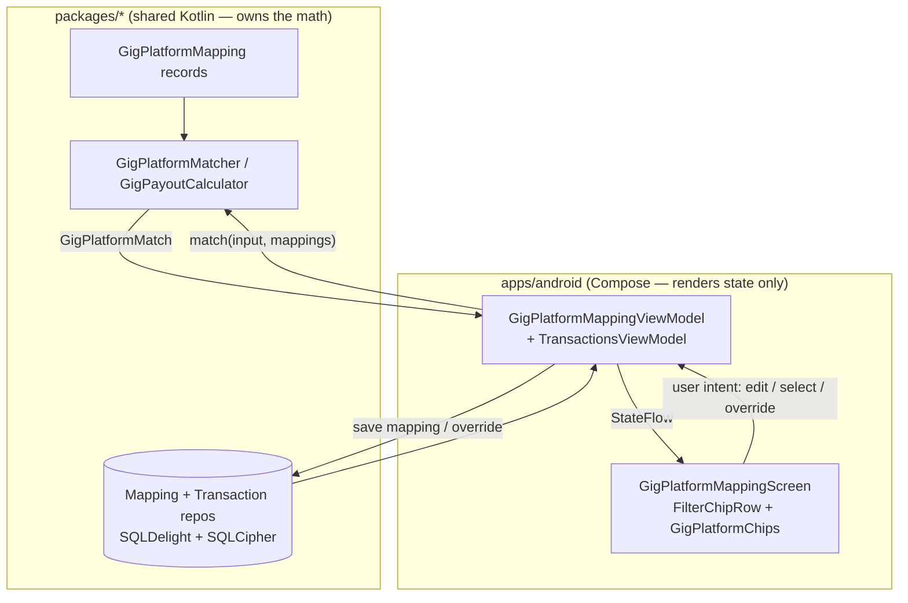
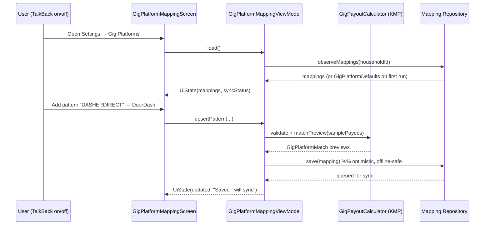
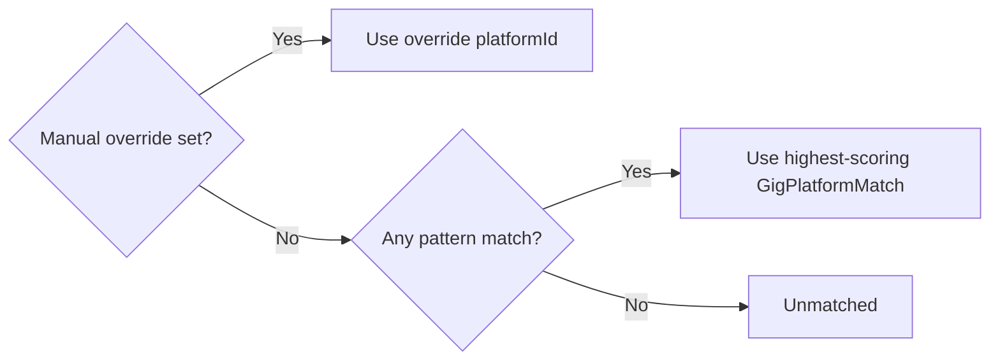

# Android Gig-Platform Mapping and Filters — Design

> **Status:** PROPOSED — Pending human review
> **Issue:** [#2512](https://github.com/jrmoulckers/finance/issues/2512) — _Part of [#2133](https://github.com/jrmoulckers/finance/issues/2133)_
> **Platform:** Android / Wear OS (Jetpack Compose, Material 3)
> **Last Updated:** 2026-06-22
> **Owner:** @native-app-engineer

---

## Table of Contents

1. [Overview](#overview)
2. [Goals and Non-Goals](#goals-and-non-goals)
3. [Affected Android Surfaces](#affected-android-surfaces)
4. [Shared Dependencies (KMP)](#shared-dependencies-kmp)
5. [Architecture and Math Boundary](#architecture-and-math-boundary)
6. [User Flows](#user-flows)
7. [Compose Surface Specs](#compose-surface-specs)
8. [Override Precedence](#override-precedence)
9. [Offline-First Behavior](#offline-first-behavior)
10. [Screen States](#screen-states)
11. [Accessibility (TalkBack)](#accessibility-talkback)
12. [Test Plan](#test-plan)
13. [Implementation Readiness](#implementation-readiness)
14. [Open Questions](#open-questions)

---

## Overview

Gig workers earn from several platforms (Uber, Lyft, DoorDash, Instacart, Upwork…) whose deposits
land in their bank feed under inconsistent payee names, descriptions, and account labels. This design
covers the **Android Compose settings surface and the transaction-filter entry points** that let a
user map those raw signals to a canonical gig platform, so that downstream features
([payout reconciliation](./android-gig-payout-reconciliation.md) and
[take-home summary](./android-gig-take-home-summary.md)) can attribute income correctly.

The design introduces:

- A **Gig Platforms settings screen** to review, edit, and add platform mappings (payee / description /
  account patterns).
- **Platform chips** as a new filter dimension wired into the existing transaction filter row.
- **Override precedence** rules so a user's explicit per-transaction choice always wins over an
  automatic pattern match.
- **Offline-first** load/save/sync expectations consistent with the rest of the app.

All matching and scoring math already exists in shared Kotlin Multiplatform (KMP) code — Compose only
renders shared state and forwards user intent.

## Goals and Non-Goals

**Goals**

- Let users map payees, descriptions, and deposit-account names to canonical gig platforms.
- Surface a **Platform** filter chip on the Transactions screen consistent with existing chips.
- Allow a per-transaction manual override that is durable and sync-safe.
- Work fully offline; reflect sync status without blocking edits.

**Non-Goals**

- No OAuth / direct platform API integrations (out of scope; see
  [`human-gated-prerequisites.md`](../ops/human-gated-prerequisites.md)).
- No new finance math in the Android layer — all attribution logic stays in `packages/*`.
- No Play Store distribution work; this issue is design-only while distribution is gated by
  [#1242](https://github.com/jrmoulckers/finance/issues/1242).

## Affected Android Surfaces

| Surface                          | Path                                                                                                                                                             | Change                                                             |
| -------------------------------- | ---------------------------------------------------------------------------------------------------------------------------------------------------------------- | ------------------------------------------------------------------ |
| Transactions screen              | [`apps/android/.../ui/screens/TransactionsScreen.kt`](../../apps/android/src/main/kotlin/com/finance/android/ui/screens/TransactionsScreen.kt)                   | Add a **Platform** filter chip + bottom-sheet selector             |
| Filter chip row                  | [`apps/android/.../ui/components/search/FilterChipRow.kt`](../../apps/android/src/main/kotlin/com/finance/android/ui/components/search/FilterChipRow.kt)         | New `onPlatformClick` chip slot with badge count                   |
| Filter state                     | [`apps/android/.../ui/components/search/SearchFilterState.kt`](../../apps/android/src/main/kotlin/com/finance/android/ui/components/search/SearchFilterState.kt) | New `GigPlatformFilter(selectedPlatformIds: Set<String>)`          |
| Transactions VM                  | [`apps/android/.../ui/viewmodel/TransactionsViewModel.kt`](../../apps/android/src/main/kotlin/com/finance/android/ui/viewmodel/TransactionsViewModel.kt)         | Extend `TransactionFilter` with platform; delegate matching to KMP |
| Transaction detail               | [`apps/android/.../ui/screens/TransactionDetailScreen.kt`](../../apps/android/src/main/kotlin/com/finance/android/ui/screens/TransactionDetailScreen.kt)         | "Gig platform" row with override action                            |
| **New** — Gig Platforms settings | `apps/android/.../ui/screens/gig/GigPlatformMappingScreen.kt`                                                                                                    | Mapping list + add/edit editor                                     |
| **New** — Mapping VM             | `apps/android/.../ui/viewmodel/gig/GigPlatformMappingViewModel.kt`                                                                                               | Holds mappings, save/sync, validation                              |
| **New** — Platform chips         | `apps/android/.../ui/components/gig/GigPlatformChips.kt`                                                                                                         | Reusable Material 3 chip row of platforms                          |
| DI wiring                        | [`apps/android/.../di/AppModule.kt`](../../apps/android/src/main/kotlin/com/finance/android/di/AppModule.kt)                                                     | `viewModelOf(::GigPlatformMappingViewModel)` + repository binding  |
| Navigation                       | [`apps/android/.../ui/navigation/FinanceNavHost.kt`](../../apps/android/src/main/kotlin/com/finance/android/ui/navigation/FinanceNavHost.kt)                     | Route `settings/gig-platforms`                                     |

## Shared Dependencies (KMP)

All matching and grouping logic lives in
[`packages/core/.../gig/payout/GigPayoutCalculator.kt`](../../packages/core/src/commonMain/kotlin/com/finance/core/gig/payout/GigPayoutCalculator.kt):

| KMP symbol                                                       | Role on Android                                                                                             |
| ---------------------------------------------------------------- | ----------------------------------------------------------------------------------------------------------- |
| `GigPlatformMapping`                                             | The serializable mapping record (payee / description / account pattern lists) edited by the settings screen |
| `GigPlatformDefaults.mappings`                                   | Seed list (Uber, Lyft, DoorDash, Instacart, Grubhub, Shipt, Upwork, Fiverr) shown on first run              |
| `GigPayoutMatchInput`                                            | Built from a `Transaction` (payee, note, account name) for evaluation                                       |
| `GigPlatformMatcher.match` / `GigPayoutCalculator.matchPlatform` | Deterministic, weighted, case-insensitive matcher — **the only attribution authority**                      |
| `GigPlatformMatch`                                               | Result (platformId, name, score, matched fields/patterns) used for chips + "why matched" detail             |
| `GigPayoutCalculator.groupIncomeByPlatform`                      | Groups income for the filtered list; powers the Platform chip counts                                        |

The mapping records are persisted via the existing repository/sync stack (`packages/sync`, SQLDelight

- SQLCipher Android driver). No new persistence format is introduced by Android.

## Architecture and Math Boundary

**Rule:** Compose renders shared state; it never owns finance/attribution math. The ViewModel adapts
repository flows into immutable UI state and calls KMP for every matching decision.

**What the Android layer must NOT do:** re-implement normalization, scoring, weighting, or tie-breaking.
If a behavior is missing (e.g., a new tie-break rule), it is filed against the KMP package, not patched
in Compose.

## User Flows

## Compose Surface Specs

### Gig Platforms settings screen

- **Top app bar:** title "Gig platforms", back navigation, overflow → "Reset to defaults".
- **List:** one `Card` per platform showing display name, platform icon/initial, and chips summarizing
  pattern counts ("3 payee · 2 description · 1 account"). Tapping a card opens the editor.
- **Editor (bottom sheet or detail):** three labeled sections — Payee patterns, Description patterns,
  Account patterns — each an editable chip group with add/remove. A **live preview** row shows which
  sample payees would now match, computed by calling `GigPayoutCalculator.matchPlatform`.
- **Add platform** FAB → name + at least one pattern (mirrors `GigPlatformMapping` `init` validation:
  non-blank id/name, ≥1 non-blank pattern).
- **Empty seed:** first run pre-populates from `GigPlatformDefaults.mappings` (read-only until edited).

### Platform filter chip (Transactions)

- New `FilterChip` in the existing `FilterChipRow`, icon `Icons.Default.LocalShipping` (or platform
  glyph), badge count = number of selected platforms, consistent with the existing badge pattern.
- Tapping opens a multi-select bottom sheet listing all mapped platforms plus an **"Unmatched"** pseudo
  row (maps to `GigPayoutCalculator.UNMATCHED_PLATFORM_NAME`).
- Selection updates `SearchFilterState`; the VM filters transactions by evaluating each transaction's
  `GigPayoutMatchInput` against current mappings via KMP — never by string comparison in Compose.

### Transaction detail — platform row

- Shows the matched platform name + a subtle "Auto" or "Manual" tag.
- "Change platform" opens the same platform chip selector; choosing one writes a **manual override**
  (see below). A "Clear override" action reverts to automatic matching.

## Override Precedence

Attribution resolves in this strict order (highest wins):

1. **Per-transaction manual override** — an explicit `platformId` the user set on a transaction. Stored
   on the transaction record (custom field / tag) and synced; survives mapping edits.
2. **Highest-scoring automatic match** — `GigPlatformMatcher.match` result over current mappings
   (payee weight > description > account, with exact-match bonus and length tiebreak).
3. **Unmatched bucket** — no override and no pattern hit ⇒ grouped under "Unmatched".

The override is data the user owns; Compose presents the precedence outcome that KMP computes and the
repository stores. The UI must clearly distinguish **Auto** vs **Manual** so the user understands why a
transaction is attributed a given way.

## Offline-First Behavior

- **Load:** read mappings + transactions from the local encrypted SQLDelight store first; render
  immediately. Network/sync is never on the critical path.
- **Save:** writes are **optimistic** — update local state, mark the row "pending sync", and enqueue via
  the existing sync stack ([`SyncWorker`](../../apps/android/src/main/kotlin/com/finance/android/sync/SyncWorker.kt),
  WorkManager). No `AlarmManager`/`JobScheduler`.
- **Conflict:** mapping/override merges defer to the shared conflict strategy
  (`SyncStatusViewModel` → `ConflictStrategy.resolverFor()`); the UI shows a non-blocking
  "Resolved from another device" note when a remote change wins.
- **Status surfacing:** a small inline indicator (`Synced` / `Pending` / `Offline`) reuses existing sync
  status styling; edits remain fully available offline.

## Screen States

| State                     | Trigger                           | Compose treatment                                                                                                  |
| ------------------------- | --------------------------------- | ------------------------------------------------------------------------------------------------------------------ |
| **Loading**               | Initial read                      | Skeleton cards; `contentDescription = "Loading gig platforms"`                                                     |
| **Empty (no mappings)**   | Fresh install before seed         | Friendly empty state + "Use suggested platforms" CTA that loads `GigPlatformDefaults`                              |
| **Populated**             | Mappings present                  | Card list + filter chips                                                                                           |
| **Saving / Pending sync** | After edit, offline or syncing    | Inline "Saving…" / "Pending sync" affordance; controls stay enabled                                                |
| **Error (save/sync)**     | Repository or sync failure        | Non-blocking `Snackbar` with **Retry**; never lose the user's local edit; log via `Timber.e` (no financial values) |
| **No results (filter)**   | Platform filter excludes all rows | "No transactions for selected platforms" + "Clear platform filter"                                                 |

## Accessibility (TalkBack)

Follows [`accessibility-patterns.md`](./accessibility-patterns.md) and
[`cognitive-accessibility.md`](./cognitive-accessibility.md).

- Every chip, card, and icon-button has a meaningful `contentDescription` (e.g., a selected DoorDash
  chip announces "DoorDash, selected, platform filter").
- Pattern chips announce their field group: "Payee pattern, DASHERDIRECT, double-tap to remove".
- The Auto/Manual tag is exposed as text, not color alone (color-blind safe); pair color with a label.
- Live-region announcement on save: "Mapping saved, will sync when online".
- Touch targets ≥ 48 dp; content reflows and remains usable at 200% font scale.
- Selector bottom sheets are reachable by Switch Access; focus order is logical (header → options →
  apply/clear).

## Test Plan

| Layer                                      | Coverage                                                                                                                                                                                                                          |
| ------------------------------------------ | --------------------------------------------------------------------------------------------------------------------------------------------------------------------------------------------------------------------------------- |
| **KMP (existing, referenced)**             | `GigPayoutCalculatorTest` already covers matching/grouping; Android relies on it and does **not** duplicate math tests                                                                                                            |
| **ViewModel unit (`assembleDebug` path)**  | `GigPlatformMappingViewModel`: load/seed defaults, upsert/remove pattern, validation errors, optimistic save, error → retry; `TransactionsViewModel`: platform filter applied, "Unmatched" handling, override precedence ordering |
| **Compose UI (androidTest / Robolectric)** | Chip selection toggles state; add/remove pattern updates preview; empty/error/no-results states render expected `contentDescription`s                                                                                             |
| **Paparazzi snapshots**                    | `GigPlatformMappingScreen` (loading, empty-seed, populated, error), Platform filter sheet, detail platform row (Auto vs Manual), light/dark + dynamic color, 1x and 2x font scale                                                 |
| **Accessibility checks**                   | `contentDescription` presence assertions; TalkBack focus-order manual pass; large-font reflow snapshot                                                                                                                            |

## Implementation Readiness

This is a **design deliverable**; it ships as documentation only.

**Buildable now (no enrollment required), per
[`human-gated-prerequisites.md`](../ops/human-gated-prerequisites.md) §2:**

- Implement Compose screens, `GigPlatformMappingViewModel`, filter wiring, and Koin modules.
- Verify with `./gradlew :apps:android:assembleDebug` (sideload), JVM unit tests, and Paparazzi
  snapshots. All shared math is already present in `packages/core`.

**Distribution tail (gated by [#1242](https://github.com/jrmoulckers/finance/issues/1242)):**

- Release signing, Play Store track upload, and any production push/entitlement work remain
  **human-gated**. See [`human-gated-prerequisites.md` §3.1](../ops/human-gated-prerequisites.md#31-android-distribution--google-play-1242).
- Nothing in this feature requires the distribution tail to be implemented or tested locally.

## Open Questions

- Should manual overrides live as a transaction tag, a custom field, or a dedicated column? (Decide with
  @native-app-engineer; affects sync schema and is owned by `packages/*`.)
- Do we expose per-platform color theming, or keep platform identity to icon + label for color-blind
  safety? (Recommend label-first.)
- Should "Reset to defaults" merge with or replace user edits? (Recommend additive merge with confirm.)
